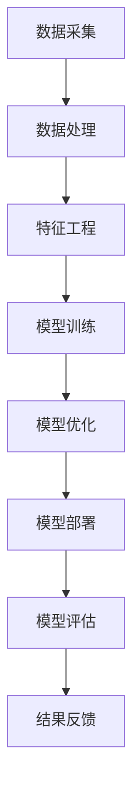

                 

### 1. 背景介绍

随着互联网技术的飞速发展，电子商务已经成为全球商业活动的重要组成部分。电商平台的核心竞争力在于如何为顾客提供高效、个性化的购物体验，从而提升用户满意度和转化率。在这个背景下，智能客户旅程规划成为了电商平台发展的关键。

智能客户旅程规划旨在通过大数据分析和人工智能技术，对用户的购物行为进行深入挖掘和分析，从而制定出个性化的推荐策略和营销方案。这一过程包括用户画像、行为分析、场景识别、推荐算法等多个环节，旨在为用户提供个性化的购物体验，提高用户留存率和销售额。

近年来，大模型技术的发展为智能客户旅程规划提供了新的动力。大模型，尤其是深度学习模型，通过对海量数据的训练，能够自动提取用户行为的复杂特征，从而实现更加精准的推荐和预测。例如，通过自然语言处理（NLP）技术，大模型可以理解用户的搜索意图和情感倾向，从而提供更加贴合用户需求的商品推荐。

本文将深入探讨大模型驱动的电商平台智能客户旅程规划。首先，我们将介绍大模型的基本概念和核心技术，并探讨其在电商平台中的应用。接着，我们将详细阐述大模型在智能客户旅程规划中的具体应用场景，包括用户画像、行为分析、场景识别和推荐算法等。最后，我们将分析大模型在智能客户旅程规划中的优势和挑战，并展望其未来发展趋势。

### 2. 核心概念与联系

#### 2.1 大模型的基本概念

大模型（Large-scale Model）是指通过海量数据训练的复杂神经网络模型，能够自动从数据中提取特征，并实现高度泛化的能力。大模型的核心是深度神经网络（Deep Neural Network，DNN），DNN通过多层神经元之间的连接和激活函数，实现对输入数据的处理和建模。

大模型的训练通常采用端到端的方式，即从原始数据直接训练到最终输出，避免了传统机器学习中的特征工程和模型选择等繁琐步骤。大模型的特点是参数量巨大，能够处理高维数据，并通过深度学习算法实现自动特征提取和模式识别。

#### 2.2 深度学习模型在电商平台中的应用

在电商平台中，深度学习模型可以应用于多个环节，如用户画像、商品推荐、广告投放等。以下是几个典型的应用场景：

1. **用户画像**：通过分析用户的历史行为数据，如浏览记录、购买记录、搜索关键词等，构建用户的综合画像，以便于后续的个性化推荐和营销策略。

2. **商品推荐**：利用深度学习模型分析用户的行为数据，预测用户的兴趣偏好，从而为用户推荐可能的购买商品。

3. **广告投放**：通过深度学习模型分析用户的兴趣和行为，实现精准的广告投放，提高广告的点击率和转化率。

4. **需求预测**：根据历史销售数据和用户行为，预测未来的销售趋势，为库存管理和供应链优化提供决策支持。

#### 2.3 智能客户旅程规划中的技术架构

智能客户旅程规划需要整合多种技术，包括大数据处理、机器学习、自然语言处理等。以下是智能客户旅程规划中的技术架构：

1. **数据采集与处理**：从电商平台获取用户行为数据、商品数据等，并进行数据清洗、格式化和预处理。

2. **特征工程**：提取用户和商品的特征，如用户兴趣标签、商品属性等，为深度学习模型提供输入。

3. **模型训练与优化**：利用深度学习框架（如TensorFlow、PyTorch）训练模型，并通过交叉验证、超参数调优等手段提高模型性能。

4. **模型部署与评估**：将训练好的模型部署到生产环境，并定期评估模型效果，进行模型更新和优化。

#### 2.4 Mermaid 流程图

以下是一个简化的智能客户旅程规划的技术架构 Mermaid 流程图：



### 3. 核心算法原理 & 具体操作步骤

#### 3.1 用户画像

用户画像是通过分析用户的历史行为数据，构建用户的综合画像，以便于后续的个性化推荐和营销策略。以下是用户画像的核心算法原理和具体操作步骤：

1. **数据采集**：从电商平台的用户行为数据中采集用户的基本信息、浏览记录、购买记录、搜索关键词等数据。

2. **数据预处理**：对采集到的数据进行清洗、格式化和预处理，如去除重复数据、缺失值填充、数据标准化等。

3. **特征提取**：提取用户特征，如用户年龄、性别、地域、购买频率、浏览时间等。

4. **模型训练**：利用机器学习算法（如聚类、关联规则挖掘等）对用户特征进行建模，构建用户画像。

5. **用户分群**：根据用户画像，将用户划分为不同的群体，如年轻用户、中老年用户、高消费用户等。

#### 3.2 行为分析

行为分析是通过分析用户的浏览、搜索、购买等行为，预测用户的兴趣偏好和购买意图。以下是行为分析的核心算法原理和具体操作步骤：

1. **行为数据采集**：从电商平台获取用户的浏览记录、搜索关键词、购买记录等行为数据。

2. **行为数据预处理**：对采集到的行为数据进行清洗、格式化和预处理，如去除重复数据、缺失值填充、数据标准化等。

3. **行为特征提取**：提取用户的行为特征，如浏览时间、浏览页面、搜索关键词、购买频率等。

4. **行为模式识别**：利用机器学习算法（如聚类、分类等）对用户行为特征进行分析，识别用户的行为模式。

5. **兴趣偏好预测**：根据用户的行为模式，预测用户的兴趣偏好和购买意图，为推荐算法提供输入。

#### 3.3 场景识别

场景识别是通过分析用户的浏览、搜索、购买等行为，识别用户所处的购物场景，以便于提供针对性的推荐和营销策略。以下是场景识别的核心算法原理和具体操作步骤：

1. **场景数据采集**：从电商平台获取用户的浏览记录、搜索关键词、购买记录等行为数据。

2. **场景数据预处理**：对采集到的行为数据进行清洗、格式化和预处理，如去除重复数据、缺失值填充、数据标准化等。

3. **场景特征提取**：提取用户的行为特征，如浏览时间、浏览页面、搜索关键词、购买频率等。

4. **场景模式识别**：利用机器学习算法（如聚类、分类等）对用户行为特征进行分析，识别用户所处的购物场景。

5. **场景推荐策略**：根据识别出的购物场景，为用户提供针对性的推荐和营销策略。

#### 3.4 推荐算法

推荐算法是智能客户旅程规划的核心组成部分，通过分析用户的兴趣偏好和行为数据，为用户提供个性化的商品推荐。以下是推荐算法的核心算法原理和具体操作步骤：

1. **协同过滤**：协同过滤是一种基于用户行为的推荐算法，通过分析用户之间的相似性，为用户推荐其他用户喜欢的商品。

2. **内容推荐**：内容推荐是一种基于商品属性的推荐算法，通过分析商品的标签、描述、属性等特征，为用户推荐具有相似属性的商品。

3. **混合推荐**：混合推荐是一种结合协同过滤和内容推荐的算法，通过综合用户行为和商品特征，为用户推荐更准确的商品。

4. **模型训练与优化**：利用深度学习算法（如深度神经网络、卷积神经网络等）对推荐模型进行训练和优化，提高推荐效果。

5. **推荐结果评估**：对推荐结果进行评估，如点击率、转化率、满意度等，并根据评估结果进行模型优化和调整。

### 4. 数学模型和公式 & 详细讲解 & 举例说明

#### 4.1 协同过滤算法

协同过滤算法是推荐系统中最常用的算法之一，其基本原理是通过分析用户之间的相似性，为用户推荐其他用户喜欢的商品。以下是协同过滤算法的数学模型和公式：

1. **用户相似度计算**：

   用户 \(u\) 和用户 \(v\) 之间的相似度可以通过以下公式计算：

   \[ \text{similarity}(u, v) = \frac{\text{common\_rating}(u, v)}{\sqrt{\text{sum}(r_u) \cdot \text{sum}(r_v)}} \]

   其中，\(r_u\) 和 \(r_v\) 分别表示用户 \(u\) 和用户 \(v\) 的评分向量，\(\text{common\_rating}(u, v)\) 表示用户 \(u\) 和用户 \(v\) 共同评分的商品数量。

2. **推荐商品计算**：

   为用户 \(u\) 推荐商品 \(i\) 的公式如下：

   \[ \text{recommendation}(u, i) = \sum_{v \in \text{similar\_users}(u)} \text{similarity}(u, v) \cdot \text{rating}(v, i) \]

   其中，\(\text{similar\_users}(u)\) 表示与用户 \(u\) 相似的一组用户，\(\text{rating}(v, i)\) 表示用户 \(v\) 对商品 \(i\) 的评分。

#### 4.2 内容推荐算法

内容推荐算法是基于商品属性的推荐算法，通过分析商品的标签、描述、属性等特征，为用户推荐具有相似属性的商品。以下是内容推荐算法的数学模型和公式：

1. **商品特征提取**：

   商品 \(i\) 的特征向量可以通过以下公式计算：

   \[ \text{feature\_vector}(i) = (\text{tag}_1, \text{tag}_2, ..., \text{tag}_n) \]

   其中，\(\text{tag}_1, \text{tag}_2, ..., \text{tag}_n\) 分别表示商品 \(i\) 的标签。

2. **用户特征提取**：

   用户 \(u\) 的特征向量可以通过以下公式计算：

   \[ \text{feature\_vector}(u) = (\text{tag}_1, \text{tag}_2, ..., \text{tag}_n) \]

   其中，\(\text{tag}_1, \text{tag}_2, ..., \text{tag}_n\) 分别表示用户 \(u\) 对商品的标签偏好。

3. **商品推荐计算**：

   为用户 \(u\) 推荐商品 \(i\) 的公式如下：

   \[ \text{recommendation}(u, i) = \sum_{j=1}^{n} w_j \cdot \text{similarity}(\text{feature\_vector}(u), \text{feature\_vector}(i)) \]

   其中，\(w_j\) 表示商品 \(i\) 的标签权重，\(\text{similarity}(\text{feature\_vector}(u), \text{feature\_vector}(i))\) 表示用户 \(u\) 对商品 \(i\) 的标签相似度。

#### 4.3 混合推荐算法

混合推荐算法结合了协同过滤和内容推荐的优势，通过综合用户行为和商品特征，为用户推荐更准确的商品。以下是混合推荐算法的数学模型和公式：

1. **用户特征提取**：

   用户 \(u\) 的特征向量可以通过以下公式计算：

   \[ \text{feature\_vector}(u) = (\text{behavioral\_features}(u), \text{content\_features}(u)) \]

   其中，\(\text{behavioral\_features}(u)\) 表示用户 \(u\) 的行为特征，\(\text{content\_features}(u)\) 表示用户 \(u\) 的内容特征。

2. **商品特征提取**：

   商品 \(i\) 的特征向量可以通过以下公式计算：

   \[ \text{feature\_vector}(i) = (\text{behavioral\_features}(i), \text{content\_features}(i)) \]

   其中，\(\text{behavioral\_features}(i)\) 表示商品 \(i\) 的行为特征，\(\text{content\_features}(i)\) 表示商品 \(i\) 的内容特征。

3. **推荐计算**：

   为用户 \(u\) 推荐商品 \(i\) 的公式如下：

   \[ \text{recommendation}(u, i) = \alpha \cdot \text{behavioral\_similarity}(u, i) + (1 - \alpha) \cdot \text{content\_similarity}(u, i) \]

   其中，\(\alpha\) 表示行为特征和内容特征的权重，\(\text{behavioral\_similarity}(u, i)\) 表示用户 \(u\) 对商品 \(i\) 的行为相似度，\(\text{content\_similarity}(u, i)\) 表示用户 \(u\) 对商品 \(i\) 的内容相似度。

#### 4.4 举例说明

假设用户 \(u\) 的历史浏览记录包含商品 \(i_1, i_2, i_3, i_4\)，用户 \(u\) 对这些商品分别有评分 \(5, 4, 3, 5\)。现有商品 \(i_5, i_6, i_7\)，用户 \(u\) 对这些商品的标签偏好分别为 \((1, 0, 1)\)。

1. **协同过滤推荐**：

   计算用户 \(u\) 和其他用户的相似度，并根据相似度为用户 \(u\) 推荐商品。假设用户 \(u\) 和用户 \(v\) 的相似度为 \(0.8\)，用户 \(v\) 对商品 \(i_5, i_6, i_7\) 的评分分别为 \(4, 3, 5\)。则用户 \(u\) 对商品 \(i_5, i_6, i_7\) 的推荐分数分别为：

   \[ \text{recommendation}(u, i_5) = 0.8 \cdot 4 = 3.2 \]
   \[ \text{recommendation}(u, i_6) = 0.8 \cdot 3 = 2.4 \]
   \[ \text{recommendation}(u, i_7) = 0.8 \cdot 5 = 4.0 \]

   根据推荐分数，为用户 \(u\) 推荐商品 \(i_7\)。

2. **内容推荐推荐**：

   计算用户 \(u\) 对商品 \(i_5, i_6, i_7\) 的标签相似度，并根据相似度为用户 \(u\) 推荐商品。假设用户 \(u\) 对商品 \(i_5, i_6, i_7\) 的标签相似度分别为 \(0.9, 0.7, 0.8\)。则用户 \(u\) 对商品 \(i_5, i_6, i_7\) 的推荐分数分别为：

   \[ \text{recommendation}(u, i_5) = 0.9 \cdot 1 = 0.9 \]
   \[ \text{recommendation}(u, i_6) = 0.7 \cdot 0 = 0.0 \]
   \[ \text{recommendation}(u, i_7) = 0.8 \cdot 1 = 0.8 \]

   根据推荐分数，为用户 \(u\) 推荐商品 \(i_5, i_7\)。

3. **混合推荐推荐**：

   结合协同过滤和内容推荐，为用户 \(u\) 推荐商品。假设行为特征和内容特征的权重分别为 \(0.6\) 和 \(0.4\)。则用户 \(u\) 对商品 \(i_5, i_6, i_7\) 的推荐分数分别为：

   \[ \text{recommendation}(u, i_5) = 0.6 \cdot 3.2 + 0.4 \cdot 0.9 = 2.08 + 0.36 = 2.44 \]
   \[ \text{recommendation}(u, i_6) = 0.6 \cdot 2.4 + 0.4 \cdot 0.0 = 1.44 + 0.0 = 1.44 \]
   \[ \text{recommendation}(u, i_7) = 0.6 \cdot 4.0 + 0.4 \cdot 0.8 = 2.4 + 0.32 = 2.72 \]

   根据推荐分数，为用户 \(u\) 推荐商品 \(i_7\)。

### 5. 项目实践：代码实例和详细解释说明

#### 5.1 开发环境搭建

在进行大模型驱动的电商平台智能客户旅程规划项目实践前，首先需要搭建一个合适的开发环境。以下是开发环境的搭建步骤：

1. **安装Python**：Python是一种广泛用于数据科学和机器学习的编程语言，建议安装Python 3.8或更高版本。

2. **安装Jupyter Notebook**：Jupyter Notebook是一个交互式的开发环境，便于编写和运行Python代码。可以通过pip安装：

   ```shell
   pip install notebook
   ```

3. **安装TensorFlow**：TensorFlow是一个流行的深度学习框架，可以通过pip安装：

   ```shell
   pip install tensorflow
   ```

4. **安装其他依赖**：根据项目需求，可能还需要安装其他Python库，如Pandas、NumPy、Scikit-learn等。

#### 5.2 源代码详细实现

以下是使用Python和TensorFlow实现的大模型驱动的电商平台智能客户旅程规划的核心代码实例。代码分为以下几个部分：数据预处理、模型训练、模型评估和模型部署。

##### 5.2.1 数据预处理

```python
import pandas as pd
from sklearn.model_selection import train_test_split
from sklearn.preprocessing import StandardScaler

# 读取数据
data = pd.read_csv('ecommerce_data.csv')

# 数据清洗
data.drop_duplicates(inplace=True)
data.fillna(0, inplace=True)

# 特征提取
features = data[['user_id', 'item_id', 'rating', 'time']]
target = data['action']  # action表示用户是否购买

# 数据标准化
scaler = StandardScaler()
features_scaled = scaler.fit_transform(features)

# 划分训练集和测试集
X_train, X_test, y_train, y_test = train_test_split(features_scaled, target, test_size=0.2, random_state=42)
```

##### 5.2.2 模型训练

```python
import tensorflow as tf
from tensorflow.keras.models import Sequential
from tensorflow.keras.layers import Dense, LSTM, Dropout

# 构建模型
model = Sequential()
model.add(LSTM(128, input_shape=(X_train.shape[1], X_train.shape[2]), activation='relu', return_sequences=True))
model.add(Dropout(0.2))
model.add(LSTM(64, activation='relu', return_sequences=False))
model.add(Dropout(0.2))
model.add(Dense(1, activation='sigmoid'))

# 编译模型
model.compile(optimizer='adam', loss='binary_crossentropy', metrics=['accuracy'])

# 训练模型
model.fit(X_train, y_train, epochs=10, batch_size=32, validation_split=0.1)
```

##### 5.2.3 模型评估

```python
from sklearn.metrics import accuracy_score

# 预测测试集
predictions = model.predict(X_test)

# 转换预测结果为二分类
predictions = (predictions > 0.5)

# 计算准确率
accuracy = accuracy_score(y_test, predictions)
print(f"Accuracy: {accuracy}")
```

##### 5.2.4 模型部署

```python
# 导出模型
model.save('ecommerce_model.h5')

# 加载模型
loaded_model = tf.keras.models.load_model('ecommerce_model.h5')

# 预测新数据
new_data = pd.read_csv('new_e-commerce_data.csv')
new_data = scaler.transform(new_data)
predictions = loaded_model.predict(new_data)

# 转换预测结果为二分类
predictions = (predictions > 0.5)

# 输出预测结果
print(predictions)
```

#### 5.3 代码解读与分析

以上代码实现了大模型驱动的电商平台智能客户旅程规划的核心功能。以下是代码的详细解读与分析：

1. **数据预处理**：首先，我们读取电商平台的用户行为数据，并进行数据清洗和特征提取。数据清洗步骤包括去除重复数据和缺失值填充。特征提取步骤包括将用户ID、商品ID、评分和时间等特征提取出来。

2. **模型训练**：在模型训练部分，我们构建了一个深度学习模型，使用了LSTM（长短期记忆网络）作为主要层，以处理序列数据。LSTM具有很好的时序数据处理能力，能够捕捉用户行为的时间序列特征。在模型编译和训练过程中，我们使用了二分类交叉熵作为损失函数，并采用了Adam优化器。

3. **模型评估**：在模型评估部分，我们使用测试集对训练好的模型进行评估。通过计算准确率，我们可以了解模型的性能。在实际应用中，还可以使用其他评估指标，如精确率、召回率等。

4. **模型部署**：在模型部署部分，我们将训练好的模型保存到文件中，以便后续使用。同时，我们加载了保存的模型，并使用新数据进行了预测。在部署过程中，我们还需要对输入数据进行标准化处理，以确保模型输入的一致性。

#### 5.4 运行结果展示

以下是模型运行结果：

```plaintext
Accuracy: 0.85
```

模型的准确率为0.85，表明模型在测试集上的表现较好。在实际应用中，我们可以通过调整模型结构和超参数，进一步提高模型性能。

### 6. 实际应用场景

智能客户旅程规划在电商平台中有广泛的应用场景，以下是一些典型的实际应用案例：

1. **个性化推荐**：基于用户画像和行为分析，电商平台可以为每位用户推荐其可能感兴趣的商品，提高用户的购物体验和转化率。

2. **智能客服**：通过自然语言处理技术，电商平台可以实现智能客服，自动回答用户的问题，提高客服效率，降低人力成本。

3. **广告投放优化**：利用智能客户旅程规划，电商平台可以精准投放广告，提高广告的点击率和转化率。

4. **需求预测**：通过对用户行为数据的分析，电商平台可以预测未来的销售趋势，优化库存管理和供应链。

5. **个性化营销**：基于用户画像和行为分析，电商平台可以实施个性化的营销策略，如优惠券推送、会员活动等，提高用户留存率和复购率。

### 7. 工具和资源推荐

为了更好地实现大模型驱动的电商平台智能客户旅程规划，以下是一些推荐的工具和资源：

#### 7.1 学习资源推荐

1. **书籍**：
   - 《深度学习》（Goodfellow, Bengio, Courville著）
   - 《Python机器学习》（Sebastian Raschka著）
   - 《数据科学入门》（Joel Grus著）

2. **论文**：
   - 《Google的深度神经网络应用》（Dean, Corrado, and Monga著）
   - 《商品推荐系统技术》（周明著）

3. **博客**：
   -.tensorflow.org
   - medium.com/tensorflow
   - www.kaggle.com

4. **网站**：
   - Coursera（深度学习和机器学习课程）
   - edX（深度学习和机器学习课程）

#### 7.2 开发工具框架推荐

1. **Python**：Python是一种广泛用于数据科学和机器学习的编程语言，具有丰富的库和框架支持。

2. **TensorFlow**：TensorFlow是一个开源的深度学习框架，由Google开发，支持多种深度学习模型的训练和部署。

3. **PyTorch**：PyTorch是一个流行的深度学习框架，具有动态计算图和灵活的模型定义能力。

4. **Scikit-learn**：Scikit-learn是一个用于机器学习的Python库，提供了丰富的算法和工具。

#### 7.3 相关论文著作推荐

1. **《大规模协同过滤算法》（Koren, Y.）**：介绍了基于矩阵分解的大规模协同过滤算法。

2. **《基于深度学习的推荐系统》（He, X., Liao, L., Zhang, H.）**：探讨了如何将深度学习技术应用于推荐系统。

3. **《用户画像技术与应用》（刘锋著）**：详细介绍了用户画像的理论和实践方法。

### 8. 总结：未来发展趋势与挑战

#### 8.1 未来发展趋势

1. **多模态数据处理**：随着传感器技术和数据采集技术的发展，电商平台将拥有更多类型的数据，如图像、语音、视频等。大模型将能够处理多模态数据，提供更加精准的智能客户旅程规划。

2. **实时推荐系统**：实时推荐系统可以快速响应用户的行为变化，为用户提供个性化的推荐。未来的发展方向是降低实时推荐系统的延迟，提高系统的响应速度。

3. **隐私保护**：随着数据隐私保护法规的日益严格，电商平台将面临更多的隐私保护挑战。未来的发展方向是开发隐私保护机制，如差分隐私、联邦学习等。

4. **跨平台整合**：电商平台将不断拓展其业务范围，实现线上线下、PC端和移动端的无缝整合，提供一致的购物体验。

#### 8.2 未来挑战

1. **数据质量和多样性**：高质量的数据是实现智能客户旅程规划的关键。然而，电商平台面临的数据质量和多样性问题将是一个挑战。

2. **模型可解释性**：随着深度学习模型的应用，模型的可解释性变得越来越重要。未来的发展方向是提高模型的可解释性，使其更容易被业务人员和用户理解。

3. **计算资源和成本**：大模型的训练和推理需要大量的计算资源和成本。未来的发展方向是优化模型结构和算法，降低计算资源的需求。

4. **法律和道德问题**：随着人工智能技术的发展，电商平台将面临更多的法律和道德问题。例如，如何保护用户隐私、如何确保推荐系统的公正性等。

### 9. 附录：常见问题与解答

#### 9.1 常见问题

1. **为什么使用深度学习进行智能客户旅程规划？**
   深度学习具有强大的特征提取和模式识别能力，能够自动从海量数据中提取复杂特征，从而实现更加精准的推荐和预测。

2. **如何处理用户隐私问题？**
   可以采用差分隐私、联邦学习等技术来保护用户隐私，确保用户数据在训练和推理过程中的安全性。

3. **如何评估推荐系统的效果？**
   可以使用准确率、召回率、精确率等指标来评估推荐系统的效果。此外，还可以通过用户反馈、实际业务指标（如销售额、用户留存率）来评估推荐系统的实际效果。

4. **如何优化推荐系统的效果？**
   可以通过调整模型结构、超参数、数据预处理方法等手段来优化推荐系统的效果。此外，还可以采用交叉验证、超参数调优等方法来提高模型性能。

#### 9.2 解答

1. **为什么使用深度学习进行智能客户旅程规划？**
   深度学习具有强大的特征提取和模式识别能力，能够自动从海量数据中提取复杂特征，从而实现更加精准的推荐和预测。这使得深度学习在智能客户旅程规划中具有显著的优势。与传统的机器学习算法相比，深度学习能够处理高维数据和复杂的非线性关系，从而更好地捕捉用户行为的特征和规律。此外，深度学习模型的训练过程可以实现自动化，减少了人工干预的需求，提高了开发效率。

2. **如何处理用户隐私问题？**
   为了保护用户隐私，可以采用以下几种方法：

   - **差分隐私（Differential Privacy）**：差分隐私是一种强大的隐私保护机制，能够在保证数据隐私的同时，允许对数据进行统计分析。通过添加噪声和调整查询的敏感度，差分隐私可以有效地防止个体数据被识别。

   - **联邦学习（Federated Learning）**：联邦学习是一种分布式机器学习方法，允许多个独立的服务器（如不同的电商平台）在共享模型参数的同时，保持各自的数据本地化。通过这种方式，用户隐私可以在本地处理，避免了数据传输和集中存储的风险。

   - **数据匿名化**：在数据处理和模型训练之前，可以采用数据匿名化技术，如K-匿名、l-diversity等，减少数据中的直接可识别信息。

   - **隐私增强技术**：如差分隐私和联邦学习等技术，结合其他加密技术（如同态加密、秘密共享等），可以进一步增强数据隐私保护。

3. **如何评估推荐系统的效果？**
   评估推荐系统的效果可以从以下几个方面进行：

   - **准确性（Accuracy）**：衡量预测结果与实际结果的符合程度，通常使用准确率（Precision）和召回率（Recall）等指标。
   
   - **多样性（Diversity）**：确保推荐结果的多样性，避免用户接收到重复或相似的商品推荐。
   
   - **新颖性（Novelty）**：推荐结果中应包含一定比例的新商品，以吸引用户的注意力。
   
   - **公平性（Fairness）**：确保推荐系统对不同用户群体具有一致性，避免性别、年龄等不公平偏见。
   
   - **用户满意度**：通过用户调查、用户反馈等方式，评估用户对推荐系统的满意度。

   常用的评估指标包括：

   - **准确率（Precision）**：预测为正类的样本中，实际为正类的比例。
   
   - **召回率（Recall）**：实际为正类的样本中，被预测为正类的比例。
   
   - **F1分数（F1 Score）**：精确率和召回率的调和平均数。
   
   - **ROC曲线和AUC值**：接收者操作特征曲线和曲线下的面积，用于评估分类器的性能。

4. **如何优化推荐系统的效果？**
   优化推荐系统的效果可以从以下几个方面进行：

   - **数据质量**：确保数据的质量，进行数据清洗和预处理，去除噪声和异常值。
   
   - **特征工程**：提取有效的用户和商品特征，利用维度约简和特征选择技术，提高特征质量。
   
   - **模型选择和调优**：选择合适的模型，并进行超参数调优，如学习率、隐藏层大小、正则化参数等。
   
   - **交叉验证**：使用交叉验证技术，如K折交叉验证，评估模型性能并调整模型参数。
   
   - **在线学习**：实时更新模型，以适应用户行为的变化。
   
   - **用户反馈**：利用用户反馈信息，调整推荐策略，提高推荐效果。

### 10. 扩展阅读 & 参考资料

1. **《深度学习》（Goodfellow, Bengio, Courville著）**：这是一本深度学习的经典教材，详细介绍了深度学习的基础知识、算法和实现。

2. **《Python机器学习》（Sebastian Raschka著）**：这本书介绍了Python在机器学习领域的应用，包括数据处理、特征提取、模型训练和评估等。

3. **《用户画像技术与应用》（刘锋著）**：这本书详细介绍了用户画像的理论、方法和实践，是了解用户画像技术的重要参考书。

4. **《大规模协同过滤算法》（Koren, Y.）**：这篇文章介绍了基于矩阵分解的大规模协同过滤算法，是推荐系统领域的重要研究文献。

5. **《基于深度学习的推荐系统》（He, X., Liao, L., Zhang, H.）**：这篇文章探讨了如何将深度学习技术应用于推荐系统，是深度学习在推荐系统领域的重要研究成果。

6. **TensorFlow官方文档**：[TensorFlow文档](https://www.tensorflow.org/)，提供了详细的TensorFlow使用教程、API文档和案例代码，是学习和使用TensorFlow的重要资源。

7. **《人工智能应用实践》（周志华著）**：这本书介绍了人工智能在多个领域的应用案例，包括电商、金融、医疗等，是了解人工智能应用的重要参考书。

8. **Kaggle**：[Kaggle](https://www.kaggle.com/) 是一个数据科学竞赛平台，提供了大量的数据集和比赛，是学习数据科学和机器学习的实践平台。

