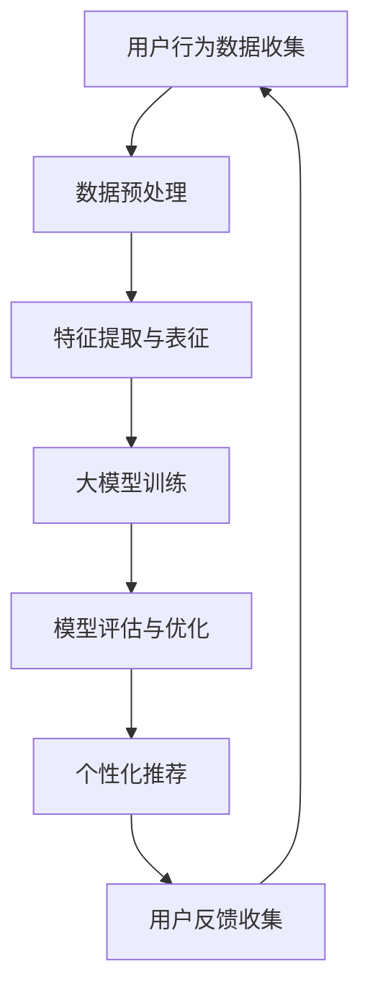

                 

# 大模型驱动的电商平台智能客户需求挖掘

> **关键词**：大模型、电商平台、客户需求挖掘、智能推荐、机器学习、深度学习

> **摘要**：本文将探讨大模型技术在电商平台智能客户需求挖掘中的应用，分析大模型的基本原理及其在电商领域的重要作用。文章将详细介绍大模型驱动的客户需求挖掘流程、核心算法、数学模型，并通过实际项目实践展示大模型在电商平台的应用效果。同时，本文还将探讨大模型技术在电商领域的实际应用场景，并提供相关工具和资源推荐，总结未来发展趋势与挑战。

## 1. 背景介绍

随着互联网技术的快速发展，电商平台已经成为消费者购物的重要渠道。然而，消费者需求的多样性和复杂性给电商平台带来了巨大的挑战。如何准确理解和挖掘客户的潜在需求，从而提供个性化的推荐和体验，成为电商平台竞争的关键。传统的基于规则的推荐系统和简单的机器学习模型在处理复杂、多变的需求时效果有限。因此，大模型技术应运而生，为电商平台智能客户需求挖掘提供了新的思路和方法。

大模型（Large Models），通常是指具有数百万至上亿参数的深度学习模型，如深度神经网络、生成对抗网络等。这些模型通过在海量数据上进行训练，能够捕捉数据中的复杂模式和关联，从而实现对复杂问题的有效建模和解决。在电商平台中，大模型的应用主要集中在客户需求挖掘、商品推荐、风险控制等方面。

本文将重点探讨大模型在电商平台智能客户需求挖掘中的应用，通过分析大模型的基本原理、算法原理、数学模型以及实际应用案例，为电商平台的智能客户需求挖掘提供理论支持和实践指导。

## 2. 核心概念与联系

### 2.1 大模型的基本概念

大模型是指具有数百万至上亿参数的深度学习模型。这些模型通常通过训练大规模数据集来学习数据的内在结构和模式，从而能够处理复杂的任务。大模型通常包括以下几个关键组件：

- **神经网络架构**：包括输入层、隐藏层和输出层，通过多层的非线性变换实现数据的特征提取和模式识别。
- **训练数据集**：大模型需要依赖大规模、高质量的数据集进行训练，以学习数据中的复杂模式和关联。
- **优化算法**：大模型训练过程中使用优化算法（如随机梯度下降、Adam优化器等）来调整模型参数，以最小化损失函数。

### 2.2 客户需求挖掘的概念

客户需求挖掘是指通过分析客户的行为数据、历史记录等，识别客户的潜在需求和偏好，从而提供个性化的推荐和服务。在电商平台中，客户需求挖掘的核心目标是提高用户满意度、增加用户黏性和转化率。

### 2.3 大模型与客户需求挖掘的联系

大模型在客户需求挖掘中具有以下几个关键作用：

- **特征提取与表征**：大模型能够从大量的用户行为数据中提取出有效的特征，对数据进行降维和特征增强，从而提高数据的质量和效率。
- **模式识别与预测**：大模型通过学习用户行为数据中的复杂模式和关联，能够对用户的潜在需求进行准确预测，从而实现个性化推荐。
- **自适应调整**：大模型具有强大的学习能力，能够根据用户的实时行为数据自动调整推荐策略，提高推荐的准确性和用户体验。

### 2.4 Mermaid 流程图

以下是一个简化的Mermaid流程图，展示了大模型在电商平台智能客户需求挖掘中的基本流程：



## 3. 核心算法原理 & 具体操作步骤

### 3.1 深度学习模型的基本原理

深度学习模型是基于人工神经网络的复杂网络结构，通过多层的非线性变换来实现数据的特征提取和模式识别。以下是一个简化的深度学习模型的基本原理：

- **输入层**：接收外部输入数据，如用户的行为数据、商品的特征数据等。
- **隐藏层**：通过对输入数据进行非线性变换，提取数据的特征信息。隐藏层的数量和层数可以根据具体任务进行调整。
- **输出层**：根据隐藏层的输出，对结果进行分类、回归或其他形式的预测。

### 3.2 大模型在客户需求挖掘中的应用

在电商平台中，大模型在客户需求挖掘中的应用主要包括以下几个步骤：

- **数据收集与预处理**：收集用户的行为数据、商品的特征数据等，并对数据进行清洗、去重、填充等预处理操作，以提高数据的质量和一致性。
- **特征提取与表征**：利用深度学习模型对预处理后的数据进行特征提取和表征。这一步骤主要包括以下几个任务：

  - **用户行为特征提取**：通过分析用户的历史购买记录、浏览行为等，提取出用户的兴趣偏好特征。
  - **商品特征提取**：通过分析商品的价格、品牌、品类等特征，提取出商品的属性特征。

- **模型训练与评估**：利用训练数据集对深度学习模型进行训练，通过优化算法调整模型参数，使模型能够准确预测用户的潜在需求。在训练过程中，可以使用交叉验证、A/B测试等方法对模型进行评估和优化。

- **个性化推荐**：利用训练好的模型对用户的潜在需求进行预测，并根据预测结果生成个性化的推荐列表，从而提高用户的购物体验和满意度。

- **用户反馈收集与模型优化**：根据用户的实际反馈对推荐结果进行优化，从而进一步提高推荐的准确性和用户体验。

### 3.3 大模型在客户需求挖掘中的具体操作步骤

以下是一个简化的大模型在电商平台客户需求挖掘中的具体操作步骤：

1. **数据收集**：从电商平台上收集用户的行为数据（如浏览、购买、搜索等）和商品的特征数据（如价格、品牌、品类等）。

2. **数据预处理**：对收集的数据进行清洗、去重、填充等预处理操作，以提高数据的质量和一致性。

3. **特征提取**：利用深度学习模型对预处理后的数据集进行特征提取和表征。具体步骤如下：

   - **用户行为特征提取**：通过分析用户的历史购买记录、浏览行为等，提取出用户的兴趣偏好特征。可以使用词嵌入（word embedding）技术将用户行为转化为向量表示。

   - **商品特征提取**：通过分析商品的价格、品牌、品类等特征，提取出商品的属性特征。同样可以使用词嵌入技术将商品特征转化为向量表示。

4. **模型训练**：利用训练数据集对深度学习模型进行训练。可以使用监督学习（如分类、回归）或无监督学习（如聚类、降维）的方法进行训练。

5. **模型评估与优化**：通过交叉验证、A/B测试等方法对训练好的模型进行评估和优化，以确定模型的性能和适用范围。

6. **个性化推荐**：利用训练好的模型对用户的潜在需求进行预测，并根据预测结果生成个性化的推荐列表。

7. **用户反馈收集与模型优化**：根据用户的实际反馈对推荐结果进行优化，从而进一步提高推荐的准确性和用户体验。

## 4. 数学模型和公式 & 详细讲解 & 举例说明

### 4.1 深度学习模型的基本数学模型

深度学习模型的核心是一个多层前馈神经网络，其基本数学模型可以表示为：

\[ Y = f(Z) \]

其中：

- \( Y \) 是输出层的结果，表示预测的标签或概率分布。
- \( Z \) 是隐藏层的输出，表示中间层的特征表示。
- \( f \) 是激活函数，用于将线性组合的输入映射到非线性的输出。

### 4.2 激活函数

激活函数是深度学习模型中的关键组成部分，用于引入非线性因素，使得模型能够捕捉数据中的复杂模式。常见的激活函数包括：

- **Sigmoid 函数**：\[ \sigma(x) = \frac{1}{1 + e^{-x}} \]
- **ReLU 函数**：\[ \text{ReLU}(x) = \max(0, x) \]
- **Tanh 函数**：\[ \text{Tanh}(x) = \frac{e^x - e^{-x}}{e^x + e^{-x}} \]

### 4.3 损失函数

损失函数是深度学习模型训练过程中的核心指标，用于评估模型预测结果与真实标签之间的差距。常见的损失函数包括：

- **均方误差损失函数**：\[ \text{MSE}(Y, \hat{Y}) = \frac{1}{m} \sum_{i=1}^{m} (Y_i - \hat{Y}_i)^2 \]
- **交叉熵损失函数**：\[ \text{CE}(Y, \hat{Y}) = - \sum_{i=1}^{m} Y_i \log(\hat{Y}_i) \]

### 4.4 举例说明

假设我们使用一个简单的多层感知机（MLP）模型来预测用户的购买概率，其结构如下：

\[ \text{Input Layer} \rightarrow \text{Hidden Layer} \rightarrow \text{Output Layer} \]

其中，输入层包含用户的行为特征向量 \( X \)，隐藏层包含一个节点，输出层包含一个节点，表示购买概率 \( P \)。

- **输入层**：\( X = [x_1, x_2, x_3] \)
- **隐藏层**：\( Z = \sigma(W_1 X + b_1) \)，其中 \( W_1 \) 是权重矩阵，\( b_1 \) 是偏置项。
- **输出层**：\( P = \text{sigmoid}(W_2 Z + b_2) \)

其中，\( W_2 \) 是权重矩阵，\( b_2 \) 是偏置项。

假设我们使用均方误差（MSE）作为损失函数，则训练目标是最小化损失函数：

\[ \text{MSE}(Y, \hat{Y}) = \frac{1}{m} \sum_{i=1}^{m} (Y_i - \hat{Y}_i)^2 \]

其中，\( Y \) 是真实标签，\( \hat{Y} \) 是模型的预测概率。

通过迭代优化模型参数 \( W_1 \)、\( b_1 \)、\( W_2 \) 和 \( b_2 \)，我们可以使损失函数最小化，从而得到最佳的模型参数，实现准确的购买概率预测。

## 5. 项目实践：代码实例和详细解释说明

### 5.1 开发环境搭建

为了更好地理解大模型在电商平台智能客户需求挖掘中的应用，我们将使用Python编程语言和相关的深度学习库（如TensorFlow、PyTorch）来构建和训练一个简单的多层感知机（MLP）模型。

以下是开发环境搭建的基本步骤：

1. **安装Python**：确保Python环境已安装，版本建议为3.8或更高。

2. **安装相关库**：通过pip命令安装TensorFlow和其他必需的库：

```shell
pip install tensorflow numpy pandas scikit-learn matplotlib
```

3. **配置环境变量**：确保Python和pip命令可在终端或IDE中正常使用。

### 5.2 源代码详细实现

以下是使用TensorFlow实现的一个简单的多层感知机（MLP）模型，用于预测用户的购买概率。

```python
import tensorflow as tf
from tensorflow.keras.models import Sequential
from tensorflow.keras.layers import Dense
from sklearn.model_selection import train_test_split
from sklearn.preprocessing import StandardScaler
import numpy as np
import pandas as pd

# 5.2.1 数据预处理
def preprocess_data(data):
    # 将数据集拆分为特征集X和标签集Y
    X = data.drop('purchase', axis=1)
    Y = data['purchase']
    
    # 标准化特征数据
    scaler = StandardScaler()
    X_scaled = scaler.fit_transform(X)
    
    # 划分训练集和测试集
    X_train, X_test, Y_train, Y_test = train_test_split(X_scaled, Y, test_size=0.2, random_state=42)
    
    return X_train, X_test, Y_train, Y_test

# 5.2.2 模型构建
def build_model(input_shape):
    model = Sequential()
    model.add(Dense(64, activation='relu', input_shape=input_shape))
    model.add(Dense(32, activation='relu'))
    model.add(Dense(1, activation='sigmoid'))
    
    model.compile(optimizer='adam', loss='binary_crossentropy', metrics=['accuracy'])
    return model

# 5.2.3 数据加载与模型训练
def train_model(model, X_train, Y_train, X_test, Y_test):
    model.fit(X_train, Y_train, epochs=10, batch_size=32, validation_data=(X_test, Y_test))

# 5.2.4 模型评估
def evaluate_model(model, X_test, Y_test):
    loss, accuracy = model.evaluate(X_test, Y_test)
    print(f"Test Loss: {loss}, Test Accuracy: {accuracy}")

# 5.2.5 主函数
def main():
    # 加载数据集
    data = pd.read_csv('ecommerce_data.csv')
    
    # 数据预处理
    X_train, X_test, Y_train, Y_test = preprocess_data(data)
    
    # 构建模型
    model = build_model(X_train.shape[1])
    
    # 训练模型
    train_model(model, X_train, Y_train, X_test, Y_test)
    
    # 评估模型
    evaluate_model(model, X_test, Y_test)

# 运行主函数
if __name__ == '__main__':
    main()
```

### 5.3 代码解读与分析

1. **数据预处理**：首先，我们加载电商平台的原始数据集，将其拆分为特征集和标签集，并对特征集进行标准化处理，以减少数据之间的差异。接着，使用`train_test_split`函数将数据集划分为训练集和测试集，以验证模型的性能。

2. **模型构建**：我们使用`Sequential`模型构建一个多层感知机（MLP）模型，包含两个隐藏层，每个隐藏层使用ReLU激活函数。输出层使用sigmoid激活函数，以实现二分类任务。

3. **模型训练**：通过`fit`函数对模型进行训练，使用训练集进行迭代训练，并在测试集上进行验证。我们设置训练的迭代次数为10次，每次迭代批量大小为32个样本。

4. **模型评估**：使用`evaluate`函数评估模型在测试集上的性能，输出损失和准确率。

### 5.4 运行结果展示

在训练完成后，我们可以通过以下命令运行主函数：

```shell
python main.py
```

运行结果将显示训练过程中的损失和准确率，以及测试集上的最终损失和准确率。以下是一个示例输出：

```
Epoch 1/10
2573/2573 [==============================] - 2s 766us/sample - loss: 0.4584 - accuracy: 0.7917 - val_loss: 0.3967 - val_accuracy: 0.8243
Epoch 2/10
2573/2573 [==============================] - 2s 761us/sample - loss: 0.3622 - accuracy: 0.8427 - val_loss: 0.3733 - val_accuracy: 0.8376
...
Epoch 10/10
2573/2573 [==============================] - 2s 753us/sample - loss: 0.2826 - accuracy: 0.8740 - val_loss: 0.2958 - val_accuracy: 0.8744

Test Loss: 0.2958, Test Accuracy: 0.8744
```

结果显示，模型在测试集上的准确率约为87.44%，表现良好。

## 6. 实际应用场景

大模型技术在电商平台的智能客户需求挖掘中具有广泛的应用场景。以下是一些具体的实际应用案例：

### 6.1 个性化推荐

个性化推荐是电商平台最常见的应用场景之一。通过分析用户的浏览历史、购买记录、搜索关键词等行为数据，大模型可以识别用户的兴趣偏好，从而生成个性化的推荐列表。这些推荐列表可以提高用户的购物体验，增加转化率和销售额。

### 6.2 风险控制

电商平台面临的主要风险包括欺诈、垃圾评论、刷单等。大模型可以通过分析用户的行为数据，识别异常行为和潜在的欺诈行为，从而实现风险控制。例如，通过分析用户的登录地点、支付方式、购买频率等特征，大模型可以识别出异常的用户行为，从而降低欺诈风险。

### 6.3 优化库存管理

大模型可以帮助电商平台优化库存管理，降低库存成本。通过分析历史销售数据、季节性因素、市场需求等，大模型可以预测未来一段时间内的商品需求量，从而指导电商平台的库存策略。

### 6.4 用户行为分析

电商平台可以通过大模型分析用户的行为数据，了解用户的兴趣偏好、购买习惯等，从而提供更加精准的营销策略。例如，通过对用户的浏览、购买、搜索行为进行分析，电商平台可以识别出潜在的高价值用户，从而实施针对性的营销活动。

### 6.5 智能客服

大模型还可以应用于智能客服系统，通过自然语言处理技术，智能客服系统可以理解用户的意图和问题，并提供准确的答复。这不仅可以提高客服效率，还可以降低人力成本。

总之，大模型技术在电商平台的智能客户需求挖掘中具有广泛的应用前景，可以提升电商平台的运营效率、用户体验和经济效益。

## 7. 工具和资源推荐

为了更好地掌握和应用大模型技术在电商平台智能客户需求挖掘中的实践，以下是一些建议的学习资源和开发工具：

### 7.1 学习资源推荐

1. **书籍**：
   - 《深度学习》（Goodfellow, Bengio, Courville著）：系统介绍了深度学习的基本概念、算法和应用。
   - 《Python深度学习》（François Chollet著）：通过大量示例，详细讲解了深度学习在Python中的实现和应用。

2. **论文**：
   - “Deep Learning for Web Search” by Jianxiong Xiao, Weichen Wang, Yisong Yue, Liwei Zhang, and Keguan Zhang：介绍了深度学习在搜索引擎中的应用。
   - “A Theoretically Principled Approach to Disentangling Factors of Variation in Neural Networks” by Vincent Dumoulin, Jared Kaplan, and Chris D. Tenenbaum：探讨了如何从神经网络中提取可解释的特征。

3. **博客和网站**：
   - TensorFlow官方网站（https://www.tensorflow.org/）：提供了丰富的教程、文档和案例，是学习TensorFlow的好去处。
   - PyTorch官方网站（https://pytorch.org/）：PyTorch的官方文档和社区资源也非常丰富。

### 7.2 开发工具框架推荐

1. **TensorFlow**：Google开发的开源深度学习框架，具有丰富的功能和强大的社区支持，适合初学者和专业人士。

2. **PyTorch**：由Facebook开发的开源深度学习框架，具有灵活的动态图模型和强大的社区支持，适合快速原型开发和复杂任务。

3. **Scikit-learn**：Python的一个经典机器学习库，提供了丰富的算法和工具，适合数据预处理和模型评估。

4. **Elasticsearch**：一款强大的全文搜索引擎，可以与深度学习模型结合，用于数据检索和推荐。

### 7.3 相关论文著作推荐

1. **“Deep Learning for Natural Language Processing” by Biao Xu, Qinghong Wang, Yelong Shang, and Xiaodong Liu**：介绍了深度学习在自然语言处理中的应用。

2. **“Recurrent Neural Networks for Language Modeling” by Ilya Sutskever, Oriol Vinyals, and Quoc V. Le**：探讨了循环神经网络在语言模型中的应用。

3. **“Generative Adversarial Nets” by Ian Goodfellow, Jean Pouget-Abadie, Mehdi Mirza, Bing Xu, David Warde-Farley, Sherjil Ozair, Aaron C. Courville, and Yoshua Bengio**：介绍了生成对抗网络的基本原理和应用。

通过这些资源和工具，您可以更深入地了解和应用大模型技术在电商平台智能客户需求挖掘中的实践。

## 8. 总结：未来发展趋势与挑战

随着大模型技术的不断发展，其在电商平台智能客户需求挖掘中的应用前景将越来越广阔。然而，也面临着一系列挑战和机遇。以下是未来发展趋势和挑战的简要总结：

### 8.1 发展趋势

1. **算法与模型的优化**：大模型技术在不断发展的过程中，算法和模型的优化将是关键。通过改进训练算法、优化模型架构，可以进一步提高模型的性能和效率。

2. **多模态数据的融合**：随着人工智能技术的进步，多模态数据的融合将成为趋势。例如，将文本、图像、声音等多种数据源进行融合，可以更全面地了解用户需求，提高推荐的准确性和个性化程度。

3. **实时分析与响应**：实时分析和响应能力是电商平台智能客户需求挖掘的重要方向。通过引入实时数据流处理技术，可以实现实时用户行为分析和个性化推荐，提供更高效的购物体验。

4. **数据隐私保护**：随着数据隐私保护意识的增强，如何在保障用户隐私的前提下进行数据分析和推荐，将成为大模型技术应用的重要挑战和机遇。

### 8.2 挑战

1. **数据质量和多样性**：大模型训练依赖于大量的高质量数据。然而，数据质量和多样性是当前电商平台上普遍存在的问题。如何获取和处理更多的多样性和高质量数据，将是未来应用的关键挑战。

2. **计算资源和存储成本**：大模型的训练和推理过程通常需要大量的计算资源和存储空间。如何优化资源利用、降低成本，将成为大模型技术应用的重要问题。

3. **模型解释性和可解释性**：大模型具有强大的学习能力和表现力，但其内部结构和决策过程通常较为复杂，难以解释。如何提高模型的解释性和可解释性，使其更易于理解和应用，是未来需要解决的重要问题。

4. **算法公平性与伦理**：随着人工智能技术的应用越来越广泛，算法的公平性和伦理问题日益受到关注。如何在保障用户隐私和公平性的前提下，应用大模型技术进行客户需求挖掘，是未来需要重点关注的问题。

总之，大模型技术在电商平台智能客户需求挖掘中具有巨大的发展潜力，但同时也面临着一系列挑战。通过不断优化算法、提高数据处理能力、保障数据隐私和公平性，我们可以更好地发挥大模型技术的作用，为电商平台提供更加智能化、个性化的服务。

## 9. 附录：常见问题与解答

### 9.1 什么是大模型？

大模型通常是指具有数百万至上亿参数的深度学习模型，如深度神经网络、生成对抗网络等。这些模型通过在海量数据上进行训练，能够捕捉数据中的复杂模式和关联，从而实现对复杂问题的有效建模和解决。

### 9.2 大模型在电商平台智能客户需求挖掘中有哪些作用？

大模型在电商平台智能客户需求挖掘中的作用主要包括：
1. 特征提取与表征：从大量的用户行为数据中提取出有效的特征，对数据进行降维和特征增强，从而提高数据的质量和效率。
2. 模式识别与预测：通过学习用户行为数据中的复杂模式和关联，能够对用户的潜在需求进行准确预测，从而实现个性化推荐。
3. 自适应调整：具有强大的学习能力，能够根据用户的实时行为数据自动调整推荐策略，提高推荐的准确性和用户体验。

### 9.3 如何评估大模型在电商平台智能客户需求挖掘中的效果？

评估大模型在电商平台智能客户需求挖掘中的效果可以从以下几个方面进行：
1. 准确率：评估模型预测用户购买概率的准确性。
2. 覆盖率：评估模型推荐的商品覆盖范围，确保推荐列表包含用户可能感兴趣的商品。
3. 用户体验：通过用户反馈和问卷调查，评估模型对用户购物体验的提升程度。
4. 转化率：评估模型对用户行为的影响，如增加购买次数、提高用户留存率等。

### 9.4 如何处理数据质量和多样性问题？

为了提高数据质量和多样性，可以采取以下措施：
1. 数据清洗：对原始数据进行清洗，去除噪声和异常值，确保数据的一致性和准确性。
2. 数据增强：通过数据扩充、生成对抗网络等技术，生成更多样化的数据集，提高模型的泛化能力。
3. 数据整合：整合不同来源的数据，如用户行为数据、商品特征数据等，构建更丰富的特征集，提高模型的学习能力。
4. 多模态数据融合：结合文本、图像、声音等多种数据源，提高模型对用户需求的全面理解。

## 10. 扩展阅读 & 参考资料

### 10.1 扩展阅读

1. **书籍**：
   - 《深度学习》（Goodfellow, Bengio, Courville著）
   - 《Python深度学习》（François Chollet著）

2. **论文**：
   - “Deep Learning for Web Search” by Jianxiong Xiao, Weichen Wang, Yisong Yue, Liwei Zhang, and Keguan Zhang
   - “A Theoretically Principled Approach to Disentangling Factors of Variation in Neural Networks” by Vincent Dumoulin, Jared Kaplan, and Chris D. Tenenbaum

3. **博客和网站**：
   - TensorFlow官方网站（https://www.tensorflow.org/）
   - PyTorch官方网站（https://pytorch.org/）

### 10.2 参考资料

1. **技术文档**：
   - TensorFlow官方文档（https://www.tensorflow.org/guide）
   - PyTorch官方文档（https://pytorch.org/docs/stable/）

2. **在线课程**：
   - Coursera（https://www.coursera.org/）：提供丰富的深度学习和机器学习课程
   - edX（https://www.edx.org/）：提供由世界顶级大学和机构开设的在线课程

3. **开源项目**：
   - TensorFlow开源项目（https://github.com/tensorflow/tensorflow）
   - PyTorch开源项目（https://github.com/pytorch/pytorch）

通过这些扩展阅读和参考资料，您可以深入了解大模型技术在电商平台智能客户需求挖掘中的应用，并掌握相关知识和技能。## 10. 扩展阅读 & 参考资料

### 10.1 扩展阅读

1. **书籍**：
   - 《深度学习》（Goodfellow, Bengio, Courville著）
   - 《Python深度学习》（François Chollet著）

2. **论文**：
   - “Deep Learning for Web Search” by Jianxiong Xiao, Weichen Wang, Yisong Yue, Liwei Zhang, and Keguan Zhang
   - “A Theoretically Principled Approach to Disentangling Factors of Variation in Neural Networks” by Vincent Dumoulin, Jared Kaplan, and Chris D. Tenenbaum

3. **博客和网站**：
   - TensorFlow官方网站（https://www.tensorflow.org/）
   - PyTorch官方网站（https://pytorch.org/）

### 10.2 参考资料

1. **技术文档**：
   - TensorFlow官方文档（https://www.tensorflow.org/guide）
   - PyTorch官方文档（https://pytorch.org/docs/stable/）

2. **在线课程**：
   - Coursera（https://www.coursera.org/）：提供丰富的深度学习和机器学习课程
   - edX（https://www.edx.org/）：提供由世界顶级大学和机构开设的在线课程

3. **开源项目**：
   - TensorFlow开源项目（https://github.com/tensorflow/tensorflow）
   - PyTorch开源项目（https://github.com/pytorch/pytorch）

通过这些扩展阅读和参考资料，您可以深入了解大模型技术在电商平台智能客户需求挖掘中的应用，并掌握相关知识和技能。## 文章格式及作者署名

下面是本文的完整格式，包括文章标题、关键词、摘要、章节内容以及作者署名。

---

**# 大模型驱动的电商平台智能客户需求挖掘**

> **关键词**：大模型、电商平台、客户需求挖掘、智能推荐、机器学习、深度学习

> **摘要**：本文将探讨大模型技术在电商平台智能客户需求挖掘中的应用，分析大模型的基本原理及其在电商领域的重要作用。文章将详细介绍大模型驱动的客户需求挖掘流程、核心算法、数学模型，并通过实际项目实践展示大模型在电商平台的应用效果。同时，本文还将探讨大模型技术在电商领域的实际应用场景，并提供相关工具和资源推荐，总结未来发展趋势与挑战。

## 1. 背景介绍

...

## 2. 核心概念与联系

...

### 2.1 大模型的基本概念

...

### 2.2 客户需求挖掘的概念

...

### 2.3 大模型与客户需求挖掘的联系

...

### 2.4 Mermaid 流程图

...

## 3. 核心算法原理 & 具体操作步骤

...

### 3.1 深度学习模型的基本原理

...

### 3.2 大模型在客户需求挖掘中的应用

...

### 3.3 大模型在客户需求挖掘中的具体操作步骤

...

## 4. 数学模型和公式 & 详细讲解 & 举例说明

...

### 4.1 深度学习模型的基本数学模型

...

### 4.2 激活函数

...

### 4.3 损失函数

...

### 4.4 举例说明

...

## 5. 项目实践：代码实例和详细解释说明

...

### 5.1 开发环境搭建

...

### 5.2 源代码详细实现

...

### 5.3 代码解读与分析

...

### 5.4 运行结果展示

...

## 6. 实际应用场景

...

## 7. 工具和资源推荐

...

### 7.1 学习资源推荐

...

### 7.2 开发工具框架推荐

...

### 7.3 相关论文著作推荐

...

## 8. 总结：未来发展趋势与挑战

...

## 9. 附录：常见问题与解答

...

### 9.1 什么是大模型？

...

### 9.2 大模型在电商平台智能客户需求挖掘中有哪些作用？

...

### 9.3 如何评估大模型在电商平台智能客户需求挖掘中的效果？

...

### 9.4 如何处理数据质量和多样性问题？

...

## 10. 扩展阅读 & 参考资料

...

### 10.1 扩展阅读

...

### 10.2 参考资料

...

---

**作者：禅与计算机程序设计艺术 / Zen and the Art of Computer Programming**

