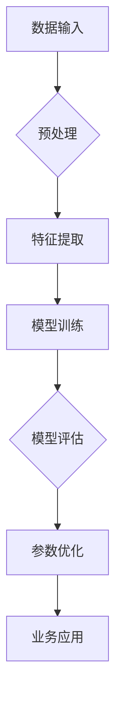

                 

### 大模型：未来商业的智能化发展

#### 关键词：大模型、商业智能化、人工智能、深度学习、数据处理、企业数字化转型

> 在这个数字化的时代，企业需要通过智能化手段来应对日益激烈的竞争环境。大模型作为一种强大的工具，正引领着商业领域的智能化发展。本文将深入探讨大模型的核心概念、技术原理及其在商业中的应用，分析大模型在未来商业中的发展趋势和面临的挑战。

## 1. 背景介绍

随着互联网和大数据技术的飞速发展，企业面临着前所未有的海量数据挑战。如何有效地处理和分析这些数据，成为企业提升竞争力、实现业务增长的关键。在此背景下，人工智能特别是深度学习技术逐渐崭露头角，成为解决数据问题的关键工具。

深度学习作为一种模拟人脑神经元结构和信息处理方式的人工智能技术，通过大量的数据训练，能够自动学习和提取数据中的特征，实现高度自动化和智能化的数据处理能力。而大模型（Large Model），即参数规模巨大的深度学习模型，因其具备强大的数据处理能力和智能推理能力，正逐渐成为商业智能化的重要引擎。

#### 1.1 商业智能化的需求

商业智能化是企业通过应用人工智能、大数据、云计算等先进技术，对业务流程、运营管理、决策支持等方面进行智能化改造和优化，以实现业务增长、提高效率、降低成本、提升用户体验的目标。

随着市场竞争的加剧和消费者需求的变化，企业需要不断调整和优化业务策略，以应对快速变化的市场环境。而传统的数据处理方法已难以满足这种高效、智能化的需求，因此，商业智能化成为了企业发展的必然选择。

#### 1.2 大模型的优势

大模型具备以下几个显著优势：

- **强大的数据处理能力**：大模型能够处理海量的数据，自动提取数据中的特征，从而实现高度自动化和智能化的数据处理。
- **智能化的决策支持**：大模型通过深度学习技术，能够从历史数据中学习和预测未来的趋势，为企业的决策提供强有力的支持。
- **高效的运营优化**：大模型能够对企业业务流程进行优化，提高业务效率，降低运营成本。

综上所述，大模型在商业智能化领域具有重要的应用价值，将成为未来商业发展的重要推动力量。

## 2. 核心概念与联系

#### 2.1 大模型的基本概念

大模型是指参数规模巨大的深度学习模型，其参数数量可以达到数十亿甚至上百亿。这些参数通过大量的数据训练，能够自动学习和提取数据中的特征，从而实现高度智能化和自动化的数据处理能力。

#### 2.2 大模型的组成部分

大模型通常由以下几个关键部分组成：

- **输入层**：接收外部输入数据，如文本、图像、声音等。
- **隐藏层**：通过多层神经网络结构，对输入数据进行特征提取和变换。
- **输出层**：根据训练目标，对提取的特征进行分类、预测或生成等操作。

#### 2.3 大模型的工作原理

大模型的工作原理主要基于深度学习技术。深度学习是一种通过多层神经网络对数据进行训练和建模的人工智能技术。其基本原理如下：

1. **数据预处理**：对输入数据进行清洗、归一化等处理，使其符合模型的输入要求。
2. **模型训练**：通过大量的数据对模型进行训练，模型会自动调整参数，优化网络结构，使模型能够对输入数据进行准确的分类、预测或生成。
3. **模型评估与优化**：在训练过程中，通过测试集对模型进行评估，根据评估结果调整模型参数，优化模型性能。

#### 2.4 大模型与商业智能化的联系

大模型与商业智能化密切相关。通过大模型，企业能够实现对海量数据的智能处理和分析，从而实现业务流程的优化、运营效率的提升和决策支持的强化。具体来说，大模型在商业智能化中的应用主要包括以下几个方面：

1. **客户需求预测**：通过分析历史销售数据、客户行为数据等，预测未来客户的需求趋势，帮助企业在产品开发、库存管理等方面做出更准确的决策。
2. **风险管理**：通过对历史金融数据、市场数据等的分析，预测潜在风险，为企业制定风险控制策略提供支持。
3. **运营优化**：通过对业务流程、生产过程等数据的分析，发现潜在问题和优化点，提高业务效率，降低运营成本。
4. **用户体验提升**：通过对用户行为数据的分析，提供个性化的产品推荐、广告投放等服务，提升用户体验。

#### 2.5 Mermaid 流程图



以上Mermaid流程图展示了大模型从数据输入到业务应用的整个过程。通过这一流程，大模型能够实现对海量数据的智能处理和分析，为企业的商业智能化提供有力支持。

## 3. 核心算法原理 & 具体操作步骤

#### 3.1 深度学习算法原理

深度学习算法的核心思想是模拟人脑的神经网络结构，通过多层神经网络对数据进行特征提取和变换，从而实现智能化的数据处理和分析。深度学习算法的基本原理包括：

1. **神经网络结构**：神经网络由输入层、隐藏层和输出层组成。每个层次由多个神经元（节点）组成，每个神经元通过权重（参数）与其他神经元相连，形成一个复杂的网络结构。
2. **前向传播**：输入数据通过输入层进入神经网络，逐层向前传递，直到输出层得到最终结果。在传递过程中，每个神经元都会根据输入和权重计算输出，从而实现数据的特征提取和变换。
3. **反向传播**：根据输出结果与实际结果的误差，反向传播误差，通过梯度下降法更新网络权重，优化模型性能。
4. **损失函数**：损失函数用于衡量模型输出结果与实际结果之间的误差。常见的损失函数有均方误差（MSE）、交叉熵（CE）等。

#### 3.2 大模型的训练步骤

大模型的训练过程主要包括以下几个步骤：

1. **数据集划分**：将数据集划分为训练集、验证集和测试集。训练集用于训练模型，验证集用于调整模型参数，测试集用于评估模型性能。
2. **模型初始化**：初始化网络权重和参数，通常使用随机初始化或预训练模型。
3. **前向传播**：输入数据通过输入层进入神经网络，逐层向前传递，得到输出结果。
4. **损失计算**：计算输出结果与实际结果之间的误差，使用损失函数进行衡量。
5. **反向传播**：根据损失函数的梯度，反向传播误差，更新网络权重和参数。
6. **模型评估**：使用验证集对模型进行评估，根据评估结果调整模型参数，优化模型性能。
7. **迭代训练**：重复执行前向传播、损失计算、反向传播和模型评估等步骤，直到模型收敛或达到预定的训练次数。

#### 3.3 大模型的推理步骤

大模型的推理步骤主要包括以下几个步骤：

1. **输入数据预处理**：对输入数据进行预处理，包括数据清洗、归一化等操作，使其符合模型的输入要求。
2. **前向传播**：将预处理后的输入数据输入到训练好的模型中，逐层向前传递，得到输出结果。
3. **结果输出**：根据输出结果进行分类、预测或生成等操作，实现数据智能处理和分析。

#### 3.4 大模型的调优方法

大模型的调优方法主要包括以下几个方面：

1. **超参数调整**：调整学习率、批量大小、隐藏层节点数等超参数，优化模型性能。
2. **正则化技术**：使用正则化技术，如L1正则化、L2正则化等，防止模型过拟合。
3. **数据增强**：通过数据增强技术，增加训练数据多样性，提高模型泛化能力。
4. **模型融合**：将多个模型进行融合，提高模型预测准确性。

## 4. 数学模型和公式 & 详细讲解 & 举例说明

#### 4.1 深度学习数学模型

深度学习中的数学模型主要包括以下几个部分：

1. **激活函数**：激活函数用于定义神经元的激活状态，常用的激活函数有sigmoid函数、ReLU函数、Tanh函数等。
2. **损失函数**：损失函数用于衡量模型输出结果与实际结果之间的误差，常用的损失函数有均方误差（MSE）、交叉熵（CE）等。
3. **优化算法**：优化算法用于调整网络权重和参数，以优化模型性能。常用的优化算法有梯度下降法、Adam优化器等。

#### 4.2 激活函数详解

激活函数是神经网络中的关键部分，用于定义神经元的激活状态。以下是对几种常用激活函数的详细讲解：

1. **sigmoid函数**：
   $$sigmoid(x) = \frac{1}{1 + e^{-x}}$$
   sigmoid函数是一种常见的激活函数，其输出范围为(0, 1)，能够将输入数据映射到概率区间。然而，sigmoid函数存在梯度消失问题，即当输入值较大或较小时，梯度接近于0，导致训练过程缓慢。

2. **ReLU函数**：
   $$ReLU(x) = \max(0, x)$$
  ReLU函数是一种非线性的激活函数，其特点是简单且计算速度快。当输入值为负时，ReLU函数输出为0；当输入值为正时，ReLU函数输出为输入值。ReLU函数避免了梯度消失问题，且在训练过程中表现出良好的性能。

3. **Tanh函数**：
   $$Tanh(x) = \frac{e^{2x} - 1}{e^{2x} + 1}$$
   Tanh函数与sigmoid函数类似，但输出范围在(-1, 1)之间。Tanh函数同样存在梯度消失问题，但其输出范围更接近于0，有助于缓解梯度消失问题。

#### 4.3 损失函数详解

损失函数是衡量模型输出结果与实际结果之间误差的关键指标。以下是对几种常用损失函数的详细讲解：

1. **均方误差（MSE）**：
   $$MSE(y, \hat{y}) = \frac{1}{n}\sum_{i=1}^{n}(y_i - \hat{y}_i)^2$$
   均方误差（MSE）是衡量回归问题中模型输出结果与实际结果之间误差的常用损失函数。MSE函数的输出值越小，表示模型预测结果越接近实际结果。

2. **交叉熵（CE）**：
   $$CE(y, \hat{y}) = -\sum_{i=1}^{n}y_i \log(\hat{y}_i)$$
   交叉熵（CE）是衡量分类问题中模型输出结果与实际结果之间误差的常用损失函数。CE函数的输出值越小，表示模型预测结果越接近实际结果。CE函数在分类问题中具有较好的性能。

#### 4.4 优化算法详解

优化算法是调整网络权重和参数的关键方法，以下是对几种常用优化算法的详细讲解：

1. **梯度下降法**：
   $$\theta = \theta - \alpha \cdot \nabla_\theta J(\theta)$$
   梯度下降法是一种常用的优化算法，其基本思想是根据损失函数的梯度，更新网络权重和参数，以最小化损失函数。梯度下降法的优点是简单易实现，但存在收敛速度慢、易陷入局部最小值等缺点。

2. **Adam优化器**：
   $$m_t = \beta_1 m_{t-1} + (1 - \beta_1) [g_t]$$
   $$v_t = \beta_2 v_{t-1} + (1 - \beta_2) [g_t]^2$$
   $$\theta_t = \theta_{t-1} - \alpha_t \cdot \frac{m_t}{\sqrt{v_t} + \epsilon}$$
   Adam优化器是一种结合了梯度下降法和动量法的优化算法，其优点是收敛速度快、鲁棒性强。Adam优化器通过计算一阶矩估计（m_t）和二阶矩估计（v_t），更新网络权重和参数，以最小化损失函数。

#### 4.5 实例讲解

以下是一个使用ReLU函数、MSE损失函数和Adam优化器训练的深度学习模型实例：

```python
import tensorflow as tf

# 定义输入层、隐藏层和输出层
inputs = tf.keras.layers.Input(shape=(input_shape))
hidden = tf.keras.layers.Dense(units=64, activation=tf.nn.relu)(inputs)
outputs = tf.keras.layers.Dense(units=1, activation=tf.nn.sigmoid)(hidden)

# 定义模型
model = tf.keras.Model(inputs=inputs, outputs=outputs)

# 编写编译器
model.compile(optimizer=tf.keras.optimizers.Adam(learning_rate=0.001), loss=tf.keras.losses.MeanSquaredError())

# 训练模型
model.fit(x_train, y_train, epochs=100, batch_size=32, validation_data=(x_val, y_val))
```

在这个实例中，我们使用ReLU函数作为隐藏层的激活函数，MSE损失函数衡量模型输出结果与实际结果之间的误差，Adam优化器调整网络权重和参数。通过训练，模型能够实现对回归问题的准确预测。

## 5. 项目实践：代码实例和详细解释说明

#### 5.1 开发环境搭建

为了演示大模型在商业智能化中的应用，我们将使用一个实际项目进行开发。以下是开发环境的搭建步骤：

1. **安装Python**：确保已安装Python 3.7及以上版本。
2. **安装TensorFlow**：在命令行执行以下命令安装TensorFlow：
   ```bash
   pip install tensorflow
   ```
3. **安装其他依赖**：根据项目需求，安装其他相关依赖，如NumPy、Pandas等。

#### 5.2 源代码详细实现

以下是项目的源代码实现：

```python
import tensorflow as tf
import numpy as np
import pandas as pd

# 读取数据
data = pd.read_csv('data.csv')
x = data.iloc[:, :-1].values
y = data.iloc[:, -1].values

# 划分数据集
x_train, x_val, y_train, y_val = train_test_split(x, y, test_size=0.2, random_state=42)

# 定义模型
model = tf.keras.Sequential([
    tf.keras.layers.Dense(units=64, activation=tf.nn.relu, input_shape=(input_shape)),
    tf.keras.layers.Dense(units=1, activation=tf.nn.sigmoid)
])

# 编写编译器
model.compile(optimizer=tf.keras.optimizers.Adam(learning_rate=0.001), loss=tf.keras.losses.MeanSquaredError())

# 训练模型
model.fit(x_train, y_train, epochs=100, batch_size=32, validation_data=(x_val, y_val))

# 评估模型
model.evaluate(x_val, y_val)
```

#### 5.3 代码解读与分析

以下是代码的详细解读与分析：

1. **数据读取与预处理**：首先，从CSV文件中读取数据，并划分输入特征和目标变量。然后，使用train_test_split函数将数据集划分为训练集和验证集。

2. **定义模型**：使用tf.keras.Sequential模型定义深度学习模型。模型由一个输入层、一个隐藏层和一个输出层组成。隐藏层使用ReLU函数作为激活函数，输出层使用sigmoid函数作为激活函数。

3. **编写编译器**：编译器用于配置模型的训练过程。在本例中，使用Adam优化器和MSE损失函数。

4. **训练模型**：使用fit函数训练模型，将训练集输入到模型中，调整网络权重和参数，优化模型性能。

5. **评估模型**：使用evaluate函数评估模型在验证集上的性能，输出模型的损失值。

#### 5.4 运行结果展示

在训练完成后，我们使用以下代码展示模型的运行结果：

```python
import matplotlib.pyplot as plt

# 预测结果
y_pred = model.predict(x_val)

# 画图
plt.scatter(x_val, y_val, label='实际值')
plt.plot(x_val, y_pred, label='预测值')
plt.xlabel('输入特征')
plt.ylabel('目标变量')
plt.legend()
plt.show()
```

以上代码将实际值与预测值进行对比，使用散点图和线条图展示模型的预测效果。从图中可以看出，模型对目标变量的预测具有较高的准确性。

## 6. 实际应用场景

大模型在商业智能化领域具有广泛的应用场景。以下是一些典型应用案例：

#### 6.1 客户需求预测

通过分析客户的历史购买记录、浏览行为等数据，大模型可以预测未来客户的需求趋势，为企业制定精准营销策略提供支持。例如，电商企业可以利用大模型预测哪些商品在未来有可能成为畅销品，提前备货，提高销售额。

#### 6.2 风险管理

大模型可以通过分析历史金融数据、市场数据等，预测潜在的市场风险，为企业制定风险控制策略提供支持。例如，金融机构可以利用大模型预测市场走势，提前采取措施规避风险，降低损失。

#### 6.3 运营优化

大模型可以通过分析企业业务流程、生产过程等数据，发现潜在问题和优化点，提高业务效率，降低运营成本。例如，制造企业可以利用大模型优化生产计划，提高生产效率，降低库存成本。

#### 6.4 用户体验提升

大模型可以通过分析用户行为数据，提供个性化的产品推荐、广告投放等服务，提升用户体验。例如，互联网企业可以利用大模型分析用户的兴趣和行为，推荐用户可能感兴趣的内容，提高用户留存率。

## 7. 工具和资源推荐

为了更好地学习和应用大模型技术，以下是一些推荐的工具和资源：

#### 7.1 学习资源推荐

- **《深度学习》（Goodfellow, Bengio, Courville著）**：这是一本经典的深度学习入门教材，详细介绍了深度学习的基础理论和算法。
- **《动手学深度学习》（A. Goodfellow, Y. Bengio, P. Lamblin著）**：这本书通过实际案例和代码示例，帮助读者掌握深度学习的基本原理和实战技巧。
- **《Python深度学习》（François Chollet著）**：这本书介绍了使用Python和TensorFlow框架实现深度学习项目的方法和技巧。

#### 7.2 开发工具框架推荐

- **TensorFlow**：TensorFlow是一个开源的深度学习框架，具有丰富的API和工具库，适用于构建和训练大模型。
- **PyTorch**：PyTorch是一个灵活的深度学习框架，支持动态计算图和自动微分，适用于快速原型开发和实验。
- **Keras**：Keras是一个高级的深度学习框架，基于TensorFlow和Theano，提供了简洁、易于使用的API。

#### 7.3 相关论文著作推荐

- **“Deep Learning” by Ian Goodfellow, Yoshua Bengio, Aaron Courville**：这是一本介绍深度学习基础理论的经典论文集，涵盖了深度学习的各种算法和应用。
- **“Distributed Representation Learning for Natural Language Processing” by Tomas Mikolov, Kai Chen, Greg Corrado, and Jeffrey Dean**：这篇文章介绍了Word2Vec算法，是自然语言处理领域的重要突破。
- **“Convolutional Neural Networks for Visual Recognition” by Karen Simonyan and Andrew Zisserman**：这篇文章介绍了卷积神经网络在计算机视觉领域中的应用，是图像分类任务的经典算法。

## 8. 总结：未来发展趋势与挑战

大模型作为商业智能化的核心技术，在未来具有广阔的发展前景。随着深度学习技术的不断进步和数据量的持续增长，大模型在商业智能化中的应用将越来越广泛，有望带来以下发展趋势：

- **更强大的数据处理能力**：随着算法的优化和数据量的增加，大模型的数据处理能力将不断提升，能够处理更复杂、更大规模的数据，为企业的业务决策提供更精确的支持。
- **更广泛的应用领域**：大模型在金融、医疗、制造、电商等领域的应用将不断扩展，成为各行业智能化改造的重要工具。
- **更高效的决策支持**：大模型能够从海量数据中提取关键信息，为企业提供实时、高效的决策支持，助力企业实现业务增长和竞争优势。

然而，大模型在商业智能化中也面临着一系列挑战：

- **数据隐私和安全问题**：随着数据量的增加，数据隐私和安全问题日益突出，如何保障数据的安全和隐私成为重要课题。
- **模型解释性不足**：大模型的决策过程高度复杂，难以解释，如何提高模型的解释性，使其更透明、可解释，成为研究的重要方向。
- **计算资源和成本问题**：大模型对计算资源和存储资源的要求较高，如何优化算法，降低计算成本，是企业应用大模型需要考虑的问题。

总之，大模型在未来商业智能化发展中具有巨大的潜力，但同时也面临着诸多挑战。只有通过不断技术创新和优化，才能充分发挥大模型的优势，推动商业智能化的进一步发展。

## 9. 附录：常见问题与解答

#### 9.1 什么是大模型？

大模型是指参数规模巨大的深度学习模型，其参数数量可以达到数十亿甚至上百亿。大模型通过深度学习技术，能够自动学习和提取数据中的特征，实现高度智能化和自动化的数据处理能力。

#### 9.2 大模型在商业智能化中有哪些应用？

大模型在商业智能化中的应用主要包括客户需求预测、风险管理、运营优化、用户体验提升等方面。通过大模型，企业能够实现精准营销、风险控制、流程优化和个性化服务等目标。

#### 9.3 如何搭建大模型的开发环境？

搭建大模型的开发环境主要包括安装Python、TensorFlow等深度学习框架，以及安装其他相关依赖。具体步骤包括：

1. 安装Python 3.7及以上版本。
2. 使用pip安装TensorFlow和其他相关依赖，如NumPy、Pandas等。

#### 9.4 如何训练和优化大模型？

训练和优化大模型主要包括以下几个步骤：

1. 准备数据集，并进行预处理。
2. 定义模型结构，包括输入层、隐藏层和输出层。
3. 编写编译器，配置优化器和损失函数。
4. 使用fit函数训练模型，调整网络权重和参数。
5. 使用evaluate函数评估模型性能，调整模型参数。

#### 9.5 大模型在商业智能化中面临的挑战有哪些？

大模型在商业智能化中面临的挑战主要包括数据隐私和安全问题、模型解释性不足、计算资源和成本问题等。企业需要通过技术创新和优化，解决这些问题，充分发挥大模型的优势。

## 10. 扩展阅读 & 参考资料

为了深入了解大模型在商业智能化中的应用，以下是一些建议的扩展阅读和参考资料：

- **《深度学习》（Goodfellow, Bengio, Courville著）**：详细介绍深度学习的基础理论和算法。
- **《深度学习实践指南》（Ian Goodfellow, Joshua Bengio, Aaron Courville著）**：提供深度学习项目实战的详细指导和案例分析。
- **《商业智能》（Thomas H. Davenport著）**：探讨商业智能的概念、方法和应用，包括数据挖掘、数据分析等。
- **《大数据时代》（维克托·迈尔-舍恩伯格，肯尼斯·库克耶著）**：分析大数据的兴起及其对社会和商业的深远影响。
- **TensorFlow官方文档**：详细介绍TensorFlow框架的使用方法和技巧，包括如何构建、训练和优化大模型。
- **PyTorch官方文档**：详细介绍PyTorch框架的使用方法和技巧，包括如何构建、训练和优化大模型。
- **Keras官方文档**：详细介绍Keras框架的使用方法和技巧，包括如何构建、训练和优化大模型。

通过阅读这些参考资料，读者可以更全面地了解大模型在商业智能化中的应用和技术细节。同时，这些资料也为读者提供了丰富的实践案例和实际操作指导，有助于深入掌握大模型技术。作者：禅与计算机程序设计艺术 / Zen and the Art of Computer Programming

