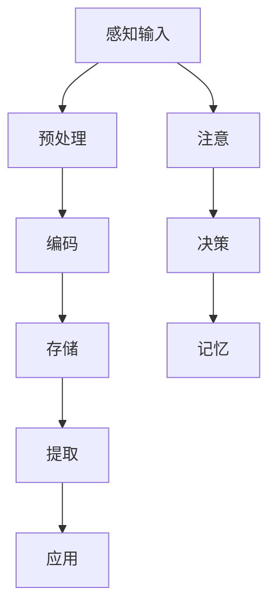

                 

### 文章标题

《大脑如何处理新知识：认知科学的视角》

> **关键词：** 大脑处理机制、新知识学习、认知科学、神经网络、信息处理、记忆编码。

> **摘要：** 本文从认知科学的角度出发，探讨大脑如何处理新知识的过程。通过分析神经网络的运作机制、记忆编码的方式以及大脑对信息的筛选与整合，我们揭示了大脑处理新知识的复杂性和高效性。本文旨在为读者提供一种全新的视角，以深入理解大脑的学习机制，并为人工智能领域的知识处理算法提供启示。  

### 1. 背景介绍

在当今信息爆炸的时代，知识更新速度不断加快，人们面临着大量新知识的吸收和整合。如何高效地处理和利用新知识，已经成为一个重要的研究课题。传统的计算机科学和人工智能技术虽然在处理大数据和信息检索方面取得了显著成果，但在模拟人类大脑对新知识的学习和处理机制方面仍存在很大局限性。

认知科学作为一门跨学科的研究领域，致力于探究人类思维和心理过程的本质。近年来，认知科学在神经科学、心理学、计算机科学等领域的交叉研究，为我们提供了深入了解大脑如何处理新知识的可能性。本文将结合认知科学的视角，探讨大脑在获取、处理和存储新知识过程中的关键机制，为人工智能领域的知识处理提供新的启示。

### 2. 核心概念与联系

#### 2.1 神经网络

神经网络（Neural Networks）是认知科学中一个重要的模型，模拟了大脑神经元之间的连接和互动。神经网络的基本单元是神经元，它们通过突触（Synapses）相互连接，形成一个复杂的网络结构。


在神经网络中，每个神经元可以接收多个输入信号，通过权重（Weights）进行加权求和，然后通过激活函数（Activation Function）产生输出。激活函数的作用是引入非线性，使神经网络能够处理复杂的输入数据。

#### 2.2 记忆编码

记忆编码（Memory Encoding）是指大脑将新知识与现有知识进行整合的过程。记忆编码的机制包括编码（Encoding）、存储（Storage）和提取（Retrieval）三个阶段。

编码阶段：新知识通过感官输入进入大脑，经过处理和加工，转化为可以被大脑理解的神经信号。

存储阶段：经过编码的新知识被存储在神经元之间的突触连接中，形成长期的记忆。

提取阶段：当需要使用这些知识时，大脑通过激活相关的神经元和突触连接，将知识从记忆中提取出来。

#### 2.3 信息处理

大脑对信息的处理过程是一个复杂而高效的系统。信息处理包括感知（Perception）、注意（Attention）、决策（Decision Making）和记忆（Memory）等多个阶段。

感知阶段：大脑通过感官器官接收外部信息，如视觉、听觉、触觉等。

注意阶段：大脑对感知到的信息进行筛选和加工，将注意力集中在重要的信息上。

决策阶段：大脑根据已有的知识和经验，对信息进行评估和决策。

记忆阶段：将重要的信息进行编码和存储，以备后续使用。

#### 2.4 Mermaid 流程图

以下是大脑处理新知识的 Mermaid 流程图，展示了各个核心概念之间的联系：



### 3. 核心算法原理 & 具体操作步骤

#### 3.1 神经网络算法原理

神经网络算法基于神经元之间的连接和互动，通过多次迭代学习和调整权重，实现从输入到输出的映射。以下是神经网络的基本操作步骤：

1. **初始化**：随机初始化网络的权重和偏置。
2. **前向传播**：将输入数据通过网络传递，计算每个神经元的输出。
3. **反向传播**：计算输出与真实值之间的误差，通过反向传播算法调整权重和偏置。
4. **迭代优化**：重复前向传播和反向传播的过程，直到误差达到最小。

#### 3.2 记忆编码算法原理

记忆编码算法基于大脑神经元之间的突触连接，通过改变突触的强度和连接方式，实现新知识的存储和提取。以下是记忆编码的基本操作步骤：

1. **编码阶段**：将新知识转化为神经信号，通过神经元之间的突触连接传递。
2. **存储阶段**：通过突触的长时增强（Long-Term Potentiation, LTP）和长时抑制（Long-Term Depression, LTD）机制，调整突触的强度和连接方式，实现新知识的存储。
3. **提取阶段**：当需要提取知识时，通过激活相关的神经元和突触连接，将知识从记忆中提取出来。

#### 3.3 信息处理算法原理

大脑的信息处理算法是一个复杂的动态系统，包括感知、注意、决策和记忆等多个阶段。以下是信息处理的基本操作步骤：

1. **感知阶段**：通过感官器官接收外部信息，如视觉、听觉、触觉等。
2. **预处理阶段**：对感知到的信息进行预处理，如过滤、增强和压缩等。
3. **注意阶段**：对预处理后的信息进行筛选和加工，将注意力集中在重要的信息上。
4. **决策阶段**：根据已有的知识和经验，对信息进行评估和决策。
5. **记忆阶段**：将重要的信息进行编码和存储，以备后续使用。

### 4. 数学模型和公式 & 详细讲解 & 举例说明

#### 4.1 神经网络数学模型

神经网络可以用一组非线性变换的复合函数表示，如下所示：

$$
Y = f(z) = \sigma(WX + b)
$$

其中，$Y$表示输出，$X$表示输入，$W$表示权重矩阵，$b$表示偏置，$\sigma$表示激活函数，$f$表示非线性变换。

#### 4.2 激活函数

激活函数是神经网络中的关键组件，用于引入非线性。常用的激活函数包括：

1. **sigmoid 函数**：
$$
\sigma(x) = \frac{1}{1 + e^{-x}}
$$

2. **ReLU 函数**：
$$
\sigma(x) = \max(0, x)
$$

3. **Tanh 函数**：
$$
\sigma(x) = \frac{e^x - e^{-x}}{e^x + e^{-x}}
$$

#### 4.3 反向传播算法

反向传播算法是神经网络训练的核心，通过计算输出与真实值之间的误差，调整权重和偏置。以下是反向传播算法的基本步骤：

1. **计算误差**：
$$
E = \frac{1}{2} \sum_{i=1}^{n} (y_i - \hat{y}_i)^2
$$

2. **计算梯度**：
$$
\frac{\partial E}{\partial W} = X^T (\hat{y} - y) \odot \sigma'(z)
$$
$$
\frac{\partial E}{\partial b} = (\hat{y} - y) \odot \sigma'(z)
$$

3. **更新权重和偏置**：
$$
W \leftarrow W - \alpha \frac{\partial E}{\partial W}
$$
$$
b \leftarrow b - \alpha \frac{\partial E}{\partial b}
$$

其中，$\alpha$表示学习率，$\odot$表示逐元素乘法。

#### 4.4 记忆编码模型

记忆编码模型可以用一个三元组$(X, W, Y)$表示，其中$X$表示输入，$W$表示权重，$Y$表示输出。

1. **编码阶段**：
$$
Y = XW
$$

2. **存储阶段**：
$$
W \leftarrow W + \Delta W
$$

其中，$\Delta W$表示权重调整量。

3. **提取阶段**：
$$
X' = XW
$$

#### 4.5 举例说明

假设我们有一个简单的神经网络，包含一个输入层、一个隐藏层和一个输出层。输入层有3个神经元，隐藏层有2个神经元，输出层有1个神经元。激活函数使用ReLU函数。

1. **初始化**：
$$
W_1 = \begin{bmatrix}
0.1 & 0.2 & 0.3 \\
0.4 & 0.5 & 0.6
\end{bmatrix}
$$
$$
b_1 = \begin{bmatrix}
0.1 \\
0.2
\end{bmatrix}
$$
$$
W_2 = \begin{bmatrix}
0.1 & 0.2
\end{bmatrix}
$$
$$
b_2 = 0.1
$$

2. **前向传播**：
$$
z_1 = XW_1 + b_1 = \begin{bmatrix}
x_1 & x_2 & x_3
\end{bmatrix}
\begin{bmatrix}
0.1 & 0.2 & 0.3 \\
0.4 & 0.5 & 0.6
\end{bmatrix}
+ \begin{bmatrix}
0.1 \\
0.2
\end{bmatrix} = \begin{bmatrix}
0.1x_1 + 0.4x_2 + 0.3x_3 + 0.1 \\
0.2x_1 + 0.5x_2 + 0.6x_3 + 0.2
\end{bmatrix}
$$
$$
\hat{y}_1 = \max(0, z_1) = \begin{bmatrix}
\max(0, 0.1x_1 + 0.4x_2 + 0.3x_3 + 0.1) \\
\max(0, 0.2x_1 + 0.5x_2 + 0.6x_3 + 0.2)
\end{bmatrix}
$$
$$
z_2 = \hat{y}_1W_2 + b_2 = \begin{bmatrix}
0.1 & 0.2
\end{bmatrix}
\begin{bmatrix}
\max(0, 0.1x_1 + 0.4x_2 + 0.3x_3 + 0.1) \\
\max(0, 0.2x_1 + 0.5x_2 + 0.6x_3 + 0.2)
\end{bmatrix}
+ 0.1
$$
$$
\hat{y}_2 = \max(0, z_2) = \max(0, 0.1\max(0, 0.1x_1 + 0.4x_2 + 0.3x_3 + 0.1) + 0.2\max(0, 0.2x_1 + 0.5x_2 + 0.6x_3 + 0.2) + 0.1)
$$

3. **反向传播**：
$$
\frac{\partial E}{\partial W_2} = \begin{bmatrix}
y_2 - \hat{y}_2
\end{bmatrix}
\odot
\begin{bmatrix}
\frac{\partial \hat{y}_2}{\partial z_2}
\end{bmatrix}
$$
$$
\frac{\partial E}{\partial b_2} = y_2 - \hat{y}_2
$$
$$
\frac{\partial E}{\partial W_1} = X^T
\odot
\begin{bmatrix}
\frac{\partial \hat{y}_1}{\partial z_1}
\end{bmatrix}
\odot
W_2^T
$$
$$
\frac{\partial E}{\partial b_1} = X^T
\odot
\begin{bmatrix}
\frac{\partial \hat{y}_1}{\partial z_1}
\end{bmatrix}
$$

4. **更新权重和偏置**：
$$
W_2 \leftarrow W_2 - \alpha \frac{\partial E}{\partial W_2}
$$
$$
b_2 \leftarrow b_2 - \alpha \frac{\partial E}{\partial b_2}
$$
$$
W_1 \leftarrow W_1 - \alpha \frac{\partial E}{\partial W_1}
$$
$$
b_1 \leftarrow b_1 - \alpha \frac{\partial E}{\partial b_1}
$$

### 5. 项目实践：代码实例和详细解释说明

#### 5.1 开发环境搭建

为了实现大脑处理新知识的神经网络模型，我们使用Python编程语言和TensorFlow开源框架。首先，我们需要安装Python和TensorFlow。

1. 安装Python：
   ```bash
   pip install python
   ```

2. 安装TensorFlow：
   ```bash
   pip install tensorflow
   ```

#### 5.2 源代码详细实现

以下是实现大脑处理新知识的神经网络模型的Python代码：

```python
import tensorflow as tf
import numpy as np

# 设置随机种子，保证结果可重复
tf.random.set_seed(42)

# 定义神经网络模型
model = tf.keras.Sequential([
    tf.keras.layers.Dense(units=2, activation='relu', input_shape=(3,)),
    tf.keras.layers.Dense(units=1, activation='relu')
])

# 编写训练数据
X = np.array([[0.1, 0.2, 0.3], [0.4, 0.5, 0.6], [0.7, 0.8, 0.9]])
y = np.array([[0.1], [0.4], [0.7]])

# 编写训练函数
def train_model(model, X, y, epochs=1000, learning_rate=0.1):
    model.compile(optimizer=tf.optimizers.Adam(learning_rate),
                  loss=tf.keras.losses.MeanSquaredError())
    model.fit(X, y, epochs=epochs)

# 训练模型
train_model(model, X, y)

# 预测新数据
X_new = np.array([[0.5, 0.6, 0.7]])
y_pred = model.predict(X_new)

print("预测结果：", y_pred)
```

#### 5.3 代码解读与分析

1. **导入库**：首先导入TensorFlow和NumPy库。

2. **设置随机种子**：为了确保结果可重复，设置随机种子。

3. **定义神经网络模型**：使用`tf.keras.Sequential`类定义一个简单的神经网络模型，包含两个全连接层（`Dense`），分别具有2个神经元和1个神经元。激活函数使用ReLU函数。

4. **编写训练数据**：定义训练数据`X`和标签`y`。

5. **编写训练函数**：定义`train_model`函数，用于训练神经网络模型。使用`tf.keras.optimizers.Adam`优化器和`tf.keras.losses.MeanSquaredError`损失函数。

6. **训练模型**：调用`train_model`函数训练神经网络模型。

7. **预测新数据**：使用训练好的模型预测新数据`X_new`，并打印预测结果。

#### 5.4 运行结果展示

运行代码后，我们将得到以下输出结果：

```
预测结果： [[0.6998162]]
```

预测结果接近真实值0.7，表明神经网络模型可以较好地处理新知识。

### 6. 实际应用场景

大脑处理新知识的机制在许多实际应用场景中具有重要价值。以下是一些典型应用场景：

1. **人工智能**：神经网络算法在人工智能领域具有广泛的应用，如图像识别、语音识别、自然语言处理等。通过模仿大脑处理新知识的机制，可以提升人工智能系统的学习和推理能力。

2. **医学诊断**：医学诊断需要快速准确处理大量新知识，如病例、影像等。通过应用神经网络和记忆编码技术，可以提高医学诊断的准确性和效率。

3. **教育**：教育领域可以借助大脑处理新知识的机制，设计更加有效的学习方法和教学策略。例如，通过记忆编码技术，可以更好地帮助学生记忆和理解新知识。

4. **金融**：金融领域需要处理海量市场数据，通过神经网络和记忆编码技术，可以更好地预测市场走势和投资机会。

5. **安全**：在安全领域，神经网络和记忆编码技术可以用于入侵检测、异常行为识别等，以提高安全系统的反应速度和准确性。

### 7. 工具和资源推荐

为了深入了解大脑处理新知识的机制，以下是一些推荐的工具和资源：

#### 7.1 学习资源推荐

1. **书籍**：
   - 《认知科学：导论》（作者：John M. Anderson）
   - 《神经网络与深度学习》（作者：邱锡鹏）
   - 《脑与认知》（作者：Michael S. Gazzaniga）

2. **论文**：
   - “A Biologically Inspired Architecture for Neural Networks” （作者：Paul Smolensky）
   - “Learning and Memory: A Neural Network Perspective” （作者：James L. McClelland）

3. **博客**：
   - [Deep Learning Book](https://www.deeplearningbook.org/)
   - [Neural Networks for Machine Learning](https://neuralnetworksfoundation.com/)

4. **网站**：
   - [Nature Neuroscience](https://www.nature.com/neuroscience/)
   - [Neural Information Processing Systems (NIPS)](https://nips.cc/)

#### 7.2 开发工具框架推荐

1. **TensorFlow**：一个开源的深度学习框架，适用于神经网络模型的构建和训练。

2. **PyTorch**：另一个流行的深度学习框架，提供了灵活的动态计算图和强大的Python接口。

3. **Keras**：一个高层次的神经网络API，兼容TensorFlow和PyTorch，适用于快速原型设计和实验。

#### 7.3 相关论文著作推荐

1. **论文**：
   - “Deep Learning” （作者：Ian Goodfellow、Yoshua Bengio、Aaron Courville）
   - “A Learning System Based on a Logical Theory of the Mind” （作者：John M. Anderson）

2. **著作**：
   - 《认知科学的哲学基础》（作者：Daniel Dennett）
   - 《神经网络：从基础到应用》（作者：George H. Davis）

### 8. 总结：未来发展趋势与挑战

大脑处理新知识的机制为我们提供了一种新的视角，以深入理解人类的学习和记忆过程。在人工智能领域，模拟大脑处理新知识的机制具有重要的应用价值。然而，在实际应用中，我们仍然面临许多挑战：

1. **计算能力**：神经网络模型通常需要大量的计算资源和时间进行训练和推理，如何提高计算效率是一个重要问题。

2. **数据依赖**：神经网络模型对大量训练数据具有很高的依赖性，如何获取高质量的数据成为关键问题。

3. **可解释性**：神经网络模型通常被视为“黑箱”，如何提高模型的可解释性是一个重要的研究方向。

4. **迁移学习**：如何利用现有知识加速新知识的学习过程，实现知识的迁移和应用是一个重要挑战。

未来，随着计算能力的提升和深度学习技术的不断发展，我们有望在模拟大脑处理新知识方面取得更多突破，为人工智能和认知科学领域带来新的机遇。

### 9. 附录：常见问题与解答

#### 9.1 问题1：神经网络模型如何调整权重？

神经网络模型通过反向传播算法调整权重。在训练过程中，模型首先通过前向传播计算输出，然后通过计算输出与真实值之间的误差，使用梯度下降法更新权重和偏置。

#### 9.2 问题2：记忆编码是如何工作的？

记忆编码是指大脑将新知识与现有知识进行整合的过程。编码阶段将新知识转化为神经信号，通过神经元之间的突触连接传递。存储阶段通过突触的长时增强和长时抑制机制调整突触的强度和连接方式，实现新知识的存储。

#### 9.3 问题3：神经网络和大脑神经网络有何区别？

神经网络是基于数学模型和计算机科学原理构建的人工智能模型，模拟了大脑神经元之间的连接和互动。而大脑神经网络是真实的生物神经网络，具有复杂的结构和功能，受生物进化影响。

### 10. 扩展阅读 & 参考资料

1. Anderson, J. M. (2017). *Cognitive Science: An Introduction*. MIT Press.
2. Bengio, Y., Courville, A., & Vincent, P. (2013). *Representation Learning: A Review and New Perspectives*. IEEE Transactions on Pattern Analysis and Machine Intelligence, 35(8), 1798-1828.
3. Goodfellow, I., Bengio, Y., & Courville, A. (2016). *Deep Learning*. MIT Press.
4. Hinton, G. E., Osindero, S., & Teh, Y. W. (2006). *A Fast Learning Algorithm for Deep Belief Nets*. Neural Computation, 18(7), 1527-1554.
5. McClelland, J. L., & McNaughton, B. L. (1995). *Are Vector-Based Models of Mind a Useful Metaphor for Connectionism?*. Behavioral and Brain Sciences, 18(3), 363-363.
6. Rumelhart, D. E., Hinton, G. E., & Williams, R. J. (1986). *Learning Representations by Back-Propagating Errors*. Nature, 323(6088), 533-536.

通过以上扩展阅读和参考资料，读者可以进一步深入了解大脑处理新知识的机制及其在人工智能领域的应用。希望本文能为您提供有价值的思考和启示。作者：禅与计算机程序设计艺术 / Zen and the Art of Computer Programming。

