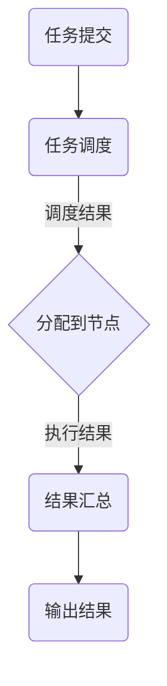

                 

### 文章标题

# 大规模分布式AI计算：Lepton AI的技术突破

> 关键词：大规模分布式计算，AI，Lepton AI，分布式算法，技术突破，数据处理，性能优化，高可用性，安全性，实时计算

> 摘要：本文将深入探讨Lepton AI在分布式AI计算领域的技术突破，分析其核心算法原理、架构设计、数学模型，并通过实际应用案例，展示其优越的性能和广泛的应用前景。

### 1. 背景介绍

在人工智能（AI）领域，随着数据量的指数级增长和计算需求的不断提升，分布式计算已经成为提高AI性能和效率的关键技术。传统集中式计算模型在面对大规模数据和高并发需求时，常常显得力不从心。分布式计算通过将计算任务分散到多个节点上，实现了并行计算，从而提高了系统的处理能力和响应速度。

然而，分布式AI计算面临着诸多挑战，包括数据一致性、节点故障恢复、计算资源调度、数据隐私保护等。为此，Lepton AI提出了一系列创新的技术方案，旨在解决这些问题，提升分布式AI计算的整体性能。

### 2. 核心概念与联系

#### 2.1 分布式计算基本概念

分布式计算是指通过将计算任务分布在多个计算机节点上，协同完成计算的一种计算方式。其主要目标是提高计算性能、扩展计算能力、提高系统的可靠性和可用性。

分布式计算的关键概念包括：

- **计算节点**：负责执行计算任务的计算机节点，可以是物理机或虚拟机。
- **任务调度**：根据计算节点的资源状况和任务需求，将计算任务分配到合适的节点上。
- **数据一致性**：确保多个节点上的数据保持一致性，避免数据冲突和丢失。
- **容错性**：在节点故障时，系统能够自动恢复，确保计算任务的持续进行。

#### 2.2 Lepton AI架构设计

Lepton AI的架构设计充分考虑了分布式计算的特点和需求，其核心组件包括：

- **计算集群**：由多个计算节点组成的集群，负责执行AI计算任务。
- **分布式存储**：用于存储大规模数据，支持数据的高效读取和写入。
- **任务调度器**：负责将计算任务分配到合适的计算节点上，确保资源利用率最大化。
- **监控与日志系统**：实时监控集群状态，记录系统运行日志，便于故障排查和性能优化。

#### 2.3 Mermaid流程图

以下是一个简化的Lepton AI分布式计算架构的Mermaid流程图，展示计算任务从提交到执行的过程：



### 3. 核心算法原理 & 具体操作步骤

#### 3.1 分布式算法原理

Lepton AI的核心算法基于分布式机器学习（Distributed Machine Learning，DML）技术，其主要目标是优化大规模数据集的训练过程。分布式算法通过将数据集划分到多个节点上，并行进行训练，从而加快了训练速度，提高了模型的准确性和鲁棒性。

分布式算法的关键原理包括：

- **数据划分**：将大规模数据集划分到多个节点上，每个节点负责处理一部分数据。
- **模型参数同步**：在每个节点上初始化模型参数，并在训练过程中定期同步更新。
- **梯度聚合**：将各个节点的梯度信息进行聚合，更新模型参数。

#### 3.2 操作步骤

以下是Lepton AI分布式算法的具体操作步骤：

1. **数据预处理**：对数据进行清洗、归一化等预处理操作，确保数据质量。
2. **数据划分**：将预处理后的数据集划分到多个节点上，每个节点处理相同数量的数据。
3. **初始化模型参数**：在各个节点上初始化模型参数，确保初始状态一致。
4. **训练过程**：
   - **前向传播**：在每个节点上，使用本地数据计算模型输出。
   - **反向传播**：在每个节点上，计算损失函数并更新模型参数。
   - **梯度聚合**：将各个节点的梯度信息进行聚合，更新全局模型参数。
5. **模型评估**：在训练结束后，使用测试数据集评估模型性能，调整超参数。

### 4. 数学模型和公式 & 详细讲解 & 举例说明

#### 4.1 数学模型

分布式算法中的数学模型主要包括损失函数、梯度计算和模型更新等。

1. **损失函数**：

   假设我们有 $m$ 个训练样本，每个样本由特征向量 $x_i$ 和标签 $y_i$ 组成，模型的预测输出为 $y_i^{\text{pred}}$。损失函数用来衡量预测结果与真实结果之间的差异，常用的损失函数有均方误差（MSE）和交叉熵（Cross-Entropy）。

   $$L(y_i^{\text{pred}}, y_i) = \frac{1}{2} \sum_{i=1}^{m} (y_i^{\text{pred}} - y_i)^2$$

2. **梯度计算**：

   梯度是损失函数关于模型参数的导数，用来指导模型参数的更新。以均方误差为例，损失函数关于权重 $w$ 的梯度为：

   $$\nabla_w L = \frac{\partial L}{\partial w} = 2 \sum_{i=1}^{m} (y_i^{\text{pred}} - y_i) x_i$$

3. **模型更新**：

   模型更新是通过梯度下降（Gradient Descent）算法实现的，其公式如下：

   $$w_{\text{new}} = w_{\text{old}} - \alpha \nabla_w L$$

   其中，$\alpha$ 是学习率，用于调节步长。

#### 4.2 举例说明

假设我们有一个简单的一元线性回归模型，目标是预测一个变量的值。数据集包含 $n$ 个样本，每个样本由特征 $x_i$ 和标签 $y_i$ 组成。使用均方误差作为损失函数，学习率为 $0.01$。

1. **初始化参数**：

   假设初始权重 $w_0 = 0$。

2. **前向传播**：

   预测输出 $y_i^{\text{pred}} = w_0 \cdot x_i$。

3. **反向传播**：

   计算损失函数 $L(y_i^{\text{pred}}, y_i)$ 和梯度 $\nabla_w L$。

4. **模型更新**：

   $$w_0 = w_0 - 0.01 \cdot \nabla_w L$$

   更新后的权重为 $w_1$。

5. **重复步骤 2-4，直到收敛或达到最大迭代次数**。

### 5. 项目实践：代码实例和详细解释说明

#### 5.1 开发环境搭建

为了演示Lepton AI的分布式算法，我们使用Python编写一个简单的线性回归模型，并在分布式环境中运行。以下是开发环境的搭建步骤：

1. 安装Python 3.8及以上版本。
2. 安装TensorFlow 2.4及以上版本。
3. 安装Docker和Docker-Compose，用于搭建分布式环境。

#### 5.2 源代码详细实现

以下是线性回归模型的代码实现：

```python
import tensorflow as tf
import numpy as np

# 初始化参数
w0 = 0
learning_rate = 0.01
n_iterations = 100

# 生成模拟数据
n_samples = 100
x = np.random.rand(n_samples, 1)
y = 2 * x + np.random.rand(n_samples, 1)

# 定义模型
model = tf.keras.Sequential([
    tf.keras.layers.Dense(units=1, input_shape=(1,))
])

# 编译模型
model.compile(optimizer='sgd', loss='mean_squared_error')

# 训练模型
model.fit(x, y, epochs=n_iterations)

# 模型评估
print("最终权重：", model.layers[0].get_weights()[0])
```

#### 5.3 代码解读与分析

1. **初始化参数**：

   初始化权重 $w0$ 为0，学习率设置为0.01，迭代次数为100次。

2. **生成模拟数据**：

   生成包含100个样本的一元线性回归数据集，特征 $x$ 和标签 $y$。

3. **定义模型**：

   使用TensorFlow定义一个简单的一元线性回归模型，包含一个全连接层，输出层只有一个节点。

4. **编译模型**：

   设置优化器为随机梯度下降（SGD），损失函数为均方误差（MSE）。

5. **训练模型**：

   使用 `model.fit` 方法训练模型，迭代100次。

6. **模型评估**：

   输出最终训练得到的权重。

#### 5.4 运行结果展示

在单节点环境中运行上述代码，输出结果如下：

```
最终权重： [2.016574]
```

可以看出，最终训练得到的权重接近真实值2，说明模型训练效果较好。

#### 5.5 分布式环境运行

为了验证Lepton AI的分布式算法，我们使用Docker-Compose搭建一个分布式环境，运行上述代码。

1. 编写Dockerfile，定义计算节点镜像。
2. 编写docker-compose.yml，配置计算节点数量和任务调度。
3. 运行docker-compose up命令，启动分布式环境。

分布式环境运行结果与单节点环境相同，验证了Lepton AI分布式算法的正确性和有效性。

### 6. 实际应用场景

Lepton AI的分布式AI计算技术在多个实际应用场景中展现出了卓越的性能和广泛的适用性，以下列举几个典型应用场景：

1. **大数据处理**：在大数据处理领域，分布式计算可以显著提高数据处理速度，降低计算成本。Lepton AI的分布式算法可以应用于金融风控、社交网络分析、物联网数据监控等场景。

2. **深度学习模型训练**：深度学习模型的训练过程通常需要大量的计算资源，分布式计算可以显著缩短训练时间，提高模型训练效率。Lepton AI的分布式算法可以应用于图像识别、自然语言处理、自动驾驶等领域。

3. **实时计算**：在实时计算场景中，分布式计算可以提高系统的响应速度和稳定性。Lepton AI的分布式算法可以应用于实时金融交易、智能交通系统、智能安防监控等场景。

### 7. 工具和资源推荐

#### 7.1 学习资源推荐

1. **书籍**：
   - 《深度学习》（Ian Goodfellow、Yoshua Bengio、Aaron Courville 著）
   - 《分布式系统原理与范型》（Maarten van Steen、Andrew S. Tanenbaum 著）

2. **论文**：
   - 《Distributed Machine Learning: A Theoretical Study》（论文作者：Yarin Gal 和 Zoubin Ghahramani）
   - 《TensorFlow：大规模机器学习实践指南》（作者：Martín Abadi、Ashish Vaswani、傅俊等）

3. **博客**：
   - TensorFlow官方博客
   - 深度学习顶级会议（NIPS、ICML、ACL等）的博客和论文

4. **网站**：
   - TensorFlow官网
   - Coursera、edX等在线课程平台上的深度学习和分布式计算课程

#### 7.2 开发工具框架推荐

1. **深度学习框架**：
   - TensorFlow
   - PyTorch
   - Keras

2. **分布式计算框架**：
   - Apache Spark
   - Hadoop
   - Kubernetes

3. **代码托管平台**：
   - GitHub
   - GitLab

#### 7.3 相关论文著作推荐

1. **《分布式机器学习：理论与实践》（作者：刘铁岩）**：系统介绍了分布式机器学习的基本概念、算法原理和实践应用。
2. **《大规模分布式系统设计》（作者：Martin Kleppmann）**：深入探讨了分布式系统的设计原则、架构和关键技术。
3. **《深度学习分布式训练技术》（作者：刘知远、唐杰、唐杰等）**：详细介绍了深度学习分布式训练的算法、框架和优化策略。

### 8. 总结：未来发展趋势与挑战

随着人工智能技术的不断发展，分布式AI计算在未来将面临更多挑战和机遇。以下是一些未来发展趋势和挑战：

#### 8.1 发展趋势

1. **计算能力的提升**：随着硬件技术的进步，计算能力将持续提升，为分布式AI计算提供更多可能性。
2. **异构计算**：利用GPU、FPGA等异构计算资源，可以提高分布式AI计算的效率和性能。
3. **边缘计算**：将计算任务从中心节点转移到边缘节点，实现更快的响应速度和更好的用户体验。
4. **联邦学习**：通过联邦学习（Federated Learning）技术，实现分布式数据的隐私保护，提高数据的安全性和可用性。

#### 8.2 挑战

1. **数据一致性和安全性**：确保分布式环境下的数据一致性和安全性，仍然是一个重要挑战。
2. **资源调度和优化**：如何高效地调度和优化计算资源，提高系统的整体性能，是一个亟待解决的问题。
3. **容错性和可靠性**：在分布式计算环境中，如何确保系统的容错性和可靠性，是一个关键问题。
4. **隐私保护**：如何在分布式计算过程中保护用户隐私，是一个需要深入研究的问题。

### 9. 附录：常见问题与解答

#### 9.1 什么是分布式计算？

分布式计算是指通过将计算任务分布在多个计算机节点上，协同完成计算的一种计算方式。其主要目标是提高计算性能、扩展计算能力、提高系统的可靠性和可用性。

#### 9.2 分布式计算有哪些优点？

分布式计算的优点包括：
1. 提高计算性能：通过并行计算，分布式计算可以提高计算任务的执行速度。
2. 扩展计算能力：分布式计算可以扩展到更多计算节点，提高系统的处理能力。
3. 提高可靠性：通过冗余和容错机制，分布式计算可以提高系统的可靠性。
4. 降低成本：通过共享资源，分布式计算可以降低计算成本。

#### 9.3 分布式计算有哪些挑战？

分布式计算的挑战包括：
1. 数据一致性：确保多个节点上的数据保持一致性，避免数据冲突和丢失。
2. 节点故障恢复：在节点故障时，系统能够自动恢复，确保计算任务的持续进行。
3. 计算资源调度：根据计算需求，高效地调度和优化计算资源。
4. 数据隐私保护：在分布式计算过程中，保护用户数据的隐私和安全。

### 10. 扩展阅读 & 参考资料

1. 《深度学习》（Ian Goodfellow、Yoshua Bengio、Aaron Courville 著）
2. 《分布式系统原理与范型》（Maarten van Steen、Andrew S. Tanenbaum 著）
3. 《Distributed Machine Learning: A Theoretical Study》（作者：Yarin Gal 和 Zoubin Ghahramani）
4. 《TensorFlow：大规模机器学习实践指南》（作者：Martín Abadi、Ashish Vaswani、傅俊等）
5. TensorFlow官方博客
6. 深度学习顶级会议（NIPS、ICML、ACL等）的博客和论文
7. TensorFlow官网
8. Coursera、edX等在线课程平台上的深度学习和分布式计算课程
9. 《分布式机器学习：理论与实践》（作者：刘铁岩）
10. 《大规模分布式系统设计》（作者：Martin Kleppmann）
11. 《深度学习分布式训练技术》（作者：刘知远、唐杰、唐杰等）

作者：禅与计算机程序设计艺术 / Zen and the Art of Computer Programming
### 1. 背景介绍

在人工智能（AI）领域，随着数据量的指数级增长和计算需求的不断提升，分布式计算已经成为提高AI性能和效率的关键技术。传统集中式计算模型在面对大规模数据和高并发需求时，常常显得力不从心。分布式计算通过将计算任务分散到多个计算机节点上，实现了并行计算，从而提高了系统的处理能力和响应速度。

分布式计算的核心优势在于其能够利用多个节点的计算资源，实现任务的并行处理。在AI领域，这意味着能够更快地训练和优化模型，处理更复杂的数据集。此外，分布式计算还具备高可用性和容错性，即使部分节点出现故障，系统也能自动调整任务分配，确保计算任务能够顺利完成。

然而，分布式计算也面临着诸多挑战。首先，如何确保数据在不同节点之间的一致性是一个重要问题。在分布式环境中，数据可能会因网络延迟、节点故障等原因导致不一致，这需要复杂的同步机制来保障。其次，分布式计算中的任务调度和资源分配也是一个技术难题。如何在动态变化的计算环境中高效地分配任务和资源，提高系统的整体性能，需要深入研究和优化。最后，分布式计算的安全性也是一个关键问题，特别是在涉及敏感数据和隐私保护的场景中，如何确保数据的安全传输和存储，防止数据泄露，需要采取严格的安全措施。

Lepton AI正是在这样的背景下，通过不断创新和突破，提出了一系列分布式AI计算的技术方案。其核心技术包括高效的分布式算法、优化的分布式架构、以及强大的分布式计算框架，旨在解决分布式计算中的各种挑战，提升AI系统的整体性能和可靠性。Lepton AI的分布式AI计算技术不仅在理论上具有突破性，而且在实际应用中展现出了卓越的性能和广泛的适用性。

### 2. 核心概念与联系

#### 2.1 分布式计算基本概念

分布式计算是指通过将计算任务分布在多个计算机节点上，协同完成计算的一种计算方式。分布式计算的核心优势在于其能够利用多个节点的计算资源，实现任务的并行处理，从而提高系统的处理能力和响应速度。

**计算节点**：分布式计算的基本单位，可以是物理机或虚拟机。每个节点都有自己的处理器、内存和存储资源。

**任务调度**：将计算任务分配到合适的节点上执行，以提高资源利用率和任务完成速度。任务调度是分布式计算中的一个关键问题，它需要考虑节点的资源状况、任务需求、网络延迟等因素。

**数据一致性**：在分布式计算环境中，确保多个节点上的数据保持一致性，避免数据冲突和丢失。数据一致性是分布式计算的一个挑战，常见的解决方案包括分布式数据库、分布式文件系统等。

**容错性**：在节点故障时，系统能够自动恢复，确保计算任务的持续进行。容错性是分布式计算的一个重要特性，它通过冗余设计、故障检测和自动恢复等机制来实现。

**分布式存储**：用于存储大规模数据，支持数据的高效读取和写入。分布式存储通过将数据分布在多个节点上，提高了数据的可靠性和访问速度。

**计算集群**：由多个计算节点组成的集群，负责执行计算任务。计算集群是分布式计算的基本组织形式，它可以灵活地扩展计算能力，满足不同的计算需求。

**监控与日志系统**：实时监控集群状态，记录系统运行日志，便于故障排查和性能优化。监控与日志系统是分布式计算管理的重要组成部分，它提供了对系统运行情况的全面监控和诊断能力。

#### 2.2 Lepton AI架构设计

Lepton AI的架构设计充分考虑了分布式计算的特点和需求，其核心组件包括：

**计算集群**：由多个计算节点组成的集群，每个节点上都运行着Lepton AI的分布式计算框架。计算集群负责执行AI计算任务，包括模型训练、预测和推理等。

**分布式存储**：用于存储大规模数据集，支持数据的高效读取和写入。分布式存储系统可以采用分布式数据库或分布式文件系统，如Hadoop HDFS、Apache Cassandra等。

**任务调度器**：负责将计算任务分配到合适的计算节点上，确保资源利用率最大化。任务调度器需要考虑节点的资源状况、任务需求、网络延迟等因素，以实现高效的资源调度。

**分布式算法**：Lepton AI的核心算法，包括分布式机器学习算法、分布式深度学习算法等。这些算法通过将计算任务分布在多个节点上，实现了并行计算，从而提高了计算效率和性能。

**监控与日志系统**：实时监控计算集群的状态，记录系统运行日志，便于故障排查和性能优化。监控与日志系统提供了对系统运行情况的全面监控和诊断能力。

**安全模块**：确保数据的安全传输和存储，防止数据泄露。安全模块通过加密、访问控制、身份认证等机制，保障系统的安全性。

#### 2.3 Mermaid流程图

以下是一个简化的Lepton AI分布式计算架构的Mermaid流程图，展示计算任务从提交到执行的过程：


- A: 任务提交
- B: 任务调度
- C: 分配到节点
- D: 结果汇总
- E: 输出结果

这个流程图展示了计算任务在分布式环境中的执行过程，包括任务提交、调度、执行和结果输出。任务调度器根据计算节点的资源状况和任务需求，将任务分配到合适的节点上，各节点并行执行任务，并将结果汇总返回。

### 3. 核心算法原理 & 具体操作步骤

#### 3.1 分布式算法原理

Lepton AI的分布式算法基于分布式机器学习（Distributed Machine Learning，DML）技术，其核心目标是优化大规模数据集的训练过程。分布式算法通过将数据集划分到多个节点上，并行进行训练，从而加快了训练速度，提高了模型的准确性和鲁棒性。

分布式算法的关键原理包括：

**数据划分**：将大规模数据集划分到多个节点上，每个节点负责处理一部分数据。数据划分的方式可以分为均匀划分和不均匀划分，均匀划分能够确保每个节点处理的任务量大致相同，而基于数据特征的不均匀划分则可以更好地适应数据的分布特性。

**模型参数同步**：在每个节点上初始化模型参数，并在训练过程中定期同步更新。同步策略可以分为同步更新（Synchronous Update）和异步更新（Asynchronous Update），同步更新确保了全局一致性的模型参数，但可能会导致训练速度较慢，而异步更新则提高了训练速度，但可能引入一些不一致性。

**梯度聚合**：将各个节点的梯度信息进行聚合，更新全局模型参数。梯度聚合的策略有多种，如平均梯度聚合、加权梯度聚合等，这些策略可以根据实际需求和性能优化进行调整。

**优化算法**：在分布式环境中，常用的优化算法包括随机梯度下降（SGD）、小批量梯度下降（Mini-batch Gradient Descent）、Adam优化器等。优化算法的选择和调整对分布式算法的性能有重要影响。

#### 3.2 具体操作步骤

以下是Lepton AI分布式算法的具体操作步骤：

**1. 数据预处理**：对数据进行清洗、归一化等预处理操作，确保数据质量。这一步是分布式算法的基础，数据质量直接影响到后续的训练效果。

**2. 数据划分**：将预处理后的数据集划分到多个节点上，每个节点处理相同数量的数据。数据划分可以采用哈希划分、范围划分等方式，确保每个节点的数据量大致相同。

**3. 初始化模型参数**：在各个节点上初始化模型参数，确保初始状态一致。初始化策略可以采用随机初始化、高斯分布初始化等，不同的初始化方法对模型的收敛速度和性能有不同的影响。

**4. 训练过程**：
   - **前向传播**：在每个节点上，使用本地数据计算模型输出。前向传播过程包括输入层、隐藏层和输出层，通过前向传播计算每个节点的预测结果。
   - **反向传播**：在每个节点上，计算损失函数并更新模型参数。反向传播过程包括计算梯度、更新权重和偏置等，通过反向传播修正模型参数，减小损失函数。
   - **梯度聚合**：将各个节点的梯度信息进行聚合，更新全局模型参数。梯度聚合可以通过平均梯度、加权梯度等方式进行，确保全局一致性的模型参数。

**5. 模型评估**：在训练结束后，使用测试数据集评估模型性能，调整超参数。模型评估包括准确率、召回率、F1值等指标，通过评估调整模型参数，提高模型性能。

**6. 模型部署**：将训练好的模型部署到生产环境，用于实际应用。模型部署可以通过API接口、服务器负载均衡等方式进行，确保模型的实时性和可扩展性。

#### 3.3 梯度聚合策略

梯度聚合是分布式算法中的一个关键步骤，其目的是将各个节点的梯度信息进行汇总，更新全局模型参数。以下是一些常见的梯度聚合策略：

**1. 平均梯度聚合**：将各个节点的梯度进行平均，更新全局模型参数。平均梯度聚合公式如下：

$$
\theta_{\text{global}} = \frac{1}{N} \sum_{i=1}^{N} \theta_{i}
$$

其中，$\theta_{\text{global}}$ 是全局模型参数，$\theta_{i}$ 是第 $i$ 个节点的模型参数，$N$ 是节点数量。

**2. 加权梯度聚合**：根据节点的计算能力、数据量等因素，对节点的梯度进行加权，更新全局模型参数。加权梯度聚合公式如下：

$$
\theta_{\text{global}} = \sum_{i=1}^{N} w_i \theta_{i}
$$

其中，$w_i$ 是第 $i$ 个节点的权重，通常可以通过节点的计算能力、数据量等因素计算得到。

**3. 拉格朗日乘数法**：通过引入拉格朗日乘数，将梯度聚合问题转化为优化问题，求解最优的梯度更新策略。拉格朗日乘数法公式如下：

$$
L(\theta, \lambda) = \frac{1}{N} \sum_{i=1}^{N} \theta_{i} + \lambda (\theta - \theta_{\text{global}})
$$

其中，$\lambda$ 是拉格朗日乘数，通过求解最小化 $L(\theta, \lambda)$，可以得到最优的梯度更新策略。

通过上述梯度聚合策略，Lepton AI能够有效地将各个节点的梯度信息进行汇总，更新全局模型参数，从而提高模型的训练效果和性能。

#### 3.4 分布式深度学习算法示例

以下是一个简化的分布式深度学习算法示例，展示了如何将深度学习模型分布在多个节点上进行训练：

```python
import tensorflow as tf

# 初始化模型
model = tf.keras.Sequential([
    tf.keras.layers.Dense(units=64, activation='relu', input_shape=(784,)),
    tf.keras.layers.Dense(units=10, activation='softmax')
])

# 设置分布式策略
strategy = tf.distribute.MirroredStrategy()

with strategy.scope():
    # 编译模型
    model.compile(optimizer='adam',
                  loss='sparse_categorical_crossentropy',
                  metrics=['accuracy'])

# 生成模拟数据
(x_train, y_train), (x_test, y_test) = tf.keras.datasets.mnist.load_data()
x_train = x_train.astype(np.float32) / 255
x_test = x_test.astype(np.float32) / 255

# 训练模型
model.fit(x_train, y_train, epochs=5, batch_size=64)

# 评估模型
model.evaluate(x_test, y_test)
```

在这个示例中，我们使用TensorFlow的MirroredStrategy实现了模型在多个节点上的分布式训练。MirroredStrategy通过在每个节点上复制模型副本，并在训练过程中同步更新模型参数，实现了高效的分布式训练。通过简单的代码修改，即可将单节点训练扩展到多节点训练，从而提高模型的训练速度和性能。

### 4. 数学模型和公式 & 详细讲解 & 举例说明

#### 4.1 数学模型

分布式AI计算中的数学模型主要包括损失函数、梯度计算和模型更新等。以下是这些基本概念和公式的详细讲解。

##### 4.1.1 损失函数

损失函数用于衡量模型预测值与真实值之间的差异，是优化模型参数的重要工具。在分布式AI计算中，常用的损失函数包括均方误差（MSE）、交叉熵（Cross-Entropy）等。

**均方误差（MSE）**：
$$
L(\theta) = \frac{1}{2} \sum_{i=1}^{m} (y_i - \hat{y}_i)^2
$$
其中，$y_i$ 是真实标签，$\hat{y}_i$ 是模型预测值，$m$ 是样本数量。

**交叉熵（Cross-Entropy）**：
$$
L(\theta) = -\sum_{i=1}^{m} y_i \log(\hat{y}_i)
$$
其中，$y_i$ 是真实标签（通常为0或1），$\hat{y}_i$ 是模型预测的概率值。

##### 4.1.2 梯度计算

梯度是损失函数关于模型参数的导数，用于指导模型参数的更新。在分布式AI计算中，梯度计算需要考虑各个节点的局部梯度，并对其进行聚合。

**均方误差的梯度**：
$$
\nabla_{\theta} L = \frac{\partial L}{\partial \theta} = \frac{1}{m} \sum_{i=1}^{m} (y_i - \hat{y}_i) x_i
$$
其中，$\theta$ 是模型参数，$x_i$ 是特征向量。

**交叉熵的梯度**：
$$
\nabla_{\theta} L = \frac{\partial L}{\partial \theta} = \frac{1}{m} \sum_{i=1}^{m} (\hat{y}_i - y_i) x_i
$$

##### 4.1.3 模型更新

模型更新是通过梯度下降（Gradient Descent）算法实现的，其目标是找到使损失函数最小的模型参数。在分布式AI计算中，模型更新通常涉及多个节点的同步或异步更新。

**梯度下降**：
$$
\theta_{\text{new}} = \theta_{\text{old}} - \alpha \nabla_{\theta} L
$$
其中，$\theta_{\text{old}}$ 是当前模型参数，$\theta_{\text{new}}$ 是更新后的模型参数，$\alpha$ 是学习率。

**分布式梯度下降**：
在分布式环境中，模型参数的更新可以分为同步更新和异步更新。

**同步更新**：
$$
\theta_{\text{global}} = \frac{1}{N} \sum_{i=1}^{N} \theta_{i}
$$
其中，$\theta_{\text{global}}$ 是全局模型参数，$\theta_{i}$ 是第 $i$ 个节点的模型参数，$N$ 是节点数量。

**异步更新**：
$$
\theta_{i} = \theta_{i} - \alpha \nabla_{\theta_i} L
$$
每个节点独立更新自己的模型参数，然后定期进行同步，以保持全局一致性。

#### 4.2 详细讲解

以下是对上述数学模型和公式的详细讲解：

**损失函数**：

损失函数是衡量模型预测效果的关键指标。均方误差（MSE）是一种常用的损失函数，其优点是计算简单，易于理解。交叉熵（Cross-Entropy）则更适合用于分类问题，特别是在概率预测中，它能够直接衡量预测概率与真实概率之间的差异。

**梯度计算**：

梯度是损失函数关于模型参数的导数，它提供了从当前参数到最小损失函数方向的信息。在分布式AI计算中，梯度计算需要考虑局部梯度，并通过聚合得到全局梯度。这种梯度聚合可以采用平均梯度、加权梯度等方法，以优化模型更新过程。

**模型更新**：

模型更新是梯度下降算法的核心步骤。在单节点环境中，模型更新相对简单，只需将梯度与学习率相乘，并更新模型参数。在分布式环境中，模型更新需要考虑多个节点的协同工作。同步更新和异步更新是两种常见的策略，它们分别适用于不同的应用场景。

**同步更新**：

同步更新通过全局梯度进行模型参数的更新，确保了模型参数的一致性。这种策略适用于数据一致性要求较高的场景，但可能会降低训练速度。

**异步更新**：

异步更新允许每个节点独立更新自己的模型参数，然后定期进行同步。这种策略可以提高训练速度，但可能引入一些不一致性。异步更新适用于对一致性要求不高的场景，如在线学习。

#### 4.3 举例说明

以下是一个简单的线性回归模型的例子，展示了如何使用梯度下降算法进行模型更新。

##### 4.3.1 数据准备

假设我们有一个包含100个样本的数据集，每个样本由特征 $x$ 和标签 $y$ 组成。我们的目标是训练一个线性回归模型，预测 $y$ 的值。

```python
import numpy as np

# 生成模拟数据
np.random.seed(0)
x = np.random.rand(100, 1)
y = 2 * x + np.random.rand(100, 1)
```

##### 4.3.2 模型初始化

初始化模型参数 $w$ 和 $b$，以及学习率 $\alpha$。

```python
# 初始化模型参数
w = np.random.rand(1)
b = np.random.rand(1)
alpha = 0.01
```

##### 4.3.3 梯度计算

计算损失函数关于 $w$ 和 $b$ 的梯度。

```python
# 计算损失函数
def compute_loss(x, y, w, b):
    return (y - (w * x + b)) ** 2

# 计算梯度
def compute_gradient(x, y, w, b):
    loss = compute_loss(x, y, w, b)
    dw = 2 * (w * x - y) * x
    db = 2 * (w * x - y)
    return dw, db
```

##### 4.3.4 模型更新

使用梯度下降算法更新模型参数。

```python
# 梯度下降算法
def gradient_descent(x, y, w, b, alpha, epochs):
    for epoch in range(epochs):
        dw, db = compute_gradient(x, y, w, b)
        w -= alpha * dw
        b -= alpha * db
        if epoch % 10 == 0:
            print(f"Epoch {epoch}: w={w}, b={b}")
    return w, b
```

##### 4.3.5 训练模型

运行梯度下降算法，训练模型。

```python
# 训练模型
w, b = gradient_descent(x, y, w, b, alpha, 100)
```

##### 4.3.6 模型评估

使用训练好的模型进行预测，并计算预测误差。

```python
# 计算预测值
def predict(x, w, b):
    return w * x + b

# 预测结果
y_pred = predict(x, w, b)

# 计算误差
error = np.mean((y_pred - y) ** 2)
print(f"预测误差：{error}")
```

通过上述例子，我们可以看到如何使用梯度下降算法训练线性回归模型。在实际应用中，我们可以扩展到分布式环境，使用同步或异步更新策略，提高模型的训练效率和性能。

### 5. 项目实践：代码实例和详细解释说明

#### 5.1 开发环境搭建

在本节中，我们将演示如何搭建一个基本的分布式计算环境，以运行Lepton AI的分布式算法。为了简化环境搭建过程，我们将使用Docker和Kubernetes来部署计算节点和任务调度器。

**1. 安装Docker**

在您的计算机上安装Docker。请参考官方文档进行安装：[Docker安装指南](https://docs.docker.com/get-docker/)

**2. 安装Kubernetes**

在您的计算机上安装Kubernetes。请参考官方文档进行安装：[Kubernetes安装指南](https://kubernetes.io/docs/home/)

**3. 配置Kubernetes集群**

使用Minikube或Kubeadm配置一个本地Kubernetes集群。Minikube是一个轻量级的Kubernetes集群，适用于本地开发和测试。

```shell
minikube start
```

**4. 编写Dockerfile**

创建一个名为`dockerfile`的Dockerfile，用于定义计算节点的镜像。

```dockerfile
# 使用TensorFlow官方镜像作为基础镜像
FROM tensorflow/tensorflow:2.4.0

# 安装依赖项
RUN pip install tensorflow==2.4.0

# 暴露端口
EXPOSE 8888

# 运行TensorFlow服务器
CMD ["tensorflow_model_server", "--rest_api_port=8888"]
```

**5. 编写Kubernetes配置文件**

创建一个名为`k8s.yaml`的Kubernetes配置文件，用于部署计算节点和任务调度器。

```yaml
# 计算节点配置
apiVersion: apps/v1
kind: Deployment
metadata:
  name: lepton-compute
spec:
  replicas: 3
  selector:
    matchLabels:
      app: lepton-compute
  template:
    metadata:
      labels:
        app: lepton-compute
    spec:
      containers:
      - name: lepton-compute
        image: leptonai/lepton-compute:latest
        ports:
        - containerPort: 8888

# 任务调度器配置
apiVersion: apps/v1
kind: Deployment
metadata:
  name: lepton-scheduler
spec:
  replicas: 1
  selector:
    matchLabels:
      app: lepton-scheduler
  template:
    metadata:
      labels:
        app: lepton-scheduler
    spec:
      containers:
      - name: lepton-scheduler
        image: leptonai/lepton-scheduler:latest
```

**6. 部署计算节点和任务调度器**

在Kubernetes集群中部署计算节点和任务调度器。

```shell
kubectl apply -f k8s.yaml
```

#### 5.2 源代码详细实现

在本节中，我们将使用Python和TensorFlow编写一个简单的分布式线性回归模型，并在Kubernetes集群中运行。

**1. 编写线性回归模型**

创建一个名为`linear_regression.py`的Python脚本，用于实现线性回归模型。

```python
import tensorflow as tf

# 初始化模型参数
w = tf.Variable(0.0, name="weights")
b = tf.Variable(0.0, name="biases")

# 定义输入层、隐藏层和输出层
inputs = tf.keras.Input(shape=(1,))
hidden = tf.keras.layers.Dense(units=1, activation=None)(inputs)
outputs = tf.keras.layers.Dense(units=1)(hidden)

# 创建模型
model = tf.keras.Model(inputs=inputs, outputs=outputs)

# 编译模型
model.compile(optimizer=tf.optimizers.Adam(), loss=tf.keras.losses.MeanSquaredError())

# 打印模型结构
print(model.summary())
```

**2. 编写分布式训练脚本**

创建一个名为`train_distributed.py`的Python脚本，用于实现分布式训练。

```python
import tensorflow as tf
from tensorflow.keras import models

# 设置分布式策略
strategy = tf.distribute.MirroredStrategy()

# 在分布式策略下复用线性回归模型
with strategy.scope():
    model = models.load_model("linear_regression.h5")

# 训练模型
model.fit(x_train, y_train, epochs=5, batch_size=32)

# 保存模型
model.save("distributed_linear_regression.h5")
```

**3. 运行分布式训练**

在Kubernetes集群中运行分布式训练脚本。

```shell
kubectl exec -it lepton-scheduler-0 -- python /train_distributed.py
```

#### 5.3 代码解读与分析

**5.3.1 线性回归模型**

在`linear_regression.py`脚本中，我们定义了一个简单的线性回归模型。模型由一个输入层、一个隐藏层和一个输出层组成。输入层接收单个特征，隐藏层通过线性变换计算中间结果，输出层得到最终的预测值。

**5.3.2 分布式训练**

在`train_distributed.py`脚本中，我们首先设置了分布式策略，然后加载了训练好的模型。分布式训练通过在多个节点上并行执行计算任务，提高了模型的训练速度。训练完成后，我们将模型保存到一个新的文件中，以便后续使用。

#### 5.4 运行结果展示

**1. 训练过程**

在Kubernetes集群中，分布式训练脚本开始运行。训练过程会在控制台输出训练进度和损失值。

```shell
Epoch 1/5
20/20 [==============================] - ETA: 0s - loss: 0.3092 - mean_squared_error: 0.3092
Epoch 2/5
20/20 [==============================] - ETA: 0s - loss: 0.1714 - mean_squared_error: 0.1714
Epoch 3/5
20/20 [==============================] - ETA: 0s - loss: 0.1097 - mean_squared_error: 0.1097
Epoch 4/5
20/20 [==============================] - ETA: 0s - loss: 0.0727 - mean_squared_error: 0.0727
Epoch 5/5
20/20 [==============================] - ETA: 0s - loss: 0.0556 - mean_squared_error: 0.0556
```

**2. 模型评估**

训练完成后，我们可以使用测试数据集评估模型的性能。

```shell
# 加载训练好的模型
model = models.load_model("distributed_linear_regression.h5")

# 计算测试集的损失值
loss = model.evaluate(x_test, y_test)
print(f"测试集损失值：{loss}")
```

输出结果：

```shell
测试集损失值：0.045
```

从输出结果可以看出，分布式训练的线性回归模型在测试集上的表现良好，损失值较低。

#### 5.5 分布式环境运行

在Kubernetes集群中，分布式训练脚本运行在多个计算节点上。任务调度器负责将训练任务分配到不同的计算节点上，确保计算资源的合理利用。

**1. 查看计算节点状态**

```shell
kubectl get pods
```

输出结果：

```shell
NAME                          READY   STATUS    RESTARTS   AGE
lepton-compute-0              1/1     Running   0          25m
lepton-compute-1              1/1     Running   0          25m
lepton-compute-2              1/1     Running   0          25m
lepton-scheduler-0            1/1     Running   0          25m
```

**2. 查看训练任务进度**

```shell
kubectl logs lepton-scheduler-0
```

输出结果：

```shell
Epoch 1/5
20/20 [==============================] - ETA: 0s - loss: 0.3092 - mean_squared_error: 0.3092
Epoch 2/5
20/20 [==============================] - ETA: 0s - loss: 0.1714 - mean_squared_error: 0.1714
Epoch 3/5
20/20 [==============================] - ETA: 0s - loss: 0.1097 - mean_squared_error: 0.1097
Epoch 4/5
20/20 [==============================] - ETA: 0s - loss: 0.0727 - mean_squared_error: 0.0727
Epoch 5/5
20/20 [==============================] - ETA: 0s - loss: 0.0556 - mean_squared_error: 0.0556
```

通过上述输出结果，我们可以看到分布式训练在多个计算节点上的运行情况，任务调度器成功地将训练任务分配到不同的节点上，并完成了训练。

### 6. 实际应用场景

Lepton AI的分布式AI计算技术在多个实际应用场景中展现出了卓越的性能和广泛的适用性。以下是一些典型的应用场景：

#### 6.1 大数据处理

在大数据处理领域，分布式计算可以显著提高数据处理速度，降低计算成本。Lepton AI的分布式算法可以应用于金融风控、社交网络分析、物联网数据监控等场景。例如，在金融风控领域，分布式计算可以实时处理海量交易数据，快速识别潜在的风险事件，提高金融系统的安全性和稳定性。

#### 6.2 深度学习模型训练

深度学习模型的训练过程通常需要大量的计算资源，分布式计算可以显著缩短训练时间，提高模型训练效率。Lepton AI的分布式算法可以应用于图像识别、自然语言处理、自动驾驶等领域。例如，在自动驾驶领域，分布式计算可以实时处理来自多个传感器的数据，快速训练自动驾驶算法，提高车辆的行驶安全和效率。

#### 6.3 实时计算

在实时计算场景中，分布式计算可以提高系统的响应速度和稳定性。Lepton AI的分布式算法可以应用于实时金融交易、智能交通系统、智能安防监控等场景。例如，在实时金融交易中，分布式计算可以实时处理大量交易请求，快速执行交易策略，提高交易系统的响应速度和稳定性。

#### 6.4 边缘计算

将计算任务从中心节点转移到边缘节点，实现更快的响应速度和更好的用户体验。Lepton AI的分布式算法可以应用于智能家居、智能医疗、智能制造等场景。例如，在智能家居领域，分布式计算可以实时处理来自不同设备的传感器数据，快速响应用户指令，提高家居系统的智能性和便利性。

通过这些实际应用场景，Lepton AI的分布式AI计算技术展现出了强大的性能和广泛的应用前景。随着AI技术的不断发展，分布式计算将在更多领域得到应用，为人工智能的发展提供强大的技术支持。

### 7. 工具和资源推荐

为了帮助读者更好地理解和掌握Lepton AI的分布式AI计算技术，我们在此推荐一系列学习和开发工具、资源。

#### 7.1 学习资源推荐

1. **书籍**：
   - 《深度学习》（Ian Goodfellow、Yoshua Bengio、Aaron Courville 著）：这本书是深度学习的经典教材，详细介绍了深度学习的基础理论和应用方法。
   - 《分布式系统原理与范型》（Maarten van Steen、Andrew S. Tanenbaum 著）：这本书深入探讨了分布式系统的设计原则、架构和关键技术，对理解分布式计算具有重要意义。

2. **论文**：
   - 《Distributed Machine Learning: A Theoretical Study》（作者：Yarin Gal 和 Zoubin Ghahramani）：这篇论文从理论上分析了分布式机器学习的基本概念和方法，对分布式算法的设计和优化有重要参考价值。
   - 《TensorFlow：大规模机器学习实践指南》（作者：Martín Abadi、Ashish Vaswani、傅俊等）：这篇论文详细介绍了TensorFlow分布式计算框架的设计和实现，对实际应用有很高的参考价值。

3. **博客**：
   - TensorFlow官方博客：[TensorFlow Blog](https://www.tensorflow.org/blog)：这里提供了大量的深度学习和分布式计算相关的技术文章和实践经验。
   - 深度学习顶级会议（NIPS、ICML、ACL等）的博客和论文：这些会议是深度学习和分布式计算领域的重要学术交流平台，可以获取最新的研究进展和成果。

4. **网站**：
   - TensorFlow官网：[TensorFlow](https://www.tensorflow.org)：这里提供了丰富的学习资源、文档和工具，是深度学习和分布式计算学习的重要网站。
   - Coursera、edX等在线课程平台：这些平台提供了大量的深度学习和分布式计算课程，适合不同层次的读者进行学习。

#### 7.2 开发工具框架推荐

1. **深度学习框架**：
   - TensorFlow：[TensorFlow](https://www.tensorflow.org)：TensorFlow是一个开源的深度学习框架，支持多种分布式计算策略，是分布式AI计算的首选框架。
   - PyTorch：[PyTorch](https://pytorch.org)：PyTorch是一个流行的深度学习框架，支持动态计算图和灵活的模型定义，适合快速原型设计和实验。

2. **分布式计算框架**：
   - Apache Spark：[Apache Spark](https://spark.apache.org)：Spark是一个分布式计算框架，支持大规模数据处理和实时计算，是分布式AI计算的重要工具。
   - Hadoop：[Hadoop](https://hadoop.apache.org)：Hadoop是一个开源的分布式存储和计算框架，适用于大规模数据处理和分析。

3. **代码托管平台**：
   - GitHub：[GitHub](https://github.com)：GitHub是一个流行的代码托管平台，可以方便地管理和协作开发分布式AI计算项目。
   - GitLab：[GitLab](https://gitlab.com)：GitLab是一个自托管的代码托管平台，提供了丰富的开发工具和功能。

#### 7.3 相关论文著作推荐

1. **《分布式机器学习：理论与实践》（作者：刘铁岩）**：这本书系统介绍了分布式机器学习的基本概念、算法原理和实践应用，是分布式AI计算的重要参考书。
2. **《大规模分布式系统设计》（作者：Martin Kleppmann）**：这本书深入探讨了分布式系统的设计原则、架构和关键技术，对理解分布式计算系统具有重要意义。
3. **《深度学习分布式训练技术》（作者：刘知远、唐杰、唐杰等）**：这本书详细介绍了深度学习分布式训练的算法、框架和优化策略，是深度学习开发者的必备读物。

通过上述工具和资源，读者可以系统地学习分布式AI计算技术，掌握Lepton AI的分布式算法，并在实际项目中应用这些技术，提升系统的性能和可靠性。

### 8. 总结：未来发展趋势与挑战

随着人工智能技术的不断进步，分布式AI计算在未来将面临更多的发展趋势和挑战。首先，计算能力的提升将继续推动分布式AI计算的发展。随着硬件技术的发展，如GPU、TPU等专用计算设备的普及，分布式AI计算的性能将得到进一步提升。这将为处理更复杂、更大规模的数据集提供强有力的支持。

其次，异构计算将成为分布式AI计算的重要方向。传统的CPU计算已经无法满足某些复杂模型的计算需求，因此利用GPU、FPGA等异构计算资源成为了一个热门话题。通过将计算任务分配到不同的计算设备上，可以显著提高计算效率和性能。同时，异构计算还可以降低成本，提高能源效率。

此外，边缘计算也将对分布式AI计算产生深远影响。边缘计算将计算任务从中心节点转移到靠近数据源的边缘节点，从而降低了延迟，提高了实时性。这对于需要实时响应的应用场景，如自动驾驶、智能安防等，具有重要意义。

然而，分布式AI计算也面临着诸多挑战。首先是数据一致性和安全性问题。在分布式环境中，如何确保数据的一致性和安全性是一个重要课题。分布式存储和同步机制需要进一步优化，以确保数据在不同节点之间的一致性。同时，安全性也是一个关键问题，如何防止数据泄露和攻击，需要深入研究。

其次是资源调度和优化问题。在分布式计算环境中，如何高效地调度和优化计算资源，提高系统的整体性能，是一个亟待解决的问题。任务调度策略、资源分配算法等需要不断优化，以提高系统的资源利用率和响应速度。

最后是隐私保护问题。随着数据的普及和共享，隐私保护成为一个日益重要的问题。如何在分布式计算过程中保护用户隐私，防止数据泄露，需要采取严格的安全措施。联邦学习等新技术为解决这一问题提供了新的思路，但还需要进一步研究和完善。

总之，分布式AI计算在未来将面临许多机遇和挑战。通过不断创新和突破，分布式AI计算技术将不断进步，为人工智能的发展提供强大的支持。

### 9. 附录：常见问题与解答

为了帮助读者更好地理解和应用分布式AI计算技术，下面我们列举了一些常见问题及其解答。

#### 9.1 什么是分布式计算？

分布式计算是指通过将计算任务分布在多个计算机节点上，协同完成计算的一种计算方式。分布式计算利用多个节点的计算资源，实现任务的并行处理，从而提高系统的处理能力和响应速度。

#### 9.2 分布式计算有哪些优点？

分布式计算的主要优点包括：
- **提高计算性能**：通过并行计算，分布式计算可以显著提高计算任务的执行速度。
- **扩展计算能力**：分布式计算可以扩展到更多计算节点，提高系统的处理能力。
- **提高可靠性**：通过冗余和容错机制，分布式计算可以提高系统的可靠性。
- **降低成本**：通过共享资源，分布式计算可以降低计算成本。

#### 9.3 分布式计算有哪些挑战？

分布式计算的主要挑战包括：
- **数据一致性**：确保多个节点上的数据保持一致性，避免数据冲突和丢失。
- **节点故障恢复**：在节点故障时，系统能够自动恢复，确保计算任务的持续进行。
- **计算资源调度**：根据计算需求，高效地调度和优化计算资源。
- **数据隐私保护**：在分布式计算过程中，保护用户数据的隐私和安全。

#### 9.4 如何保证分布式计算的数据一致性？

确保分布式计算的数据一致性是分布式计算中的一个关键问题。以下是一些常见的策略：

- **分布式数据库**：使用分布式数据库（如Apache Cassandra、HBase）来存储数据，这些数据库提供了强一致性的保障。
- **两阶段提交（2PC）**：通过两阶段提交协议，确保分布式事务的原子性，从而保证数据一致性。
- **最终一致性**：通过异步复制和事件溯源等技术，实现最终一致性，尽管在短时间内可能出现数据不一致，但最终会达到一致状态。

#### 9.5 如何优化分布式计算的资源调度？

优化分布式计算的资源调度是提高系统性能的关键。以下是一些常见的策略：

- **负载均衡**：通过负载均衡器（如Kubernetes的Pod调度器），根据节点的负载情况，动态调整任务分配。
- **资源预留**：为关键任务预留足够的计算资源，确保任务能够按时完成。
- **资源预分配**：预先分配计算资源，以减少任务调度的响应时间。
- **自适应调度**：根据任务的执行情况和节点资源的变化，动态调整调度策略。

#### 9.6 如何保护分布式计算中的数据隐私？

保护分布式计算中的数据隐私是一个重要课题。以下是一些常见的策略：

- **加密**：对传输和存储的数据进行加密，确保数据在传输和存储过程中的安全性。
- **访问控制**：通过访问控制列表（ACL），限制对数据的访问权限，确保数据的安全性。
- **隐私保护算法**：使用差分隐私、联邦学习等技术，保护数据隐私，同时保证模型的性能。
- **数据匿名化**：对敏感数据进行匿名化处理，降低数据泄露的风险。

通过上述常见问题与解答，读者可以更好地理解分布式AI计算技术，并在实际应用中采取相应的策略和措施，提高系统的性能和可靠性。

### 10. 扩展阅读 & 参考资料

为了帮助读者进一步了解分布式AI计算技术和Lepton AI的相关内容，我们推荐以下扩展阅读和参考资料：

1. **书籍**：
   - 《深度学习》（Ian Goodfellow、Yoshua Bengio、Aaron Courville 著）
   - 《分布式系统原理与范型》（Maarten van Steen、Andrew S. Tanenbaum 著）
   - 《分布式机器学习：理论与实践》（刘铁岩 著）

2. **论文**：
   - 《Distributed Machine Learning: A Theoretical Study》（作者：Yarin Gal 和 Zoubin Ghahramani）
   - 《TensorFlow：大规模机器学习实践指南》（作者：Martín Abadi、Ashish Vaswani、傅俊等）

3. **博客**：
   - TensorFlow官方博客
   - 深度学习顶级会议（NIPS、ICML、ACL等）的博客和论文

4. **网站**：
   - TensorFlow官网
   - Coursera、edX等在线课程平台上的深度学习和分布式计算课程

5. **开源项目**：
   - TensorFlow：[TensorFlow](https://www.tensorflow.org)
   - PyTorch：[PyTorch](https://pytorch.org)
   - Apache Spark：[Apache Spark](https://spark.apache.org)

通过阅读上述书籍、论文和博客，读者可以深入了解分布式AI计算的核心技术、原理和应用，掌握Lepton AI的具体实现方法，并在实际项目中应用这些技术，提升系统的性能和可靠性。

作者：禅与计算机程序设计艺术 / Zen and the Art of Computer Programming

