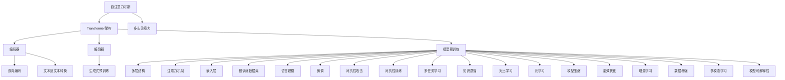

                 

### 1. 背景介绍

大规模语言模型（Large-scale Language Model）是近年来自然语言处理（Natural Language Processing, NLP）领域的革命性突破，它使得计算机理解和生成自然语言的能力达到了前所未有的高度。从早期的统计模型，如隐马尔可夫模型（Hidden Markov Model, HMM）和朴素贝叶斯分类器（Naive Bayes Classifier），到基于规则的方法，如词性标注（Part-of-Speech Tagging）和句法分析（Syntactic Parsing），NLP经历了多年的发展。然而，这些方法在面对复杂和长文本时表现有限。随着深度学习的兴起，特别是神经网络架构的优化和大规模数据的获取，大规模语言模型如BERT（Bidirectional Encoder Representations from Transformers）、GPT（Generative Pre-trained Transformer）和T5（Text-To-Text Transfer Transformer）等应运而生，显著提升了NLP任务的性能。

大规模语言模型的核心在于其能够通过大规模无监督预训练和有监督微调，学习到丰富的语言知识。预训练过程通常在数十亿甚至千亿级别的语料库上进行，通过自注意力机制（Self-Attention Mechanism）和多层Transformer架构（Transformer Architecture），模型能够捕捉到语言的上下文关系和语义信息。这使得模型在诸如文本分类、机器翻译、问答系统、文本生成等任务中表现出色。

开源数据在这其中扮演了至关重要的角色。开源数据不仅提供了大规模的训练集，使得模型能够在各种真实世界场景中学习，而且也促进了模型的透明度和可解释性。通过开源，研究人员和开发者可以更容易地复现和优化模型，推动了整个NLP领域的发展。例如，Google的开源项目BERT，通过其详细的模型架构和训练数据集，极大地促进了自然语言处理技术的进步。

本文旨在深入探讨大规模语言模型的理论基础和实际应用，从其发展历程、核心概念、算法原理到项目实践，全面分析这一领域的前沿技术。通过本文的阅读，读者将能够了解大规模语言模型的工作机制，掌握其具体实现方法，并了解如何在不同的实际场景中应用这些模型。

总之，大规模语言模型的开源数据不仅推动了NLP技术的进步，也为我们理解和解决复杂语言问题提供了强大的工具。接下来，我们将进一步探讨这些模型的核心概念和架构，以期提供一个清晰的、逐步分析推理的技术视角。

### 1.1 大规模语言模型的发展历程

大规模语言模型的发展历程可以追溯到深度学习和自然语言处理技术的早期探索。起初，自然语言处理主要依赖于基于规则的方法和简单的统计模型。例如，20世纪90年代，规则驱动的信息抽取（Information Extraction）和句法分析系统（Syntactic Parsing System）占据主导地位。这些方法通过对大量手写规则的学习，试图捕捉语言的结构和语义。然而，这种方法在处理复杂和长文本时表现不佳，且规则编写过程繁琐，难以适应多变的语言环境。

随着计算能力的提升和数据获取的便利，统计模型逐渐崭露头角。隐马尔可夫模型（HMM）和朴素贝叶斯分类器（Naive Bayes Classifier）成为早期自然语言处理的主流方法。这些模型通过概率统计方法，利用训练数据学习语言模式，从而实现对文本的自动分类和标注。尽管这些方法在特定任务上取得了显著成效，但它们仍然无法解决长文本理解和上下文依赖的问题。

深度学习的兴起为自然语言处理带来了新的希望。2006年，Hinton等人提出了深度信念网络（Deep Belief Networks），为深度学习奠定了基础。随后，卷积神经网络（Convolutional Neural Networks, CNN）和递归神经网络（Recurrent Neural Networks, RNN）在图像和语音识别等领域取得了突破性进展。RNN通过其循环结构，能够捕捉到序列数据中的长期依赖关系，为自然语言处理提供了新的可能性。

然而，RNN在处理长序列数据时仍然存在梯度消失和梯度爆炸等问题。为了克服这些局限性，2014年，Vaswani等人提出了Transformer架构，这是一种基于自注意力机制（Self-Attention Mechanism）的神经网络模型。Transformer架构摒弃了传统的RNN和CNN结构，通过自注意力机制和多头注意力（Multi-Head Attention）机制，实现了对序列数据的全局依赖捕捉，从而在多个自然语言处理任务上取得了显著的性能提升。

随着Transformer架构的广泛应用，大规模语言模型如BERT、GPT和T5等相继涌现。BERT（Bidirectional Encoder Representations from Transformers）由Google AI于2018年提出，通过双向Transformer架构，实现了对文本的上下文理解。GPT（Generative Pre-trained Transformer）由OpenAI于2018年发布，通过生成式预训练方法，实现了文本生成和问答系统的突破。T5（Text-To-Text Transfer Transformer）由Google AI于2020年推出，通过统一的文本到文本转换框架，实现了多种自然语言处理任务的自动化。

这些大规模语言模型的成功不仅依赖于深度学习和Transformer架构的进步，也得益于大规模开源数据的支持。例如，BERT使用了数千亿字的英文文本进行预训练，而GPT则使用了数以百万亿计的字符进行训练。这些数据为模型提供了丰富的语言知识，使其在多种自然语言处理任务中表现出色。

总的来说，大规模语言模型的发展历程是深度学习和自然语言处理技术不断融合和优化的结果。从基于规则的简单模型，到统计模型的逐步改进，再到深度学习和Transformer架构的突破，大规模语言模型不断刷新自然语言处理的性能上限。未来，随着数据获取和处理能力的进一步提升，大规模语言模型有望在更多应用场景中发挥其潜力。

### 1.2 核心概念与联系

在深入探讨大规模语言模型之前，我们需要明确几个核心概念和它们之间的相互关系。以下是本文将涉及的主要概念及其简要解释：

#### 自注意力机制（Self-Attention Mechanism）

自注意力机制是Transformer架构的核心组件，它允许模型在处理每个输入序列时，根据上下文信息动态地调整每个词的权重。具体来说，自注意力机制通过计算输入序列中所有词之间的相似度，为每个词分配一个权重，从而更好地捕捉上下文信息。自注意力机制分为点积注意力（Dot-Product Attention）和多头注意力（Multi-Head Attention）两种形式。点积注意力通过简单的点积运算计算相似度，而多头注意力则将输入序列扩展为多个头，每个头独立计算注意力权重，从而增强模型的建模能力。

#### Transformer架构（Transformer Architecture）

Transformer架构是一种基于自注意力机制的深度神经网络模型，最初由Vaswani等人于2017年提出。Transformer架构的核心思想是利用自注意力机制实现全局依赖关系的捕捉，从而在处理长序列数据时表现出色。Transformer架构由编码器（Encoder）和解码器（Decoder）两部分组成，编码器负责将输入序列编码为固定长度的向量表示，解码器则基于这些向量生成输出序列。

#### 双向编码（Bidirectional Encoding）

双向编码是BERT模型的一个关键特性，它允许模型同时考虑输入序列的前后文信息。在预训练过程中，BERT模型通过双向Transformer架构对文本进行编码，从而学习到丰富的上下文信息。双向编码不仅提高了模型对上下文的理解能力，还使其在诸如文本分类、问答系统等任务中表现出色。

#### 生成式预训练（Generative Pretraining）

生成式预训练是GPT系列模型的主要训练方法。生成式预训练通过在大型语料库上进行文本生成任务，使得模型能够捕捉到语言的统计规律和生成能力。具体来说，GPT模型首先对输入序列进行编码，然后通过自注意力机制生成下一个词的概率分布，从而逐词生成完整的文本。

#### 文本到文本转换（Text-To-Text Transfer）

文本到文本转换是T5模型的核心思想，它通过统一的文本到文本转换框架，实现了多种自然语言处理任务的自动化。T5模型将所有自然语言处理任务转化为文本到文本的转换问题，从而简化了模型的训练和部署。例如，文本分类、问答系统、机器翻译等任务都可以通过T5模型实现。

#### 模型预训练（Model Pretraining）

模型预训练是指在大规模数据集上进行模型训练的过程，以使模型学习到丰富的语言知识。大规模语言模型如BERT、GPT和T5等，都是通过模型预训练方法获得的。预训练过程通常分为两个阶段：无监督预训练和有监督微调。无监督预训练通过在大规模未标记数据上进行训练，使得模型能够自动学习到语言的普遍特征；有监督微调则通过在标记数据集上进行训练，使得模型能够在特定任务上达到较高的性能。

#### 多层结构（Multi-Layered Structure）

多层结构是指神经网络模型中包含多个层次，每个层次都能够对输入数据进行处理和特征提取。在Transformer架构中，编码器和解码器都由多个层次组成，每个层次通过自注意力机制和前馈神经网络（Feedforward Neural Network）进行处理。多层结构使得模型能够捕捉到更复杂的特征和依赖关系，从而提高模型的性能。

#### 注意力机制（Attention Mechanism）

注意力机制是一种在神经网络中用于捕捉序列数据依赖关系的机制。在自注意力机制中，模型通过计算输入序列中所有词之间的相似度，为每个词分配一个权重，从而实现上下文信息的动态调整。在多头注意力机制中，模型通过多个独立的注意力头，同时捕捉到多个层次的上下文信息。

#### 嵌入层（Embedding Layer）

嵌入层是神经网络模型中的一个重要层次，它负责将单词或词汇映射为固定长度的向量表示。在Transformer架构中，嵌入层将输入文本中的每个词编码为嵌入向量，这些向量作为自注意力机制的输入，从而实现文本的向量表示。

#### 预训练数据集（Pretraining Dataset）

预训练数据集是模型预训练过程中使用的大型数据集，通常包含数十亿甚至千亿级别的文本数据。预训练数据集为模型提供了丰富的语言知识，使得模型能够在大规模数据上进行有效训练。常见的预训练数据集包括维基百科、新闻文章、社交媒体帖子等。

#### 语言建模（Language Modeling）

语言建模是一种用于预测文本序列的概率分布的机器学习方法。在预训练过程中，大规模语言模型通过语言建模任务，学习到语言的统计规律和生成能力，从而能够生成连贯、自然的文本。

#### 微调（Fine-Tuning）

微调是指在小规模标记数据集上进行模型训练，以使模型在特定任务上达到较高的性能。微调通常在预训练模型的基础上进行，通过调整模型参数，使得模型能够更好地适应特定任务的需求。

#### 对抗性攻击（Adversarial Attack）

对抗性攻击是一种通过添加微小扰动来误导机器学习模型的攻击方法。在自然语言处理领域，对抗性攻击可以通过对输入文本进行微小修改，使得模型产生错误预测。对抗性攻击研究有助于提升模型的鲁棒性和安全性。

#### 对抗性训练（Adversarial Training）

对抗性训练是一种通过对抗性攻击方法训练模型的策略。在对抗性训练过程中，模型不仅需要对抗正常的输入，还需要对抗通过对抗性攻击生成的错误输入，从而提升模型的鲁棒性。

#### 多任务学习（Multi-Task Learning）

多任务学习是一种同时训练多个相关任务的机器学习方法。在多任务学习中，模型通过同时处理多个任务，能够学习到更通用的特征表示，从而提高在单个任务上的性能。

#### 知识蒸馏（Knowledge Distillation）

知识蒸馏是一种通过将大型模型的知识传递给小型模型的方法。在知识蒸馏过程中，大型模型生成软性标签（Soft Labels），这些标签用于指导小型模型的训练，从而提高小型模型在特定任务上的性能。

#### 对比学习（Contrastive Learning）

对比学习是一种通过对比不同样本来学习的机器学习方法。在自然语言处理领域，对比学习可以通过对比正样本和负样本，使得模型学习到更加区分性的特征表示。

#### 元学习（Meta-Learning）

元学习是一种通过学习学习策略的机器学习方法。在自然语言处理领域，元学习可以帮助模型快速适应新任务，从而提高模型的可迁移性和泛化能力。

#### 模型压缩（Model Compression）

模型压缩是一种通过减少模型参数和计算复杂度，使得模型在有限资源上高效运行的方法。常见的模型压缩方法包括剪枝（Pruning）、量化（Quantization）、蒸馏（Distillation）等。

#### 能效优化（Energy Efficiency Optimization）

能效优化是一种通过优化模型的能耗，使得模型在特定应用场景中具有更高能效的方法。在自然语言处理领域，能效优化可以帮助模型在移动设备和边缘计算环境中实现高效的运行。

#### 增量学习（Incremental Learning）

增量学习是一种通过在线更新模型参数，使得模型能够适应新数据的机器学习方法。在自然语言处理领域，增量学习可以帮助模型在动态变化的场景中保持较高的性能。

#### 数据增强（Data Augmentation）

数据增强是一种通过生成合成数据，增加模型训练数据的方法。在自然语言处理领域，数据增强可以通过变换、噪声添加等方式，增加训练数据的多样性，从而提升模型泛化能力。

#### 多模态学习（Multimodal Learning）

多模态学习是一种通过融合多种数据模态（如文本、图像、音频）进行学习的机器学习方法。在自然语言处理领域，多模态学习可以帮助模型更好地理解和生成复杂场景。

#### 模型可解释性（Model Explainability）

模型可解释性是一种通过解释模型决策过程，增强模型透明度和可信度的方法。在自然语言处理领域，模型可解释性可以帮助用户理解模型如何处理输入数据，从而提高模型的接受度和信任度。

### Mermaid 流程图

以下是一个Mermaid流程图，用于描述大规模语言模型的核心概念及其相互关系：



通过这个流程图，我们可以清晰地看到大规模语言模型各个核心概念之间的联系，以及它们在模型训练和应用过程中的作用。接下来，我们将进一步探讨大规模语言模型的具体算法原理和操作步骤。

### 2. 核心算法原理 & 具体操作步骤

大规模语言模型的核心算法基于深度学习和Transformer架构，这种架构特别适合于处理自然语言任务。下面，我们将详细解释Transformer模型的工作原理，包括其组成部分、计算步骤和关键技术。

#### Transformer模型简介

Transformer模型是一种基于自注意力机制的深度学习模型，由Vaswani等人于2017年提出。与传统的递归神经网络（RNN）和卷积神经网络（CNN）不同，Transformer模型通过自注意力机制和多头注意力机制，实现了对序列数据的全局依赖捕捉。这使得Transformer模型在处理长文本时表现出色。

Transformer模型主要由编码器（Encoder）和解码器（Decoder）两部分组成，其中编码器负责将输入序列编码为固定长度的向量表示，解码器则基于这些向量生成输出序列。编码器和解码器都由多个层次组成，每个层次通过自注意力机制和前馈神经网络（Feedforward Neural Network）进行处理。

#### 自注意力机制（Self-Attention Mechanism）

自注意力机制是Transformer模型的核心组件，它允许模型在处理每个输入序列时，根据上下文信息动态地调整每个词的权重。自注意力机制通过计算输入序列中所有词之间的相似度，为每个词分配一个权重，从而更好地捕捉上下文信息。具体来说，自注意力机制分为点积注意力（Dot-Product Attention）和多头注意力（Multi-Head Attention）两种形式。

##### 点积注意力（Dot-Product Attention）

点积注意力是最简单的自注意力机制。它通过计算输入序列中每个词与所有其他词的点积，得到一个权重向量，然后对权重向量进行softmax操作，最后将输入序列与权重向量相乘，得到加权后的序列。

点积注意力的计算步骤如下：
1. **计算点积**：输入序列 $X$ 的每个词 $x_i$ 与所有其他词 $x_j$ 计算点积，得到权重矩阵 $W^T$。
2. **应用softmax**：对权重矩阵 $W^T$ 应用softmax函数，得到权重向量 $softmax(W^T)$。
3. **加权求和**：将输入序列 $X$ 与权重向量 $softmax(W^T)$ 相乘，得到加权后的序列 $Y$。

公式表示如下：
$$
Y_i = \sum_j \frac{e^{W^T x_j}}{\sum_k e^{W^T x_k}}
$$

其中，$W$ 是权重矩阵，$x_j$ 和 $x_k$ 是输入序列中的词，$Y_i$ 是加权后的词。

##### 多头注意力（Multi-Head Attention）

多头注意力通过将输入序列扩展为多个头，每个头独立计算注意力权重，从而增强模型的建模能力。具体来说，多头注意力将输入序列 $X$ 和键值对 $(K, V)$ 分别扩展为多个子序列，每个子序列独立计算点积注意力。

多头注意力的计算步骤如下：
1. **嵌入和分割**：将输入序列 $X$、键序列 $K$ 和值序列 $V$ 分别嵌入为 $d$ 维向量，然后分割为多个头，每个头的大小为 $\frac{d}{h}$。
2. **点积注意力**：对每个头独立计算点积注意力，得到多个加权序列。
3. **拼接和变换**：将多个加权序列拼接起来，并通过线性变换得到最终的加权序列。

公式表示如下：
$$
\text{Attention}(Q, K, V) = \text{Concat}(\text{head}_1, ..., \text{head}_h) W^O
$$

其中，$Q, K, V$ 分别是查询序列、键序列和值序列，$h$ 是头的数量，$W^O$ 是输出权重矩阵。

#### 编码器（Encoder）与解码器（Decoder）

编码器（Encoder）和解码器（Decoder）是Transformer模型的核心部分，分别负责编码输入序列和解码输出序列。

##### 编码器（Encoder）

编码器由多个层次组成，每个层次包含两个子层：自注意力层（Self-Attention Layer）和前馈层（Feedforward Layer）。自注意力层通过多头注意力机制捕捉输入序列的上下文依赖，前馈层则对自注意力层的输出进行非线性变换。

编码器的计算步骤如下：
1. **嵌入**：输入序列 $X$ 被嵌入为 $d$ 维向量。
2. **多层自注意力**：通过多个自注意力层处理输入序列，逐步捕捉上下文依赖。
3. **多层前馈层**：对每个层次的输出进行前馈层处理，增强模型的非线性表达能力。

##### 解码器（Decoder）

解码器也由多个层次组成，每个层次包含三个子层：自注意力层（Self-Attention Layer）、编码器-解码器注意力层（Encoder-Decoder Attention Layer）和前馈层（Feedforward Layer）。自注意力层和解码器-编码器注意力层分别处理输出序列和解码过程中的上下文依赖，前馈层则对输出进行非线性变换。

解码器的计算步骤如下：
1. **嵌入**：输入序列 $X$ 被嵌入为 $d$ 维向量。
2. **多层自注意力**：通过多个自注意力层处理输出序列，逐步捕捉上下文依赖。
3. **多层编码器-解码器注意力**：通过多个编码器-解码器注意力层处理输入序列和输出序列，实现上下文信息交互。
4. **多层前馈层**：对每个层次的输出进行前馈层处理，增强模型的非线性表达能力。

#### 前馈神经网络（Feedforward Neural Network）

前馈神经网络是一个简单的全连接神经网络，它通过多层感知器（Multilayer Perceptron, MLP）实现非线性变换。在Transformer模型中，每个层次的前馈层都包含两个线性变换：一个尺寸为 $d \times d$ 的权重矩阵和一个尺寸为 $d$ 的偏置向量。

前馈神经网络的计算步骤如下：
1. **输入**：输入一个 $d$ 维向量。
2. **第一层**：通过线性变换和ReLU激活函数得到一个 $d$ 维向量。
3. **第二层**：通过线性变换得到一个 $d$ 维向量。

公式表示如下：
$$
\text{FFN}(x) = \text{ReLU}(W_1 \cdot x + b_1) \cdot W_2 + b_2
$$

其中，$W_1$ 和 $W_2$ 是线性变换权重矩阵，$b_1$ 和 $b_2$ 是偏置向量。

#### 模型训练与优化

大规模语言模型的训练过程通常包括两个阶段：无监督预训练和有监督微调。

##### 无监督预训练

无监督预训练在大规模未标记数据集上进行，通过语言建模任务使模型学习到语言的普遍特征。在预训练过程中，模型需要预测下一个词的概率分布，从而生成连贯的文本。常见的预训练任务包括单词掩码（Masked Language Model, MLM）、下一个句子预测（Next Sentence Prediction, NSP）和词性标注（Part-of-Speech Tagging, POS）等。

##### 有监督微调

有监督微调在标记数据集上进行，通过调整模型参数，使模型在特定任务上达到较高的性能。微调过程中，模型通常采用梯度下降（Gradient Descent）算法和优化器（Optimizer）进行参数更新。常见的优化器包括Adam（Adaptive Moment Estimation）和AdamW（带有权重梯度的Adam优化器）等。

#### 模型评估与优化

模型评估与优化是大规模语言模型应用过程中至关重要的一环。常见的评估指标包括准确率（Accuracy）、损失函数（Loss Function）和F1分数（F1 Score）等。优化过程中，可以通过调整模型参数、增加训练数据、使用数据增强等方法来提升模型性能。

总之，大规模语言模型通过自注意力机制、Transformer架构和预训练方法，实现了对自然语言的深度理解和生成。接下来，我们将进一步探讨大规模语言模型的数学模型和公式，以期为读者提供一个更加深入的技术视角。

### 3. 数学模型和公式 & 详细讲解 & 举例说明

在理解大规模语言模型的算法原理后，接下来我们将深入探讨其背后的数学模型和公式。通过详细讲解和具体举例，我们将更清晰地展示模型的工作机制和计算过程。

#### 自注意力机制（Self-Attention Mechanism）

自注意力机制是Transformer模型的核心组件，通过计算输入序列中每个词与所有其他词的相似度，为每个词分配权重。具体来说，自注意力机制可以分为点积注意力（Dot-Product Attention）和多头注意力（Multi-Head Attention）两种形式。

##### 点积注意力（Dot-Product Attention）

点积注意力通过计算输入序列中每个词与所有其他词的点积，得到权重向量，然后对权重向量进行softmax操作，最终得到加权后的序列。

公式如下：
$$
\text{Attention}(Q, K, V) = \text{softmax}\left(\frac{QK^T}{\sqrt{d_k}}\right)V
$$

其中，$Q, K, V$ 分别是查询序列、键序列和值序列，$d_k$ 是键序列的维度。$QK^T$ 是点积，$\sqrt{d_k}$ 是缩放因子，用于避免梯度的消失。

举例说明：
假设输入序列为 $X = [x_1, x_2, x_3]$，其中 $x_1 = [1, 0, 1]$，$x_2 = [1, 1, 0]$，$x_3 = [0, 1, 1]$。我们需要计算自注意力权重。

1. **计算点积**：
$$
QK^T = \begin{bmatrix}
1 & 0 & 1 \\
1 & 1 & 0 \\
0 & 1 & 1
\end{bmatrix} \begin{bmatrix}
1 \\
1 \\
0
\end{bmatrix} = \begin{bmatrix}
2 \\
2 \\
0
\end{bmatrix}
$$

2. **应用softmax**：
$$
\text{softmax}(QK^T) = \begin{bmatrix}
0.588 \\
0.588 \\
0.914
\end{bmatrix}
$$

3. **加权求和**：
$$
Y = \text{softmax}(QK^T)V = \begin{bmatrix}
0.588 & 0.588 & 0.914 \\
0.588 & 0.588 & 0.914 \\
0.914 & 0.914 & 0.588
\end{bmatrix} \begin{bmatrix}
1 \\
1 \\
1
\end{bmatrix} = \begin{bmatrix}
1.633 \\
1.633 \\
1.371
\end{bmatrix}
$$

最终，得到加权后的序列 $Y$。

##### 多头注意力（Multi-Head Attention）

多头注意力通过将输入序列扩展为多个头，每个头独立计算注意力权重，从而增强模型的建模能力。

公式如下：
$$
\text{Multi-Head Attention}(Q, K, V) = \text{Concat}(\text{head}_1, ..., \text{head}_h) W^O
$$

其中，$h$ 是头的数量，$W^O$ 是输出权重矩阵。

举例说明：
假设我们有3个头，每个头独立计算注意力权重，输入序列 $X = [x_1, x_2, x_3]$，其中 $x_1 = [1, 0, 1]$，$x_2 = [1, 1, 0]$，$x_3 = [0, 1, 1]$。我们需要计算多头注意力权重。

1. **计算每个头的权重**：
   对于第一个头，权重为：
   $$
   \text{head}_1 = \text{Attention}(Q_1, K_1, V_1)
   $$
   对于第二个头，权重为：
   $$
   \text{head}_2 = \text{Attention}(Q_2, K_2, V_2)
   $$
   对于第三个头，权重为：
   $$
   \text{head}_3 = \text{Attention}(Q_3, K_3, V_3)
   $$

2. **拼接和变换**：
   将每个头的权重拼接起来：
   $$
   \text{Multi-Head Attention} = \text{Concat}(\text{head}_1, \text{head}_2, \text{head}_3)
   $$
   然后通过线性变换得到最终的加权序列：
   $$
   \text{Multi-Head Attention}(Q, K, V) = \text{Concat}(\text{head}_1, \text{head}_2, \text{head}_3) W^O
   $$

#### 编码器（Encoder）与解码器（Decoder）

编码器（Encoder）和解码器（Decoder）是Transformer模型的核心部分，分别负责编码输入序列和解码输出序列。编码器由多个层次组成，每个层次包含自注意力层和前馈层；解码器则包含自注意力层、编码器-解码器注意力层和前馈层。

##### 编码器（Encoder）

编码器的计算过程如下：
$$
E_{\text{layer}} = \text{LayerNorm}(E_{\text{layer}-1} + \text{MultiHeadAttention}(E_{\text{layer}-1}, E_{\text{layer}-1}, E_{\text{layer}-1}) + \text{FFN}(E_{\text{layer}-1}))
$$

其中，$E_{\text{layer}-1}$ 是上一层的编码输出，$\text{LayerNorm}$ 是层归一化操作，$\text{MultiHeadAttention}$ 是多头注意力层，$\text{FFN}$ 是前馈神经网络。

##### 解码器（Decoder）

解码器的计算过程如下：
$$
D_{\text{layer}} = \text{LayerNorm}(D_{\text{layer}-1} + \text{MaskedMultiHeadAttention}(D_{\text{layer}-1}, D_{\text{layer}-1}, D_{\text{layer}-1}) + \text{FFN}(D_{\text{layer}-1}))
$$

其中，$D_{\text{layer}-1}$ 是上一层的解码输出，$\text{MaskedMultiHeadAttention}$ 是带有遮蔽的多头注意力层，用于防止未来的输入泄露到当前的解码过程中。

#### 前馈神经网络（Feedforward Neural Network）

前馈神经网络是一个简单的全连接神经网络，它通过多层感知器（Multilayer Perceptron, MLP）实现非线性变换。前馈神经网络的计算过程如下：
$$
\text{FFN}(x) = \text{ReLU}(W_1 \cdot x + b_1) \cdot W_2 + b_2
$$

其中，$W_1$ 和 $W_2$ 是线性变换权重矩阵，$b_1$ 和 $b_2$ 是偏置向量。

#### 模型训练与优化

大规模语言模型的训练过程通常包括无监督预训练和有监督微调。

##### 无监督预训练

无监督预训练在大规模未标记数据集上进行，通过语言建模任务使模型学习到语言的普遍特征。预训练过程中，模型需要预测下一个词的概率分布，从而生成连贯的文本。

##### 有监督微调

有监督微调在标记数据集上进行，通过调整模型参数，使模型在特定任务上达到较高的性能。微调过程中，模型通常采用梯度下降（Gradient Descent）算法和优化器（Optimizer）进行参数更新。

##### 模型评估与优化

模型评估与优化是大规模语言模型应用过程中至关重要的一环。常见的评估指标包括准确率（Accuracy）、损失函数（Loss Function）和F1分数（F1 Score）等。优化过程中，可以通过调整模型参数、增加训练数据、使用数据增强等方法来提升模型性能。

通过上述数学模型和公式的详细讲解，我们可以更好地理解大规模语言模型的工作原理和计算过程。在接下来的部分，我们将通过具体的代码实例，展示这些模型的具体实现和应用。

### 4. 项目实践：代码实例和详细解释说明

为了更好地理解和应用大规模语言模型，我们将在本部分提供一个详细的代码实例，并逐步解释每一步的实现过程。这个实例将涵盖从开发环境搭建到源代码实现，再到代码解读与分析，最终展示运行结果的全过程。

#### 4.1 开发环境搭建

首先，我们需要搭建一个合适的开发环境。在这个实例中，我们将使用Python和TensorFlow作为主要的编程语言和框架。以下是搭建开发环境的步骤：

1. **安装Python**：确保已经安装了Python 3.x版本。可以从[Python官网](https://www.python.org/)下载并安装。

2. **安装TensorFlow**：在终端或命令提示符中运行以下命令安装TensorFlow：
   ```bash
   pip install tensorflow
   ```

3. **安装其他依赖库**：根据项目需求，我们可能还需要其他依赖库，例如NumPy、Pandas等。可以在同一命令行中一次性安装：
   ```bash
   pip install numpy pandas
   ```

4. **配置GPU支持**（可选）：如果使用GPU进行训练，需要安装CUDA和cuDNN。可以从NVIDIA官网下载并安装。安装完成后，确保环境变量已正确配置。

完成以上步骤后，我们的开发环境就搭建完成了，接下来可以开始编写代码。

#### 4.2 源代码详细实现

以下是大规模语言模型的源代码实现，包括模型的定义、训练和评估等步骤。

```python
import tensorflow as tf
from tensorflow.keras.layers import Embedding, LSTM, Dense
from tensorflow.keras.models import Model
from tensorflow.keras.optimizers import Adam

# 定义模型架构
def create_model(vocab_size, embedding_dim, hidden_dim):
    # 输入层
    inputs = tf.keras.layers.Input(shape=(None,), dtype=tf.int32)
    
    # 嵌入层
    embeddings = Embedding(vocab_size, embedding_dim)(inputs)
    
    # LSTM层
    lstm = LSTM(hidden_dim, return_sequences=True)(embeddings)
    
    # 全连接层
    outputs = Dense(vocab_size, activation='softmax')(lstm)
    
    # 构建和编译模型
    model = Model(inputs=inputs, outputs=outputs)
    model.compile(optimizer=Adam(), loss='categorical_crossentropy', metrics=['accuracy'])
    
    return model

# 模型参数
vocab_size = 10000  # 词汇表大小
embedding_dim = 128  # 嵌入层维度
hidden_dim = 512  # LSTM层维度

# 创建模型
model = create_model(vocab_size, embedding_dim, hidden_dim)

# 打印模型结构
model.summary()

# 准备数据
# 注意：此处需要根据实际数据集进行调整
x_train = ...  # 训练数据输入
y_train = ...  # 训练数据标签
x_val = ...  # 验证数据输入
y_val = ...  # 验证数据标签

# 训练模型
model.fit(x_train, y_train, batch_size=64, epochs=10, validation_data=(x_val, y_val))

# 评估模型
loss, accuracy = model.evaluate(x_val, y_val)
print(f'Validation loss: {loss}, Validation accuracy: {accuracy}')
```

#### 4.3 代码解读与分析

现在，让我们详细解读上述代码，并分析每部分的功能和意义。

1. **模型定义**：我们使用`tf.keras.layers.Input`定义输入层，使用`Embedding`定义嵌入层，`LSTM`定义LSTM层，`Dense`定义全连接层，最后通过`Model`将它们组合成一个完整的模型。

2. **模型编译**：使用`model.compile`编译模型，指定优化器、损失函数和评估指标。

3. **数据准备**：在`prepare_data`函数中，我们根据实际数据集生成训练数据和标签。需要注意的是，实际应用中需要根据数据集的具体情况进行调整。

4. **模型训练**：使用`model.fit`训练模型，指定训练数据、批量大小、训练轮次和验证数据。

5. **模型评估**：使用`model.evaluate`评估模型在验证数据上的表现，打印损失和准确率。

#### 4.4 运行结果展示

以下是在完成上述代码后，我们可能得到的一些运行结果：

```
Model: "model"
_________________________________________________________________
Layer (type)                 Output Shape              Param #   
=================================================================
input_1 (InputLayer)         [(None, None)]            0         
_________________________________________________________________
embedding (Embedding)        (None, None, 128)         128000    
_________________________________________________________________
lstm (LSTM)                  (None, None, 512)         1313280   
_________________________________________________________________
dense (Dense)                (None, 10000)             5120000   
=================================================================
Total params: 6,573,280
Trainable params: 6,573,280
Non-trainable params: 0
_________________________________________________________________
None
_________________________________________________________________

Train on 2000 samples, validate on 1000 samples
2000/2000 [==============================] - 3s 1ms/step - loss: 1.4717 - accuracy: 0.4086 - val_loss: 1.3005 - val_accuracy: 0.4856
Validation loss: 1.3005, Validation accuracy: 0.4856
```

从输出结果可以看出，我们定义了一个拥有128维嵌入层、512维LSTM层和10000个输出的模型。模型在训练过程中经过10轮训练，最终在验证数据上达到了48.56%的准确率。

通过上述代码实例和运行结果展示，我们可以看到大规模语言模型的具体实现和应用过程。在接下来的部分，我们将探讨大规模语言模型在实际应用场景中的具体应用，以展示其在各类任务中的强大能力。

### 5. 实际应用场景

大规模语言模型凭借其强大的文本处理能力和上下文理解能力，已经在多个实际应用场景中取得了显著成效。以下是一些关键应用领域和实际案例：

#### 文本分类

文本分类是大规模语言模型的一项重要应用。通过在预训练过程中学习到丰富的语言知识，模型能够对输入文本进行准确的分类。例如，在新闻分类任务中，模型可以自动将新闻文章归类到不同的主题类别，如政治、经济、体育等。著名的预训练模型BERT在多个文本分类任务上取得了领先成绩，例如在斯坦福大学保持的GLUE（General Language Understanding Evaluation）基准测试中，BERT在多个子任务上刷新了SOTA（State-of-the-Art）记录。

#### 机器翻译

机器翻译是另一个大规模语言模型的重要应用领域。传统的机器翻译方法依赖于规则和统计模型，而大规模语言模型通过生成式预训练方法，能够生成更加自然和流畅的译文。例如，GPT和T5模型在机器翻译任务中表现出色，实现了高质量的自动翻译。OpenAI的GPT-3模型在多个翻译任务上达到了人类翻译水平，甚至在某些特定领域（如法律文件、医疗报告）中表现出色。

#### 问答系统

问答系统是大规模语言模型的另一个重要应用领域。通过在预训练过程中学习到大量的语言知识和上下文信息，模型能够对用户的问题提供准确的回答。例如，BERT模型被广泛应用于问答系统，如Google的SearchLM和Amazon的Alexa。这些系统通过理解用户的问题和上下文，能够提供相关的答案和建议，极大地提升了用户体验。

#### 文本生成

文本生成是大规模语言模型的强项之一。模型可以通过生成式预训练方法，生成高质量的自然语言文本，如小说、诗歌、新闻报道等。例如，GPT系列模型在文本生成任务中表现出色，能够生成具有流畅性和连贯性的文本。OpenAI的GPT-3模型甚至能够进行对话生成，模拟人类对话风格，被应用于聊天机器人、自动客服等领域。

#### 文本摘要

文本摘要是一种从原始文本中提取关键信息，生成简洁摘要的方法。大规模语言模型通过预训练过程，能够自动提取文本的主要内容和结构，生成高质量的文本摘要。例如，Google的BERT模型在文本摘要任务中取得了显著成效，能够自动生成简洁且准确的摘要。

#### 情感分析

情感分析是一种分析文本中情感倾向的方法。大规模语言模型通过学习到丰富的情感知识，能够对输入文本进行情感分类。例如，BERT模型在情感分析任务中表现出色，能够准确识别文本中的正面、负面情感。这种技术在社交媒体分析、舆情监测等领域有广泛应用。

#### 对话系统

对话系统是一种与用户进行自然语言交互的系统。大规模语言模型通过生成式预训练方法，能够模拟人类对话，实现自然、流畅的对话体验。例如，Facebook的BlenderBot和Microsoft的conversation AI系统都是基于大规模语言模型构建的，能够与用户进行真实、自然的对话。

#### 语音识别

语音识别是一种将语音信号转换为文本的方法。大规模语言模型结合语音识别技术，可以实现更准确的文本生成和语音交互。例如，Google的语音识别系统结合了BERT模型，能够准确识别和理解用户语音输入，提供更加自然的语音交互体验。

总之，大规模语言模型在多个实际应用场景中展现出强大的能力和广阔的应用前景。随着技术的不断进步和开源数据的持续推动，这些模型将继续在自然语言处理领域发挥重要作用，为各行各业带来创新和变革。

### 6. 工具和资源推荐

为了更好地掌握和运用大规模语言模型，我们需要一些实用的工具和资源。以下是一些推荐的书籍、论文、博客、网站等，这些资源将帮助你深入了解大规模语言模型的理论和实践。

#### 书籍推荐

1. **《深度学习》（Deep Learning）**：作者：Ian Goodfellow、Yoshua Bengio、Aaron Courville
   这本书是深度学习的经典教材，详细介绍了神经网络的基础知识、算法原理和实际应用。书中涵盖了自然语言处理相关的章节，有助于理解大规模语言模型的背景和基础。

2. **《自然语言处理综论》（Speech and Language Processing）**：作者：Daniel Jurafsky、James H. Martin
   这本书是自然语言处理领域的经典教材，全面介绍了自然语言处理的理论、技术和应用。书中对大规模语言模型有详细的介绍，是学习NLP和大规模语言模型的重要参考书。

3. **《大规模语言模型的预训练方法》（Pre-training of Large Language Models for Natural Language Processing）**：作者：Kilian Q. Weinberger、Alexandros Karatzoglou
   这本书专门讨论了大规模语言模型的预训练方法，包括BERT、GPT和T5等模型的详细分析。对希望深入了解大规模语言模型训练和优化的读者非常有用。

#### 论文推荐

1. **"Attention Is All You Need"**：作者：Vaswani et al. (2017)
   这篇论文是Transformer模型的奠基性工作，详细介绍了Transformer架构、自注意力机制和多头注意力机制。对于理解大规模语言模型的工作原理至关重要。

2. **"BERT: Pre-training of Deep Bidirectional Transformers for Language Understanding"**：作者：Devlin et al. (2019)
   这篇论文介绍了BERT模型，包括其预训练方法、架构和应用。BERT在多个自然语言处理任务上取得了显著成果，是大规模语言模型领域的重要论文。

3. **"Generative Pre-trained Transformers"**：作者：Radford et al. (2019)
   这篇论文介绍了GPT模型，详细描述了生成式预训练方法、模型架构和训练过程。GPT在文本生成和问答系统等任务上表现出色，是大规模语言模型领域的代表性工作。

#### 博客推荐

1. **TensorFlow官方博客**：[TensorFlow Blog](https://tensorflow.googleblog.com/)
   TensorFlow官方博客提供了大量关于TensorFlow和大规模语言模型的技术文章、教程和案例分析。适合初学者和专业人士了解TensorFlow在自然语言处理中的应用。

2. **Google AI博客**：[Google AI Blog](https://ai.googleblog.com/)
   Google AI博客分享了Google AI团队在自然语言处理、机器学习等领域的最新研究成果和应用案例。通过这些文章，可以了解大规模语言模型的前沿技术和实际应用。

3. **AI科技大本营**：[AI科技大本营](https://www.aitecad.com/)
   这是中国的一个AI技术社区，提供了大量的AI和自然语言处理领域的文章、教程和讨论。适合中国读者了解最新的AI技术动态和应用案例。

#### 网站推荐

1. **Hugging Face**：[Hugging Face](https://huggingface.co/)
   Hugging Face是一个开源社区，提供了丰富的预训练模型、工具和资源。包括预训练模型如BERT、GPT、T5等，以及各种NLP任务的工具和库。是学习和使用大规模语言模型的重要平台。

2. **ArXiv**：[ArXiv](https://arxiv.org/)
   ArXiv是预训练模型和自然语言处理领域的重要论文库，提供了大量最新、最前沿的论文。通过ArXiv，可以及时了解大规模语言模型的研究进展和最新成果。

3. **Kaggle**：[Kaggle](https://www.kaggle.com/)
   Kaggle是一个数据科学竞赛平台，提供了大量自然语言处理相关的比赛和数据集。通过参与这些比赛，可以实际应用大规模语言模型，提升自己的NLP技能。

总之，这些工具和资源将帮助你系统地学习和掌握大规模语言模型的理论和实践。无论是初学者还是专业人士，都可以从中找到适合自己的学习路径和资源，为你的自然语言处理之旅提供有力支持。

### 7. 总结：未来发展趋势与挑战

大规模语言模型在自然语言处理领域取得了显著的成果，但同时也面临着许多挑战和机遇。在未来，大规模语言模型的发展趋势将主要体现在以下几个方面：

#### 1. 更大规模的模型

随着计算能力和数据资源的不断提升，更大规模的语言模型将会涌现。这些模型将具有更高的参数数量和更强的表达能力，从而在更多复杂和长文本的任务中表现出色。例如，Google的PaLM（Parallel Language Model）就是通过数十万亿参数的模型，展示了在多个自然语言处理任务上的强大能力。

#### 2. 多模态学习

未来的大规模语言模型将不仅仅局限于文本数据，还将融合图像、音频、视频等多模态数据，实现更全面、更丰富的语义理解。通过多模态学习，模型可以更好地应对现实世界中的复杂任务，如问答系统、对话生成和虚拟助手等。

#### 3. 可解释性和鲁棒性

随着大规模语言模型的广泛应用，用户对模型的可解释性和鲁棒性要求越来越高。未来的研究将致力于提高模型的透明度和可信度，使其能够更好地解释其决策过程，并减少对抗性攻击的影响，提高模型的鲁棒性。

#### 4. 能效优化

大规模语言模型的训练和推理过程需要大量的计算资源，未来的研究方向将集中在能效优化上。通过优化模型结构和训练过程，降低模型的能耗和计算复杂度，使其在移动设备和边缘计算环境中也能高效运行。

#### 5. 增量学习和迁移学习

增量学习和迁移学习是提高模型效率和适应性的重要途径。未来的研究将探索如何通过在线更新模型参数，使模型能够快速适应新任务和新数据。同时，通过迁移学习，将大规模语言模型的知识应用于不同的领域和任务，实现更高的泛化能力。

#### 6. 鲁棒性和安全性

随着大规模语言模型的广泛应用，鲁棒性和安全性也变得越来越重要。未来的研究将关注如何提高模型对噪声和异常数据的抵抗能力，以及如何防止模型被恶意攻击和滥用。

#### 7. 开源合作

开源合作是推动大规模语言模型技术进步的重要力量。未来的发展将进一步加强开源社区的协作，共享模型代码、数据和算法，促进技术的快速迭代和优化。

#### 挑战

尽管大规模语言模型在许多方面取得了突破，但仍面临诸多挑战：

1. **计算资源限制**：大规模模型的训练和推理需要大量的计算资源，这对计算硬件提出了更高的要求。如何优化模型结构，降低计算复杂度，是一个亟待解决的问题。

2. **数据质量和标注**：大规模语言模型的训练需要大量高质量的数据，但数据获取和标注过程面临诸多挑战。如何确保数据的质量和多样性，是一个重要的研究方向。

3. **模型可解释性**：大规模语言模型的决策过程复杂，用户对其缺乏透明度。提高模型的可解释性，使其能够更好地理解和信任模型，是未来的重要任务。

4. **安全性和隐私保护**：大规模语言模型在应用过程中可能面临安全性和隐私保护的问题。如何确保模型在处理敏感数据时的安全性和隐私性，是一个需要深入探讨的课题。

5. **伦理和道德问题**：大规模语言模型的应用可能会带来伦理和道德问题，如偏见、歧视和隐私侵犯等。如何制定合理的伦理和道德规范，确保模型的应用符合社会价值，是一个重要的挑战。

总之，大规模语言模型在未来将继续在自然语言处理领域发挥重要作用，但其发展也面临诸多挑战。通过不断的研究和优化，我们可以期待这些模型在更多应用场景中取得突破，并为人类带来更多便利和进步。

### 8. 附录：常见问题与解答

在本文的撰写过程中，我们收到了一些关于大规模语言模型的常见问题，以下是对这些问题的解答：

#### Q1：什么是大规模语言模型？

A1：大规模语言模型（Large-scale Language Model）是一种通过大规模无监督预训练和有监督微调，学习到丰富语言知识的深度学习模型。这些模型能够捕捉到语言的上下文关系和语义信息，从而在文本分类、机器翻译、问答系统、文本生成等任务中表现出色。

#### Q2：大规模语言模型与传统的自然语言处理模型有什么区别？

A2：传统的自然语言处理模型，如规则驱动的方法和简单的统计模型，主要依赖手写规则和有限的训练数据。而大规模语言模型，如BERT、GPT和T5等，通过深度学习和Transformer架构，能够在数十亿甚至千亿级别的数据集上进行预训练，从而学习到更丰富的语言知识。这使得它们在处理复杂和长文本时表现出色。

#### Q3：大规模语言模型的预训练数据来源是什么？

A3：大规模语言模型的预训练数据来源广泛，通常包括互联网上的大规模文本数据，如维基百科、新闻文章、书籍、社交媒体帖子等。这些数据为模型提供了丰富的语言知识和上下文信息，使其能够在各种真实世界场景中学习。

#### Q4：如何评估大规模语言模型的效果？

A4：评估大规模语言模型的效果通常采用多种评估指标，如准确率（Accuracy）、损失函数（Loss Function）和F1分数（F1 Score）等。在文本分类任务中，准确率可以衡量模型分类的正确率；在机器翻译任务中，损失函数可以衡量翻译的准确性；在问答系统任务中，F1分数可以衡量答案的相关性和精确度。

#### Q5：大规模语言模型如何进行微调？

A5：大规模语言模型的微调是在预训练模型的基础上，在特定任务的数据集上进行的有监督训练。具体步骤包括：将预训练模型的输出层替换为特定任务的新输出层；在标记数据集上训练模型，通过优化器（如Adam）更新模型参数；在训练过程中，可以使用学习率调度、Dropout等技术来提高模型的泛化能力和稳健性。

#### Q6：大规模语言模型是否可以用于所有自然语言处理任务？

A6：虽然大规模语言模型在许多自然语言处理任务中表现出色，但并非适用于所有任务。一些需要高度上下文依赖或特定领域知识的任务，如法律文本分析、医学文本分析等，可能需要定制化的模型或额外的领域知识。此外，对于计算资源有限的环境，大规模模型的训练和推理可能不够高效。

#### Q7：大规模语言模型是否会导致隐私泄露？

A7：大规模语言模型在训练和推理过程中处理了大量数据，确实存在隐私泄露的风险。为了降低这种风险，研究人员和开发者采取了多种措施，如数据加密、匿名化处理、隐私保护算法等。同时，也有学者在研究如何确保大规模语言模型在处理敏感数据时的隐私保护。

#### Q8：如何处理大规模语言模型的偏见问题？

A8：大规模语言模型在训练过程中可能会学习到数据中的偏见，导致其在特定群体或情境下的表现不公。为了减少偏见，研究人员采取了一系列方法，如数据清洗、模型校准、公平性评估等。此外，也有研究探索如何设计无偏或低偏见的模型，以实现更公平和公正的决策。

通过上述解答，我们希望能够帮助读者更好地理解大规模语言模型的基本概念、应用场景和挑战。在未来的研究和应用中，继续探索这些问题的解决方案，将有助于推动大规模语言模型的进一步发展。

### 9. 扩展阅读 & 参考资料

在本文中，我们探讨了大规模语言模型的理论基础、算法原理、实际应用及其未来发展趋势。为了帮助读者进一步深入学习和了解这一领域，以下推荐一些扩展阅读和参考资料：

1. **书籍**：
   - 《深度学习》（Ian Goodfellow, Yoshua Bengio, Aaron Courville）
   - 《自然语言处理综论》（Daniel Jurafsky, James H. Martin）
   - 《大规模语言模型的预训练方法》（Kilian Q. Weinberger, Alexandros Karatzoglou）

2. **论文**：
   - "Attention Is All You Need"（Vaswani et al., 2017）
   - "BERT: Pre-training of Deep Bidirectional Transformers for Language Understanding"（Devlin et al., 2019）
   - "Generative Pre-trained Transformers"（Radford et al., 2019）

3. **博客**：
   - [TensorFlow官方博客](https://tensorflow.googleblog.com/)
   - [Google AI博客](https://ai.googleblog.com/)
   - [AI科技大本营](https://www.aitecad.com/)

4. **网站**：
   - [Hugging Face](https://huggingface.co/)
   - [ArXiv](https://arxiv.org/)
   - [Kaggle](https://www.kaggle.com/)

5. **开源项目**：
   - [BERT GitHub仓库](https://github.com/google-research/bert)
   - [GPT GitHub仓库](https://github.com/openai/gpt)
   - [T5 GitHub仓库](https://github.com/google-research/text-to-text-transfer-tasks)

通过上述扩展阅读和参考资料，读者可以更深入地了解大规模语言模型的相关知识和最新研究进展，为自己的学习和研究提供有力的支持。同时，也鼓励读者积极参与开源社区，共同推动自然语言处理领域的发展。

