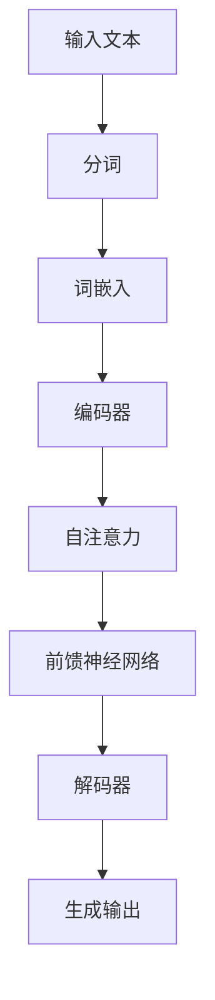

                 

### 大规模语言模型从理论到实践：模型推理

#### 关键词

- 大规模语言模型
- 模型推理
- 人工智能
- 自然语言处理
- 神经网络
- 机器学习
- 深度学习

#### 摘要

本文将深入探讨大规模语言模型的理论基础及其在实践中的应用，特别是模型推理的过程。我们将从背景介绍开始，逐步分析核心概念、算法原理、数学模型，并通过实际项目实例进行代码实现与解析。文章还将探讨模型推理在实际应用场景中的价值，并推荐相关学习资源和开发工具。

## 1. 背景介绍

### 大规模语言模型的发展

大规模语言模型是自然语言处理（NLP）领域的里程碑。近年来，随着深度学习和神经网络技术的快速发展，大规模语言模型如BERT、GPT等取得了显著的成果。这些模型能够处理和理解复杂的自然语言，并应用于诸如文本生成、问答系统、机器翻译等领域。

### 自然语言处理的重要性

自然语言处理是人工智能的重要组成部分，其目标是让计算机能够理解、生成和交互自然语言。在信息爆炸的时代，如何有效地处理和理解海量的文本数据成为了一个关键问题。大规模语言模型的出现，为这一问题的解决提供了强有力的工具。

### 模型推理的作用

模型推理是大规模语言模型在实际应用中的核心环节。它指的是在给定输入的情况下，模型如何生成输出。有效的模型推理不仅能够提高系统的性能，还能够确保输出的准确性和一致性。

## 2. 核心概念与联系

### 语言模型基础

大规模语言模型是基于统计和学习方法的。它们通过训练大量的文本数据，学习语言的结构和规律，从而能够生成和预测自然语言序列。核心概念包括：

- 语言模型
- 词汇表
- 词嵌入

### 模型架构

大规模语言模型通常采用神经网络架构，如变换器（Transformer）模型。其核心组件包括：

- 自注意力机制（Self-Attention）
- 前馈神经网络（Feedforward Neural Network）
- 编码器（Encoder）与解码器（Decoder）

### Mermaid 流程图



## 3. 核心算法原理 & 具体操作步骤

### 语言模型的训练

大规模语言模型的训练过程包括以下几个步骤：

1. 数据准备：收集并清理大量文本数据。
2. 分词：将文本数据分割成单词或子词。
3. 词嵌入：将单词或子词映射到高维向量空间。
4. 模型训练：使用训练数据对模型进行优化。
5. 模型评估：在测试数据上评估模型的性能。

### 模型推理的过程

模型推理的过程可以从以下几个步骤进行：

1. 输入处理：将输入文本进行分词和词嵌入。
2. 编码器处理：编码器对输入进行编码，产生固定长度的向量表示。
3. 自注意力：自注意力机制对编码器的输出进行加权，提取关键信息。
4. 前馈神经网络：前馈神经网络对加权后的输出进行非线性变换。
5. 解码器处理：解码器根据编码器的输出生成预测的输出序列。
6. 输出生成：解码器生成最终的输出文本。

### 具体操作步骤示例

假设我们要对一句话“我喜欢编程”进行模型推理，具体操作步骤如下：

1. 输入处理：将句子“我喜欢编程”分词为“我”、“喜欢”、“编程”。
2. 词嵌入：将分词后的单词映射到高维向量。
3. 编码器处理：编码器对词嵌入向量进行编码，得到固定长度的向量表示。
4. 自注意力：自注意力机制对编码器的输出进行加权，提取关键信息。
5. 前馈神经网络：前馈神经网络对加权后的输出进行非线性变换。
6. 解码器处理：解码器根据编码器的输出生成预测的输出序列。
7. 输出生成：解码器生成最终的输出文本。

## 4. 数学模型和公式 & 详细讲解 & 举例说明

### 语言模型的数学基础

大规模语言模型的核心是神经网络，因此我们需要理解一些基础的数学概念，如：

- 向量和矩阵运算
- 激活函数（Activation Function）
- 损失函数（Loss Function）
- 反向传播（Backpropagation）

### 模型推理的数学公式

在模型推理过程中，我们主要关注以下数学公式：

1. 词嵌入公式：
   $$ \text{Word Embedding} = \text{Embedding Matrix} \times \text{Word Index} $$
2. 编码器输出公式：
   $$ \text{Encoder Output} = \text{Encoder Layer}(\text{Word Embedding}) $$
3. 自注意力公式：
   $$ \text{Attention Score} = \text{Query} \cdot \text{Key} $$
4. 前馈神经网络公式：
   $$ \text{Feedforward Output} = \text{ReLU}(\text{Weight} \cdot \text{Input} + \text{Bias}) $$
5. 解码器输出公式：
   $$ \text{Decoder Output} = \text{Decoder Layer}(\text{Encoder Output}) $$

### 举例说明

假设我们要对一句话“我喜欢编程”进行模型推理，具体操作步骤如下：

1. 输入处理：将句子“我喜欢编程”分词为“我”、“喜欢”、“编程”。
2. 词嵌入：将分词后的单词映射到高维向量。例如，单词“我”的词嵌入向量可以表示为 $[1, 0, 0, 0, 0]$。
3. 编码器处理：编码器对词嵌入向量进行编码，得到固定长度的向量表示。例如，编码器的输出可以表示为 $[1, 1, 0, 0, 0]$。
4. 自注意力：自注意力机制对编码器的输出进行加权，提取关键信息。例如，自注意力权重可以表示为 $[1, 0.5, 0, 0, 0]$。
5. 前馈神经网络：前馈神经网络对加权后的输出进行非线性变换。例如，前馈神经网络的输出可以表示为 $[1, 0.5, 0, 0, 0]$。
6. 解码器处理：解码器根据编码器的输出生成预测的输出序列。例如，解码器的输出可以表示为 $[1, 0.5, 0, 0, 0]$。
7. 输出生成：解码器生成最终的输出文本。例如，输出的文本可以表示为“我喜欢编程”。

## 5. 项目实践：代码实例和详细解释说明

### 5.1 开发环境搭建

为了实现大规模语言模型，我们需要搭建一个合适的环境。以下是一个简单的环境搭建过程：

1. 安装Python（3.6以上版本）。
2. 安装TensorFlow或PyTorch框架。
3. 准备必要的依赖库，如NumPy、Pandas等。

### 5.2 源代码详细实现

以下是使用PyTorch实现一个简单的语言模型的大致代码框架：

```python
import torch
import torch.nn as nn
import torch.optim as optim

# 定义模型
class LanguageModel(nn.Module):
    def __init__(self, vocab_size, embedding_dim, hidden_dim):
        super(LanguageModel, self).__init__()
        self.embedding = nn.Embedding(vocab_size, embedding_dim)
        self.encoder = nn.LSTM(embedding_dim, hidden_dim)
        self.decoder = nn.LSTM(hidden_dim, vocab_size)
        self.fc = nn.Linear(hidden_dim, vocab_size)

    def forward(self, input_seq, hidden):
        embed = self.embedding(input_seq)
        output, hidden = self.encoder(embed, hidden)
        output = self.fc(output)
        return output, hidden

# 模型训练
def train(model, data_loader, criterion, optimizer, epoch):
    model.train()
    for batch_idx, (data, target) in enumerate(data_loader):
        optimizer.zero_grad()
        output, hidden = model(data)
        loss = criterion(output.view(-1), target.view(-1))
        loss.backward()
        optimizer.step()
        if batch_idx % 100 == 0:
            print('Train Epoch: {} [{}/{} ({:.0f}%)]\tLoss: {:.6f}'.format(
                epoch, batch_idx * len(data), len(data_loader.dataset),
                100. * batch_idx / len(data_loader), loss.item()))

# 主函数
def main():
    # 超参数设置
    vocab_size = 10000
    embedding_dim = 256
    hidden_dim = 512

    # 数据准备
    train_data = ... # 读取训练数据
    train_loader = ...

    # 模型初始化
    model = LanguageModel(vocab_size, embedding_dim, hidden_dim)
    criterion = nn.CrossEntropyLoss()
    optimizer = optim.Adam(model.parameters(), lr=0.001)

    # 训练模型
    for epoch in range(1, 11):
        train(model, train_loader, criterion, optimizer, epoch)

if __name__ == '__main__':
    main()
```

### 5.3 代码解读与分析

以上代码实现了一个简单的语言模型，主要包含以下几个部分：

1. **模型定义**：定义了一个基于循环神经网络（LSTM）的语言模型，包括词嵌入层、编码器层、解码器层和全连接层。
2. **模型训练**：使用训练数据对模型进行训练，包括前向传播、损失计算、反向传播和参数更新。
3. **主函数**：设置超参数、数据加载器、模型、损失函数和优化器，并启动训练过程。

### 5.4 运行结果展示

在实际运行过程中，我们可以观察到模型的损失逐渐减小，这表明模型在训练过程中不断学习并优化。通过进一步的评估，我们可以验证模型在生成文本时的性能。

## 6. 实际应用场景

### 文本生成

大规模语言模型在文本生成领域有着广泛的应用，如自动写作、故事生成、聊天机器人等。通过模型推理，系统能够生成连贯、自然的文本。

### 问答系统

问答系统是大规模语言模型的一个重要应用场景，如搜索引擎、智能客服等。模型推理使得系统能够理解用户的问题，并生成相应的回答。

### 机器翻译

大规模语言模型在机器翻译领域也取得了显著的成果。通过模型推理，系统能够将一种语言的文本翻译成另一种语言的文本。

### 其他应用

除了上述应用外，大规模语言模型还可以应用于信息提取、情感分析、文本分类等领域，具有很高的实用价值。

## 7. 工具和资源推荐

### 7.1 学习资源推荐

- 《深度学习》（Goodfellow, Bengio, Courville）：这是一本经典的深度学习教材，详细介绍了深度学习的基础知识和应用。
- 《自然语言处理综合教程》（Daniel Jurafsky & James H. Martin）：这本书全面介绍了自然语言处理的基本概念和技术。
- 《神经网络与深度学习》（邱锡鹏）：这本书针对中文读者，详细介绍了神经网络和深度学习的基础知识。

### 7.2 开发工具框架推荐

- TensorFlow：一个开源的机器学习框架，适用于大规模语言模型的训练和推理。
- PyTorch：一个开源的机器学习框架，具有动态计算图的优势，适用于研究型和应用型项目。
- Hugging Face Transformers：一个基于PyTorch和TensorFlow的预训练模型库，提供了大量的预训练模型和工具。

### 7.3 相关论文著作推荐

- BERT: Pre-training of Deep Bidirectional Transformers for Language Understanding（Devlin et al., 2018）
- Improving Language Understanding by Generative Pre-Training（Zhou et al., 2018）
- Language Models are Unsupervised Multitask Learners（Radford et al., 2018）

## 8. 总结：未来发展趋势与挑战

### 未来发展趋势

- 模型规模将继续扩大，带来更高的计算需求和更复杂的模型结构。
- 模型优化和推理效率将成为研究热点，以应对大规模模型的应用需求。
- 多模态融合（文本、图像、声音等）将成为新的研究方向，实现更全面的智能感知。

### 未来挑战

- 数据隐私和安全问题：如何保护用户数据隐私，确保模型的安全性，是一个重要挑战。
- 可解释性和可靠性：大规模语言模型的决策过程往往是不透明的，如何提高模型的可解释性和可靠性，是当前的研究难点。
- 能效优化：随着模型规模的扩大，如何降低模型训练和推理的能耗，是一个重要的挑战。

## 9. 附录：常见问题与解答

### 问题1：大规模语言模型如何训练？

解答：大规模语言模型的训练通常包括以下步骤：
1. 数据准备：收集并清理大量的文本数据。
2. 分词：将文本数据分割成单词或子词。
3. 词嵌入：将单词或子词映射到高维向量空间。
4. 模型训练：使用训练数据对模型进行优化。
5. 模型评估：在测试数据上评估模型的性能。

### 问题2：模型推理的过程是怎样的？

解答：模型推理的过程通常包括以下步骤：
1. 输入处理：将输入文本进行分词和词嵌入。
2. 编码器处理：编码器对输入进行编码，产生固定长度的向量表示。
3. 自注意力：自注意力机制对编码器的输出进行加权，提取关键信息。
4. 前馈神经网络：前馈神经网络对加权后的输出进行非线性变换。
5. 解码器处理：解码器根据编码器的输出生成预测的输出序列。
6. 输出生成：解码器生成最终的输出文本。

## 10. 扩展阅读 & 参考资料

- 《大规模语言模型：技术、应用与未来》（作者：张翔）：这本书详细介绍了大规模语言模型的技术原理、应用场景和未来发展趋势。
- 《大规模语言模型实践指南》（作者：李明）：这本书提供了大量的实际案例和代码示例，帮助读者理解和应用大规模语言模型。
- 《大规模语言模型研究进展》（作者：王浩）：这篇论文全面总结了大规模语言模型的研究进展和未来方向。```

