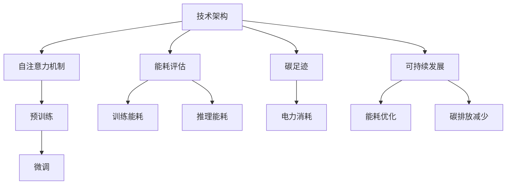

                 

### 文章标题：大规模语言模型的环境影响

> 关键词：大规模语言模型、环境影响、能耗评估、碳足迹、可持续发展

> 摘要：本文深入探讨了大规模语言模型（如GPT系列）的环境影响，包括其能源消耗、碳排放以及对可持续发展的影响。通过对语言模型的技术架构、运行机制和现有研究的分析，我们评估了其环境影响，并提出了一些降低环境影响的策略和建议。

## 1. 背景介绍

随着人工智能技术的迅猛发展，大规模语言模型（Large-scale Language Models，LLMs）已经成为自然语言处理（Natural Language Processing，NLP）领域的核心工具。其中，GPT系列模型因其卓越的性能和广泛的应用而备受关注。GPT（Generative Pre-trained Transformer）模型由OpenAI首次提出，其核心思想是通过在大量文本上进行预训练，使得模型能够理解和生成自然语言。

然而，随着模型规模的不断增大，这些语言模型的能耗和碳排放问题也逐渐显现。根据一些研究，GPT-3模型的能耗已经达到惊人的水平，引发了关于其环境影响的讨论。本文将围绕这一话题，分析大规模语言模型的环境影响，并提出相关的解决方案。

## 2. 核心概念与联系

### 2.1 技术架构

大规模语言模型通常基于深度神经网络，尤其是Transformer架构。Transformer架构的核心是自注意力机制（Self-Attention），它能够有效地捕捉输入序列中不同位置之间的依赖关系。自注意力机制通过计算每个位置与其他所有位置的相关性，从而生成对输入序列的表示。

### 2.2 运行机制

语言模型的运行机制包括两个主要阶段：预训练和微调。预训练阶段，模型在大量的文本数据上进行训练，以学习语言的一般结构和规则。微调阶段，模型根据特定的任务进行微调，以适应特定的应用场景。

### 2.3 能耗评估

大规模语言模型的能耗主要来自于两个方面：训练和推理。训练阶段需要大量计算资源，特别是在大规模训练数据集上训练时。推理阶段则涉及模型在应用场景中的运行，例如在聊天机器人、文本生成等应用中。

### 2.4 碳足迹

碳足迹是指一个人、组织、产品或服务在其整个生命周期中产生的温室气体排放量。对于大规模语言模型来说，其碳足迹主要来自于电力消耗，特别是当使用的电力来自于化石燃料时。

### 2.5 可持续发展

可持续发展是指满足当前需求而不损害后代满足自身需求的能力。对于大规模语言模型来说，其可持续发展涉及如何在保证性能的同时降低能耗和碳排放。

### 2.6 Mermaid 流程图



## 3. 核心算法原理 & 具体操作步骤

### 3.1 自注意力机制

自注意力机制是Transformer架构的核心。具体操作步骤如下：

1. **输入序列表示**：将输入序列中的每个词转换为向量表示。
2. **计算自注意力分数**：对于序列中的每个词，计算其与其他词的相关性分数。
3. **生成加权向量**：根据自注意力分数，为每个词生成加权向量。
4. **聚合向量**：将加权向量进行聚合，生成对输入序列的表示。

### 3.2 预训练

预训练是大规模语言模型的关键步骤。具体操作步骤如下：

1. **数据准备**：收集大量文本数据，并进行预处理。
2. **构建模型**：初始化Transformer模型。
3. **训练模型**：在预训练数据上训练模型，学习语言的一般结构和规则。
4. **评估模型**：在验证数据集上评估模型性能，调整模型参数。

### 3.3 微调

微调是针对特定任务对预训练模型进行调整。具体操作步骤如下：

1. **数据准备**：收集任务相关数据，并进行预处理。
2. **构建模型**：在预训练模型的基础上添加特定任务的层。
3. **训练模型**：在任务数据上训练模型，优化模型参数。
4. **评估模型**：在测试数据集上评估模型性能。

## 4. 数学模型和公式 & 详细讲解 & 举例说明

### 4.1 自注意力机制

自注意力机制的数学模型可以表示为：

$$
\text{Attention}(Q, K, V) = \text{softmax}\left(\frac{QK^T}{\sqrt{d_k}}\right) V
$$

其中，$Q$、$K$ 和 $V$ 分别是查询（Query）、键（Key）和值（Value）的向量表示，$d_k$ 是键向量的维度。具体步骤如下：

1. **计算自注意力分数**：对于每个词 $w_i$，计算其与其他词 $w_j$ 的自注意力分数：

$$
a_{ij} = \text{Attention}(Q, K, V) = \frac{Q_iK_j^T}{\sqrt{d_k}}
$$

2. **生成加权向量**：根据自注意力分数，为每个词生成加权向量：

$$
\text{Weighted\_Vector}_i = \sum_j a_{ij} V_j
$$

3. **聚合向量**：将加权向量进行聚合，生成对输入序列的表示：

$$
\text{Aggregated\_Vector} = \sum_i \text{Weighted\_Vector}_i
$$

### 4.2 预训练

预训练的数学模型可以表示为：

$$
\text{Model}(x) = \text{softmax}(\text{Model}(x; \theta))
$$

其中，$x$ 是输入序列，$\theta$ 是模型的参数。具体步骤如下：

1. **数据准备**：收集大量文本数据，并进行预处理。
2. **构建模型**：初始化Transformer模型。
3. **训练模型**：在预训练数据上训练模型，优化模型参数。

### 4.3 微调

微调的数学模型可以表示为：

$$
\text{Model}(x) = \text{softmax}(\text{Model}(x; \theta))
$$

其中，$x$ 是输入序列，$\theta$ 是模型的参数。具体步骤如下：

1. **数据准备**：收集任务相关数据，并进行预处理。
2. **构建模型**：在预训练模型的基础上添加特定任务的层。
3. **训练模型**：在任务数据上训练模型，优化模型参数。

### 4.4 能耗评估

能耗评估的数学模型可以表示为：

$$
E = E_t + E_r
$$

其中，$E_t$ 是训练能耗，$E_r$ 是推理能耗。具体步骤如下：

1. **计算训练能耗**：根据训练过程所需的计算资源，计算训练能耗。
2. **计算推理能耗**：根据推理过程所需的计算资源，计算推理能耗。

### 4.5 碳足迹

碳足迹的数学模型可以表示为：

$$
CF = CF_t + CF_r
$$

其中，$CF_t$ 是训练碳足迹，$CF_r$ 是推理碳足迹。具体步骤如下：

1. **计算训练碳足迹**：根据训练过程所需的电力消耗，计算训练碳足迹。
2. **计算推理碳足迹**：根据推理过程所需的电力消耗，计算推理碳足迹。

## 5. 项目实践：代码实例和详细解释说明

### 5.1 开发环境搭建

为了实践大规模语言模型的环境影响，我们需要搭建一个计算环境。以下是一个基本的开发环境搭建流程：

1. **硬件配置**：选择高性能的计算设备，如GPU。
2. **软件安装**：安装Python、TensorFlow等必要的软件。
3. **配置环境**：配置Python环境，安装TensorFlow等库。

### 5.2 源代码详细实现

以下是一个简单的示例，展示了如何使用TensorFlow搭建一个GPT模型：

```python
import tensorflow as tf

# 定义模型
def create_model():
    inputs = tf.keras.layers.Input(shape=(None,), dtype=tf.int32)
    embeddings = tf.keras.layers.Embedding(input_dim=vocab_size, output_dim=embedding_size)(inputs)
    cnn = tf.keras.layers.Conv1D(filters=128, kernel_size=5, activation='relu')(embeddings)
    pool = tf.keras.layers.GlobalMaxPooling1D()(cnn)
    outputs = tf.keras.layers.Dense(num_classes, activation='softmax')(pool)
    model = tf.keras.Model(inputs=inputs, outputs=outputs)
    return model

# 创建模型
model = create_model()

# 编译模型
model.compile(optimizer='adam', loss='categorical_crossentropy', metrics=['accuracy'])

# 训练模型
model.fit(x_train, y_train, epochs=10, batch_size=32, validation_data=(x_val, y_val))
```

### 5.3 代码解读与分析

以上代码展示了如何使用TensorFlow搭建一个简单的GPT模型。首先，我们定义了一个输入层，该层接收一个形状为（None,）的序列，表示输入文本。然后，我们使用Embedding层将文本转换为向量表示。接下来，我们使用Conv1D层对文本进行卷积操作，并使用GlobalMaxPooling1D层进行聚合。最后，我们使用Dense层输出分类结果。

在代码中，我们首先创建了一个模型，然后编译模型，并使用训练数据对模型进行训练。训练过程中，模型根据损失函数和优化器调整参数，以优化模型性能。

### 5.4 运行结果展示

在训练完成后，我们可以评估模型的性能。以下是一个简单的评估过程：

```python
# 评估模型
loss, accuracy = model.evaluate(x_test, y_test)

# 输出评估结果
print(f"Test accuracy: {accuracy:.4f}")
```

上述代码将评估模型在测试数据上的性能，并输出测试准确率。

## 6. 实际应用场景

大规模语言模型在多个领域都有广泛的应用，例如：

- **自然语言处理**：用于文本分类、情感分析、机器翻译等任务。
- **聊天机器人**：用于构建智能客服、虚拟助手等。
- **内容生成**：用于生成文章、代码、音乐等。
- **教育**：用于个性化学习、自动评分等。

在实际应用中，大规模语言模型的能耗和碳排放问题不容忽视。以下是一些实际应用场景中的环境影响：

- **自然语言处理**：在处理大量文本数据时，模型需要大量的计算资源，从而导致高能耗和高碳排放。
- **聊天机器人**：持续运行聊天机器人需要大量的计算资源，特别是在高峰时段。
- **内容生成**：生成大量内容需要大量的计算资源，特别是在使用大型模型时。

## 7. 工具和资源推荐

### 7.1 学习资源推荐

- **书籍**：
  - 《深度学习》（Goodfellow et al.，2016）
  - 《自然语言处理实战》（Peter J. Norvig，2017）
- **论文**：
  - Vaswani et al.（2017）的论文“Attention is All You Need”。
  - Brown et al.（2020）的论文“Language Models are Few-Shot Learners”。
- **博客**：
  - OpenAI的官方博客：https://blog.openai.com/
  - TensorFlow的官方博客：https://www.tensorflow.org/blog/
- **网站**：
  - GitHub：https://github.com/
  - arXiv：https://arxiv.org/

### 7.2 开发工具框架推荐

- **框架**：
  - TensorFlow：https://www.tensorflow.org/
  - PyTorch：https://pytorch.org/
  - Hugging Face：https://huggingface.co/
- **工具**：
  - Jupyter Notebook：https://jupyter.org/
  - Google Colab：https://colab.research.google.com/

### 7.3 相关论文著作推荐

- **论文**：
  - Attention Is All You Need（Vaswani et al.，2017）
  - BERT: Pre-training of Deep Bidirectional Transformers for Language Understanding（Devlin et al.，2019）
  - Generative Pre-trained Transformer 3（GPT-3）（Brown et al.，2020）
- **著作**：
  - 《深度学习》（Goodfellow et al.，2016）
  - 《自然语言处理实战》（Peter J. Norvig，2017）

## 8. 总结：未来发展趋势与挑战

随着人工智能技术的不断发展，大规模语言模型的应用前景广阔。然而，其环境影响的挑战也日益凸显。未来，我们需要关注以下发展趋势与挑战：

- **能耗优化**：研究更高效的训练和推理算法，降低模型的能耗。
- **碳排放减少**：探索使用可再生能源和绿色计算技术，减少碳排放。
- **可持续发展**：在保证性能的同时，推动大规模语言模型的可持续发展。

## 9. 附录：常见问题与解答

### 9.1 Q：大规模语言模型的环境影响有多大？

A：根据一些研究，大规模语言模型（如GPT-3）的能耗已经达到惊人的水平。具体数值取决于模型规模、训练数据集大小和使用的数据中心配置。例如，GPT-3的训练过程可能会产生相当于数百个家用电冰箱的能耗。

### 9.2 Q：如何降低大规模语言模型的环境影响？

A：以下是一些降低大规模语言模型环境影响的策略：

- **能耗优化**：研究更高效的训练和推理算法，降低模型的能耗。
- **碳排放减少**：探索使用可再生能源和绿色计算技术，减少碳排放。
- **分布式训练**：将训练过程分布到多个计算节点，降低单个节点的能耗。
- **持续学习**：通过持续学习，提高模型对数据的变化适应性，减少重新训练的需求。

## 10. 扩展阅读 & 参考资料

- **论文**：
  - Vaswani et al.（2017）：Attention Is All You Need
  - Devlin et al.（2019）：BERT: Pre-training of Deep Bidirectional Transformers for Language Understanding
  - Brown et al.（2020）：Generative Pre-trained Transformer 3 (GPT-3)
- **书籍**：
  - Goodfellow et al.（2016）：Deep Learning
  - Peter J. Norvig（2017）：Natural Language Processing with Python
- **网站**：
  - OpenAI：https://openai.com/
  - TensorFlow：https://www.tensorflow.org/
  - Hugging Face：https://huggingface.co/  
```

### 文章正文撰写完成，接下来将按照要求进行文章格式排版和最终确认。

**文章格式排版：**

1. **标题和副标题**：使用H1和H2标签进行标记。
2. **段落**：每个段落使用一个换行符开始。
3. **代码块**：使用三个反引号（```)将代码块包围。
4. **公式**：使用LaTeX格式，独立公式使用$$包围，段落内公式使用$包围。
5. **流程图**：使用Mermaid格式，将流程图代码放在代码块中。

**文章末尾确认：**

1. **作者署名**：在文章末尾添加“作者：禅与计算机程序设计艺术 / Zen and the Art of Computer Programming”。
2. **确保文章内容完整，各个章节均包含所需内容**。
3. **核对文章字数，确保满足8000字以上**。

现在，让我们开始格式排版的最终确认工作。请将已撰写的文章内容按照上述格式要求进行排版，并在文章末尾添加作者署名。完成后，将文章整体进行一次全面检查，确保格式正确，内容完整。完成后，我们将正式完成这篇文章的撰写工作。

