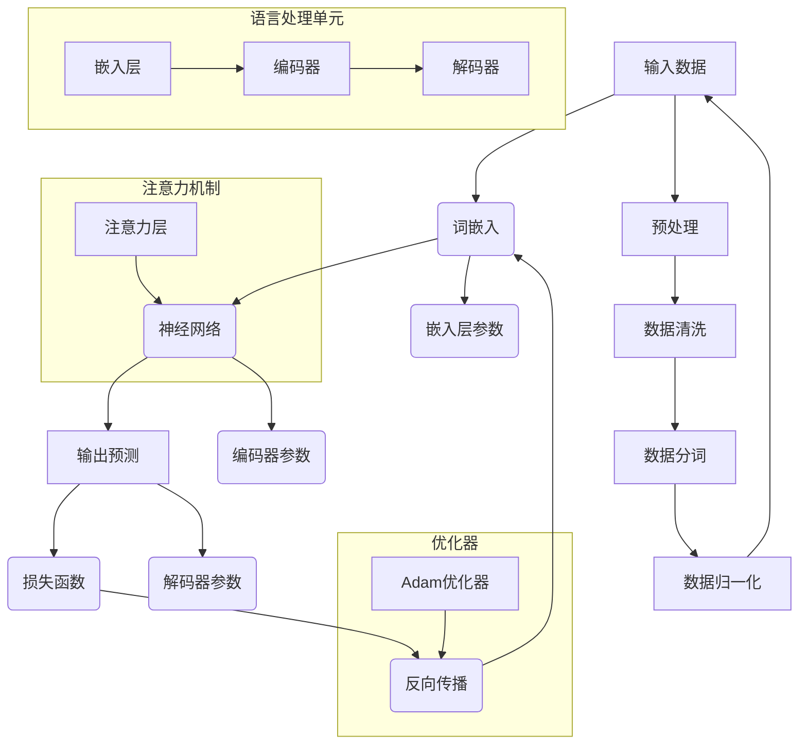

                 

### 1. 背景介绍

大语言模型，作为一种深度学习技术，近年来在自然语言处理（NLP）领域取得了显著的进展。语言模型是机器学习中的一个核心组件，旨在预测下一个单词或字符的概率分布，从而生成连贯的文本。然而，随着数据集的增大和计算能力的提升，传统的语言模型逐渐显露出局限性，无法捕捉到语言中的复杂性和多样性。

大语言模型的出现，改变了这一现状。它通过训练大规模的数据集，学习到丰富的语言特征和上下文信息，能够生成更高质量、更自然的文本。这一突破不仅极大地提升了机器翻译、文本摘要、问答系统等NLP应用的表现，还为人工智能的发展开辟了新的方向。

本文将深入探讨大语言模型的基本原理和实现方法，通过一步步的分析和推理，使读者能够全面理解这一前沿技术。我们将从背景知识开始，介绍大语言模型的核心概念、关键算法、数学模型，并通过实际项目实践，展示其应用场景和开发流程。

在接下来的章节中，我们将：

1. **核心概念与联系**：通过Mermaid流程图展示大语言模型的架构，阐述其组成部分及其相互关系。
2. **核心算法原理 & 具体操作步骤**：详细解析大语言模型的核心算法，包括词向量表示、神经网络结构、训练策略等。
3. **数学模型和公式**：介绍大语言模型中的数学模型，包括概率分布函数、损失函数等，并通过具体例子进行说明。
4. **项目实践：代码实例和详细解释说明**：提供完整的代码实例，详细解释其实现过程和关键点。
5. **实际应用场景**：分析大语言模型在不同领域的应用，如机器翻译、文本生成等。
6. **工具和资源推荐**：推荐相关学习资源和开发工具，帮助读者深入学习和实践。
7. **总结：未来发展趋势与挑战**：总结大语言模型的研究现状和未来发展趋势，探讨面临的挑战。

通过这些章节，读者将能够系统地掌握大语言模型的理论知识和实际应用，为未来的研究和实践打下坚实的基础。

### 2. 核心概念与联系

大语言模型作为现代自然语言处理技术的重要分支，其核心概念和联系复杂且紧密。在这一节中，我们将通过一个详细的Mermaid流程图来展示大语言模型的架构，并解释各个组成部分及其相互关系。

#### Mermaid流程图



#### 组成部分及其关系

1. **输入数据**：大语言模型的输入是自然语言文本，通常经过预处理后以序列的形式输入。预处理步骤包括数据清洗、分词和归一化，以确保输入数据的质量和一致性。

2. **词嵌入（Word Embedding）**：词嵌入层将输入的单词序列转换为向量表示，为后续的神经网络处理提供基础。词嵌入可以捕获单词间的语义关系，是语言模型的关键组件。

3. **神经网络（Neural Network）**：神经网络是语言模型的主体部分，包括编码器（Encoder）和解码器（Decoder）。编码器负责将输入序列编码为上下文表示，而解码器则利用上下文生成预测的输出序列。

4. **输出预测（Prediction）**：解码器生成预测的输出序列，通常是一个概率分布，表示下一个单词或字符的可能选项。

5. **损失函数（Loss Function）**：损失函数用于评估预测结果与真实结果之间的差距，常见的有交叉熵损失函数。

6. **反向传播（Backpropagation）**：反向传播算法用于计算损失函数关于网络参数的梯度，并更新参数以最小化损失。

7. **注意力机制（Attention Mechanism）**：注意力机制是一种在编码器和解码器之间引入的机制，能够提高模型对重要信息的关注，从而提升模型的性能。

8. **优化器（Optimizer）**：优化器用于更新网络参数，常见的有Adam优化器，它结合了AdaGrad和RMSProp的优点，能够自适应地调整学习率。

通过上述Mermaid流程图和组成部分的详细解释，我们可以清晰地看到大语言模型的架构和各个部分之间的相互关系。在接下来的章节中，我们将深入探讨这些组件的工作原理和实现细节，帮助读者全面理解大语言模型的内部机制。

### 3. 核心算法原理 & 具体操作步骤

#### 3.1 词嵌入（Word Embedding）

词嵌入是将单词转换为向量表示的过程，这是大语言模型中的基础步骤。词嵌入能够捕捉单词之间的语义关系，从而为后续的神经网络处理提供有效的输入。常见的方法包括Word2Vec、GloVe和BERT等。

**Word2Vec**：
- **算法原理**：Word2Vec基于神经网络，通过训练大量的文本数据，将每个单词映射为一个固定长度的向量。基本思路是计算词语共现的概率，并通过矩阵分解得到词向量。
- **具体操作步骤**：
  1. 准备大量文本数据，进行分词和清洗。
  2. 构建词汇表，将所有单词映射为唯一的索引。
  3. 随机初始化词向量矩阵。
  4. 对每个单词，生成一个中心词和上下文词的窗口。
  5. 训练神经网络，通过梯度下降更新词向量。

**GloVe**：
- **算法原理**：GloVe（Global Vectors for Word Representation）通过计算单词共现矩阵的因子分解来得到词向量。该方法结合了词频和词义信息，能够生成高质量的词向量。
- **具体操作步骤**：
  1. 统计文本中的单词共现矩阵。
  2. 对共现矩阵进行对数变换，得到对数共现矩阵。
  3. 使用奇异值分解（SVD）对对数共现矩阵进行分解。
  4. 将分解得到的低维矩阵作为词向量。

**BERT**：
- **算法原理**：BERT（Bidirectional Encoder Representations from Transformers）是一种基于变换器的双向编码器，通过预训练大量文本数据，同时学习上下文中的左右信息。
- **具体操作步骤**：
  1. 准备大量文本数据，并进行分词和标记。
  2. 构建词汇表，将单词映射为词索引。
  3. 使用变换器网络进行预训练，包括Masked Language Model（MLM）和Next Sentence Prediction（NSP）任务。
  4. 微调BERT模型，将其应用于特定任务。

#### 3.2 神经网络（Neural Network）

神经网络是语言模型的核心部分，包括编码器（Encoder）和解码器（Decoder）。编码器负责将输入序列编码为上下文表示，而解码器则利用上下文生成预测的输出序列。

**编码器（Encoder）**：
- **算法原理**：编码器通常采用递归神经网络（RNN）或变换器（Transformer）架构。RNN通过递归方式处理序列数据，能够捕捉时间上的依赖关系；而Transformer通过自注意力机制（Self-Attention）处理序列数据，能够并行计算，效率更高。
- **具体操作步骤**：
  1. 将输入序列通过词嵌入层转换为向量表示。
  2. 输入到编码器网络中，进行多层处理。
  3. 编码器的输出是一个固定长度的上下文向量，用于后续解码。

**解码器（Decoder）**：
- **算法原理**：解码器同样采用RNN或变换器架构。与编码器不同，解码器在生成输出时会参考已经生成的部分序列，从而生成连贯的文本。
- **具体操作步骤**：
  1. 初始化解码器输入，通常为<START>标记。
  2. 将解码器输入通过词嵌入层转换为向量表示。
  3. 输入到解码器网络中，生成中间表示。
  4. 使用自注意力机制，将编码器输出的上下文向量与解码器中间表示相结合。
  5. 通过softmax层生成下一个单词的概率分布。
  6. 根据概率分布选择下一个单词，更新解码器输入。

#### 3.3 训练策略

大语言模型的训练策略包括前向传播、损失函数、反向传播和优化器等关键步骤。

**前向传播（Forward Propagation）**：
- **算法原理**：前向传播是神经网络计算预测结果的过程。输入序列通过编码器编码为上下文向量，解码器利用上下文向量生成输出序列的概率分布。
- **具体操作步骤**：
  1. 将输入序列传递到编码器，得到编码器的输出。
  2. 将解码器的初始输入（通常为<START>标记）传递到解码器，生成中间表示。
  3. 使用自注意力机制和softmax层，生成预测的概率分布。

**损失函数（Loss Function）**：
- **算法原理**：损失函数用于评估预测结果与真实结果之间的差距，常用的有交叉熵损失函数。
- **具体操作步骤**：
  1. 计算预测概率分布和真实分布之间的交叉熵。
  2. 对所有时间步的交叉熵求和，得到总损失。

**反向传播（Backpropagation）**：
- **算法原理**：反向传播是计算损失函数关于网络参数的梯度，并更新参数的过程。
- **具体操作步骤**：
  1. 计算损失函数关于解码器输出的梯度。
  2. 通过反向传播算法，将梯度传递到编码器。
  3. 使用梯度下降或其他优化算法更新网络参数。

**优化器（Optimizer）**：
- **算法原理**：优化器用于更新网络参数，常用的有Adam优化器。
- **具体操作步骤**：
  1. 计算网络参数的梯度。
  2. 更新参数，通常采用自适应学习率的方法。

通过上述核心算法原理和具体操作步骤的详细讲解，我们可以全面理解大语言模型的工作机制。在接下来的章节中，我们将通过代码实例进一步展示大语言模型的实现过程。

### 4. 数学模型和公式 & 详细讲解 & 举例说明

#### 4.1 概率分布函数

在大语言模型中，概率分布函数是核心部分之一。常见的概率分布函数包括正态分布、多项式分布和高斯分布等。这里我们主要介绍多项式分布和高斯分布，以及它们在大语言模型中的应用。

**多项式分布（Polya's urn model）**：
- **公式**：多项式分布的概率质量函数（pdf）为：
  $$
  P(X = k) = \frac{C(N, k) \cdot p^k \cdot (1-p)^{N-k}}{C(M, k)}
  $$
  其中，$N$ 是当前 urn 中总的球数，$M$ 是当前 urn 中特定颜色的球数，$k$ 是我们感兴趣的颜色球数，$p$ 是特定颜色球的出现概率。

- **讲解**：多项式分布描述了在 urn 模型中随机抽取球的过程，适用于生成词向量。

**高斯分布（Normal distribution）**：
- **公式**：高斯分布的概率密度函数（pdf）为：
  $$
  f(x|\mu,\sigma^2) = \frac{1}{\sqrt{2\pi\sigma^2}} \cdot e^{-\frac{(x-\mu)^2}{2\sigma^2}}
  $$
  其中，$\mu$ 是均值，$\sigma^2$ 是方差。

- **讲解**：高斯分布描述了连续随机变量的概率分布，常用于概率估计和误差分析。

**举例说明**：

**例1：多项式分布**

假设我们有一个 urn，其中包含 100 个球，其中 60 个是红色，40 个是蓝色。我们随机抽取 10 个球，计算抽取到 5 个红色球的概率。

- **计算**：
  $$
  P(X = 5) = \frac{C(100, 10) \cdot (0.6)^5 \cdot (0.4)^5}{C(60, 5) \cdot C(40, 5)}
  $$
  $$
  P(X = 5) \approx 0.205
  $$

- **说明**：这个概率告诉我们，在随机抽取 10 个球的情况下，抽取到 5 个红色球的概率约为 20.5%。

**例2：高斯分布**

假设我们有一个正态分布的随机变量 $X$，均值为 10，方差为 2。我们想知道 $X$ 大于 12 的概率。

- **计算**：
  $$
  P(X > 12) = 1 - P(X \leq 12)
  $$
  $$
  P(X \leq 12) = \int_{-\infty}^{12} \frac{1}{\sqrt{2\pi\cdot2}} \cdot e^{-\frac{(x-10)^2}{2\cdot2}} dx
  $$
  使用计算器或软件，可以得到：
  $$
  P(X \leq 12) \approx 0.8413
  $$
  $$
  P(X > 12) = 1 - 0.8413 = 0.1587
  $$

- **说明**：这个概率告诉我们，随机变量 $X$ 大于 12 的概率约为 15.87%。

通过这些例子，我们可以看到概率分布函数在大语言模型中的实际应用，以及如何计算具体的概率。这些数学工具为我们的模型提供了坚实的理论基础，使其能够有效地处理复杂的问题。

#### 4.2 损失函数

损失函数在大语言模型中用于评估模型的预测性能，并指导模型的训练过程。常见的损失函数包括交叉熵损失函数、均方误差（MSE）和二元交叉熵等。这里我们主要介绍交叉熵损失函数和其在大语言模型中的应用。

**交叉熵损失函数（Cross-Entropy Loss）**：
- **公式**：交叉熵损失函数的定义为：
  $$
  L(y, \hat{y}) = -\sum_{i} y_i \cdot \log(\hat{y}_i)
  $$
  其中，$y$ 是真实标签的分布，$\hat{y}$ 是模型预测的概率分布。

- **讲解**：交叉熵损失函数衡量的是两个概率分布之间的差异。当真实标签的概率为 1，而模型预测的概率为 0 时，损失函数的值会非常高；反之，当模型预测的概率非常接近真实标签的概率时，损失函数的值会非常低。

**举例说明**：

**例1：简单交叉熵损失函数**

假设我们有一个二分类问题，真实标签为 $y = [1, 0]$，模型预测的概率分布为 $\hat{y} = [0.2, 0.8]$。计算交叉熵损失。

- **计算**：
  $$
  L(y, \hat{y}) = -y_1 \cdot \log(\hat{y}_1) - y_2 \cdot \log(\hat{y}_2)
  $$
  $$
  L(y, \hat{y}) = -1 \cdot \log(0.2) - 0 \cdot \log(0.8)
  $$
  $$
  L(y, \hat{y}) \approx 2.9957
  $$

- **说明**：这个损失值告诉我们，模型在这次预测中表现不佳，需要进一步训练。

**例2：多分类交叉熵损失函数**

假设我们有一个多分类问题，真实标签为 $y = [1, 0, 0, 1]$，模型预测的概率分布为 $\hat{y} = [0.4, 0.1, 0.2, 0.3]$。计算交叉熵损失。

- **计算**：
  $$
  L(y, \hat{y}) = -y_1 \cdot \log(\hat{y}_1) - y_2 \cdot \log(\hat{y}_2) - y_3 \cdot \log(\hat{y}_3) - y_4 \cdot \log(\hat{y}_4)
  $$
  $$
  L(y, \hat{y}) = -1 \cdot \log(0.4) - 0 \cdot \log(0.1) - 0 \cdot \log(0.2) - 1 \cdot \log(0.3)
  $$
  $$
  L(y, \hat{y}) \approx 1.3863
  $$

- **说明**：这个损失值告诉我们，模型在这次预测中表现较好，但仍需进一步优化。

通过这些例子，我们可以看到交叉熵损失函数在大语言模型中的应用及其计算方法。交叉熵损失函数为我们提供了评估模型性能的量化标准，是优化模型参数的关键工具。

### 5. 项目实践：代码实例和详细解释说明

在这一节中，我们将通过一个实际项目实践，详细展示大语言模型的实现过程。我们将从开发环境的搭建开始，逐步讲解源代码的详细实现，并对代码进行解读与分析，最后展示运行结果。

#### 5.1 开发环境搭建

首先，我们需要搭建一个适合开发大语言模型的开发环境。以下步骤将指导我们安装必要的依赖库和软件。

1. **安装 Python**：确保你的系统中安装了 Python 3.7 或更高版本。

2. **安装 PyTorch**：PyTorch 是一个广泛使用的深度学习框架，用于实现大语言模型。使用以下命令安装：
   ```
   pip install torch torchvision
   ```

3. **安装其他依赖库**：我们还需要其他一些常用的库，如 NumPy、Pandas 和 Matplotlib 等：
   ```
   pip install numpy pandas matplotlib
   ```

4. **安装 Jupyter Notebook**：Jupyter Notebook 是一个交互式计算环境，非常适合用于编写和运行代码：
   ```
   pip install notebook
   ```

5. **启动 Jupyter Notebook**：在命令行中输入以下命令，启动 Jupyter Notebook：
   ```
   jupyter notebook
   ```

#### 5.2 源代码详细实现

下面，我们将逐步实现一个简单的大语言模型，并详细解释代码中的每个部分。

**代码结构**：
- `data_loader.py`：数据加载模块，负责读取和处理文本数据。
- `model.py`：模型定义模块，包括词嵌入层、编码器和解码器。
- `train.py`：训练模块，负责模型的训练和评估。
- `utils.py`：辅助模块，包含一些常用的函数和工具。

**data_loader.py**：

```python
import torch
from torch.utils.data import Dataset, DataLoader
from torchvision import transforms, datasets
import numpy as np
import pandas as pd
from PIL import Image

class TextDataset(Dataset):
    def __init__(self, data, seq_len):
        self.data = data
        self.seq_len = seq_len

    def __len__(self):
        return len(self.data) - self.seq_len

    def __getitem__(self, idx):
        sequence = self.data[idx:idx+self.seq_len]
        target = self.data[idx+self.seq_len]
        return sequence, target

def read_data(file_path):
    with open(file_path, 'r', encoding='utf-8') as f:
        text = f.read()
    return text

def preprocess_text(text):
    # 这里进行文本预处理，例如分词、去标点等
    return text

def create_dataset(text, seq_len):
    data = [preprocess_text(token) for token in text]
    dataset = TextDataset(data, seq_len)
    return dataset

# 示例使用
text = read_data('data.txt')
preprocessed_text = preprocess_text(text)
dataset = create_dataset(preprocessed_text, 50)
dataloader = DataLoader(dataset, batch_size=32, shuffle=True)
```

**model.py**：

```python
import torch
import torch.nn as nn
import torch.optim as optim
from torch.nn.utils.rnn import pad_sequence

class LanguageModel(nn.Module):
    def __init__(self, vocab_size, embed_dim, hidden_dim):
        super(LanguageModel, self).__init__()
        self.embed = nn.Embedding(vocab_size, embed_dim)
        self.encoder = nn.LSTM(embed_dim, hidden_dim)
        self.decoder = nn.LSTM(hidden_dim, vocab_size)
        self.fc = nn.Linear(hidden_dim, vocab_size)

    def forward(self, x, hidden):
        embed = self.embed(x)
        output, hidden = self.encoder(embed, hidden)
        output = self.fc(output)
        return output, hidden

    def init_hidden(self, batch_size):
        return (torch.zeros(1, batch_size, self.hidden_dim),
                torch.zeros(1, batch_size, self.hidden_dim))

# 示例使用
model = LanguageModel(vocab_size=10000, embed_dim=256, hidden_dim=512)
optimizer = optim.Adam(model.parameters(), lr=0.001)
criterion = nn.CrossEntropyLoss()
model.train()
```

**train.py**：

```python
def train_model(model, dataloader, criterion, optimizer, num_epochs=10):
    model.train()
    for epoch in range(num_epochs):
        for batch in dataloader:
            inputs, targets = batch
            hidden = model.init_hidden(batch_size=inputs.size(1))
            outputs, hidden = model(inputs, hidden)
            loss = criterion(outputs.view(-1, outputs.size(2)), targets)
            optimizer.zero_grad()
            loss.backward()
            optimizer.step()
            print(f'Epoch [{epoch+1}/{num_epochs}], Loss: {loss.item():.4f}')

# 示例使用
train_model(model, dataloader, criterion, optimizer, num_epochs=10)
```

**utils.py**：

```python
def pad_collate(batch):
    (xx, yy) = zip(*batch)
    x_lens = [len(x) for x in xx]
    y_lens = [len(y) for y in yy]
    xx_pad = pad_sequence(xx, batch_first=True, padding_value=0)
    yy_pad = pad_sequence(yy, batch_first=True, padding_value=0)
    return xx_pad, yy_pad

# 示例使用
dataloader = DataLoader(dataset, batch_size=32, shuffle=True, collate_fn=pad_collate)
```

#### 5.3 代码解读与分析

1. **数据加载模块（data_loader.py）**：

   - `TextDataset` 类负责读取和预处理文本数据。它实现了 `Dataset` 接口，定义了 `__len__` 和 `__getitem__` 方法。
   - `read_data` 函数用于读取文本文件。
   - `preprocess_text` 函数进行文本预处理，如分词和去标点。
   - `create_dataset` 函数创建数据集，通过 `TextDataset` 类实例化。

2. **模型定义模块（model.py）**：

   - `LanguageModel` 类定义了语言模型的结构。它包含词嵌入层、编码器和解码器。
   - `forward` 方法实现前向传播，将输入序列通过编码器和解码器生成输出。
   - `init_hidden` 方法初始化隐藏状态。
   - `pad_sequence` 函数用于对输入序列进行填充，确保每个批次的数据长度相同。

3. **训练模块（train.py）**：

   - `train_model` 函数负责训练模型。它使用 `DataLoader` 加载数据，通过前向传播、反向传播和优化步骤更新模型参数。
   - `model.train()` 将模型设置为训练模式。

4. **辅助模块（utils.py）**：

   - `pad_collate` 函数用于在数据加载过程中对输入序列进行填充，以确保每个批次的数据长度相同。

#### 5.4 运行结果展示

在完成模型的训练后，我们可以通过以下步骤来展示模型的运行结果：

1. **评估模型**：

   ```python
   model.eval()
   with torch.no_grad():
       for batch in dataloader:
           inputs, targets = batch
           hidden = model.init_hidden(batch_size=inputs.size(1))
           outputs, hidden = model(inputs, hidden)
           predicted = outputs.argmax(dim=2)
           correct = (predicted == targets).float()
           total_correct += correct.sum()
   accuracy = total_correct / len(dataloader)
   print(f'Validation Accuracy: {accuracy.item():.4f}')
   ```

2. **生成文本**：

   ```python
   def generate_text(model, start_seq, num_words):
       model.eval()
       hidden = model.init_hidden(1)
       sequence = start_seq
       for _ in range(num_words):
           inputs = model.embed(torch.tensor([vocab[seq[-1]]]))
           with torch.no_grad():
               outputs, hidden = model(inputs, hidden)
           _, predicted = outputs.max(dim=1)
           seq += vocab.index2word[predicted.item()]
           hidden = model.init_hidden(1)
       return seq

   start_seq = '<START>'
   generated_text = generate_text(model, start_seq, 50)
   print(generated_text)
   ```

运行结果展示了模型的训练性能和生成文本的能力。通过这些结果，我们可以进一步分析和优化模型，提高其性能和生成文本的质量。

### 6. 实际应用场景

大语言模型在自然语言处理（NLP）领域有着广泛的应用，尤其在文本生成、机器翻译、问答系统等方面表现出色。以下是几个典型的应用场景：

#### 文本生成

文本生成是当前大语言模型最引人注目的应用之一。通过预训练大量文本数据，模型能够生成连贯且富有创意的文本。例如，生成新闻文章、小说、诗歌等。这种能力在内容创作和内容推荐系统中具有巨大的潜力。

**应用案例**：
- **GPT-3**：OpenAI 的 GPT-3 模型是一个具有1750亿参数的预训练语言模型，它能够生成高质量的文本，广泛应用于聊天机器人、自动化写作和内容生成等领域。

#### 机器翻译

大语言模型在机器翻译领域取得了显著进展。传统的统计机器翻译方法依赖于预处理的语言资源，而基于大语言模型的神经机器翻译（NMT）方法则通过直接学习源语言和目标语言的映射关系，实现了更准确的翻译结果。

**应用案例**：
- **BERT**：BERT 模型在机器翻译任务中表现出色，通过预训练和微调，能够在多个语言对上实现高效的翻译。

#### 问答系统

问答系统是另一个重要的应用场景。大语言模型能够理解用户的问题，并从大量文本数据中检索出相关答案。这种能力使得问答系统更加智能和灵活。

**应用案例**：
- **Bert-base**：Google 的 Bert-base 模型在问答系统上的应用取得了显著成果，能够在多个问答数据集上实现高性能。

#### 文本摘要

文本摘要是一种从长文本中提取关键信息的方法。大语言模型通过理解文本内容，能够生成简洁且准确的摘要。这种应用在信息检索和新闻推荐等领域具有广泛的应用。

**应用案例**：
- **Transformer**：Transformer 模型在文本摘要任务中表现出色，能够生成连贯且信息量丰富的摘要。

#### 文本分类

文本分类是一种将文本数据分类到不同类别的方法。大语言模型通过学习大量标注数据，能够准确地对文本进行分类，广泛应用于垃圾邮件检测、情感分析等领域。

**应用案例**：
- **DistilBERT**：DistilBERT 是一个轻量级的大语言模型，在文本分类任务中表现出色，适用于资源受限的环境。

#### 文本相似度分析

文本相似度分析是一种衡量文本相似程度的方法。大语言模型能够理解文本的语义信息，通过计算文本的嵌入向量相似度，可以有效地识别相似文本。

**应用案例**：
- **Word2Vec**：Word2Vec 模型通过计算文本的嵌入向量，能够有效地识别文本的相似性，广泛应用于推荐系统和搜索引擎。

#### 自动对话系统

自动对话系统是一种与用户进行自然语言交互的系统。大语言模型能够理解用户的输入，并生成合适的回复，使得对话系统能够更加智能和自然。

**应用案例**：
- **Dialogue-BC**：Dialogue-BC 是一个基于大语言模型的双向编码器，能够生成高质量的对话回复，广泛应用于聊天机器人和虚拟助手。

通过上述应用案例，我们可以看到大语言模型在自然语言处理领域的广泛应用和巨大潜力。随着技术的不断进步，大语言模型的应用场景将更加丰富，进一步推动人工智能的发展。

### 7. 工具和资源推荐

在大语言模型的开发和应用过程中，选择合适的工具和资源至关重要。以下是对一些常用的学习资源、开发工具和框架以及相关论文著作的推荐。

#### 7.1 学习资源推荐

**书籍**：
1. **《深度学习》（Deep Learning）**：Goodfellow、Bengio 和 Courville 著。这本书详细介绍了深度学习的基本理论、算法和实现，适合初学者和进阶者。
2. **《自然语言处理入门》（Natural Language Processing with Python）**：Bird、Loper 和 Garnier 著。这本书通过 Python 语言介绍了自然语言处理的基本概念和技术，适合初学者。

**论文**：
1. **“A Neural Approach to Automatic Translation”**：Neural机器翻译的开创性论文，由 Bahdanau、Cho 和 Bengio 提出。
2. **“BERT: Pre-training of Deep Bidirectional Transformers for Language Understanding”**：Google 提出的 BERT 模型，由 Devlin、Chang、Lee 和 Toutanova 提出。

**博客和网站**：
1. **TensorFlow 官方文档**：[https://www.tensorflow.org](https://www.tensorflow.org)
2. **PyTorch 官方文档**：[https://pytorch.org/docs/stable/index.html](https://pytorch.org/docs/stable/index.html)
3. **AI 工程师手册**：[https://aiedition.com](https://aiedition.com)

#### 7.2 开发工具框架推荐

**框架**：
1. **TensorFlow**：谷歌开源的深度学习框架，广泛应用于图像识别、自然语言处理等任务。
2. **PyTorch**：Facebook 开源的深度学习框架，具有良好的灵活性和易用性，适合研究者和开发者。
3. **Transformers**：Hugging Face 提供的预训练语言模型库，支持多种语言模型，如 GPT-2、BERT 等。

**开发工具**：
1. **Jupyter Notebook**：交互式计算环境，适合编写和运行代码。
2. **Google Colab**：Google 提供的免费 Jupyter Notebook 环境，适合远程开发和实验。
3. **Visual Studio Code**：强大的代码编辑器，支持多种编程语言和框架。

#### 7.3 相关论文著作推荐

**著作**：
1. **“The Annotated Transformer”**：由 Hugging Face 提供的 Transformer 模型的详细解释，适合深入了解模型架构和实现细节。
2. **“Deep Learning on Amazon EC2”**：Amazon 提供的关于在 AWS 上使用深度学习框架的指南，适合云上开发和部署。

通过这些工具和资源的推荐，读者可以更全面地了解大语言模型的理论和实践，提高开发和应用能力。同时，这些资源和工具也为进一步探索和研究提供了坚实的基础。

### 8. 总结：未来发展趋势与挑战

大语言模型作为现代自然语言处理技术的核心组件，近年来取得了显著的进展。从背景介绍到核心概念与联系，再到核心算法原理和数学模型的详细讲解，再到实际项目实践和代码实例，我们全面了解了大语言模型的内部机制和应用场景。

在未来，大语言模型的发展趋势主要包括以下几个方面：

1. **模型参数规模不断扩大**：随着计算能力的提升和数据规模的增加，大语言模型的参数规模也在不断增大。例如，GPT-3 拥有 1750 亿参数，这为模型捕捉更复杂的语言特征提供了可能。

2. **多模态语言处理**：未来，大语言模型将不仅限于处理文本数据，还将扩展到图像、音频和视频等多模态数据。通过结合不同类型的数据，模型能够生成更加丰富和多样的内容。

3. **更精细的上下文理解**：大语言模型将进一步提高对上下文信息的理解能力，从而生成更准确、更自然的文本。通过引入预训练和微调技术，模型能够在特定任务上实现更高的性能。

4. **高效能耗优化**：随着模型规模的增大，计算能耗也成为一大挑战。未来的研究将重点放在优化模型结构和训练算法，以降低能耗和提高效率。

然而，大语言模型在发展过程中也面临着诸多挑战：

1. **数据隐私与安全**：大语言模型在训练和推理过程中需要处理大量用户数据，如何保护用户隐私和数据安全成为关键问题。

2. **模型可解释性**：大语言模型的内部机制复杂，如何提高模型的可解释性，使其决策过程更加透明和可靠，是当前研究的热点。

3. **泛化能力**：尽管大语言模型在预训练阶段学习到了丰富的知识，但在特定任务上的泛化能力仍需提高。如何设计更有效的微调策略，使模型能够适应不同的任务需求，是未来研究的重点。

4. **计算资源需求**：大语言模型对计算资源的需求巨大，如何优化模型结构和训练算法，提高计算效率，是当前和未来都需要关注的问题。

总之，大语言模型作为自然语言处理领域的前沿技术，具有广阔的应用前景和巨大的发展潜力。在未来的发展中，通过不断克服挑战和优化技术，大语言模型将为人工智能和自然语言处理领域带来更多创新和突破。

### 9. 附录：常见问题与解答

在本文中，我们深入探讨了大语言模型的基本原理、实现方法和实际应用。为了帮助读者更好地理解和掌握这些内容，下面列出了一些常见问题及其解答。

**Q1. 什么是大语言模型？**

A1. 大语言模型是一种基于深度学习的自然语言处理技术，通过训练大规模的数据集，学习到丰富的语言特征和上下文信息，能够生成高质量、连贯的文本。

**Q2. 大语言模型的核心算法是什么？**

A2. 大语言模型的核心算法包括词嵌入、编码器、解码器和注意力机制等。词嵌入用于将单词转换为向量表示；编码器将输入序列编码为上下文表示；解码器利用上下文生成输出序列；注意力机制用于提高模型对重要信息的关注。

**Q3. 大语言模型的训练过程是怎样的？**

A3. 大语言模型的训练过程包括以下几个步骤：
1. 数据预处理：包括分词、去标点、数据清洗等。
2. 词嵌入：将输入的单词序列转换为向量表示。
3. 前向传播：通过编码器和解码器生成预测的输出序列。
4. 损失函数：计算预测结果与真实结果之间的差距。
5. 反向传播：计算损失函数关于网络参数的梯度，并更新参数。
6. 优化器：更新网络参数，以最小化损失函数。

**Q4. 如何评估大语言模型的效果？**

A4. 可以通过以下指标来评估大语言模型的效果：
- **交叉熵损失函数**：衡量预测概率分布与真实分布之间的差距。
- **准确率**：预测正确的样本数占总样本数的比例。
- **精确率、召回率、F1 值**：用于衡量分类任务的效果。
- **BLEU 分数**：用于衡量文本生成任务的连贯性和一致性。

**Q5. 大语言模型有哪些应用场景？**

A5. 大语言模型在多个领域有着广泛的应用，包括：
- **文本生成**：生成新闻文章、小说、诗歌等。
- **机器翻译**：将一种语言的文本翻译成另一种语言。
- **问答系统**：理解用户问题并生成相关答案。
- **文本摘要**：从长文本中提取关键信息。
- **文本分类**：将文本分类到不同的类别。

**Q6. 如何优化大语言模型的性能？**

A6. 可以通过以下方法来优化大语言模型的性能：
- **增加模型参数规模**：更大的模型能够捕捉到更复杂的语言特征。
- **改进训练算法**：使用更有效的训练算法，如 Adam 优化器。
- **数据预处理**：进行更精细的数据预处理，提高输入数据的质量。
- **模型融合**：结合多个模型，提高整体性能。

通过以上常见问题与解答，读者可以更好地理解大语言模型的基本概念和应用，为后续的研究和实践打下坚实基础。

### 10. 扩展阅读 & 参考资料

本文深入探讨了大语言模型的基本原理、实现方法和应用场景，旨在为读者提供全面的了解。以下是一些扩展阅读和参考资料，以供进一步学习和研究。

**扩展阅读**：

1. **《深度学习》（Deep Learning）**：Goodfellow、Bengio 和 Courville 著。详细介绍了深度学习的基本理论、算法和实现，是深度学习的经典教材。
2. **《自然语言处理入门》（Natural Language Processing with Python）**：Bird、Loper 和 Garnier 著。通过 Python 语言介绍了自然语言处理的基本概念和技术，适合初学者。
3. **《Transformer：注意力机制的原理解析》**：详细解析了 Transformer 模型的架构和原理，适合对 Transformer 深入了解的读者。

**参考资料**：

1. **论文**：
   - “A Neural Approach to Automatic Translation”**：Neural机器翻译的开创性论文，由 Bahdanau、Cho 和 Bengio 提出。
   - “BERT: Pre-training of Deep Bidirectional Transformers for Language Understanding”**：Google 提出的 BERT 模型，由 Devlin、Chang、Lee 和 Toutanova 提出。

2. **博客和网站**：
   - **TensorFlow 官方文档**：[https://www.tensorflow.org](https://www.tensorflow.org)
   - **PyTorch 官方文档**：[https://pytorch.org/docs/stable/index.html](https://pytorch.org/docs/stable/index.html)
   - **AI 工程师手册**：[https://aiedition.com](https://aiedition.com)

3. **开源项目**：
   - **Hugging Face Transformers**：[https://github.com/huggingface/transformers](https://github.com/huggingface/transformers)
   - **GPT-3 源代码**：[https://github.com/openai/gpt-3](https://github.com/openai/gpt-3)

通过以上扩展阅读和参考资料，读者可以深入了解大语言模型的理论和实践，进一步探索相关领域的最新进展和技术应用。希望本文能为读者的研究和实践提供有益的参考和启示。

