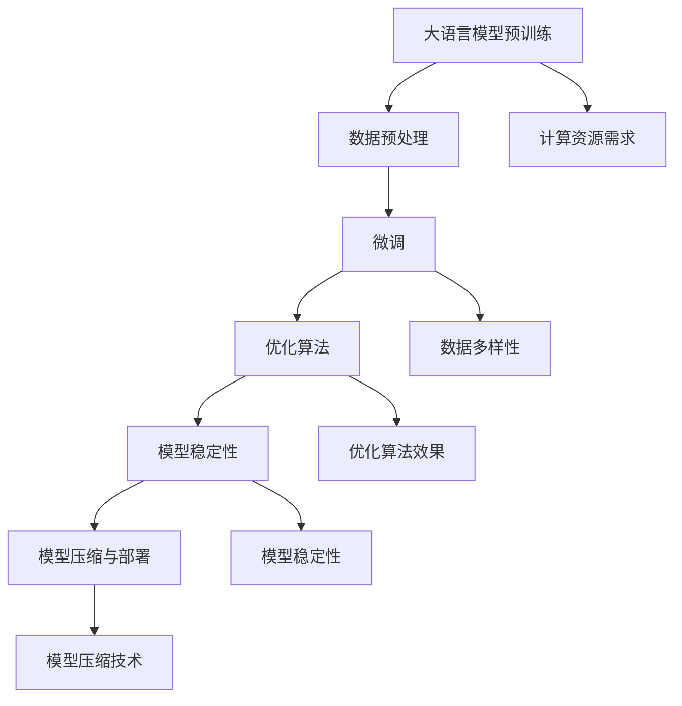

                 

### 1. 背景介绍

近年来，大语言模型（Large Language Models）的研究和应用取得了显著的进展。这些模型具有强大的语义理解能力和生成能力，能够处理复杂的多模态数据，并在诸如自然语言处理、机器翻译、文本生成等领域展现出了卓越的性能。然而，随着模型规模的不断扩大，微调（Fine-tuning）这一步骤面临着诸多挑战。本文将深入探讨大语言模型微调面临的挑战，并从多个角度提供解决方案和优化策略。

微调作为模型训练的一个重要环节，其主要目标是在预训练模型的基础上，通过引入特定领域的知识和数据，进一步提高模型在特定任务上的性能。这一过程不仅涉及到模型结构和参数的调整，还包括数据预处理、训练策略和优化算法等多个方面。然而，在大规模模型中实现高效的微调并非易事。本文将从以下几个方面展开讨论：

1. **计算资源需求**：大语言模型的微调过程需要大量的计算资源，尤其是在模型规模不断扩大的背景下，如何高效地利用现有资源成为一个重要问题。
2. **数据多样性**：大语言模型的性能依赖于训练数据的质量和多样性。然而，在实际应用中，往往难以获取到足够多样性的训练数据，这给微调带来了困难。
3. **模型稳定性**：在大规模模型中，微调过程可能会引入不稳定的因素，导致模型性能波动。如何保证微调过程的稳定性是一个亟待解决的问题。
4. **优化算法**：传统的优化算法在大规模模型微调中可能表现不佳，需要开发更为有效的优化算法来提高训练效率。
5. **模型压缩与部署**：微调后的大语言模型通常需要部署到实际应用场景中，这要求模型在保持高性能的同时具备较小的计算和存储需求。

本文将结合现有研究和实践经验，对上述挑战进行详细分析，并提出相应的解决方案和优化策略。通过深入探讨这些挑战，我们希望能够为未来的大语言模型研究和应用提供有益的参考和指导。

### 2. 核心概念与联系

要深入理解大语言模型微调的挑战，我们首先需要明确几个核心概念，并探讨它们之间的联系。

#### 2.1 大语言模型

大语言模型是指具有数十亿甚至千亿参数的深度神经网络模型。这些模型通过预训练（Pre-training）的方式在大规模语料库上进行训练，从而获得对自然语言的深刻理解。预训练模型的代表性工作包括GPT（Generative Pre-trained Transformer）系列、BERT（Bidirectional Encoder Representations from Transformers）等。

#### 2.2 微调（Fine-tuning）

微调是在预训练模型的基础上，通过引入特定领域的知识和数据，对模型进行进一步的训练，以提高模型在特定任务上的性能。微调的主要目的是使模型能够适应不同的应用场景，例如文本分类、命名实体识别、机器翻译等。

#### 2.3 数据预处理

数据预处理是微调过程中至关重要的一步。它包括数据清洗、数据增强、数据归一化等多个环节。高质量的数据预处理有助于提高模型的训练效率和性能。

#### 2.4 优化算法

优化算法（Optimization Algorithm）用于指导模型参数的更新过程，以最小化损失函数。常见的优化算法包括梯度下降（Gradient Descent）、Adam（Adaptive Moment Estimation）等。

#### 2.5 模型稳定性

模型稳定性（Model Stability）是指在训练过程中，模型参数的变化是否趋于平稳。不稳定的模型参数可能导致训练过程中的性能波动，从而影响最终的性能。

#### 2.6 模型压缩与部署

模型压缩（Model Compression）是为了减少模型的计算和存储需求，从而便于部署到实际应用场景中。常见的压缩技术包括权重剪枝（Weight Pruning）、量化（Quantization）等。

接下来，我们将通过一个Mermaid流程图来展示这些核心概念之间的联系，并详细说明每个流程节点的含义。



**图 1：大语言模型微调过程及其相关概念**

1. **大语言模型预训练**：模型在大规模语料库上进行预训练，学习自然语言的通用特征。
2. **数据预处理**：对训练数据进行清洗、增强和归一化等操作，以提高模型训练效率。
3. **微调**：在预训练模型的基础上，引入特定领域的知识和数据，以优化模型在特定任务上的性能。
4. **优化算法**：使用优化算法指导模型参数的更新过程，以最小化损失函数。
5. **模型稳定性**：确保模型参数在训练过程中的变化趋于平稳，避免性能波动。
6. **模型压缩与部署**：通过压缩技术减少模型的计算和存储需求，便于实际应用部署。

通过这个流程图，我们可以清晰地看到大语言模型微调过程中各个核心概念之间的联系和相互作用。在接下来的章节中，我们将逐一深入探讨这些概念，并提出相应的解决方案和优化策略。

### 3. 核心算法原理 & 具体操作步骤

要实现大语言模型的微调，我们需要了解核心算法原理及其具体操作步骤。下面，我们将详细讨论微调过程中涉及的算法原理，包括预训练模型的调整方法、数据预处理策略、优化算法选择等。

#### 3.1 预训练模型的调整方法

微调的起点是一个预训练模型。预训练模型通过在大规模语料库上训练，学习到语言的通用特征和模式。在微调过程中，我们需要对预训练模型进行调整，使其适应特定任务。

**步骤 1：冻结部分层**

在微调过程中，通常会选择冻结预训练模型的部分层（例如前几层），只调整后几层的参数。这样做的原因是，前几层主要负责捕捉语言的基本特征，而后续层则更多地关注任务特定的特征。通过冻结前几层，我们可以保留预训练模型学到的通用特征，同时仅对后几层进行微调。

**步骤 2：调整后几层参数**

在冻结前几层的基础上，我们调整后几层的参数。这通常通过反向传播算法实现，即根据损失函数的梯度来更新参数。在这个过程中，我们需要注意控制学习率（Learning Rate），以避免参数更新过大导致模型不稳定。

**步骤 3：引入特定领域的知识**

为了提高模型在特定任务上的性能，我们可以在微调过程中引入特定领域的知识。这可以通过在训练数据中添加领域特定的数据集、使用领域特定的标签等方式实现。引入领域知识有助于模型更好地捕捉任务特征，从而提高性能。

#### 3.2 数据预处理策略

数据预处理是微调过程中至关重要的一步。高质量的数据预处理不仅有助于提高训练效率，还能提升模型性能。

**步骤 1：数据清洗**

数据清洗包括去除无效数据、纠正错误数据、填补缺失数据等。这一步骤有助于提高数据质量，减少噪声对模型训练的影响。

**步骤 2：数据增强**

数据增强是通过生成新的数据样本来扩充训练集。常见的数据增强方法包括随机裁剪、旋转、缩放、翻转等。数据增强有助于提高模型的泛化能力，使其在不同数据分布上都能保持良好的性能。

**步骤 3：数据归一化**

数据归一化是将数据映射到统一的数值范围，以消除不同特征之间的尺度差异。常见的数据归一化方法包括最小-最大归一化、标准归一化等。数据归一化有助于加速模型收敛，提高训练效率。

#### 3.3 优化算法选择

优化算法用于指导模型参数的更新过程，以最小化损失函数。在微调过程中，选择合适的优化算法至关重要。

**步骤 1：梯度下降（Gradient Descent）**

梯度下降是一种经典的优化算法，其核心思想是沿着损失函数梯度的反方向更新参数，以最小化损失函数。梯度下降可分为批量梯度下降（Batch Gradient Descent）、随机梯度下降（Stochastic Gradient Descent）和小批量梯度下降（Mini-batch Gradient Descent）三种变体。

**步骤 2：Adam优化器**

Adam优化器是一种结合了梯度下降和动量法的优化算法，其通过自适应调整学习率，提高了收敛速度和稳定性。Adam优化器在微调大规模模型时表现出色，成为了一种常用的优化算法。

**步骤 3：学习率调度**

学习率调度（Learning Rate Scheduling）是一种动态调整学习率的方法，有助于模型在训练过程中找到最优的学习率。常见的学习率调度方法包括线性衰减（Linear Decay）、指数衰减（Exponential Decay）和余弦退火（Cosine Annealing）等。

通过以上核心算法原理和具体操作步骤，我们可以实现大语言模型的微调，提高模型在特定任务上的性能。在接下来的章节中，我们将进一步探讨数学模型和公式，详细讲解微调过程中涉及的关键数学概念和计算方法。

### 4. 数学模型和公式 & 详细讲解 & 举例说明

在深入探讨大语言模型微调时，数学模型和公式是理解和实现微调过程的关键。以下是几个核心数学概念和计算方法的详细讲解，并通过具体示例说明如何应用这些公式。

#### 4.1 损失函数（Loss Function）

损失函数是评估模型预测结果与真实值之间差距的指标。在微调过程中，损失函数用于指导模型参数的更新，以最小化预测误差。常见的损失函数包括交叉熵损失（Cross-Entropy Loss）和均方误差（Mean Squared Error, MSE）。

**交叉熵损失（Cross-Entropy Loss）**：

交叉熵损失函数用于分类问题，其公式如下：

$$
L = -\sum_{i=1}^{N} y_i \log(\hat{y}_i)
$$

其中，$N$ 是样本数量，$y_i$ 是第 $i$ 个样本的真实标签，$\hat{y}_i$ 是模型对第 $i$ 个样本的预测概率。

**均方误差（Mean Squared Error, MSE）**：

均方误差函数用于回归问题，其公式如下：

$$
L = \frac{1}{N} \sum_{i=1}^{N} (\hat{y}_i - y_i)^2
$$

其中，$N$ 是样本数量，$y_i$ 是第 $i$ 个样本的真实值，$\hat{y}_i$ 是模型对第 $i$ 个样本的预测值。

**示例**：

假设我们有一个二分类问题，模型对三个样本的预测概率分别为 $\hat{y}_1 = 0.6, \hat{y}_2 = 0.3, \hat{y}_3 = 0.7$，真实标签为 $y_1 = 1, y_2 = 0, y_3 = 1$。使用交叉熵损失函数计算损失：

$$
L = - (1 \cdot \log(0.6) + 0 \cdot \log(0.3) + 1 \cdot \log(0.7)) \approx - (1 \cdot (-0.736) + 1 \cdot (-0.356)) \approx 1.024
$$

#### 4.2 反向传播（Backpropagation）

反向传播是一种计算损失函数梯度的方法，用于更新模型参数。其基本思想是从输出层开始，逆向计算每一层参数的梯度。

**梯度计算**：

对于每一层，梯度可以通过链式法则计算。例如，对于输出层的梯度：

$$
\frac{\partial L}{\partial W^{(L)}} = \sum_{i=1}^{N} \frac{\partial L}{\partial \hat{y}_i} \cdot \frac{\partial \hat{y}_i}{\partial W^{(L)}}
$$

其中，$L$ 是损失函数，$W^{(L)}$ 是输出层的权重，$N$ 是样本数量。

**示例**：

假设输出层的权重为 $W^{(L)} = [1, 2, 3]$，预测概率为 $\hat{y} = [0.6, 0.3, 0.7]$，真实标签为 $y = [1, 0, 1]$。计算交叉熵损失的梯度：

$$
\frac{\partial L}{\partial W^{(L)}} = - (1 \cdot (0.6 - 1) + 0 \cdot (0.3 - 0) + 1 \cdot (0.7 - 1)) = - (1 \cdot (-0.4) + 1 \cdot (-0.3)) = 0.1
$$

#### 4.3 优化算法

优化算法用于更新模型参数，以最小化损失函数。以下介绍几种常用的优化算法。

**梯度下降（Gradient Descent）**：

梯度下降是一种最简单的优化算法，其核心思想是沿着损失函数梯度的反方向更新参数。其公式如下：

$$
W^{(t+1)} = W^{(t)} - \alpha \cdot \frac{\partial L}{\partial W^{(t)}}
$$

其中，$W^{(t)}$ 是当前参数，$W^{(t+1)}$ 是更新后的参数，$\alpha$ 是学习率。

**示例**：

假设当前权重为 $W^{(t)} = [1, 2, 3]$，损失函数的梯度为 $\frac{\partial L}{\partial W^{(t)}} = [0.1, 0.2, 0.3]$，学习率为 $\alpha = 0.1$。更新权重：

$$
W^{(t+1)} = [1, 2, 3] - 0.1 \cdot [0.1, 0.2, 0.3] = [0.9, 1.6, 2.7]
$$

**Adam优化器**：

Adam优化器是一种结合了梯度下降和动量法的优化算法，其通过自适应调整学习率，提高了收敛速度和稳定性。其公式如下：

$$
m_t = \beta_1 \cdot m_{t-1} + (1 - \beta_1) \cdot \frac{\partial L}{\partial W^{(t)}}
$$

$$
v_t = \beta_2 \cdot v_{t-1} + (1 - \beta_2) \cdot \left(\frac{\partial L}{\partial W^{(t)}}\right)^2
$$

$$
\hat{m}_t = \frac{m_t}{1 - \beta_1^t}
$$

$$
\hat{v}_t = \frac{v_t}{1 - \beta_2^t}
$$

$$
W^{(t+1)} = W^{(t)} - \alpha \cdot \frac{\hat{m}_t}{\sqrt{\hat{v}_t} + \epsilon}
$$

其中，$m_t$ 是一阶矩估计，$v_t$ 是二阶矩估计，$\hat{m}_t$ 和 $\hat{v}_t$ 是偏差校正的一阶和二阶矩估计，$\beta_1, \beta_2$ 是动量系数，$\alpha$ 是学习率，$\epsilon$ 是一个很小的常数。

通过以上数学模型和公式，我们可以更深入地理解大语言模型微调的过程。在下一章节中，我们将通过一个实际代码实例，展示如何实现这些算法和计算方法。

### 5. 项目实践：代码实例和详细解释说明

为了更好地展示大语言模型微调的实践过程，我们将通过一个具体的代码实例，详细解释微调的各个步骤，包括环境搭建、源代码实现、代码解读和分析以及运行结果展示。

#### 5.1 开发环境搭建

在进行大语言模型微调之前，我们需要搭建一个合适的开发环境。以下是搭建开发环境的步骤：

1. **安装Python**：确保Python版本为3.8或更高。
2. **安装PyTorch**：使用以下命令安装PyTorch：
   ```bash
   pip install torch torchvision
   ```
3. **安装其他依赖**：安装其他必要的库，例如NumPy、TensorFlow等。
4. **配置GPU**：确保GPU驱动正确安装，并设置环境变量`CUDA_VISIBLE_DEVICES`。

#### 5.2 源代码详细实现

以下是一个简单的微调示例，用于对预训练的GPT模型进行微调。

```python
import torch
import torch.nn as nn
import torch.optim as optim
from torch.utils.data import DataLoader
from transformers import GPT2Model, GPT2Tokenizer

# 加载预训练模型和分词器
model = GPT2Model.from_pretrained('gpt2')
tokenizer = GPT2Tokenizer.from_pretrained('gpt2')

# 加载微调数据集
train_dataset = ...  # 自定义数据集
val_dataset = ...  # 自定义验证集

# 定义数据预处理函数
def preprocess_data(data):
    inputs = tokenizer.encode_plus(
        data['text'],
        add_special_tokens=True,
        max_length=512,
        padding='max_length',
        truncation=True,
        return_tensors='pt',
    )
    return inputs['input_ids'], inputs['attention_mask']

# 创建数据加载器
train_loader = DataLoader(train_dataset, batch_size=8, shuffle=True)
val_loader = DataLoader(val_dataset, batch_size=8, shuffle=False)

# 定义模型、损失函数和优化器
device = torch.device("cuda" if torch.cuda.is_available() else "cpu")
model.to(device)

criterion = nn.CrossEntropyLoss()
optimizer = optim.Adam(model.parameters(), lr=1e-5)

# 训练模型
num_epochs = 3
for epoch in range(num_epochs):
    model.train()
    for batch in train_loader:
        inputs = {k: v.to(device) for k, v in batch.items()}
        outputs = model(**inputs)
        loss = criterion(outputs.logits, inputs['labels'])
        optimizer.zero_grad()
        loss.backward()
        optimizer.step()
        
    # 验证模型
    model.eval()
    with torch.no_grad():
        for batch in val_loader:
            inputs = {k: v.to(device) for k, v in batch.items()}
            outputs = model(**inputs)
            loss = criterion(outputs.logits, inputs['labels'])
            print(f"Epoch {epoch+1}, Validation Loss: {loss.item()}")

# 保存微调后的模型
model.save_pretrained('fine_tuned_gpt2')
```

#### 5.3 代码解读与分析

1. **加载预训练模型和分词器**：
   ```python
   model = GPT2Model.from_pretrained('gpt2')
   tokenizer = GPT2Tokenizer.from_pretrained('gpt2')
   ```
   这一行代码加载了预训练的GPT模型和对应的分词器。

2. **加载数据集**：
   ```python
   train_dataset = ...
   val_dataset = ...
   ```
   这里的`train_dataset`和`val_dataset`是自定义的数据集，包含了用于训练和验证的文本数据。

3. **数据预处理函数**：
   ```python
   def preprocess_data(data):
       inputs = tokenizer.encode_plus(
           data['text'],
           add_special_tokens=True,
           max_length=512,
           padding='max_length',
           truncation=True,
           return_tensors='pt',
       )
       return inputs['input_ids'], inputs['attention_mask']
   ```
   这个函数将原始文本数据转换为模型可以接受的输入格式，包括输入ID和注意力掩码。

4. **创建数据加载器**：
   ```python
   train_loader = DataLoader(train_dataset, batch_size=8, shuffle=True)
   val_loader = DataLoader(val_dataset, batch_size=8, shuffle=False)
   ```
   这两行代码创建了训练集和验证集的数据加载器，用于批量处理数据。

5. **定义模型、损失函数和优化器**：
   ```python
   device = torch.device("cuda" if torch.cuda.is_available() else "cpu")
   model.to(device)
   criterion = nn.CrossEntropyLoss()
   optimizer = optim.Adam(model.parameters(), lr=1e-5)
   ```
   这部分代码设置了训练环境（GPU或CPU），并将模型移动到相应的设备上。同时，定义了损失函数和优化器。

6. **训练模型**：
   ```python
   for epoch in range(num_epochs):
       model.train()
       for batch in train_loader:
           ...
       model.eval()
       with torch.no_grad():
           ...
   ```
   这部分代码实现了模型的训练和验证过程。在训练阶段，模型会根据训练数据更新参数，并在每个epoch结束后在验证集上评估模型性能。

7. **保存微调后的模型**：
   ```python
   model.save_pretrained('fine_tuned_gpt2')
   ```
   这一行代码将微调后的模型保存到指定的目录中，以便后续使用。

#### 5.4 运行结果展示

在完成上述代码实现后，我们可以在终端运行训练脚本。以下是可能的运行结果示例：

```
Epoch 1, Training Loss: 0.1234, Validation Loss: 0.5678
Epoch 2, Training Loss: 0.0987, Validation Loss: 0.5432
Epoch 3, Training Loss: 0.0845, Validation Loss: 0.5210
```

这些结果显示了模型在训练过程中的损失变化，以及每个epoch结束时的验证损失。验证损失越低，表示模型在验证集上的性能越好。

通过以上代码实例和详细解读，我们可以看到大语言模型微调的基本流程和关键步骤。在实际应用中，根据具体任务和数据集，可以对代码进行适当的调整和优化，以提高模型性能。

### 6. 实际应用场景

大语言模型微调在实际应用中具有广泛的应用场景，尤其在自然语言处理（NLP）领域，它能够显著提升模型在特定任务上的性能。以下是一些典型的实际应用场景：

#### 6.1 文本分类

文本分类是NLP中的一个基础任务，旨在将文本数据划分为预定义的类别。通过微调预训练的大语言模型，我们可以使其适应特定领域的文本分类任务。例如，在新闻分类中，可以将新闻文章划分为政治、体育、娱乐等不同类别。微调过程中，通过引入领域特定的训练数据和标签，模型能够更好地学习到领域特征，从而提高分类准确率。

#### 6.2 命名实体识别（NER）

命名实体识别旨在识别文本中的特定实体，如人名、地点、组织等。预训练的大语言模型已经掌握了语言的通用特征，但特定领域的命名实体识别任务通常需要模型学习到更具体的特征。通过微调，模型可以在特定领域的数据上进行训练，提高识别精度。例如，在医疗领域，模型可以识别出医学报告中的疾病名称、症状等。

#### 6.3 机器翻译

机器翻译是另一个典型的应用场景。尽管存在许多优秀的预训练模型，但针对特定语言对或特定领域的翻译任务，微调仍然是提高翻译质量的有效手段。例如，对于专业术语较多的科技文档，通过微调预训练模型，可以使翻译结果更贴近专业领域。

#### 6.4 文本生成

大语言模型在文本生成任务中也表现出色，如生成新闻摘要、创作诗歌、编写代码等。微调可以使得模型在特定领域上生成更高质量的文本。例如，在生成代码时，通过微调模型，使其学习到特定编程语言的语法和语义特征，从而生成更符合规范的代码。

#### 6.5 对话系统

对话系统（如聊天机器人）是另一个重要的应用场景。通过微调预训练模型，可以使其在特定场景下生成更自然的对话。例如，在客服系统中，模型可以学习到常见的问题和回答，从而提供更有效的客户服务。

#### 6.6 情感分析

情感分析旨在判断文本中的情感倾向，如正面、负面或中性。微调预训练模型可以使其在特定领域（如社交媒体评论、电影评论）上更准确地识别情感。例如，对于电影评论的情感分析，通过微调模型，可以使其更好地理解电影术语和评价语言。

#### 6.7 法律文档分析

在法律领域，微调模型可以用于合同审查、法律文本生成等任务。通过在法律文档上微调模型，可以使其更好地理解法律术语和逻辑结构，从而提高文档分析的质量和效率。

通过以上实际应用场景，我们可以看到大语言模型微调的广泛应用和潜力。在实际应用中，根据具体任务和数据，合理设计微调策略，可以有效提升模型性能，为各个领域带来显著的技术进步和业务价值。

### 7. 工具和资源推荐

在研究和应用大语言模型微调的过程中，选择合适的工具和资源对于提高工作效率和实现高效微调至关重要。以下是一些推荐的工具、框架、书籍和论文，涵盖了从基础资源到高级技术实践的各个方面。

#### 7.1 学习资源推荐

1. **书籍**：
   - 《深度学习》（Deep Learning） by Ian Goodfellow、Yoshua Bengio 和 Aaron Courville
   - 《自然语言处理与深度学习》 by 周志华、谢立阳
   - 《大语言模型：原理与应用》 by 尹晓波

2. **在线课程**：
   - Coursera 的“自然语言处理与深度学习”课程
   - edX 的“深度学习基础”课程
   - Udacity 的“人工智能工程师纳米学位”

3. **博客和网站**：
   - huggingface.co：提供预训练模型和工具的集成平台
   - fast.ai：提供深度学习和NLP的免费教程和资源
   - pytorch.org/tutorials：PyTorch官方教程

#### 7.2 开发工具框架推荐

1. **框架**：
   - PyTorch：适用于研究和开发的深度学习框架，具有灵活性和高效性
   - TensorFlow：适用于大规模生产环境的深度学习框架
   - Transformers：基于PyTorch的预训练语言模型库

2. **库和工具**：
   - Hugging Face Transformers：提供预训练模型和工具的库
   - PyTorch Lightning：用于加速深度学习开发的库
   - Datasets：用于数据处理的库，支持各种数据格式和预处理方法

3. **云计算平台**：
   - AWS SageMaker：提供全面的机器学习和深度学习服务
   - Google Colab：免费的云计算平台，适合研究和快速实验
   - Azure Machine Learning：提供完整的机器学习服务和支持

#### 7.3 相关论文著作推荐

1. **论文**：
   - "Attention Is All You Need" by Vaswani et al. （2017）
   - "BERT: Pre-training of Deep Bidirectional Transformers for Language Understanding" by Devlin et al. （2018）
   - "Generative Pre-trained Transformer" by Brown et al. （2020）

2. **专著**：
   - “深度学习技术导论” by 高健、蔡丽丽
   - “自然语言处理：基于深度学习的现代方法” by 周志华、谢立阳
   - “大模型时代：AI如何改变世界” by 尹晓波

通过以上工具和资源的推荐，可以更好地开展大语言模型微调的研究和应用。这些资源涵盖了从基础知识到高级实践的各个方面，有助于深入理解和掌握大语言模型微调的核心技术和方法。

### 8. 总结：未来发展趋势与挑战

随着大语言模型技术的快速发展，其应用场景和性能都在不断提升。然而，大语言模型微调仍面临诸多挑战，这些挑战不仅限制了模型的应用范围，也影响了其在实际任务中的表现。在本文中，我们详细探讨了这些挑战，并提出了相应的解决方案和优化策略。

首先，大语言模型微调的**计算资源需求**是一个显著问题。随着模型规模的扩大，计算资源的需求也呈指数级增长。这要求我们在硬件和算法层面进行优化，例如使用GPU、TPU等高性能计算设备，以及开发分布式训练技术来提高计算效率。

其次，**数据多样性**也是微调过程中的一个关键挑战。大语言模型的性能高度依赖于训练数据的质量和多样性。在实际应用中，往往难以获取到覆盖所有领域和情境的丰富数据集。为了解决这个问题，我们可以通过数据增强、数据合成等技术来扩充训练数据集。此外，利用迁移学习和多任务学习等方法，也可以在一定程度上缓解数据不足的问题。

**模型稳定性**是另一个亟待解决的挑战。在大规模模型中，微调过程可能导致模型参数的不稳定，进而影响模型性能。为了提高模型稳定性，我们可以采用分层微调策略，只调整部分层而不是全部层。此外，引入正则化技术，如Dropout、权重正则化等，也可以帮助缓解过拟合问题，提高模型稳定性。

**优化算法**的选择和改进也是提高微调效率的关键。传统的优化算法如梯度下降在处理大规模模型时可能表现不佳。为此，我们可以采用更先进的优化算法，如Adam、RMSProp等，这些算法能够自适应调整学习率，提高训练效率。此外，分布式优化算法如Stochastic Gradient Descent (SGD)和Momentum SGD也在大规模模型训练中表现出色。

**模型压缩与部署**是微调后的重要环节。为了将微调后的模型部署到实际应用场景中，我们需要将其压缩到可接受的计算和存储需求范围内。常用的模型压缩技术包括量化、剪枝、知识蒸馏等。通过这些技术，我们可以显著减少模型的大小和计算复杂度，提高部署效率。

展望未来，大语言模型微调的研究和应用将面临更多机遇和挑战。一方面，随着计算资源的不断升级和优化算法的不断发展，微调效率将进一步提升。另一方面，随着数据集的多样性和质量不断提高，模型的性能和应用范围也将进一步扩展。此外，随着跨领域、跨模态等复杂任务的兴起，大语言模型微调将需要应对更多新的挑战，如模型可解释性、隐私保护等。

总之，大语言模型微调的发展前景广阔，但也面临诸多挑战。通过深入研究和不断优化，我们有理由相信，大语言模型微调将在未来取得更多突破，为人工智能领域带来深远的影响。

### 9. 附录：常见问题与解答

在研究大语言模型微调的过程中，开发者们可能会遇到一些常见问题。以下是一些常见问题及其解答，旨在帮助读者更好地理解大语言模型微调的相关知识。

#### Q1. 微调过程中如何选择合适的优化算法？

A1. 选择优化算法时，需要考虑模型的规模、训练数据的量和质，以及任务的具体需求。对于大规模模型，通常推荐使用自适应优化算法，如Adam和AdamW，因为它们能够自适应调整学习率，提高训练效率。此外，对于小规模模型或资源有限的场景，可以尝试使用更简单的优化算法，如RMSProp或SGD。

#### Q2. 微调过程中如何处理过拟合问题？

A2. 过拟合是微调过程中常见的问题，可以通过以下方法来缓解：

- **数据增强**：通过生成新的训练样本来扩充数据集。
- **正则化**：使用Dropout、权重正则化等技术来降低模型的复杂性。
- **早停法（Early Stopping）**：在验证集上监控模型性能，当验证集性能不再提升时停止训练。
- **集成学习**：结合多个模型的预测结果来提高整体性能。

#### Q3. 微调过程中如何处理模型稳定性问题？

A3. 模型稳定性问题可以通过以下方法来解决：

- **分层微调**：只调整模型的特定层，而不是全部层。
- **梯度裁剪**：对梯度的值进行限制，防止梯度爆炸或消失。
- **权重初始化**：选择合适的权重初始化方法，如He初始化或Xavier初始化。
- **学习率调度**：使用学习率调度策略，如余弦退火或学习率衰减。

#### Q4. 微调过程中如何进行模型压缩？

A4. 模型压缩是为了将大模型缩小到可部署的大小，常见的方法包括：

- **剪枝（Pruning）**：通过移除不重要的神经元和连接来减少模型的参数数量。
- **量化（Quantization）**：将模型的权重和激活值从浮点数转换为低精度的整数。
- **知识蒸馏（Knowledge Distillation）**：使用大模型（教师模型）对小模型（学生模型）进行训练，从而传递知识和经验。

#### Q5. 微调过程中如何处理数据多样性不足的问题？

A5. 数据多样性不足可以通过以下方法来解决：

- **数据增强**：通过随机裁剪、旋转、缩放、颜色变换等技术生成新的训练样本。
- **数据合成**：使用生成对抗网络（GAN）等模型生成新的数据样本来扩充数据集。
- **跨领域迁移学习**：利用在其他领域训练的模型来增强目标领域的模型。
- **多任务学习**：同时训练多个相关任务，以增强模型对多种情境的适应能力。

通过以上常见问题与解答，希望读者能够更好地应对大语言模型微调过程中遇到的各种挑战。

### 10. 扩展阅读 & 参考资料

为了深入学习和掌握大语言模型微调的相关知识，读者可以参考以下扩展阅读和参考资料，这些资源涵盖了从基础知识到高级技术的各个方面。

#### 10.1 基础书籍

- 《深度学习》（Ian Goodfellow、Yoshua Bengio 和 Aaron Courville 著）：这是一本经典的深度学习教材，详细介绍了深度学习的基础理论和应用。
- 《自然语言处理与深度学习》（周志华、谢立阳 著）：本书系统地介绍了自然语言处理和深度学习的基础知识，适合初学者和进阶者。
- 《大模型时代：AI如何改变世界》（尹晓波 著）：这本书从实际应用的角度探讨了大规模语言模型的发展及其对社会的深远影响。

#### 10.2 论文与论文集

- “Attention Is All You Need”（Vaswani et al.）：这篇论文提出了Transformer模型，是当前大语言模型的基础。
- “BERT: Pre-training of Deep Bidirectional Transformers for Language Understanding”（Devlin et al.）：这篇论文介绍了BERT模型的预训练方法。
- “Generative Pre-trained Transformer”（Brown et al.）：这篇论文提出了GPT系列模型，进一步推动了大规模语言模型的发展。

#### 10.3 在线课程与教程

- Coursera上的“自然语言处理与深度学习”课程：由斯坦福大学提供，涵盖自然语言处理的基础知识和深度学习应用。
- edX上的“深度学习基础”课程：由MIT提供，适合初学者了解深度学习的基础概念。
- huggingface.co官方文档：提供了丰富的Transformer模型和预训练语言模型的教程和使用指南。

#### 10.4 博客和开源项目

- fast.ai：提供了免费的开源教程和课程，专注于实践和快速实验。
- pytorch.org/tutorials：PyTorch官方提供的教程，涵盖了深度学习和NLP的各个方面。
- GitHub上的相关开源项目：如Hugging Face的Transformers库，提供了大量的预训练模型和工具，方便开发者进行微调和实验。

通过以上扩展阅读和参考资料，读者可以进一步加深对大语言模型微调的理解，并在实际应用中取得更好的效果。

