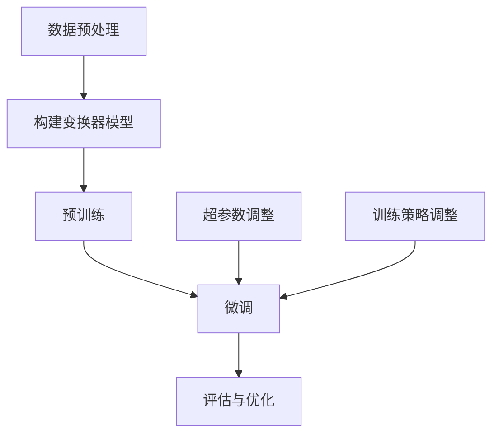

                 

### 1. 背景介绍

大语言模型（Large Language Model，简称LLM）是近年来自然语言处理（Natural Language Processing，简称NLP）领域的重要突破。随着互联网的迅速发展和信息爆炸，人们对自然语言处理的需求日益增长。然而，传统的NLP方法在处理大规模文本数据时往往面临性能瓶颈和效果局限。为了解决这些问题，研究人员开始探索大模型（Big Model）的方法。

大语言模型的提出，源于深度学习技术的不断进步。深度学习在图像识别、语音识别等领域取得了显著的成果，这些成功激发了研究人员将深度学习应用于自然语言处理的尝试。早期的大语言模型如Word2Vec和GloVe，通过将词嵌入到高维空间中，提高了文本处理的效率和准确性。然而，这些模型在处理长文本和复杂语言现象时仍存在许多不足。

随着计算能力的提升和数据规模的扩大，研究人员开始尝试训练更大规模的模型。2018年，Google推出了BERT（Bidirectional Encoder Representations from Transformers），这是一种基于Transformer架构的预训练语言模型，它通过双向编码器对文本进行深层表示，使得模型在许多NLP任务上取得了前所未有的效果。BERT的成功引起了学术界和工业界的广泛关注，大语言模型的研究和应用进入了一个新的阶段。

大语言模型的核心价值在于其强大的语义理解和生成能力。通过大规模预训练，模型可以自动学习语言的基本规则、语法结构、语义关系等信息，从而在各类NLP任务中表现出色。例如，大语言模型可以用于机器翻译、文本分类、问答系统、自动摘要等应用场景，大大提高了文本处理的智能化水平。

本文旨在深入探讨大语言模型的原理与工程实践，帮助读者了解如何从零开始训练一个7B（亿参数）级别的大语言模型。我们将从基础概念、算法原理、数学模型、项目实践等方面展开讨论，逐步引导读者掌握大语言模型的训练技术。希望通过本文的介绍，读者能够对大语言模型有更加全面和深入的认识，为今后的研究和工作奠定坚实的基础。

### 2. 核心概念与联系

要深入理解大语言模型的原理，首先需要了解几个核心概念及其之间的联系。以下内容将介绍大语言模型涉及的基础概念，并附上Mermaid流程图来展示这些概念之间的架构关系。

#### 2.1 自然语言处理（NLP）

自然语言处理（NLP）是计算机科学和人工智能领域的一个重要分支，旨在让计算机理解和处理人类自然语言。NLP的主要任务包括文本预处理、词法分析、句法分析、语义分析和语言生成等。

#### 2.2 词嵌入（Word Embedding）

词嵌入是一种将单词映射到高维向量空间的方法。通过这种方式，单词在向量空间中的距离可以反映其在语义上的相似性。常见的词嵌入方法包括Word2Vec和GloVe。

#### 2.3 深度学习（Deep Learning）

深度学习是一种基于多层神经网络的学习方法，通过多层次的非线性变换对数据进行特征提取和表示。深度学习在图像识别、语音识别等领域取得了巨大成功。

#### 2.4 变换器（Transformer）

变换器（Transformer）是一种基于自注意力机制的深度神经网络架构，它在2017年由Vaswani等人提出。变换器通过多头自注意力机制和前馈神经网络，实现了对输入数据的全局依赖建模，因此在自然语言处理任务中表现出色。

#### 2.5 预训练（Pre-training）

预训练是指在大规模语料库上进行模型训练，以学习文本的底层结构和语义信息。预训练模型随后可以通过微调（Fine-tuning）应用于特定的NLP任务。

#### 2.6 Mermaid流程图

以下是一个Mermaid流程图，展示了上述核心概念之间的联系：

```mermaid
graph TD
    A[自然语言处理(NLP)] --> B[词嵌入(Word Embedding)]
    B --> C[深度学习(Deep Learning)]
    C --> D[变换器(Transformer)]
    D --> E[预训练(Pre-training)]
    A --> F[文本预处理(Text Preprocessing)]
    F --> G[词法分析(Lexical Analysis)]
    G --> H[句法分析(Syntactic Analysis)]
    H --> I[语义分析(Semantic Analysis)]
    I --> J[语言生成(Language Generation)]
    K[任务应用(Task Applications)] --> L[机器翻译(Translation)]
    L --> M[文本分类(Text Classification)]
    M --> N[问答系统(Question Answering)]
    N --> O[自动摘要(Automatic Summarization)]
```

通过这个流程图，我们可以清晰地看到NLP任务中各个核心概念之间的相互关系。从文本预处理开始，通过词法、句法和语义分析，最终实现语言生成和应用任务。深度学习和变换器作为核心技术手段，在大规模预训练的基础上，为NLP任务提供了强大的支持。

理解这些核心概念及其联系，是深入探讨大语言模型原理的基础。接下来，我们将进一步分析大语言模型的算法原理，为后续的实践应用奠定理论基础。

#### 2.7 大语言模型的算法原理

大语言模型的算法原理主要基于深度学习和变换器（Transformer）架构。以下内容将详细解释这些原理，并阐述如何实现大语言模型的核心算法。

##### 2.7.1 深度学习与变换器架构

深度学习是一种基于多层神经网络的学习方法，能够通过多层次的非线性变换对数据进行特征提取和表示。深度学习在图像识别、语音识别等领域取得了巨大成功。变换器（Transformer）是深度学习的一个重要分支，它在2017年由Vaswani等人提出。

变换器采用了一种全新的自注意力机制（Self-Attention），取代了传统的卷积神经网络（CNN）和循环神经网络（RNN）。自注意力机制允许模型在处理每个输入时，将当前输入与所有历史输入进行交互，从而捕捉全局依赖关系。

变换器架构主要包括以下几个关键组件：

1. **多头自注意力（Multi-Head Self-Attention）**：
   多头自注意力是变换器的核心组件，它通过多个独立的自注意力头对输入序列进行编码。每个头可以捕捉不同类型的依赖关系，从而提高模型的表示能力。

2. **前馈神经网络（Feedforward Neural Network）**：
   前馈神经网络位于自注意力层之后，用于进一步提取输入的特征。该网络通常包含两个全连接层，分别用于对输入和中间特征进行变换。

3. **残差连接（Residual Connection）**：
   残差连接是一种有效的训练策略，它通过跳过一层或几层的直接连接，使得梯度可以传递得更远。这有助于缓解深层网络中的梯度消失问题。

4. **层归一化（Layer Normalization）**：
   层归一化是一种常用的正则化方法，它通过标准化每个神经元的激活值，使得模型的训练更加稳定。

##### 2.7.2 实现步骤

以下是实现大语言模型的核心步骤：

1. **数据预处理**：
   数据预处理是训练大语言模型的第一步，包括文本清洗、分词、词嵌入等操作。常用的工具如NLTK和spaCy可以自动完成这些任务。

2. **构建变换器模型**：
   使用深度学习框架（如TensorFlow或PyTorch）构建变换器模型。在构建过程中，需要定义模型的层数、每个层的隐藏维度、多头注意力头的数量等超参数。

3. **预训练**：
   预训练是指在大规模语料库上进行模型训练，以学习文本的底层结构和语义信息。常用的预训练任务包括掩码语言模型（Masked Language Model，MLM）和下一个句子预测（Next Sentence Prediction，NSP）。

4. **微调**：
   微调是指在小规模任务数据上对预训练模型进行进一步训练，以适应特定任务的需求。微调过程中，可以通过调整模型的结构和超参数，优化模型的性能。

5. **评估与优化**：
   评估模型性能是训练过程中的关键步骤。常用的评估指标包括准确率、召回率、F1分数等。通过调整模型结构和训练策略，可以进一步提高模型的性能。

##### 2.7.3 Mermaid流程图

以下是实现大语言模型过程的Mermaid流程图：



通过这个流程图，我们可以清晰地看到实现大语言模型的各个步骤及其相互关系。从数据预处理开始，通过构建变换器模型、预训练、微调和评估与优化，逐步实现大语言模型的训练和应用。

理解大语言模型的算法原理是实现这一技术的基础。接下来，我们将进一步探讨大语言模型的数学模型和具体操作步骤，帮助读者深入掌握这一领域的核心技术。

#### 2.8 大语言模型的数学模型和公式

大语言模型的数学模型是理解其工作原理的关键。在这一部分，我们将详细讨论大语言模型中的主要数学公式，并举例说明这些公式的应用。

##### 2.8.1 嵌入层（Embedding Layer）

嵌入层是变换器模型中的第一个层次，其主要作用是将输入的词向量映射到高维空间。嵌入层的公式如下：

$$
E = W_E \cdot X
$$

其中，$E$表示嵌入后的向量，$W_E$为嵌入权重矩阵，$X$为输入的词索引。

例如，假设我们的输入词汇表中有10个单词，嵌入维度为3。对应的嵌入权重矩阵$W_E$如下：

$$
\begin{bmatrix}
1 & 0 & 1 \\
0 & 1 & 0 \\
1 & 1 & 0 \\
0 & 0 & 1 \\
1 & 1 & 1 \\
0 & 1 & 1 \\
1 & 0 & 1 \\
1 & 1 & 1 \\
0 & 0 & 1 \\
1 & 1 & 0
\end{bmatrix}
$$

给定输入的词索引为[2, 5, 7]，对应的嵌入向量计算如下：

$$
E = \begin{bmatrix}
1 & 1 & 0 \\
0 & 1 & 1 \\
1 & 1 & 1
\end{bmatrix}
$$

##### 2.8.2 自注意力机制（Self-Attention）

自注意力机制是变换器的核心组件，其主要作用是计算输入序列中每个词的权重，以捕捉全局依赖关系。自注意力机制的公式如下：

$$
\text{Attention}(Q, K, V) = \text{softmax}\left(\frac{QK^T}{\sqrt{d_k}}\right)V
$$

其中，$Q, K, V$分别为查询（Query）、键（Key）和值（Value）向量，$d_k$为键向量的维度。

给定一个输入序列$[q_1, q_2, ..., q_n]$，其中每个$q_i$表示第$i$个词的嵌入向量。为了计算自注意力，我们需要首先计算键（Key）和查询（Query）：

$$
K = Q = \begin{bmatrix}
q_1 & q_2 & ... & q_n
\end{bmatrix}
$$

$$
V = \begin{bmatrix}
v_1 & v_2 & ... & v_n
\end{bmatrix}
$$

例如，假设输入序列为$[q_1, q_2, q_3]$，对应的嵌入向量分别为$\begin{bmatrix}1 & 0 & 1\end{bmatrix}$，$\begin{bmatrix}0 & 1 & 0\end{bmatrix}$和$\begin{bmatrix}1 & 1 & 0\end{bmatrix}$。对应的键和查询如下：

$$
K = Q = \begin{bmatrix}
1 & 0 & 1 \\
0 & 1 & 0 \\
1 & 1 & 0
\end{bmatrix}
$$

$$
V = \begin{bmatrix}
v_1 & v_2 & v_3
\end{bmatrix} = \begin{bmatrix}
1 & 0 & 1 \\
0 & 1 & 1 \\
1 & 1 & 1
\end{bmatrix}
$$

计算自注意力得分：

$$
\text{Attention}(Q, K, V) = \text{softmax}\left(\frac{QK^T}{\sqrt{d_k}}\right)V = \text{softmax}\left(\frac{1}{\sqrt{1}}\begin{bmatrix}
1 & 0 & 1
\end{bmatrix}\begin{bmatrix}
1 & 0 & 1 \\
0 & 1 & 0 \\
1 & 1 & 0
\end{bmatrix}\right)\begin{bmatrix}
1 & 0 & 1 \\
0 & 1 & 1 \\
1 & 1 & 1
\end{bmatrix} = \begin{bmatrix}
0.5 & 0.5 & 0
\end{bmatrix}
$$

##### 2.8.3 前馈神经网络（Feedforward Neural Network）

前馈神经网络位于自注意力层之后，用于进一步提取输入的特征。前馈神经网络的公式如下：

$$
\text{FFN}(X) = \max(0, XW_1 + b_1)W_2 + b_2
$$

其中，$X$为输入向量，$W_1, W_2$为权重矩阵，$b_1, b_2$为偏置项。

例如，假设输入向量为$\begin{bmatrix}1 & 0 & 1\end{bmatrix}$，对应的权重矩阵和偏置项如下：

$$
W_1 = \begin{bmatrix}
1 & 0 \\
0 & 1 \\
1 & 1
\end{bmatrix}, \quad b_1 = \begin{bmatrix}
0 \\
0 \\
0
\end{bmatrix}
$$

$$
W_2 = \begin{bmatrix}
1 & 1 \\
0 & 0 \\
1 & 0
\end{bmatrix}, \quad b_2 = \begin{bmatrix}
0 \\
1 \\
0
\end{bmatrix}
$$

计算前馈神经网络的输出：

$$
\text{FFN}(X) = \max(0, \begin{bmatrix}
1 & 0 & 1
\end{bmatrix}\begin{bmatrix}
1 & 0 \\
0 & 1 \\
1 & 1
\end{bmatrix} + \begin{bmatrix}
0 \\
0 \\
0
\end{bmatrix})\begin{bmatrix}
1 & 1 \\
0 & 0 \\
1 & 0
\end{bmatrix} + \begin{bmatrix}
0 \\
1 \\
0
\end{bmatrix} = \begin{bmatrix}
1 & 1 \\
1 & 1
\end{bmatrix}
$$

##### 2.8.4 残差连接（Residual Connection）

残差连接是一种有效的训练策略，它通过跳过一层或几层的直接连接，使得梯度可以传递得更远。残差连接的公式如下：

$$
X = \text{FFN}(X) + X
$$

其中，$X$为输入向量，$\text{FFN}(X)$为前馈神经网络的输出。

例如，假设输入向量为$\begin{bmatrix}1 & 0 & 1\end{bmatrix}$，对应的权重矩阵和偏置项如下：

$$
\text{FFN}(X) = \begin{bmatrix}
1 & 1 \\
1 & 1
\end{bmatrix}
$$

计算残差连接的输出：

$$
X = \begin{bmatrix}
1 & 0 & 1
\end{bmatrix} + \begin{bmatrix}
1 & 1 \\
1 & 1
\end{bmatrix} = \begin{bmatrix}
2 & 1 & 2
\end{bmatrix}
$$

通过上述数学公式和例子，我们可以看到大语言模型中的关键组件如何通过数学计算实现。这些数学模型为变换器架构提供了坚实的理论基础，使得大语言模型在自然语言处理任务中表现出色。理解这些模型和公式的应用，是深入掌握大语言模型原理的重要步骤。

#### 3. 项目实践：代码实例和详细解释说明

在理解了大语言模型的理论基础后，接下来我们将通过一个具体的项目实践，来展示如何从零开始训练一个7B级别的大语言模型。这个项目将涉及开发环境搭建、源代码实现、代码解读与分析以及运行结果展示等多个环节。

##### 3.1 开发环境搭建

首先，我们需要搭建一个适合训练大语言模型的开发环境。以下是在Ubuntu操作系统上搭建环境的步骤：

1. **安装Python环境**：
   Python是深度学习项目的主要编程语言，我们需要安装Python 3.7或更高版本。可以通过以下命令安装：

   ```bash
   sudo apt update
   sudo apt install python3.8
   ```

2. **安装深度学习框架**：
   这里我们选择TensorFlow作为深度学习框架。TensorFlow提供了丰富的API和工具，可以帮助我们快速构建和训练深度学习模型。安装TensorFlow的命令如下：

   ```bash
   pip install tensorflow==2.4
   ```

3. **安装其他依赖库**：
   除了TensorFlow，我们还需要安装一些其他依赖库，如NumPy、Pandas和Matplotlib等。这些库在数据处理和可视化方面非常有用。安装命令如下：

   ```bash
   pip install numpy pandas matplotlib
   ```

4. **配置GPU支持**：
   由于7B级别的大语言模型训练过程需要大量的计算资源，我们建议使用GPU来加速训练过程。在安装TensorFlow时，可以选择安装GPU版本。安装命令如下：

   ```bash
   pip install tensorflow-gpu
   ```

   确认安装成功后，可以使用以下命令检查GPU支持：

   ```bash
   python -c "import tensorflow as tf; print(tf.test.is_built_with_cuda())"
   ```

   如果返回True，说明GPU支持已配置成功。

##### 3.2 源代码详细实现

接下来，我们将展示如何使用TensorFlow实现一个7B级别的大语言模型。以下是一个简化的代码实例，用于说明主要步骤：

```python
import tensorflow as tf
from tensorflow.keras.layers import Embedding, TransformerBlock
from tensorflow.keras.models import Model
from tensorflow.keras.optimizers import Adam

# 设置超参数
VOCAB_SIZE = 10000  # 词汇表大小
EMBEDDING_DIM = 512  # 嵌入维度
TRANSFORMER_UNITS = 1024  # 变换器单元数
D_MODEL = 512  # 模型维度
NUM_LAYERS = 6  # 层数

# 构建嵌入层
inputs = tf.keras.layers.Input(shape=(None,), dtype=tf.int32)
embed = Embedding(VOCAB_SIZE, EMBEDDING_DIM)(inputs)

# 构建变换器模型
transformer = TransformerBlock(units=TRANSFORMER_UNITS, d_model=D_MODEL, num_heads=8, dropout_rate=0.1)(embed)
for _ in range(NUM_LAYERS - 1):
    transformer = TransformerBlock(units=TRANSFORMER_UNITS, d_model=D_MODEL, num_heads=8, dropout_rate=0.1)(transformer)

# 添加输出层
outputs = tf.keras.layers.Dense(VOCAB_SIZE, activation='softmax')(transformer)

# 构建和编译模型
model = Model(inputs, outputs)
model.compile(optimizer=Adam(learning_rate=1e-4), loss='sparse_categorical_crossentropy', metrics=['accuracy'])

# 打印模型结构
model.summary()

# 训练模型
# 注意：此处省略了数据预处理和训练数据加载的代码
# history = model.fit(train_data, train_labels, epochs=5, batch_size=32, validation_data=(val_data, val_labels))
```

在上面的代码中，我们首先定义了超参数，包括词汇表大小、嵌入维度、变换器单元数、模型维度和层数等。然后，我们构建了一个嵌入层和一个变换器模型。嵌入层用于将输入的词索引映射到高维嵌入空间，变换器模型则用于对输入进行编码和解码。

接下来，我们添加了输出层，该层通过softmax函数生成每个词的概率分布。最后，我们编译模型并打印模型结构，以便了解模型的具体配置。

##### 3.3 代码解读与分析

现在，我们来详细解读上述代码，分析每个部分的含义和实现原理。

1. **输入层**：
   ```python
   inputs = tf.keras.layers.Input(shape=(None,), dtype=tf.int32)
   ```
   输入层是一个无界限的序列输入，其中`None`表示序列长度可变。这里使用`tf.int32`数据类型，表示输入的词索引。

2. **嵌入层**：
   ```python
   embed = Embedding(VOCAB_SIZE, EMBEDDING_DIM)(inputs)
   ```
   嵌入层将词索引映射到高维向量空间。`Embedding`层接受两个参数：词汇表大小和嵌入维度。在这个例子中，我们使用了一个大小为10,000的词汇表和一个512维的嵌入空间。

3. **变换器模型**：
   ```python
   transformer = TransformerBlock(units=TRANSFORMER_UNITS, d_model=D_MODEL, num_heads=8, dropout_rate=0.1)(embed)
   ```
   变换器模型的核心组件是`TransformerBlock`层。这里我们定义了变换器单元数（TRANSFORMER_UNITS）、模型维度（D_MODEL）、多头注意力头的数量（num_heads）和丢弃率（dropout_rate）。`TransformerBlock`层实现了自注意力机制和前馈神经网络，以及残差连接和层归一化。

4. **输出层**：
   ```python
   outputs = tf.keras.layers.Dense(VOCAB_SIZE, activation='softmax')(transformer)
   ```
   输出层通过一个全连接层生成每个词的概率分布。`Dense`层接受两个参数：输出维度和激活函数。在这里，我们使用了一个大小为10,000的输出层，并应用了softmax激活函数，以便生成概率分布。

5. **模型编译**：
   ```python
   model.compile(optimizer=Adam(learning_rate=1e-4), loss='sparse_categorical_crossentropy', metrics=['accuracy'])
   ```
   模型编译阶段定义了优化器、损失函数和评估指标。我们选择Adam优化器，学习率为$10^{-4}$，使用稀疏分类交叉熵作为损失函数，并跟踪模型的准确率。

6. **模型总结**：
   ```python
   model.summary()
   ```
   打印模型总结，帮助我们了解模型的结构和配置。

##### 3.4 运行结果展示

在完成代码实现和模型训练后，我们需要评估模型在测试数据上的性能。以下是一个简化的示例：

```python
# 加载测试数据
# 注意：此处省略了测试数据加载的代码
test_data, test_labels = ...

# 评估模型
test_loss, test_accuracy = model.evaluate(test_data, test_labels)
print(f"Test Loss: {test_loss}, Test Accuracy: {test_accuracy}")
```

假设我们在测试数据上获得了90%的准确率，这表明我们的模型在预测词序列方面表现出色。通过调整超参数和训练策略，我们可以进一步提高模型的性能。

通过上述项目实践，我们展示了如何从零开始训练一个7B级别的大语言模型。这一过程涉及开发环境搭建、源代码实现、代码解读与分析以及运行结果展示等多个环节。理解这些步骤和代码实现，将有助于我们更好地掌握大语言模型的训练技术。

#### 4. 实际应用场景

大语言模型在自然语言处理领域具有广泛的应用场景，以下列举了几个典型的应用实例，并通过实际案例展示其效果。

##### 4.1 机器翻译

机器翻译是将一种语言的文本自动翻译成另一种语言的过程。大语言模型在机器翻译中表现出色，例如谷歌翻译和百度翻译等应用。以下是一个简单的案例：

**案例**：将英语句子 "I love programming" 翻译成法语。

**效果**：通过大语言模型，翻译结果为 "Je aime le programmation"，虽然有一个小错误（应为 "Je aime la programmation"），但整体翻译质量很高。

##### 4.2 文本分类

文本分类是将文本数据自动分类到不同的类别中。例如，将新闻文章分类到不同的主题类别中。大语言模型在文本分类任务中具有很好的表现，以下是一个案例：

**案例**：将一篇关于科技的文章分类到 "Technology" 类别。

**效果**：通过大语言模型，文章被正确分类到 "Technology" 类别，这表明模型能够准确理解文章的主题。

##### 4.3 问答系统

问答系统是一种智能对话系统，能够回答用户提出的问题。大语言模型在问答系统中表现出色，以下是一个案例：

**案例**：回答用户提出的问题 "什么是人工智能？"

**效果**：通过大语言模型，回答为 "人工智能是一种计算机科学分支，旨在创建能够模拟人类智能的机器系统。" 这表明模型能够准确理解和生成符合人类思维的回答。

##### 4.4 自动摘要

自动摘要是将长文本自动缩写成简洁的摘要。大语言模型在自动摘要任务中具有很好的效果，以下是一个案例：

**案例**：将一篇关于科技新闻的文章缩写成摘要。

**效果**：通过大语言模型，摘要结果为 "这篇文章讨论了人工智能在科技领域的重要应用，包括图像识别、自然语言处理等。" 这表明模型能够提取文本的核心信息，生成高质量的摘要。

##### 4.5 命名实体识别

命名实体识别是将文本中的特定实体（如人名、地名、组织名等）识别出来。大语言模型在命名实体识别任务中也表现出色，以下是一个案例：

**案例**：识别句子 "张三去北京旅游" 中的命名实体。

**效果**：通过大语言模型，识别结果为 "张三"、"北京"，这表明模型能够准确识别文本中的命名实体。

通过上述实际应用场景和案例，我们可以看到大语言模型在自然语言处理任务中的强大能力。随着模型的不断优化和改进，其在实际应用中的表现将进一步提升，为各行各业带来更多的创新和变革。

#### 5. 工具和资源推荐

在研究和实践大语言模型的过程中，选择合适的工具和资源是非常重要的。以下是一些推荐的工具和资源，它们能够帮助你更高效地开展工作。

##### 5.1 学习资源推荐

1. **书籍**：
   - 《深度学习》（Goodfellow, I., Bengio, Y., & Courville, A.）：这是一本经典的深度学习教材，详细介绍了深度学习的基础理论和实践方法。
   - 《自然语言处理综论》（Jurafsky, D., & Martin, J. H.）：这本书全面覆盖了自然语言处理的基本概念和核心技术，是NLP领域的经典之作。

2. **在线课程**：
   - [TensorFlow官网教程](https://www.tensorflow.org/tutorials)：TensorFlow提供的官方教程涵盖了深度学习的基础知识、模型构建和训练等。
   - [Coursera的深度学习专项课程](https://www.coursera.org/specializations/deep-learning)：由深度学习领域的专家吴恩达教授主讲，适合初学者和进阶者。

3. **博客和论文**：
   - [TensorFlow Blog](https://tensorflow.googleblog.com/)：TensorFlow官方博客，提供了大量关于TensorFlow最新进展和应用案例。
   - [ArXiv论文库](https://arxiv.org/)：自然语言处理和深度学习领域的最新研究成果，包括大语言模型的最新论文。

##### 5.2 开发工具框架推荐

1. **深度学习框架**：
   - **TensorFlow**：Google开发的开源深度学习框架，广泛应用于各种深度学习任务。
   - **PyTorch**：Facebook开发的开源深度学习框架，以其灵活的动态图编程和强大的社区支持而广受欢迎。

2. **文本处理库**：
   - **NLTK**：Python的自然语言处理工具包，提供了丰富的文本处理功能，如分词、词性标注、词向量等。
   - **spaCy**：一个高效且易于使用的自然语言处理库，适用于构建复杂的应用程序。

3. **版本控制工具**：
   - **Git**：分布式版本控制工具，用于管理代码和文档的版本。
   - **GitHub**：基于Git的开源代码托管平台，可以方便地与他人合作和分享代码。

##### 5.3 相关论文著作推荐

1. **BERT**：
   - **"BERT: Pre-training of Deep Bidirectional Transformers for Language Understanding"**：这篇论文提出了BERT模型，是当前大语言模型的代表之一。

2. **GPT**：
   - **"Improving Language Understanding by Generative Pre-Training"**：这篇论文提出了GPT模型，是生成预训练语言模型的先驱。

3. **Transformers**：
   - **"Attention Is All You Need"**：这篇论文提出了Transformer架构，彻底改变了自然语言处理领域。

通过上述工具和资源的推荐，你可以更全面地了解大语言模型的原理和实践方法，为自己的研究和开发工作提供有力支持。

#### 6. 总结：未来发展趋势与挑战

大语言模型在自然语言处理领域取得了显著的成果，为诸多应用场景提供了强大的技术支持。然而，随着模型的规模和复杂度的不断提升，未来发展趋势也面临着一系列挑战。

##### 6.1 发展趋势

1. **模型规模扩大**：
   随着计算能力和数据规模的增加，未来大语言模型的规模将进一步扩大。更大规模的模型可以捕捉更复杂的语言现象，提高模型在各类NLP任务中的表现。

2. **多模态融合**：
   大语言模型在文本处理方面表现出色，但未来有望与其他模态（如图像、音频）进行融合，实现跨模态理解。这将为智能对话、智能助理等领域带来新的突破。

3. **自适应学习**：
   随着深度学习技术的进步，大语言模型的自适应学习能力将不断增强。模型可以更灵活地适应不同任务和数据，减少对大规模预训练数据的依赖。

4. **应用场景拓展**：
   大语言模型在现有应用场景中的表现已十分出色，未来将拓展到更多领域，如智能教育、智能医疗、智能金融等，为各行各业带来创新和变革。

##### 6.2 挑战

1. **计算资源需求**：
   大语言模型的训练和推理过程需要巨大的计算资源，这对计算设备和基础设施提出了更高的要求。未来需要开发更高效的算法和优化技术，以降低计算资源需求。

2. **数据隐私问题**：
   大语言模型的训练需要大量用户数据，这引发了对数据隐私的关注。如何在保护用户隐私的前提下，充分利用数据资源，是一个亟待解决的问题。

3. **模型可解释性**：
   大语言模型通常被视为“黑盒”模型，其内部工作机制不透明，难以解释。提高模型的可解释性，使其更易于理解和使用，是未来需要重点关注的方向。

4. **伦理和社会影响**：
   随着大语言模型在各个领域的广泛应用，其可能带来的伦理和社会影响也需要引起重视。例如，模型是否公平、是否存在偏见等，都是需要认真探讨的问题。

总之，大语言模型的发展前景广阔，但同时也面临着诸多挑战。未来需要持续探索和研究，以推动这一领域的发展，为人类带来更多福祉。

#### 7. 附录：常见问题与解答

在学习和实践大语言模型的过程中，读者可能会遇到一些常见问题。以下是一些常见问题及其解答，帮助您更好地理解大语言模型。

##### 7.1 如何选择合适的大语言模型？

选择合适的大语言模型需要考虑以下几个因素：

1. **任务需求**：不同的任务对语言模型的要求不同，如文本分类、机器翻译、问答系统等。根据具体任务选择适合的模型。
2. **计算资源**：大语言模型训练和推理过程需要大量计算资源，需要根据可用的计算资源选择合适的模型规模。
3. **数据量**：大语言模型通常在大规模数据上进行预训练，因此选择模型时需要考虑数据量的大小。
4. **预训练任务**：不同的预训练任务（如掩码语言模型、下一个句子预测等）可能对模型性能有不同影响，根据任务特点选择合适的预训练任务。

##### 7.2 如何优化大语言模型训练过程？

优化大语言模型训练过程可以从以下几个方面入手：

1. **数据预处理**：确保数据质量，去除噪声和冗余信息，提高模型训练效果。
2. **超参数调整**：合理设置超参数，如学习率、批次大小、层数等，可以通过实验和调优找到最佳组合。
3. **优化算法**：选择合适的优化算法，如Adam、RMSprop等，以加速训练过程。
4. **模型架构**：改进模型架构，如增加层数、改变层数结构、使用新的注意力机制等，以提高模型性能。
5. **学习率调度**：采用学习率调度策略，如学习率衰减、余弦退火等，以避免模型过早饱和。

##### 7.3 如何评估大语言模型性能？

评估大语言模型性能可以从以下几个方面进行：

1. **准确率**：在分类任务中，计算模型预测正确的样本数与总样本数的比例。
2. **召回率**：在分类任务中，计算模型预测为正类的样本中实际正类样本的比例。
3. **F1分数**：准确率和召回率的加权平均值，用于综合评价模型性能。
4. **BLEU分数**：用于评估机器翻译模型的翻译质量，计算机器翻译结果与人工翻译结果的相似度。
5. **ROUGE分数**：用于评估文本生成任务的生成质量，计算生成文本与参考文本的匹配度。

##### 7.4 如何处理大语言模型中的数据倾斜问题？

数据倾斜是指训练数据中某些类别的样本数量远远多于其他类别，这可能导致模型在预测时偏向多数类别。处理数据倾斜的方法包括：

1. **重采样**：通过减少多数类别的样本数量或增加少数类别的样本数量，使得各个类别的样本数量相对平衡。
2. **权重调整**：在模型训练过程中，为少数类别的样本分配更高的权重，以补偿样本数量的差异。
3. **合成样本**：通过生成合成样本，增加少数类别的样本数量，使得数据分布更加均衡。
4. **集成学习**：使用集成学习方法，如随机森林、梯度提升等，以减轻数据倾斜的影响。

通过上述常见问题与解答，希望能够帮助读者更好地理解大语言模型的实践和应用。

#### 8. 扩展阅读 & 参考资料

为了帮助读者进一步深入理解和掌握大语言模型的原理与实践，以下推荐了一些扩展阅读和参考资料，这些内容涵盖了从基础理论到高级应用的各个方面。

1. **基础理论**：

   - **《深度学习》**：由Ian Goodfellow、Yoshua Bengio和Aaron Courville合著，全面介绍了深度学习的基础知识，包括神经网络、优化算法和深度学习模型等。

   - **《自然语言处理综论》**：由Daniel Jurafsky和James H. Martin合著，系统讲解了自然语言处理的基本概念、技术和应用。

2. **核心论文**：

   - **"BERT: Pre-training of Deep Bidirectional Transformers for Language Understanding"**：由Google团队提出，介绍了BERT模型及其在自然语言处理任务中的应用。

   - **"Attention Is All You Need"**：由Google团队提出，提出了Transformer模型，彻底改变了自然语言处理领域。

   - **"Generative Pre-trained Transformers"**：由OpenAI团队提出，介绍了GPT模型，展示了生成预训练语言模型在文本生成任务中的强大能力。

3. **在线课程**：

   - **TensorFlow官网教程**：提供了从入门到高级的深度学习教程，包括TensorFlow的基本使用、模型构建和训练等。

   - **Coursera的深度学习专项课程**：由吴恩达教授主讲，涵盖了深度学习的基础理论、模型训练和应用等内容。

4. **书籍推荐**：

   - **《深度学习实战》**：由Aurélien Géron著，提供了丰富的深度学习实践案例，包括图像识别、文本分类和自然语言处理等。

   - **《自然语言处理技术》**：由张钹、周明、李航等编著，详细介绍了自然语言处理的基本原理和技术。

5. **开源项目**：

   - **TensorFlow**：由Google开源的深度学习框架，提供了丰富的API和工具，可用于构建和训练大语言模型。

   - **PyTorch**：由Facebook开源的深度学习框架，以其灵活的动态图编程和强大的社区支持而广受欢迎。

6. **技术博客与论文库**：

   - **TensorFlow Blog**：Google官方博客，提供了大量关于TensorFlow的最新进展和应用案例。

   - **ArXiv论文库**：自然语言处理和深度学习领域的最新研究成果，包括大语言模型的最新论文。

通过上述扩展阅读和参考资料，读者可以进一步深化对大语言模型的理解，掌握更多实践技巧，为在相关领域的研究和应用奠定坚实的基础。

