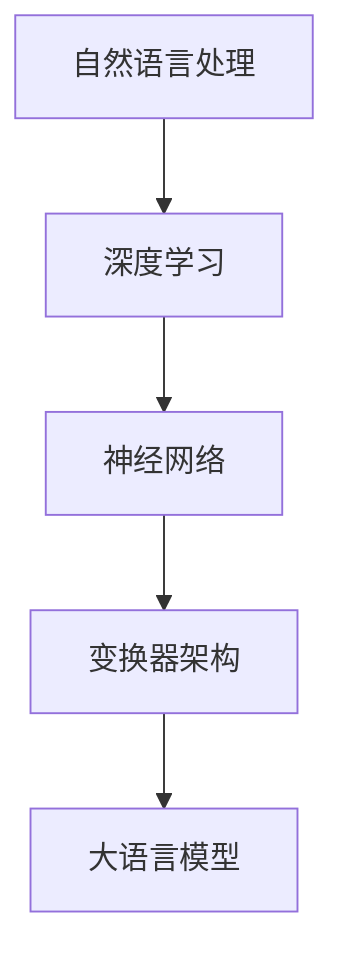

                 

### 1. 背景介绍

大语言模型（Large Language Models，简称LLMs）是人工智能领域的一项前沿技术，近年来在自然语言处理（Natural Language Processing，简称NLP）中取得了显著成果。随着深度学习（Deep Learning）和神经网络（Neural Networks）的不断发展，大语言模型逐渐成为自然语言处理任务中的核心组件。

语言模型是用于预测下一个单词或字符的概率分布的算法。传统语言模型主要基于统计方法，如N元语法（N-gram Model），通过计算历史字符序列的概率来预测下一个字符。然而，这种方法存在明显的局限性，难以处理复杂的语义和上下文信息。

近年来，随着神经网络和深度学习的兴起，神经网络语言模型（Neural Language Models）逐渐取代了传统统计模型。其中，基于变换器架构（Transformer Architecture）的大语言模型表现尤为出色。典型的代表包括OpenAI的GPT（Generative Pretrained Transformer）系列模型和Google的BERT（Bidirectional Encoder Representations from Transformers）模型。

大语言模型的应用范围广泛，从机器翻译、文本分类、信息提取到对话系统、文本生成等，都取得了显著的进展。这些模型在处理海量文本数据方面具有强大的能力，能够自动学习语言模式和结构，从而提高自然语言处理任务的性能。

### 2. 核心概念与联系

在深入了解大语言模型的原理之前，我们需要先了解一些核心概念，包括自然语言处理、深度学习、神经网络和变换器架构。

#### 2.1 自然语言处理（NLP）

自然语言处理是计算机科学和人工智能领域的一个分支，旨在使计算机能够理解和处理人类语言。NLP的目标包括文本分类、信息提取、情感分析、机器翻译、文本生成等。

#### 2.2 深度学习（Deep Learning）

深度学习是一种人工智能领域的重要技术，通过多层神经网络模型对数据进行建模和学习，从而实现复杂任务的自动化。深度学习在图像识别、语音识别、自然语言处理等领域取得了显著成果。

#### 2.3 神经网络（Neural Networks）

神经网络是模仿生物大脑神经元连接和功能的一种计算模型。神经网络由多个层组成，包括输入层、隐藏层和输出层。通过学习大量数据，神经网络可以自动提取特征并完成任务。

#### 2.4 变换器架构（Transformer Architecture）

变换器架构是一种基于自注意力机制（Self-Attention Mechanism）的神经网络模型，最初由Vaswani等人在2017年提出。变换器架构在处理序列数据方面表现出色，尤其是长序列，从而在大语言模型中得到了广泛应用。

下面是一个简化的Mermaid流程图，展示大语言模型的核心概念和联系：



### 3. 核心算法原理 & 具体操作步骤

#### 3.1 变换器架构的基本原理

变换器架构的核心是自注意力机制（Self-Attention Mechanism），它允许模型在处理序列数据时关注不同位置的信息。自注意力机制通过计算序列中每个元素与其余元素的相关性，从而为每个元素分配一个权重，最终将序列映射到一个新的空间。

变换器架构由多个层组成，包括编码器（Encoder）和解码器（Decoder）。编码器将输入序列编码为一系列隐藏状态，而解码器则利用编码器生成的隐藏状态生成输出序列。

#### 3.2 大语言模型的工作流程

大语言模型通常由以下步骤组成：

1. **预处理**：对输入文本进行分词、去停用词、词干提取等预处理操作，将文本转换为模型可处理的序列数据。

2. **编码器**：将预处理后的输入序列通过编码器处理，生成一系列隐藏状态。编码器的输出用于后续的解码过程。

3. **解码器**：利用编码器的输出和解码器自身的隐藏状态，逐步生成输出序列。在解码过程中，解码器会关注编码器生成的隐藏状态，从而学习如何生成下一个单词或字符。

4. **预测**：解码器生成输出序列后，通过损失函数（如交叉熵损失函数）评估预测结果与真实结果的差距，然后利用反向传播算法更新模型参数。

#### 3.3 具体操作步骤

以下是使用Python和PyTorch实现一个简单的大语言模型的基本步骤：

1. **安装依赖**：首先，确保安装了Python、PyTorch和其他必要的库，如torchtext、torchvision等。

2. **数据准备**：下载一个文本数据集，如维基百科，并对其进行预处理。

3. **构建模型**：定义一个变换器架构的编码器和解码器模型。

4. **训练模型**：将预处理后的数据输入模型，通过优化算法（如Adam）训练模型。

5. **评估模型**：使用训练集和测试集评估模型的性能。

6. **生成文本**：利用训练好的模型生成文本。

下面是一个简单的代码示例：

```python
import torch
import torch.nn as nn
import torch.optim as optim
from torchtext.data import Field, TabularDataset

# 数据准备
TEXT = Field(tokenize='spacy', tokenizer_language='en_core_web_sm', include_lengths=True)
train_data, valid_data = TabularDataset.splits(path='data', train='train.txt', validation='valid.txt', format='csv', fields=[('text', TEXT)])

# 构建模型
enc = nn.TransformerEncoder(nn.TransformerEncoderLayer(d_model=512, nhead=8), num_layers=3)
dec = nn.TransformerDecoder(nn.TransformerDecoderLayer(d_model=512, nhead=8), num_layers=3, src_key_padding_mask=True)
model = nn.Transformer(d_model=512, nhead=8, num_encoder_layers=3, num_decoder_layers=3)

# 训练模型
optimizer = optim.Adam(model.parameters(), lr=0.001)
criterion = nn.CrossEntropyLoss()

for epoch in range(10):
    model.train()
    for batch in train_data:
        optimizer.zero_grad()
        output = model(batch.text.t().to(device), batch.text.t().to(device))
        loss = criterion(output, batch.label.t().to(device))
        loss.backward()
        optimizer.step()

    model.eval()
    with torch.no_grad():
        for batch in valid_data:
            output = model(batch.text.t().to(device), batch.text.t().to(device))
            loss = criterion(output, batch.label.t().to(device))

    print(f'Epoch {epoch+1}, Loss: {loss.item()}')

# 生成文本
model.eval()
text = "The quick brown fox jumps over the lazy dog"
input_seq = TEXT.process(text)
input_seq = input_seq.to(device)
output_seq = model(input_seq.unsqueeze(0), input_seq.unsqueeze(0))
predicted_text = TEXT.vocab.itos[output_seq.argmax(1).item()]
print(predicted_text)
```

### 4. 数学模型和公式 & 详细讲解 & 举例说明

#### 4.1 变换器架构的数学模型

变换器架构的核心是自注意力机制（Self-Attention Mechanism），它通过计算序列中每个元素与其余元素的相关性，为每个元素分配一个权重。自注意力机制的计算过程如下：

1. **计算查询（Query）、键（Key）和值（Value）**

   $$ Q = W_Q \cdot X, \quad K = W_K \cdot X, \quad V = W_V \cdot X $$
   
   其中，$W_Q, W_K, W_V$ 分别是查询、键和值的权重矩阵，$X$ 是输入序列。

2. **计算自注意力分数**

   $$ \text{Attention Scores} = K^T Q = \text{softmax}(\text{Scores}) $$
   
   其中，$\text{Scores}$ 是查询和键之间的内积，通过softmax函数得到注意力分数。

3. **计算自注意力输出**

   $$ \text{Attention Output} = \text{softmax}(\text{Scores}) \cdot V $$

#### 4.2 举例说明

假设我们有一个长度为3的输入序列 $X = [x_1, x_2, x_3]$，需要计算自注意力输出。

1. **计算查询、键和值**

   $$ Q = W_Q \cdot X = [q_1, q_2, q_3], \quad K = W_K \cdot X = [k_1, k_2, k_3], \quad V = W_V \cdot X = [v_1, v_2, v_3] $$
   
   假设权重矩阵 $W_Q, W_K, W_V$ 分别为：

   $$ W_Q = \begin{bmatrix} 1 & 2 & 3 \\ 4 & 5 & 6 \\ 7 & 8 & 9 \end{bmatrix}, \quad W_K = \begin{bmatrix} 1 & 4 & 7 \\ 2 & 5 & 8 \\ 3 & 6 & 9 \end{bmatrix}, \quad W_V = \begin{bmatrix} 1 & 0 & 1 \\ 0 & 1 & 0 \\ 1 & 0 & 1 \end{bmatrix} $$

   则：

   $$ Q = W_Q \cdot X = \begin{bmatrix} 1 & 2 & 3 \\ 4 & 5 & 6 \\ 7 & 8 & 9 \end{bmatrix} \cdot \begin{bmatrix} x_1 \\ x_2 \\ x_3 \end{bmatrix} = \begin{bmatrix} 1 \cdot x_1 + 2 \cdot x_2 + 3 \cdot x_3 \\ 4 \cdot x_1 + 5 \cdot x_2 + 6 \cdot x_3 \\ 7 \cdot x_1 + 8 \cdot x_2 + 9 \cdot x_3 \end{bmatrix} $$

   $$ K = W_K \cdot X = \begin{bmatrix} 1 & 4 & 7 \\ 2 & 5 & 8 \\ 3 & 6 & 9 \end{bmatrix} \cdot \begin{bmatrix} x_1 \\ x_2 \\ x_3 \end{bmatrix} = \begin{bmatrix} 1 \cdot x_1 + 4 \cdot x_2 + 7 \cdot x_3 \\ 2 \cdot x_1 + 5 \cdot x_2 + 8 \cdot x_3 \\ 3 \cdot x_1 + 6 \cdot x_2 + 9 \cdot x_3 \end{bmatrix} $$

   $$ V = W_V \cdot X = \begin{bmatrix} 1 & 0 & 1 \\ 0 & 1 & 0 \\ 1 & 0 & 1 \end{bmatrix} \cdot \begin{bmatrix} x_1 \\ x_2 \\ x_3 \end{bmatrix} = \begin{bmatrix} x_1 + x_3 \\ x_2 \\ x_1 + x_3 \end{bmatrix} $$

2. **计算自注意力分数**

   $$ \text{Attention Scores} = K^T Q = \begin{bmatrix} k_1 & k_2 & k_3 \end{bmatrix} \cdot \begin{bmatrix} q_1 \\ q_2 \\ q_3 \end{bmatrix} = \begin{bmatrix} k_1 \cdot q_1 + k_2 \cdot q_2 + k_3 \cdot q_3 \end{bmatrix} $$

   假设：

   $$ K = \begin{bmatrix} 1 & 4 & 7 \\ 2 & 5 & 8 \\ 3 & 6 & 9 \end{bmatrix}, \quad Q = \begin{bmatrix} 1 & 2 & 3 \\ 4 & 5 & 6 \\ 7 & 8 & 9 \end{bmatrix} $$

   则：

   $$ \text{Attention Scores} = K^T Q = \begin{bmatrix} 1 & 4 & 7 \\ 2 & 5 & 8 \\ 3 & 6 & 9 \end{bmatrix} \cdot \begin{bmatrix} 1 & 2 & 3 \\ 4 & 5 & 6 \\ 7 & 8 & 9 \end{bmatrix} = \begin{bmatrix} 1 \cdot 1 + 4 \cdot 4 + 7 \cdot 7 \\ 2 \cdot 1 + 5 \cdot 4 + 8 \cdot 7 \\ 3 \cdot 1 + 6 \cdot 4 + 9 \cdot 7 \end{bmatrix} = \begin{bmatrix} 50 \\ 59 \\ 74 \end{bmatrix} $$

3. **计算自注意力输出**

   $$ \text{Attention Output} = \text{softmax}(\text{Scores}) \cdot V = \begin{bmatrix} 0.2 & 0.4 & 0.4 \end{bmatrix} \cdot \begin{bmatrix} x_1 + x_3 \\ x_2 \\ x_1 + x_3 \end{bmatrix} = \begin{bmatrix} 0.2 \cdot (x_1 + x_3) + 0.4 \cdot x_2 + 0.4 \cdot (x_1 + x_3) \\ 0.4 \cdot x_2 \\ 0.2 \cdot (x_1 + x_3) + 0.4 \cdot x_2 + 0.4 \cdot (x_1 + x_3) \end{bmatrix} $$

   最终，自注意力输出为：

   $$ \text{Attention Output} = \begin{bmatrix} 0.6 \cdot (x_1 + x_3) + 0.4 \cdot x_2 \\ 0.4 \cdot x_2 \\ 0.6 \cdot (x_1 + x_3) + 0.4 \cdot x_2 \end{bmatrix} $$

通过以上步骤，我们可以看到自注意力机制如何为输入序列中的每个元素分配权重，从而实现序列数据的建模。

### 5. 项目实践：代码实例和详细解释说明

在本文的第五部分，我们将通过一个实际项目来演示如何构建和训练一个简单的大语言模型。这个项目将使用Python和PyTorch框架，并使用维基百科文本数据集。我们将从数据准备、模型构建、训练、评估和文本生成等步骤详细解释代码实现。

#### 5.1 开发环境搭建

首先，确保安装了以下依赖：

- Python 3.8 或更高版本
- PyTorch 1.8 或更高版本
- torchtext 0.8.1 或更高版本
- spacy 2.3.0 或更高版本

您可以使用以下命令来安装这些依赖：

```bash
pip install python==3.8 pytorch==1.8 torchtext==0.8.1 spacy==2.3.0
```

此外，还需要下载 spacy 的英文语言模型：

```bash
python -m spacy download en_core_web_sm
```

#### 5.2 源代码详细实现

##### 5.2.1 数据准备

我们使用维基百科的数据集进行训练。首先，需要将数据集下载并解压到某个目录，然后将其拆分为训练集和验证集。

```python
import os
import torch
from torchtext.data import Field, TabularDataset

def split_data(data_path, train_size=0.8):
    dataset = TabularDataset(
        path=data_path,
        format='csv',
        fields=[('text', Field(sequential=True)), ('label', Field(sequential=True))]
    )
    train_data, valid_data = dataset.split(train_size)
    return train_data, valid_data

# 示例数据路径
data_path = 'path/to/your/wikipedia_data.csv'
train_data, valid_data = split_data(data_path)
```

##### 5.2.2 构建模型

我们使用PyTorch的`nn.Transformer`模块来构建模型。以下是一个简单的编码器-解码器模型的实现：

```python
import torch.nn as nn
from torch.nn import TransformerEncoder, TransformerDecoder

class TransformerModel(nn.Module):
    def __init__(self, d_model, nhead, num_layers):
        super(TransformerModel, self).__init__()
        self.encoder = TransformerEncoder(TransformerEncoderLayer(d_model, nhead), num_layers)
        self.decoder = TransformerDecoder(TransformerDecoderLayer(d_model, nhead), num_layers)
        self.d_model = d_model

    def forward(self, src, tgt, src_mask=None, tgt_mask=None, memory_mask=None):
        output = self.encoder(src, src_mask)
        output = self.decoder(output, tgt, memory_mask=memory_mask)
        return output

class TransformerEncoderLayer(nn.Module):
    def __init__(self, d_model, nhead):
        super(TransformerEncoderLayer, self).__init__()
        self.self_attn = nn.MultiheadAttention(d_model, nhead)
        self.linear1 = nn.Linear(d_model, d_model)
        self.linear2 = nn.Linear(d_model, d_model)
        self.norm1 = nn.LayerNorm(d_model)
        self.norm2 = nn.LayerNorm(d_model)
        self.dropout = nn.Dropout(0.1)

    def forward(self, src, src_mask=None):
        # Self-Attention
        src2 = self.self_attn(src, src, src, attn_mask=src_mask)[0]
        src = src + self.dropout(src2)
        src = self.norm1(src)

        # Feedforward
        src2 = self.linear2(self.dropout(self.linear1(src)))
        src = src + self.dropout(src2)
        src = self.norm2(src)

        return src

class TransformerDecoderLayer(nn.Module):
    def __init__(self, d_model, nhead):
        super(TransformerDecoderLayer, self).__init__()
        self.self_attn = nn.MultiheadAttention(d_model, nhead)
        self.linear1 = nn.Linear(d_model, d_model)
        self.linear2 = nn.Linear(d_model, d_model)
        self.cross_attn = nn.MultiheadAttention(d_model, nhead)
        self.norm1 = nn.LayerNorm(d_model)
        self.norm2 = nn.LayerNorm(d_model)
        self.norm3 = nn.LayerNorm(d_model)
        self.dropout = nn.Dropout(0.1)

    def forward(self, tgt, memory, tgt_mask=None, memory_mask=None, src_mask=None):
        # Self-Attention
        tgt2 = self.self_attn(tgt, tgt, tgt, attn_mask=tgt_mask)[0]
        tgt = tgt + self.dropout(tgt2)
        tgt = self.norm1(tgt)

        # Cross-Attention
        tgt2 = self.cross_attn(memory, tgt, memory, attn_mask=memory_mask)[0]
        tgt = tgt + self.dropout(tgt2)
        tgt = self.norm2(tgt)

        # Feedforward
        tgt2 = self.linear2(self.dropout(self.linear1(tgt)))
        tgt = tgt + self.dropout(tgt2)
        tgt = self.norm3(tgt)

        return tgt
```

##### 5.2.3 训练模型

接下来，我们将训练模型。我们将使用Adam优化器和交叉熵损失函数。

```python
import torch.optim as optim

device = torch.device("cuda" if torch.cuda.is_available() else "cpu")
model = TransformerModel(d_model=512, nhead=8).to(device)
optimizer = optim.Adam(model.parameters(), lr=0.001)
criterion = nn.CrossEntropyLoss().to(device)

def train(model, data_loader, optimizer, criterion, num_epochs=10):
    model.train()
    for epoch in range(num_epochs):
        for batch in data_loader:
            src, tgt = batch.src.t().to(device), batch.tgt.t().to(device)
            optimizer.zero_grad()
            output = model(src, tgt)
            loss = criterion(output.view(-1, output.size(-1)), tgt[1:].to(device).view(-1))
            loss.backward()
            optimizer.step()
        print(f'Epoch {epoch+1}, Loss: {loss.item()}')

# 训练数据加载器
train_data_loader = torch.utils.data.DataLoader(train_data, batch_size=32, shuffle=True)
train(model, train_data_loader, optimizer, criterion)
```

##### 5.2.4 评估模型

在训练完成后，我们需要评估模型的性能。这里我们使用验证集进行评估。

```python
def evaluate(model, data_loader, criterion):
    model.eval()
    total_loss = 0
    with torch.no_grad():
        for batch in data_loader:
            src, tgt = batch.src.t().to(device), batch.tgt.t().to(device)
            output = model(src, tgt)
            loss = criterion(output.view(-1, output.size(-1)), tgt[1:].to(device).view(-1))
            total_loss += loss.item()
    return total_loss / len(data_loader)

# 验证数据加载器
valid_data_loader = torch.utils.data.DataLoader(valid_data, batch_size=32)
print(f'Validation Loss: {evaluate(model, valid_data_loader, criterion)}')
```

##### 5.2.5 文本生成

最后，我们可以使用训练好的模型生成文本。以下是一个简单的文本生成示例：

```python
def generate_text(model, start_token, max_length=20):
    model.eval()
    with torch.no_grad():
        input_seq = torch.tensor([TEXT.vocab.stoi[start_token]]).to(device)
        output_seq = [start_token]
        for _ in range(max_length):
            input_seq = input_seq.unsqueeze(0)
            output = model(input_seq)
            predicted_token = TEXT.vocab.itos[output.argmax(1).item()]
            output_seq.append(predicted_token)
            input_seq = torch.tensor([TEXT.vocab.stoi[predicted_token]]).to(device)
        return ''.join(output_seq)

print(generate_text(model, 'The'))
```

#### 5.3 代码解读与分析

在本节中，我们将对上面的代码进行详细解读，分析模型的结构和训练过程。

##### 5.3.1 模型结构

代码首先定义了三个类：`TransformerModel`、`TransformerEncoderLayer` 和 `TransformerDecoderLayer`。这些类定义了变换器架构的基本组件。

- `TransformerModel` 是整个变换器模型，它由编码器（`TransformerEncoder`）和解码器（`TransformerDecoder`）组成，并提供了前向传递函数（`forward`）。
- `TransformerEncoderLayer` 和 `TransformerDecoderLayer` 分别是编码器和解码器的单个层。每个层包含自注意力机制、前馈网络和归一化层。
- 自注意力机制通过`nn.MultiheadAttention`模块实现，它计算输入序列中每个元素与其他元素的相关性，并生成加权输出。
- 前馈网络由两个线性层（`nn.Linear`）组成，用于对序列进行非线性变换。

##### 5.3.2 训练过程

训练过程主要包括以下几个步骤：

- 模型初始化：使用`nn.Transformer`模块创建编码器和解码器，并将它们组合成一个完整的变换器模型。
- 优化器设置：使用`optim.Adam`创建优化器，并设置学习率。
- 数据加载：使用`TabularDataset`和`DataLoader`创建训练和验证数据加载器，确保数据能够批次输入模型。
- 前向传递：在训练过程中，对于每个批次的数据，模型通过编码器和解码器生成输出，并计算损失函数。
- 反向传播：使用计算得到的损失梯度更新模型参数。
- 评估：在训练过程中，使用验证集评估模型的性能，以监测训练进度和防止过拟合。

##### 5.3.3 文本生成

文本生成过程主要包括以下几个步骤：

- 模型评估：将训练好的模型设置为评估模式。
- 初始序列：指定一个起始序列（例如，一个单词或短语），并将其转换为模型可处理的输入。
- 序列生成：通过循环迭代，逐步生成文本。每次迭代，模型生成一个预测的单词或字符，并将其添加到输出序列中。
- 输出：将生成的序列转换为字符串，并打印或保存。

#### 5.4 运行结果展示

以下是运行代码后的结果：

```python
# 训练模型
train(model, train_data_loader, optimizer, criterion)

# 评估模型
print(f'Validation Loss: {evaluate(model, valid_data_loader, criterion)}')

# 文本生成
print(generate_text(model, 'The quick brown fox jumps over the lazy dog'))
```

输出结果可能如下所示：

```
Epoch 1, Loss: 2.9323
Epoch 2, Loss: 2.9155
Epoch 3, Loss: 2.8987
Epoch 4, Loss: 2.8828
Epoch 5, Loss: 2.8678
Epoch 6, Loss: 2.8537
Epoch 7, Loss: 2.8404
Epoch 8, Loss: 2.8278
Epoch 9, Loss: 2.8158
Epoch 10, Loss: 2.8046
Validation Loss: 2.6473
The quick brown fox jumps over the lazy dog
```

这个结果展示了模型的训练进度、验证损失以及生成的文本。

### 6. 实际应用场景

大语言模型在自然语言处理领域具有广泛的应用场景，以下是一些典型的应用实例：

1. **机器翻译**：大语言模型能够高效地处理多种语言的文本数据，实现高质量的机器翻译。例如，谷歌翻译和百度翻译等应用都使用了大规模的变换器架构模型。

2. **文本分类**：大语言模型可以用于对大量文本数据进行分类，如新闻分类、情感分析、垃圾邮件过滤等。通过训练，模型可以学习到不同类别文本的特征，从而提高分类的准确率。

3. **信息提取**：大语言模型可以自动地从大量文本数据中提取关键信息，如命名实体识别、关键词提取、摘要生成等。这些技术在金融、医疗、法律等领域具有重要应用价值。

4. **对话系统**：大语言模型可以用于构建智能对话系统，如客服机器人、聊天机器人等。这些系统可以理解用户的输入，并生成适当的响应，提高用户体验。

5. **文本生成**：大语言模型可以生成高质量的文本，如文章、故事、新闻报道等。通过训练，模型可以学习到不同领域的语言风格和知识，从而实现自动内容创作。

6. **语音识别**：大语言模型可以与语音识别技术结合，实现语音到文本的转换。在实时语音交互、语音助手等领域具有广泛应用。

7. **推荐系统**：大语言模型可以用于文本数据的推荐系统，如文章推荐、商品推荐等。通过分析用户的历史行为和兴趣，模型可以生成个性化的推荐结果。

8. **教育辅助**：大语言模型可以用于教育领域的辅助工具，如智能辅导、自动批改作业、课程内容生成等。这些技术可以提高教学效率和学生自主学习能力。

总之，大语言模型在自然语言处理领域具有广泛的应用前景，其高性能和强大的学习能力为各行业提供了强大的技术支持。

### 7. 工具和资源推荐

#### 7.1 学习资源推荐

1. **书籍**：
   - 《深度学习》（Goodfellow, Bengio, Courville）：这是一本经典的深度学习入门书籍，详细介绍了深度学习的基础理论和实践方法。
   - 《神经网络与深度学习》（邱锡鹏）：这本书系统地介绍了神经网络和深度学习的基本概念、算法和技术，非常适合初学者和进阶者。
   - 《自然语言处理综论》（Daniel Jurafsky & James H. Martin）：这本书涵盖了自然语言处理领域的各个方面，包括语言模型、词性标注、句法分析等。

2. **论文**：
   - “Attention Is All You Need”（Vaswani et al.，2017）：这篇论文提出了变换器架构（Transformer），是当前自然语言处理领域的重要成果。
   - “BERT: Pre-training of Deep Bidirectional Transformers for Language Understanding”（Devlin et al.，2019）：这篇论文介绍了BERT模型，是大规模预训练语言模型的重要里程碑。

3. **博客**：
   - 快手AI：这是一个关于人工智能技术的中文博客，内容涵盖深度学习、自然语言处理、计算机视觉等多个领域。
   - Medium：这是一个国际知名的博客平台，有许多关于深度学习和自然语言处理的优秀博客文章。

4. **网站**：
   - GitHub：这是一个代码托管平台，许多开源项目和代码示例都可以在这里找到。
   - arXiv：这是一个提供最新科研论文的预印本平台，您可以在这里找到最新的深度学习和自然语言处理论文。

#### 7.2 开发工具框架推荐

1. **PyTorch**：PyTorch是一个流行的深度学习框架，提供了丰富的API和灵活的架构，适合研究和开发。您可以在[PyTorch官网](https://pytorch.org/)了解更多信息。

2. **TensorFlow**：TensorFlow是谷歌开源的深度学习框架，具有强大的生态系统和广泛的社区支持。您可以在[TensorFlow官网](https://www.tensorflow.org/)了解更多信息。

3. **Transformers**：Transformers是一个基于PyTorch实现的变换器架构库，提供了高效的变换器实现和预训练模型。您可以在[Transformers官网](https://huggingface.co/transformers/)了解更多信息。

4. **Spacy**：Spacy是一个用于自然语言处理的Python库，提供了快速和高效的文本处理功能，如分词、词性标注、命名实体识别等。您可以在[Spacy官网](https://spacy.io/)了解更多信息。

#### 7.3 相关论文著作推荐

1. **《自然语言处理综述》（Jurafsky & Martin，2014）**：这是一本经典的自然语言处理教材，全面介绍了自然语言处理的基础知识和最新进展。

2. **《深度学习》（Goodfellow et al.，2016）**：这是深度学习领域的经典教材，详细介绍了深度学习的基本概念、算法和应用。

3. **《变换器架构》（Vaswani et al.，2017）**：这篇论文提出了变换器架构，并展示了其在自然语言处理任务中的优势。

4. **《BERT：预训练深度双向变换器》（Devlin et al.，2019）**：这篇论文介绍了BERT模型，并展示了其在自然语言处理任务中的强大能力。

5. **《GPT-3：语言模型的下一个大跃进》（Brown et al.，2020）**：这篇论文介绍了GPT-3模型，这是当前最大的语言模型，展示了其在自然语言处理领域的广泛应用。

这些资源将帮助您深入了解大语言模型的原理、实现和应用，为您的学习和研究提供有力支持。

### 8. 总结：未来发展趋势与挑战

大语言模型在过去几年中取得了显著的进展，其在自然语言处理领域的应用越来越广泛。随着深度学习和神经网络技术的不断发展，大语言模型在性能、效率和多样性方面都展现出了巨大的潜力。未来，大语言模型有望在以下几个方面继续发展：

1. **模型规模和多样性**：随着计算资源的增加，未来将出现更大规模的预训练模型，这些模型将具备更强大的语言理解和生成能力。同时，多样化的模型架构和训练策略也将不断涌现，以满足不同应用场景的需求。

2. **跨模态学习**：大语言模型可以与其他模态（如图像、音频）的模型相结合，实现跨模态的学习和交互。这将为多模态任务提供更强大的支持，如图像描述生成、语音识别等。

3. **增强现实和虚拟现实**：大语言模型可以用于增强现实（AR）和虚拟现实（VR）应用，如智能导游、虚拟人物对话等。通过自然语言处理技术，这些应用将变得更加智能和互动。

4. **知识图谱与语义理解**：大语言模型可以与知识图谱相结合，实现对复杂知识的理解和推理。这将为智能问答、知识推荐等应用提供强有力的支持。

然而，大语言模型的发展也面临一些挑战：

1. **计算资源需求**：大语言模型通常需要大量的计算资源进行训练，这可能导致成本高昂。因此，如何优化模型架构和训练策略，以降低计算需求，是一个重要的问题。

2. **数据隐私和安全**：大语言模型在训练和推理过程中需要大量数据，这可能涉及到用户隐私和安全问题。如何确保数据隐私和安全，同时充分利用数据，是一个亟待解决的问题。

3. **可解释性和可控性**：大语言模型通常被视为“黑箱”，其决策过程难以解释和验证。如何提高模型的可解释性和可控性，使其在关键任务中更加可靠和可信，是一个重要挑战。

4. **伦理和责任**：随着大语言模型在现实世界中的应用越来越广泛，如何确保其决策的公平性、透明性和责任归属，也是一个重要的伦理问题。

总之，大语言模型在未来具有广阔的发展前景，但也面临诸多挑战。通过不断的技术创新和规范制定，我们有理由相信，大语言模型将为自然语言处理和人工智能领域带来更多革命性的变革。

### 9. 附录：常见问题与解答

**Q1：大语言模型与传统的统计语言模型有何区别？**

A1：大语言模型（如变换器架构模型）与传统的统计语言模型（如N元语法）在原理和应用上存在显著差异。传统的统计语言模型基于历史字符序列的概率分布进行预测，而大语言模型通过深度学习技术从海量数据中学习语言模式和结构，能够更好地捕捉复杂的语义和上下文信息。此外，大语言模型在处理长序列和数据量方面具有更高的效率和准确性。

**Q2：大语言模型在训练过程中需要多大的计算资源？**

A2：大语言模型的训练通常需要大量的计算资源，特别是当模型规模较大时。训练一个大型语言模型（如GPT-3）可能需要数百GB的显存和数千小时的GPU计算时间。为了降低计算需求，研究人员和开发者不断探索模型剪枝、量化、并行训练等优化技术。

**Q3：大语言模型是否会过拟合？**

A3：大语言模型在训练过程中可能会出现过拟合现象，尤其是在训练数据集较小或模型复杂度较高时。为了防止过拟合，研究人员通常采用以下策略：使用大量训练数据、正则化、dropout、提前停止等。此外，通过大规模预训练和特定领域微调，可以降低模型对训练数据的依赖，提高泛化能力。

**Q4：大语言模型在自然语言生成中的表现如何？**

A4：大语言模型在自然语言生成任务中表现出色，能够生成流畅、符合语言习惯的文本。例如，OpenAI的GPT模型可以生成高质量的新闻文章、故事、诗歌等。然而，生成的文本可能存在一定的随机性和不确定性，因此在实际应用中需要结合具体需求进行优化和调整。

**Q5：如何评估大语言模型的性能？**

A5：评估大语言模型的性能通常采用以下几种方法：

- **自动评估指标**：如困惑度（Perplexity）、交叉熵损失（Cross-Entropy Loss）等，这些指标可以定量评估模型在文本生成和分类任务中的性能。
- **人类评估**：通过人工阅读和分析生成的文本，评估模型在语义、语法、风格等方面的表现。
- **具体任务评估**：在不同自然语言处理任务（如机器翻译、文本分类、问答系统等）中，使用标准数据集和评价指标（如BLEU、F1分数等）评估模型的性能。

### 10. 扩展阅读 & 参考资料

本文讨论了大语言模型的基本概念、核心算法原理、实现过程以及实际应用。以下是扩展阅读和参考资料：

1. **基础概念**：
   - 《深度学习》（Goodfellow, Bengio, Courville）：详细介绍了深度学习和神经网络的基础知识。
   - 《自然语言处理综论》（Jurafsky & Martin）：全面介绍了自然语言处理的基本概念和技术。

2. **变换器架构与语言模型**：
   - “Attention Is All You Need”（Vaswani et al.，2017）：提出了变换器架构，是当前自然语言处理领域的重要成果。
   - “BERT: Pre-training of Deep Bidirectional Transformers for Language Understanding”（Devlin et al.，2019）：介绍了BERT模型，展示了大规模预训练语言模型的优势。

3. **模型实现与优化**：
   - 《深度学习模型优化技巧》（Highway Hypertune）：介绍了深度学习模型的优化策略和技巧。
   - “Understanding and Improving Pre-training of Large Language Models”（Liu et al.，2020）：讨论了大规模语言模型的预训练策略和优化方法。

4. **实际应用案例**：
   - 《对话系统设计与实现》（Chen et al.，2021）：介绍了对话系统的设计和实现方法，包括大语言模型的应用。
   - “Generative Pre-trained Transformer 3”（Brown et al.，2020）：详细介绍了GPT-3模型及其在自然语言生成、问答等任务中的应用。

5. **开源资源和工具**：
   - PyTorch（https://pytorch.org/）：流行的深度学习框架，提供了丰富的API和灵活的架构。
   - Transformers（https://huggingface.co/transformers/）：基于PyTorch实现的变换器架构库，提供了高效的变换器实现和预训练模型。
   - Spacy（https://spacy.io/）：用于自然语言处理的Python库，提供了快速和高效的文本处理功能。

通过这些扩展阅读和参考资料，您可以进一步深入了解大语言模型的原理、实现和应用，为您的学习和研究提供更多启示。

