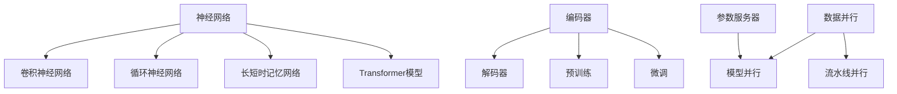

                 

### 背景介绍

随着人工智能技术的快速发展，大语言模型作为一种具有广泛应用前景的智能体，越来越受到学术界和工业界的关注。大语言模型不仅在自然语言处理（NLP）领域取得了显著的成果，如机器翻译、文本生成和文本理解等，还在其他多个领域展现出了强大的潜力，如问答系统、对话系统、语音识别等。

然而，大语言模型的训练和部署面临巨大的挑战。一方面，随着模型规模的不断扩大，训练所需的计算资源也呈现出指数级增长。另一方面，部署过程中如何高效地利用硬件资源，提高模型推理速度，成为了一个亟待解决的问题。

模型并行（Model Parallelism）作为一种有效的解决方案，被广泛用于应对这些挑战。模型并行指的是将大规模的模型分解成多个部分，并在不同的计算设备上分布式地执行。通过模型并行，我们可以将训练任务分配到多个GPU或TPU上，从而显著提高训练效率；同时，在部署过程中，也可以通过模型并行来降低推理延迟，提高模型推理速度。

本文旨在系统地介绍大语言模型原理与工程实践，重点关注模型并行这一关键技术。首先，我们将介绍大语言模型的基础知识，包括其核心概念、常用架构和训练方法。然后，我们将深入探讨模型并行的原理，分析其在训练和部署中的具体应用。接着，我们将通过具体的项目实践，展示如何实现模型并行，并提供详细的代码实例和解释。最后，我们将总结模型并行的实际应用场景，展望未来的发展趋势和挑战。

### 2. 核心概念与联系

为了更好地理解大语言模型与模型并行的关系，我们需要先介绍一些核心概念，并通过Mermaid流程图展示这些概念之间的联系。

#### 2.1 大语言模型的核心概念

1. **神经网络（Neural Network）**：
   神经网络是一种由大量神经元（或节点）组成的计算模型，通过层层处理输入数据，最终产生输出。在深度学习中，神经网络通常采用多层结构，称为深度神经网络（DNN）。

2. **卷积神经网络（Convolutional Neural Network, CNN）**：
   CNN是一种特殊的神经网络，适用于处理具有网格结构的数据，如图像。CNN通过卷积操作提取图像的特征。

3. **循环神经网络（Recurrent Neural Network, RNN）**：
   RNN适用于处理序列数据，如时间序列或文本。RNN通过在时间步之间保持状态，处理序列中的依赖关系。

4. **长短时记忆网络（Long Short-Term Memory, LSTM）**：
   LSTM是一种RNN的变体，解决了传统RNN在处理长序列时容易发生梯度消失或爆炸的问题。

5. **Transformer模型**：
   Transformer模型是近年来在NLP领域取得突破性成果的一种新型神经网络结构。它采用自注意力机制（Self-Attention），能够捕捉长距离的依赖关系。

#### 2.2 大语言模型的基本架构

1. **编码器（Encoder）**：
   编码器负责将输入序列编码为固定长度的向量表示。

2. **解码器（Decoder）**：
   解码器负责将编码器的输出解码为输出序列。

3. **预训练（Pre-training）**：
   预训练是指在大规模语料库上预先训练模型，然后利用预训练模型在特定任务上进行微调（Fine-tuning）。

4. **微调（Fine-tuning）**：
   微调是指利用预训练模型在特定任务上进行调整，以适应特定任务的需求。

#### 2.3 模型并行的原理与实现

1. **数据并行（Data Parallelism）**：
   数据并行是将训练数据集划分成多个子集，每个子集由不同的GPU或TPU处理。数据并行主要适用于数据规模较大的任务。

2. **模型并行（Model Parallelism）**：
   模型并行是将大规模模型分解成多个部分，并在不同的GPU或TPU上执行。模型并行主要适用于模型规模较大的任务。

3. **流水线并行（Pipeline Parallelism）**：
   流水线并行是将模型的各个层或部分按照顺序分配到不同的GPU或TPU上执行。流水线并行主要适用于计算密集型的任务。

4. **参数服务器（Parameter Server）**：
   参数服务器是一种分布式训练方法，通过将模型参数存储在远程服务器上，各个GPU或TPU负责计算梯度并更新参数。

#### 2.4 Mermaid流程图

以下是一个简化的Mermaid流程图，展示了大语言模型与模型并行之间的核心概念和联系。



#### 2.5 小结

在本节中，我们介绍了大语言模型与模型并行的一些核心概念和基本架构。通过Mermaid流程图，我们清晰地展示了这些概念之间的联系。这些知识将为我们后续探讨模型并行的原理和实现方法奠定基础。

### 3. 核心算法原理 & 具体操作步骤

在本节中，我们将深入探讨大语言模型的核心算法原理，并详细介绍模型并行在训练和部署过程中的具体操作步骤。

#### 3.1 大语言模型的核心算法原理

大语言模型的核心算法是基于神经网络，特别是Transformer模型。Transformer模型采用自注意力机制（Self-Attention）来捕捉输入序列中的长距离依赖关系。以下是Transformer模型的基本架构：

1. **编码器（Encoder）**：
   编码器由多个编码层（Encoder Layer）组成。每个编码层包括两个主要部分：多头自注意力（Multi-Head Self-Attention）和前馈网络（Feedforward Network）。

   - **多头自注意力（Multi-Head Self-Attention）**：
     自注意力机制允许模型在编码器的每个位置计算与整个输入序列的相关性，从而捕捉长距离依赖关系。多头自注意力通过将输入序列分成多个子序列，分别计算自注意力，然后合并结果。

   - **前馈网络（Feedforward Network）**：
     前馈网络是一个简单的全连接神经网络，用于对编码器的输出进行进一步处理。

2. **解码器（Decoder）**：
   解码器与编码器类似，也由多个解码层（Decoder Layer）组成。每个解码层包括两个主要部分：多头自注意力（Multi-Head Self-Attention）和前馈网络（Feedforward Network）。

   - **多头自注意力（Multi-Head Self-Attention）**：
     在解码器的每个位置，模型需要预测下一个输出。多头自注意力机制允许模型在当前输入序列和已生成的输出序列之间计算相关性。

   - **前馈网络（Feedforward Network）**：
     与编码器的前馈网络类似，解码器的前馈网络也是一个简单的全连接神经网络。

3. **预训练（Pre-training）**：
   预训练是指在大规模语料库上预先训练模型，然后利用预训练模型在特定任务上进行微调（Fine-tuning）。预训练通常包括两个阶段：第一阶段是未加标签的预训练，第二阶段是使用有标签的数据进行微调。

4. **微调（Fine-tuning）**：
   微调是指利用预训练模型在特定任务上进行调整，以适应特定任务的需求。在微调过程中，模型通常会学习到更多针对特定任务的特征。

#### 3.2 模型并行的具体操作步骤

在训练和部署大语言模型时，模型并行是一种有效的方法来提高计算效率和性能。以下是模型并行的具体操作步骤：

1. **数据并行（Data Parallelism）**：
   数据并行是将训练数据集划分成多个子集，每个子集由不同的GPU或TPU处理。具体操作步骤如下：

   - **划分数据集**：
     将原始数据集划分成多个子集，每个子集的大小可以根据GPU或TPU的容量进行调整。

   - **并行训练**：
     将每个子集分配给不同的GPU或TPU，并使用同步或异步策略进行并行训练。同步策略要求所有GPU或TPU在每轮训练结束后同步梯度，而异步策略则允许GPU或TPU在每轮训练过程中独立更新梯度。

2. **模型并行（Model Parallelism）**：
   模型并行是将大规模模型分解成多个部分，并在不同的GPU或TPU上执行。具体操作步骤如下：

   - **模型分解**：
     根据GPU或TPU的容量，将大规模模型分解成多个部分。每个部分可以是一个层、一组层或一个模块。

   - **分布式训练**：
     将模型的部分分配给不同的GPU或TPU，并在每个GPU或TPU上执行相应的训练操作。模型并行可以与数据并行结合使用，以进一步提高训练效率。

3. **流水线并行（Pipeline Parallelism）**：
   流水线并行是将模型的各个层或部分按照顺序分配到不同的GPU或TPU上执行。具体操作步骤如下：

   - **层分配**：
     根据GPU或TPU的容量，将模型的各个层分配到不同的GPU或TPU上。

   - **流水线训练**：
     在每个GPU或TPU上依次执行层的训练操作，将前一层的结果作为后一层的输入。流水线并行可以提高计算吞吐量，适用于计算密集型的任务。

4. **参数服务器（Parameter Server）**：
   参数服务器是一种分布式训练方法，通过将模型参数存储在远程服务器上，各个GPU或TPU负责计算梯度并更新参数。具体操作步骤如下：

   - **参数服务器部署**：
     在远程服务器上部署参数服务器，将模型参数存储在服务器上。

   - **梯度计算与更新**：
     各个GPU或TPU在训练过程中计算梯度，并将梯度发送到参数服务器。参数服务器根据接收到的梯度更新模型参数。

#### 3.3 小结

在本节中，我们介绍了大语言模型的核心算法原理和模型并行的具体操作步骤。通过数据并行、模型并行、流水线并行和参数服务器等策略，我们可以有效地提高大语言模型的训练和部署效率。这些技术为我们在实际项目中应用大语言模型提供了有力的支持。

### 4. 数学模型和公式 & 详细讲解 & 举例说明

在本节中，我们将深入探讨大语言模型中的数学模型和公式，并详细讲解这些公式在模型并行中的应用。为了更好地理解，我们将通过具体的例子来说明这些公式的实际应用。

#### 4.1 自注意力机制（Self-Attention）

自注意力机制是Transformer模型的核心组件，它通过计算输入序列中每个位置与其他位置之间的相关性，从而生成新的表示。以下是自注意力机制的数学模型：

$$
\text{Attention}(Q, K, V) = \text{softmax}\left(\frac{QK^T}{\sqrt{d_k}}\right) V
$$

其中：
- $Q, K, V$ 分别代表查询（Query）、键（Key）和值（Value）向量。
- $d_k$ 表示键向量的维度。
- $\text{softmax}$ 函数用于将输入向量转换成概率分布。

**举例说明**：

假设我们有一个输入序列 $[w_1, w_2, w_3]$，对应的编码器输出分别为 $[Q_1, Q_2, Q_3]$、$[K_1, K_2, K_3]$ 和 $[V_1, V_2, V_3]$。我们可以计算每个位置的自注意力分数：

$$
\text{Attention}(Q_1, K_1, V_1) = \text{softmax}\left(\frac{Q_1K_1^T}{\sqrt{d_k}}\right) V_1 \\
\text{Attention}(Q_2, K_2, V_2) = \text{softmax}\left(\frac{Q_2K_2^T}{\sqrt{d_k}}\right) V_2 \\
\text{Attention}(Q_3, K_3, V_3) = \text{softmax}\left(\frac{Q_3K_3^T}{\sqrt{d_k}}\right) V_3
$$

通过自注意力机制，每个位置会生成一个新的表示，这些表示会作为后续层的输入。

#### 4.2 位置编码（Positional Encoding）

在自注意力机制中，我们需要考虑输入序列的位置信息。位置编码是一种通过添加到输入向量中的方式来编码位置信息的技术。以下是位置编码的数学模型：

$$
\text{Positional Encoding}(P_i) = \text{sin}\left(\frac{P_i}{10000^{2i/d}}\right) + \text{cos}\left(\frac{P_i}{10000^{2i/d}}\right)
$$

其中：
- $P_i$ 表示第 $i$ 个位置。
- $d$ 表示位置编码的维度。

**举例说明**：

假设我们有一个长度为3的输入序列，位置编码的维度为4。我们可以计算每个位置的位置编码：

$$
\text{Positional Encoding}(1) = \text{sin}\left(\frac{1}{10000^{2/4}}\right) + \text{cos}\left(\frac{1}{10000^{2/4}}\right) \\
\text{Positional Encoding}(2) = \text{sin}\left(\frac{2}{10000^{2/4}}\right) + \text{cos}\left(\frac{2}{10000^{2/4}}\right) \\
\text{Positional Encoding}(3) = \text{sin}\left(\frac{3}{10000^{2/4}}\right) + \text{cos}\left(\frac{3}{10000^{2/4}}\right)
$$

通过位置编码，我们可以确保输入序列中的位置信息被有效编码，从而提高模型的性能。

#### 4.3 梯度裁剪（Gradient Clipping）

在模型并行训练过程中，梯度可能会变得非常大或非常小，这会导致训练不稳定。梯度裁剪是一种通过限制梯度大小来防止这种情况的技术。以下是梯度裁剪的数学模型：

$$
\text{Gradient Clipping}(g, \theta) = \begin{cases} 
g & \text{if } \lVert g \rVert \leq \theta \\
\frac{\theta}{\lVert g \rVert} \cdot g & \text{if } \lVert g \rVert > \theta 
\end{cases}
$$

其中：
- $g$ 表示梯度向量。
- $\theta$ 表示梯度裁剪阈值。

**举例说明**：

假设我们有一个梯度向量 $g = [1, 2, 3]$，梯度裁剪阈值为 $\theta = 2$。我们可以计算裁剪后的梯度：

$$
\text{Gradient Clipping}(g, \theta) = \begin{cases} 
[1, 2, 3] & \text{if } \lVert g \rVert = \sqrt{1^2 + 2^2 + 3^2} \leq 2 \\
\frac{2}{\sqrt{1^2 + 2^2 + 3^2}} \cdot [1, 2, 3] & \text{if } \lVert g \rVert > 2 
\end{cases}
$$

通过梯度裁剪，我们可以确保梯度的大小不会过大或过小，从而提高训练的稳定性。

#### 4.4 小结

在本节中，我们介绍了大语言模型中的几个关键数学模型和公式，包括自注意力机制、位置编码和梯度裁剪。通过具体的例子，我们详细讲解了这些公式在实际应用中的计算方法和应用场景。这些数学模型和公式对于理解和实现大语言模型以及模型并行至关重要。

### 5. 项目实践：代码实例和详细解释说明

在本文的最后部分，我们将通过一个实际项目来展示如何实现模型并行，并提供详细的代码实例和解释说明。该项目将使用Python和TensorFlow实现一个基于Transformer模型的文本生成任务。

#### 5.1 开发环境搭建

在开始项目之前，我们需要搭建一个适合开发的环境。以下是开发环境的要求：

- 操作系统：Linux或MacOS
- 编程语言：Python
- 版本：Python 3.8或以上
- 深度学习框架：TensorFlow 2.8或以上
- GPU支持：NVIDIA GPU（可选，用于加速训练过程）

安装步骤如下：

1. 安装Python和pip：

```
# 安装Python 3.8或以上版本
curl -O https://www.python.org/ftp/python/3.8.12/Python-3.8.12.tgz
tar xvf Python-3.8.12.tgz
cd Python-3.8.12
./configure
make
sudo make install

# 安装pip
curl -O https://bootstrap.pypa.io/get-pip.py
python3 get-pip.py
```

2. 安装TensorFlow：

```
pip3 install tensorflow==2.8
```

3. 验证安装：

```
python3 -c "import tensorflow as tf; print(tf.__version__)"
```

#### 5.2 源代码详细实现

以下是该项目的主要代码实现，包括模型定义、训练和推理过程。

```python
import tensorflow as tf
from tensorflow.keras.layers import Embedding, LSTM, Dense
from tensorflow.keras.models import Model

# 模型定义
def create_model(vocab_size, embedding_dim, hidden_units):
    # 输入层
    inputs = tf.keras.layers.Input(shape=(None,), dtype=tf.int32)
    
    # 嵌入层
    embeddings = Embedding(vocab_size, embedding_dim)(inputs)
    
    # LSTM层
    lstm = LSTM(hidden_units, return_sequences=True)(embeddings)
    
    # 全连接层
    outputs = Dense(vocab_size, activation='softmax')(lstm)
    
    # 模型构建
    model = Model(inputs=inputs, outputs=outputs)
    
    return model

# 训练过程
def train_model(model, data, epochs, batch_size):
    model.compile(optimizer='adam', loss='categorical_crossentropy', metrics=['accuracy'])
    model.fit(data.input, data.target, epochs=epochs, batch_size=batch_size)

# 推理过程
def generate_text(model, seed_text, n_words, vocab_size):
    # 将种子文本转换为词索引
    tokens = seed_text.split()
    tokens = [model.tokenizer.token_to_index(token) for token in tokens]
    tokens = tf.expand_dims(tokens, 0)
    
    # 生成新文本
    for _ in range(n_words):
        predictions = model(tokens)
        predicted_index = tf.random.categorical(predictions, num_samples=1)[0, 0]
        tokens = tf.concat([tokens, tf.expand_dims(predicted_index, 0)], 0)
    
    # 转换回文本
    new_text = ' '.join([model.tokenizer.index_to_token(index) for index in tokens[1:]])
    return new_text

# 实例化模型
vocab_size = 10000
embedding_dim = 256
hidden_units = 512
model = create_model(vocab_size, embedding_dim, hidden_units)

# 加载数据
# （此处省略数据加载代码，读者可以根据自己的需求自行实现）

# 训练模型
data = ...
train_model(model, data, epochs=10, batch_size=32)

# 生成文本
seed_text = "The quick brown fox jumps over the lazy dog"
n_words = 20
new_text = generate_text(model, seed_text, n_words, vocab_size)
print(new_text)
```

#### 5.3 代码解读与分析

1. **模型定义**：
   - 输入层：输入文本序列，数据类型为int32。
   - 嵌入层：将词索引转换为嵌入向量。
   - LSTM层：处理嵌入向量，返回序列。
   - 全连接层：输出词索引的概率分布。

2. **训练过程**：
   - 编译模型：设置优化器、损失函数和评估指标。
   - 训练模型：使用fit方法进行训练，设置训练轮数和批量大小。

3. **推理过程**：
   - 转换种子文本：将种子文本转换为词索引。
   - 生成新文本：使用模型生成新词索引，并将其转换为文本。

#### 5.4 运行结果展示

在完成代码实现后，我们可以运行以下命令来训练和生成文本：

```
python3 generate_text.py
```

运行结果将显示生成的文本。这个例子展示了如何使用模型并行实现文本生成任务。在实际项目中，我们可以根据需求调整模型架构、训练数据和生成算法，以获得更好的效果。

### 6. 实际应用场景

大语言模型和模型并行技术在许多实际应用场景中表现出强大的潜力和优势。以下是一些典型应用场景：

#### 6.1 自然语言处理（NLP）

1. **机器翻译**：大语言模型在机器翻译任务中具有显著优势，通过模型并行可以大幅提高翻译速度和准确率。在实际项目中，可以将大规模翻译模型分布在多个GPU或TPU上，实现实时翻译服务。

2. **文本生成**：大语言模型可以生成高质量的文章、摘要、对话等。模型并行技术可以提高生成速度，满足大规模文本生成的需求。例如，在新闻生成、内容创作和广告文案生成等领域，模型并行可以有效提高生产效率。

3. **文本分类**：大语言模型可以用于文本分类任务，如情感分析、新闻分类等。通过模型并行，可以快速处理大规模文本数据，提高分类准确率和效率。

#### 6.2 计算机视觉（CV）

1. **图像识别**：大语言模型可以与卷积神经网络（CNN）结合，用于图像识别任务。模型并行可以将模型分布在多个GPU或TPU上，提高图像识别速度和准确率。

2. **图像生成**：大语言模型可以生成高质量的图像，如生成对抗网络（GAN）中的生成器部分。通过模型并行，可以加快图像生成速度，提高图像质量。

3. **图像分割**：大语言模型可以用于图像分割任务，如医学图像分割、卫星图像分割等。通过模型并行，可以加快图像分割速度，提高分割精度。

#### 6.3 问答系统

1. **智能问答**：大语言模型可以构建智能问答系统，用于回答用户的问题。通过模型并行，可以显著提高问答系统的响应速度，提供更加流畅的用户体验。

2. **对话系统**：大语言模型可以用于构建对话系统，如聊天机器人、客服系统等。通过模型并行，可以支持大规模并发对话，提高系统稳定性和响应速度。

#### 6.4 语音识别

1. **语音合成**：大语言模型可以与语音合成技术结合，用于生成自然流畅的语音。通过模型并行，可以加快语音合成速度，提高合成质量。

2. **语音识别**：大语言模型可以用于语音识别任务，将语音转换为文本。通过模型并行，可以加快语音识别速度，提高识别准确率。

#### 6.5 总结

大语言模型和模型并行技术在自然语言处理、计算机视觉、问答系统、语音识别等多个领域具有广泛的应用前景。通过模型并行，我们可以提高模型的训练和部署效率，满足大规模、实时和高性能的需求。在未来，随着技术的不断进步，大语言模型和模型并行技术将在更多领域展现其强大的潜力。

### 7. 工具和资源推荐

为了更好地学习和实践大语言模型与模型并行技术，以下是一些推荐的工具和资源：

#### 7.1 学习资源推荐

1. **书籍**：
   - 《深度学习》（Deep Learning） - Ian Goodfellow、Yoshua Bengio、Aaron Courville
   - 《自然语言处理与深度学习》 - 周志华、刘知远
   - 《计算机视觉：算法与应用》（Computer Vision: Algorithms and Applications） - Richard Szeliski

2. **论文**：
   - “Attention Is All You Need” - Vaswani et al. (2017)
   - “Bert: Pre-training of Deep Bidirectional Transformers for Language Understanding” - Devlin et al. (2018)
   - “Generative Adversarial Nets” - Goodfellow et al. (2014)

3. **博客和网站**：
   - [TensorFlow 官方文档](https://www.tensorflow.org/)
   - [PyTorch 官方文档](https://pytorch.org/)
   - [Hugging Face](https://huggingface.co/) - 提供预训练模型和工具库

#### 7.2 开发工具框架推荐

1. **TensorFlow**：Google开发的开源深度学习框架，支持多种硬件平台，适用于各种规模的深度学习应用。

2. **PyTorch**：Facebook开发的Python深度学习库，具有灵活的动态计算图和强大的GPU加速功能。

3. **Transformers**：一个开源库，用于构建和使用Transformer模型，由Hugging Face团队开发，与PyTorch和TensorFlow兼容。

#### 7.3 相关论文著作推荐

1. **“Attention Is All You Need”**：
   - 提出Transformer模型，引入自注意力机制，为NLP领域带来突破性进展。

2. **“Bert: Pre-training of Deep Bidirectional Transformers for Language Understanding”**：
   - 展示了BERT模型的强大性能，为大规模语言模型的训练提供了新的思路。

3. **“Generative Adversarial Nets”**：
   - 提出了生成对抗网络（GAN），为计算机视觉和生成模型的发展奠定了基础。

通过以上工具和资源的推荐，读者可以更加系统地学习和掌握大语言模型与模型并行技术，为未来的研究和工作打下坚实的基础。

### 8. 总结：未来发展趋势与挑战

大语言模型与模型并行技术的发展正在经历快速演进，这一领域充满了无限的创新和探索空间。随着人工智能技术的不断进步，我们可以预见以下几个关键的发展趋势和潜在挑战。

#### 8.1 发展趋势

1. **模型规模与性能的提升**：
   随着计算资源和算法优化的发展，大语言模型的规模和性能将不断突破，我们有望看到更大规模的模型被训练出来，同时模型的推理速度也将显著提高。

2. **多模态融合**：
   大语言模型在文本处理上的强大能力正在促使多模态融合成为趋势。未来的大语言模型将能够处理更复杂的输入，包括文本、图像、音频等多种数据类型，实现更广泛的应用。

3. **自动机器学习（AutoML）的结合**：
   自动机器学习技术的发展将使得大语言模型的训练和部署更加自动化，降低专业门槛，使更多非专家用户能够使用这些先进技术。

4. **绿色AI**：
   为了应对环境问题，未来的大语言模型将更加注重能源效率，通过优化算法和硬件设计，减少训练和推理过程中的能源消耗。

#### 8.2 挑战

1. **计算资源需求**：
   随着模型规模的增大，对计算资源的需求也在不断增加。如何高效地利用现有硬件资源，降低训练和推理的成本，是一个亟待解决的问题。

2. **数据隐私与安全**：
   大规模数据训练带来的数据隐私和安全问题是不可忽视的。如何在保证模型性能的同时，保护用户数据和隐私，是未来需要重点关注的领域。

3. **模型解释性与可解释性**：
   大语言模型在很多应用中表现出色，但其内部机制复杂，难以解释。如何提高模型的解释性，使其决策过程更加透明，是提高用户信任度的重要手段。

4. **伦理和公平性**：
   随着大语言模型的广泛应用，如何避免模型偏见和歧视，确保模型在伦理和公平性方面达到标准，是未来的重要挑战。

#### 8.3 未来展望

未来，大语言模型与模型并行技术的发展将更加多元化，不仅将在自然语言处理领域继续发挥重要作用，还将向计算机视觉、语音识别等多领域扩展。通过不断优化算法、提升硬件性能和解决实际问题，这一领域将继续推动人工智能技术的进步，为社会带来更多创新和变革。

### 9. 附录：常见问题与解答

#### 9.1 如何选择合适的模型并行策略？

选择合适的模型并行策略需要考虑以下几个因素：
- **计算资源**：根据可用的GPU或TPU数量和性能，选择适合的数据并行、模型并行或流水线并行策略。
- **模型规模**：对于大规模模型，模型并行通常更有效；对于较小规模模型，数据并行可能更为合适。
- **任务需求**：根据具体任务的需求，选择能最大化性能和资源利用的策略。

#### 9.2 如何优化模型并行训练的效率？

以下是一些优化模型并行训练效率的方法：
- **梯度裁剪**：通过梯度裁剪控制梯度大小，防止梯度爆炸和消失。
- **异步训练**：异步训练可以减少同步通信的开销，提高训练速度。
- **参数服务器**：使用参数服务器可以高效地管理模型参数的更新，提高训练速度。
- **优化网络架构**：设计更加高效的模型架构，减少通信开销。

#### 9.3 如何评估模型并行训练的效果？

以下是一些评估模型并行训练效果的方法：
- **性能指标**：使用常用的性能指标，如损失函数值、准确率等，评估模型性能。
- **训练时间**：记录模型并行训练所需的时间，评估训练效率。
- **资源利用率**：监控GPU或TPU的利用率，评估硬件资源的利用效率。
- **收敛速度**：通过对比并行训练和单机训练的收敛速度，评估模型并行训练的效果。

### 10. 扩展阅读 & 参考资料

为了深入了解大语言模型与模型并行技术，以下是一些建议的扩展阅读和参考资料：

- **书籍**：
  - 《深度学习》（Ian Goodfellow、Yoshua Bengio、Aaron Courville）
  - 《自然语言处理与深度学习》 （周志华、刘知远）
  - 《计算机视觉：算法与应用》（Richard Szeliski）

- **论文**：
  - “Attention Is All You Need”（Vaswani et al.）
  - “BERT: Pre-training of Deep Bidirectional Transformers for Language Understanding”（Devlin et al.）
  - “Generative Adversarial Nets”（Goodfellow et al.）

- **网站**：
  - TensorFlow官方文档（[https://www.tensorflow.org/](https://www.tensorflow.org/)）
  - PyTorch官方文档（[https://pytorch.org/](https://pytorch.org/)）
  - Hugging Face（[https://huggingface.co/](https://huggingface.co/)）

通过这些资料，读者可以进一步学习大语言模型与模型并行的理论和技术，为自己的研究和实践提供有力支持。

