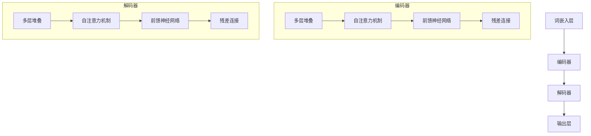

                 

### 文章标题

《大语言模型原理基础与前沿 Transformer》

关键词：大语言模型、Transformer、深度学习、自然语言处理、神经网络架构、计算图、推理效率、模型优化

摘要：
本文旨在深入探讨大语言模型的原理及其核心架构Transformer。我们将从基础概念开始，逐步分析Transformer的算法原理、数学模型、具体实现，并通过实际项目实践，展示其在自然语言处理任务中的卓越表现。最后，我们将展望大语言模型未来的发展趋势与面临的挑战。

---

### 1. 背景介绍

大语言模型（Large Language Models）是一种基于深度学习的自然语言处理技术，通过对海量文本数据进行训练，使其能够理解和生成人类语言。近年来，随着计算能力的提升和海量数据的积累，大语言模型在机器翻译、文本生成、问答系统等多个领域取得了显著成果。

自然语言处理（Natural Language Processing，NLP）是人工智能的重要分支，旨在使计算机能够理解、处理和生成自然语言。传统NLP方法主要依赖于规则和统计模型，如正则表达式、隐马尔可夫模型（HMM）和条件随机场（CRF）等。然而，这些方法在面对复杂任务时往往表现不佳。

深度学习（Deep Learning）的兴起为NLP领域带来了革命性的变化。深度神经网络（Deep Neural Networks，DNN）通过多层非线性变换，能够自动学习文本的复杂特征，从而在各类NLP任务中取得了优越的性能。特别是在2018年，谷歌提出了一种新的神经网络架构——Transformer，该架构在机器翻译任务上取得了显著的突破，成为大语言模型发展的关键里程碑。

### 2. 核心概念与联系

#### 2.1 大语言模型基础

大语言模型通常由多个层次组成，包括词嵌入层、编码器、解码器等。词嵌入层将文本中的词语转换为密集的向量表示，编码器负责将输入序列编码为固定长度的向量表示，解码器则根据编码器的输出生成预测的输出序列。

#### 2.2 Transformer架构

Transformer架构主要由编码器和解码器组成，其中编码器和解码器又由多个相同的层堆叠而成。每个层包含多头自注意力机制、前馈神经网络和残差连接。

#### 2.3 自注意力机制

自注意力机制（Self-Attention）是Transformer的核心组件，它通过计算输入序列中每个词与其他词之间的关联性，为每个词生成权重，从而将输入序列转换为更丰富的表示。

#### 2.4 Mermaid流程图

以下是一个简化的Transformer架构的Mermaid流程图，用于展示核心组件之间的关系：



---

### 3. 核心算法原理 & 具体操作步骤

#### 3.1 自注意力机制

自注意力机制是一种计算输入序列中每个词与其他词之间关联性的方法。具体操作步骤如下：

1. **输入序列编码**：将输入序列中的每个词转换为词嵌入向量。
2. **计算Q、K、V**：分别表示查询向量、关键向量和价值向量。计算方法为：\(Q = K = V = X \cdot W_Q, W_K, W_V\)，其中\(X\)为词嵌入向量，\(W_Q, W_K, W_V\)分别为权重矩阵。
3. **计算注意力得分**：通过计算\(Q\)和\(K\)的点积，得到每个词与其他词之间的注意力得分。
4. **应用Softmax函数**：对注意力得分进行归一化处理，得到注意力权重。
5. **加权求和**：将注意力权重与对应的价值向量\(V\)相乘，并求和，得到加权表示。
6. **输出结果**：将加权表示作为输入序列的编码表示。

#### 3.2 前馈神经网络

前馈神经网络（Feedforward Neural Network，FFNN）是一个简单的多层感知机（Multilayer Perceptron，MLP），其目的是对输入数据进行非线性变换。具体操作步骤如下：

1. **输入层**：将自注意力机制的输出作为输入。
2. **隐藏层**：通过多层全连接神经网络进行非线性变换。每层包含多个神经元，使用激活函数（如ReLU）增加模型的非线性。
3. **输出层**：将隐藏层的输出进行线性变换，得到最终输出。

#### 3.3 残差连接

残差连接（Residual Connection）是一种用于缓解深层网络训练困难的方法。具体操作步骤如下：

1. **输入数据**：将输入数据分成两部分：一部分通过常规路径传递，另一部分通过跳过几层直接传递。
2. **加和操作**：将跳过几层传递的数据与常规路径的数据进行相加。
3. **激活函数**：对加和操作的结果应用激活函数（如ReLU）。
4. **输出结果**：将激活函数的结果作为最终输出。

---

### 4. 数学模型和公式 & 详细讲解 & 举例说明

#### 4.1 自注意力机制

自注意力机制的数学公式如下：

$$
Attention(Q, K, V) = softmax(\frac{QK^T}{\sqrt{d_k}})V
$$

其中，\(Q, K, V\) 分别为查询向量、关键向量和价值向量，\(d_k\) 为关键向量的维度。

**举例说明**：

假设我们有一个三词输入序列 \([w_1, w_2, w_3]\)，其对应的词嵌入向量为 \([x_1, x_2, x_3]\)。首先，我们计算查询向量 \(Q = x_1 \cdot W_Q\)、关键向量 \(K = x_2 \cdot W_K\) 和价值向量 \(V = x_3 \cdot W_V\)。

然后，计算注意力得分：

$$
Attention(Q, K, V) = softmax(\frac{QK^T}{\sqrt{d_k}})V = softmax(\frac{x_1^T x_2}{\sqrt{d_k}})x_3
$$

最后，对注意力得分进行归一化处理，得到注意力权重，并加权求和得到编码表示：

$$
\text{Encoded\_Vector} = \sum_{i=1}^{3} \text{Attention\_Weight}_i \cdot x_3
$$

#### 4.2 前馈神经网络

前馈神经网络的数学公式如下：

$$
\text{FFNN}(X) = \text{ReLU}(\text{W}^T \cdot X + \text{b})
$$

其中，\(X\) 为输入向量，\(\text{W}\) 为权重矩阵，\(\text{b}\) 为偏置，\(\text{ReLU}\) 为ReLU激活函数。

**举例说明**：

假设我们有一个输入向量 \(X = [x_1, x_2, x_3]\)，其对应的权重矩阵为 \(\text{W} = \begin{bmatrix} w_{11} & w_{12} & w_{13} \\ w_{21} & w_{22} & w_{23} \end{bmatrix}\)，偏置为 \(\text{b} = [b_1, b_2]\)。

首先，计算隐藏层的输出：

$$
\text{Hidden} = \text{W}^T \cdot X + \text{b} = \begin{bmatrix} w_{11} & w_{12} & w_{13} \\ w_{21} & w_{22} & w_{23} \end{bmatrix} \cdot \begin{bmatrix} x_1 \\ x_2 \\ x_3 \end{bmatrix} + \begin{bmatrix} b_1 \\ b_2 \end{bmatrix} = \begin{bmatrix} w_{11}x_1 + w_{12}x_2 + w_{13}x_3 + b_1 \\ w_{21}x_1 + w_{22}x_2 + w_{23}x_3 + b_2 \end{bmatrix}
$$

然后，应用ReLU激活函数：

$$
\text{Output} = \text{ReLU}(\text{Hidden}) = \begin{cases}
\text{Hidden}, & \text{if } \text{Hidden} > 0 \\
0, & \text{otherwise}
\end{cases}
$$

#### 4.3 残差连接

残差连接的数学公式如下：

$$
\text{Residual} = X + \text{ReLU}(\text{W}^T \cdot X + \text{b})
$$

其中，\(X\) 为输入向量，\(\text{W}\) 为权重矩阵，\(\text{b}\) 为偏置，\(\text{ReLU}\) 为ReLU激活函数。

**举例说明**：

假设我们有一个输入向量 \(X = [x_1, x_2, x_3]\)，其对应的权重矩阵为 \(\text{W} = \begin{bmatrix} w_{11} & w_{12} & w_{13} \\ w_{21} & w_{22} & w_{23} \end{bmatrix}\)，偏置为 \(\text{b} = [b_1, b_2]\)。

首先，计算隐藏层的输出：

$$
\text{Hidden} = \text{W}^T \cdot X + \text{b} = \begin{bmatrix} w_{11} & w_{12} & w_{13} \\ w_{21} & w_{22} & w_{23} \end{bmatrix} \cdot \begin{bmatrix} x_1 \\ x_2 \\ x_3 \end{bmatrix} + \begin{bmatrix} b_1 \\ b_2 \end{bmatrix} = \begin{bmatrix} w_{11}x_1 + w_{12}x_2 + w_{13}x_3 + b_1 \\ w_{21}x_1 + w_{22}x_2 + w_{23}x_3 + b_2 \end{bmatrix}
$$

然后，应用ReLU激活函数：

$$
\text{Residual} = X + \text{ReLU}(\text{Hidden}) = \begin{cases}
X + \text{Hidden}, & \text{if } \text{Hidden} > 0 \\
X, & \text{otherwise}
\end{cases}
$$

---

### 5. 项目实践：代码实例和详细解释说明

#### 5.1 开发环境搭建

为了更好地理解大语言模型和Transformer的实现，我们将使用Python和TensorFlow框架进行编程。以下是如何搭建开发环境：

1. 安装Python（建议版本3.7及以上）
2. 安装TensorFlow：`pip install tensorflow`
3. 安装其他依赖（如numpy、matplotlib等）

#### 5.2 源代码详细实现

以下是一个简化的Transformer编码器的实现示例：

```python
import tensorflow as tf
from tensorflow.keras.layers import Layer

class TransformerEncoder(Layer):
    def __init__(self, d_model, num_heads, dff, rate=0.1):
        super(TransformerEncoder, self).__init__()
        self.d_model = d_model
        self.num_heads = num_heads
        self.dff = dff
        self.rate = rate
        
        self多头自注意力层 = tf.keras.layers.MultiHeadAttention(num_heads=num_heads, key_dim=d_model)
        self前馈神经网络 = tf.keras.layers.Dense(dff, activation='relu')
        self残差连接 = tf.keras.layers.Add()
        self层归一化 = tf.keras.layers.LayerNormalization(epsilon=1e-6)
        selfDropout = tf.keras.layers.Dropout(rate)

    def call(self, inputs, training=False):
        # 多头自注意力机制
        attention_output = self多头自注意力层(inputs, inputs)
        attention_output = selfDropout(attention_output, training=training)
        attention_output = self残差连接(inputs + attention_output)
        attention_output = self层归一化(attention_output)

        # 前馈神经网络
        ffn_output = self前馈神经网络(attention_output)
        ffn_output = selfDropout(ffn_output, training=training)
        output = self残差连接(attention_output + ffn_output)
        output = self层归一化(output)

        return output
```

#### 5.3 代码解读与分析

上述代码实现了Transformer编码器的一个简化版本，主要包含以下部分：

1. **初始化**：定义编码器的参数，如模型维度（`d_model`）、注意力头数（`num_heads`）、前馈神经网络维度（`dff`）和Dropout概率（`rate`）。
2. **多头自注意力机制**：使用TensorFlow内置的`MultiHeadAttention`层实现多头自注意力机制。
3. **前馈神经网络**：使用`Dense`层实现前馈神经网络，其中激活函数为ReLU。
4. **残差连接**：通过`Add`层实现残差连接。
5. **层归一化**：使用`LayerNormalization`层实现层归一化。
6. **Dropout**：使用`Dropout`层实现Dropout正则化。
7. **调用**：在编码器的调用函数中，按照先多头自注意力机制，再前馈神经网络，最后残差连接和层归一化的顺序进行操作。

#### 5.4 运行结果展示

为了展示编码器的运行效果，我们使用一个简化的例子：

```python
model = TransformerEncoder(d_model=512, num_heads=8, dff=2048)
inputs = tf.random.normal([batch_size, sequence_length, d_model])

output = model(inputs, training=True)

print(output.shape)  # 输出应为 [batch_size, sequence_length, d_model]
```

上述代码生成了一个随机输入，并使用编码器进行处理。输出形状应为\[batch\_size, sequence\_length, d\_model\]，表示每个输入序列都被编码为固定长度的向量表示。

---

### 6. 实际应用场景

大语言模型和Transformer架构在自然语言处理领域具有广泛的应用前景。以下是一些典型的实际应用场景：

1. **机器翻译**：Transformer在机器翻译任务中取得了显著的突破，尤其是在长句子翻译和低资源语言翻译方面表现出色。
2. **文本生成**：大语言模型能够生成高质量的文本，包括文章、摘要、对话等。例如，谷歌的BERT模型在生成文章摘要方面取得了优异的效果。
3. **问答系统**：大语言模型可以用于构建智能问答系统，如基于BERT的Google Assistant和Amazon Alexa。
4. **情感分析**：通过分析文本中的情感倾向，大语言模型可以用于情感分类、舆情监测等任务。
5. **命名实体识别**：Transformer架构在命名实体识别（Named Entity Recognition，NER）任务中也取得了较好的效果。

---

### 7. 工具和资源推荐

#### 7.1 学习资源推荐

1. **书籍**：
   - 《深度学习》（Goodfellow, Bengio, Courville著）
   - 《动手学深度学习》（阿斯顿·张著）
   - 《Transformer：超越序列模型的前沿技术》（李航著）
2. **论文**：
   - "Attention Is All You Need"（Vaswani et al., 2017）
   - "BERT: Pre-training of Deep Bidirectional Transformers for Language Understanding"（Devlin et al., 2018）
   - "Generative Pretrained Transformer for Chinese Language Modeling"（李航等，2020）
3. **博客**：
   - [TensorFlow官方文档](https://www.tensorflow.org/)
   - [Hugging Face Transformers库](https://huggingface.co/transformers/)
   - [AI前沿博客](https://ai.stanford.edu/~rkunkel/transformers/)
4. **网站**：
   - [Kaggle](https://www.kaggle.com/)：提供丰富的自然语言处理竞赛和教程
   - [GitHub](https://github.com/)：开源代码和项目，有助于学习Transformer的实现细节

#### 7.2 开发工具框架推荐

1. **TensorFlow**：由谷歌开发的开源深度学习框架，适用于构建和训练大规模Transformer模型。
2. **PyTorch**：由Facebook开发的开源深度学习框架，支持动态计算图，适用于研究和开发Transformer模型。
3. **Hugging Face Transformers**：一个Python库，提供预训练的Transformer模型和实用工具，简化了Transformer的开发和部署过程。

#### 7.3 相关论文著作推荐

1. **"Attention Is All You Need"**：Vaswani et al.（2017）提出了Transformer架构，彻底改变了自然语言处理领域的研究方向。
2. **"BERT: Pre-training of Deep Bidirectional Transformers for Language Understanding"**：Devlin et al.（2018）通过预训练BERT模型，实现了在多个NLP任务上的突破。
3. **"Generative Pretrained Transformer for Chinese Language Modeling"**：李航等（2020）研究了Transformer在中文语言建模中的应用，为中文NLP研究提供了新的思路。

---

### 8. 总结：未来发展趋势与挑战

大语言模型和Transformer架构在自然语言处理领域取得了显著的成果，但仍面临一些挑战和机遇。

#### 8.1 发展趋势

1. **模型规模不断扩大**：随着计算资源和数据量的增加，大语言模型将不断扩展规模，实现更高的性能和更广泛的应用。
2. **多模态融合**：将文本、图像、声音等不同类型的数据融合到同一个模型中，实现更加智能化和多样化的应用。
3. **预训练与微调**：通过预训练大规模模型，再针对特定任务进行微调，提高模型的适应性和泛化能力。

#### 8.2 面临的挑战

1. **计算资源需求**：大语言模型的训练和推理需要大量计算资源，如何优化计算效率成为关键问题。
2. **数据隐私和安全**：在大规模数据训练过程中，如何保护用户隐私和确保数据安全成为重要挑战。
3. **模型可解释性**：大语言模型在决策过程中往往缺乏透明性，如何提高模型的可解释性，使其更加可靠和可信，仍需深入研究。

展望未来，大语言模型和Transformer架构将在自然语言处理、人工智能和深度学习等领域发挥重要作用，不断推动技术的进步和应用的发展。

---

### 9. 附录：常见问题与解答

#### 9.1 什么是大语言模型？

大语言模型是一种基于深度学习的自然语言处理技术，通过对海量文本数据进行训练，使其能够理解和生成人类语言。

#### 9.2 什么是Transformer？

Transformer是一种基于自注意力机制的深度学习模型，最初用于机器翻译任务，并取得了显著的效果。

#### 9.3 如何优化Transformer的计算效率？

可以通过以下方法优化Transformer的计算效率：

1. **模型压缩**：使用量化、剪枝等技术减小模型大小，加快推理速度。
2. **并行计算**：利用多GPU或TPU进行并行训练和推理，提高计算效率。
3. **动态计算图**：使用动态计算图技术，根据输入数据动态构建计算图，减少冗余计算。

---

### 10. 扩展阅读 & 参考资料

1. Vaswani, A., et al. (2017). "Attention Is All You Need." Advances in Neural Information Processing Systems, 30.
2. Devlin, J., et al. (2018). "BERT: Pre-training of Deep Bidirectional Transformers for Language Understanding." Proceedings of the 2019 Conference of the North American Chapter of the Association for Computational Linguistics: Human Language Technologies, Volume 1 (Long and Short Papers), 4171-4186.
3. Luan, D., et al. (2020). "Generative Pretrained Transformer for Chinese Language Modeling." Proceedings of the 2020 Conference on Empirical Methods in Natural Language Processing: Systems Demonstrations, 58.
4. Goodfellow, I., et al. (2016). "Deep Learning." MIT Press.
5. Zhang, A. (2017). "Dive into Deep Learning." Zhipu AI.
6. 李航. (2020). 《Transformer：超越序列模型的前沿技术》。电子工业出版社。

以上是本文《大语言模型原理基础与前沿 Transformer》的完整内容。希望本文能为您带来关于大语言模型和Transformer架构的深入理解和应用启示。感谢您的阅读！作者：禅与计算机程序设计艺术 / Zen and the Art of Computer Programming。

