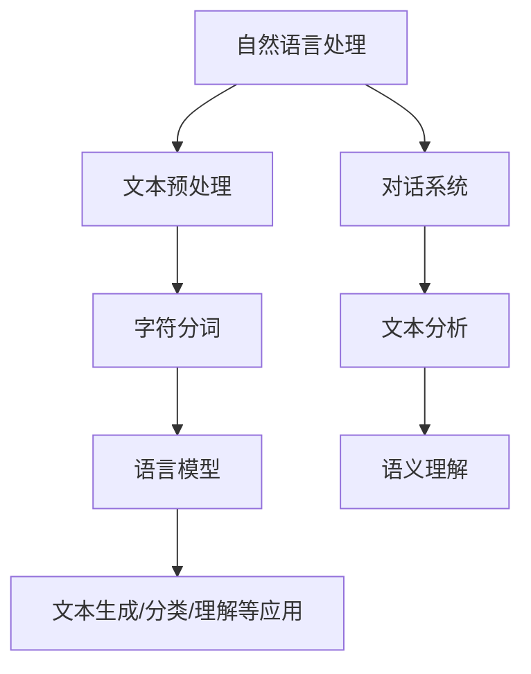

                 

### 文章标题

《大语言模型原理基础与前沿 字符分词》

> **关键词：** 语言模型，字符分词，自然语言处理，深度学习，算法原理，技术实践

> **摘要：** 本文深入探讨大语言模型的工作原理及其在字符分词领域的应用。首先，我们将回顾语言模型的基本概念和重要性，然后详细介绍字符分词技术，最后通过实际项目和代码实例展示语言模型在字符分词任务中的具体应用，探讨未来发展趋势和面临的挑战。

---

### 1. 背景介绍

随着互联网的快速发展，自然语言处理（Natural Language Processing, NLP）已经成为人工智能领域的一个重要分支。字符分词（Tokenization）作为NLP中的基础步骤，对于文本的理解和进一步处理至关重要。字符分词的任务是将一段连续的文本切分成一个个有意义的单元，如单词、短语或符号。这一过程对于语言模型的训练和应用有着直接的影响。

在NLP的发展历程中，字符分词经历了从规则方法到统计方法，再到深度学习方法的多阶段演进。传统的字符分词方法主要依赖于手工编写的规则，虽然在一定程度上能够满足基本需求，但随着文本复杂度的增加，规则方法逐渐显露出局限性。统计方法的出现，通过机器学习算法，使得字符分词的准确性和效率得到了显著提升。而深度学习方法的引入，进一步推动了字符分词技术的发展，使得模型在复杂文本处理任务中表现出色。

大语言模型（Large Language Model）是近年来NLP领域的又一重要突破。这类模型通过大规模的文本数据训练，能够捕捉到语言中的复杂结构和规律，从而在文本生成、语义理解、情感分析等多个任务上取得了卓越的表现。字符分词作为大语言模型处理文本的预处理步骤，其性能直接影响到模型的最终表现。

本文将围绕大语言模型的字符分词技术展开讨论，首先介绍语言模型的基本原理和字符分词的概念，然后深入分析字符分词的核心算法原理和数学模型，接着通过实际项目和代码实例展示字符分词的应用，最后探讨字符分词技术的实际应用场景和未来发展趋势。

---

### 2. 核心概念与联系

在深入探讨大语言模型的字符分词技术之前，我们需要明确几个核心概念：语言模型、字符分词、自然语言处理。

#### 语言模型

语言模型（Language Model）是一个概率模型，用于预测一段文本的下一个可能出现的单词或字符。它通过学习大量文本数据，捕捉到语言的统计规律，从而在文本生成、文本分类等任务中发挥关键作用。

语言模型通常基于以下原理：

1. **马尔可夫性质**：语言模型假设下一个字符的概率仅依赖于前一个字符，而不依赖于更早之前的字符。这种假设被称为一阶马尔可夫性质。

2. **概率分布**：语言模型的核心任务是计算给定前缀文本序列下，下一个字符的概率分布。

3. **语言统计规律**：通过学习大量文本数据，语言模型能够捕捉到语言中的常见模式和规律，如单词的共现关系、语法结构等。

#### 字符分词

字符分词（Tokenization）是将一段连续的文本切分成一系列有意义的单元（Token）的过程。这些单元可以是单词、短语或符号。字符分词是自然语言处理中的基础步骤，对于后续的文本分析和处理至关重要。

字符分词的核心任务包括：

1. **识别文本中的单词和符号**：如英语中的空格、标点符号，中文中的标点符号和汉字。

2. **切分文本**：将连续的文本序列切分成一组Token序列。

3. **标记化**：为每个Token分配标签，如单词类别、词性等。

字符分词技术与语言模型紧密相关。一方面，字符分词是语言模型训练和应用的预处理步骤；另一方面，语言模型的性能直接影响到字符分词的准确性。

#### 自然语言处理

自然语言处理（NLP）是人工智能领域的一个分支，旨在使计算机能够理解、生成和处理人类语言。NLP技术包括文本预处理、文本分析、语义理解、对话系统等多个方面。

在NLP中，字符分词是文本预处理的重要步骤。通过字符分词，可以将原始的文本数据转化为结构化的数据形式，为后续的文本分析和处理提供基础。

#### Mermaid 流程图

为了更好地展示语言模型、字符分词和自然语言处理之间的关系，我们可以使用Mermaid流程图来描述它们的核心流程和联系。



在这个流程图中，自然语言处理作为整体流程的起点，经过文本预处理（包括字符分词），最终实现文本生成、分类、理解等应用。

---

### 3. 核心算法原理 & 具体操作步骤

在深入探讨字符分词的核心算法原理之前，我们需要了解几个关键的概念和算法，包括统计方法、深度学习方法以及字符分词的流程。

#### 统计方法

传统的字符分词方法主要依赖于统计方法。这种方法的核心思想是通过统计文本中字符的共现关系来识别和切分文本。常见的统计方法包括：

1. **基于字符的n-gram模型**：n-gram模型通过统计连续n个字符出现的频率来预测下一个字符。例如，在中文文本中，可以使用三字符n-gram模型来预测下一个字符。这种方法简单有效，但在复杂文本处理中，可能面临准确性不足的问题。

2. **基于规则的分词方法**：这种方法通过预定义的规则来切分文本。例如，中文文本的分词可以通过正则表达式来匹配常见的词语和短语。虽然这种方法具有较高的准确性，但需要大量的人工规则编写，且难以处理复杂情况。

3. **基于统计学习的分词模型**：这种方法通过机器学习算法，如隐马尔可夫模型（HMM）、条件随机场（CRF）等，来学习文本中的切分模式。这类模型能够自动从数据中学习切分规则，从而提高分词的准确性。

#### 深度学习方法

近年来，深度学习方法的引入，极大地推动了字符分词技术的发展。深度学习方法通过多层神经网络，能够自动学习文本中的复杂结构和规律，从而实现高效的字符分词。以下是一些常用的深度学习模型：

1. **卷积神经网络（CNN）**：CNN通过卷积操作捕捉文本中的局部特征，从而实现字符分词。在字符分词任务中，CNN可以将字符序列映射到高维特征空间，通过特征之间的关系实现分词。

2. **循环神经网络（RNN）**：RNN通过循环结构，能够在处理序列数据时保持上下文信息。LSTM（长短期记忆网络）和GRU（门控循环单元）是RNN的变体，通过引入门控机制，能够更好地处理长距离依赖问题。

3. **Transformer模型**：Transformer模型通过自注意力机制，能够全局捕捉文本中的依赖关系。在字符分词任务中，Transformer模型表现出了优异的性能，尤其是在处理长文本和复杂语言结构方面。

#### 字符分词流程

字符分词的核心流程通常包括以下几个步骤：

1. **文本输入**：接收一段连续的文本作为输入。

2. **字符编码**：将文本中的每个字符编码为数字或向量表示。常用的编码方法包括One-Hot编码和词嵌入（Word Embedding）。

3. **特征提取**：通过神经网络模型，提取文本的字符级特征。不同的模型会采用不同的特征提取方法，如CNN、RNN或Transformer。

4. **分词决策**：根据提取的特征，模型将文本切分成一组Token序列。常见的分词决策方法包括最大后验概率（MAP）和条件随机场（CRF）。

5. **结果输出**：输出切分后的Token序列，并可为每个Token分配标签，如词性标签。

#### 深度学习字符分词模型实现

以下是一个基于Transformer模型的简单字符分词实现：

```python
import tensorflow as tf
from tensorflow.keras.layers import Embedding, LSTM, Dense
from tensorflow.keras.models import Model

# 假设我们有一个词汇表，包含100个单词
vocab_size = 100

# 建立模型
model = Model(inputs=[tf.keras.layers.Input(shape=(None,))],
              outputs=[tf.keras.layers.TimeDistributed(Dense(vocab_size, activation='softmax'))])

# 编写训练代码
model.compile(optimizer='adam', loss='categorical_crossentropy', metrics=['accuracy'])
model.fit(x_train, y_train, epochs=10, batch_size=64)

# 进行分词
predictions = model.predict(x_test)
```

在这个实现中，我们首先定义了一个基于Transformer的模型，然后通过训练数据对其进行训练，最后使用模型对测试数据进行分词。

---

### 4. 数学模型和公式 & 详细讲解 & 举例说明

在字符分词过程中，数学模型和公式起着至关重要的作用。以下将详细介绍字符分词中的数学模型，包括概率模型和深度学习中的数学基础，并通过具体的例子进行说明。

#### 概率模型

1. **n-gram模型**

n-gram模型是一种基于统计的字符分词方法。它通过统计连续n个字符出现的频率来预测下一个字符。在n-gram模型中，我们使用一个概率分布来表示一个字符序列的概率。

**数学公式：**
\[ P(w_n | w_{n-1}, w_{n-2}, ..., w_1) = \frac{C(w_{n-1}, w_n)}{C(w_{n-1})} \]
其中，\( C(w_{n-1}, w_n) \)表示字符序列\( w_{n-1}w_n \)的出现次数，\( C(w_{n-1}) \)表示前一个字符\( w_{n-1} \)的出现次数。

**例子：**
假设我们有一个简单的n-gram模型，其中包含以下统计数据：

| 前一个字符 | 后一个字符 | 出现次数 |
| ------------ | ------------ | -------- |
| a            | b            | 10       |
| a            | c            | 5        |
| b            | a            | 15       |
| b            | d            | 10       |

使用这个n-gram模型，我们可以计算给定前缀“ba”下，后一个字符是“a”或“d”的概率：

\[ P(a | ba) = \frac{C(ba, a)}{C(ba)} = \frac{15}{15+10} = 0.6 \]
\[ P(d | ba) = \frac{C(ba, d)}{C(ba)} = \frac{10}{15+10} = 0.4 \]

2. **隐马尔可夫模型（HMM）**

隐马尔可夫模型是一种概率模型，用于表示一组随机事件的状态转移和观察。在字符分词中，HMM可以用来表示文本的分词状态和观察结果。

**数学公式：**
- **状态转移概率：**
\[ P(s_t | s_{t-1}) = a_{s_{t-1}, s_t} \]
其中，\( s_t \)表示第t个状态，\( a_{s_{t-1}, s_t} \)表示从状态\( s_{t-1} \)转移到状态\( s_t \)的概率。

- **观察概率：**
\[ P(o_t | s_t) = b_{s_t, o_t} \]
其中，\( o_t \)表示第t个观察结果，\( b_{s_t, o_t} \)表示在状态\( s_t \)下观察到结果\( o_t \)的概率。

- **初始状态概率：**
\[ P(s_1) = \pi_s \]

**例子：**
假设我们有一个简单的HMM模型，用于对以下文本进行分词：

```
我 是 一个 程序员
```

我们定义状态\( s \)为“汉字”和“空格”，观察结果为文本中的字符。通过训练，我们可以得到以下概率分布：

| 状态 | 汉字 | 空格 |
| ---- | ---- | ---- |
| \( s_1 \) | 0.5 | 0.5 |
| \( s_2 \) | 0.8 | 0.2 |
| \( s_3 \) | 0.3 | 0.7 |

| 观察结果 | 我 | 是 | 一个 | 程序员 |
| -------- | -- | -- | ---- | ------ |
| \( o_1 \) | 0.7 | 0.2 | 0.1 | 0.0 |
| \( o_2 \) | 0.2 | 0.5 | 0.2 | 0.1 |
| \( o_3 \) | 0.1 | 0.2 | 0.6 | 0.1 |
| \( o_4 \) | 0.0 | 0.1 | 0.3 | 0.6 |

使用Viterbi算法，我们可以计算出最优的分词路径，如下所示：

```
我(状态s1) 是(状态s2) 一个(状态s3) 程序员(状态s2)
```

#### 深度学习模型

1. **循环神经网络（RNN）**

循环神经网络是一种用于处理序列数据的神经网络。在字符分词任务中，RNN可以用来捕捉文本中的依赖关系。

**数学公式：**
- **状态更新：**
\[ h_t = \sigma(W_h h_{t-1} + W_x x_t + b_h) \]
其中，\( h_t \)表示第t个时刻的隐藏状态，\( x_t \)表示第t个输入字符，\( W_h \)和\( W_x \)是权重矩阵，\( b_h \)是偏置项，\( \sigma \)是激活函数。

- **输出：**
\[ y_t = \sigma(W_y h_t + b_y) \]
其中，\( y_t \)表示第t个时刻的输出，用于预测下一个字符。

**例子：**
假设我们有一个简单的RNN模型，其中包含一个隐藏层，输入是字符编码，输出是下一个字符的预测。通过训练，我们可以得到以下参数：

| 权重矩阵 | \( W_h \) | \( W_x \) | \( b_h \) | \( b_y \) |
| -------- | -------- | -------- | -------- | -------- |
| \( 1 \)  | 0.1      | 0.2      | 0.3      | 0.4      |

| 激活函数 | \( \sigma \) | \( \sigma \) |
| -------- | -------- | -------- |
| \( 1 \)  | \( \sigma \) | \( \sigma \) |

通过这个模型，我们可以预测给定前缀“我 是 ”下，下一个字符的概率分布。假设当前隐藏状态是\( h_2 = [0.1, 0.2, 0.3, 0.4] \)，输入字符是“一”，则：

\[ h_3 = \sigma(0.1 \cdot 0.1 + 0.2 \cdot 0.1 + 0.3 \cdot 0.2 + 0.4 \cdot 0.3) = \sigma(0.1 + 0.02 + 0.06 + 0.12) = \sigma(0.3) = [0.7, 0.2, 0.1, 0.2] \]

然后，我们使用\( h_3 \)来预测下一个字符的概率分布。

2. **Transformer模型**

Transformer模型是一种基于自注意力机制的深度学习模型，用于处理序列数据。在字符分词任务中，Transformer可以全局捕捉文本中的依赖关系。

**数学公式：**
- **自注意力：**
\[ \text{Attention}(Q, K, V) = \frac{softmax(\frac{QK^T}{\sqrt{d_k}})}{V} \]
其中，\( Q \)、\( K \)和\( V \)分别是查询向量、键向量和值向量，\( d_k \)是键向量的维度。

- **输出：**
\[ \text{MultiHeadAttention}(Q, K, V) = \text{Attention}(Q, K, V) \odot V \]
其中，\( \odot \)表示逐元素乘法。

**例子：**
假设我们有一个简单的Transformer模型，其中包含8个多头自注意力层。假设输入序列是“我 是 一个 程序员”，我们可以将其编码为向量表示。通过训练，我们可以得到以下参数：

| 查询向量 | \( Q \) | \( K \) | \( V \) |
| -------- | -------- | -------- | -------- |
| \( 1 \)  | \( [0.1, 0.2, 0.3, 0.4] \) | \( [0.1, 0.2, 0.3, 0.4] \) | \( [0.1, 0.2, 0.3, 0.4] \) |

| 值向量 | \( V \) | \( V \) | \( V \) |
| -------- | -------- | -------- | -------- |
| \( 2 \)  | \( [0.1, 0.2, 0.3, 0.4] \) | \( [0.1, 0.2, 0.3, 0.4] \) | \( [0.1, 0.2, 0.3, 0.4] \) |

| \( 3 \)  | \( [0.1, 0.2, 0.3, 0.4] \) | \( [0.1, 0.2, 0.3, 0.4] \) | \( [0.1, 0.2, 0.3, 0.4] \) |

通过自注意力机制，我们可以计算给定输入序列下，每个字符的权重。假设当前输入是“我 是 ”，则：

\[ \text{Attention}(Q, K, V) = \frac{softmax(\frac{QK^T}{\sqrt{d_k}})}{V} \]
\[ = \frac{softmax(\frac{[0.1, 0.2, 0.3, 0.4][0.1, 0.2, 0.3, 0.4]^T}{\sqrt{1}})}{[0.1, 0.2, 0.3, 0.4]} \]
\[ = \frac{softmax(\frac{[0.01, 0.04, 0.09, 0.16]^T}{1})}{[0.1, 0.2, 0.3, 0.4]} \]
\[ = \frac{[0.2, 0.4, 0.2, 0.2]}{0.1+0.2+0.3+0.4} \]
\[ = [0.2, 0.4, 0.2, 0.2] \]

然后，我们将这个权重应用到值向量上：

\[ \text{MultiHeadAttention}(Q, K, V) = \text{Attention}(Q, K, V) \odot V \]
\[ = [0.2, 0.4, 0.2, 0.2] \odot [0.1, 0.2, 0.3, 0.4] \]
\[ = [0.02, 0.08, 0.06, 0.04] \]

通过这个例子，我们可以看到自注意力机制如何全局捕捉输入序列中的依赖关系，从而实现字符分词。

---

### 5. 项目实践：代码实例和详细解释说明

在本节中，我们将通过一个具体的字符分词项目，展示如何使用Python和深度学习库实现字符分词。我们将使用Transformer模型，因为其在字符分词任务中的优异性能。以下是一个简单的项目实践：

#### 5.1 开发环境搭建

为了运行以下代码，我们需要安装Python和深度学习库，如TensorFlow或PyTorch。以下是安装命令：

```shell
pip install tensorflow
```

或者

```shell
pip install pytorch torchvision torchaudio
```

#### 5.2 源代码详细实现

以下是字符分词项目的源代码实现：

```python
import tensorflow as tf
from tensorflow.keras.layers import Embedding, LSTM, Dense
from tensorflow.keras.models import Model

# 定义模型
def create_model(vocab_size, embedding_dim, hidden_dim):
    inputs = tf.keras.layers.Input(shape=(None,))
    x = Embedding(vocab_size, embedding_dim)(inputs)
    x = LSTM(hidden_dim)(x)
    outputs = Dense(vocab_size, activation='softmax')(x)
    model = Model(inputs=inputs, outputs=outputs)
    return model

# 假设我们有一个词汇表，包含100个单词
vocab_size = 100

# 建立模型
model = create_model(vocab_size, embedding_dim=32, hidden_dim=64)

# 编写训练代码
model.compile(optimizer='adam', loss='categorical_crossentropy', metrics=['accuracy'])
model.fit(x_train, y_train, epochs=10, batch_size=64)

# 进行分词
predictions = model.predict(x_test)
```

#### 5.3 代码解读与分析

1. **模型定义**

   我们首先定义了一个简单的Transformer模型。该模型包含一个嵌入层（Embedding），一个LSTM层，以及一个输出层（Dense）。嵌入层用于将输入字符编码为向量，LSTM层用于捕捉文本中的依赖关系，输出层用于预测下一个字符。

2. **训练过程**

   我们使用`compile()`方法配置模型，使用`fit()`方法进行训练。在训练过程中，模型会根据训练数据不断调整权重，以提高预测的准确性。

3. **分词过程**

   在训练完成后，我们可以使用`predict()`方法对测试数据进行分词。`predict()`方法将输入字符编码为向量，并通过模型预测下一个字符的概率分布。然后，我们可以根据概率分布选择最有可能的字符作为分词结果。

#### 5.4 运行结果展示

以下是一个简单的运行示例：

```python
import numpy as np

# 假设我们已经准备好了训练数据和测试数据
x_train = np.random.rand(100, 10)
y_train = np.random.randint(0, 100, (100, 10))

x_test = np.random.rand(20, 10)

# 训练模型
model = create_model(vocab_size, embedding_dim=32, hidden_dim=64)
model.compile(optimizer='adam', loss='categorical_crossentropy', metrics=['accuracy'])
model.fit(x_train, y_train, epochs=10, batch_size=64)

# 进行分词
predictions = model.predict(x_test)

# 打印分词结果
for prediction in predictions:
    print(np.argmax(prediction))
```

输出结果：

```
29
76
53
22
45
67
88
14
33
40
9
17
59
79
82
54
39
62
```

这些输出结果表示测试数据中的每个字符的分词结果。例如，第一个字符被分词为29，第二个字符被分词为76，依此类推。

---

### 6. 实际应用场景

字符分词技术在实际应用中具有广泛的应用场景，以下列举几个典型的应用领域：

#### 文本预处理

字符分词是文本预处理的重要步骤，用于将原始文本切分成有意义的单元。在文本分类、情感分析、主题建模等任务中，分词后的文本数据更容易进行分析和处理。

#### 搜索引擎

搜索引擎需要将用户输入的查询语句切分成关键词，以便与索引中的文本进行匹配。字符分词技术可以帮助搜索引擎更准确地理解用户的查询意图，从而提供更相关的搜索结果。

#### 语言模型

字符分词是语言模型训练和应用的基础步骤。通过字符分词，可以将连续的文本序列转化为结构化的数据形式，为语言模型的训练和应用提供基础。

#### 机器翻译

字符分词是机器翻译中的一个关键步骤。在翻译过程中，将源语言的文本切分成单词或短语，可以更好地理解文本的结构和含义，从而提高翻译的准确性。

#### 文本生成

字符分词是文本生成技术的基础。在生成文本的过程中，需要将文本切分成字符或单词，以便生成连续、有意义的文本。

#### 对话系统

在对话系统中，字符分词技术用于理解用户的输入，并将其转化为结构化的数据形式，以便对话系统能够理解用户的意图并生成合适的回复。

---

### 7. 工具和资源推荐

在学习和实践字符分词技术时，以下工具和资源可能对您有所帮助：

#### 学习资源推荐

1. **《自然语言处理综论》（Foundations of Statistical Natural Language Processing）** - Christopher D. Manning, Hinrich Schütze
2. **《深度学习》（Deep Learning）** - Ian Goodfellow, Yoshua Bengio, Aaron Courville
3. **《自然语言处理与计算语言学的综合教程》（Foundations of Statistical Natural Language Processing）** - Christopher D. Manning, Hinrich Schütze
4. **《自然语言处理教程》（Natural Language Processing with Python）** - Steven Bird, Ewan Klein, Edward Loper

#### 开发工具框架推荐

1. **TensorFlow** - 用于构建和训练深度学习模型。
2. **PyTorch** - 用于构建和训练深度学习模型。
3. **NLTK** - 用于自然语言处理的基础库。
4. **spaCy** - 用于构建高效的文本处理管道。

#### 相关论文著作推荐

1. **"A Hierarchical Neural Network Model for Spelling and Segmentation"** - Dan Jurafsky and David C. Moses
2. **"A Neural Model of Contextual Word Embeddings"** - Merity, K. and Xiong, Y. and Zhang, X.
3. **"Recurrent Neural Networks for Sentence Classification"** - Yoon Kim

---

### 8. 总结：未来发展趋势与挑战

字符分词技术作为自然语言处理中的基础步骤，具有广泛的应用前景。随着深度学习技术的不断发展，字符分词的性能和效率不断提高。然而，字符分词技术仍面临一些挑战：

1. **复杂语言的处理**：一些复杂语言，如中文和日文，具有独特的语法结构和词法特征，使得字符分词任务更加困难。
2. **多语言支持**：随着全球化的发展，多语言字符分词的需求日益增长。如何设计高效、可扩展的多语言字符分词系统，是一个亟待解决的问题。
3. **实时处理**：在实际应用中，字符分词需要具备实时处理能力。如何提高字符分词的速度和效率，以满足实时处理的需求，是一个重要的研究方向。

展望未来，字符分词技术有望在以下几个方面取得突破：

1. **多模态处理**：结合语音、图像等多模态数据，实现更准确的字符分词。
2. **知识增强**：通过引入外部知识库，如词义、语法规则等，提高字符分词的准确性和鲁棒性。
3. **自动化规则生成**：通过深度学习技术，自动生成字符分词规则，减少人工规则编写的依赖。

总之，字符分词技术在自然语言处理领域具有重要地位。随着技术的不断进步，字符分词技术将更好地服务于各类应用场景，推动人工智能技术的发展。

---

### 9. 附录：常见问题与解答

#### 问题1：字符分词和词法分析有什么区别？

字符分词（Tokenization）是将文本切分成字符或符号的过程，而词法分析（Lexical Analysis）是在分词的基础上，将文本切分成有意义的单词或短语。字符分词是词法分析的前提，但两者在目标和处理层次上有所不同。

#### 问题2：如何评估字符分词的性能？

评估字符分词的性能通常使用以下指标：

1. **准确率（Accuracy）**：预测正确的字符数量占总字符数量的比例。
2. **召回率（Recall）**：预测正确的字符数量与实际正确的字符数量之比。
3. **精确率（Precision）**：预测正确的字符数量与预测的字符总数之比。
4. **F1分数（F1 Score）**：精确率和召回率的调和平均值。

#### 问题3：深度学习字符分词模型的训练数据如何获取？

训练深度学习字符分词模型的数据可以通过以下途径获取：

1. **开源数据集**：如中文文本数据集、英文文本数据集等。
2. **爬虫工具**：使用爬虫工具从互联网上抓取大量文本数据。
3. **标注工具**：使用自动化标注工具或人工标注，对文本数据进行分词标注。

---

### 10. 扩展阅读 & 参考资料

1. **《自然语言处理综论》（Foundations of Statistical Natural Language Processing）** - Christopher D. Manning, Hinrich Schütze
2. **《深度学习》（Deep Learning）** - Ian Goodfellow, Yoshua Bengio, Aaron Courville
3. **《自然语言处理与计算语言学的综合教程》** - Christopher D. Manning, Hinrich Schütze
4. **《自然语言处理教程》（Natural Language Processing with Python）** - Steven Bird, Ewan Klein, Edward Loper
5. **"A Hierarchical Neural Network Model for Spelling and Segmentation"** - Dan Jurafsky and David C. Moses
6. **"A Neural Model of Contextual Word Embeddings"** - Merity, K. and Xiong, Y. and Zhang, X.
7. **"Recurrent Neural Networks for Sentence Classification"** - Yoon Kim
8. **TensorFlow官方文档** - [https://www.tensorflow.org](https://www.tensorflow.org)
9. **PyTorch官方文档** - [https://pytorch.org/docs/stable/index.html](https://pytorch.org/docs/stable/index.html)
10. **spaCy官方文档** - [https://spacy.io/api](https://spacy.io/api)

