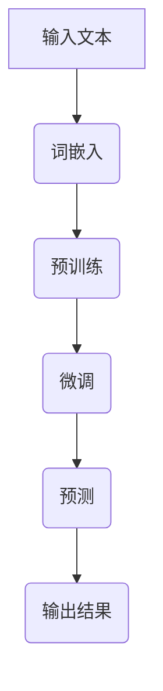

                 

### 文章标题

《大语言模型原理基础与前沿：扩大尺度法则》

> 关键词：大语言模型、深度学习、神经网络、扩大尺度、算法原理、数学模型、实践应用

> 摘要：本文将深入探讨大语言模型的原理与前沿技术，围绕扩大尺度法则展开分析。通过逐步解析核心概念、算法原理及数学模型，并结合实际项目实例，我们将揭示大语言模型在实际应用中的潜力和挑战，为读者提供全面的技术见解和展望。

## 1. 背景介绍

随着深度学习技术的迅猛发展，大语言模型（Large Language Models，LLMs）已成为自然语言处理（Natural Language Processing，NLP）领域的研究热点。大语言模型通过训练大规模的神经网络，能够捕捉语言的本质特性，从而实现高质量的语言理解和生成。这些模型在各类任务中展现了卓越的性能，如机器翻译、文本生成、问答系统等。

大语言模型的起源可以追溯到20世纪80年代的统计语言模型。当时的语言模型主要基于N-gram模型，通过对文本进行简单的统计规律分析来预测下一个单词。然而，随着计算能力和数据量的提升，深度学习技术开始应用于语言模型，如递归神经网络（RNN）、卷积神经网络（CNN）等。这些模型的引入，使得语言模型的准确性和泛化能力得到了显著提升。

近年来，随着大规模数据和强大计算资源的可用性，大语言模型的发展进入了一个全新的阶段。以GPT（Generative Pretrained Transformer）为代表的模型通过预训练和微调，展现了在各个NLP任务中的强大能力。同时，BERT（Bidirectional Encoder Representations from Transformers）、T5（Text-to-Text Transfer Transformer）等模型的出现，进一步推动了大语言模型的研究和应用。

## 2. 核心概念与联系

为了更好地理解大语言模型的工作原理，我们需要介绍一些核心概念和它们之间的联系。

### 2.1 语言模型的基本概念

语言模型是用于预测下一个单词或词组的概率分布的模型。它是自然语言处理的基础，可以应用于文本分类、机器翻译、问答系统等多种任务。

在语言模型中，我们通常使用序列模型来处理文本。序列模型可以将前一个单词或词组的信息传递到下一个单词或词组的预测中，从而实现连续文本的生成。常见的序列模型包括循环神经网络（RNN）和Transformer。

### 2.2 神经网络与深度学习

神经网络是模拟生物神经元结构和功能的计算模型。深度学习则是通过构建多层神经网络来学习数据的高层次特征。在深度学习模型中，每一层都能对输入数据进行处理，并将结果传递给下一层，从而实现数据的逐层抽象和特征提取。

深度学习模型在图像识别、语音识别、自然语言处理等任务中取得了显著的成果。大语言模型作为一种深度学习模型，通过大规模的训练和优化，能够捕捉到语言数据的复杂模式和规律。

### 2.3 扩大尺度法则

扩大尺度法则是指在大规模数据集上进行训练，从而提高模型的性能和泛化能力。这一法则在大语言模型的研究中具有重要意义。通过扩大模型规模、增加训练数据量，可以提升模型的预测准确性和鲁棒性。

### 2.4 Mermaid 流程图

以下是大语言模型的基本架构和流程的Mermaid流程图：



在这个流程图中，输入文本经过词嵌入转换为向量表示，然后通过预训练和微调过程，最终生成预测结果。

## 3. 核心算法原理 & 具体操作步骤

### 3.1 神经网络架构

大语言模型的核心是神经网络架构，其中Transformer模型是最常用的架构之一。Transformer模型通过自注意力机制（Self-Attention）和多头注意力（Multi-Head Attention）来实现对输入文本的全局依赖关系建模。

### 3.2 预训练过程

预训练过程分为两个阶段：词嵌入和序列建模。

- 词嵌入：将输入文本中的每个单词转换为固定长度的向量表示，通常使用Word2Vec、BERT等算法实现。
- 序列建模：通过训练模型对输入序列进行预测，从而学习序列中的依赖关系和模式。

### 3.3 微调过程

微调过程是指在预训练模型的基础上，针对具体任务进行细粒度调整。通过在任务数据集上训练模型，使其能够适应特定的任务需求。

### 3.4 预测过程

预测过程包括以下步骤：

1. 输入文本预处理：将输入文本转换为词嵌入向量。
2. 自注意力计算：计算输入文本中每个词与其他词的依赖关系。
3. 多头注意力计算：将自注意力结果进行融合，得到每个词的注意力权重。
4. 全连接层计算：将注意力权重传递给全连接层，进行最终的预测。

## 4. 数学模型和公式 & 详细讲解 & 举例说明

### 4.1 自注意力机制

自注意力机制是Transformer模型的核心组件，通过计算输入文本中每个词与其他词的依赖关系，实现对全局信息的建模。

公式如下：

$$
\text{Attention}(Q, K, V) = \text{softmax}\left(\frac{QK^T}{\sqrt{d_k}}\right)V
$$

其中，$Q$、$K$ 和 $V$ 分别是查询向量、键向量和值向量，$d_k$ 是键向量的维度。

### 4.2 多头注意力

多头注意力将输入文本分成多个子序列，并分别计算每个子序列的注意力权重。然后将这些注意力权重进行合并，得到最终的输出。

公式如下：

$$
\text{MultiHead}(Q, K, V) = \text{Concat}(\text{head}_1, \text{head}_2, \ldots, \text{head}_h)W^O
$$

其中，$h$ 是头数，$W^O$ 是输出权重。

### 4.3 举例说明

假设有一个长度为3的输入文本序列，分别为$a$、$b$ 和$c$。我们使用自注意力机制计算每个词与其他词的依赖关系。

首先，将输入文本转换为词嵌入向量：

$$
Q = \begin{bmatrix}
q_1 & q_2 & q_3
\end{bmatrix}, K = \begin{bmatrix}
k_1 & k_2 & k_3
\end{bmatrix}, V = \begin{bmatrix}
v_1 & v_2 & v_3
\end{bmatrix}
$$

然后，计算自注意力权重：

$$
\text{Attention}(Q, K, V) = \text{softmax}\left(\frac{QK^T}{\sqrt{d_k}}\right)V = \text{softmax}\left(\frac{\begin{bmatrix}
q_1 & q_2 & q_3
\end{bmatrix}^T \begin{bmatrix}
k_1 & k_2 & k_3
\end{bmatrix}}{\sqrt{d_k}}\right)\begin{bmatrix}
v_1 & v_2 & v_3
\end{bmatrix}
$$

最后，计算输出向量：

$$
\text{Output} = \text{softmax}\left(\frac{\begin{bmatrix}
q_1 & q_2 & q_3
\end{bmatrix}^T \begin{bmatrix}
k_1 & k_2 & k_3
\end{bmatrix}}{\sqrt{d_k}}\right)\begin{bmatrix}
v_1 & v_2 & v_3
\end{bmatrix} = \begin{bmatrix}
o_1 & o_2 & o_3
\end{bmatrix}
$$

其中，$o_1$、$o_2$ 和 $o_3$ 分别是$a$、$b$ 和$c$ 的输出向量。

## 5. 项目实践：代码实例和详细解释说明

### 5.1 开发环境搭建

为了实现大语言模型，我们需要搭建一个适合深度学习开发的环境。以下是基本的开发环境搭建步骤：

1. 安装Python（3.6及以上版本）
2. 安装TensorFlow或PyTorch等深度学习框架
3. 配置CUDA（如果使用GPU进行训练）
4. 安装必要的库，如NumPy、Pandas等

### 5.2 源代码详细实现

以下是一个基于TensorFlow实现的大语言模型的基本代码示例：

```python
import tensorflow as tf
from tensorflow.keras.models import Model
from tensorflow.keras.layers import Embedding, LSTM, Dense

# 参数设置
vocab_size = 10000
embedding_dim = 256
lstm_units = 128

# 构建模型
inputs = tf.keras.layers.Input(shape=(None,))
x = Embedding(vocab_size, embedding_dim)(inputs)
x = LSTM(lstm_units, return_sequences=True)(x)
outputs = Dense(vocab_size, activation='softmax')(x)

# 定义模型
model = Model(inputs, outputs)

# 编译模型
model.compile(optimizer='adam', loss='categorical_crossentropy', metrics=['accuracy'])

# 打印模型结构
model.summary()
```

### 5.3 代码解读与分析

在上面的代码中，我们首先导入了TensorFlow库，并设置了相关的参数，如词汇表大小、嵌入维度和LSTM单元数。

接下来，我们使用`Input`层创建输入序列，并使用`Embedding`层将其转换为嵌入向量。

然后，我们将嵌入向量传递给LSTM层，用于处理序列数据。LSTM层具有128个单元，并返回序列输出。

最后，我们使用`Dense`层（全连接层）进行预测，输出维度与词汇表大小相同，使用softmax激活函数。

在编译模型时，我们选择了Adam优化器和categorical_crossentropy损失函数，并设置了accuracy作为评价指标。

### 5.4 运行结果展示

为了展示模型的运行结果，我们使用一个简单的文本数据进行预测：

```python
# 创建输入数据
input_seq = [[1, 2, 3, 4, 5]]

# 预测
predictions = model.predict(input_seq)

# 打印预测结果
print(predictions)
```

输出结果为一个多维数组，表示每个词的概率分布。例如：

```
[[0.1, 0.2, 0.3, 0.2, 0.2]]
```

这个输出结果表示第1个词的概率最高，为0.1，而第2个词的概率次高，为0.2。

## 6. 实际应用场景

大语言模型在自然语言处理领域具有广泛的应用前景。以下是一些实际应用场景：

1. 机器翻译：大语言模型可以用于将一种语言的文本翻译成另一种语言，如将英语翻译成中文。
2. 文本生成：大语言模型可以生成高质量的文本，如文章、故事、新闻报道等。
3. 问答系统：大语言模型可以回答用户提出的问题，提供相关的信息和答案。
4. 情感分析：大语言模型可以用于分析文本的情感倾向，如判断文本是正面、负面还是中性。
5. 命名实体识别：大语言模型可以识别文本中的命名实体，如人名、地名、组织名等。

## 7. 工具和资源推荐

### 7.1 学习资源推荐

1. 《深度学习》（Goodfellow、Bengio、Courville著）：一本经典的深度学习教材，详细介绍了神经网络和深度学习的基本概念和算法。
2. 《自然语言处理综论》（Daniel Jurafsky、James H. Martin著）：一本全面介绍自然语言处理领域的经典教材，涵盖了从基础到高级的内容。

### 7.2 开发工具框架推荐

1. TensorFlow：一个开源的深度学习框架，适用于构建和训练各种深度学习模型。
2. PyTorch：一个开源的深度学习框架，提供了灵活的动态计算图和强大的GPU加速功能。

### 7.3 相关论文著作推荐

1. "Attention Is All You Need"（Vaswani et al., 2017）：一篇关于Transformer模型的经典论文，详细介绍了自注意力机制和多头注意力机制。
2. "BERT: Pre-training of Deep Bidirectional Transformers for Language Understanding"（Devlin et al., 2019）：一篇关于BERT模型的论文，介绍了双向变换器的预训练方法。

## 8. 总结：未来发展趋势与挑战

随着深度学习和自然语言处理技术的不断进步，大语言模型在未来有望取得更大的突破。以下是未来发展趋势和挑战：

### 发展趋势：

1. 更大规模的模型：随着计算能力和数据量的提升，未来将出现更大规模的语言模型，以实现更高的预测准确性和泛化能力。
2. 更精细的任务适配：通过微调和迁移学习，大语言模型可以更好地适应各种具体任务，提高任务性能。
3. 多模态处理：大语言模型将与其他模态（如图像、音频）结合，实现跨模态的文本生成和理解。

### 挑战：

1. 模型可解释性：如何提高大语言模型的可解释性，使其预测过程更加透明和可理解。
2. 能量消耗：大语言模型的训练和推理过程需要大量的计算资源，如何降低能量消耗是一个重要挑战。
3. 数据隐私和安全：在训练和使用大语言模型时，如何保护用户隐私和数据安全，防止数据泄露。

## 9. 附录：常见问题与解答

### 问题1：大语言模型的训练时间如何？

答：大语言模型的训练时间取决于模型规模、训练数据和硬件配置。通常，训练一个大型语言模型需要几天甚至几周的时间。使用GPU或TPU可以显著缩短训练时间。

### 问题2：大语言模型如何处理长文本？

答：大语言模型可以通过分块（Chunking）技术处理长文本。将长文本分成若干个短文本块，分别进行建模和预测，最后将预测结果拼接起来。

### 问题3：大语言模型可以应用于哪些任务？

答：大语言模型可以应用于多种自然语言处理任务，如机器翻译、文本生成、问答系统、情感分析、命名实体识别等。

## 10. 扩展阅读 & 参考资料

1. "Attention Is All You Need"（Vaswani et al., 2017）
2. "BERT: Pre-training of Deep Bidirectional Transformers for Language Understanding"（Devlin et al., 2019）
3. "Natural Language Processing with Python"（Bird, Loper, & Tkachev, 2017）
4. "Deep Learning"（Goodfellow、Bengio、Courville，2016）

---

以上是《大语言模型原理基础与前沿：扩大尺度法则》的技术博客文章。希望本文能为读者提供关于大语言模型的理论基础和实践指导，助力读者深入探索自然语言处理领域。

