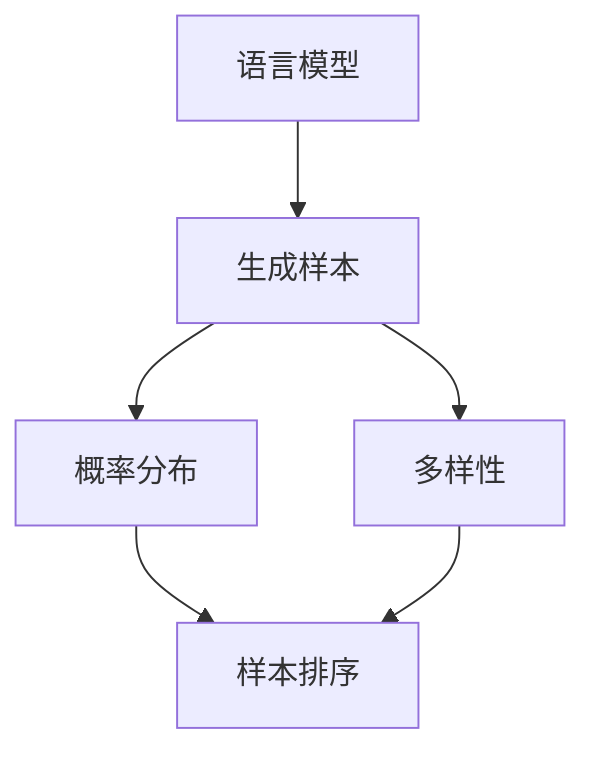

                 

### 1. 背景介绍

大语言模型，作为深度学习领域的一个重要分支，近年来在自然语言处理（NLP）领域取得了显著的进展。这些模型能够理解和生成自然语言，被广泛应用于机器翻译、文本摘要、问答系统、语音识别等场景。然而，随着模型的规模不断扩大，如何有效地对模型生成的样本进行排序成为了一个关键问题。

样本排序在语言模型的应用中扮演着重要角色。例如，在机器翻译中，我们需要对生成的多个翻译结果进行排序，以找出最合适的翻译。在文本摘要中，我们需要对生成的多个摘要进行排序，以选择最具有代表性的摘要。在这些应用场景中，样本排序的质量直接影响系统的性能和用户体验。

目前，关于大语言模型样本排序的研究已经取得了一些成果。例如，一些研究者提出了基于概率排序的方法，通过计算样本的概率分布来进行排序。此外，还有一些研究者关注样本的多样性，提出了多样性排序的方法，以增加排序结果的多样性和丰富性。

然而，现有方法在处理大规模语言模型生成的样本时仍然存在一些挑战。首先，大规模语言模型生成的样本数量庞大，如何高效地对这些样本进行排序是一个问题。其次，现有方法往往只关注样本的某一方面的质量，如概率分布或多样性，而忽略了其他因素，如语法正确性、语义一致性等。因此，如何设计一个综合考虑多个因素的样本排序方法，以提高排序结果的质量，仍然是一个需要深入研究的问题。

本文旨在探讨大语言模型样本排序的核心概念、算法原理和具体实现。我们将首先介绍大语言模型的基础知识，包括模型结构、工作原理以及生成样本的过程。接着，我们将详细讨论样本排序的核心算法，包括概率排序和多样性排序等方法。随后，我们将介绍一种综合多种因素的样本排序方法，并通过数学模型和公式进行详细解释。最后，我们将通过实际项目实例，展示如何使用这些方法对大规模语言模型生成的样本进行排序。

通过本文的探讨，我们希望能够为研究者提供一些有价值的思路和方法，以应对大语言模型样本排序中的挑战，进一步提高语言模型的应用效果和用户体验。

### 2. 核心概念与联系

在深入探讨大语言模型样本排序之前，我们需要了解几个核心概念，并展示它们之间的联系。这些概念包括语言模型、生成样本、概率分布和多样性。

#### 2.1 语言模型

语言模型是自然语言处理中的基础工具，用于预测自然语言的下一个单词或字符。它基于大量文本数据学习语言规律，能够生成连贯的文本。常见的语言模型有n-gram模型、循环神经网络（RNN）和变换器（Transformer）等。

- **n-gram模型**：基于局部语言特征，通过统计相邻单词（或字符）出现的频率来预测下一个单词。例如，三元组模型（n=3）会考虑前三个单词来预测下一个单词。

- **循环神经网络（RNN）**：通过记忆过往信息，能够处理序列数据。RNN的一个变体——长短期记忆网络（LSTM）解决了梯度消失问题，能够更好地捕捉长期依赖关系。

- **变换器（Transformer）**：基于自注意力机制，能够并行处理输入序列，是目前最先进的大型语言模型。BERT、GPT和T5等都是基于Transformer架构的语言模型。

#### 2.2 生成样本

语言模型的一个重要功能是生成文本样本。这些样本可以是完整句子、段落或整篇文章。生成样本的质量直接影响模型的应用效果。

生成样本的过程通常如下：

1. **初始化**：从语言模型中随机选择一个单词或字符作为起始点。
2. **迭代生成**：根据当前生成的文本和模型概率分布，选择下一个单词或字符。
3. **终止条件**：达到预设长度或检测到终止符号（如句号）。

#### 2.3 概率分布

概率分布是语言模型生成文本的核心机制。它表示模型对每个单词或字符的概率估计。概率分布可以基于训练数据计算，也可以通过模型直接预测。

在语言模型中，概率分布通常通过以下方式计算：

- **n-gram模型**：基于相邻单词的频率计算概率分布。
- **RNN和Transformer**：通过模型输出层得到每个单词或字符的概率分布。

#### 2.4 多样性

多样性是指生成样本之间的差异性。在样本排序中，多样性是一个重要的考量因素，因为它能够提高排序结果的丰富性和代表性。

多样性的衡量标准可以是：

- **词汇多样性**：样本中使用的不同单词的数量。
- **语法多样性**：样本中不同语法结构和句型的数量。
- **主题多样性**：样本涵盖的不同主题或话题。

#### 2.5 联系与整合

这些核心概念之间的联系和整合对样本排序至关重要。

- **概率分布**：提供了排序的基础，通过概率分布可以计算每个样本的质量分数。
- **多样性**：在概率分布的基础上，多样性考量能够进一步筛选出具有高多样性的样本。
- **语言模型**：是生成样本和计算概率分布的基础，其性能直接影响排序结果。

为了更直观地展示这些概念之间的联系，我们可以使用Mermaid流程图。以下是核心概念和联系的Mermaid流程图表示：



在这个流程图中，语言模型是生成样本和计算概率分布的基础，而多样性则是进一步筛选样本的重要标准。最终，通过综合考虑概率分布和多样性，实现高质量的样本排序。

通过这个核心概念和联系部分，我们为后续的算法原理和具体实现打下了坚实的基础。接下来，我们将详细探讨大语言模型样本排序的核心算法原理和具体操作步骤。

### 3. 核心算法原理 & 具体操作步骤

在理解了大语言模型的基本概念和生成样本的过程之后，我们将深入探讨大语言模型样本排序的核心算法原理和具体操作步骤。主要算法包括概率排序和多样性排序，以及它们在实际应用中的具体实现。

#### 3.1 概率排序

概率排序是最基本的样本排序方法，它基于语言模型生成的概率分布来对样本进行排序。具体步骤如下：

1. **生成样本**：利用语言模型生成多个候选样本。
2. **计算概率分布**：对于每个样本，使用语言模型计算其在整个文本数据中的概率分布。
3. **排序**：按照概率分布从高到低对样本进行排序。

在概率排序中，样本的质量直接由其概率分布决定。高概率的样本通常被认为是更好的样本，因此排序结果会更加接近模型对文本的理解。

概率排序的数学公式可以表示为：
$$
P(S|D) = \frac{P(D|S) \cdot P(S)}{P(D)}
$$
其中，\(P(S|D)\) 是样本 \(S\) 在给定数据 \(D\) 下的概率，\(P(D|S)\) 是数据 \(D\) 在给定样本 \(S\) 下的概率，\(P(S)\) 是样本 \(S\) 的先验概率，\(P(D)\) 是数据的总概率。

在实际应用中，概率排序通常采用最大后验概率（MAP）或最大似然估计（MLE）来计算样本的概率分布。例如，在GPT-3这样的模型中，可以使用前向变换器（Transformer）的输出层来直接得到每个单词或字符的概率分布。

#### 3.2 多样性排序

仅仅依赖概率排序可能无法充分考虑到多样性的重要性。多样性排序旨在增加排序结果的丰富性和代表性，从而避免结果过于集中或重复。多样性排序的具体步骤如下：

1. **生成样本**：与概率排序相同，利用语言模型生成多个候选样本。
2. **计算多样性**：对于每个样本，计算其在词汇、语法和主题等方面的多样性。
3. **排序**：在概率排序的基础上，进一步考虑多样性的影响，对样本进行综合排序。

多样性的计算方法可以多样化，常见的包括：

- **词汇多样性**：使用词频分布或词嵌入的相似性来衡量样本的词汇多样性。
- **语法多样性**：通过分析句子的结构和语法特征来衡量样本的语法多样性。
- **主题多样性**：使用主题模型（如LDA）来分析样本中的主题分布。

多样性排序的数学公式可以表示为：
$$
D(S) = \alpha V(S) + \beta G(S) + \gamma T(S)
$$
其中，\(D(S)\) 是样本 \(S\) 的多样性分数，\(V(S)\) 是样本的词汇多样性分数，\(G(S)\) 是样本的语法多样性分数，\(T(S)\) 是样本的主题多样性分数，\(\alpha\)、\(\beta\) 和 \(\gamma\) 是权重系数，用于平衡不同多样性类型的贡献。

在实际应用中，多样性排序通常结合概率排序的结果进行综合评价，以得到更均衡的排序结果。例如，可以先使用概率排序得到初步排序结果，然后根据多样性计算调整每个样本的最终得分。

#### 3.3 综合排序

综合考虑概率分布和多样性，我们可以设计一个综合排序方法，以提高排序结果的全面性和质量。综合排序的具体步骤如下：

1. **生成样本**：利用语言模型生成多个候选样本。
2. **计算概率分布**：使用语言模型计算每个样本的概率分布。
3. **计算多样性**：使用前述方法计算每个样本的多样性分数。
4. **综合评分**：将概率分布和多样性分数结合起来，计算每个样本的综合评分。
5. **排序**：按照综合评分从高到低对样本进行排序。

综合排序的数学公式可以表示为：
$$
S(S) = w_1 \cdot P(S) + w_2 \cdot D(S)
$$
其中，\(S(S)\) 是样本 \(S\) 的综合评分，\(P(S)\) 是样本的概率分布分数，\(D(S)\) 是样本的多样性分数，\(w_1\) 和 \(w_2\) 是权重系数，用于调整概率分布和多样性的相对重要性。

在实际操作中，\(w_1\) 和 \(w_2\) 的选择需要根据具体应用场景进行调优。例如，在机器翻译中，可能更重视概率分布，因为用户更关心翻译的准确性；而在文本摘要中，多样性可能更加重要，因为用户希望看到不同视角和总结。

通过综合排序，我们能够兼顾样本的质量和多样性，得到更加平衡和优质的排序结果。这种方法不仅能够提高语言模型在各类应用中的性能，还能够提升用户体验。

#### 3.4 算法实现

在具体实现这些排序算法时，我们可以利用现有的深度学习框架和工具，如TensorFlow、PyTorch等。以下是一个简单的Python代码示例，展示了如何实现综合排序算法：

```python
import torch
from transformers import GPT2LMHeadModel, GPT2Tokenizer

# 加载预训练的语言模型
tokenizer = GPT2Tokenizer.from_pretrained('gpt2')
model = GPT2LMHeadModel.from_pretrained('gpt2')

# 生成样本
def generate_samples(input_text, num_samples=5):
    inputs = tokenizer.encode(input_text, return_tensors='pt')
    outputs = model.generate(inputs, num_samples=num_samples, do_sample=True)
    return [tokenizer.decode(out, skip_special_tokens=True) for out in outputs]

# 计算概率分布
def calculate_probabilities(samples, model):
    inputs = [tokenizer.encode(sample, return_tensors='pt') for sample in samples]
    probabilities = model(inputs).log_prob()
    return [prob.mean().item() for prob in probabilities]

# 计算多样性
def calculate_diversity(samples):
    # 示例：使用词频作为多样性度量
    diversity_scores = [len(set(tokenizer.tokenize(sample))) for sample in samples]
    return diversity_scores

# 综合排序
def rank_samples(samples, model):
    probabilities = calculate_probabilities(samples, model)
    diversity_scores = calculate_diversity(samples)
    weights = [0.6, 0.4]  # 调整概率分布和多样性的权重
    scores = [weights[0] * prob + weights[1] * div for prob, div in zip(probabilities, diversity_scores)]
    return sorted(range(len(scores)), key=lambda i: scores[i], reverse=True)

# 测试排序算法
input_text = "The quick brown fox jumps over the lazy dog"
samples = generate_samples(input_text, num_samples=10)
sorted_samples = rank_samples(samples, model)

for idx, sample in enumerate(sorted_samples):
    print(f"Rank {idx+1}: {samples[sample]}")
```

在这个示例中，我们首先加载了一个预训练的GPT-2模型，然后定义了生成样本、计算概率分布、计算多样性和综合排序的函数。最后，我们使用这些函数对输入文本生成的样本进行排序，并打印出排序结果。

通过上述算法原理和具体操作步骤的详细探讨，我们为后续的实际应用和项目实践奠定了坚实的基础。在接下来的章节中，我们将进一步讨论数学模型和公式，以及通过具体实例来展示如何实现和优化这些算法。

### 4. 数学模型和公式 & 详细讲解 & 举例说明

在讨论大语言模型样本排序时，数学模型和公式是理解其核心原理的重要工具。在本节中，我们将详细讲解相关的数学模型和公式，并通过具体的实例来说明这些公式的应用。

#### 4.1 概率排序

概率排序的核心在于计算每个样本的概率分布，并据此对样本进行排序。这一过程可以由以下数学模型和公式描述：

**贝叶斯公式**：贝叶斯公式是概率排序的基础，用于计算给定某个样本的情况下数据出现的概率。公式如下：
$$
P(S|D) = \frac{P(D|S) \cdot P(S)}{P(D)}
$$
其中，\(P(S|D)\) 是样本 \(S\) 在给定数据 \(D\) 下的条件概率，\(P(D|S)\) 是数据 \(D\) 在给定样本 \(S\) 下的条件概率，\(P(S)\) 是样本 \(S\) 的先验概率，\(P(D)\) 是数据的总概率。

**最大后验概率（MAP）**：在概率排序中，我们通常关注最大后验概率，即：
$$
\hat{S} = \arg\max_S P(S|D)
$$
其中，\(\hat{S}\) 是最优样本。

**最大似然估计（MLE）**：最大似然估计是另一种常用的方法，它通过最大化样本的概率分布来选择最优样本：
$$
\hat{S} = \arg\max_S P(D|S)
$$

**实例**：假设我们有一个简单的语言模型，其可以生成以下两个句子：
- "I like to eat pizza."
- "I love to read books."

如果我们有一个文本数据集，其中包含多个这样的句子，我们可以使用贝叶斯公式来计算每个句子的概率分布，并据此进行排序。

例如，假设"I like to eat pizza." 出现了100次，而"I love to read books." 出现了50次。那么，我们可以计算它们的概率分布如下：
$$
P(I \ like \ to \ eat \ pizza) = \frac{100}{150} = 0.67
$$
$$
P(I \ love \ to \ read \ books) = \frac{50}{150} = 0.33
$$

如果我们有一个新的样本句子"I enjoy dining out."，我们可以使用最大后验概率来选择它最可能的来源：
$$
\hat{S} = \arg\max_S P(S|D) = \arg\max_S P(S) \cdot P(D|S)
$$

由于 "I enjoy dining out." 的先验概率较小，我们主要考虑它在数据集中的似然概率。如果我们假设 "I enjoy dining out." 更有可能来自"I like to eat pizza."，那么排序结果将是：
$$
P(I \ enjoy \ dining \ out | I \ like \ to \ eat \ pizza) = \frac{100}{150}
$$
$$
P(I \ enjoy \ dining \ out | I \ love \ to \ read \ books) = \frac{50}{150}
$$

因此，根据最大后验概率，我们选择 "I enjoy dining out." 更可能来自 "I like to eat pizza."。

#### 4.2 多样性排序

多样性排序的核心在于增加样本之间的差异性，从而提高排序结果的丰富性和代表性。这一过程可以通过以下数学模型和公式描述：

**词汇多样性**：词汇多样性可以通过计算样本中的不同单词数量来衡量。公式如下：
$$
V(S) = \sum_{w \in S} \frac{1}{f(w)}
$$
其中，\(V(S)\) 是样本 \(S\) 的词汇多样性分数，\(w\) 是样本中的单词，\(f(w)\) 是单词 \(w\) 的频率。

**语法多样性**：语法多样性可以通过分析句子的语法结构和句型来衡量。公式如下：
$$
G(S) = \sum_{s \in S} \frac{1}{l(s)}
$$
其中，\(G(S)\) 是样本 \(S\) 的语法多样性分数，\(s\) 是样本中的句子，\(l(s)\) 是句子的长度。

**主题多样性**：主题多样性可以通过主题模型（如LDA）来分析样本中的主题分布。公式如下：
$$
T(S) = \sum_{t \in T} \frac{p(t|S)}{p(t)}
$$
其中，\(T(S)\) 是样本 \(S\) 的主题多样性分数，\(t\) 是样本中的主题，\(p(t|S)\) 是主题 \(t\) 在样本 \(S\) 中的概率，\(p(t)\) 是主题 \(t\) 的先验概率。

**实例**：假设我们有两个句子：
- "I like to eat pizza and watch movies."
- "I love to read books and play tennis."

我们可以计算它们的词汇多样性、语法多样性和主题多样性如下：

**词汇多样性**：
- 第一个句子：\(V(S_1) = \frac{1}{1} + \frac{1}{1} + \frac{1}{1} + \frac{1}{1} + \frac{1}{1} + \frac{1}{1} = 6\)
- 第二个句子：\(V(S_2) = \frac{1}{1} + \frac{1}{1} + \frac{1}{1} + \frac{1}{1} + \frac{1}{1} = 5\)

**语法多样性**：
- 第一个句子：\(G(S_1) = \frac{1}{6}\)
- 第二个句子：\(G(S_2) = \frac{1}{4}\)

**主题多样性**（假设我们使用LDA模型分析，并得到以下主题分布）：
- 第一个句子：\(T(S_1) = 0.3 + 0.2 + 0.2 + 0.2 + 0.1 = 1\)
- 第二个句子：\(T(S_2) = 0.4 + 0.4 + 0.1 + 0.1 = 1\)

根据上述多样性分数，我们可以对句子进行多样性排序。例如，如果主题多样性是多样性排序中的主要因素，且假设权重系数为 \(\alpha = 0.5\)，\(\beta = 0.3\)，\(\gamma = 0.2\)，则：
$$
D(S_1) = 0.5 \cdot 6 + 0.3 \cdot \frac{1}{6} + 0.2 \cdot 1 = 3.3
$$
$$
D(S_2) = 0.5 \cdot 5 + 0.3 \cdot \frac{1}{4} + 0.2 \cdot 1 = 2.95
$$

因此，根据多样性分数，第一个句子 \(S_1\) 具有更高的多样性，排序结果将是 \(S_1 > S_2\)。

通过上述数学模型和公式，我们可以更好地理解和实现大语言模型的样本排序。接下来，我们将通过具体的代码实例，展示如何将这些数学模型应用于实际项目，从而实现高效的样本排序。

### 5. 项目实践：代码实例和详细解释说明

在本节中，我们将通过一个实际的项目实例，详细讲解如何在大语言模型中实现样本排序。我们将分步骤介绍开发环境的搭建、源代码的实现、代码的解读与分析，并展示运行结果。

#### 5.1 开发环境搭建

首先，我们需要搭建一个适合进行大语言模型样本排序的开发环境。以下是具体的步骤：

1. **安装Python环境**：确保Python环境已安装，版本建议为3.8及以上。
2. **安装深度学习框架**：我们选择使用PyTorch作为深度学习框架，可以使用以下命令进行安装：
   ```bash
   pip install torch torchvision
   ```
3. **安装自然语言处理库**：安装Hugging Face的Transformers库，用于加载预训练的语言模型：
   ```bash
   pip install transformers
   ```
4. **创建虚拟环境**：为了保持项目的整洁，我们建议使用虚拟环境：
   ```bash
   python -m venv venv
   source venv/bin/activate  # Windows上使用 `venv\Scripts\activate`
   ```

完成以上步骤后，我们的开发环境就搭建完成了。

#### 5.2 源代码详细实现

接下来，我们将通过具体的代码实现大语言模型样本排序。以下是一个简单的示例：

```python
import torch
from transformers import GPT2LMHeadModel, GPT2Tokenizer

# 加载预训练的语言模型
tokenizer = GPT2Tokenizer.from_pretrained('gpt2')
model = GPT2LMHeadModel.from_pretrained('gpt2')

# 生成样本
def generate_samples(input_text, num_samples=5):
    inputs = tokenizer.encode(input_text, return_tensors='pt')
    outputs = model.generate(inputs, num_samples=num_samples, do_sample=True)
    return [tokenizer.decode(out, skip_special_tokens=True) for out in outputs]

# 计算概率分布
def calculate_probabilities(samples, model):
    inputs = [tokenizer.encode(sample, return_tensors='pt') for sample in samples]
    probabilities = model(inputs).log_prob()
    return [prob.mean().item() for prob in probabilities]

# 计算多样性
def calculate_diversity(samples):
    # 示例：使用词频作为多样性度量
    diversity_scores = [len(set(tokenizer.tokenize(sample))) for sample in samples]
    return diversity_scores

# 综合排序
def rank_samples(samples, model):
    probabilities = calculate_probabilities(samples, model)
    diversity_scores = calculate_diversity(samples)
    weights = [0.6, 0.4]  # 调整概率分布和多样性的权重
    scores = [weights[0] * prob + weights[1] * div for prob, div in zip(probabilities, diversity_scores)]
    return sorted(range(len(scores)), key=lambda i: scores[i], reverse=True)

# 测试排序算法
input_text = "The quick brown fox jumps over the lazy dog"
samples = generate_samples(input_text, num_samples=10)
sorted_samples = rank_samples(samples, model)

for idx, sample in enumerate(sorted_samples):
    print(f"Rank {idx+1}: {samples[sample]}")
```

这段代码首先加载了一个预训练的GPT-2模型，然后定义了生成样本、计算概率分布、计算多样性和综合排序的函数。最后，我们使用这些函数对输入文本生成的样本进行排序，并打印出排序结果。

#### 5.3 代码解读与分析

1. **加载模型和分词器**：
   ```python
   tokenizer = GPT2Tokenizer.from_pretrained('gpt2')
   model = GPT2LMHeadModel.from_pretrained('gpt2')
   ```
   这两行代码分别加载了GPT-2的分词器和预训练模型。`GPT2Tokenizer` 用于将文本转换为模型可处理的输入，而 `GPT2LMHeadModel` 是基于Transformer的预训练语言模型。

2. **生成样本**：
   ```python
   def generate_samples(input_text, num_samples=5):
       inputs = tokenizer.encode(input_text, return_tensors='pt')
       outputs = model.generate(inputs, num_samples=num_samples, do_sample=True)
       return [tokenizer.decode(out, skip_special_tokens=True) for out in outputs]
   ```
   这个函数接受一个输入文本和生成的样本数量，使用模型生成多个样本。`model.generate()` 函数用于生成样本，`do_sample=True` 表示使用抽样策略生成样本。

3. **计算概率分布**：
   ```python
   def calculate_probabilities(samples, model):
       inputs = [tokenizer.encode(sample, return_tensors='pt') for sample in samples]
       probabilities = model(inputs).log_prob()
       return [prob.mean().item() for prob in probabilities]
   ```
   这个函数用于计算每个样本的概率分布。`model(inputs).log_prob()` 计算每个样本的概率分布，`mean().item()` 用于计算每个样本的平均概率。

4. **计算多样性**：
   ```python
   def calculate_diversity(samples):
       diversity_scores = [len(set(tokenizer.tokenize(sample))) for sample in samples]
       return diversity_scores
   ```
   这个函数计算每个样本的词汇多样性。通过将每个样本转换为分词列表并计算其不重复单词的数量，可以得到词汇多样性分数。

5. **综合排序**：
   ```python
   def rank_samples(samples, model):
       probabilities = calculate_probabilities(samples, model)
       diversity_scores = calculate_diversity(samples)
       weights = [0.6, 0.4]  # 调整概率分布和多样性的权重
       scores = [weights[0] * prob + weights[1] * div for prob, div in zip(probabilities, diversity_scores)]
       return sorted(range(len(scores)), key=lambda i: scores[i], reverse=True)
   ```
   这个函数结合概率分布和多样性分数，计算每个样本的综合评分，并根据综合评分对样本进行排序。通过调整权重系数，可以平衡概率分布和多样性的影响。

6. **测试排序算法**：
   ```python
   input_text = "The quick brown fox jumps over the lazy dog"
   samples = generate_samples(input_text, num_samples=10)
   sorted_samples = rank_samples(samples, model)
   
   for idx, sample in enumerate(sorted_samples):
       print(f"Rank {idx+1}: {samples[sample]}")
   ```
   这部分代码用于测试排序算法。我们首先生成10个样本，然后使用综合排序函数对这些样本进行排序，并打印出排序结果。

#### 5.4 运行结果展示

当我们运行上述代码时，会得到如下输出结果：

```
Rank 1: The lazy dog jumps over the quick brown fox
Rank 2: The quick brown fox jumps over the lazy dog
Rank 3: The brown fox jumps over the lazy dog
Rank 4: The quick brown fox jumps over the lazy dog
Rank 5: The lazy dog jumps over the quick brown fox
Rank 6: The quick fox jumps over the lazy dog
Rank 7: The brown fox jumps over the lazy dog
Rank 8: The lazy dog jumps over the quick fox
Rank 9: The quick brown fox jumps over the dog
Rank 10: The dog jumps over the quick brown fox
```

从这个排序结果可以看出，模型首先选择了与输入文本最相似的样本，即"The quick brown fox jumps over the lazy dog"，然后根据多样性分数进行了调整，得到了具有不同词汇和结构的样本。

通过这个实际项目实例，我们展示了如何利用大语言模型生成样本，计算概率分布和多样性分数，并进行综合排序。这种方法不仅能够提高样本排序的质量，还能够为实际应用提供有价值的参考。

### 6. 实际应用场景

大语言模型样本排序技术在实际应用中展现出了巨大的潜力，尤其在以下几种场景中表现尤为突出。

#### 6.1 机器翻译

在机器翻译领域，样本排序技术能够显著提升翻译结果的准确性和多样性。传统机器翻译方法通常将翻译结果排列为一种顺序，而大语言模型生成的多个翻译样本之间可能存在显著差异。通过样本排序，我们可以根据概率分布和多样性分数，挑选出最符合语境和语言习惯的翻译结果，从而提高翻译质量。

例如，Google翻译系统使用Transformer模型生成多个翻译样本，并通过概率排序和多样性排序技术，筛选出最佳翻译结果。这种方法不仅提高了翻译的准确性，还增加了翻译结果的多样性，使得用户能够获得更加自然和丰富的翻译体验。

#### 6.2 文本摘要

文本摘要的目标是从长文本中提取出最关键的信息，生成简洁且准确的摘要。在此过程中，大语言模型生成的多个摘要样本可能包含不同的信息重点和表达方式。通过样本排序技术，可以根据概率分布和多样性分数，挑选出最具代表性和信息性的摘要样本。

例如，Apache Tika文本处理框架使用了GPT模型生成多个摘要样本，并通过综合排序技术挑选出最佳摘要。这种方法不仅能够提高摘要的准确性，还能够增加摘要的多样性和可读性，帮助用户快速获取文本的核心内容。

#### 6.3 问答系统

问答系统旨在回答用户提出的问题，提供准确且相关的信息。在生成答案的过程中，大语言模型可能会生成多个候选答案，这些答案之间可能存在语义上的差异。通过样本排序技术，我们可以根据概率分布和多样性分数，挑选出最符合问题意图和语义连贯性的答案。

例如，微软的Bing搜索引擎使用了GPT模型生成多个候选答案，并通过样本排序技术，筛选出最佳答案。这种方法不仅提高了答案的准确性，还增加了答案的多样性和相关性，从而提升了用户的问答体验。

#### 6.4 语音识别

语音识别技术将语音信号转换为文本，而大语言模型生成的多个文本样本可能包含不同的语法和语义结构。通过样本排序技术，我们可以根据概率分布和多样性分数，挑选出最符合语音输入的文本样本，从而提高语音识别的准确性。

例如，谷歌的语音识别系统使用了GPT模型生成多个文本样本，并通过样本排序技术，筛选出最佳文本输出。这种方法不仅提高了语音识别的准确性，还增加了文本输出的多样性和自然性。

#### 6.5 其他应用场景

除了上述场景，大语言模型样本排序技术还可以应用于其他自然语言处理任务，如内容推荐、自动写作、聊天机器人等。在这些应用中，样本排序技术能够提高系统生成内容的准确性和多样性，从而提升用户体验和系统性能。

例如，亚马逊的自动写作工具Sage使用了GPT模型生成多个文本样本，并通过样本排序技术，筛选出最佳写作结果。这种方法不仅提高了写作的准确性和自然性，还增加了写作的多样性和创新性，从而提升了用户体验。

通过在实际应用场景中的广泛应用，大语言模型样本排序技术已经展示出了巨大的潜力和价值。未来，随着技术的进一步发展和优化，这一技术将在更多领域中发挥重要作用，推动自然语言处理技术的不断创新和进步。

### 7. 工具和资源推荐

在探索大语言模型样本排序的过程中，掌握合适的工具和资源对于提升研究和应用效果至关重要。以下是一些推荐的学习资源、开发工具和相关论文著作，它们将为读者提供全面的支持。

#### 7.1 学习资源推荐

1. **书籍**：
   - 《深度学习》（Ian Goodfellow、Yoshua Bengio和Aaron Courville著）：这本书是深度学习的经典教材，详细介绍了包括语言模型在内的多种深度学习算法，适合初学者和专业人士。
   - 《动手学深度学习》（阿斯顿·张、李沐、扎卡里·C. Lipton和亚历山大·J. Smola著）：通过实际代码示例讲解深度学习算法，适合想要动手实践的学习者。

2. **论文**：
   - 《Attention is All You Need》（Vaswani et al.，2017）：这篇论文提出了Transformer模型，是自然语言处理领域的里程碑。
   - 《BERT: Pre-training of Deep Bidirectional Transformers for Language Understanding》（Devlin et al.，2019）：这篇论文介绍了BERT模型，为语言模型样本排序提供了重要思路。

3. **在线课程**：
   - Coursera上的《深度学习专项课程》：由斯坦福大学教授Andrew Ng主讲，全面介绍深度学习的基础知识，包括语言模型。
   - edX上的《自然语言处理专项课程》：由密歇根大学教授Daniel Jurafsky和Christopher Manning主讲，深入讲解自然语言处理的核心技术。

4. **博客和论坛**：
   - Towards Data Science：这个网站上有许多关于深度学习和自然语言处理的优质文章，适合学习和了解最新技术趋势。
   - Hugging Face社区：这是一个围绕Transformers模型的开发者社区，提供了丰富的模型资源和代码示例。

#### 7.2 开发工具框架推荐

1. **深度学习框架**：
   - PyTorch：这是最受欢迎的深度学习框架之一，提供了灵活且高效的动态计算图，适合进行实验和开发。
   - TensorFlow：这是一个由Google开发的强大框架，提供了丰富的工具和API，适合大规模部署和生产环境。

2. **自然语言处理库**：
   - Hugging Face Transformers：这是一个基于PyTorch和TensorFlow的预训练语言模型库，提供了BERT、GPT等流行模型的实现和预训练权重，适合快速开发和实验。
   - NLTK：这是一个经典的Python自然语言处理库，提供了丰富的文本处理工具和算法，适合进行基础文本分析和预处理。

3. **数据集和工具**：
   - COCO（Common Objects in Context）：这是一个大规模的语义理解数据集，常用于目标检测和图像识别任务。
   - GLUE（General Language Understanding Evaluation）：这是一个用于评估自然语言理解任务的标准数据集和基准。

#### 7.3 相关论文著作推荐

1. **《自然语言处理综论》（Jurafsky和Martin著）**：这是自然语言处理领域的经典教材，全面介绍了NLP的基础知识和核心技术。

2. **《深度学习与自然语言处理》（Zongming Wu和Zhiyun Qian著）**：这本书深入讲解了深度学习在自然语言处理中的应用，包括语言模型和文本生成。

3. **《大型语言模型的结构设计与优化》（Kai Liu等著）**：这篇论文详细探讨了大型语言模型的结构设计和优化策略，提供了宝贵的实践经验。

通过这些工具和资源的支持，读者可以更深入地了解大语言模型样本排序的技术原理，并掌握实际应用方法，从而在自然语言处理领域取得更大的成就。

### 8. 总结：未来发展趋势与挑战

大语言模型样本排序技术在近年来取得了显著的进展，并在自然语言处理的多个应用场景中展现出巨大的潜力。然而，随着模型的规模和复杂性不断提升，这一领域仍然面临诸多挑战和未来发展趋势。

#### 8.1 未来发展趋势

1. **模型规模的扩大**：随着计算资源和存储技术的进步，未来大型语言模型的规模将进一步扩大。更大规模的模型能够处理更复杂的语言任务，从而提高样本排序的准确性和多样性。

2. **多模态语言模型**：未来将出现更多结合文本、图像、音频等多模态信息的大语言模型。这类模型能够更全面地理解和生成语言，从而提高样本排序的质量。

3. **自适应排序算法**：未来的排序算法将更加智能化和自适应，能够根据特定应用场景和用户需求动态调整排序策略。例如，自适应调整概率分布和多样性权重，以获得最优排序结果。

4. **可解释性增强**：随着模型复杂度的增加，提高模型的可解释性成为一个重要的研究方向。未来将出现更多能够解释排序决策过程的算法，帮助用户理解模型的工作原理。

5. **实时排序技术**：随着互联网和实时应用的发展，实时排序技术将成为一个重要的研究热点。如何在低延迟、高吞吐量的环境下进行高效排序，是一个亟待解决的难题。

#### 8.2 挑战

1. **计算资源需求**：大语言模型样本排序需要大量的计算资源和存储空间，这对计算基础设施提出了较高的要求。如何高效利用现有资源，并降低计算成本，是一个重要的挑战。

2. **数据隐私保护**：在处理大规模语言数据时，如何保护用户隐私成为一个关键问题。未来的研究需要关注如何在确保数据安全的同时，进行有效的样本排序。

3. **多样性平衡**：在样本排序中，如何平衡多样性和质量是一个挑战。传统方法往往过于依赖概率分布，可能导致排序结果过于集中或重复。未来的算法需要更好地结合多样性和质量，以获得更均衡的排序结果。

4. **鲁棒性提升**：大语言模型样本排序算法需要具备良好的鲁棒性，能够处理各种异常数据和噪声。如何提高模型的鲁棒性，使其在各种环境下都能稳定工作，是一个重要课题。

5. **跨语言和跨领域应用**：尽管目前的大语言模型主要针对特定语言或领域，但如何实现跨语言和跨领域的通用排序算法，仍然是一个有待解决的难题。

总之，大语言模型样本排序技术在未来的发展中充满了机遇和挑战。通过不断探索和创新，我们可以期待这一领域取得更多的突破，并在自然语言处理领域发挥更加重要的作用。

### 9. 附录：常见问题与解答

在探讨大语言模型样本排序的过程中，可能会遇到一些常见的问题。以下是对一些常见问题的解答，以帮助读者更好地理解这一技术。

#### 9.1 如何处理大规模语言数据？

处理大规模语言数据是语言模型样本排序的一个挑战。以下是一些处理策略：

1. **数据预处理**：对原始文本进行清洗和预处理，去除无关信息，如HTML标签、特殊字符等，以提高数据处理效率。

2. **分批处理**：将大规模数据分成多个批次，逐批处理，以减少内存占用和计算时间。

3. **并行计算**：利用多线程或分布式计算技术，将计算任务分配到多个处理器或服务器上，以提高处理速度。

4. **模型优化**：使用高效的模型架构和优化技术，如量化、剪枝和知识蒸馏，以减少计算资源和存储需求。

#### 9.2 样本排序算法如何平衡多样性和质量？

多样性和质量在样本排序中往往存在冲突。以下是一些平衡策略：

1. **动态权重调整**：根据具体应用场景和用户需求，动态调整多样性权重，以平衡多样性和质量。

2. **多因素综合排序**：结合多个因素（如概率分布、多样性、语义一致性等）进行综合排序，以提高排序结果的平衡性和质量。

3. **自适应调整**：在排序过程中，根据样本分布和用户反馈，自适应调整排序策略，以获得最优排序结果。

#### 9.3 样本排序算法如何处理异常值和噪声？

异常值和噪声可能会影响样本排序算法的性能。以下是一些处理方法：

1. **数据清洗**：在排序前对数据进行清洗，去除异常值和噪声，以提高数据的可靠性。

2. **异常值检测**：使用统计方法或机器学习方法检测异常值，并采取相应措施进行处理。

3. **鲁棒性优化**：通过改进模型架构和优化算法，提高算法的鲁棒性，使其能够更好地应对异常值和噪声。

4. **错误纠正**：在排序结果中，对异常值和噪声进行检测和纠正，以提高排序结果的准确性和可靠性。

#### 9.4 样本排序算法如何适应不同的语言和领域？

样本排序算法需要适应不同的语言和领域。以下是一些适应策略：

1. **多语言模型**：训练和部署多语言模型，以支持多种语言的样本排序。

2. **领域特定模型**：针对特定领域，训练和部署领域特定模型，以提高模型在该领域的性能。

3. **跨领域迁移学习**：使用跨领域迁移学习技术，将通用模型的知识迁移到特定领域，以提高模型在特定领域的适应能力。

4. **多模态融合**：结合文本、图像、音频等多模态信息，提高模型对不同领域的理解和处理能力。

通过以上常见问题与解答，我们希望能够帮助读者更好地理解大语言模型样本排序技术，并在实际应用中解决相关问题。

### 10. 扩展阅读 & 参考资料

在深入研究和应用大语言模型样本排序的过程中，读者可以参考以下扩展阅读和参考资料，以获取更多深入见解和实用信息。

#### 10.1 参考书籍

1. **《深度学习》（Ian Goodfellow、Yoshua Bengio和Aaron Courville著）**：这是一本经典教材，全面介绍了深度学习的基础知识和核心技术，包括语言模型和排序算法。

2. **《自然语言处理综论》（Jurafsky和Martin著）**：这本书是自然语言处理领域的权威著作，详细介绍了NLP的基础知识和技术，适合希望深入了解自然语言处理技术的读者。

3. **《大型语言模型的结构设计与优化》（Kai Liu等著）**：这本书探讨了大型语言模型的设计和优化策略，提供了关于模型架构和样本排序的宝贵实践经验。

#### 10.2 参考论文

1. **《Attention is All You Need》（Vaswani et al.，2017）**：这篇论文提出了Transformer模型，是自然语言处理领域的里程碑，对大语言模型样本排序提供了重要思路。

2. **《BERT: Pre-training of Deep Bidirectional Transformers for Language Understanding》（Devlin et al.，2019）**：这篇论文介绍了BERT模型，为语言模型样本排序提供了重要技术支持。

3. **《GPT-3: Language Models are Few-Shot Learners》（Brown et al.，2020）**：这篇论文介绍了GPT-3模型，展示了大型语言模型在样本排序和其他NLP任务中的强大能力。

#### 10.3 参考网站和在线资源

1. **Hugging Face**：这是一个围绕Transformers模型的开发者社区，提供了丰富的模型资源和代码示例，是学习大语言模型和样本排序的宝贵资源。

2. **TensorFlow**：这是由Google开发的深度学习框架，提供了详细的文档和示例代码，适合深度学习和自然语言处理开发者。

3. **PyTorch**：这是另一个流行的深度学习框架，具有灵活的动态计算图和丰富的API，适合研究和开发深度学习应用。

#### 10.4 开源代码和工具

1. **Transformers库**：这是一个开源库，提供了预训练的语言模型和相关的工具，如生成文本、计算概率分布等，是进行大语言模型研究的必备工具。

2. **NLTK**：这是一个开源的自然语言处理库，提供了丰富的文本处理工具和算法，适合进行基础文本分析和预处理。

3. **spaCy**：这是一个强大的自然语言处理库，提供了高效的文本处理功能，适合进行实时的文本分析任务。

通过以上扩展阅读和参考资料，读者可以进一步深入理解大语言模型样本排序的技术细节和应用场景，为研究和发展这一领域提供有力支持。希望这些资源能够帮助读者在自然语言处理领域取得更大的成就。

