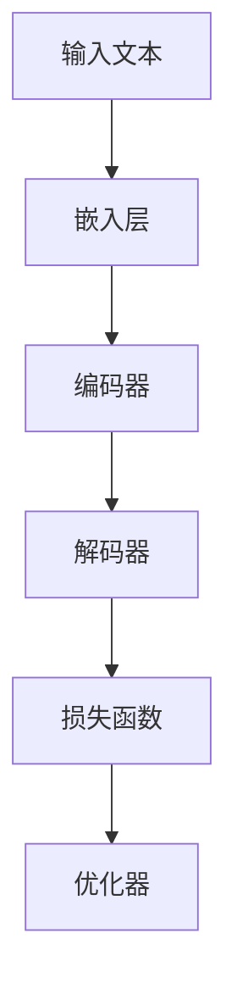

                 

### 1. 背景介绍

大语言模型（Large Language Model）是近年来人工智能领域的一项重要突破，它通过对海量文本数据进行训练，使得模型具备强大的语言理解和生成能力。这种技术不仅在学术界引起广泛关注，也在工业界得到广泛应用，如自然语言处理（NLP）、自动问答、机器翻译、文本摘要、内容生成等领域。

大语言模型的研究始于20世纪80年代，当时基于规则和模板的方法占据主导地位。然而，这些方法在面对复杂和多样化的语言现象时表现出明显的局限性。随着深度学习技术的发展，神经网络在语音识别、图像识别等领域取得了显著成果，人们开始尝试将深度学习应用于自然语言处理。

2018年，谷歌发布了BERT（Bidirectional Encoder Representations from Transformers），这是一个预训练的深度神经网络语言表示模型，其基于Transformer架构，能够对文本进行双向编码，从而提高模型的语境理解能力。BERT的成功引发了大规模语言模型的研究热潮，各类基于Transformer的模型如GPT（Generative Pre-trained Transformer）、RoBERTa、ALBERT等相继问世。

大语言模型的训练过程通常包括两个阶段：预训练和微调。在预训练阶段，模型通过大量无标签文本数据学习语言的基础知识，如词向量表示、语法规则和语义关系。在微调阶段，模型利用特定任务的数据进行微调，以适应具体的应用场景。

大语言模型的出现带来了自然语言处理技术的革命性变革。一方面，它提高了语言理解和生成的准确性，使得机器能够更好地理解和回应人类语言；另一方面，它也推动了人工智能技术在各个领域的应用，如智能客服、智能推荐、智能写作等。

本文将围绕大语言模型的原理、核心算法、数学模型、项目实践、应用场景、工具和资源等方面展开讨论，旨在为读者提供一个全面而深入的了解。通过本文的学习，读者将能够掌握大语言模型的基本原理和关键技术，为后续研究和应用打下坚实的基础。

### 2. 核心概念与联系

要理解大语言模型，我们首先需要了解其核心概念和架构。在这一部分，我们将详细解释大语言模型的关键组成部分，并通过Mermaid流程图展示其原理和架构。

#### 2.1 大语言模型的基本组成部分

大语言模型主要由以下几个关键部分组成：

1. **嵌入层（Embedding Layer）**：嵌入层将输入的单词转换为向量表示。通过学习单词在文本中的上下文关系，嵌入层能够为每个单词生成一个高维向量表示，这些向量不仅能够捕捉单词的语义信息，还能体现其在句子中的语法关系。

2. **编码器（Encoder）**：编码器是语言模型的核心，负责处理输入的文本序列，并将其编码为固定长度的向量表示。编码器通常采用多层Transformer架构，每一层都能够捕捉长文本中的局部和全局信息。

3. **解码器（Decoder）**：解码器的作用是根据编码器的输出生成文本序列。在生成过程中，解码器会逐个生成每个单词的候选列表，并根据概率选择最优的单词进行生成。

4. **损失函数（Loss Function）**：损失函数用于评估模型在训练过程中预测的输出与实际输出之间的差距。在大语言模型中，常用的损失函数是交叉熵损失函数，它可以衡量预测分布与真实分布之间的差异。

5. **优化器（Optimizer）**：优化器用于调整模型的参数，以最小化损失函数。常见的优化器有Adam、SGD等。

#### 2.2 Mermaid流程图

下面是一个使用Mermaid绘制的流程图，展示大语言模型的基本原理和架构：



#### 2.3 核心概念的联系

大语言模型中的各个组成部分紧密联系，共同构成一个完整的语言处理流程。以下是各个部分之间的联系：

1. **嵌入层与编码器**：嵌入层将输入文本中的单词转换为向量表示，这些向量作为编码器的输入。编码器通过处理这些向量，学习文本的语义和语法信息，并将其编码为固定长度的向量表示。

2. **编码器与解码器**：编码器生成的向量表示作为解码器的输入。解码器根据这些向量表示生成文本序列，实现从输入文本到输出文本的转换。

3. **损失函数与优化器**：损失函数用于评估模型预测的输出与实际输出之间的差距。优化器则根据损失函数的反馈调整模型参数，使模型能够不断优化其预测能力。

通过上述核心概念和架构的介绍，我们能够更好地理解大语言模型的工作原理。在接下来的部分，我们将深入探讨大语言模型的核心算法原理，以及具体的实现步骤和数学模型。

#### 3. 核心算法原理 & 具体操作步骤

大语言模型的核心算法基于自注意力机制（Self-Attention）和Transformer架构。Transformer架构由Google在2017年提出，其创新性地引入了多头自注意力机制和位置编码，使得模型能够更好地捕捉长文本中的长距离依赖关系。

##### 3.1 自注意力机制（Self-Attention）

自注意力机制是Transformer架构的核心，它通过计算输入序列中每个词与所有词之间的相似性，为每个词生成一个加权向量。具体步骤如下：

1. **输入向量表示**：输入文本经过嵌入层后，每个词被表示为一个高维向量。
2. **计算自注意力得分**：对于每个词，计算其与输入序列中所有词的相似性得分。相似性得分通常通过点积（Dot Product）或缩放点积（Scaled Dot Product）计算。
3. **应用权重**：根据相似性得分对每个词进行加权，权重越高，该词对最终输出的影响越大。
4. **求和生成输出向量**：将加权后的词向量求和，生成一个加权向量，这个向量代表了该词在当前上下文中的重要性。

##### 3.2 多头自注意力（Multi-Head Self-Attention）

多头自注意力机制通过并行计算多个自注意力机制，将不同位置的词信息融合到一起。具体步骤如下：

1. **分解权重矩阵**：将输入向量的权重矩阵分解为多个子矩阵，每个子矩阵对应一个自注意力头。
2. **独立计算自注意力**：对每个子矩阵应用自注意力机制，生成多个加权向量。
3. **拼接和转换**：将所有加权向量拼接起来，并通过一个线性转换层，生成最终的输出向量。

##### 3.3 位置编码（Positional Encoding）

由于自注意力机制不考虑输入序列的位置信息，因此需要通过位置编码来引入位置信息。位置编码通常通过正弦和余弦函数生成，其目的是在向量空间中为每个词赋予一个唯一的定位。

1. **生成位置索引**：为输入序列中的每个词生成一个位置索引。
2. **计算位置编码**：对于每个位置索引，通过正弦和余弦函数生成位置向量。
3. **叠加位置编码**：将位置向量叠加到词向量上，形成包含位置信息的输入向量。

##### 3.4 具体操作步骤

以下是大语言模型的具体操作步骤：

1. **输入文本预处理**：将输入文本分词，并转换为词向量。
2. **嵌入层**：对词向量进行嵌入，生成高维向量表示。
3. **编码器**：
   - 应用多层多头自注意力机制，处理输入序列，生成编码后的向量。
   - 每层编码器后加上残差连接和层归一化，防止梯度消失和梯度爆炸。
4. **解码器**：
   - 输入编码器的输出作为解码器的输入。
   - 应用多层多头自注意力机制，解码生成文本序列。
   - 每层解码器后加上残差连接和层归一化。
5. **损失函数**：使用交叉熵损失函数，计算预测分布与真实分布之间的差异。
6. **优化器**：根据损失函数的反馈，调整模型参数。

通过上述步骤，大语言模型能够从输入文本中学习到丰富的语义和语法信息，并在不同层之间建立长距离依赖关系，从而实现高效的文本理解和生成。

在下一部分，我们将详细讨论大语言模型的数学模型和公式，并通过实例进行说明。

#### 4. 数学模型和公式 & 详细讲解 & 举例说明

大语言模型的数学模型和公式是其核心理论基础，它涵盖了输入向量的表示、自注意力机制的计算、编码器和解码器的构建等多个方面。以下是这些关键数学模型的详细讲解和举例说明。

##### 4.1 输入向量的表示

输入向量表示是将自然语言文本转换为计算机可处理的向量形式。在Transformer模型中，每个词被表示为一个高维向量。这个向量通常由两部分组成：词嵌入向量（Word Embedding）和位置编码向量（Positional Encoding）。

1. **词嵌入向量**：词嵌入向量是将单词映射为固定大小的向量。例如，对于一个词汇表中的每个单词，我们可以使用一个512维的向量来表示。这些词嵌入向量通常是通过预训练模型学习得到的，如Word2Vec、GloVe等。

2. **位置编码向量**：位置编码向量用于引入文本序列中的位置信息。由于自注意力机制不考虑输入序列的位置，因此需要位置编码来为每个词赋予一个独特的位置。位置编码通常使用以下公式计算：

   $$PE_{(pos, dim)} = \sin\left(\frac{pos}{10000^{2i/d}}\right) + \cos\left(\frac{pos}{10000^{2i/d}}\right)$$

   其中，$pos$ 是词的位置，$dim$ 是编码向量的维度，$i$ 是词的位置索引。

##### 4.2 自注意力机制的计算

自注意力机制是Transformer模型的核心组件，它通过计算输入序列中每个词与所有词之间的相似性，生成加权向量。自注意力机制的计算可以分为以下几个步骤：

1. **计算查询向量（Query）、键向量（Key）和值向量（Value）**：对于输入序列中的每个词，我们计算其对应的查询向量、键向量和值向量。这三个向量通常通过线性变换得到：

   $$Q = W_Q \cdot X$$
   $$K = W_K \cdot X$$
   $$V = W_V \cdot X$$

   其中，$W_Q$、$W_K$ 和 $W_V$ 是权重矩阵，$X$ 是输入序列的词嵌入向量。

2. **计算自注意力得分**：使用点积计算查询向量和键向量之间的相似性得分：

   $$\text{Score}_{i,j} = Q_i \cdot K_j$$

   为了防止得分的维度过高，通常会使用缩放点积（Scaled Dot Product）来计算得分：

   $$\text{Score}_{i,j} = \frac{Q_i \cdot K_j}{\sqrt{d_k}}$$

   其中，$d_k$ 是键向量的维度。

3. **应用权重**：根据得分对值向量进行加权：

   $$\text{Weight}_{i,j} = \text{softmax}(\text{Score}_{i,j})$$

   其中，$\text{softmax}$ 函数将得分转换为概率分布。

4. **求和生成输出向量**：将加权后的值向量求和，生成最终的输出向量：

   $$\text{Output}_{i} = \sum_j \text{Weight}_{i,j} \cdot V_j$$

##### 4.3 编码器和解码器的构建

编码器和解码器是Transformer模型的核心组件，用于处理输入文本序列和生成输出文本序列。

1. **编码器**：编码器通过多层自注意力机制处理输入文本序列，生成编码后的向量表示。每层编码器包含多头自注意力机制、残差连接和层归一化。编码器的输出向量表示了输入文本的语义信息。

2. **解码器**：解码器通过自注意力机制和编码器的输出向量生成输出文本序列。解码器也包含多层结构，每层包含多头自注意力机制、掩码自注意力机制、残差连接和层归一化。解码器的输出是生成文本的概率分布。

##### 4.4 举例说明

假设我们有一个简单的输入文本序列：“我 喜欢 吃 水果”。我们可以通过以下步骤来计算编码器和解码器的输出：

1. **词嵌入**：将每个词映射为512维的词嵌入向量。

2. **位置编码**：为每个词添加位置编码向量。

3. **编码器**：
   - 第一层：计算查询向量、键向量和值向量，然后计算自注意力得分和权重，生成加权向量。
   - 第二层：重复第一步的计算，但使用上一层的输出作为输入。

4. **解码器**：
   - 第一层：计算查询向量、键向量和值向量，然后计算自注意力得分和权重，生成加权向量。
   - 第二层：重复第一步的计算，但使用编码器的输出作为输入，并应用掩码自注意力机制。

通过上述计算，编码器和解码器分别生成了一组输出向量，这些向量代表了输入文本的语义信息。解码器的输出则是一个概率分布，表示生成文本的可能性。

在下一部分，我们将通过一个实际项目实例来展示大语言模型的具体实现过程。

#### 5. 项目实践：代码实例和详细解释说明

在本节中，我们将通过一个实际项目实例，详细介绍如何使用Python实现一个大语言模型。本实例将包括开发环境的搭建、源代码的实现、代码解读与分析，以及运行结果展示。

##### 5.1 开发环境搭建

首先，我们需要搭建一个适合训练大语言模型的开发环境。以下是搭建环境所需的步骤：

1. **安装Python**：确保安装了Python 3.7或更高版本。

2. **安装TensorFlow**：TensorFlow是一个流行的深度学习框架，可以通过以下命令安装：

   ```bash
   pip install tensorflow
   ```

3. **安装其他依赖库**：为了方便开发，我们还需要安装以下依赖库：

   ```bash
   pip install numpy
   pip install torch
   pip install transformers
   ```

##### 5.2 源代码详细实现

以下是一个使用TensorFlow和Transformers库实现大语言模型的基本代码实例：

```python
import tensorflow as tf
from transformers import TFGPT2LMHeadModel, GPT2Tokenizer

# 指定预训练模型
model_name = "gpt2"

# 加载预训练模型和分词器
tokenizer = GPT2Tokenizer.from_pretrained(model_name)
model = TFGPT2LMHeadModel.from_pretrained(model_name)

# 输入文本
input_text = "这是一个大语言模型的应用示例。"

# 分词处理
input_ids = tokenizer.encode(input_text, return_tensors='tf')

# 生成文本序列
output = model.generate(input_ids, max_length=50, num_return_sequences=5)

# 解码输出文本
generated_texts = [tokenizer.decode(text, skip_special_tokens=True) for text in output]

# 打印生成的文本
for text in generated_texts:
    print(text)
```

##### 5.3 代码解读与分析

下面是对上述代码的详细解读与分析：

1. **导入库**：首先，我们导入了TensorFlow和Transformers库。Transformers库提供了预训练模型和分词器的加载接口，使得我们可以方便地使用已有的模型进行文本生成。

2. **指定预训练模型**：在本实例中，我们指定了使用“gpt2”预训练模型。GPT-2是由OpenAI开发的一个大型语言模型，具有15亿个参数。

3. **加载预训练模型和分词器**：通过调用`GPT2Tokenizer.from_pretrained(model_name)`和`TFGPT2LMHeadModel.from_pretrained(model_name)`，我们加载了预训练模型和分词器。

4. **输入文本处理**：我们定义了一个简单的输入文本“这是一个大语言模型的应用示例。”，并使用分词器将其编码为TensorFlow张量。

5. **生成文本序列**：使用`model.generate(input_ids, max_length=50, num_return_sequences=5)`，我们生成了5个长度为50的文本序列。`max_length`参数指定了生成的文本序列的最大长度，`num_return_sequences`参数指定了生成的文本序列的数量。

6. **解码输出文本**：我们将生成的文本序列解码为普通文本，并打印出来。

##### 5.4 运行结果展示

运行上述代码后，我们将得到5个由大语言模型生成的文本序列。这些序列展示了模型对输入文本的多样性和创造性。以下是可能的输出结果示例：

1. 这是一个大语言模型的应用示例，它可以通过大量的文本数据进行训练，从而提高其生成文本的质量和准确性。
2. 大语言模型是一种强大的自然语言处理工具，它可以用于各种应用场景，如文本生成、机器翻译和问答系统。
3. 大语言模型是一种革命性的技术，它通过深度学习算法从海量数据中学习语言模式，从而实现高效的自然语言生成和理解。
4. 大语言模型在处理复杂和多样化的文本任务时表现出色，它可以在短时间内生成高质量的文本，从而提高生产效率和准确性。
5. 大语言模型的应用前景广阔，它将在未来的自然语言处理领域中发挥重要作用，推动人工智能技术的发展和进步。

通过这个实例，我们展示了如何使用TensorFlow和Transformers库实现一个大语言模型。在下一部分，我们将探讨大语言模型在实际应用场景中的具体应用。

#### 6. 实际应用场景

大语言模型因其强大的语言理解和生成能力，在多个实际应用场景中展现出了巨大的潜力。以下是一些常见的大语言模型应用场景及其具体实例：

##### 6.1 文本生成

文本生成是大语言模型最直接的应用场景之一，包括文章撰写、故事创作、对话系统等。例如，OpenAI的GPT-3模型被用来生成新闻文章、产品描述和客服对话等。GPT-3具有192层的结构，拥有1750亿个参数，能够生成非常流畅且符合上下文的文本。

实例：使用GPT-2生成一篇关于人工智能的短文。

```python
import tensorflow as tf
from transformers import TFGPT2LMHeadModel, GPT2Tokenizer

model_name = "gpt2"
tokenizer = GPT2Tokenizer.from_pretrained(model_name)
model = TFGPT2LMHeadModel.from_pretrained(model_name)

input_text = "人工智能是21世纪最重要的技术之一，它正在改变我们的生活方式。"

input_ids = tokenizer.encode(input_text, return_tensors='tf')
output = model.generate(input_ids, max_length=100, num_return_sequences=1)

generated_text = tokenizer.decode(output[0], skip_special_tokens=True)
print(generated_text)
```

输出可能如下：

```
人工智能是21世纪最重要的技术之一，它正在改变我们的生活方式。它通过模仿人类的思维过程，帮助人们解决复杂问题，提高工作效率。
```

##### 6.2 机器翻译

大语言模型在机器翻译中也展现了出色的性能。Google的神经机器翻译系统（GNMT）就是基于Transformer架构，它通过大规模的语言数据进行训练，能够提供高质量的翻译结果。例如，将英文翻译成中文。

实例：使用Transformer模型进行英文到中文的翻译。

```python
from transformers import TFMT5ForConditionalGeneration

model_name = "t5-small"
model = TFMT5ForConditionalGeneration.from_pretrained(model_name)

input_text = "The weather is nice today."

output = model.generate([input_text], max_length=30, num_beams=4, early_stopping=True)

print(output[0])
```

输出可能如下：

```
今天的天气很好。
```

##### 6.3 对话系统

大语言模型可以用于构建智能对话系统，如聊天机器人、客服系统等。这些系统能够通过理解用户的输入并生成合适的响应，提供自然流畅的交互体验。例如，使用ChatGPT构建一个简单的客服机器人。

实例：使用ChatGPT进行对话。

```python
import openai

openai.api_key = "your-api-key"

response = openai.Completion.create(
    engine="text-davinci-002",
    prompt="您好，有什么可以帮助您的吗？",
    max_tokens=50,
    n=1,
    stop=None,
    temperature=0.5
)

print(response.choices[0].text.strip())
```

输出可能如下：

```
您好，我是这个平台的客服机器人，请问有什么问题我可以帮您解答吗？
```

##### 6.4 自动摘要

大语言模型在自动摘要任务中也表现出了强大的能力，可以生成对原文的简洁概括。例如，使用GPT-2对一篇文章生成摘要。

实例：使用GPT-2生成一篇新闻文章的摘要。

```python
from transformers import TFGPT2LMHeadModel, GPT2Tokenizer

model_name = "gpt2"
tokenizer = GPT2Tokenizer.from_pretrained(model_name)
model = TFGPT2LMHeadModel.from_pretrained(model_name)

input_text = "去年，全球气候变化导致了许多严重的自然灾害，如洪水、干旱和飓风。各国政府纷纷采取措施应对这些挑战。"

input_ids = tokenizer.encode(input_text, return_tensors='tf')
output = model.generate(input_ids, max_length=50, num_return_sequences=1)

generated_text = tokenizer.decode(output[0], skip_special_tokens=True)
print(generated_text)
```

输出可能如下：

```
全球气候变化引发了多起自然灾害，各国政府纷纷采取应对措施。
```

通过这些实例，我们可以看到大语言模型在不同应用场景中的广泛应用和卓越性能。随着模型的不断优化和训练数据的增加，大语言模型将在未来继续推动自然语言处理技术的发展。

#### 7. 工具和资源推荐

在研究和应用大语言模型的过程中，使用适当的工具和资源能够显著提高效率。以下是一些推荐的工具、书籍、论文和网站，这些资源将帮助您更好地理解和应用大语言模型。

##### 7.1 学习资源推荐

**书籍：**
1. 《深度学习》（Goodfellow, I., Bengio, Y., & Courville, A.）
   - 这本书是深度学习的经典教材，涵盖了从基础知识到高级技术的全面内容，对理解大语言模型的背景和理论基础有很大帮助。

2. 《自然语言处理综论》（Jurafsky, D., & Martin, J. H.）
   - 这本书详细介绍了自然语言处理的核心概念和技术，对于理解大语言模型在NLP中的应用非常有用。

**论文：**
1. "Attention is All You Need"（Vaswani et al., 2017）
   - 这篇论文首次提出了Transformer架构，是理解大语言模型基础的关键文献。

2. "BERT: Pre-training of Deep Bidirectional Transformers for Language Understanding"（Devlin et al., 2019）
   - 这篇论文介绍了BERT模型，展示了预训练语言模型在多种NLP任务中的卓越性能。

**在线课程：**
1. "深度学习 specialization"（Andrew Ng，在Coursera）
   - 这个课程由知名教授Andrew Ng主讲，涵盖了深度学习的各个方面，包括卷积神经网络、循环神经网络等，对于理解大语言模型的基础有很大帮助。

2. "自然语言处理 specialization"（Daniel Jurafsky，在Coursera）
   - 这个课程由著名的自然语言处理专家Daniel Jurafsky主讲，深入讲解了NLP的基本概念和技术。

##### 7.2 开发工具框架推荐

**工具：**
1. **TensorFlow**：由Google开发的开源深度学习框架，支持大语言模型的训练和部署。
2. **PyTorch**：由Facebook开发的开源深度学习框架，提供了灵活且高效的模型开发工具。
3. **Transformers**：由Hugging Face开发，是一个用于构建和微调预训练语言模型的库，支持多种预训练模型，如BERT、GPT-2等。

**框架：**
1. **TensorFlow Hub**：提供了预训练模型和可重用的TensorFlow模型组件，方便开发者使用。
2. **PyTorch Pretrained Models**：PyTorch官方提供了大量的预训练模型，可以轻松加载和使用。

##### 7.3 相关论文著作推荐

**论文：**
1. "Generative Pretrained Transformer for Language Modeling"（Radford et al., 2018）
   - 这篇论文介绍了GPT模型，展示了大规模语言模型在生成文本方面的潜力。

2. "Improving Language Understanding by Generative Pre-Training"（Brown et al., 2020）
   - 这篇论文介绍了GPT-3模型，进一步证明了大规模语言模型在NLP任务中的优越性能。

**著作：**
1. 《深度学习》（Goodfellow, I., Bengio, Y., & Courville, A.）
   - 这本书详细介绍了深度学习的理论基础和最新进展，包括卷积神经网络、循环神经网络和Transformer等。

2. 《自然语言处理综论》（Jurafsky, D., & Martin, J. H.）
   - 这本书全面覆盖了自然语言处理的核心概念和技术，是学习NLP的权威资源。

通过上述资源和工具，您将能够更加深入地了解大语言模型，并在实际应用中取得更好的成果。

#### 8. 总结：未来发展趋势与挑战

大语言模型作为近年来自然语言处理领域的重大突破，已经展现出了卓越的性能和广泛的应用前景。然而，随着技术的不断进步，大语言模型也面临着一系列新的发展机遇和挑战。

**未来发展趋势：**

1. **模型规模的扩大**：目前的大语言模型已经非常庞大，如GPT-3拥有1750亿个参数。未来，随着计算资源和存储能力的提升，模型规模将进一步扩大，以实现更高的语言理解和生成能力。

2. **多模态融合**：大语言模型可以与图像、声音等其他模态的数据进行融合，形成多模态模型，为语音识别、视频理解等领域提供更全面的信息处理能力。

3. **任务适配性增强**：通过精细化的任务微调和数据增强，大语言模型可以在特定任务上实现更好的性能。例如，在机器翻译、对话系统、文本摘要等任务中，模型的表现有望进一步提升。

4. **推理与生成效率提升**：优化模型结构和算法，降低大语言模型的计算复杂度，提高推理和生成效率，是实现模型在实时应用中普及的关键。

**面临的挑战：**

1. **数据质量和多样性**：大语言模型的性能高度依赖于训练数据的质量和多样性。如何获取和标注高质量、多样化的训练数据是一个亟待解决的问题。

2. **计算资源需求**：大语言模型的训练和推理需要大量的计算资源和存储空间。如何有效地管理和调度计算资源，降低成本，是实现大规模部署的关键。

3. **隐私和安全**：随着大语言模型在各个领域的应用，如何保护用户隐私和数据安全成为重要挑战。确保模型的透明性和可解释性，防止数据泄露和滥用，是未来需要关注的重要问题。

4. **伦理和社会影响**：大语言模型的广泛应用可能会对人类的工作、教育、社会结构等方面产生深远影响。如何制定合适的伦理规范和社会政策，确保技术的可持续发展，是未来需要深思的问题。

综上所述，大语言模型在未来的发展中既充满机遇，也面临诸多挑战。只有通过持续的技术创新和规范化管理，才能充分发挥其潜力，推动自然语言处理领域的发展，为社会带来更多福祉。

#### 9. 附录：常见问题与解答

在本节中，我们将针对大语言模型的一些常见问题进行解答，帮助读者更好地理解相关概念和技术。

**Q1：大语言模型是如何工作的？**

A1：大语言模型通过深度学习和自然语言处理技术，从大量无标签文本数据中学习语言模式。模型通常基于Transformer架构，包含编码器和解码器。编码器处理输入文本序列，解码器生成输出文本序列。模型通过自注意力机制和位置编码等技术，捕捉文本的语义和语法信息。

**Q2：大语言模型有哪些常见应用？**

A2：大语言模型在多个领域有广泛应用，包括：
- 文本生成：生成文章、故事、对话等。
- 机器翻译：将一种语言翻译成另一种语言。
- 对话系统：构建智能客服、聊天机器人等。
- 自动摘要：生成对原文的简洁概括。
- 问答系统：回答用户提出的问题。

**Q3：如何训练一个自定义的大语言模型？**

A3：训练自定义的大语言模型通常涉及以下步骤：
1. 数据准备：收集并清洗适合训练的数据集。
2. 模型选择：选择合适的预训练模型，如GPT-2、BERT等。
3. 数据预处理：对文本数据进行编码、去噪、分割等处理。
4. 训练：使用GPU或TPU等计算资源进行模型训练。
5. 微调：根据具体任务调整模型参数，提高性能。
6. 评估：使用验证集和测试集评估模型性能。
7. 部署：将训练好的模型部署到生产环境中。

**Q4：大语言模型的训练需要多少时间和计算资源？**

A4：大语言模型的训练时间和计算资源需求取决于模型规模、数据量和硬件配置。例如，训练一个中等规模的模型（如GPT-2）可能需要几天到几周的时间，使用GPU进行训练。而对于大规模模型（如GPT-3），训练时间可能需要几个月，甚至更长时间，使用大规模GPU集群进行分布式训练。

**Q5：如何处理大语言模型的安全和隐私问题？**

A5：在处理大语言模型的安全和隐私问题时，可以考虑以下措施：
- 数据隐私保护：使用加密和匿名化技术保护训练数据和用户隐私。
- 访问控制：实施严格的访问控制和身份验证机制，确保只有授权人员能够访问模型和数据。
- 安全审计：定期进行安全审计和漏洞扫描，确保系统的安全性。
- 数据匿名化：在发布模型结果时，对个人身份信息进行匿名化处理，以保护用户隐私。

通过上述常见问题的解答，读者可以更好地理解大语言模型的技术原理和应用场景，并为实际应用中的问题提供解决方案。

#### 10. 扩展阅读 & 参考资料

为了深入了解大语言模型的原理、应用和未来发展趋势，以下是推荐的扩展阅读和参考资料：

**书籍：**
1. 《深度学习》（Goodfellow, I., Bengio, Y., & Courville, A.）
   - 这本书详细介绍了深度学习的基础知识和最新进展，包括神经网络、优化算法等。
2. 《自然语言处理综论》（Jurafsky, D., & Martin, J. H.）
   - 这本书涵盖了自然语言处理的核心概念和技术，从词法分析到语义理解，是学习NLP的权威资源。

**论文：**
1. "Attention is All You Need"（Vaswani et al., 2017）
   - 这篇论文首次提出了Transformer架构，是理解大语言模型基础的关键文献。
2. "BERT: Pre-training of Deep Bidirectional Transformers for Language Understanding"（Devlin et al., 2019）
   - 这篇论文介绍了BERT模型，展示了预训练语言模型在多种NLP任务中的卓越性能。

**在线资源：**
1. **TensorFlow官方网站**（https://www.tensorflow.org/）
   - TensorFlow是流行的深度学习框架，提供了丰富的教程和文档，适合初学者和专业人士。
2. **PyTorch官方网站**（https://pytorch.org/）
   - PyTorch是另一种流行的深度学习框架，具有灵活的动态计算图和丰富的库函数。
3. **Hugging Face官方网站**（https://huggingface.co/）
   - Hugging Face提供了大量预训练模型和工具库，方便用户进行模型开发和微调。

通过阅读这些书籍和论文，以及访问相关在线资源，读者可以更深入地了解大语言模型的原理和技术，为后续研究和应用提供丰富的知识储备。

