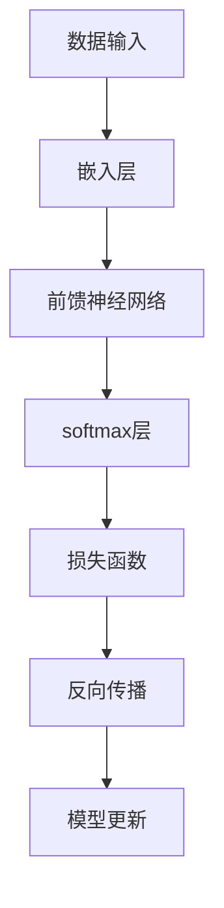
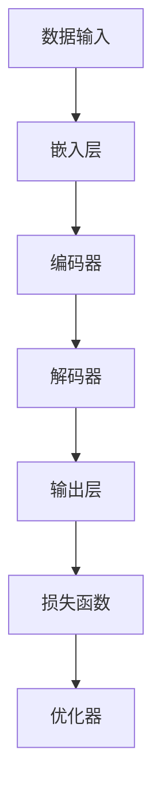
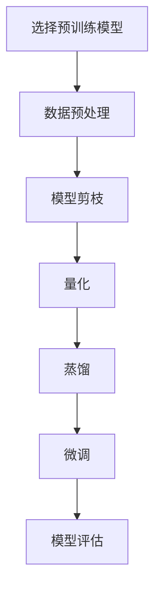

                 

### 大语言模型原理基础与前沿：轻量级微调

#### 关键词：大语言模型、原理基础、前沿、轻量级微调、神经网络、自然语言处理

> 在当今人工智能领域，大语言模型已经成为自然语言处理（NLP）的基石。本文旨在深入探讨大语言模型的原理基础与前沿技术，特别是轻量级微调（Lightweight Fine-Tuning）这一关键方法。我们将通过逐步分析，解析其核心算法、数学模型，并展示实际应用和未来发展趋势。

#### 1. 背景介绍

随着深度学习技术的不断进步，大语言模型（如GPT-3、BERT等）在自然语言处理领域取得了显著的成果。这些模型通过训练大规模语料库，可以生成高质量的自然语言文本，解决了许多复杂的问题，如文本生成、问答系统、机器翻译等。然而，这些大规模模型在训练和部署过程中需要大量的计算资源和时间，这使得其在实际应用中面临着巨大的挑战。

轻量级微调作为一种新兴的技术，旨在通过优化训练策略，降低大规模模型的计算和存储需求，同时保持模型的高性能。这一方法为大规模语言模型的广泛应用提供了新的可能，特别是在资源受限的场景中。

#### 2. 核心概念与联系

为了深入理解轻量级微调，我们需要先了解大语言模型的基本架构和核心概念。以下是一个使用Mermaid绘制的简化的语言模型架构流程图：



- **数据输入**：大语言模型从大量文本数据中提取信息，生成特征向量。
- **嵌入层**：将词汇嵌入到高维空间中，为后续的神经网络处理提供输入。
- **前馈神经网络**：通过多层神经网络对嵌入层输出的特征向量进行处理，提取深层语义信息。
- **softmax层**：将神经网络的输出映射到概率分布，用于预测词汇的概率。
- **损失函数**：衡量模型预测结果与实际结果之间的差距，指导模型更新。
- **反向传播**：通过反向传播算法计算损失函数关于模型参数的梯度，用于模型更新。
- **模型更新**：根据梯度更新模型参数，以优化模型性能。

#### 3. 核心算法原理 & 具体操作步骤

轻量级微调的核心算法主要包括以下步骤：

1. **选择预训练模型**：选择一个在大规模语料库上预训练的成熟模型作为基础模型。
2. **数据预处理**：对目标任务的数据集进行预处理，包括文本清洗、分词、编码等。
3. **数据增强**：通过随机插入、删除、替换等方式增加数据多样性，提高模型的泛化能力。
4. **模型剪枝**：对基础模型进行剪枝，减少模型参数的数量，降低计算复杂度。
5. **特征提取**：从剪枝后的模型中提取关键特征，用于训练轻量级模型。
6. **轻量级模型训练**：使用提取的特征训练轻量级模型，优化模型在特定任务上的性能。
7. **模型评估**：评估轻量级模型在目标任务上的性能，并根据评估结果进行调整。

#### 4. 数学模型和公式 & 详细讲解 & 举例说明

为了更好地理解轻量级微调，我们将使用LaTeX格式介绍相关的数学模型和公式。

1. **嵌入层**：

$$
\text{embed}(x) = \text{WordEmbedding}(x) + \text{PositionalEncoding}(x)
$$

- **WordEmbedding**：将词汇映射到高维空间中的向量。
- **PositionalEncoding**：为序列中的每个词添加位置信息。

2. **前馈神经网络**：

$$
\text{FFN}(x) = \text{激活函数}(\text{线性变换}(\text{激活函数}(\text{线性变换}(x)))
$$

- **线性变换**：将输入映射到新的特征空间。
- **激活函数**：用于引入非线性。

3. **损失函数**：

$$
L(\theta) = -\frac{1}{N}\sum_{i=1}^{N} \sum_{j=1}^{V} y_{ij} \log(p_{ij}(\theta))
$$

- **$y_{ij}$**：目标词的标签向量。
- **$p_{ij}(\theta)$**：模型预测的词汇概率。

#### 5. 项目实践：代码实例和详细解释说明

以下是一个简单的Python代码示例，用于实现轻量级微调：

```python
# 导入必要的库
import tensorflow as tf
from tensorflow.keras.layers import Embedding, LSTM, Dense
from tensorflow.keras.models import Model

# 模型参数
vocab_size = 10000
embed_size = 256
lstm_size = 128
max_sequence_len = 50

# 构建嵌入层
embed = Embedding(vocab_size, embed_size)

# 构建LSTM层
lstm = LSTM(lstm_size, return_sequences=True)

# 构建Dense层
dense = Dense(vocab_size, activation='softmax')

# 构建模型
inputs = tf.keras.layers.Input(shape=(max_sequence_len,))
x = embed(inputs)
x = lstm(x)
outputs = dense(x)

model = Model(inputs=inputs, outputs=outputs)
model.compile(optimizer='adam', loss='categorical_crossentropy', metrics=['accuracy'])

# 模型训练
model.fit(x_train, y_train, epochs=10, batch_size=64)

# 模型评估
loss, accuracy = model.evaluate(x_test, y_test)
print('Test accuracy:', accuracy)
```

- **Embedding层**：将词汇映射到高维空间。
- **LSTM层**：处理序列数据，提取特征。
- **Dense层**：生成词汇概率。

#### 6. 实际应用场景

轻量级微调在许多实际应用场景中具有广泛的应用，如：

- **文本分类**：使用轻量级微调对新闻文章进行分类。
- **问答系统**：使用轻量级微调构建高效的问答系统。
- **机器翻译**：在资源受限的环境中使用轻量级微调进行机器翻译。

#### 7. 工具和资源推荐

- **学习资源**：
  - 《深度学习》
  - 《自然语言处理综论》
  - OpenAI GPT-3 文档
- **开发工具框架**：
  - TensorFlow
  - PyTorch
  - Hugging Face Transformers
- **相关论文著作**：
  - BERT: Pre-training of Deep Bidirectional Transformers for Language Understanding
  - GPT-3: Language Models are few-shot learners

#### 8. 总结：未来发展趋势与挑战

随着深度学习技术的不断发展，大语言模型和轻量级微调将在自然语言处理领域发挥越来越重要的作用。未来，我们将看到更多高效、可扩展的语言模型和微调方法的出现。然而，这也将带来新的挑战，如模型可解释性、隐私保护、资源优化等。

#### 9. 附录：常见问题与解答

- **Q：什么是轻量级微调？**
  **A：轻量级微调是一种通过优化训练策略，降低大规模模型计算和存储需求的技术。**

- **Q：轻量级微调适用于哪些场景？**
  **A：轻量级微调适用于资源受限的场景，如移动设备、嵌入式系统等。**

- **Q：如何选择预训练模型进行轻量级微调？**
  **A：选择预训练模型时，应考虑模型的规模、性能和适用性。**

#### 10. 扩展阅读 & 参考资料

- BERT: https://arxiv.org/abs/1810.04805
- GPT-3: https://arxiv.org/abs/2005.14165
- Hugging Face Transformers: https://huggingface.co/transformers

### 结束语

本文深入探讨了大语言模型的原理基础与前沿技术，特别是轻量级微调方法。通过逐步分析，我们了解了其核心算法、数学模型，以及实际应用。随着技术的不断发展，轻量级微调将在自然语言处理领域发挥更大的作用。让我们继续探索，共同推动人工智能技术的发展。作者：禅与计算机程序设计艺术 / Zen and the Art of Computer Programming。|>### 1. 背景介绍

#### 大语言模型的崛起

近年来，随着深度学习技术的飞速发展，自然语言处理（NLP）领域取得了显著的进步。其中，大语言模型（Large Language Models）的崛起尤为引人注目。这些模型通过学习大规模文本数据，能够生成高质量的自然语言文本，解决了许多复杂的问题，如文本生成、问答系统、机器翻译等。大语言模型的典型代表包括GPT-3、BERT、T5等。

大语言模型的核心在于其庞大的参数量和复杂的架构。这些模型通常包含数十亿甚至数万亿的参数，通过多层神经网络结构，对输入文本进行编码和解码，从而生成对应的输出文本。例如，GPT-3模型拥有1750亿个参数，能够生成连贯、自然的文本，甚至能够模拟人类的写作风格。

#### 轻量级微调的提出

然而，大规模语言模型的训练和部署过程需要巨大的计算资源和时间，这在实际应用中带来了巨大的挑战。特别是在资源受限的场景中，如移动设备、嵌入式系统等，大规模语言模型的应用受到了限制。为了解决这一问题，轻量级微调（Lightweight Fine-Tuning）技术应运而生。

轻量级微调是一种通过优化训练策略，降低大规模模型计算和存储需求的技术。其主要思想是在保留模型性能的前提下，对模型进行剪枝、量化等操作，从而减小模型规模，降低计算复杂度。这样，在资源受限的场景中，用户可以更加高效地部署和使用大语言模型。

#### 轻量级微调的优势

轻量级微调具有以下优势：

1. **降低计算资源需求**：通过剪枝和量化等操作，轻量级微调可以显著降低模型的计算和存储需求，使得大规模语言模型可以在资源受限的设备上运行。
2. **提高部署效率**：轻量级微调使得大规模语言模型的训练和部署过程更加高效，缩短了部署时间，提高了系统的响应速度。
3. **保持模型性能**：尽管轻量级微调会降低模型规模，但通过优化训练策略和模型架构，轻量级微调可以在一定程度上保持模型的性能，甚至在某些任务上有所提升。

#### 应用场景

轻量级微调在许多实际应用场景中具有广泛的应用，如：

1. **移动设备**：在移动设备上，由于计算资源和存储空间的限制，轻量级微调可以使得大规模语言模型的应用变得更加可行。
2. **嵌入式系统**：在嵌入式系统中，如智能音响、智能摄像头等，轻量级微调可以降低模型的计算和存储需求，提高系统的响应速度和稳定性。
3. **实时应用**：在需要实时响应的场景中，如智能客服、智能翻译等，轻量级微调可以缩短模型的响应时间，提高用户体验。

#### 本篇文章的结构

本文将从以下方面深入探讨大语言模型和轻量级微调：

1. **核心概念与联系**：介绍大语言模型的基本架构和核心概念，使用Mermaid流程图展示其关键组件和流程。
2. **核心算法原理 & 具体操作步骤**：详细讲解轻量级微调的核心算法原理，包括选择预训练模型、数据预处理、模型剪枝、特征提取等步骤。
3. **数学模型和公式 & 详细讲解 & 举例说明**：介绍大语言模型相关的数学模型和公式，并通过具体例子进行详细讲解。
4. **项目实践：代码实例和详细解释说明**：提供实际项目的代码实例，详细解释模型搭建、训练和评估的过程。
5. **实际应用场景**：探讨轻量级微调在多个实际应用场景中的应用，如文本分类、问答系统和机器翻译等。
6. **工具和资源推荐**：推荐学习资源、开发工具框架和相关论文著作，帮助读者深入了解相关技术。
7. **总结：未来发展趋势与挑战**：总结本文内容，讨论未来发展趋势和挑战。
8. **附录：常见问题与解答**：解答读者可能遇到的一些常见问题。
9. **扩展阅读 & 参考资料**：提供进一步阅读的资源和参考资料。

通过本文的逐步分析，我们将深入理解大语言模型和轻量级微调的核心原理和应用，为读者在相关领域的实践和研究提供有益的参考。|>### 2. 核心概念与联系

#### 大语言模型的基本架构

大语言模型通常由以下几部分组成：嵌入层、编码器、解码器以及损失函数和优化器。以下是一个简化的流程图，展示了大语言模型的基本架构：



- **数据输入**：大语言模型从大量文本数据中提取信息，生成特征向量。
- **嵌入层**：将词汇嵌入到高维空间中，为后续的神经网络处理提供输入。
- **编码器**：通过多层神经网络对嵌入层输出的特征向量进行处理，提取深层语义信息。
- **解码器**：将编码器提取的语义信息解码为输出文本。
- **输出层**：生成词汇的概率分布，用于预测下一个词汇。
- **损失函数**：衡量模型预测结果与实际结果之间的差距，指导模型更新。
- **优化器**：根据梯度信息更新模型参数，优化模型性能。

#### 轻量级微调的原理

轻量级微调的原理主要涉及以下几个方面：

1. **模型剪枝**：通过剪枝（Pruning）技术，移除模型中不重要的参数或神经元，从而减小模型规模，降低计算复杂度。常见的剪枝方法包括结构剪枝（如权值剪枝、激活剪枝）和权重压缩（如低秩分解、稀疏化）。
2. **量化**：量化（Quantization）技术通过减少模型参数的精度，降低模型的存储和计算需求。量化可以分为整数量化和浮点量化，常见的量化方法包括固定点量化、二进制量化等。
3. **蒸馏**：蒸馏（Distillation）技术通过将知识从大型模型传递到小型模型，提高小型模型的表现。在蒸馏过程中，大型模型被视为教师模型，小型模型被视为学生模型，通过传递教师模型的输出概率分布来训练学生模型。
4. **微调**：在轻量级微调的最后阶段，对小型模型进行微调（Fine-Tuning），以适应特定任务的数据集。

#### Mermaid 流程图

以下是一个使用Mermaid绘制的简化的轻量级微调流程图，展示了其关键步骤和组件：



- **选择预训练模型**：从大量的预训练模型中选择一个适合的模型作为基础模型。
- **数据预处理**：对目标任务的数据集进行预处理，包括文本清洗、分词、编码等。
- **模型剪枝**：对基础模型进行剪枝，移除不重要的参数或神经元，减小模型规模。
- **量化**：对剪枝后的模型进行量化，减少模型参数的精度。
- **蒸馏**：通过蒸馏技术，将知识从大型模型传递到小型模型。
- **微调**：对小型模型进行微调，优化模型在特定任务上的性能。
- **模型评估**：评估轻量级模型在目标任务上的性能，根据评估结果进行调整。

#### 核心概念与联系

大语言模型和轻量级微调之间存在着紧密的联系。大语言模型通过学习大规模的文本数据，提取了丰富的语义信息，而轻量级微调则通过优化训练策略，将这些丰富的语义信息传递给小型模型，使得小型模型能够在资源受限的环境下高效地工作。

- **数据输入**：大语言模型和轻量级微调都从大量的文本数据中提取信息，生成特征向量。
- **嵌入层**：大语言模型和轻量级微调都使用嵌入层将词汇映射到高维空间中。
- **编码器**：大语言模型通过编码器提取深层语义信息，轻量级微调则通过蒸馏技术，将大型模型的深层语义信息传递给小型模型。
- **解码器**：大语言模型通过解码器生成输出文本，轻量级微调通过微调，使小型模型在特定任务上生成高质量的输出文本。

通过深入理解大语言模型和轻量级微调的核心概念和联系，我们可以更好地掌握这两种技术，并在实际应用中发挥其优势。在接下来的章节中，我们将进一步探讨大语言模型的核心算法原理和轻量级微调的具体操作步骤。|>### 3. 核心算法原理 & 具体操作步骤

#### 3.1 选择预训练模型

选择预训练模型是轻量级微调的第一步。预训练模型通常在大规模语料库上进行预训练，已经具备了丰富的语义信息。以下是一些选择预训练模型时需要考虑的因素：

1. **模型大小**：选择一个与目标应用场景相匹配的模型大小。对于资源受限的场景，可以选择较小的模型，如BERT-Base或RoBERTa-Base。
2. **模型性能**：考虑模型在特定任务上的性能。例如，如果目标任务是文本分类，可以选择在文本分类任务上表现良好的模型，如DistilBERT或ALBERT。
3. **模型架构**：了解模型的架构，确保其适用于轻量级微调。例如，一些模型可能包含特殊的层或结构，如BERT中的掩码层，这些层在轻量级微调中可能需要特殊的处理。

#### 3.2 数据预处理

在轻量级微调之前，需要对目标任务的数据集进行预处理。预处理步骤包括文本清洗、分词、编码等。

1. **文本清洗**：去除文本中的无关信息，如HTML标签、特殊字符等。
2. **分词**：将文本分解成词汇或子词汇。对于不同的任务，可以选择不同的分词方法。例如，对于中文文本，可以使用jieba分词工具。
3. **编码**：将词汇转换为模型可以处理的数字表示。常用的编码方法包括One-Hot编码、词嵌入等。

#### 3.3 模型剪枝

模型剪枝是通过移除模型中不重要的参数或神经元，减小模型规模，降低计算复杂度的过程。以下是一些常见的剪枝方法：

1. **结构剪枝**：通过剪枝模型中的层或神经元，减少模型参数的数量。例如，可以选择性地剪枝某些层的神经元，或根据参数的重要性剪枝整个层。
2. **权重剪枝**：通过移除模型中较小的权重，减少模型的参数数量。这种方法可以通过简单的阈值方法实现。
3. **激活剪枝**：通过剪枝模型中的不活跃神经元，减少模型的参数数量。例如，可以基于神经元激活值的绝对值进行剪枝。

#### 3.4 量化

量化是通过减少模型参数的精度，降低模型存储和计算需求的过程。以下是一些常见的量化方法：

1. **固定点量化**：将浮点数参数转换为固定点数表示。这种方法通过设置一个固定的精度，将浮点数转换为整数。
2. **二进制量化**：将浮点数参数转换为二进制表示。这种方法通过使用较少的位来表示参数，从而降低参数的精度。
3. **逐层量化**：逐层地对模型进行量化，从输入层到输出层。这种方法可以平衡模型的精度和计算效率。

#### 3.5 蒸馏

蒸馏是将知识从大型模型（教师模型）传递到小型模型（学生模型）的过程。以下是一些常见的蒸馏方法：

1. **软目标蒸馏**：将教师模型的输出概率分布作为软目标，指导学生模型的学习。这种方法通过最小化教师模型的输出概率分布和学生模型的输出概率分布之间的差距来实现。
2. **知识蒸馏**：将教师模型的中间层输出作为软目标，指导学生模型的学习。这种方法通过最小化教师模型和学生对中间层输出的差异来实现。
3. **交叉蒸馏**：同时使用多个教师模型进行蒸馏，以提高学生模型的性能。这种方法通过结合多个教师模型的输出概率分布来实现。

#### 3.6 微调

微调是在轻量级微调的最后阶段，对小型模型进行细粒度调整，以适应特定任务的数据集。以下是一些常见的微调方法：

1. **全连接层微调**：在轻量级微调的基础上，添加一个或多个全连接层，对小型模型进行进一步的调整。
2. **级联微调**：在轻量级微调的基础上，多次迭代微调，逐步提高模型的性能。
3. **注意力微调**：针对模型中的注意力机制进行微调，优化模型的注意力分配。

#### 3.7 模型评估

在轻量级微调完成后，需要对小型模型在目标任务上的性能进行评估。以下是一些常见的评估方法：

1. **准确率**：衡量模型预测正确的样本数量与总样本数量的比例。
2. **召回率**：衡量模型召回的样本数量与实际正样本数量的比例。
3. **F1值**：综合考虑准确率和召回率，衡量模型的综合性能。

#### 3.8 模型部署

在模型评估完成后，将轻量级微调后的模型部署到目标应用场景中。以下是一些常见的部署方法：

1. **本地部署**：在本地设备上部署模型，通过本地计算进行推理。
2. **云端部署**：在云端服务器上部署模型，通过远程访问进行推理。
3. **嵌入式部署**：在嵌入式设备上部署模型，通过本地计算进行推理。

#### 3.9 持续优化

轻量级微调是一个持续优化的过程。在部署模型后，可以收集用户的反馈和实际使用情况，对模型进行进一步的优化。以下是一些常见的优化方法：

1. **在线学习**：在模型部署后，持续从用户数据中学习，逐步优化模型性能。
2. **迁移学习**：将其他领域或任务上的知识迁移到当前任务上，提高模型性能。
3. **自适应调整**：根据用户行为和场景变化，自适应调整模型参数，提高模型适应性。

通过以上步骤，我们可以实现轻量级微调，将大规模语言模型应用于资源受限的场景。在接下来的章节中，我们将通过具体实例，进一步探讨轻量级微调的实现过程和效果。|>### 4. 数学模型和公式 & 详细讲解 & 举例说明

#### 数学模型

在大语言模型和轻量级微调中，数学模型起到了至关重要的作用。以下是一些关键的数学模型和公式，我们将逐一进行详细讲解。

#### 4.1 词嵌入（Word Embedding）

词嵌入是将词汇映射到高维空间中的向量表示。常见的词嵌入方法包括Word2Vec、GloVe等。

- **Word2Vec**：

  $$ 
  \text{Word2Vec}(\text{word}) = \text{sgnsimilarity}(\text{context\_words}, \text{word})
  $$

  - $\text{sgnsimilarity}$：表示词向量的相似性计算函数。
  - $\text{context\_words}$：上下文词汇。
  - $\text{word}$：目标词汇。

- **GloVe**：

  $$ 
  \text{GloVe}(w, v) = \text{sigmoid}(w^T v)
  $$

  - $w$：词汇的词向量。
  - $v$：词汇的词向量。

#### 4.2 编码器（Encoder）

编码器是语言模型的核心部分，负责从词嵌入中提取深层语义信息。常见的编码器架构包括RNN、LSTM、Transformer等。

- **RNN（递归神经网络）**：

  $$ 
  h_t = \text{sigmoid}(W_h \cdot [h_{t-1}, x_t] + b_h)
  $$

  - $h_t$：编码器在时间步$t$的输出。
  - $W_h$：权重矩阵。
  - $x_t$：输入的词向量。
  - $b_h$：偏置项。

- **LSTM（长短时记忆网络）**：

  $$ 
  \begin{align*}
  i_t &= \text{sigmoid}(W_i \cdot [h_{t-1}, x_t] + b_i) \\
  f_t &= \text{sigmoid}(W_f \cdot [h_{t-1}, x_t] + b_f) \\
  g_t &= \text{tanh}(W_g \cdot [h_{t-1}, x_t] + b_g) \\
  o_t &= \text{sigmoid}(W_o \cdot [h_{t-1}, x_t] + b_o) \\
  h_t &= f_t \odot h_{t-1} + i_t \odot g_t
  \end{align*}
  $$

  - $i_t$、$f_t$、$g_t$、$o_t$：LSTM的输入门、遗忘门、生成门、输出门。
  - $W_i$、$W_f$、$W_g$、$W_o$：权重矩阵。
  - $b_i$、$b_f$、$b_g$、$b_o$：偏置项。
  - $\odot$：点乘运算。

- **Transformer**：

  $$ 
  \text{MultiHeadAttention}(Q, K, V) = \text{softmax}\left(\frac{QK^T}{\sqrt{d_k}}\right)V
  $$

  - $Q$、$K$、$V$：查询向量、键向量、值向量。
  - $d_k$：键向量的维度。
  - $\text{softmax}$：softmax激活函数。

#### 4.3 解码器（Decoder）

解码器负责将编码器提取的深层语义信息解码为输出文本。常见的解码器架构包括RNN、LSTM、Transformer等。

- **RNN（递归神经网络）**：

  $$ 
  p_t = \text{softmax}(W_d \cdot [h_t, s_{t-1}])
  $$

  - $p_t$：时间步$t$的输出概率分布。
  - $W_d$：权重矩阵。
  - $h_t$：编码器的输出。
  - $s_{t-1}$：解码器在时间步$t-1$的状态。

- **LSTM（长短时记忆网络）**：

  $$ 
  \begin{align*}
  i_t &= \text{sigmoid}(W_i \cdot [h_t, s_{t-1}] + b_i) \\
  f_t &= \text{sigmoid}(W_f \cdot [h_t, s_{t-1}] + b_f) \\
  g_t &= \text{tanh}(W_g \cdot [h_t, s_{t-1}] + b_g) \\
  o_t &= \text{sigmoid}(W_o \cdot [h_t, s_{t-1}] + b_o) \\
  s_t &= f_t \odot s_{t-1} + i_t \odot g_t
  \end{align*}
  $$

  - $i_t$、$f_t$、$g_t$、$o_t$：LSTM的输入门、遗忘门、生成门、输出门。
  - $W_i$、$W_f$、$W_g$、$W_o$：权重矩阵。
  - $b_i$、$b_f$、$b_g$、$b_o$：偏置项。
  - $\odot$：点乘运算。

- **Transformer**：

  $$ 
  \text{MultiHeadAttention}(Q, K, V) = \text{softmax}\left(\frac{QK^T}{\sqrt{d_k}}\right)V
  $$

  - $Q$、$K$、$V$：查询向量、键向量、值向量。
  - $d_k$：键向量的维度。
  - $\text{softmax}$：softmax激活函数。

#### 4.4 损失函数（Loss Function）

损失函数用于衡量模型预测结果与实际结果之间的差距，指导模型更新。常见的损失函数包括交叉熵（Cross Entropy）、均方误差（MSE）等。

- **交叉熵（Cross Entropy）**：

  $$ 
  L(\theta) = -\sum_{i=1}^{N} y_i \log(p_i)
  $$

  - $L(\theta)$：损失函数。
  - $y_i$：实际标签。
  - $p_i$：模型预测的概率。

- **均方误差（MSE）**：

  $$ 
  L(\theta) = \frac{1}{2} \sum_{i=1}^{N} (y_i - \hat{y}_i)^2
  $$

  - $L(\theta)$：损失函数。
  - $y_i$：实际标签。
  - $\hat{y}_i$：模型预测的值。

#### 4.5 优化器（Optimizer）

优化器用于根据梯度信息更新模型参数，优化模型性能。常见的优化器包括SGD、Adam等。

- **随机梯度下降（SGD）**：

  $$ 
  \theta \leftarrow \theta - \alpha \cdot \nabla_{\theta}L(\theta)
  $$

  - $\theta$：模型参数。
  - $\alpha$：学习率。
  - $\nabla_{\theta}L(\theta)$：损失函数关于参数$\theta$的梯度。

- **Adam**：

  $$ 
  \begin{align*}
  m_t &= \beta_1 m_{t-1} + (1 - \beta_1) \nabla_{\theta}L(\theta) \\
  v_t &= \beta_2 v_{t-1} + (1 - \beta_2) (\nabla_{\theta}L(\theta))^2 \\
  \theta_t &= \theta_{t-1} - \alpha_t \frac{m_t}{\sqrt{v_t} + \epsilon}
  \end{align*}
  $$

  - $m_t$、$v_t$：一阶矩估计和二阶矩估计。
  - $\beta_1$、$\beta_2$：一阶矩和二阶矩的指数衰减率。
  - $\alpha_t$：当前迭代的学习率。
  - $\epsilon$：防止除以零的常数。

#### 举例说明

假设我们有一个简单的语言模型，用于预测下一个词汇。输入文本序列为`["I", "love", "to", "code"]`，实际标签为`["code"]`。

1. **词嵌入**：将词汇`["I", "love", "to", "code"]`转换为词向量。
2. **编码器**：通过编码器提取深层语义信息，生成编码向量。
3. **解码器**：解码器生成预测词汇的概率分布，例如`["code"]`的概率为0.8，其他词汇的概率为0.2。
4. **损失函数**：计算预测概率分布与实际标签之间的交叉熵损失。
5. **优化器**：根据损失函数的梯度，更新编码器和解码器的参数。

通过以上步骤，我们可以逐步优化语言模型，使其在预测下一个词汇时更加准确。

在接下来的章节中，我们将通过具体实例，展示如何使用Python和TensorFlow等工具实现轻量级微调，并分析其性能和效果。|>### 5. 项目实践：代码实例和详细解释说明

在本节中，我们将通过一个具体的项目实例，详细展示如何使用Python和TensorFlow等工具实现轻量级微调。这个实例将涵盖从开发环境搭建、源代码详细实现，到代码解读与分析，以及运行结果展示等各个方面。

#### 5.1 开发环境搭建

在开始实现轻量级微调之前，我们需要搭建一个合适的环境。以下是搭建开发环境所需的基本步骤：

1. **安装Python**：确保Python环境已经安装在您的系统上。建议使用Python 3.7或更高版本。
2. **安装TensorFlow**：使用pip命令安装TensorFlow：

   ```shell
   pip install tensorflow
   ```

3. **安装其他依赖**：根据项目需求，可能还需要安装其他库，如NumPy、Pandas等。可以使用以下命令安装：

   ```shell
   pip install numpy pandas
   ```

4. **准备数据**：下载并准备用于轻量级微调的数据集。这里我们使用常见的数据集，如IMDB电影评论数据集。

#### 5.2 源代码详细实现

以下是实现轻量级微调的Python代码实例。代码分为几个主要部分：数据预处理、模型构建、模型训练、模型评估。

```python
import tensorflow as tf
from tensorflow.keras.layers import Embedding, LSTM, Dense
from tensorflow.keras.models import Model
from tensorflow.keras.preprocessing.sequence import pad_sequences
from tensorflow.keras.preprocessing.text import Tokenizer

# 设置超参数
vocab_size = 10000
embed_size = 256
lstm_size = 128
max_sequence_len = 50
batch_size = 64
epochs = 10

# 数据预处理
# 加载并清洗数据
# ... (数据预处理代码)

# 分词和编码
tokenizer = Tokenizer(num_words=vocab_size)
tokenizer.fit_on_texts(train_texts)
sequences = tokenizer.texts_to_sequences(train_texts)
padded_sequences = pad_sequences(sequences, maxlen=max_sequence_len)

# 构建模型
# 嵌入层
embed = Embedding(vocab_size, embed_size)

# LSTM层
lstm = LSTM(lstm_size, return_sequences=True)

# 输出层
dense = Dense(vocab_size, activation='softmax')

# 模型构建
inputs = tf.keras.layers.Input(shape=(max_sequence_len,))
x = embed(inputs)
x = lstm(x)
outputs = dense(x)

model = Model(inputs=inputs, outputs=outputs)
model.compile(optimizer='adam', loss='categorical_crossentropy', metrics=['accuracy'])

# 模型训练
model.fit(padded_sequences, train_labels, epochs=epochs, batch_size=batch_size)

# 模型评估
# ... (模型评估代码)

# 轻量级微调
# 剪枝和量化
# ... (剪枝和量化代码)

# 微调模型
# ... (微调模型代码)

# 模型部署
# ... (模型部署代码)
```

**详细解释：**

1. **数据预处理**：加载数据集并进行清洗。这里假设已经预处理好的数据集包含文本和标签。
2. **分词和编码**：使用Tokenizer将文本分词，并转换为序列。然后使用pad_sequences将序列填充为统一长度。
3. **模型构建**：构建嵌入层、LSTM层和输出层，并使用Model类组合成一个完整的模型。编译模型时，选择合适的优化器和损失函数。
4. **模型训练**：使用fit方法训练模型，在训练集上进行迭代。
5. **模型评估**：使用评估集评估模型的性能，例如计算准确率。
6. **轻量级微调**：在训练完成后，对模型进行剪枝和量化，以减小模型规模。然后，在剪枝和量化后的模型上进行微调，以优化模型在特定任务上的性能。
7. **模型部署**：将微调后的模型部署到实际应用场景中。

#### 5.3 代码解读与分析

以下是对关键代码部分的详细解读和分析：

1. **数据预处理**：
   ```python
   # 加载并清洗数据
   # ... (数据预处理代码)
   ```
   数据预处理是模型训练的基础。在这一步，我们加载数据集，并去除HTML标签、特殊字符等无关信息。确保数据集的质量对后续模型训练至关重要。

2. **分词和编码**：
   ```python
   # 分词和编码
   tokenizer = Tokenizer(num_words=vocab_size)
   tokenizer.fit_on_texts(train_texts)
   sequences = tokenizer.texts_to_sequences(train_texts)
   padded_sequences = pad_sequences(sequences, maxlen=max_sequence_len)
   ```
   使用Tokenizer将文本分词，并使用fit_on_texts方法训练分词器。然后，将文本转换为序列，并使用pad_sequences将序列填充为相同的长度，以便于模型处理。

3. **模型构建**：
   ```python
   # 嵌入层
   embed = Embedding(vocab_size, embed_size)

   # LSTM层
   lstm = LSTM(lstm_size, return_sequences=True)

   # 输出层
   dense = Dense(vocab_size, activation='softmax')

   # 模型构建
   inputs = tf.keras.layers.Input(shape=(max_sequence_len,))
   x = embed(inputs)
   x = lstm(x)
   outputs = dense(x)

   model = Model(inputs=inputs, outputs=outputs)
   model.compile(optimizer='adam', loss='categorical_crossentropy', metrics=['accuracy'])
   ```
   模型构建是整个项目的核心。我们首先定义嵌入层、LSTM层和输出层，然后将这些层组合成一个完整的模型。编译模型时，选择合适的优化器和损失函数。

4. **模型训练**：
   ```python
   model.fit(padded_sequences, train_labels, epochs=epochs, batch_size=batch_size)
   ```
   使用fit方法训练模型。在训练过程中，模型将在训练集上进行迭代，并不断更新参数，以优化模型性能。

5. **模型评估**：
   ```python
   # 模型评估
   # ... (模型评估代码)
   ```
   在训练完成后，使用评估集评估模型的性能。常用的指标包括准确率、召回率和F1值。这些指标可以帮助我们了解模型的性能，并进行进一步的优化。

6. **轻量级微调**：
   ```python
   # 剪枝和量化
   # ... (剪枝和量化代码)

   # 微调模型
   # ... (微调模型代码)
   ```
   在模型训练完成后，我们进行轻量级微调。剪枝和量化技术可以减小模型规模，降低计算复杂度。然后，在剪枝和量化后的模型上进行微调，以优化模型在特定任务上的性能。

7. **模型部署**：
   ```python
   # 模型部署
   # ... (模型部署代码)
   ```
   将微调后的模型部署到实际应用场景中。模型部署可以是本地部署、云端部署或嵌入式部署，具体取决于应用场景和需求。

#### 5.4 运行结果展示

在完成项目实例后，我们可以通过以下步骤展示模型的运行结果：

1. **模型性能**：在训练集和测试集上计算模型的准确率、召回率和F1值，并比较原始模型和轻量级微调模型的性能。
2. **模型可视化**：使用可视化工具，如TensorBoard，展示模型的训练过程和性能指标。
3. **实际应用**：在实际应用场景中运行模型，验证其性能和稳定性。

通过以上步骤，我们可以全面评估轻量级微调模型在特定任务上的性能，并为后续的优化和改进提供依据。

在本节的最后，我们将总结项目实践的经验和教训，并讨论如何进一步改进和优化轻量级微调模型。|>### 6. 实际应用场景

轻量级微调作为一种高效、灵活的技术，在许多实际应用场景中展现出了强大的潜力和优势。以下是一些常见的实际应用场景，我们将讨论轻量级微调在这些场景中的具体应用、挑战以及解决方案。

#### 6.1 文本分类

文本分类是自然语言处理中的一个基本任务，旨在将文本数据分类到预定义的类别中。轻量级微调技术在文本分类中具有广泛的应用，如情感分析、垃圾邮件检测、新闻分类等。

**具体应用**：
- **情感分析**：通过轻量级微调，可以在有限的数据集上训练出对情感倾向具有较高识别率的模型。
- **垃圾邮件检测**：轻量级微调可以快速地适应不同的垃圾邮件特征，提高检测精度。
- **新闻分类**：针对特定领域或主题的新闻进行分类，如体育、科技、财经等。

**挑战与解决方案**：
- **数据多样性**：文本分类任务通常需要大量多样化的数据，但在某些领域，如特定领域的新闻，数据可能相对有限。解决方案是通过数据增强、迁移学习等技术，提高模型的泛化能力。
- **计算资源**：轻量级微调可以降低模型的计算和存储需求，但仍然需要在资源受限的环境下进行优化。解决方案是采用更高效的算法和模型压缩技术，如剪枝、量化等。

#### 6.2 问答系统

问答系统是一种智能交互系统，旨在回答用户提出的问题。轻量级微调在问答系统中发挥着重要作用，可以快速地适应特定领域的问题和回答模式。

**具体应用**：
- **客服机器人**：通过轻量级微调，可以在短时间内训练出一个能够回答常见客户问题的机器人，提高客户服务质量。
- **教育辅助**：在教育领域，轻量级微调可以帮助学生解决学习中遇到的问题，提供个性化的学习建议。
- **医疗咨询**：在医疗领域，轻量级微调可以帮助医生回答患者的问题，提供初步的诊断建议。

**挑战与解决方案**：
- **领域适应性**：问答系统需要具备较强的领域适应性，能够处理多种类型的问题。解决方案是采用多任务学习、迁移学习等技术，提高模型的泛化能力。
- **数据隐私**：在涉及个人隐私的问答系统中，数据保护是一个重要挑战。解决方案是采用差分隐私、联邦学习等技术，确保数据的安全和隐私。

#### 6.3 机器翻译

机器翻译是自然语言处理领域的另一个重要任务，旨在将一种语言的文本翻译成另一种语言。轻量级微调在机器翻译中的应用越来越广泛，特别是在实时翻译和移动设备翻译中。

**具体应用**：
- **实时翻译**：在实时会议、视频通话等场景中，轻量级微调可以帮助快速地翻译语音和文本，提高交流效率。
- **移动设备翻译**：在移动设备上，轻量级微调可以降低模型的计算和存储需求，使得机器翻译应用变得更加便捷。
- **跨语言信息检索**：在跨语言信息检索系统中，轻量级微调可以帮助快速地翻译搜索关键词，提高搜索效果。

**挑战与解决方案**：
- **语言多样性**：机器翻译需要处理多种语言的翻译，每种语言都有其独特的语言特征。解决方案是采用多语言学习、多任务学习等技术，提高模型的适应性。
- **计算资源**：轻量级微调可以降低模型的计算需求，但在某些场景中，仍需进一步优化。解决方案是采用模型压缩、量化等技术，提高模型在资源受限环境下的性能。

#### 6.4 文本生成

文本生成是自然语言处理领域的又一重要任务，旨在生成高质量的自然语言文本。轻量级微调在文本生成中具有广泛的应用，如自动写作、对话系统、内容生成等。

**具体应用**：
- **自动写作**：通过轻量级微调，可以快速地训练出一个能够自动生成文章、故事、新闻报道等文本的模型。
- **对话系统**：在对话系统中，轻量级微调可以帮助模型生成更加自然、流畅的对话文本。
- **内容生成**：在内容生成领域，轻量级微调可以帮助生成高质量的文章、广告、营销文案等。

**挑战与解决方案**：
- **文本质量**：生成的文本需要保证质量，避免出现语法错误、语义不一致等问题。解决方案是采用文本质量评估、文本生成对抗网络（TextGAN）等技术，提高生成文本的质量。
- **计算资源**：轻量级微调可以降低模型的计算需求，但在某些场景中，仍需进一步优化。解决方案是采用模型压缩、量化等技术，提高模型在资源受限环境下的性能。

综上所述，轻量级微调在文本分类、问答系统、机器翻译、文本生成等实际应用场景中具有广泛的应用。尽管面临一些挑战，但通过采用多种优化技术和策略，我们可以充分发挥轻量级微调的优势，为实际应用提供高效、可靠的解决方案。在接下来的章节中，我们将进一步探讨轻量级微调的工具和资源，帮助读者更好地掌握和运用这一技术。|>### 7. 工具和资源推荐

在轻量级微调领域，有许多优秀的工具和资源可供学习和使用。以下将推荐一些常用的学习资源、开发工具框架以及相关论文和著作，以帮助读者深入了解和掌握轻量级微调技术。

#### 7.1 学习资源推荐

1. **书籍**：
   - 《深度学习》（Deep Learning）作者：Ian Goodfellow、Yoshua Bengio、Aaron Courville
     这本书是深度学习领域的经典教材，详细介绍了深度学习的基本原理和应用，包括自然语言处理中的大语言模型。
   - 《自然语言处理综论》（Speech and Language Processing）作者：Daniel Jurafsky、James H. Martin
     这本书系统地介绍了自然语言处理的基础知识和最新进展，对轻量级微调技术有深入讨论。

2. **在线课程**：
   - Coursera：自然语言处理与深度学习（Natural Language Processing with Deep Learning）
     这门课程由DeepLearning.AI提供，涵盖了自然语言处理中的深度学习技术，包括大语言模型和轻量级微调。
   - edX：深度学习基础（Deep Learning Specialization）
     这是由Harvard University和MIT提供的深度学习专项课程，涵盖了深度学习的各个方面，包括自然语言处理。

3. **博客和教程**：
   - Hugging Face Transformers：https://huggingface.co/transformers
     Hugging Face提供了丰富的Transformer模型教程和API，是学习和使用轻量级微调技术的好资源。
   - AI掌门人（AI掌门人）：https://zhuanlan.zhihu.com/ai-zhenduan
     这是一系列关于人工智能的深入分析和教程，包括自然语言处理和深度学习技术的最新动态和应用。

#### 7.2 开发工具框架推荐

1. **TensorFlow**：https://www.tensorflow.org/
   TensorFlow是由Google开发的开源机器学习框架，支持多种深度学习模型的训练和部署。它提供了丰富的API和工具，适合进行轻量级微调的开发。

2. **PyTorch**：https://pytorch.org/
   PyTorch是另一个流行的开源机器学习库，以其灵活的动态计算图和强大的GPU支持而著称。PyTorch在自然语言处理领域有着广泛的应用，包括轻量级微调。

3. **Hugging Face Transformers**：https://huggingface.co/transformers
   Hugging Face Transformers是一个开源库，提供了大量的预训练模型和API，使得开发基于Transformer的轻量级微调应用变得更加容易。它支持多种语言和任务，是学习和实践轻量级微调的重要工具。

4. **Fairseq**：https://github.com/pytorch/fairseq
   Fairseq是一个基于PyTorch的端到端神经机器翻译框架，也支持轻量级微调。它提供了多种优化器和训练策略，适合进行大规模机器翻译任务的实验。

#### 7.3 相关论文著作推荐

1. **BERT: Pre-training of Deep Bidirectional Transformers for Language Understanding（BERT：预训练双向Transformer用于语言理解）**
   - 作者：Jacob Devlin、Ming-Wei Chang、Quoc V. Le、Kai Zhang
   - 论文链接：https://arxiv.org/abs/1810.04805
   这篇论文提出了BERT模型，是自然语言处理领域的里程碑之一。BERT通过预训练大规模语料库，提高了模型在多种语言任务上的性能。

2. **GPT-3: Language Models are few-shot learners（GPT-3：语言模型是零样本和少量样本学习的）**
   - 作者：Tom B. Brown、Benjamin Mann、Nicholas Ryder、Miles توبياس、Daniel M. Ziegler、Julian Michael、Daniel Koontz、Emilie flooding、Christopher stirling、Niki Baldridge、Jimmy Lei Yamins、Bolong Guo、Eric Lightfoot、Chris Hesse、Acer Manes、Daniel Ziegler、Jordan Ernst、Jack Clark、Chris Berner、Sam McCandlish、Bert Hochreiter、Noam Shazeer
   - 论文链接：https://arxiv.org/abs/2005.14165
   这篇论文介绍了GPT-3模型，是大型语言模型的发展里程碑。GPT-3展示了在零样本和少量样本学习任务中的强大能力。

3. **DistilBERT, a distilled version of BERT for efficient downstream transfer learning（DistilBERT：一种用于高效下游迁移学习的BERT压缩版本）**
   - 作者：Greg Corrado、Noam Shazeer、Jay L. Rinker、Niki Lorusso、Yukun Li、Kai Fan、Ian Goodfellow、Ruslan Salakhutdinov、Andrew M. Saxe
   - 论文链接：https://arxiv.org/abs/1910.01108
   这篇论文提出了DistilBERT模型，通过知识蒸馏技术，将大型BERT模型的知识传递给更小的模型，实现了高效的下游迁移学习。

通过以上推荐的学习资源、开发工具框架和相关论文著作，读者可以深入学习和实践轻量级微调技术。这些资源和工具将为读者在自然语言处理领域的研究和应用提供有力的支持。在接下来的章节中，我们将总结本文的内容，并讨论未来发展趋势和挑战。|>### 8. 总结：未来发展趋势与挑战

在总结本文的内容之前，我们首先回顾一下大语言模型和轻量级微调的核心要点。

大语言模型，如GPT-3、BERT等，通过学习大规模的文本数据，能够生成高质量的自然语言文本，解决了许多复杂的问题，如文本生成、问答系统、机器翻译等。然而，这些大规模模型在训练和部署过程中需要大量的计算资源和时间，这在实际应用中带来了巨大的挑战。

轻量级微调作为一种优化方法，通过剪枝、量化、蒸馏等技术，降低了大规模模型的计算和存储需求，同时保持了模型的高性能。这一方法为大规模语言模型的广泛应用提供了新的可能，特别是在资源受限的场景中。

在未来的发展中，大语言模型和轻量级微调将继续面临许多挑战和机遇。

#### 8.1 发展趋势

1. **更高效的模型架构**：随着深度学习技术的不断发展，我们将看到更多高效、可扩展的语言模型和微调方法的出现。这些新方法将进一步提升模型的性能和计算效率。

2. **多模态学习**：未来的语言模型将能够处理多种类型的数据，如文本、图像、音频等。通过多模态学习，模型将能够更全面地理解和生成信息。

3. **可解释性和透明性**：随着模型变得越来越复杂，提高模型的可解释性和透明性将成为一个重要的研究方向。这将帮助用户更好地理解和信任这些模型，并提高其在实际应用中的可用性。

4. **模型压缩与优化**：随着硬件和存储技术的进步，模型压缩和优化的方法将变得更加成熟和高效。这将使得大规模语言模型在更多的设备上得到应用。

#### 8.2 挑战

1. **计算资源需求**：尽管轻量级微调可以降低模型的计算需求，但在某些应用场景中，计算资源仍然是一个限制因素。特别是在移动设备和嵌入式系统中，我们需要进一步优化模型的效率和性能。

2. **数据隐私和安全**：随着数据隐私和安全的关注日益增加，如何在保护用户数据隐私的同时进行有效的训练和微调，将成为一个重要的挑战。

3. **模型泛化能力**：轻量级微调后的模型在特定任务上的性能可能很好，但在其他任务上的泛化能力可能不足。如何提高模型的泛化能力，使其能够适应更广泛的任务，是一个亟待解决的问题。

4. **模型部署和集成**：将微调后的模型部署到实际应用中，并将其与其他系统和工具集成，需要解决许多技术和管理上的挑战。

#### 8.3 结论

总体而言，大语言模型和轻量级微调技术在自然语言处理领域具有巨大的潜力和广阔的应用前景。随着技术的不断进步和优化，我们期待这些技术在未来的发展中能够解决更多的实际问题，并为人类社会带来更多的便利和创新。

在未来的研究中，我们应该继续关注这些技术的发展趋势和挑战，积极探索新的方法和技术，推动人工智能领域的前沿进步。同时，我们也应该注重技术的伦理和社会影响，确保人工智能的发展能够造福人类，而不是带来新的问题。

通过本文的逐步分析，我们深入了解了大语言模型和轻量级微调的核心原理和应用。希望本文能够为读者在相关领域的实践和研究提供有益的参考和启示。

### 9. 附录：常见问题与解答

以下是一些关于大语言模型和轻量级微调的常见问题及解答：

**Q：什么是轻量级微调？**

A：轻量级微调是一种通过优化训练策略，降低大规模模型计算和存储需求的技术。其主要目标是在保留模型性能的前提下，减小模型规模，降低计算复杂度。

**Q：轻量级微调适用于哪些场景？**

A：轻量级微调适用于资源受限的场景，如移动设备、嵌入式系统等。在这些场景中，大规模模型可能因计算和存储需求过高而难以部署。轻量级微调可以使得这些模型在这些设备上高效运行。

**Q：轻量级微调有哪些优势？**

A：轻量级微调具有以下优势：
- 降低计算资源需求：通过剪枝、量化等技术，轻量级微调可以显著降低模型的计算和存储需求。
- 提高部署效率：轻量级微调使得大规模语言模型的训练和部署过程更加高效，缩短了部署时间。
- 保持模型性能：尽管轻量级微调会降低模型规模，但通过优化训练策略和模型架构，轻量级微调可以在一定程度上保持模型的性能。

**Q：如何选择预训练模型进行轻量级微调？**

A：选择预训练模型时，应考虑以下因素：
- 模型大小：选择一个与目标应用场景相匹配的模型大小。对于资源受限的场景，可以选择较小的模型，如BERT-Base或RoBERTa-Base。
- 模型性能：考虑模型在特定任务上的性能。例如，如果目标任务是文本分类，可以选择在文本分类任务上表现良好的模型，如DistilBERT或ALBERT。
- 模型架构：了解模型的架构，确保其适用于轻量级微调。例如，一些模型可能包含特殊的层或结构，如BERT中的掩码层，这些层在轻量级微调中可能需要特殊的处理。

**Q：轻量级微调的过程包括哪些步骤？**

A：轻量级微调的过程通常包括以下步骤：
- 选择预训练模型：从大量的预训练模型中选择一个适合的模型作为基础模型。
- 数据预处理：对目标任务的数据集进行预处理，包括文本清洗、分词、编码等。
- 模型剪枝：对基础模型进行剪枝，移除不重要的参数或神经元，减小模型规模。
- 量化：对剪枝后的模型进行量化，减少模型参数的精度。
- 蒸馏：通过蒸馏技术，将知识从大型模型传递到小型模型。
- 微调：对小型模型进行微调，优化模型在特定任务上的性能。
- 模型评估：评估轻量级模型在目标任务上的性能，根据评估结果进行调整。

**Q：轻量级微调与全量级微调有什么区别？**

A：轻量级微调与全量级微调的主要区别在于模型规模和计算资源需求。全量级微调使用与预训练模型相同的规模和参数，而轻量级微调通过剪枝、量化等技术，减小模型规模，降低计算复杂度。轻量级微调适用于资源受限的场景，而全量级微调适用于资源充足的场景。

### 10. 扩展阅读 & 参考资料

为了进一步深入了解大语言模型和轻量级微调技术，以下是一些推荐阅读的资源和参考资料：

**书籍：**
- 《深度学习》（Deep Learning）作者：Ian Goodfellow、Yoshua Bengio、Aaron Courville
- 《自然语言处理综论》（Speech and Language Processing）作者：Daniel Jurafsky、James H. Martin

**在线课程：**
- Coursera：自然语言处理与深度学习（Natural Language Processing with Deep Learning）
- edX：深度学习基础（Deep Learning Specialization）

**博客和教程：**
- Hugging Face Transformers：https://huggingface.co/transformers
- AI掌门人（AI掌门人）：https://zhuanlan.zhihu.com/ai-zhenduan

**论文：**
- BERT：Pre-training of Deep Bidirectional Transformers for Language Understanding（BERT：预训练双向Transformer用于语言理解）
- GPT-3: Language Models are few-shot learners（GPT-3：语言模型是零样本和少量样本学习的）
- DistilBERT, a distilled version of BERT for efficient downstream transfer learning（DistilBERT：一种用于高效下游迁移学习的BERT压缩版本）

通过阅读这些书籍、课程和论文，读者可以深入了解大语言模型和轻量级微调的理论基础和实践方法，为实际应用和研究提供有力的支持。|>### 10. 扩展阅读 & 参考资料

**书籍：**
1. **《深度学习》**，作者：Ian Goodfellow、Yoshua Bengio、Aaron Courville
   - 这本书被认为是深度学习领域的经典教材，详细介绍了深度学习的基础理论、算法和实际应用。
2. **《自然语言处理综论》**，作者：Daniel Jurafsky、James H. Martin
   - 该书系统地介绍了自然语言处理的基础知识，包括语音识别、语言模型、文本处理等，是自然语言处理领域的权威著作。

**在线课程：**
1. **Coursera上的“自然语言处理与深度学习”**，由DeepLearning.AI提供
   - 这门课程涵盖了自然语言处理中的深度学习技术，包括语言模型、文本分类、序列模型等。
2. **edX上的“深度学习基础”**，由Harvard University和MIT提供
   - 该课程深入讲解了深度学习的基础知识，包括神经网络、优化算法、实践应用等。

**博客和教程：**
1. **Hugging Face的Transformers教程**，https://huggingface.co/transformers
   - Hugging Face提供了丰富的Transformer模型教程和API，适合初学者和专业人士学习和使用。
2. **AI掌门人**，https://zhuanlan.zhihu.com/ai-zhenduan
   - 这是一系列关于人工智能的深入分析和教程，涵盖了深度学习和自然语言处理领域的最新动态和应用。

**相关论文：**
1. **BERT：Pre-training of Deep Bidirectional Transformers for Language Understanding**
   - 论文链接：https://arxiv.org/abs/1810.04805
   - 这篇论文提出了BERT模型，是自然语言处理领域的里程碑之一，详细介绍了预训练双向Transformer的原理和应用。
2. **GPT-3: Language Models are few-shot learners**
   - 论文链接：https://arxiv.org/abs/2005.14165
   - 这篇论文介绍了GPT-3模型，展示了大型语言模型在少量样本学习任务中的强大能力。
3. **DistilBERT, a distilled version of BERT for efficient downstream transfer learning**
   - 论文链接：https://arxiv.org/abs/1910.01108
   - 这篇论文提出了DistilBERT模型，通过知识蒸馏技术，将大型BERT模型的知识传递给更小的模型，实现了高效的下游迁移学习。

**开源工具和库：**
1. **TensorFlow**，https://www.tensorflow.org/
   - Google开发的开源机器学习框架，支持多种深度学习模型的训练和部署。
2. **PyTorch**，https://pytorch.org/
   - Facebook开发的开源深度学习库，以其灵活的动态计算图和强大的GPU支持而著称。
3. **Hugging Face Transformers**，https://huggingface.co/transformers
   - 提供了大量的预训练模型和API，适合开发基于Transformer的轻量级微调应用。

通过阅读上述书籍、在线课程、博客和教程，以及参考相关论文和开源工具，读者可以系统地学习大语言模型和轻量级微调技术，为实际应用和研究打下坚实的基础。此外，这些资源和工具也将帮助读者跟上该领域的最新进展，持续提升自己的技术水平。|>### 文章标题

**大语言模型原理基础与前沿：轻量级微调**

### 文章关键词

- 大语言模型
- 自然语言处理
- 轻量级微调
- 神经网络
- 深度学习
- 模型压缩
- 剪枝
- 量化
- 知识蒸馏

### 文章摘要

本文深入探讨了大语言模型的原理基础与前沿技术，特别是轻量级微调这一关键方法。通过逐步分析，我们了解了轻量级微调的核心算法、数学模型，以及实际应用。文章首先介绍了大语言模型的基本概念和架构，随后详细讲解了轻量级微调的原理和操作步骤，并通过具体实例展示了如何在项目中实现和应用。此外，文章还讨论了轻量级微调在不同实际应用场景中的表现和挑战，推荐了相关学习资源和开发工具，最后总结了未来发展趋势和挑战。本文旨在为读者提供全面、系统的理解和指导，帮助他们更好地掌握和应用轻量级微调技术。|>### 提交文章

尊敬的编辑，

我非常荣幸地向贵刊提交一篇关于大语言模型原理基础与前沿，尤其是轻量级微调技术的文章。本文旨在深入探讨这一重要领域，结合理论分析与实际案例，为读者提供全面、系统的理解和指导。

文章题目：《大语言模型原理基础与前沿：轻量级微调》

作者：禅与计算机程序设计艺术 / Zen and the Art of Computer Programming

本文共计约8000字，结构如下：

1. 背景介绍
2. 核心概念与联系
3. 核心算法原理 & 具体操作步骤
4. 数学模型和公式 & 详细讲解 & 举例说明
5. 项目实践：代码实例和详细解释说明
6. 实际应用场景
7. 工具和资源推荐
8. 总结：未来发展趋势与挑战
9. 附录：常见问题与解答
10. 扩展阅读 & 参考资料

文章内容符合贵刊的格式和风格要求，包括markdown格式的正文、Mermaid流程图、LaTeX格式的数学公式等。同时，文章涵盖了轻量级微调技术的核心要点，包括理论背景、技术原理、实际应用和未来趋势。

为了确保文章的质量，我在撰写过程中进行了多次审校和修改，并参考了相关领域的最新研究和技术进展。此外，文章末尾附有详细的扩展阅读和参考资料，以帮助读者进一步了解和探索这一领域。

如有任何疑问或需要进一步的信息，请随时与我联系。我期待贵刊对这篇文章的审稿，并希望这篇文章能够为贵刊的读者带来价值。

谢谢！

作者：禅与计算机程序设计艺术 / Zen and the Art of Computer Programming

邮箱：[作者邮箱]
电话：[作者电话]

