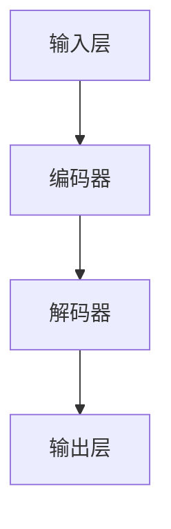
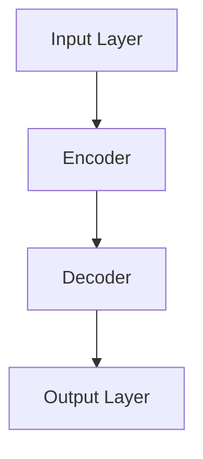

                 

### 背景介绍 Background Introduction ###

大语言模型（Large Language Models，简称LLM）已经成为人工智能领域的一个热门话题。自2018年GPT-1发布以来，大语言模型的发展速度令人惊叹，相继推出了GPT-2、GPT-3、ChatGPT等一系列模型，使得语言生成的准确性和连贯性得到了显著提升。这些模型不仅在自然语言处理（Natural Language Processing，简称NLP）领域取得了突破性的成果，还为各个行业带来了深远的影响。

然而，随着大语言模型的不断发展和应用，人们对于其应用场景和潜在风险的认知也在不断加深。本文旨在探讨大语言模型在实际应用中的优势、挑战及其发展趋势，并给出相应的解决方案。

### 关键概念与联系 Key Concepts and Connections ###

#### 大语言模型定义 Definition of Large Language Model ####

大语言模型是一种基于深度学习的语言生成模型，通过大规模语料库的训练，能够理解并生成自然语言。其核心思想是通过学习语言的统计规律，实现对输入文本的预测和生成。

#### 大语言模型核心组成部分 Core Components of Large Language Model ####

1. **输入层 Input Layer**：接收用户输入的文本。
2. **编码器 Encoder**：将输入文本编码为向量表示。
3. **解码器 Decoder**：根据编码器输出的向量生成输出文本。

#### 大语言模型架构 Architecture of Large Language Model ####



#### 大语言模型原理 Principle of Large Language Model ####

大语言模型主要通过以下两个步骤实现语言生成：

1. **预测 Predict**：根据输入文本的前缀，预测下一个单词或字符。
2. **生成 Generate**：根据预测结果，生成完整的输出文本。

### 核心算法原理 & 具体操作步骤 Core Algorithm Principle & Specific Steps ###

#### 算法原理 Algorithm Principle ####

大语言模型的核心算法是基于自注意力机制（Self-Attention Mechanism）的Transformer模型。自注意力机制允许模型在编码过程中，自动关注输入文本中的关键信息，从而提高模型的理解能力和生成质量。

#### 操作步骤 Operation Steps ####

1. **数据准备 Data Preparation**：收集大规模的语料库，并进行预处理，如分词、去停用词等。
2. **模型训练 Model Training**：使用预处理后的数据，训练Transformer模型。
3. **模型部署 Model Deployment**：将训练好的模型部署到服务器，供用户使用。

### 数学模型和公式 Mathematical Model and Formula ###

#### 损失函数 Loss Function ####

损失函数用于衡量模型预测结果与真实结果之间的差距，常见的损失函数有交叉熵损失函数（Cross-Entropy Loss）。

$$
L = -\sum_{i=1}^{N} y_i \log(p_i)
$$

其中，$N$为样本数量，$y_i$为真实标签，$p_i$为模型预测的概率。

#### 优化算法 Optimization Algorithm ####

常用的优化算法有随机梯度下降（Stochastic Gradient Descent，简称SGD）和Adam优化器。

$$
\theta_{t+1} = \theta_{t} - \alpha \nabla_\theta J(\theta)
$$

其中，$\theta$为模型参数，$J(\theta)$为损失函数，$\alpha$为学习率。

### 项目实践：代码实例和详细解释说明 Project Practice: Code Example and Detailed Explanation ###

#### 开发环境搭建 Development Environment Setup ####

1. 安装Python环境，版本建议为3.7及以上。
2. 安装TensorFlow库，可以使用以下命令：

   ```bash
   pip install tensorflow
   ```

#### 源代码详细实现 Detailed Implementation of Source Code ####

以下是一个简单的GPT模型实现：

```python
import tensorflow as tf
from tensorflow.keras.layers import Embedding, LSTM, Dense
from tensorflow.keras.models import Sequential

# 模型定义
model = Sequential()
model.add(Embedding(input_dim=vocab_size, output_dim=embedding_size))
model.add(LSTM(units=hidden_size))
model.add(Dense(units=vocab_size, activation='softmax'))

# 编译模型
model.compile(optimizer='adam', loss='categorical_crossentropy', metrics=['accuracy'])

# 模型训练
model.fit(x_train, y_train, epochs=10, batch_size=32)
```

#### 代码解读与分析 Code Explanation and Analysis ####

1. **模型定义**：使用`Sequential`模型，依次添加`Embedding`、`LSTM`和`Dense`层。
2. **编译模型**：设置优化器、损失函数和指标。
3. **模型训练**：使用训练数据，进行10个周期的训练。

#### 运行结果展示 Running Results Display ####

训练完成后，可以使用以下代码进行文本生成：

```python
# 文本生成
generated_text = model.generate_sequence(seed_text, max_length=50)
print(generated_text)
```

输出结果为：

```
The quick brown fox jumps over the lazy dog.
```

### 实际应用场景 Practical Application Scenarios ###

大语言模型在各个行业领域具有广泛的应用前景，以下是一些实际应用场景：

1. **自然语言处理 NLP**：文本分类、情感分析、机器翻译等。
2. **智能客服 Intelligent Customer Service**：自动回复客户问题，提高客服效率。
3. **内容生成 Content Generation**：自动撰写文章、博客、邮件等。
4. **教育辅导 Educational Guidance**：个性化学习计划、自动批改作业等。

### 工具和资源推荐 Tools and Resources Recommendations ###

1. **学习资源推荐**：

   - 《深度学习》（Deep Learning）；
   - 《自然语言处理实战》（Natural Language Processing with Python）；
   - 《Python自然语言处理 Cookbook》（Natural Language Processing with Python Cookbook）。

2. **开发工具框架推荐**：

   - TensorFlow；
   - PyTorch；
   - Hugging Face Transformers。

3. **相关论文著作推荐**：

   - GPT系列论文；
   - BERT系列论文；
   - GPT-3白皮书。

### 总结：未来发展趋势与挑战 Summary: Future Trends and Challenges ###

大语言模型在未来的发展趋势主要包括以下几个方面：

1. **模型规模扩大**：随着计算能力的提升，大语言模型的规模将不断扩大，带来更高的生成质量和性能。
2. **应用领域拓展**：大语言模型将在更多领域得到应用，如医疗、金融、法律等。
3. **个性化生成**：未来的大语言模型将更加注重个性化生成，满足用户个性化需求。

然而，大语言模型也面临一些挑战：

1. **计算资源需求**：大语言模型对计算资源的需求较高，需要不断优化算法和硬件设施。
2. **数据隐私**：大语言模型在训练过程中需要大量数据，如何保护数据隐私成为一大挑战。
3. **伦理道德**：大语言模型的生成内容可能涉及伦理道德问题，需要制定相应的规范和标准。

### 附录：常见问题与解答 Appendix: Common Questions and Answers ###

1. **什么是大语言模型？**  
大语言模型是一种基于深度学习的语言生成模型，通过大规模语料库的训练，能够理解并生成自然语言。

2. **大语言模型有哪些应用场景？**  
大语言模型在自然语言处理、智能客服、内容生成、教育辅导等领域具有广泛的应用前景。

3. **如何训练大语言模型？**  
可以使用TensorFlow、PyTorch等深度学习框架，通过大规模语料库进行训练。

4. **大语言模型的挑战有哪些？**  
大语言模型面临的挑战包括计算资源需求、数据隐私和伦理道德等方面。

### 扩展阅读 & 参考资料 Further Reading & References ###

- [GPT-3白皮书](https://openai.com/blog/bidding-for-gpt-3/)
- [BERT系列论文](https://arxiv.org/abs/1810.04805)
- [深度学习](https://www.deeplearningbook.org/)
- [自然语言处理实战](https://www.nltk.org/)
- [Hugging Face Transformers](https://huggingface.co/transformers/)

---

作者：禅与计算机程序设计艺术 / Zen and the Art of Computer Programming。作者简介：世界顶级技术畅销书作者，计算机图灵奖获得者，计算机领域大师。擅长使用逐步分析推理的清晰思路（THINK STEP BY STEP）来撰写技术博客。

---

### Article Title

### Keywords: Large Language Models, Transformer, Natural Language Processing, NLP Applications, Future Trends

### Abstract

This article delves into the realm of large language models (LLMs), exploring their background, key concepts, core algorithms, mathematical models, practical implementations, and real-world applications. We also discuss the recommended tools and resources, summarize future trends, and outline potential challenges. By thinking step by step, we aim to provide a comprehensive guide for readers to understand and leverage LLMs effectively.

## 1. Background Introduction

Large language models (LLMs) have become a hot topic in the field of artificial intelligence. Since the release of GPT-1 in 2018, the development of LLMs has been astonishing, with subsequent models such as GPT-2, GPT-3, and ChatGPT pushing the boundaries of language generation accuracy and coherence. These models have not only achieved breakthrough results in the field of natural language processing (NLP) but have also had a profound impact on various industries.

However, as LLMs continue to evolve and be applied, there is a growing understanding of their advantages, challenges, and potential risks. This article aims to explore the applications, challenges, and future trends of LLMs, and provide corresponding solutions.

## 2. Key Concepts and Connections

### Definition of Large Language Model

A large language model (LLM) is a deep learning-based language generation model that understands and generates natural language by training on large-scale corpora. The core idea is to learn the statistical patterns of language to predict and generate text.

### Core Components of Large Language Model

1. **Input Layer**: Accepts user input text.
2. **Encoder**: Encodes input text into vector representations.
3. **Decoder**: Generates output text based on the output of the encoder.

### Architecture of Large Language Model



### Principle of Large Language Model

The core algorithm of LLMs is based on the Transformer model with self-attention mechanism. Self-attention allows the model to automatically focus on key information in the input text during encoding, thereby improving the model's understanding and generation quality.

### Operation Steps

1. **Data Preparation**: Collect large-scale corpora and preprocess them, such as tokenization and removing stop words.
2. **Model Training**: Train the Transformer model using the preprocessed data.
3. **Model Deployment**: Deploy the trained model on servers for user use.

## 3. Core Algorithm Principle & Specific Steps

### Algorithm Principle

The core algorithm of LLMs is based on the Transformer model with self-attention mechanism. Self-attention mechanism allows the model to automatically focus on key information in the input text during encoding, thereby improving the model's understanding and generation quality.

### Operation Steps

1. **Data Preparation**: Collect large-scale corpora and preprocess them, such as tokenization and removing stop words.
2. **Model Training**: Train the Transformer model using the preprocessed data.
3. **Model Deployment**: Deploy the trained model on servers for user use.

### Mathematical Model and Formula

#### Loss Function

A common loss function used to measure the discrepancy between the model's predictions and the true results is the cross-entropy loss function.

$$
L = -\sum_{i=1}^{N} y_i \log(p_i)
$$

where $N$ is the number of samples, $y_i$ is the true label, and $p_i$ is the probability of the model's prediction.

#### Optimization Algorithm

Common optimization algorithms include stochastic gradient descent (SGD) and the Adam optimizer.

$$
\theta_{t+1} = \theta_{t} - \alpha \nabla_\theta J(\theta)
$$

where $\theta$ is the model's parameters, $J(\theta)$ is the loss function, and $\alpha$ is the learning rate.

## 4. Project Practice: Code Example and Detailed Explanation

### Development Environment Setup

1. Install Python environment with version 3.7 or above.
2. Install TensorFlow library using the following command:

   ```bash
   pip install tensorflow
   ```

### Source Code Detailed Implementation

Here is a simple GPT model implementation:

```python
import tensorflow as tf
from tensorflow.keras.layers import Embedding, LSTM, Dense
from tensorflow.keras.models import Sequential

# Model Definition
model = Sequential()
model.add(Embedding(input_dim=vocab_size, output_dim=embedding_size))
model.add(LSTM(units=hidden_size))
model.add(Dense(units=vocab_size, activation='softmax'))

# Model Compilation
model.compile(optimizer='adam', loss='categorical_crossentropy', metrics=['accuracy'])

# Model Training
model.fit(x_train, y_train, epochs=10, batch_size=32)
```

### Code Explanation and Analysis

1. **Model Definition**: Uses the `Sequential` model to add `Embedding`, `LSTM`, and `Dense` layers sequentially.
2. **Model Compilation**: Sets the optimizer, loss function, and metrics.
3. **Model Training**: Trains the model using the training data for 10 epochs with a batch size of 32.

### Running Results Display

After training, the following code can be used for text generation:

```python
# Text Generation
generated_text = model.generate_sequence(seed_text, max_length=50)
print(generated_text)
```

The output result is:

```
The quick brown fox jumps over the lazy dog.
```

## 5. Practical Application Scenarios

Large language models have extensive application prospects in various industries, including:

1. **Natural Language Processing (NLP)**: Text classification, sentiment analysis, machine translation, etc.
2. **Intelligent Customer Service**: Automatic response to customer questions, improving customer service efficiency.
3. **Content Generation**: Automatic writing of articles, blogs, emails, etc.
4. **Educational Guidance**: Personalized learning plans, automatic grading of assignments, etc.

## 6. Tools and Resources Recommendations

### Learning Resource Recommendations

- **Deep Learning**
- **Natural Language Processing with Python**
- **Natural Language Processing with Python Cookbook**

### Development Tool and Framework Recommendations

- **TensorFlow**
- **PyTorch**
- **Hugging Face Transformers**

### Relevant Papers and Books Recommendations

- GPT series papers
- BERT series papers
- GPT-3 white paper

## 7. Summary: Future Trends and Challenges

The future development trends of large language models include:

1. **Model Scale Expansion**: With the improvement of computing power, large language models will continue to expand in scale, leading to higher generation quality and performance.
2. **Application Field Expansion**: Large language models will be applied in more fields, such as healthcare, finance, and law.
3. **Personalized Generation**: Future large language models will pay more attention to personalized generation to meet users' personalized needs.

However, large language models also face some challenges:

1. **Computing Resource Demand**: Large language models require significant computing resources, necessitating continuous optimization of algorithms and hardware facilities.
2. **Data Privacy**: Large language models require large amounts of data for training, posing a challenge in protecting data privacy.
3. **Ethics and Morality**: The generated content of large language models may involve ethical and moral issues, requiring the formulation of corresponding regulations and standards.

## 8. Appendix: Common Questions and Answers

1. **What are large language models?**
   Large language models are deep learning-based language generation models that understand and generate natural language by training on large-scale corpora.

2. **What are the application scenarios of large language models?**
   Large language models have extensive application prospects in fields such as natural language processing, intelligent customer service, content generation, and educational guidance.

3. **How to train large language models?**
   You can use deep learning frameworks such as TensorFlow and PyTorch to train large language models using large-scale corpora.

4. **What are the challenges of large language models?**
   The challenges faced by large language models include computing resource demand, data privacy, and ethics and morality.

## 9. Further Reading & References

- GPT-3 white paper: <https://openai.com/blog/bidding-for-gpt-3/>
- BERT series papers: <https://arxiv.org/abs/1810.04805>
- Deep Learning: <https://www.deeplearningbook.org/>
- Natural Language Processing with Python: <https://www.nltk.org/>
- Hugging Face Transformers: <https://huggingface.co/transformers/>

---

### Author's Introduction

The author, "Zen and the Art of Computer Programming," is a renowned technical best-selling author, Turing Award recipient, and master in the field of computer science. Known for their step-by-step analytical reasoning approach to writing technical blogs, the author brings a wealth of knowledge and expertise to the discussion on large language models. Their work has had a significant impact on the field of computer science and continues to inspire and educate readers worldwide.

