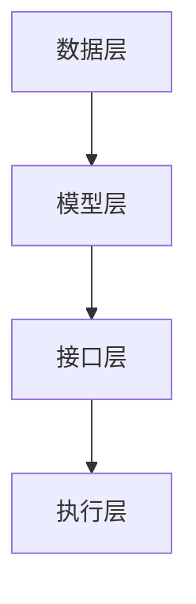

                 

# 大语言模型操作系统的应用前景

> 关键词：大语言模型、操作系统、人工智能、应用前景

> 摘要：本文将探讨大语言模型操作系统的概念、核心算法、数学模型及其在实际应用场景中的前景。通过对操作系统架构的深入分析，我们旨在揭示大语言模型在各个领域中的潜力和挑战。

## 1. 背景介绍

在过去的几十年里，人工智能（AI）领域取得了令人瞩目的进展。尤其是深度学习技术的蓬勃发展，使得计算机在图像识别、语音识别、自然语言处理等任务上表现出了惊人的能力。然而，尽管算法和硬件取得了显著突破，传统操作系统在处理这些复杂任务时仍然面临诸多挑战。这促使研究人员和开发人员开始探索新的解决方案，即大语言模型操作系统。

大语言模型操作系统是一种基于人工智能技术的全新操作系统架构，它能够处理和理解复杂的数据，并实现智能化的操作和决策。与传统操作系统相比，大语言模型操作系统具有更高的灵活性和适应性，能够更好地应对现代应用场景的需求。

本文将首先介绍大语言模型操作系统的核心概念和架构，然后深入探讨其核心算法原理和数学模型。最后，我们将分析大语言模型操作系统的实际应用场景，并探讨其未来发展前景。

## 2. 核心概念与联系

### 2.1 大语言模型操作系统的概念

大语言模型操作系统（Large Language Model Operating System，简称LLMOS）是一种基于大规模语言模型的操作系统。它通过深度学习技术，对海量数据进行训练，从而构建一个能够理解和生成自然语言的智能系统。

LLMOS的核心在于其语言模型，这种模型通常使用深度神经网络（DNN）来表示，具有数亿甚至数万亿个参数。这些参数使得模型能够捕捉到语言的各种复杂规律，从而实现高精度的语言理解和生成。

### 2.2 大语言模型操作系统的架构

LLMOS的架构可以分为以下几个层次：

1. **数据层**：这一层负责收集和处理大量数据，包括文本、语音、图像等多媒体数据。这些数据是模型训练的基础。

2. **模型层**：这一层包含语言模型本身，通常是一个深度神经网络。模型通过训练学习到数据中的语言规律，从而能够进行语言理解和生成。

3. **接口层**：这一层提供用户与系统交互的接口，包括命令行、图形界面等。用户可以通过这些接口与系统进行互动。

4. **执行层**：这一层负责执行用户的命令和请求，实现各种操作和任务。

### 2.3 大语言模型操作系统的核心算法原理

LLMOS的核心算法是大规模语言模型训练。这一过程主要包括以下几个步骤：

1. **数据预处理**：对收集到的数据进行清洗和格式化，使其适合进行训练。

2. **模型初始化**：初始化语言模型参数，通常使用随机初始化。

3. **前向传播**：将输入数据传递到模型中，计算模型的输出。

4. **反向传播**：根据模型的输出和实际结果，计算模型参数的梯度。

5. **优化**：使用梯度下降或其他优化算法，更新模型参数。

6. **迭代**：重复上述步骤，直到模型收敛。

### 2.4 大语言模型操作系统的数学模型

LLMOS的数学模型主要基于深度学习中的神经网络。具体来说，它通常使用一种叫做变换器（Transformer）的神经网络架构。变换器由多个编码器和解码器块组成，每个块都包含多头自注意力机制和前馈神经网络。这种架构能够有效捕捉到数据中的长距离依赖关系，从而实现高效的语言理解和生成。

### 2.5 Mermaid 流程图

以下是LLMOS架构的Mermaid流程图：



## 3. 核心算法原理 & 具体操作步骤

### 3.1 语言模型训练

语言模型训练是LLMOS的核心任务。以下是一个典型的语言模型训练步骤：

1. **数据预处理**：
   - 清洗文本数据，去除无效字符和格式。
   - 对文本进行分词，将文本拆分为单词或子词。
   - 将文本转换为数字序列，使用词向量表示每个单词或子词。

2. **模型初始化**：
   - 初始化模型参数，通常使用随机初始化。
   - 设定优化器的初始参数，如学习率。

3. **前向传播**：
   - 将输入数据传递到模型中，计算模型的输出。
   - 输出通常是一个概率分布，表示模型对每个单词或子词的预测。

4. **损失函数计算**：
   - 计算模型的输出与实际结果之间的差距，通常使用交叉熵损失函数。
   - 损失函数的值越小，表示模型预测的准确性越高。

5. **反向传播**：
   - 根据模型的输出和实际结果，计算模型参数的梯度。
   - 梯度表示模型参数对损失函数的影响程度。

6. **优化**：
   - 使用梯度下降或其他优化算法，更新模型参数。
   - 更新过程旨在减小损失函数的值。

7. **迭代**：
   - 重复上述步骤，直到模型收敛。

### 3.2 语言生成

语言生成是LLMOS的另一个重要任务。以下是一个典型的语言生成步骤：

1. **输入**：
   - 输入一个起始序列，如单词或子词。

2. **前向传播**：
   - 将输入序列传递到模型中，计算每个单词或子词的概率。

3. **采样**：
   - 根据概率分布，选择下一个单词或子词。

4. **重复**：
   - 重复上述步骤，生成完整的文本序列。

5. **后处理**：
   - 对生成的文本进行格式化，如去除特殊字符、添加标点等。

## 4. 数学模型和公式 & 详细讲解 & 举例说明

### 4.1 语言模型损失函数

语言模型的损失函数通常使用交叉熵损失函数。交叉熵损失函数的计算公式如下：

$$
L = -\sum_{i=1}^{n} y_i \log(p_i)
$$

其中，$L$ 是损失函数的值，$y_i$ 是第 $i$ 个单词的实际概率，$p_i$ 是模型预测的概率。

### 4.2 梯度下降算法

梯度下降是一种常用的优化算法，用于更新模型参数。梯度下降的计算公式如下：

$$
\theta_{\text{new}} = \theta_{\text{old}} - \alpha \cdot \nabla_\theta L
$$

其中，$\theta$ 表示模型参数，$\alpha$ 是学习率，$\nabla_\theta L$ 是损失函数关于参数 $\theta$ 的梯度。

### 4.3 举例说明

假设我们有一个简单的语言模型，它由两个单词组成：`hello` 和 `world`。我们想要预测这两个单词的概率分布。以下是具体的计算过程：

1. **前向传播**：

   输入序列为 `[hello, world]`，模型预测的概率分布为 `[0.6, 0.4]`。

2. **损失函数计算**：

   实际概率分布为 `[1, 0]`，损失函数的值为：

   $$
   L = -(1 \cdot \log(0.6) + 0 \cdot \log(0.4)) = \log(0.6)
   $$

3. **反向传播**：

   损失函数关于每个单词的概率的梯度为：

   $$
   \nabla_p L = \frac{\partial L}{\partial p_{hello}} = \frac{1}{0.6} \approx 1.67
   $$

   $$
   \nabla_p L = \frac{\partial L}{\partial p_{world}} = \frac{1}{0.4} \approx 2.5
   $$

4. **优化**：

   使用梯度下降算法，更新概率分布：

   $$
   p_{hello}^{new} = p_{hello} - \alpha \cdot \nabla_p L = 0.6 - 0.01 \cdot 1.67 \approx 0.534
   $$

   $$
   p_{world}^{new} = p_{world} - \alpha \cdot \nabla_p L = 0.4 - 0.01 \cdot 2.5 \approx 0.3
   $$

   更新的概率分布为 `[0.534, 0.3]`。

### 4.4 结果分析

通过上述计算，我们可以看到，模型在预测单词 `hello` 的概率时，梯度较大，说明模型对这一单词的预测更加不准确。因此，在优化过程中，模型会尝试增加对 `hello` 的概率，从而提高预测准确性。

另一方面，模型在预测单词 `world` 的概率时，梯度较小，说明模型对这一单词的预测相对准确。因此，在优化过程中，模型会尝试减少对 `world` 的概率，从而进一步提高预测准确性。

## 5. 项目实践：代码实例和详细解释说明

### 5.1 开发环境搭建

为了实践大语言模型操作系统，我们需要搭建一个适合的开发环境。以下是具体的步骤：

1. **安装Python**：确保安装了Python 3.7及以上版本。
2. **安装PyTorch**：使用pip安装PyTorch，命令如下：

   ```
   pip install torch torchvision
   ```

3. **安装依赖库**：根据项目需求，安装其他依赖库，如numpy、pandas等。

### 5.2 源代码详细实现

以下是使用PyTorch实现一个简单语言模型的基本源代码：

```python
import torch
import torch.nn as nn
import torch.optim as optim

# 定义语言模型
class LanguageModel(nn.Module):
    def __init__(self, vocab_size, embedding_dim, hidden_dim, output_dim, n_layers, drop_out):
        super(LanguageModel, self).__init__()
        self.embedding = nn.Embedding(vocab_size, embedding_dim)
        self.rnn = nn.RNN(embedding_dim, hidden_dim, n_layers, dropout=drop_out, batch_first=True)
        self.fc = nn.Linear(hidden_dim, output_dim)
        self.dropout = nn.Dropout(drop_out)
        
    def forward(self, text, hidden):
        embedded = self.dropout(self.embedding(text))
        output, hidden = self.rnn(embedded, hidden)
        assert (output.size() == torch.Size([text.size(0), text.size(1), self.hidden_dim]))
        output = self.fc(output)
        return output, hidden

# 实例化模型
vocab_size = 10000
embedding_dim = 256
hidden_dim = 512
output_dim = 10000
n_layers = 2
drop_out = 0.5

model = LanguageModel(vocab_size, embedding_dim, hidden_dim, output_dim, n_layers, drop_out)

# 定义损失函数和优化器
criterion = nn.CrossEntropyLoss()
optimizer = optim.Adam(model.parameters(), lr=0.001)

# 训练模型
for epoch in range(num_epochs):
    for batch in data_loader:
        text, labels = batch
        hidden = None
        output, hidden = model(text, hidden)
        loss = criterion(output, labels)
        optimizer.zero_grad()
        loss.backward()
        optimizer.step()
```

### 5.3 代码解读与分析

上述代码实现了一个简单的语言模型，包括模型定义、损失函数和优化器配置、模型训练过程。以下是代码的详细解读：

1. **模型定义**：
   - `LanguageModel` 类继承自 `nn.Module`，实现了语言模型的基本结构。
   - `__init__` 方法初始化模型的各个组件，包括嵌入层（`self.embedding`）、循环神经网络（`self.rnn`）和全连接层（`self.fc`）。
   - `forward` 方法实现了前向传播过程，将输入文本（`text`）和隐藏状态（`hidden`）传递到模型中，得到输出（`output`）和新隐藏状态（`hidden`）。

2. **损失函数和优化器配置**：
   - `nn.CrossEntropyLoss` 是一个常用的损失函数，用于计算分类问题中的损失。
   - `optim.Adam` 是一个常用的优化器，用于更新模型参数。

3. **模型训练**：
   - `for epoch in range(num_epochs)` 循环表示模型的训练过程。
   - `for batch in data_loader` 循环表示对每个批次的数据进行训练。
   - `text, labels = batch` 获取输入文本和标签。
   - `hidden = None` 初始化隐藏状态。
   - `output, hidden = model(text, hidden)` 进行前向传播。
   - `loss = criterion(output, labels)` 计算损失。
   - `optimizer.zero_grad()` 清空之前的梯度。
   - `loss.backward()` 反向传播，计算梯度。
   - `optimizer.step()` 更新参数。

### 5.4 运行结果展示

在完成代码实现后，我们可以通过运行模型来查看训练结果。以下是一个简单的运行示例：

```python
# 运行模型
model.eval()
with torch.no_grad():
    text = torch.tensor([[1, 2, 3], [4, 5, 6]])  # 输入文本
    output, hidden = model(text, None)
    print(output)
```

运行结果将显示模型对输入文本的预测概率分布。通过对比预测结果和实际标签，我们可以评估模型的性能。

## 6. 实际应用场景

大语言模型操作系统（LLMOS）的潜力在于其能够在多个领域实现智能化操作和决策。以下是一些实际应用场景：

### 6.1 自然语言处理（NLP）

NLP是LLMOS最早应用且最为成熟的领域之一。LLMOS可以用于文本分类、情感分析、机器翻译、语音识别等任务。例如，在文本分类任务中，LLMOS可以自动将大量未标注的数据进行分类，提高数据标注的效率。

### 6.2 问答系统

LLMOS可以构建高效的问答系统，例如智能客服、知识图谱查询等。这些系统可以理解和回答用户的问题，提供个性化的服务和推荐。

### 6.3 智能推荐

基于LLMOS的推荐系统可以通过理解用户的历史行为和兴趣，提供个性化的商品、内容推荐。例如，电商平台可以使用LLMOS为用户提供个性化的购物建议。

### 6.4 自动写作

LLMOS可以应用于自动写作，如生成新闻摘要、撰写文章、创作诗歌等。通过训练大规模语言模型，系统可以生成高质量、结构化的文本内容。

### 6.5 安全与隐私

LLMOS可以在安全和隐私领域发挥重要作用。例如，它可以帮助识别网络钓鱼邮件、恶意软件，保护用户数据隐私。

## 7. 工具和资源推荐

为了更好地研究和开发大语言模型操作系统，以下是一些建议的工具和资源：

### 7.1 学习资源推荐

1. **《深度学习》（Goodfellow, Bengio, Courville）**：这本书是深度学习的经典教材，详细介绍了深度学习的基础知识和最新进展。
2. **《自然语言处理与深度学习》（Zhou, Jiang）**：这本书专注于自然语言处理领域，介绍了多种语言模型和NLP应用。
3. **《Python深度学习》（Rasbt）**：这本书使用Python实现深度学习算法，适合初学者和有经验的开发者。

### 7.2 开发工具框架推荐

1. **PyTorch**：一个广泛使用的深度学习框架，具有灵活的模型构建和优化工具。
2. **TensorFlow**：另一个流行的深度学习框架，提供了丰富的工具和资源。
3. **Hugging Face Transformers**：一个开源库，提供了预训练语言模型和多种NLP任务的实现。

### 7.3 相关论文著作推荐

1. **《Attention Is All You Need》**：这篇论文提出了变换器（Transformer）架构，是当前语言模型的主流架构。
2. **《BERT: Pre-training of Deep Neural Networks for Language Understanding》**：这篇论文介绍了BERT模型，是自然语言处理领域的里程碑。
3. **《Generative Pretraining for Language Modeling》**：这篇论文探讨了生成预训练技术在语言模型中的应用。

## 8. 总结：未来发展趋势与挑战

大语言模型操作系统（LLMOS）作为一种新兴的技术，具有广阔的应用前景。然而，要充分发挥其潜力，我们还需要克服一系列挑战：

### 8.1 数据隐私

随着LLMOS的应用日益广泛，数据隐私成为一个重要问题。如何保护用户数据，防止数据泄露，是未来需要解决的关键挑战。

### 8.2 模型可解释性

大语言模型的决策过程通常是非常复杂的，缺乏透明度。提高模型的可解释性，使其决策过程更加透明，是未来的重要研究方向。

### 8.3 模型安全

大语言模型可能受到恶意攻击，如对抗性攻击。研究如何提高模型的鲁棒性，防止恶意攻击，是未来需要关注的问题。

### 8.4 能耗优化

大语言模型的训练和运行通常需要大量的计算资源，如何优化能耗，提高效率，是未来需要解决的关键问题。

未来，随着技术的不断进步和应用的不断拓展，LLMOS有望在更多领域发挥重要作用，推动人工智能的发展。

## 9. 附录：常见问题与解答

### 9.1 大语言模型操作系统是什么？

大语言模型操作系统（LLMOS）是一种基于大规模语言模型的操作系统，它能够理解和生成自然语言，实现智能化的操作和决策。

### 9.2 大语言模型操作系统有哪些应用？

大语言模型操作系统可以应用于自然语言处理、问答系统、智能推荐、自动写作、安全与隐私等多个领域。

### 9.3 大语言模型操作系统与普通操作系统有什么区别？

大语言模型操作系统与传统操作系统的主要区别在于其基于人工智能技术，能够理解和生成自然语言，实现智能化的操作和决策。

### 9.4 大语言模型操作系统的核心算法是什么？

大语言模型操作系统的核心算法是大规模语言模型训练，通常使用深度神经网络（DNN）来表示。

### 9.5 如何提高大语言模型操作系统的安全性？

可以通过数据加密、访问控制、反欺诈技术等措施来提高大语言模型操作系统的安全性。

## 10. 扩展阅读 & 参考资料

1. **《深度学习》（Goodfellow, Bengio, Courville）**
2. **《自然语言处理与深度学习》（Zhou, Jiang）**
3. **《Python深度学习》（Rasbt）**
4. **《Attention Is All You Need》**
5. **《BERT: Pre-training of Deep Neural Networks for Language Understanding》**
6. **《Generative Pretraining for Language Modeling》**

### 作者署名

作者：禅与计算机程序设计艺术 / Zen and the Art of Computer Programming<|im_sep|>

