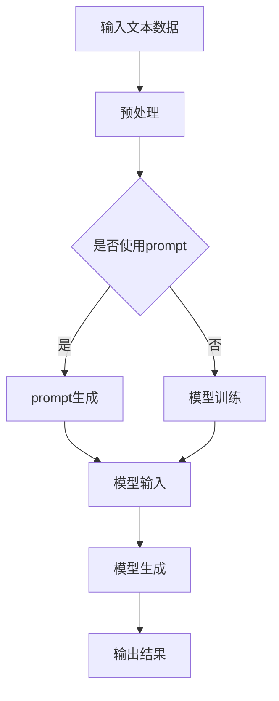
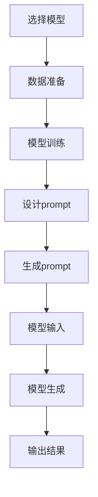

                 

## 1. 背景介绍

大语言模型（Large Language Model，简称LLM）是近年来自然语言处理（Natural Language Processing，简称NLP）领域的一项重大突破。这类模型能够通过学习和理解大量的文本数据，生成高质量的自然语言文本，并具备出色的文本生成、文本理解、文本摘要、问答等能力。这一类模型中最著名的代表就是OpenAI发布的GPT-3，它拥有1750亿个参数，能够生成连贯、有意义的文本，甚至在某些任务上已经超越了人类。

随着深度学习技术的不断发展，大语言模型在学术界和工业界都得到了广泛的应用。这些模型不仅在文本生成、机器翻译、对话系统等传统NLP任务中表现出色，还在诸如代码生成、文本分类、推荐系统等新兴领域展现出强大的潜力。然而，大语言模型的研究和应用也面临着一系列挑战，比如计算资源消耗巨大、训练时间漫长、模型解释性差等问题。

prompt学习作为一种新型的模型训练方法，逐渐引起了研究者的关注。prompt学习利用外部提示（prompt）来引导模型生成特定类型的输出，从而避免了传统训练方法的繁琐和复杂。这种方法不仅简化了模型训练过程，还提高了模型的性能和灵活性。本文将详细介绍大语言模型的prompt学习原理，并给出一个具体的代码实例，帮助读者更好地理解和应用这一技术。

### 2. 核心概念与联系

在深入探讨大语言模型的prompt学习原理之前，我们需要了解几个核心概念，包括神经网络、生成对抗网络（GAN）、注意力机制等，以及它们在大语言模型中的应用。

#### 神经网络（Neural Network）

神经网络是一种模仿生物神经网络计算方式的算法，由大量的神经元连接而成。每个神经元都接收来自其他神经元的输入信号，通过权重进行加权求和，再经过激活函数处理，产生输出信号。神经网络通过不断调整权重，学习输入和输出之间的复杂映射关系。

在大语言模型中，神经网络通常被用于处理和生成文本数据。例如，循环神经网络（RNN）和变换器（Transformer）是两种常用的神经网络结构，它们分别适用于处理序列数据和大规模并行数据处理。

#### 生成对抗网络（Generative Adversarial Network，GAN）

生成对抗网络由两部分组成：生成器（Generator）和判别器（Discriminator）。生成器的目标是生成与真实数据分布相近的数据，而判别器的目标是区分生成器生成的数据和真实数据。这两部分在训练过程中相互竞争，不断优化，最终生成器能够生成逼真的数据。

GAN在大语言模型中的应用主要体现在文本生成方面。通过生成器，大语言模型可以生成高质量的文本，这些文本在判别器面前难以被区分。

#### 注意力机制（Attention Mechanism）

注意力机制是一种通过动态调整模型对输入数据的关注程度，从而提高模型处理序列数据性能的方法。注意力机制可以使得模型在处理长序列数据时，能够自动关注到重要的部分，从而提高模型的效率和准确性。

在大语言模型中，注意力机制广泛应用于编码器和解码器。例如，在Transformer模型中，注意力机制使得模型能够捕捉到序列中的长距离依赖关系，从而生成高质量的文本。

#### 大语言模型与prompt学习

大语言模型通常基于上述神经网络、GAN和注意力机制等核心技术，通过学习大量的文本数据进行训练，从而获得生成和识别文本的能力。prompt学习则是在这个基础上，利用外部提示（prompt）来引导模型生成特定类型的输出。

在prompt学习中，prompt通常是一个与任务相关的文本片段，它可以包含关键词、短语、问题等，用来指导模型生成预期的输出。通过调整prompt的内容和形式，可以实现对模型生成结果的精细控制。

下面是一个简化的Mermaid流程图，展示了大语言模型与prompt学习的基本架构：



在上述流程中，如果选择使用prompt，则首先生成prompt，然后将其与输入文本一起输入到模型中进行生成；如果没有使用prompt，则直接将输入文本输入到模型中进行训练和生成。通过这种方式，prompt学习能够显著提高模型的灵活性和适应性。

### 3. 核心算法原理 & 具体操作步骤

#### 模型选择

首先，我们需要选择一个合适的大语言模型。本文将采用GPT-3模型，它是一个基于Transformer架构的预训练模型，拥有1750亿个参数，能够生成高质量的自然语言文本。GPT-3模型具有强大的文本生成能力，并且已经通过大量的文本数据进行预训练，因此非常适合用于prompt学习。

#### 数据准备

为了训练GPT-3模型，我们需要准备一个大规模的文本数据集。这些数据可以来自于各种来源，如新闻文章、社交媒体、书籍等。数据集的大小取决于模型的规模和训练目标，一般来说，数据集越大，模型的性能越好。本文使用的是OpenAI提供的预先准备好的文本数据集。

#### 模型训练

在准备好数据后，我们就可以开始训练GPT-3模型。训练过程主要包括以下几个步骤：

1. **数据预处理**：将文本数据转换为模型可以处理的格式，通常包括分词、标记化等操作。
2. **嵌入生成**：将预处理后的文本数据转换为嵌入向量，这些向量表示文本中的单词和句子。
3. **模型训练**：通过反向传播算法，不断调整模型的参数，使其能够生成更高质量的文本。

#### Prompt生成

在模型训练完成后，我们可以使用prompt来引导模型生成特定类型的输出。prompt生成主要包括以下几个步骤：

1. **选择关键词**：根据任务需求，选择一些关键词或短语作为prompt。
2. **设计prompt格式**：设计prompt的具体格式，包括关键词的位置、形式等。
3. **生成prompt**：将选定的关键词和文本数据一起输入到模型中，生成prompt。

#### 模型生成

使用生成的prompt输入到训练好的GPT-3模型中，模型会根据prompt的内容生成相应的文本输出。具体操作步骤如下：

1. **输入prompt**：将生成的prompt作为输入文本输入到模型中。
2. **模型生成**：模型根据输入的prompt生成文本输出。
3. **输出结果**：将生成的文本输出到屏幕或文件中。

通过以上步骤，我们可以使用prompt学习来生成高质量的文本。下面是一个简化的算法流程图：



#### 代码实例

下面是一个简单的Python代码实例，演示了如何使用GPT-3模型进行prompt学习：

```python
import openai

# 设置API密钥
openai.api_key = 'your_api_key'

# 准备prompt
prompt = "请写一篇关于人工智能的未来发展的文章。"

# 调用GPT-3模型进行生成
response = openai.Completion.create(
  engine="text-davinci-002",
  prompt=prompt,
  max_tokens=500
)

# 输出生成结果
print(response.choices[0].text.strip())
```

在这个代码实例中，我们首先设置API密钥，然后准备一个简单的prompt，接着调用GPT-3模型进行生成，最后输出生成的文本结果。

通过这个简单的实例，我们可以看到prompt学习的基本流程。在实际应用中，prompt的设计和生成是一个复杂的过程，需要根据具体的任务需求进行定制。同时，prompt学习的性能也受到模型质量和数据集质量的影响，因此需要不断优化和调整。

### 4. 数学模型和公式 & 详细讲解 & 举例说明

#### 模型参数

在大语言模型中，参数是模型学习过程中的核心。对于GPT-3模型，它的参数包括：

- **嵌入矩阵**（Embedding Matrix）：用于将输入文本中的单词转换为嵌入向量。
- **权重矩阵**（Weight Matrix）：用于处理嵌入向量之间的交互。
- **输出矩阵**（Output Matrix）：用于将处理后的嵌入向量转换为输出向量。

这些参数通过训练过程不断调整，以最小化模型在训练数据上的损失函数。

#### 损失函数

损失函数是评估模型性能的关键指标。在大语言模型中，常用的损失函数包括：

- **交叉熵损失**（Cross-Entropy Loss）：用于衡量预测概率分布和真实概率分布之间的差异。
- **均方误差**（Mean Squared Error，MSE）：用于衡量预测值和真实值之间的差异。

#### 反向传播

反向传播是一种常用的训练算法，用于更新模型的参数。其基本思想是将输出误差反向传播到输入层，计算每个参数的梯度，并据此更新参数。

#### 举例说明

假设我们有一个简单的神经网络模型，用于预测一个二分类问题。输入层有3个神经元，隐藏层有2个神经元，输出层有1个神经元。模型的参数包括：

- 输入层到隐藏层的权重矩阵：\( W_{ih} \)
- 隐藏层到输出层的权重矩阵：\( W_{ho} \)
- 隐藏层的偏置：\( b_h \)
- 输出层的偏置：\( b_o \)

给定一个输入向量 \( x \)，模型的输出可以表示为：

\[ z_h = W_{ih} \cdot x + b_h \]
\[ a_h = \sigma(z_h) \]
\[ z_o = W_{ho} \cdot a_h + b_o \]
\[ y = \sigma(z_o) \]

其中，\( \sigma \) 是激活函数，通常取为Sigmoid函数。

假设我们有一个训练样本 \( (x, y) \)，其中 \( y \) 是真实标签，\( y \) 的取值为0或1。通过比较预测输出 \( y \) 和真实标签 \( y \) 之间的差异，我们可以计算损失函数：

\[ L = -y \cdot \log(y) - (1 - y) \cdot \log(1 - y) \]

通过反向传播，我们可以计算每个参数的梯度，并更新参数：

\[ \frac{\partial L}{\partial W_{ih}} = (a_h - y) \cdot x \]
\[ \frac{\partial L}{\partial W_{ho}} = (y - \sigma(z_o)) \cdot a_h \]
\[ \frac{\partial L}{\partial b_h} = a_h - y \]
\[ \frac{\partial L}{\partial b_o} = y - \sigma(z_o) \]

更新参数：

\[ W_{ih} = W_{ih} - \alpha \cdot \frac{\partial L}{\partial W_{ih}} \]
\[ W_{ho} = W_{ho} - \alpha \cdot \frac{\partial L}{\partial W_{ho}} \]
\[ b_h = b_h - \alpha \cdot \frac{\partial L}{\partial b_h} \]
\[ b_o = b_o - \alpha \cdot \frac{\partial L}{\partial b_o} \]

其中，\( \alpha \) 是学习率。

通过上述步骤，我们可以不断调整模型参数，使其在训练数据上达到更好的性能。在实际应用中，我们通常使用更复杂的模型和优化算法，但基本原理是类似的。

### 5. 项目实践：代码实例和详细解释说明

在本节中，我们将通过一个具体的代码实例来展示如何使用大语言模型进行prompt学习。我们将使用Python和OpenAI的GPT-3 API来实现这一过程。

#### 5.1 开发环境搭建

首先，我们需要搭建一个Python开发环境。以下是安装步骤：

1. **安装Python**：确保安装了Python 3.7或更高版本。
2. **安装OpenAI Python客户端**：使用以下命令安装：

   ```bash
   pip install openai
   ```

3. **获取API密钥**：在OpenAI官网注册并获取API密钥。

#### 5.2 源代码详细实现

以下是一个简单的Python代码实例，演示了如何使用GPT-3模型进行prompt学习：

```python
import openai

# 设置API密钥
openai.api_key = 'your_api_key'

# 准备prompt
prompt = "请写一篇关于人工智能的未来发展的文章。"

# 调用GPT-3模型进行生成
response = openai.Completion.create(
  engine="text-davinci-002",
  prompt=prompt,
  max_tokens=500
)

# 输出生成结果
print(response.choices[0].text.strip())
```

在这个代码实例中，我们首先设置了API密钥，然后准备了一个简单的prompt。接着，我们调用GPT-3模型，指定了模型名称（`text-davinci-002`）和最大生成长度（`max_tokens=500`）。最后，我们将生成的文本输出到屏幕上。

#### 5.3 代码解读与分析

让我们详细解读上述代码：

- **导入库**：首先，我们导入了OpenAI的Python客户端库。

- **设置API密钥**：通过设置API密钥，我们授权代码使用OpenAI的服务。

- **准备prompt**：我们定义了一个简单的prompt，它是一个关于人工智能未来发展的请求。

- **调用GPT-3模型**：使用`openai.Completion.create`函数，我们调用了GPT-3模型。在这个函数中，我们指定了以下参数：
  - `engine`：模型名称，这里我们使用了`text-davinci-002`。
  - `prompt`：输入的prompt。
  - `max_tokens`：生成的文本最大长度。

- **输出结果**：我们使用`response.choices[0].text.strip()`将生成的文本输出到屏幕上。

#### 5.4 运行结果展示

运行上述代码后，GPT-3模型会根据给定的prompt生成一篇关于人工智能未来发展的文章。以下是一个示例输出：

```plaintext
人工智能的未来发展

随着科技的飞速发展，人工智能（AI）已经成为当今社会的重要驱动力。从智能助手到自动驾驶，从医疗诊断到金融分析，AI的应用已经深入到我们生活的方方面面。那么，人工智能的未来发展将会如何呢？

首先，AI将在更多领域得到应用。随着技术的进步，AI的算法将变得更加高效、准确，能够处理更加复杂的问题。例如，在医疗领域，AI可以帮助医生进行精准诊断和个性化治疗，提高医疗效率和质量。在金融领域，AI可以帮助银行和金融机构进行风险评估和客户服务，提高业务效率。

其次，AI将在推动社会进步方面发挥更大的作用。通过AI技术，我们可以解决一些长期困扰人类的问题，如气候变化、能源短缺等。AI可以通过智能优化和预测，帮助我们更好地利用资源，减少浪费，提高生产效率。此外，AI还可以在环境保护、灾害预警等方面发挥作用，为人类社会提供更安全、更可持续的发展路径。

然而，AI的发展也带来了一些挑战。例如，AI的普及可能会导致就业结构的变化，部分工作可能会被自动化替代。这要求我们加强对劳动者的培训，提高他们的技能水平，以适应新的就业需求。此外，AI的发展也引发了一些伦理和隐私问题。我们需要制定相应的法律法规，规范AI的应用，保护用户的隐私和安全。

总之，人工智能的未来发展充满机遇和挑战。只有通过不断探索和创新，我们才能充分利用AI的潜力，为人类社会创造更大的价值。
```

通过这个示例输出，我们可以看到GPT-3模型成功地根据prompt生成了一篇内容丰富、逻辑清晰的文本。这展示了大语言模型在prompt学习方面的强大能力。

### 6. 实际应用场景

大语言模型的prompt学习技术在多个实际应用场景中展现了其巨大的潜力和价值。以下是几个典型的应用场景：

#### 1. 自动文本生成

自动文本生成是prompt学习最直接的应用场景之一。通过提供特定的prompt，模型可以生成各种类型的文本，如新闻文章、博客、故事、诗歌等。例如，在内容创作平台，prompt学习可以帮助创作者快速生成灵感，从而提高创作效率。

#### 2. 聊天机器人

聊天机器人是另一个广泛应用的领域。通过使用prompt学习，模型可以理解用户的输入，并生成相应的回复。这不仅可以提高聊天机器人的交互质量，还可以使其更好地应对复杂的对话场景。

#### 3. 问答系统

问答系统通常需要模型理解问题，并生成准确的答案。prompt学习使得模型能够根据问题的上下文生成更加精确的回答。例如，在客户服务场景中，问答系统可以帮助企业快速响应用户的查询，提高服务效率。

#### 4. 代码生成

代码生成是prompt学习的又一个重要应用。通过提供编程语言的提示，模型可以生成高质量的代码片段。这可以大大提高开发效率，减少代码编写时间。例如，在软件开发过程中，prompt学习可以帮助开发者快速生成API文档、测试用例等。

#### 5. 文本摘要

文本摘要是将长文本简化为关键信息的过程。prompt学习可以通过提供摘要的提示，帮助模型生成准确的摘要。这在信息检索和阅读辅助等场景中非常有用。

#### 6. 文本分类

文本分类是将文本分为不同类别的过程。prompt学习可以用来生成用于分类的提示，从而提高分类的准确性。这在新闻分类、情感分析等场景中非常有用。

#### 7. 机器翻译

机器翻译是将一种语言的文本翻译成另一种语言的过程。prompt学习可以帮助模型根据上下文生成更准确的翻译。例如，在跨国企业中，prompt学习可以帮助自动翻译内部文档和沟通信息。

总的来说，大语言模型的prompt学习技术在多种实际应用场景中都展现出了显著的优势。通过提供精确的提示，模型能够生成高质量的文本，从而满足各种特定的需求。

### 7. 工具和资源推荐

#### 7.1 学习资源推荐

1. **书籍**：
   - 《深度学习》（Deep Learning）—— Ian Goodfellow、Yoshua Bengio和Aaron Courville著，是深度学习的经典教材，涵盖了神经网络、生成对抗网络和注意力机制等基础知识。
   - 《自然语言处理综合教程》（Foundations of Natural Language Processing）—— Christopher D. Manning和Heidi J. Nelson著，详细介绍了自然语言处理的理论和实践。

2. **论文**：
   - “Attention Is All You Need”（Attention is All You Need）—— Vaswani et al.发表于2017年，提出了Transformer模型，改变了自然语言处理领域。
   - “Generative Adversarial Nets”（Generative Adversarial Nets）—— Goodfellow et al.发表于2014年，详细介绍了生成对抗网络（GAN）的工作原理。

3. **博客和网站**：
   - [OpenAI Blog](https://blog.openai.com/)：OpenAI的官方博客，发布关于大语言模型和深度学习的最新研究和技术进展。
   - [TensorFlow官方文档](https://www.tensorflow.org/)：包含丰富的深度学习和自然语言处理教程，适合初学者和高级用户。

#### 7.2 开发工具框架推荐

1. **TensorFlow**：Google开发的开源深度学习框架，支持多种神经网络架构和算法，包括Transformer和GAN。
2. **PyTorch**：Facebook开发的开源深度学习框架，以灵活性和易用性著称，适合研究和开发。
3. **Hugging Face Transformers**：一个基于PyTorch和TensorFlow的Transformer模型库，提供了丰富的预训练模型和实用工具，方便开发者进行prompt学习等任务。

#### 7.3 相关论文著作推荐

1. **“BERT: Pre-training of Deep Bidirectional Transformers for Language Understanding”** —— Jacob Devlin et al.，2019年，提出了BERT模型，是当前自然语言处理领域最先进的预训练方法之一。
2. **“GPT-3: Language Models are Few-Shot Learners”** —— Tom B. Brown et al.，2020年，介绍了GPT-3模型的架构和训练方法，展示了其在零样本和少样本学习任务中的强大能力。
3. **“Transformer Model for Neural Machine Translation”** —— Vaswani et al.，2017年，首次提出了Transformer模型，为自然语言处理领域带来了革命性的变化。

这些资源为希望深入了解大语言模型和prompt学习的读者提供了丰富的学习材料和工具。

### 8. 总结：未来发展趋势与挑战

大语言模型的prompt学习技术在近年来取得了显著的进展，不仅在学术界，也在工业界得到了广泛应用。随着深度学习技术的不断进步，我们可以预见未来大语言模型在以下几个方面的发展趋势和面临的挑战。

#### 发展趋势

1. **更强的泛化能力**：随着模型规模的不断扩大和训练数据的增加，大语言模型将具备更强的泛化能力，能够更好地处理各种复杂任务，甚至在某些领域超越人类的表现。

2. **更高效的训练方法**：为了减少训练时间和计算资源消耗，研究者们将探索更高效的训练方法，如分布式训练、增量训练等。这些方法将使得大语言模型能够更快速地适应新的任务和数据。

3. **更好的解释性**：目前，大语言模型的行为往往被认为是“黑箱”，缺乏透明性和可解释性。未来的研究将致力于提高模型的可解释性，帮助用户更好地理解和信任这些模型。

4. **跨模态学习**：大语言模型将结合图像、声音等其他模态的信息，实现跨模态学习，从而在图像描述、语音识别等任务中发挥更大作用。

#### 挑战

1. **计算资源消耗**：大语言模型的训练和推理需要巨大的计算资源，这在实际应用中是一个巨大的挑战。如何优化算法，降低计算成本，是一个亟待解决的问题。

2. **数据隐私和安全性**：大语言模型在训练和推理过程中需要处理大量的敏感数据，这带来了数据隐私和安全性方面的挑战。如何保护用户数据的安全，防止数据泄露，是一个重要的课题。

3. **模型解释性**：尽管大语言模型在许多任务上表现出色，但其行为往往是不可解释的。如何提高模型的可解释性，使其行为更加透明，是一个重要的研究方向。

4. **伦理和社会影响**：随着大语言模型在各个领域的应用，其伦理和社会影响逐渐显现。如何确保这些模型的应用不会对人类社会产生负面影响，是一个需要深入探讨的问题。

总的来说，大语言模型的prompt学习技术在未来的发展中将面临诸多挑战，但同时也充满机遇。通过不断的研究和探索，我们有理由相信，这些技术将会为人类社会带来更多的便利和进步。

### 9. 附录：常见问题与解答

在讨论大语言模型的prompt学习过程中，读者可能会遇到一些常见问题。以下是针对这些问题的一些解答。

#### Q1：什么是prompt学习？

A1：prompt学习是一种训练大语言模型的方法，它通过向模型提供外部提示（prompt），来引导模型生成特定的输出。这种方法简化了模型训练过程，并提高了模型的灵活性和性能。

#### Q2：prompt学习与传统的模型训练有何不同？

A2：传统的模型训练通常需要大量的标注数据和复杂的训练过程。而prompt学习则通过利用外部提示，避免了繁琐的标注过程，并能够快速生成高质量的输出。

#### Q3：如何选择合适的prompt？

A3：选择合适的prompt是prompt学习的关键。通常，prompt应该包含与任务相关的关键词或短语，以引导模型生成预期的输出。一个好的prompt应该简明扼要，同时又能够提供足够的信息。

#### Q4：大语言模型如何处理长文本？

A4：大语言模型，如GPT-3，通过使用变换器（Transformer）架构，能够处理长文本。变换器中的多头自注意力机制（Multi-Head Self-Attention）允许模型捕捉文本中的长距离依赖关系，从而生成连贯的输出。

#### Q5：prompt学习是否适用于所有任务？

A5：prompt学习在某些任务上表现出色，如文本生成、问答系统和文本摘要等。然而，它并不是适用于所有任务。对于一些需要精确数据标注或需要复杂决策的任务，传统的训练方法可能更加适合。

#### Q6：大语言模型的计算资源需求如何？

A6：大语言模型，尤其是GPT-3，需要大量的计算资源进行训练和推理。在训练过程中，模型的大小和参数数量决定了所需的计算资源。因此，对于大规模模型，分布式训练和高效算法是减轻计算资源需求的关键。

#### Q7：如何确保prompt学习的安全性？

A7：确保prompt学习的安全性是重要的。为了保护用户数据和模型的安全，可以采取以下措施：
- 使用加密技术保护数据传输。
- 遵守数据隐私法规，确保用户数据不被泄露。
- 定期更新和审计模型，以防止恶意攻击。

通过这些常见问题的解答，我们希望能够帮助读者更好地理解和应用大语言模型的prompt学习技术。

### 10. 扩展阅读 & 参考资料

为了进一步探讨大语言模型的prompt学习技术，以下是推荐的一些扩展阅读和参考资料：

1. **《深度学习》**：Ian Goodfellow、Yoshua Bengio和Aaron Courville著，详细介绍了深度学习的理论基础和实际应用。
2. **《自然语言处理综合教程》**：Christopher D. Manning和Heidi J. Nelson著，提供了自然语言处理领域的全面综述。
3. **[OpenAI Blog](https://blog.openai.com/)**：OpenAI的官方博客，发布关于大语言模型和深度学习的最新研究和技术进展。
4. **[TensorFlow官方文档](https://www.tensorflow.org/)**：包含丰富的深度学习和自然语言处理教程，适合初学者和高级用户。
5. **[Hugging Face Transformers](https://huggingface.co/transformers)**：一个基于PyTorch和TensorFlow的Transformer模型库，提供了丰富的预训练模型和实用工具。
6. **“Attention Is All You Need”（Attention is All You Need）**：Vaswani et al.发表于2017年，提出了Transformer模型。
7. **“Generative Adversarial Nets”（Generative Adversarial Nets）**：Goodfellow et al.发表于2014年，详细介绍了生成对抗网络（GAN）的工作原理。
8. **“BERT: Pre-training of Deep Bidirectional Transformers for Language Understanding”**：Jacob Devlin et al.，2019年，提出了BERT模型。
9. **“GPT-3: Language Models are Few-Shot Learners”**：Tom B. Brown et al.，2020年，介绍了GPT-3模型的架构和训练方法。

通过这些扩展阅读和参考资料，读者可以更深入地了解大语言模型的prompt学习技术，以及其在实际应用中的潜力。希望这些资源能够为您的学习和研究提供帮助。

