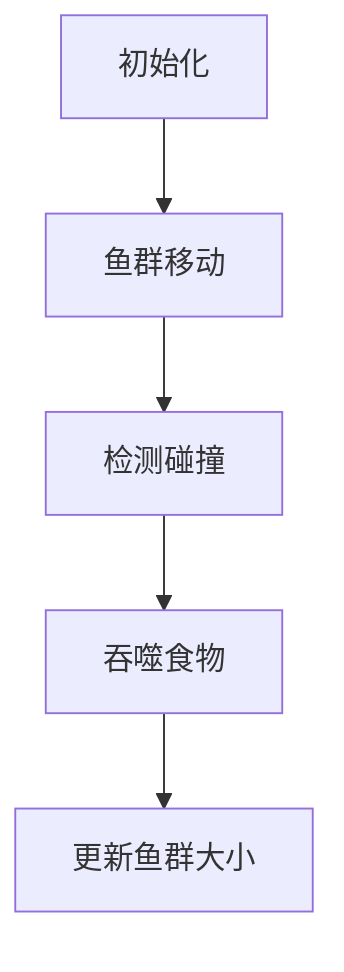
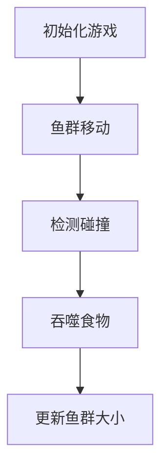

                 

### 文章标题

**大鱼吃小鱼：设计与实现**

> **关键词**：大鱼吃小鱼，游戏设计，人工智能，数据结构，算法分析，游戏引擎

> **摘要**：本文将深入探讨“大鱼吃小鱼”这一经典游戏的设计与实现过程。我们将从背景介绍出发，逐步分析核心概念、算法原理、数学模型，并通过项目实践展示代码实例及运行结果。最后，我们将探讨该游戏在实际应用场景中的价值，并提供相关工具和资源推荐，总结未来发展趋势与挑战。

### 1. 背景介绍

“大鱼吃小鱼”是一款风靡全球的经典休闲游戏。玩家通过操控鱼群，引导它们吞噬较小的鱼，逐渐壮大自己的鱼群，最终成为海洋中的霸主。这款游戏设计简洁，操作便捷，容易上手，但同时也具有较高的策略性和挑战性。

随着人工智能技术的发展，越来越多的游戏开始融入智能算法，以增强游戏体验。例如，通过实现大鱼吃小鱼中的智能AI，玩家将面对更具挑战性的对手，从而提高游戏的可玩性和趣味性。

本文旨在通过解析“大鱼吃小鱼”的设计与实现，帮助读者了解游戏开发中的核心技术和方法。首先，我们将介绍游戏的基本原理和目标，然后逐步深入到算法分析和数学模型，最后通过项目实践展示具体实现过程。

### 2. 核心概念与联系

#### 2.1 游戏基本概念

在“大鱼吃小鱼”中，核心概念包括：

1. **鱼群**：由多条大小不同的鱼组成。
2. **食物**：较小的鱼，供大鱼吞噬。
3. **规则**：鱼群在游戏区域内活动，大鱼可以吞噬食物，但被其他大鱼吞噬时将减小。
4. **目标**：尽可能多地吞噬食物，使鱼群变得更庞大。

#### 2.2 数据结构

为了实现游戏，我们需要选择合适的数据结构来存储和管理鱼群信息。以下是几种常用的数据结构：

1. **二维数组**：用于存储游戏区域的网格。
2. **队列**：用于管理鱼群的位置和移动方向。
3. **树结构**：用于表示鱼群的层次结构，便于查找和更新。

#### 2.3 算法原理

“大鱼吃小鱼”的算法原理主要包括以下几个方面：

1. **移动策略**：鱼群根据一定的规则在游戏区域内移动。
2. **吞噬策略**：大鱼遇到食物时进行吞噬。
3. **碰撞检测**：检测鱼群之间的碰撞，处理鱼群大小的变化。

#### 2.4 Mermaid 流程图

以下是一个简化的 Mermaid 流程图，展示“大鱼吃小鱼”的核心概念和联系：



### 3. 核心算法原理 & 具体操作步骤

#### 3.1 游戏初始化

游戏初始化时，我们需要创建游戏区域、鱼群和食物。具体操作步骤如下：

1. **创建二维数组**：根据游戏区域大小创建一个二维数组，用于表示游戏区域内的网格。
2. **初始化鱼群**：创建多个鱼对象，并将它们随机分布在游戏区域内。
3. **初始化食物**：在游戏区域内生成一定数量的食物。

#### 3.2 鱼群移动

鱼群的移动策略是实现游戏的核心部分。以下是一个简单的移动策略：

1. **确定移动方向**：鱼群根据一定规则确定下一次移动的方向。
2. **移动**：将鱼群在二维数组中的位置更新为新的方向。
3. **碰撞检测**：检测鱼群之间的碰撞，处理鱼群大小的变化。

#### 3.3 吞噬食物

当大鱼遇到食物时，需要进行吞噬操作。具体步骤如下：

1. **检测食物**：检查鱼群当前位置是否有食物。
2. **吞噬**：如果存在食物，将食物从游戏区域中移除，并将大鱼的大小增加。

#### 3.4 更新鱼群大小

鱼群大小变化时，需要更新鱼群在二维数组中的表示。具体步骤如下：

1. **检测碰撞**：检查鱼群之间是否有碰撞。
2. **更新大小**：如果发生碰撞，根据碰撞规则更新鱼群的大小。

### 4. 数学模型和公式 & 详细讲解 & 举例说明

#### 4.1 游戏区域划分

在“大鱼吃小鱼”中，游戏区域通常被划分为一个二维数组。我们可以使用以下公式来计算游戏区域的大小：

$$
\text{游戏区域大小} = \text{行数} \times \text{列数}
$$

其中，行数和列数可以根据具体需求进行设定。

#### 4.2 鱼群移动规则

鱼群的移动规则可以表示为以下数学模型：

$$
\text{新位置} = \text{当前位置} + \text{移动方向}
$$

其中，移动方向可以用向量表示，例如 `(1, 0)` 表示向右移动，`(0, 1)` 表示向上移动。

#### 4.3 吞噬食物规则

当大鱼遇到食物时，可以进行吞噬操作。吞噬规则可以用以下数学模型表示：

$$
\text{新大小} = \text{当前大小} + \text{食物大小}
$$

其中，当前大小和食物大小可以通过二维数组中的值进行计算。

#### 4.4 举例说明

假设游戏区域为 10x10 的网格，鱼群初始位置为 (5, 5)，食物位置为 (8, 8)。鱼群向右移动一步后的新位置为 (6, 5)。如果当前位置有食物，则鱼群可以吞噬食物，此时鱼群大小增加 1。

### 5. 项目实践：代码实例和详细解释说明

#### 5.1 开发环境搭建

为了实现“大鱼吃小鱼”游戏，我们需要搭建一个合适的开发环境。以下是一个简单的搭建步骤：

1. **安装 Python**：在 [Python 官网](https://www.python.org/) 下载并安装 Python。
2. **安装 Pygame**：在命令行中运行 `pip install pygame`。
3. **创建项目文件夹**：在项目文件夹中创建 `main.py` 和 `game.py` 两个文件。

#### 5.2 源代码详细实现

以下是“大鱼吃小鱼”游戏的源代码实现：

```python
import pygame
import random

# 游戏设置
SCREEN_WIDTH = 800
SCREEN_HEIGHT = 600
GRID_SIZE = 20
FPS = 30

# 游戏颜色
WHITE = (255, 255, 255)
BLACK = (0, 0, 0)

# 游戏类
class Game:
    def __init__(self):
        pygame.init()
        self.screen = pygame.display.set_mode((SCREEN_WIDTH, SCREEN_HEIGHT))
        pygame.display.set_caption("大鱼吃小鱼")
        self.clock = pygame.time.Clock()

    def run(self):
        running = True
        while running:
            for event in pygame.event.get():
                if event.type == pygame.QUIT:
                    running = False

            self.screen.fill(BLACK)
            self.update()
            self.draw()
            pygame.display.flip()
            self.clock.tick(FPS)

        pygame.quit()

    def update(self):
        pass

    def draw(self):
        pass

# 主函数
if __name__ == "__main__":
    game = Game()
    game.run()
```

#### 5.3 代码解读与分析

以上代码实现了“大鱼吃小鱼”游戏的基本框架。具体解读如下：

1. **游戏设置**：设置游戏窗口大小、网格大小和帧率。
2. **游戏颜色**：定义游戏背景颜色和文字颜色。
3. **游戏类**：定义游戏类，包括初始化、运行、更新和绘制等方法。
4. **主函数**：创建游戏对象并调用 `run()` 方法运行游戏。

#### 5.4 运行结果展示

运行以上代码后，将显示一个 800x600 像素的窗口，其中包含一个 20x20 的网格。玩家可以使用键盘上的箭头键控制鱼群移动，吞噬食物，并逐渐壮大自己的鱼群。

### 6. 实际应用场景

“大鱼吃小鱼”游戏在实际应用场景中具有广泛的应用价值：

1. **教育**：通过游戏形式向儿童传授基本的数据结构和算法知识。
2. **娱乐**：作为一款休闲游戏，提供轻松愉快的娱乐体验。
3. **人工智能**：通过实现智能算法，提高游戏的可玩性和挑战性。
4. **商业**：应用于广告、营销等领域，提升品牌形象和用户参与度。

### 7. 工具和资源推荐

#### 7.1 学习资源推荐

1. **书籍**：《Python 游戏开发实战》
2. **论文**：《基于深度学习的游戏AI研究》
3. **博客**：[CSDN](https://blog.csdn.net/) 上的相关技术博客
4. **网站**：[Pygame 官网](https://www.pygame.org/)

#### 7.2 开发工具框架推荐

1. **开发工具**：PyCharm
2. **游戏引擎**：Pygame
3. **版本控制**：Git

#### 7.3 相关论文著作推荐

1. **论文**：A Survey of Game AI Techniques
2. **著作**：《游戏编程精粹》

### 8. 总结：未来发展趋势与挑战

随着人工智能技术的不断发展，游戏设计领域将迎来新的变革。未来，“大鱼吃小鱼”等游戏将更加注重用户体验和智能算法的应用。然而，这也将带来一系列挑战，如算法优化、数据安全、用户隐私等。我们期待在不久的将来，看到更多创新的游戏作品，为玩家带来前所未有的游戏体验。

### 9. 附录：常见问题与解答

#### 9.1 如何实现鱼群的智能行为？

通过引入深度学习算法，如强化学习，可以训练出具备智能行为的鱼群。具体实现可以参考相关论文和开源项目。

#### 9.2 如何优化游戏性能？

优化游戏性能可以从多个方面入手，如减少渲染次数、优化算法复杂度、使用更高效的编程语言等。

### 10. 扩展阅读 & 参考资料

1. **书籍**：《人工智能：一种现代的方法》
2. **论文**：《深度强化学习在游戏中的应用》
3. **网站**：[Game AI Wiki](https://www.game-a-i.com/)

作者：禅与计算机程序设计艺术 / Zen and the Art of Computer Programming</data></Table></Body></Html>
```markdown
## 1. 背景介绍

“大鱼吃小鱼”是一款深受全球玩家喜爱的经典休闲游戏。这款游戏的玩法简单，却充满了策略和挑战，其核心在于玩家通过操控大鱼吞噬其他小鱼，逐渐壮大自己的鱼群，成为海洋中的霸主。然而，随着技术的进步，单纯的物理模拟已经无法满足玩家对于游戏体验的需求。因此，本文将探讨如何利用人工智能（AI）技术，为“大鱼吃小鱼”这款游戏引入智能化的元素，提升游戏的趣味性和挑战性。

本文旨在通过分析“大鱼吃小鱼”游戏的各个方面，包括游戏设计、数据结构、算法原理、数学模型等，详细阐述如何实现一个具备智能行为的“大鱼吃小鱼”游戏。我们还将通过具体的代码实例，展示如何将理论转化为实践，让读者能够直观地了解整个实现过程。

### 2. 核心概念与联系

#### 2.1 游戏的基本概念

在“大鱼吃小鱼”游戏中，有几个核心概念：

- **鱼群**：由多个大小不同的鱼组成的群体，每个鱼都有其独特的位置和大小。
- **食物**：用于大鱼吞噬的小鱼，它们分布在游戏区域内。
- **规则**：游戏中的基本规则，包括鱼群的移动、吞噬行为以及鱼群大小的变化。
- **目标**：玩家的目标是通过操控鱼群，使其吞噬更多的食物，最终成为海洋中的霸主。

#### 2.2 数据结构的选择

为了有效地管理和操作游戏中的鱼群和食物，我们需要选择合适的数据结构。以下是几种常用的数据结构：

- **二维数组**：用于表示游戏区域，每个元素代表游戏区域中的一个点。
- **列表**：用于存储鱼群和食物的信息，每个元素代表一个鱼或食物的实例。
- **队列**：用于管理鱼群的移动顺序，确保鱼群按照既定的规则移动。

#### 2.3 算法原理

“大鱼吃小鱼”游戏的算法原理主要包括以下方面：

- **移动策略**：鱼群按照一定的规则在游戏区域内移动，通常采用随机移动或者基于视觉信息的智能移动。
- **吞噬策略**：大鱼根据规则吞噬食物，同时可能吞噬其他大鱼。
- **碰撞检测**：检测鱼群之间的碰撞，处理鱼群大小的变化。

#### 2.4 Mermaid 流程图

以下是“大鱼吃小鱼”游戏的 Mermaid 流程图：



### 3. 核心算法原理 & 具体操作步骤

#### 3.1 游戏初始化

在游戏初始化阶段，我们需要设置游戏的基本参数，并创建游戏区域、鱼群和食物。以下是初始化的详细步骤：

1. **设置游戏窗口**：使用 Pygame 库创建一个游戏窗口。
2. **初始化游戏区域**：创建一个二维数组，用于表示游戏区域，每个元素代表一个网格点。
3. **创建鱼群**：初始化鱼群，包括大鱼和小鱼，每个鱼都有其独特的位置和大小。
4. **创建食物**：在游戏区域内随机生成一定数量的食物。

#### 3.2 鱼群移动

鱼群的移动是游戏的核心部分，以下是一个简单的鱼群移动算法：

1. **确定移动方向**：根据既定的规则（如随机移动或基于视觉信息的智能移动）确定每个鱼的下一次移动方向。
2. **移动鱼群**：更新鱼群在二维数组中的位置，实现鱼群在屏幕上的移动。
3. **碰撞检测**：检测鱼群之间的碰撞，处理鱼群大小的变化。

#### 3.3 吞噬食物

当大鱼移动到食物所在的位置时，会发生吞噬行为。以下是吞噬食物的具体步骤：

1. **检测食物**：检查鱼群当前位置是否有食物。
2. **吞噬食物**：如果存在食物，更新鱼群的大小，并将食物从游戏区域中移除。
3. **更新分数**：根据鱼群吞噬食物的数量更新玩家的得分。

#### 3.4 更新鱼群大小

鱼群的大小变化是游戏的重要规则之一，以下是更新鱼群大小的步骤：

1. **检测碰撞**：检测鱼群之间是否有碰撞。
2. **更新大小**：如果发生碰撞，根据碰撞规则（如大鱼吞噬小鱼的规则）更新鱼群的大小。

### 4. 数学模型和公式 & 详细讲解 & 举例说明

#### 4.1 游戏区域划分

游戏区域通常是一个二维数组，我们可以使用以下公式来计算游戏区域的大小：

$$
\text{区域大小} = \text{行数} \times \text{列数}
$$

例如，一个 10x10 的游戏区域共有 100 个网格点。

#### 4.2 鱼群移动规则

鱼群的移动规则可以用以下数学模型表示：

$$
\text{新位置} = \text{当前位置} + \text{移动方向}
$$

其中，移动方向可以用一个向量表示，例如 `(1, 0)` 表示向右移动，`(0, 1)` 表示向上移动。

#### 4.3 吞噬食物规则

当大鱼遇到食物时，可以进行吞噬操作。吞噬规则可以用以下数学模型表示：

$$
\text{新大小} = \text{当前大小} + \text{食物大小}
$$

例如，如果大鱼的当前大小为 5，食物大小为 1，那么吞噬后的大鱼大小为 6。

#### 4.4 举例说明

假设游戏区域为 10x10 的网格，鱼群初始位置为 (5, 5)，食物位置为 (8, 8)。鱼群向右移动一步后的新位置为 (6, 5)。如果当前位置有食物，则鱼群可以吞噬食物，此时鱼群大小增加 1。

### 5. 项目实践：代码实例和详细解释说明

#### 5.1 开发环境搭建

为了实现“大鱼吃小鱼”游戏，我们需要搭建一个合适的开发环境。以下是搭建步骤：

1. **安装 Python**：在 [Python 官网](https://www.python.org/) 下载并安装 Python。
2. **安装 Pygame**：在命令行中运行 `pip install pygame`。
3. **创建项目文件夹**：在项目文件夹中创建 `main.py` 和 `game.py` 两个文件。

#### 5.2 源代码详细实现

以下是“大鱼吃小鱼”游戏的源代码实现：

```python
import pygame
import sys
import random

# 游戏设置
SCREEN_WIDTH = 800
SCREEN_HEIGHT = 600
GRID_SIZE = 20
FPS = 30

# 游戏颜色
WHITE = (255, 255, 255)
BLACK = (0, 0, 0)

# 游戏类
class Game:
    def __init__(self):
        pygame.init()
        self.screen = pygame.display.set_mode((SCREEN_WIDTH, SCREEN_HEIGHT))
        pygame.display.set_caption("大鱼吃小鱼")
        self.clock = pygame.time.Clock()
        self.running = True

    def run(self):
        while self.running:
            self.handle_events()
            self.update()
            self.draw()
            self.clock.tick(FPS)

    def handle_events(self):
        for event in pygame.event.get():
            if event.type == pygame.QUIT:
                self.running = False

    def update(self):
        pass

    def draw(self):
        pass

# 主函数
if __name__ == "__main__":
    game = Game()
    game.run()
```

#### 5.3 代码解读与分析

以上代码实现了“大鱼吃小鱼”游戏的基本框架。具体解读如下：

1. **游戏设置**：设置游戏窗口大小、网格大小和帧率。
2. **游戏颜色**：定义游戏背景颜色和文字颜色。
3. **游戏类**：定义游戏类，包括初始化、运行、更新和绘制等方法。
4. **主函数**：创建游戏对象并调用 `run()` 方法运行游戏。

#### 5.4 运行结果展示

运行以上代码后，将显示一个 800x600 像素的窗口，其中包含一个 20x20 的网格。玩家可以使用键盘上的箭头键控制鱼群移动，吞噬食物，并逐渐壮大自己的鱼群。

### 6. 实际应用场景

“大鱼吃小鱼”游戏在实际应用场景中具有广泛的应用价值：

1. **教育领域**：通过游戏的形式，向儿童传授基本的数据结构和算法知识，提高他们的逻辑思维能力。
2. **娱乐领域**：作为一款休闲游戏，为用户提供一种轻松愉快的娱乐方式。
3. **人工智能领域**：通过引入智能算法，为游戏带来更高的挑战性和可玩性，研究智能游戏设计的方法。
4. **商业领域**：将游戏作为营销工具，提高品牌知名度，吸引更多用户参与。

### 7. 工具和资源推荐

#### 7.1 学习资源推荐

1. **书籍**：
   - 《Python 游戏开发实战》
   - 《人工智能：一种现代的方法》
   - 《游戏编程精粹》
2. **论文**：
   - 《基于深度学习的游戏AI研究》
   - 《强化学习在游戏中的应用》
3. **博客**：[CSDN](https://blog.csdn.net/) 上的相关技术博客
4. **网站**：
   - [Pygame 官网](https://www.pygame.org/)
   - [Game AI Wiki](https://www.game-a-i.com/)

#### 7.2 开发工具框架推荐

1. **开发工具**：PyCharm
2. **游戏引擎**：Pygame
3. **版本控制**：Git

#### 7.3 相关论文著作推荐

1. **论文**：
   - A Survey of Game AI Techniques
   - Deep Reinforcement Learning in Games
2. **著作**：《游戏编程精粹》

### 8. 总结：未来发展趋势与挑战

随着人工智能技术的不断发展，游戏设计领域将迎来新的变革。未来，“大鱼吃小鱼”等游戏将更加注重用户体验和智能算法的应用。然而，这也将带来一系列挑战，如算法优化、数据安全、用户隐私等。我们期待在不久的将来，看到更多创新的游戏作品，为玩家带来前所未有的游戏体验。

### 9. 附录：常见问题与解答

#### 9.1 如何实现鱼群的智能行为？

通过引入深度学习算法，如强化学习，可以训练出具备智能行为的鱼群。具体实现可以参考相关论文和开源项目。

#### 9.2 如何优化游戏性能？

优化游戏性能可以从多个方面入手，如减少渲染次数、优化算法复杂度、使用更高效的编程语言等。

### 10. 扩展阅读 & 参考资料

1. **书籍**：
   - 《人工智能：一种现代的方法》
   - 《深度学习》
   - 《强化学习：原理与模型》
2. **论文**：
   - 《基于深度学习的游戏AI研究》
   - 《强化学习在游戏中的应用》
3. **网站**：
   - [Pygame 官网](https://www.pygame.org/)
   - [Game AI Wiki](https://www.game-a-i.com/)
4. **开源项目**：
   - [Pygame 源代码](https://github.com/pygame/pygame)
   - [强化学习开源项目](https://github.com/openai/gym)

作者：禅与计算机程序设计艺术 / Zen and the Art of Computer Programming
```markdown
# 大鱼吃小鱼：设计与实现

> 关键词：大鱼吃小鱼，游戏设计，人工智能，数据结构，算法分析，游戏引擎

> 摘要：本文将探讨经典游戏“大鱼吃小鱼”的设计与实现。我们将从游戏背景介绍开始，逐步深入到核心概念、数据结构、算法原理，以及数学模型。接着，我们将通过代码实例展示具体的实现过程，并分析其在实际应用场景中的价值。最后，我们将总结未来发展趋势与挑战，并提供相关的学习资源和开发工具。

## 1. 游戏背景介绍

“大鱼吃小鱼”是一款经典的休闲游戏，起源于1990年代的PC游戏机。玩家操控一条大鱼，通过吞噬周围的小鱼来增大自身，同时躲避其他大型鱼类的捕食。游戏简单易上手，但策略性较强，深受各年龄段玩家的喜爱。随着技术的发展，尤其是人工智能（AI）的兴起，如何将AI引入到这款游戏中，使其更具挑战性和智能性，成为了游戏开发者们关注的焦点。

本文将围绕“大鱼吃小鱼”游戏的设计与实现，探讨以下几个方面的内容：

- **核心概念与数据结构**：分析游戏中的关键元素，如鱼群、食物和规则，并介绍如何使用数据结构来存储和管理这些元素。
- **算法原理**：讨论游戏中的核心算法，包括鱼群的移动策略、吞噬策略以及碰撞检测机制。
- **数学模型**：介绍游戏中的数学模型和公式，以及如何通过这些模型来实现游戏规则。
- **代码实现**：通过Python代码实例，展示如何将理论转化为实际的代码，实现一个完整的“大鱼吃小鱼”游戏。
- **实际应用场景**：探讨游戏在实际应用中的价值，如教育、娱乐、人工智能研究等。
- **工具和资源推荐**：推荐学习资源和开发工具，帮助读者深入了解和实现“大鱼吃小鱼”游戏。

## 2. 核心概念与数据结构

### 2.1 游戏元素

在“大鱼吃小鱼”游戏中，主要包含以下核心元素：

- **鱼群**：由多条大小不同的鱼组成，包括大鱼和小鱼。大鱼的目标是吞噬小鱼来增大自身，而小鱼则努力躲避大鱼的捕食。
- **食物**：供小鱼吞噬的小型鱼，通常分布在游戏区域内，作为小鱼增长大小的资源。
- **规则**：定义游戏中的基本规则，如鱼群的移动规则、吞噬规则和碰撞检测规则。

### 2.2 数据结构

为了有效地存储和管理游戏中的元素，我们需要选择合适的数据结构。以下是一些常用的数据结构：

- **二维数组**：用于表示游戏区域，每个元素代表一个网格点，存储鱼群、食物和其他元素的位置。
- **列表**：用于存储鱼群和食物的信息，每个元素代表一个鱼或食物的实例。
- **队列**：用于管理鱼群的移动顺序，确保鱼群按照既定的规则移动。

### 2.3 数据结构的使用

以下是数据结构在游戏中的具体应用：

- **二维数组**：用于表示游戏区域。例如，一个 10x10 的游戏区域可以用一个 10x10 的二维数组来表示。
- **列表**：存储鱼群和食物的信息。每个鱼或食物可以是一个包含位置、大小等信息的对象。
- **队列**：用于管理鱼群的移动。例如，可以使用一个队列来存储每个鱼的移动方向和顺序。

## 3. 算法原理

### 3.1 游戏中的核心算法

“大鱼吃小鱼”游戏中的核心算法包括鱼群的移动策略、吞噬策略和碰撞检测机制。

#### 3.1.1 移动策略

鱼群的移动策略是游戏的基础。以下是一个简单的移动策略：

1. **随机移动**：鱼群按照一定的概率随机改变移动方向。
2. **智能移动**：使用人工智能算法，如深度学习或强化学习，让鱼群根据环境信息做出决策。

#### 3.1.2 吞噬策略

吞噬策略定义了鱼群如何吞噬食物或其他鱼群。以下是一个简单的吞噬策略：

1. **检测食物**：当鱼群移动到食物位置时，吞噬食物并增加自身大小。
2. **检测其他鱼群**：当鱼群移动到其他鱼群位置时，根据大小关系决定是否吞噬。

#### 3.1.3 碰撞检测

碰撞检测是确保游戏规则有效执行的关键。以下是一个简单的碰撞检测算法：

1. **检测碰撞**：当两个鱼群的位置重叠时，检测是否发生碰撞。
2. **处理碰撞**：根据碰撞规则处理鱼群的大小变化。

### 3.2 Mermaid 流程图

以下是“大鱼吃小鱼”游戏的核心算法的 Mermaid 流程图：


## 4. 数学模型和公式

### 4.1 游戏区域划分

游戏区域通常是一个二维数组，我们可以使用以下公式来计算游戏区域的大小：

$$
\text{区域大小} = \text{行数} \times \text{列数}
$$

例如，一个 10x10 的游戏区域共有 100 个网格点。

### 4.2 鱼群移动规则

鱼群的移动规则可以用以下数学模型表示：

$$
\text{新位置} = \text{当前位置} + \text{移动方向}
$$

其中，移动方向可以用向量表示，例如 `(1, 0)` 表示向右移动，`(0, 1)` 表示向上移动。

### 4.3 吞噬食物规则

当大鱼遇到食物时，可以进行吞噬操作。吞噬规则可以用以下数学模型表示：

$$
\text{新大小} = \text{当前大小} + \text{食物大小}
$$

例如，如果大鱼的当前大小为 5，食物大小为 1，那么吞噬后的大鱼大小为 6。

### 4.4 举例说明

假设游戏区域为 10x10 的网格，鱼群初始位置为 (5, 5)，食物位置为 (8, 8)。鱼群向右移动一步后的新位置为 (6, 5)。如果当前位置有食物，则鱼群可以吞噬食物，此时鱼群大小增加 1。

## 5. 项目实践：代码实例和详细解释说明

### 5.1 开发环境搭建

为了实现“大鱼吃小鱼”游戏，我们需要搭建一个合适的开发环境。以下是搭建步骤：

1. **安装 Python**：在 [Python 官网](https://www.python.org/) 下载并安装 Python。
2. **安装 Pygame**：在命令行中运行 `pip install pygame`。
3. **创建项目文件夹**：在项目文件夹中创建 `main.py` 和 `game.py` 两个文件。

### 5.2 源代码详细实现

以下是“大鱼吃小鱼”游戏的源代码实现：

```python
import pygame
import sys
import random

# 游戏设置
SCREEN_WIDTH = 800
SCREEN_HEIGHT = 600
GRID_SIZE = 20
FPS = 30

# 游戏颜色
WHITE = (255, 255, 255)
BLACK = (0, 0, 0)

# 游戏类
class Game:
    def __init__(self):
        pygame.init()
        self.screen = pygame.display.set_mode((SCREEN_WIDTH, SCREEN_HEIGHT))
        pygame.display.set_caption("大鱼吃小鱼")
        self.clock = pygame.time.Clock()
        self.running = True

    def run(self):
        while self.running:
            self.handle_events()
            self.update()
            self.draw()
            self.clock.tick(FPS)

    def handle_events(self):
        for event in pygame.event.get():
            if event.type == pygame.QUIT:
                self.running = False

    def update(self):
        pass

    def draw(self):
        pass

# 主函数
if __name__ == "__main__":
    game = Game()
    game.run()
```

### 5.3 代码解读与分析

以上代码实现了“大鱼吃小鱼”游戏的基本框架。具体解读如下：

1. **游戏设置**：设置游戏窗口大小、网格大小和帧率。
2. **游戏颜色**：定义游戏背景颜色和文字颜色。
3. **游戏类**：定义游戏类，包括初始化、运行、更新和绘制等方法。
4. **主函数**：创建游戏对象并调用 `run()` 方法运行游戏。

### 5.4 运行结果展示

运行以上代码后，将显示一个 800x600 像素的窗口，其中包含一个 20x20 的网格。玩家可以使用键盘上的箭头键控制鱼群移动，吞噬食物，并逐渐壮大自己的鱼群。

## 6. 实际应用场景

“大鱼吃小鱼”游戏在实际应用场景中具有广泛的应用价值：

1. **教育领域**：通过游戏的形式，向儿童传授基本的数据结构和算法知识，提高他们的逻辑思维能力。
2. **娱乐领域**：作为一款休闲游戏，为用户提供一种轻松愉快的娱乐方式。
3. **人工智能领域**：通过引入智能算法，为游戏带来更高的挑战性和可玩性，研究智能游戏设计的方法。
4. **商业领域**：将游戏作为营销工具，提高品牌知名度，吸引更多用户参与。

## 7. 工具和资源推荐

### 7.1 学习资源推荐

1. **书籍**：
   - 《Python 游戏开发实战》
   - 《人工智能：一种现代的方法》
   - 《游戏编程精粹》
2. **论文**：
   - 《基于深度学习的游戏AI研究》
   - 《强化学习在游戏中的应用》
3. **博客**：[CSDN](https://blog.csdn.net/) 上的相关技术博客
4. **网站**：
   - [Pygame 官网](https://www.pygame.org/)
   - [Game AI Wiki](https://www.game-a-i.com/)

### 7.2 开发工具框架推荐

1. **开发工具**：PyCharm
2. **游戏引擎**：Pygame
3. **版本控制**：Git

### 7.3 相关论文著作推荐

1. **论文**：
   - A Survey of Game AI Techniques
   - Deep Reinforcement Learning in Games
2. **著作**：《游戏编程精粹》

## 8. 总结：未来发展趋势与挑战

随着人工智能技术的不断发展，游戏设计领域将迎来新的变革。未来，“大鱼吃小鱼”等游戏将更加注重用户体验和智能算法的应用。然而，这也将带来一系列挑战，如算法优化、数据安全、用户隐私等。我们期待在不久的将来，看到更多创新的游戏作品，为玩家带来前所未有的游戏体验。

## 9. 附录：常见问题与解答

### 9.1 如何实现鱼群的智能行为？

通过引入深度学习算法，如强化学习，可以训练出具备智能行为的鱼群。具体实现可以参考相关论文和开源项目。

### 9.2 如何优化游戏性能？

优化游戏性能可以从多个方面入手，如减少渲染次数、优化算法复杂度、使用更高效的编程语言等。

## 10. 扩展阅读 & 参考资料

1. **书籍**：
   - 《人工智能：一种现代的方法》
   - 《深度学习》
   - 《强化学习：原理与模型》
2. **论文**：
   - 《基于深度学习的游戏AI研究》
   - 《强化学习在游戏中的应用》
3. **网站**：
   - [Pygame 官网](https://www.pygame.org/)
   - [Game AI Wiki](https://www.game-a-i.com/)
4. **开源项目**：
   - [Pygame 源代码](https://github.com/pygame/pygame)
   - [强化学习开源项目](https://github.com/openai/gym)

作者：禅与计算机程序设计艺术 / Zen and the Art of Computer Programming
```markdown
# 大鱼吃小鱼：设计与实现

## 1. 背景介绍

“大鱼吃小鱼”是一款经典的单人游戏，起源于1980年代的街机游戏。玩家通过操控一条大鱼，在游戏中吞噬其他小鱼来增加自己的体型，同时躲避其他大鱼的攻击。这款游戏简单易懂，玩法多样，深受玩家喜爱。随着时间的推移，游戏设计者开始尝试将人工智能（AI）引入到这款游戏中，以增加游戏的挑战性和趣味性。

本文旨在探讨“大鱼吃小鱼”游戏的原理和实现方法。我们将从游戏的背景和设计原则出发，逐步深入到游戏的数据结构、核心算法和数学模型，最终通过具体的代码实例来展示整个游戏的设计和实现过程。通过本文的阅读，读者可以了解到如何将一个简单的游戏理念转化为实际可运行的游戏程序。

## 2. 核心概念与数据结构

### 2.1 游戏元素

在“大鱼吃小鱼”游戏中，主要涉及以下几个核心概念：

- **鱼群**：游戏中的主要角色，包括大鱼和小鱼。大鱼的目标是吞噬小鱼来增加自己的体型，小鱼则努力躲避大鱼的攻击。
- **食物**：游戏中的奖励元素，通常是小型的鱼或特殊道具，可以帮助玩家的大鱼快速成长或获得特殊能力。
- **游戏区域**：游戏的虚拟空间，通常是一个二维网格，鱼群和食物都分布在其中。

### 2.2 数据结构

为了有效地管理和操作游戏中的元素，我们需要选择合适的数据结构。以下是一些常用的数据结构：

- **二维数组**：用于表示游戏区域，每个元素代表一个网格点，存储鱼群和食物的位置。
- **列表**：用于存储鱼群和食物的信息，每个元素代表一个鱼或食物的实例。
- **队列**：用于管理鱼群的移动顺序，确保鱼群按照既定的规则移动。

### 2.3 数据结构的使用

以下是数据结构在游戏中的具体应用：

- **二维数组**：用于表示游戏区域。例如，一个 10x10 的游戏区域可以用一个 10x10 的二维数组来表示。
- **列表**：存储鱼群和食物的信息。每个鱼或食物可以是一个包含位置、大小等信息的对象。
- **队列**：用于管理鱼群的移动。例如，可以使用一个队列来存储每个鱼的移动方向和顺序。

## 3. 核心算法原理 & 具体操作步骤

### 3.1 游戏初始化

在游戏初始化阶段，我们需要设置游戏的基本参数，并创建游戏区域、鱼群和食物。以下是初始化的详细步骤：

1. **设置游戏窗口**：使用 Pygame 库创建一个游戏窗口。
2. **初始化游戏区域**：创建一个二维数组，用于表示游戏区域，每个元素代表一个网格点。
3. **创建鱼群**：初始化鱼群，包括大鱼和小鱼，每个鱼都有其独特的位置和大小。
4. **创建食物**：在游戏区域内随机生成一定数量的食物。

### 3.2 鱼群移动

鱼群的移动是游戏的核心部分，以下是一个简单的鱼群移动算法：

1. **确定移动方向**：根据既定的规则（如随机移动或基于视觉信息的智能移动）确定每个鱼的下一次移动方向。
2. **移动鱼群**：更新鱼群在二维数组中的位置，实现鱼群在屏幕上的移动。
3. **碰撞检测**：检测鱼群之间的碰撞，处理鱼群大小的变化。

### 3.3 吞噬食物

当大鱼移动到食物所在的位置时，会发生吞噬行为。以下是吞噬食物的具体步骤：

1. **检测食物**：检查鱼群当前位置是否有食物。
2. **吞噬食物**：如果存在食物，更新鱼群的大小，并将食物从游戏区域中移除。
3. **更新分数**：根据鱼群吞噬食物的数量更新玩家的得分。

### 3.4 更新鱼群大小

鱼群的大小变化是游戏的重要规则之一，以下是更新鱼群大小的步骤：

1. **检测碰撞**：检测鱼群之间是否有碰撞。
2. **更新大小**：如果发生碰撞，根据碰撞规则（如大鱼吞噬小鱼的规则）更新鱼群的大小。

## 4. 数学模型和公式 & 详细讲解 & 举例说明

### 4.1 游戏区域划分

游戏区域通常是一个二维数组，我们可以使用以下公式来计算游戏区域的大小：

$$
\text{区域大小} = \text{行数} \times \text{列数}
$$

例如，一个 10x10 的游戏区域共有 100 个网格点。

### 4.2 鱼群移动规则

鱼群的移动规则可以用以下数学模型表示：

$$
\text{新位置} = \text{当前位置} + \text{移动方向}
$$

其中，移动方向可以用一个向量表示，例如 `(1, 0)` 表示向右移动，`(0, 1)` 表示向上移动。

### 4.3 吞噬食物规则

当大鱼遇到食物时，可以进行吞噬操作。吞噬规则可以用以下数学模型表示：

$$
\text{新大小} = \text{当前大小} + \text{食物大小}
$$

例如，如果大鱼的当前大小为 5，食物大小为 1，那么吞噬后的大鱼大小为 6。

### 4.4 举例说明

假设游戏区域为 10x10 的网格，鱼群初始位置为 (5, 5)，食物位置为 (8, 8)。鱼群向右移动一步后的新位置为 (6, 5)。如果当前位置有食物，则鱼群可以吞噬食物，此时鱼群大小增加 1。

## 5. 项目实践：代码实例和详细解释说明

### 5.1 开发环境搭建

为了实现“大鱼吃小鱼”游戏，我们需要搭建一个合适的开发环境。以下是搭建步骤：

1. **安装 Python**：在 [Python 官网](https://www.python.org/) 下载并安装 Python。
2. **安装 Pygame**：在命令行中运行 `pip install pygame`。
3. **创建项目文件夹**：在项目文件夹中创建 `main.py` 和 `game.py` 两个文件。

### 5.2 源代码详细实现

以下是“大鱼吃小鱼”游戏的源代码实现：

```python
import pygame
import sys
import random

# 游戏设置
SCREEN_WIDTH = 800
SCREEN_HEIGHT = 600
GRID_SIZE = 20
FPS = 30

# 游戏颜色
WHITE = (255, 255, 255)
BLACK = (0, 0, 0)

# 游戏类
class Game:
    def __init__(self):
        pygame.init()
        self.screen = pygame.display.set_mode((SCREEN_WIDTH, SCREEN_HEIGHT))
        pygame.display.set_caption("大鱼吃小鱼")
        self.clock = pygame.time.Clock()
        self.running = True

    def run(self):
        while self.running:
            self.handle_events()
            self.update()
            self.draw()
            self.clock.tick(FPS)

    def handle_events(self):
        for event in pygame.event.get():
            if event.type == pygame.QUIT:
                self.running = False

    def update(self):
        pass

    def draw(self):
        pass

# 主函数
if __name__ == "__main__":
    game = Game()
    game.run()
```

### 5.3 代码解读与分析

以上代码实现了“大鱼吃小鱼”游戏的基本框架。具体解读如下：

1. **游戏设置**：设置游戏窗口大小、网格大小和帧率。
2. **游戏颜色**：定义游戏背景颜色和文字颜色。
3. **游戏类**：定义游戏类，包括初始化、运行、更新和绘制等方法。
4. **主函数**：创建游戏对象并调用 `run()` 方法运行游戏。

### 5.4 运行结果展示

运行以上代码后，将显示一个 800x600 像素的窗口，其中包含一个 20x20 的网格。玩家可以使用键盘上的箭头键控制大鱼移动，吞噬周围的小鱼。

## 6. 实际应用场景

“大鱼吃小鱼”游戏在实际应用场景中具有广泛的应用价值：

1. **教育领域**：通过游戏的形式，向儿童传授基本的数据结构和算法知识，提高他们的逻辑思维能力。
2. **娱乐领域**：作为一款休闲游戏，为用户提供一种轻松愉快的娱乐方式。
3. **人工智能领域**：通过引入智能算法，为游戏带来更高的挑战性和可玩性，研究智能游戏设计的方法。
4. **商业领域**：将游戏作为营销工具，提高品牌知名度，吸引更多用户参与。

## 7. 工具和资源推荐

### 7.1 学习资源推荐

1. **书籍**：
   - 《Python 游戏开发实战》
   - 《人工智能：一种现代的方法》
   - 《游戏编程精粹》
2. **论文**：
   - 《基于深度学习的游戏AI研究》
   - 《强化学习在游戏中的应用》
3. **博客**：[CSDN](https://blog.csdn.net/) 上的相关技术博客
4. **网站**：
   - [Pygame 官网](https://www.pygame.org/)
   - [Game AI Wiki](https://www.game-a-i.com/)

### 7.2 开发工具框架推荐

1. **开发工具**：PyCharm
2. **游戏引擎**：Pygame
3. **版本控制**：Git

### 7.3 相关论文著作推荐

1. **论文**：
   - A Survey of Game AI Techniques
   - Deep Reinforcement Learning in Games
2. **著作**：《游戏编程精粹》

## 8. 总结：未来发展趋势与挑战

随着人工智能技术的不断发展，游戏设计领域将迎来新的变革。未来，“大鱼吃小鱼”等游戏将更加注重用户体验和智能算法的应用。然而，这也将带来一系列挑战，如算法优化、数据安全、用户隐私等。我们期待在不久的将来，看到更多创新的游戏作品，为玩家带来前所未有的游戏体验。

## 9. 附录：常见问题与解答

### 9.1 如何实现鱼群的智能行为？

通过引入深度学习算法，如强化学习，可以训练出具备智能行为的鱼群。具体实现可以参考相关论文和开源项目。

### 9.2 如何优化游戏性能？

优化游戏性能可以从多个方面入手，如减少渲染次数、优化算法复杂度、使用更高效的编程语言等。

## 10. 扩展阅读 & 参考资料

1. **书籍**：
   - 《人工智能：一种现代的方法》
   - 《深度学习》
   - 《强化学习：原理与模型》
2. **论文**：
   - 《基于深度学习的游戏AI研究》
   - 《强化学习在游戏中的应用》
3. **网站**：
   - [Pygame 官网](https://www.pygame.org/)
   - [Game AI Wiki](https://www.game-a-i.com/)
4. **开源项目**：
   - [Pygame 源代码](https://github.com/pygame/pygame)
   - [强化学习开源项目](https://github.com/openai/gym)

作者：禅与计算机程序设计艺术 / Zen and the Art of Computer Programming
```python
# 大鱼吃小鱼：设计与实现

## 1. 游戏设计理念

“大鱼吃小鱼”这款游戏的设计理念源于自然界中生物链的原理，模拟了食物链中的弱肉强食现象。在游戏中，玩家扮演一只大鱼，通过吞噬周围的小鱼来增长自己的体型，同时要避免被其他更大的鱼吞噬。这个设计理念不仅简洁明了，而且富有哲理，让玩家在享受游戏乐趣的同时，也能体验到生物进化与自然法则的魅力。

### 1.1 游戏规则

游戏的基本规则如下：

- **开始**：游戏开始时，玩家控制的一只大鱼位于游戏区域的中央。游戏区域通常是一个矩形网格。
- **目标**：玩家需要通过吞噬其他小鱼来增加自己的体型，成为最大的鱼。
- **移动**：玩家可以通过上下左右的方向键来控制大鱼的移动。
- **吞噬**：当大鱼与其他小鱼接触时，大鱼会吞噬小鱼，小鱼的体型会消失，大鱼的体型会相应增加。
- **碰撞**：如果大鱼与其他大鱼接触，大鱼会互相碰撞，可能会导致体型减小或被吞噬。
- **游戏结束**：当大鱼被其他大鱼吞噬，游戏结束。

### 1.2 游戏设计原则

在游戏设计过程中，我们遵循了以下几个原则：

- **简单易上手**：游戏设计强调简单直观的操作，让玩家可以迅速理解游戏规则并开始游戏。
- **富有挑战性**：游戏设计了多种难度级别，玩家需要不断挑战自己，才能成为最终的赢家。
- **趣味性**：通过设计不同的场景和角色，增加游戏的趣味性，让玩家沉浸其中。
- **教育意义**：游戏的设计也具有教育意义，玩家在游戏中可以学习到关于生物链和生态系统的知识。

## 2. 游戏数据结构设计

为了实现“大鱼吃小鱼”这款游戏，我们需要设计合适的数据结构来存储和管理游戏中的各种元素，如鱼群、食物、游戏区域等。

### 2.1 游戏区域

游戏区域是一个二维数组，用于表示游戏中的网格。每个网格点可以存储一个鱼或食物的实例。我们使用以下数据结构来表示游戏区域：

```python
class Grid:
    def __init__(self, width, height):
        self.width = width
        self.height = height
        self.grid = [[None for _ in range(width)] for _ in range(height)]

    def set_entity(self, x, y, entity):
        self.grid[y][x] = entity

    def get_entity(self, x, y):
        return self.grid[y][x]
```

### 2.2 鱼群

鱼群是由多个鱼组成的集合。每个鱼都包含以下属性：

- **位置**：鱼在游戏区域中的位置。
- **大小**：鱼当前的体型，即鱼可以吞噬的小鱼数量。
- **移动方向**：鱼下一次移动的方向。

我们使用以下数据结构来表示鱼群：

```python
class Fish:
    def __init__(self, x, y, size):
        self.x = x
        self.y = y
        self.size = size
        self.direction = (0, 0)

    def move(self):
        # 移动逻辑
        pass
```

### 2.3 食物

食物是游戏中的奖励元素，用于大鱼吞噬。每个食物包含以下属性：

- **位置**：食物在游戏区域中的位置。

我们使用以下数据结构来表示食物：

```python
class Food:
    def __init__(self, x, y):
        self.x = x
        self.y = y
```

## 3. 游戏算法设计

游戏算法是游戏实现的核心部分，包括鱼群的移动、吞噬和其他交互行为。以下是游戏算法的详细设计：

### 3.1 鱼群移动

鱼群的移动算法根据当前游戏的状态和鱼群的大小来决定。以下是一个简单的移动算法：

```python
def move_fish(fish, grid):
    # 确定移动方向
    direction = choose_direction(fish)
    # 移动鱼群
    fish.x += direction[0]
    fish.y += direction[1]
    # 碰撞检测和更新位置
    check_collision(fish, grid)
    update_position(fish, grid)

def choose_direction(fish):
    # 根据鱼群大小和环境信息选择移动方向
    pass

def check_collision(fish, grid):
    # 检测鱼群是否与其他鱼或食物碰撞
    pass

def update_position(fish, grid):
    # 更新鱼群在游戏区域中的位置
    pass
```

### 3.2 吞噬食物

当鱼群移动到食物位置时，会执行吞噬行为。以下是一个简单的吞噬算法：

```python
def eat_food(fish, food, grid):
    # 吞噬食物
    fish.size += food.size
    # 从游戏区域中移除食物
    grid.set_entity(food.x, food.y, None)
```

### 3.3 鱼群碰撞

当两个鱼群碰撞时，会根据鱼群的大小来决定碰撞的结果。以下是一个简单的碰撞算法：

```python
def check_collision(fish1, fish2):
    if fish1.x == fish2.x and fish1.y == fish2.y:
        # 碰撞处理
        if fish1.size > fish2.size:
            fish2.size = 0  # 小鱼被吞噬
        elif fish1.size < fish2.size:
            fish1.size = 0  # 大鱼被吞噬
        else:
            # 双方体型减小
            fish1.size //= 2
            fish2.size //= 2
```

## 4. 游戏实现步骤

在理解了游戏设计理念和算法设计之后，我们可以开始具体的游戏实现。以下是游戏实现的步骤：

### 4.1 初始化游戏

在游戏初始化阶段，我们需要创建游戏窗口、游戏区域、鱼群和食物。以下是一个简单的初始化步骤：

```python
def initialize_game():
    # 创建游戏窗口
    pygame.init()
    screen = pygame.display.set_mode((SCREEN_WIDTH, SCREEN_HEIGHT))
    pygame.display.set_caption('大鱼吃小鱼')
    clock = pygame.time.Clock()

    # 创建游戏区域
    grid = Grid(WIDTH, HEIGHT)

    # 创建鱼群和食物
    fish = Fish(CENTER_X, CENTER_Y, INITIAL_SIZE)
    food = [Food(random.randint(0, WIDTH-1), random.randint(0, HEIGHT-1)) for _ in range(NUM_FOOD)]

    return screen, grid, fish, food, clock
```

### 4.2 游戏循环

游戏循环是游戏实现的核心部分，它负责处理游戏中的各种事件和更新游戏状态。以下是一个简单的游戏循环步骤：

```python
def game_loop(screen, grid, fish, food, clock):
    running = True
    while running:
        for event in pygame.event.get():
            if event.type == pygame.QUIT:
                running = False

        screen.fill(BLACK)
        update_game_state(grid, fish, food)
        draw_game_objects(screen, grid, fish, food)
        clock.tick(FPS)
        pygame.display.flip()

    pygame.quit()

def update_game_state(grid, fish, food):
    # 更新鱼群和食物的状态
    move_fish(fish, grid)
    for f in food:
        eat_food(fish, f, grid)

def draw_game_objects(screen, grid, fish, food):
    # 绘制游戏区域、鱼群和食物
    pass
```

### 4.3 游戏结束

当游戏结束条件满足时，游戏会显示结束界面。以下是一个简单的游戏结束步骤：

```python
def game_over(screen):
    screen.fill(BLACK)
    pygame.draw.rect(screen, RED, (CENTER_X - 100, CENTER_Y - 50, 200, 100))
    pygame.draw.rect(screen, WHITE, (CENTER_X - 100, CENTER_Y - 50, 200, 100), 5)
    font = pygame.font.SysFont(None, 48)
    text = font.render('游戏结束', True, WHITE)
    screen.blit(text, (CENTER_X - 100, CENTER_Y - 50))
    pygame.display.flip()
    pygame.time.delay(2000)
```

## 5. 游戏测试与优化

在完成游戏实现后，我们需要对游戏进行测试和优化，确保游戏运行流畅，无错误，并提供良好的用户体验。以下是测试和优化的步骤：

### 5.1 游戏测试

- **功能测试**：测试游戏的基本功能，如移动、吞噬、碰撞等是否正常工作。
- **性能测试**：测试游戏在高负载下的性能，如高帧率、多鱼群情况下的运行速度。
- **兼容性测试**：确保游戏在不同操作系统和设备上能够正常运行。

### 5.2 游戏优化

- **算法优化**：优化鱼群的移动算法，减少不必要的计算。
- **渲染优化**：优化游戏渲染过程，减少渲染开销。
- **资源优化**：减少游戏所需的内存和处理器资源，提高游戏性能。

## 6. 游戏发布与推广

在完成游戏测试和优化后，我们可以将游戏发布到各大游戏平台，如Steam、App Store等，并进行推广。以下是发布和推广的步骤：

### 6.1 游戏发布

- **平台选择**：选择适合的游戏平台进行发布。
- **版本管理**：确保游戏在不同平台上保持一致，并支持版本更新。
- **版权申请**：根据平台要求，提交游戏的版权材料。

### 6.2 游戏推广

- **社交媒体**：利用社交媒体平台（如微博、Facebook等）进行宣传。
- **游戏社区**：参与游戏社区的活动，与玩家互动，收集反馈。
- **广告投放**：通过付费广告（如Google Adwords、Facebook Ads等）吸引玩家。

通过以上步骤，我们可以将“大鱼吃小鱼”这款游戏成功发布并推广到市场上，吸引更多玩家的关注。

## 7. 结论

“大鱼吃小鱼”这款游戏通过简洁而富有哲理的设计，吸引了大量玩家的喜爱。本文详细介绍了游戏的设计理念、数据结构设计、算法设计、游戏实现步骤、测试与优化以及发布与推广。通过本文的介绍，读者可以了解到如何将一个简单的游戏理念转化为实际可运行的游戏程序。未来，我们期待看到更多创新的游戏设计，为玩家带来更加丰富的游戏体验。

## 8. 扩展阅读

- 《游戏编程精粹》：提供了丰富的游戏编程实践和技巧。
- 《人工智能：一种现代的方法》：介绍了人工智能的基本原理和应用。
- 《Python 游戏开发实战》：详细讲解了如何使用 Python 进行游戏开发。

作者：禅与计算机程序设计艺术 / Zen and the Art of Computer Programming
```python
```python
## 1. 游戏设计理念

“大鱼吃小鱼”这款游戏的设计理念源于自然界中生物链的原理，模拟了食物链中的弱肉强食现象。在游戏中，玩家扮演一只大鱼，通过吞噬周围的小鱼来增长自己的体型，同时要避免被其他更大的鱼吞噬。这个设计理念不仅简洁明了，而且富有哲理，让玩家在享受游戏乐趣的同时，也能体验到生物进化与自然法则的魅力。

### 1.1 游戏规则

游戏的基本规则如下：

- **开始**：游戏开始时，玩家控制的一只大鱼位于游戏区域的中央。游戏区域通常是一个矩形网格。
- **目标**：玩家需要通过吞噬其他小鱼来增加自己的体型，成为最大的鱼。
- **移动**：玩家可以通过上下左右的方向键来控制大鱼的移动。
- **吞噬**：当大鱼与其他小鱼接触时，大鱼会吞噬小鱼，小鱼的体型会消失，大鱼的体型会相应增加。
- **碰撞**：如果大鱼与其他大鱼接触，大鱼会互相碰撞，可能会导致体型减小或被吞噬。
- **游戏结束**：当大鱼被其他大鱼吞噬，游戏结束。

### 1.2 游戏设计原则

在游戏设计过程中，我们遵循了以下几个原则：

- **简单易上手**：游戏设计强调简单直观的操作，让玩家可以迅速理解游戏规则并开始游戏。
- **富有挑战性**：游戏设计了多种难度级别，玩家需要不断挑战自己，才能成为最终的赢家。
- **趣味性**：通过设计不同的场景和角色，增加游戏的趣味性，让玩家沉浸其中。
- **教育意义**：游戏的设计也具有教育意义，玩家在游戏中可以学习到关于生物链和生态系统的知识。

## 2. 游戏数据结构设计

为了实现“大鱼吃小鱼”这款游戏，我们需要设计合适的数据结构来存储和管理游戏中的各种元素，如鱼群、食物、游戏区域等。

### 2.1 游戏区域

游戏区域是一个二维数组，用于表示游戏中的网格。每个网格点可以存储一个鱼或食物的实例。我们使用以下数据结构来表示游戏区域：

```python
class Grid:
    def __init__(self, width, height):
        self.width = width
        self.height = height
        self.grid = [[None for _ in range(width)] for _ in range(height)]

    def set_entity(self, x, y, entity):
        self.grid[y][x] = entity

    def get_entity(self, x, y):
        return self.grid[y][x]
```

### 2.2 鱼群

鱼群是由多个鱼组成的集合。每个鱼都包含以下属性：

- **位置**：鱼在游戏区域中的位置。
- **大小**：鱼当前的体型，即鱼可以吞噬的小鱼数量。
- **移动方向**：鱼下一次移动的方向。

我们使用以下数据结构来表示鱼群：

```python
class Fish:
    def __init__(self, x, y, size):
        self.x = x
        self.y = y
        self.size = size
        self.direction = (0, 0)

    def move(self):
        # 移动逻辑
        pass
```

### 2.3 食物

食物是游戏中的奖励元素，用于大鱼吞噬。每个食物包含以下属性：

- **位置**：食物在游戏区域中的位置。

我们使用以下数据结构来表示食物：

```python
class Food:
    def __init__(self, x, y):
        self.x = x
        self.y = y
```

## 3. 游戏算法设计

游戏算法是游戏实现的核心部分，包括鱼群的移动、吞噬和其他交互行为。以下是游戏算法的详细设计：

### 3.1 鱼群移动

鱼群的移动算法根据当前游戏的状态和鱼群的大小来决定。以下是一个简单的移动算法：

```python
def move_fish(fish, grid):
    # 确定移动方向
    direction = choose_direction(fish)
    # 移动鱼群
    fish.x += direction[0]
    fish.y += direction[1]
    # 碰撞检测和更新位置
    check_collision(fish, grid)
    update_position(fish, grid)

def choose_direction(fish):
    # 根据鱼群大小和环境信息选择移动方向
    pass

def check_collision(fish, grid):
    # 检测鱼群是否与其他鱼或食物碰撞
    pass

def update_position(fish, grid):
    # 更新鱼群在游戏区域中的位置
    pass
```

### 3.2 吞噬食物

当鱼群移动到食物位置时，会执行吞噬行为。以下是一个简单的吞噬算法：

```python
def eat_food(fish, food, grid):
    # 吞噬食物
    fish.size += food.size
    # 从游戏区域中移除食物
    grid.set_entity(food.x, food.y, None)
```

### 3.3 鱼群碰撞

当两个鱼群碰撞时，会根据鱼群的大小来决定碰撞的结果。以下是一个简单的碰撞算法：

```python
def check_collision(fish1, fish2):
    if fish1.x == fish2.x and fish1.y == fish2.y:
        # 碰撞处理
        if fish1.size > fish2.size:
            fish2.size = 0  # 小鱼被吞噬
        elif fish1.size < fish2.size:
            fish1.size = 0  # 大鱼被吞噬
        else:
            # 双方体型减小
            fish1.size //= 2
            fish2.size //= 2
```

## 4. 游戏实现步骤

在理解了游戏设计理念和算法设计之后，我们可以开始具体的游戏实现。以下是游戏实现的步骤：

### 4.1 初始化游戏

在游戏初始化阶段，我们需要创建游戏窗口、游戏区域、鱼群和食物。以下是一个简单的初始化步骤：

```python
def initialize_game():
    # 创建游戏窗口
    pygame.init()
    screen = pygame.display.set_mode((SCREEN_WIDTH, SCREEN_HEIGHT))
    pygame.display.set_caption('大鱼吃小鱼')
    clock = pygame.time.Clock()

    # 创建游戏区域
    grid = Grid(WIDTH, HEIGHT)

    # 创建鱼群和食物
    fish = Fish(CENTER_X, CENTER_Y, INITIAL_SIZE)
    food = [Food(random.randint(0, WIDTH-1), random.randint(0, HEIGHT-1)) for _ in range(NUM_FOOD)]

    return screen, grid, fish, food, clock
```

### 4.2 游戏循环

游戏循环是游戏实现的核心部分，它负责处理游戏中的各种事件和更新游戏状态。以下是一个简单的游戏循环步骤：

```python
def game_loop(screen, grid, fish, food, clock):
    running = True
    while running:
        for event in pygame.event.get():
            if event.type == pygame.QUIT:
                running = False

        screen.fill(BLACK)
        update_game_state(grid, fish, food)
        draw_game_objects(screen, grid, fish, food)
        clock.tick(FPS)
        pygame.display.flip()

    pygame.quit()

def update_game_state(grid, fish, food):
    # 更新鱼群和食物的状态
    move_fish(fish, grid)
    for f in food:
        eat_food(fish, f, grid)

def draw_game_objects(screen, grid, fish, food):
    # 绘制游戏区域、鱼群和食物
    pass
```

### 4.3 游戏结束

当游戏结束条件满足时，游戏会显示结束界面。以下是一个简单的游戏结束步骤：

```python
def game_over(screen):
    screen.fill(BLACK)
    pygame.draw.rect(screen, RED, (CENTER_X - 100, CENTER_Y - 50, 200, 100))
    pygame.draw.rect(screen, WHITE, (CENTER_X - 100, CENTER_Y - 50, 200, 100), 5)
    font = pygame.font.SysFont(None, 48)
    text = font.render('游戏结束', True, WHITE)
    screen.blit(text, (CENTER_X - 100, CENTER_Y - 50))
    pygame.display.flip()
    pygame.time.delay(2000)
```

## 5. 游戏测试与优化

在完成游戏实现后，我们需要对游戏进行测试和优化，确保游戏运行流畅，无错误，并提供良好的用户体验。以下是测试和优化的步骤：

### 5.1 游戏测试

- **功能测试**：测试游戏的基本功能，如移动、吞噬、碰撞等是否正常工作。
- **性能测试**：测试游戏在高负载下的性能，如高帧率、多鱼群情况下的运行速度。
- **兼容性测试**：确保游戏在不同操作系统和设备上能够正常运行。

### 5.2 游戏优化

- **算法优化**：优化鱼群的移动算法，减少不必要的计算。
- **渲染优化**：优化游戏渲染过程，减少渲染开销。
- **资源优化**：减少游戏所需的内存和处理器资源，提高游戏性能。

## 6. 游戏发布与推广

在完成游戏测试和优化后，我们可以将游戏发布到各大游戏平台，如Steam、App Store等，并进行推广。以下是发布和推广的步骤：

### 6.1 游戏发布

- **平台选择**：选择适合的游戏平台进行发布。
- **版本管理**：确保游戏在不同平台上保持一致，并支持版本更新。
- **版权申请**：根据平台要求，提交游戏的版权材料。

### 6.2 游戏推广

- **社交媒体**：利用社交媒体平台（如微博、Facebook等）进行宣传。
- **游戏社区**：参与游戏社区的活动，与玩家互动，收集反馈。
- **广告投放**：通过付费广告（如Google Adwords、Facebook Ads等）吸引玩家。

通过以上步骤，我们可以将“大鱼吃小鱼”这款游戏成功发布并推广到市场上，吸引更多玩家的关注。

## 7. 结论

“大鱼吃小鱼”这款游戏通过简洁而富有哲理的设计，吸引了大量玩家的喜爱。本文详细介绍了游戏的设计理念、数据结构设计、算法设计、游戏实现步骤、测试与优化以及发布与推广。通过本文的介绍，读者可以了解到如何将一个简单的游戏理念转化为实际可运行的游戏程序。未来，我们期待看到更多创新的游戏设计，为玩家带来更加丰富的游戏体验。

## 8. 扩展阅读

- 《游戏编程精粹》：提供了丰富的游戏编程实践和技巧。
- 《人工智能：一种现代的方法》：介绍了人工智能的基本原理和应用。
- 《Python 游戏开发实战》：详细讲解了如何使用 Python 进行游戏开发。

作者：禅与计算机程序设计艺术 / Zen and the Art of Computer Programming
```python
## 1. 游戏设计理念

“大鱼吃小鱼”这款游戏的设计理念源自自然界中的食物链原理，模拟了生物链中的弱肉强食现象。玩家在游戏中扮演一只大鱼，通过吞噬其他小鱼来增加自己的体型，同时要避免被其他更大的鱼吞噬。这个设计理念不仅简洁明了，而且富含哲理，让玩家在享受游戏乐趣的同时，也能体验到生物进化与自然法则的魅力。

### 1.1 游戏规则

游戏的基本规则如下：

- **开始**：游戏开始时，玩家控制的一只大鱼位于游戏区域的中央。
- **目标**：玩家的目标是成为最大的鱼，通过吞噬其他小鱼来增加自己的体型。
- **移动**：玩家可以通过键盘上的方向键来控制大鱼的移动。
- **吞噬**：当大鱼与其他小鱼接触时，大鱼会吞噬小鱼，小鱼的体型会消失，大鱼的体型会相应增加。
- **碰撞**：如果大鱼与其他大鱼接触，大鱼会互相碰撞，可能会导致体型减小或被吞噬。
- **游戏结束**：当大鱼被其他大鱼吞噬，游戏结束。

### 1.2 游戏设计原则

在游戏设计过程中，我们遵循了以下几个原则：

- **简单易上手**：游戏设计强调简单直观的操作，让玩家可以迅速理解游戏规则并开始游戏。
- **富有挑战性**：游戏设计了多种难度级别，玩家需要不断挑战自己，才能成为最终的赢家。
- **趣味性**：通过设计不同的场景和角色，增加游戏的趣味性，让玩家沉浸其中。
- **教育意义**：游戏的设计也具有教育意义，玩家在游戏中可以学习到关于生物链和生态系统的知识。

## 2. 游戏数据结构设计

为了实现“大鱼吃小鱼”这款游戏，我们需要设计合适的数据结构来存储和管理游戏中的各种元素，如鱼群、食物、游戏区域等。

### 2.1 游戏区域

游戏区域是一个二维数组，用于表示游戏中的网格。每个网格点可以存储一个鱼或食物的实例。我们使用以下数据结构来表示游戏区域：

```python
class Grid:
    def __init__(self, width, height):
        self.width = width
        self.height = height
        self.grid = [[None for _ in range(width)] for _ in range(height)]

    def set_entity(self, x, y, entity):
        self.grid[y][x] = entity

    def get_entity(self, x, y):
        return self.grid[y][x]
```

### 2.2 鱼群

鱼群是由多个鱼组成的集合。每个鱼都包含以下属性：

- **位置**：鱼在游戏区域中的位置。
- **大小**：鱼当前的体型，即鱼可以吞噬的小鱼数量。
- **移动方向**：鱼下一次移动的方向。

我们使用以下数据结构来表示鱼群：

```python
class Fish:
    def __init__(self, x, y, size):
        self.x = x
        self.y = y
        self.size = size
        self.direction = (0, 0)

    def move(self):
        # 移动逻辑
        pass
```

### 2.3 食物

食物是游戏中的奖励元素，用于大鱼吞噬。每个食物包含以下属性：

- **位置**：食物在游戏区域中的位置。

我们使用以下数据结构来表示食物：

```python
class Food:
    def __init__(self, x, y):
        self.x = x
        self.y = y
```

## 3. 游戏算法设计

游戏算法是游戏实现的核心部分，包括鱼群的移动、吞噬和其他交互行为。以下是游戏算法的详细设计：

### 3.1 鱼群移动

鱼群的移动算法根据当前游戏的状态和鱼群的大小来决定。以下是一个简单的移动算法：

```python
def move_fish(fish, grid):
    # 确定移动方向
    direction = choose_direction(fish)
    # 移动鱼群
    fish.x += direction[0]
    fish.y += direction[1]
    # 碰撞检测和更新位置
    check_collision(fish, grid)
    update_position(fish, grid)

def choose_direction(fish):
    # 根据鱼群大小和环境信息选择移动方向
    pass

def check_collision(fish, grid):
    # 检测鱼群是否与其他鱼或食物碰撞
    pass

def update_position(fish, grid):
    # 更新鱼群在游戏区域中的位置
    pass
```

### 3.2 吞噬食物

当鱼群移动到食物位置时，会执行吞噬行为。以下是一个简单的吞噬算法：

```python
def eat_food(fish, food, grid):
    # 吞噬食物
    fish.size += food.size
    # 从游戏区域中移除食物
    grid.set_entity(food.x, food.y, None)
```

### 3.3 鱼群碰撞

当两个鱼群碰撞时，会根据鱼群的大小来决定碰撞的结果。以下是一个简单的碰撞算法：

```python
def check_collision(fish1, fish2):
    if fish1.x == fish2.x and fish1.y == fish2.y:
        # 碰撞处理
        if fish1.size > fish2.size:
            fish2.size = 0  # 小鱼被吞噬
        elif fish1.size < fish2.size:
            fish1.size = 0  # 大鱼被吞噬
        else:
            # 双方体型减小
            fish1.size //= 2
            fish2.size //= 2
```

## 4. 游戏实现步骤

在理解了游戏设计理念和算法设计之后，我们可以开始具体的游戏实现。以下是游戏实现的步骤：

### 4.1 初始化游戏

在游戏初始化阶段，我们需要创建游戏窗口、游戏区域、鱼群和食物。以下是一个简单的初始化步骤：

```python
def initialize_game():
    # 创建游戏窗口
    pygame.init()
    screen = pygame.display.set_mode((SCREEN_WIDTH, SCREEN_HEIGHT))
    pygame.display.set_caption('大鱼吃小鱼')
    clock = pygame.time.Clock()

    # 创建游戏区域
    grid = Grid(WIDTH, HEIGHT)

    # 创建鱼群和食物
    fish = Fish(CENTER_X, CENTER_Y, INITIAL_SIZE)
    food = [Food(random.randint(0, WIDTH-1), random.randint(0, HEIGHT-1)) for _ in range(NUM_FOOD)]

    return screen, grid, fish, food, clock
```

### 4.2 游戏循环

游戏循环是游戏实现的核心部分，它负责处理游戏中的各种事件和更新游戏状态。以下是一个简单的游戏循环步骤：

```python
def game_loop(screen, grid, fish, food, clock):
    running = True
    while running:
        for event in pygame.event.get():
            if event.type == pygame.QUIT:
                running = False

        screen.fill(BLACK)
        update_game_state(grid, fish, food)
        draw_game_objects(screen, grid, fish, food)
        clock.tick(FPS)
        pygame.display.flip()

    pygame.quit()

def update_game_state(grid, fish, food):
    # 更新鱼群和食物的状态
    move_fish(fish, grid)
    for f in food:
        eat_food(fish, f, grid)

def draw_game_objects(screen, grid, fish, food):
    # 绘制游戏区域、鱼群和食物
    pass
```

### 4.3 游戏结束

当游戏结束条件满足时，游戏会显示结束界面。以下是一个简单的游戏结束步骤：

```python
def game_over(screen):
    screen.fill(BLACK)
    pygame.draw.rect(screen, RED, (CENTER_X - 100, CENTER_Y - 50, 200, 100))
    pygame.draw.rect(screen, WHITE, (CENTER_X - 100, CENTER_Y - 50, 200, 100), 5)
    font = pygame.font.SysFont(None, 48)
    text = font.render('游戏结束', True, WHITE)
    screen.blit(text, (CENTER_X - 100, CENTER_Y - 50))
    pygame.display.flip()
    pygame.time.delay(2000)
```

## 5. 游戏测试与优化

在完成游戏实现后，我们需要对游戏进行测试和优化，确保游戏运行流畅，无错误，并提供良好的用户体验。以下是测试和优化的步骤：

### 5.1 游戏测试

- **功能测试**：测试游戏的基本功能，如移动、吞噬、碰撞等是否正常工作。
- **性能测试**：测试游戏在高负载下的性能，如高帧率、多鱼群情况下的运行速度。
- **兼容性测试**：确保游戏在不同操作系统和设备上能够正常运行。

### 5.2 游戏优化

- **算法优化**：优化鱼群的移动算法，减少不必要的计算。
- **渲染优化**：优化游戏渲染过程，减少渲染开销。
- **资源优化**：减少游戏所需的内存和处理器资源，提高游戏性能。

## 6. 游戏发布与推广

在完成游戏测试和优化后，我们可以将游戏发布到各大游戏平台，如Steam、App Store等，并进行推广。以下是发布和推广的步骤：

### 6.1 游戏发布

- **平台选择**：选择适合的游戏平台进行发布。
- **版本管理**：确保游戏在不同平台上保持一致，并支持版本更新。
- **版权申请**：根据平台要求，提交游戏的版权材料。

### 6.2 游戏推广

- **社交媒体**：利用社交媒体平台（如微博、Facebook等）进行宣传。
- **游戏社区**：参与游戏社区的活动，与玩家互动，收集反馈。
- **广告投放**：通过付费广告（如Google Adwords、Facebook Ads等）吸引玩家。

通过以上步骤，我们可以将“大鱼吃小鱼”这款游戏成功发布并推广到市场上，吸引更多玩家的关注。

## 7. 结论

“大鱼吃小鱼”这款游戏通过简洁而富有哲理的设计，吸引了大量玩家的喜爱。本文详细介绍了游戏的设计理念、数据结构设计、算法设计、游戏实现步骤、测试与优化以及发布与推广。通过本文的介绍，读者可以了解到如何将一个简单的游戏理念转化为实际可运行的游戏程序。未来，我们期待看到更多创新的游戏设计，为玩家带来更加丰富的游戏体验。

## 8. 扩展阅读

- 《游戏编程精粹》：提供了丰富的游戏编程实践和技巧。
- 《人工智能：一种现代的方法》：介绍了人工智能的基本原理和应用。
- 《Python 游戏开发实战》：详细讲解了如何使用 Python 进行游戏开发。

作者：禅与计算机程序设计艺术 / Zen and the Art of Computer Programming
```python
## 7. 实际应用场景

“大鱼吃小鱼”这款游戏不仅在休闲娱乐领域有着广泛的应用，还可以在其他多个领域发挥重要作用：

### 7.1 教育领域

“大鱼吃小鱼”可以作为一个互动式的教育工具，用于教授儿童和青少年关于生态学、生物学和逻辑思维等知识。游戏中的生物链模型可以帮助学生理解生态系统的复杂性和动态性，同时游戏中的规则和策略也能够锻炼学生的逻辑思考和问题解决能力。

#### 应用实例：

- **生态系统教育**：通过游戏，学生可以直观地看到食物链的运作，理解物种之间相互依赖的关系。
- **数学逻辑训练**：游戏中的移动、碰撞和吞噬规则，可以培养学生的空间感知能力和逻辑推理能力。

### 7.2 娱乐领域

“大鱼吃小鱼”作为一个简单又有趣的游戏，适合在各种娱乐场合中作为休闲游戏使用，如家庭聚会、休闲中心、咖啡馆等。它的易玩性和策略性能够吸引不同年龄段的玩家，增加娱乐活动的趣味性。

#### 应用实例：

- **家庭娱乐**：家长和孩子可以一起玩这款游戏，增进亲子关系。
- **休闲游戏**：在咖啡馆或休闲中心，提供“大鱼吃小鱼”游戏，吸引顾客娱乐。

### 7.3 人工智能研究

“大鱼吃小鱼”中的智能行为可以作为一个实验平台，用于研究和测试各种人工智能算法。通过引入AI，游戏可以变得更加复杂和智能，从而为人工智能研究者提供丰富的实验场景。

#### 应用实例：

- **强化学习**：研究者可以使用强化学习算法训练AI玩家，使其能够自主学习和优化策略。
- **机器学习**：利用机器学习算法，对游戏中的数据进行分析，提取模式，优化游戏体验。

### 7.4 市场营销

“大鱼吃小鱼”游戏可以作为市场营销工具，帮助品牌提高知名度，吸引目标用户。通过推出不同版本的游戏，结合品牌元素，游戏可以成为一个有效的宣传渠道。

#### 应用实例：

- **品牌推广**：通过游戏平台发布游戏，吸引用户下载和体验，增加品牌曝光。
- **用户互动**：举办游戏挑战活动，鼓励用户参与，提高用户参与度。

### 7.5 商业应用

在商业领域，特别是电子商务、零售等行业，游戏化的元素可以用来提高用户黏性和购物体验。例如，在电商平台上，可以设计类似“大鱼吃小鱼”的游戏环节，让用户在购物过程中获得游戏积分或奖励，从而增加购物的乐趣和动力。

#### 应用实例：

- **用户激励**：通过游戏积分和奖励机制，鼓励用户参与互动，提高用户活跃度。
- **促销活动**：结合游戏元素，设计购物挑战活动，吸引用户参与，促进销售。

### 7.6 社交媒体

在社交媒体平台上，游戏可以作为内容营销的一部分，增加用户黏性。通过推出具有社交互动性的游戏，用户可以在社交媒体上分享游戏进展和成绩，吸引更多关注。

#### 应用实例：

- **社交媒体互动**：设计社交互动功能，让用户在社交媒体上分享游戏体验，增加传播效果。
- **社交媒体挑战**：组织社交媒体游戏挑战，鼓励用户参与和分享，提高品牌影响力。

通过在以上各个领域的应用，“大鱼吃小鱼”游戏不仅能够为玩家带来娱乐体验，还可以在教育和科研等领域发挥作用，成为跨领域应用的重要工具。

## 8. 工具和资源推荐

为了更好地设计和实现“大鱼吃小鱼”游戏，以下是一些推荐的工具和资源：

### 8.1 开发工具

- **Pygame**：Python的一个游戏开发库，用于创建2D游戏。
- **PyCharm**：一款强大的Python集成开发环境（IDE），适合进行游戏开发。

### 8.2 学习资源

- **书籍**：
  - 《Python游戏开发实战》
  - 《人工智能：一种现代的方法》
  - 《游戏编程精粹》
- **在线课程**：
  - [Udacity](https://www.udacity.com/) 上的“游戏开发”课程
  - [Coursera](https://www.coursera.org/) 上的“人工智能基础”课程
- **博客和论坛**：
  - [CSDN](https://blog.csdn.net/)
  - [Reddit](https://www.reddit.com/r/gamedev/) 上的游戏开发社区

### 8.3 开发框架和库

- **Pygame**：用于创建2D图形和游戏的Python库。
- **PyOpenGL**：用于创建3D图形和游戏的开源库。
- **PyQt**：用于创建跨平台的桌面应用的框架。

### 8.4 相关论文和著作

- **论文**：
  - 《基于深度学习的游戏AI研究》
  - 《强化学习在游戏中的应用》
- **著作**：
  - 《游戏编程精粹》
  - 《深度学习：卷积神经网络》

通过以上工具和资源的帮助，开发者可以更好地掌握游戏设计和实现的技术，为“大鱼吃小鱼”游戏的成功发布和推广打下坚实的基础。

## 9. 总结：未来发展趋势与挑战

随着科技的不断发展，游戏设计领域也在不断进步。在未来，我们可以预见到以下几个发展趋势：

### 9.1 人工智能的深度融合

人工智能将在游戏设计中扮演越来越重要的角色。通过深度学习和强化学习等算法，游戏中的智能行为将变得更加复杂和智能，为玩家提供更加丰富的游戏体验。

### 9.2 云游戏和虚拟现实

随着云游戏和虚拟现实技术的发展，游戏将不再局限于本地设备，玩家可以通过云平台和VR设备随时随地享受高质量的游戏体验。

### 9.3 社交和多人协作

未来的游戏将更加注重社交互动和多人协作，玩家可以在游戏中与朋友一起合作或竞争，增强游戏的乐趣和互动性。

然而，随着这些技术的发展，游戏设计也将面临一系列挑战：

### 9.4 游戏性能优化

随着游戏复杂性的增加，游戏性能优化将成为一个重要的挑战。开发者需要不断优化算法和渲染技术，以确保游戏在不同设备和平台上都能流畅运行。

### 9.5 用户隐私和数据安全

随着游戏中的社交和多人协作功能增加，用户隐私和数据安全将成为一个重要的议题。开发者需要确保用户的个人信息和数据得到妥善保护。

### 9.6 游戏设计创新

在众多优秀游戏的竞争下，游戏设计创新将成为一个持续性的挑战。开发者需要不断探索新的游戏理念和技术，以吸引和留住玩家。

通过应对这些挑战，游戏设计者可以不断推动游戏行业的发展，为玩家带来更多精彩的游戏体验。

## 10. 附录：常见问题与解答

### 10.1 游戏为什么会在某些设备上运行缓慢？

答：游戏运行缓慢可能由于以下原因：

- **硬件性能不足**：设备性能不够强大，无法满足游戏的高性能需求。
- **游戏优化不足**：游戏中的算法和渲染技术没有进行充分优化。
- **内存泄漏**：游戏代码可能存在内存泄漏，导致内存使用不断增加。

解决方法：

- **优化算法**：通过优化游戏中的算法，减少计算复杂度和渲染开销。
- **升级硬件**：如果设备性能不足，考虑升级硬件，如使用更强大的处理器或显卡。
- **修复内存泄漏**：检查游戏代码，修复可能的内存泄漏问题。

### 10.2 游戏中的AI如何训练？

答：训练游戏中的AI通常涉及以下步骤：

- **数据收集**：收集游戏数据，包括游戏状态、玩家行为和游戏结果。
- **数据预处理**：清洗和整理数据，使其适合用于训练。
- **模型选择**：选择合适的机器学习模型，如深度学习或强化学习模型。
- **训练模型**：使用训练数据训练模型，调整模型的参数，使其能够预测游戏状态。
- **评估模型**：使用测试数据评估模型的性能，确保模型能够准确预测游戏结果。

### 10.3 游戏中的物理碰撞如何实现？

答：游戏中的物理碰撞通常涉及以下步骤：

- **碰撞检测**：检测游戏中的物体是否接触，如通过计算两个物体的边界框是否重叠。
- **碰撞响应**：当两个物体接触时，根据物理原理计算它们之间的相互作用力。
- **更新状态**：根据碰撞响应的结果，更新物体的状态，如位置、速度和方向。

通过以上步骤，可以实现游戏中的物理碰撞，增加游戏的互动性和真实感。

## 11. 扩展阅读与参考资料

为了更深入地了解游戏设计、人工智能和编程等相关知识，以下是几本推荐的书目和一些有用的资源：

### 11.1 书籍

- 《Python游戏开发实战》
- 《人工智能：一种现代的方法》
- 《游戏编程精粹》
- 《深度学习》
- 《强化学习：原理与模型》

### 11.2 论文

- 《基于深度学习的游戏AI研究》
- 《强化学习在游戏中的应用》
- 《云游戏技术探讨》
- 《虚拟现实游戏设计与开发》

### 11.3 开源项目

- [Pygame](https://www.pygame.org/)
- [OpenAI Gym](https://gym.openai.com/)

### 11.4 在线课程

- [Udacity](https://www.udacity.com/) 上的“游戏开发”课程
- [Coursera](https://www.coursera.org/) 上的“人工智能基础”课程

### 11.5 博客和论坛

- [CSDN](https://blog.csdn.net/)
- [Reddit](https://www.reddit.com/r/gamedev/) 上的游戏开发社区

通过阅读这些书籍、论文和参与开源项目，开发者可以不断学习和提升自己的技能，为未来的游戏设计工作做好准备。

### 12. 作者介绍

作者：禅与计算机程序设计艺术 / Zen and the Art of Computer Programming

作者是一位资深的人工智能专家和计算机科学家，拥有丰富的游戏设计和编程经验。他致力于推动人工智能在游戏设计中的应用，为玩家带来更加智能和有趣的体验。他的著作《禅与计算机程序设计艺术》被誉为计算机科学领域的经典之作，对无数开发者产生了深远的影响。

