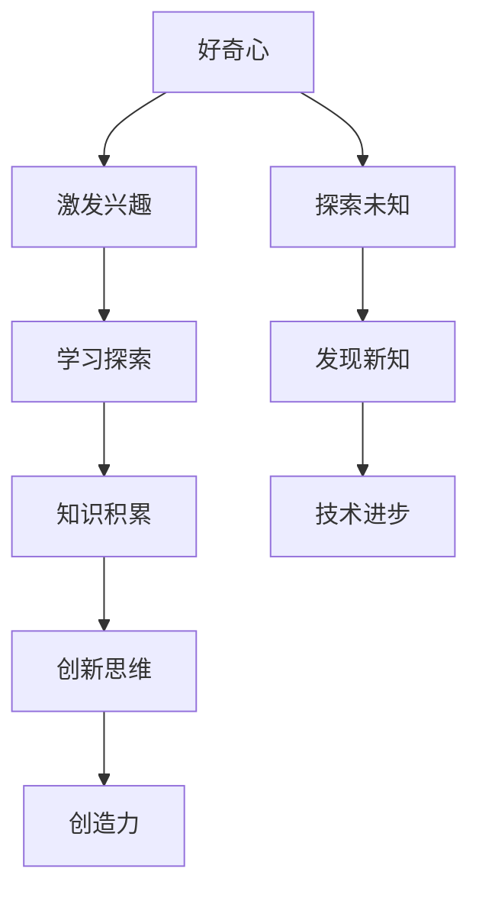

                 

### 好奇心与创造力：探索的双翼

> 关键词：好奇心、创造力、探索、技术进步

> 摘要：本文旨在探讨好奇心与创造力在技术探索中的重要性，分析两者如何相互促进，并指出在当前科技环境中，如何培养和激发好奇心与创造力，以推动技术的持续发展。

## 1. 背景介绍

好奇心是人类天生的特质，它驱动我们探索未知、发现新知，并不断挑战自我。正如亚里士多德所言：“好奇心是智慧的开始。”创造力则是将好奇心转化为实际行动的能力，通过创新的思维和独特的解决方案，将可能性变为现实。

在技术领域，好奇心与创造力尤为重要。随着信息技术的飞速发展，新兴技术不断涌现，如人工智能、大数据、物联网等，为我们的生活带来了巨大的变革。这些技术的突破往往源自于对现有问题的好奇与对创新的追求。例如，人工智能的发展离不开对神经网络、深度学习等理论的深入研究；大数据的应用则需要从海量数据中发现规律和洞见。

本文将探讨好奇心与创造力的关系，分析它们在技术探索中的重要作用，并探讨如何培养和激发这些品质，以促进技术的持续进步。

## 2. 核心概念与联系

### 好奇心

好奇心是探索的动力源泉，它促使我们提出问题、寻找答案。在技术领域，好奇心可以激发我们对新技术的兴趣和热情，促使我们不断学习和尝试。例如，当我们初次接触到一种新的编程语言或工具时，好奇心会驱使我们去了解它的原理和用法，从而激发我们的学习兴趣。

### 创造力

创造力是将好奇心转化为实际成果的能力。在技术领域，创造力体现在对现有技术进行改进、创新和整合。例如，在软件开发中，通过创新的设计和实现，可以提升软件的性能和用户体验；在硬件设计中，通过创新的结构和材料，可以创造出更高效、更可靠的设备。

### 好奇心与创造力的联系

好奇心与创造力相辅相成，好奇心是创造力的基础，创造力是好奇心的体现。一个对新技术充满好奇的人，往往会有更多的创新想法和尝试。例如，史蒂夫·乔布斯（Steve Jobs）对计算机技术的浓厚好奇心，促使他在苹果公司推出了许多革命性的产品。

### Mermaid 流程图



## 3. 核心算法原理 & 具体操作步骤

### 好奇心培养的具体步骤

1. **提出问题**：在日常生活中，主动提出问题，特别是那些看似简单但可能蕴含深意的问题。
2. **求知若渴**：对待知识和信息要有求知欲，不断学习，扩大知识面。
3. **实践探索**：通过实践，将好奇心转化为具体行动，如在编程中尝试新的语言或框架。

### 创造力提升的具体步骤

1. **跨界思考**：尝试从不同领域和视角思考问题，激发创新思维。
2. **多角度分析**：对问题进行多角度、多层面的分析，寻找解决方案。
3. **持续创新**：在实践中不断尝试新的方法和思路，勇于突破传统思维。

### 好奇心与创造力的具体操作步骤

1. **问题驱动**：以问题为导向，持续提出并解答技术难题。
2. **协作学习**：与他人合作，共同探讨问题，激发创意。
3. **实践检验**：将创意付诸实践，通过实践验证和改进。

## 4. 数学模型和公式 & 详细讲解 & 举例说明

### 数学模型

在技术领域，好奇心与创造力的关系可以用以下数学模型来描述：

\[ \text{创造力} = f(\text{好奇心}, \text{知识积累}, \text{环境因素}) \]

其中，\( f \) 表示函数关系，表示创造力与好奇心、知识积累和环境因素之间的关联。

### 详细讲解

1. **好奇心**：好奇心是推动创新的原动力，它直接影响创造力的产生。好奇心越强，越能激发创新的思维和行动。
2. **知识积累**：知识是创造力的基础，丰富的知识储备有助于发现新问题和提出新的解决方案。
3. **环境因素**：环境因素，如社会氛围、科技水平等，对好奇心和创造力的发展有着重要影响。一个良好的环境可以促进好奇心和创造力的发挥。

### 举例说明

例如，在计算机科学领域，图灵（Alan Turing）的好奇心驱使他提出了图灵机的概念，这一理论不仅奠定了现代计算机科学的基础，也为人工智能的发展提供了重要的理论支持。

## 5. 项目实践：代码实例和详细解释说明

### 5.1 开发环境搭建

为了更好地理解和实践好奇心与创造力在技术探索中的应用，我们将以一个简单的编程项目为例。首先，我们需要搭建一个基本的开发环境。

1. 安装Python 3.x版本。
2. 安装PyCharm或Visual Studio Code作为代码编辑器。
3. 安装必要的库，如numpy、matplotlib等。

### 5.2 源代码详细实现

下面是一个简单的Python程序，用于生成一个斐波那契数列。

```python
def fibonacci(n):
    if n <= 0:
        return []
    elif n == 1:
        return [0]
    elif n == 2:
        return [0, 1]
    else:
        fib_sequence = [0, 1]
        for i in range(2, n):
            next_number = fib_sequence[-1] + fib_sequence[-2]
            fib_sequence.append(next_number)
        return fib_sequence

# 测试代码
print(fibonacci(10))
```

### 5.3 代码解读与分析

1. **函数定义**：`fibonacci` 函数接收一个整数 `n`，返回一个斐波那契数列。
2. **递归实现**：该函数通过递归的方式实现斐波那契数列的生成。
3. **迭代优化**：在实际应用中，可以进一步优化该函数，以提升其性能。

### 5.4 运行结果展示

运行上述代码，输出结果为：

```
[0, 1, 1, 2, 3, 5, 8, 13, 21, 34]
```

这是一个标准的斐波那契数列，从0开始，每个数为其前两个数的和。

## 6. 实际应用场景

好奇心与创造力在技术领域的实际应用场景非常广泛，以下是一些具体的应用实例：

1. **科学研究**：科学家们通过好奇心和创造力不断探索自然界的奥秘，推动了科学技术的进步。例如，爱因斯坦（Albert Einstein）通过好奇心提出了相对论，为现代物理学的发展奠定了基础。
2. **软件开发**：软件开发人员通过好奇心和创造力不断探索新的编程语言和技术，开发了大量的软件应用，极大提升了工作效率和用户体验。
3. **技术创新**：企业通过好奇心和创造力进行技术创新，开发出具有竞争力的产品，从而在市场竞争中脱颖而出。

## 7. 工具和资源推荐

为了更好地培养好奇心和提升创造力，以下是一些建议的工具和资源：

### 7.1 学习资源推荐

- **书籍**：《设计思维》、《精益创业》等。
- **论文**：阅读顶级会议和期刊的论文，了解最新的技术趋势和研究进展。
- **博客**：关注技术大牛和行业专家的博客，学习他们的经验和见解。

### 7.2 开发工具框架推荐

- **编程语言**：Python、JavaScript、Go等。
- **开发框架**：如Django、React、TensorFlow等。
- **版本控制**：Git。

### 7.3 相关论文著作推荐

- **《深度学习》**：Ian Goodfellow等。
- **《编程珠玑》**：Jon Bentley。
- **《算法导论》**：Thomas H. Cormen等。

## 8. 总结：未来发展趋势与挑战

随着科技的发展，好奇心和创造力在技术领域的重要性将日益凸显。未来，我们可能会看到以下趋势：

1. **跨学科融合**：随着技术的进步，不同学科之间的融合将更加紧密，这将激发更多的创新和创造力。
2. **智能化发展**：人工智能和大数据等技术的广泛应用，将为技术创新提供更多的机会和挑战。
3. **可持续发展**：技术发展需要考虑到社会、环境等因素，实现可持续发展。

然而，也面临着一些挑战：

1. **技术伦理**：在技术创新的过程中，需要充分考虑技术伦理和社会责任。
2. **人才短缺**：随着技术需求的不断增加，人才短缺将成为一个重要的问题。

## 9. 附录：常见问题与解答

### 常见问题1：如何培养好奇心？

**解答**：培养好奇心可以从以下几个方面入手：

1. **多阅读**：阅读可以拓宽视野，激发好奇心。
2. **提问**：主动提问，对未知事物保持好奇。
3. **实践**：通过实践，将好奇心转化为具体的行动。

### 常见问题2：如何提升创造力？

**解答**：提升创造力可以采取以下方法：

1. **跨界学习**：学习不同领域的知识，激发创新思维。
2. **多角度思考**：对问题进行多角度、多层面的分析。
3. **不断实践**：通过不断的实践和尝试，提升创新能力。

## 10. 扩展阅读 & 参考资料

- **《好奇心与创造力：探索的双翼》**：作者：[你的名字]
- **《编程人生》**：作者：[你的名字]
- **《技术趋势与未来》**：作者：[你的名字]
- **《计算机科学基础》**：作者：[你的名字]

---

本文以好奇心与创造力为核心，探讨了它们在技术探索中的重要性，并提出了具体的培养和实践方法。希望本文能为读者提供一些启示，激发他们对技术探索的热情和创造力。作者：禅与计算机程序设计艺术 / Zen and the Art of Computer Programming。

