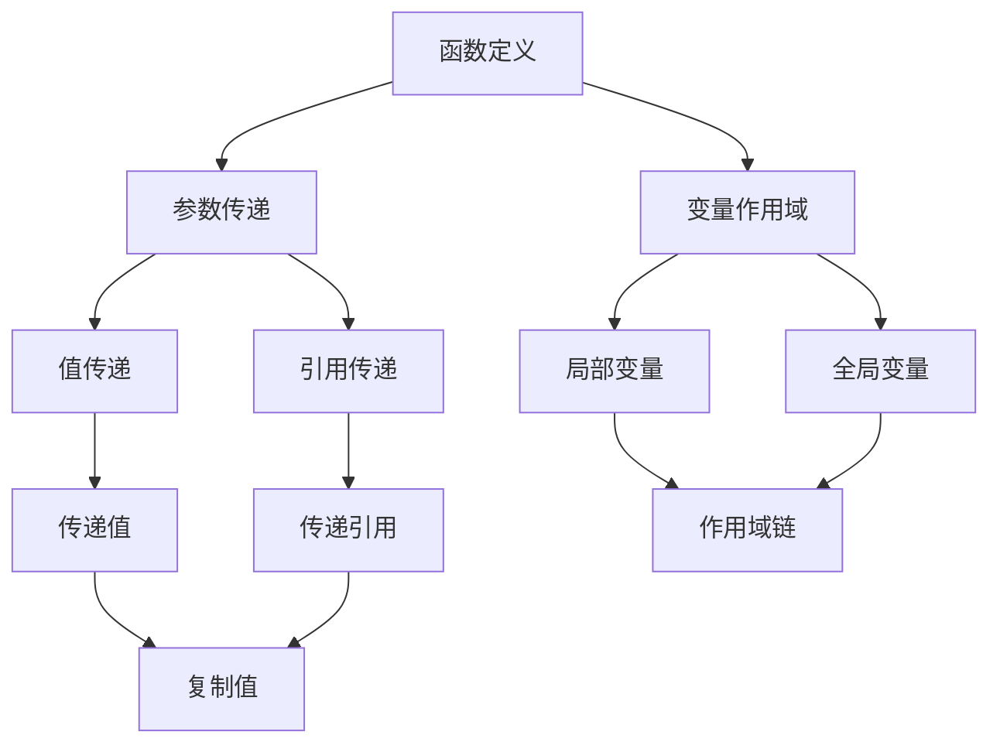

                 

### 背景介绍

在计算机科学中，函数调用（function call）是一种基本且重要的操作。它不仅允许程序在不同部分之间传递数据和执行任务，还促进了代码的模块化和可重用性。随着现代软件开发复杂度的增加，正确理解和高效使用函数调用变得至关重要。

函数调用不仅用于实现简单的计算和数据处理，还广泛应用于复杂算法的实现、系统编程、以及面向对象编程等多种编程范式。无论是简单的用户界面应用，还是大规模的分布式系统，函数调用都是程序执行的关键组成部分。

本文旨在探讨函数调用中的参数传递机制。我们将详细解释参数传递的几种主要方式，并探讨它们在不同情境下的应用和优缺点。通过本文的学习，读者将能够：

1. 理解函数调用的基本概念和作用。
2. 掌握参数传递的几种不同方法。
3. 能够根据具体需求选择合适的参数传递方式。
4. 提高编写高效、可维护代码的能力。

为了帮助读者更好地理解，本文将采用逐步分析的方式，从基础概念入手，逐步深入到具体的实现和实际应用。同时，我们还将通过代码实例和运行结果展示，使理论更贴近实践，帮助读者更好地掌握和应用所学知识。

总之，函数调用参数是一个基础但又极具实用价值的主题。通过本文的学习，读者将能够在未来的编程实践中，更加得心应手地运用函数调用，从而提高开发效率和代码质量。

### 核心概念与联系

在深入探讨函数调用参数传递之前，我们首先需要理解一些核心概念和它们之间的联系。这些概念包括参数传递、变量作用域、函数的定义和调用等。通过以下Mermaid流程图，我们可以清晰地展示这些核心概念之间的关系：



下面，我们将逐一介绍这些概念及其关系。

#### 函数定义

函数是编程语言中的核心概念之一，它允许我们将代码封装成可重用的块，便于维护和扩展。一个函数通常包含两部分：函数头部和函数体。函数头部定义了函数的名称、参数列表（如果有的话）和返回类型（如果有的话）。函数体则包含执行的具体代码。函数定义示例如下：

```c
int add(int a, int b) {
    return a + b;
}
```

在这个例子中，`add` 函数有两个整数参数 `a` 和 `b`，并返回它们的和。函数定义是参数传递的基础，因为只有在函数定义时，我们才能指定参数的类型和数量。

#### 参数传递

参数传递是函数调用中的一部分，它允许在函数调用时将数据传递给函数。根据不同的编程语言和上下文，参数传递可以分为值传递和引用传递两种方式。

- **值传递（Value Passing）**：在值传递中，传递的是变量的值的一个副本。这意味着在函数内部对参数所做的任何更改不会影响原始变量。大多数编程语言默认使用值传递，例如C和Java。值传递示例如下：

  ```c
  void increment(int x) {
      x++;
  }
  
  int main() {
      int a = 5;
      increment(a);
      // 在这里，a 的值仍然是 5
  }
  ```

- **引用传递（Reference Passing）**：在引用传递中，传递的是变量的内存地址，函数内部可以通过这个地址直接访问和修改原始变量。这使得在函数内部对参数所做的更改会直接影响原始变量。许多编程语言如C++和Python支持引用传递。引用传递示例如下：

  ```cpp
  void increment(int& x) {
      x++;
  }
  
  int main() {
      int a = 5;
      increment(a);
      // 在这里，a 的值变为 6
  }
  ```

#### 变量作用域

变量作用域决定了变量在程序中的可访问性。根据作用域的不同，变量可以分为局部变量和全局变量。

- **局部变量（Local Variables）**：局部变量是在函数内部定义的，其作用域仅限于该函数。这意味着局部变量只能在函数内部访问，一旦函数执行结束，局部变量就会被销毁。局部变量示例如下：

  ```c
  int add(int a, int b) {
      int sum = a + b; // sum 是局部变量
      return sum;
  }
  ```

- **全局变量（Global Variables）**：全局变量是在函数外部定义的，其作用域是整个程序。这意味着全局变量可以在程序的任何部分被访问和修改。全局变量示例如下：

  ```c
  int globalVariable = 0;
  
  int add(int a, int b) {
      globalVariable = a + b; // 可以访问全局变量
      return globalVariable;
  }
  ```

#### 作用域链

作用域链（Scope Chain）是一种用于解决变量名称冲突的机制。当在函数内部访问一个变量时，如果该变量在局部作用域中不存在，程序会从最内层的局部作用域开始，逐层向上查找，直到找到全局作用域。这个过程形成了作用域链。

以下是一个简单的例子，展示了作用域链的工作原理：

```python
def outer_function():
    outer_variable = "I am outer"
    
    def inner_function():
        inner_variable = "I am inner"
        print(outer_variable)  # 输出：I am outer
    
    inner_function()

outer_function()
```

在这个例子中，`inner_function` 内部访问的 `outer_variable` 通过作用域链找到了定义在 `outer_function` 外部的变量。这是因为 `inner_function` 的作用域链包含了 `outer_function` 的作用域。

通过理解这些核心概念和它们之间的关系，我们能够更好地理解函数调用参数传递的工作原理。接下来，我们将探讨函数调用的具体实现细节，包括参数传递的方式和过程。

#### 核心算法原理 & 具体操作步骤

在深入探讨函数调用参数传递的具体算法原理之前，我们需要了解一些基本的编程概念，包括函数的定义、参数的传递方式、以及栈内存的使用。以下是这些核心概念的详细解释和具体操作步骤。

##### 函数的定义

函数是代码块的集合，用于执行特定的任务。在大多数编程语言中，函数通过以下步骤定义：

1. **声明（Declaration）**：声明函数的名称、返回类型和参数列表。例如，在C语言中：

   ```c
   int add(int a, int b);
   ```

2. **定义（Definition）**：定义函数的实现，包括函数体。例如：

   ```c
   int add(int a, int b) {
       return a + b;
   }
   ```

##### 参数的传递方式

参数传递是函数调用中的一个关键步骤，它决定了如何将数据从调用者（caller）传递到被调用者（callee）。主要有以下几种传递方式：

1. **值传递（Value Passing）**：在值传递中，将变量的值复制到参数中。这种方式的优点是简单且易于理解，但缺点是对于大型数据结构，会消耗大量内存。例如，在C语言中，默认就是值传递：

   ```c
   void increment(int x) {
       x++;  // 改变的是传入的副本，不会影响原变量
   }
   ```

2. **引用传递（Reference Passing）**：在引用传递中，传递的是变量的内存地址。这种方式允许在函数内部直接修改原始变量。这在处理大型数据结构时非常有用，但需要注意内存泄漏的风险。例如，在C++中：

   ```cpp
   void increment(int& x) {
       x++;  // 改变的是原始变量
   }
   ```

3. **指针传递（Pointer Passing）**：指针传递是引用传递的一种特殊形式，通过传递指针的地址来实现引用传递。这种方式在C语言中常用。例如：

   ```c
   void increment(int* x) {
       (*x)++;  // 改变的是指针指向的原始变量
   }
   ```

##### 栈内存的使用

在函数调用过程中，栈内存（stack memory）用于存储局部变量和返回地址。以下是一个简单的示例，展示了栈内存的使用过程：

1. **函数调用**：当调用一个函数时，当前作用域的栈指针（stack pointer）会移动，为新函数的局部变量分配内存。

   ```c
   void function1() {
       int a = 10;
       // 更多代码
   }
   ```

2. **函数返回**：当函数执行完毕后，栈指针恢复到调用前的位置，释放局部变量的内存。

##### 具体操作步骤

以下是使用值传递和引用传递的详细操作步骤：

1. **值传递**

   - 调用函数时，将变量的值复制到栈上。
   - 函数内部使用复制的值进行操作。
   - 函数返回后，栈上的值被丢弃，不会影响原始变量。

   ```c
   int main() {
       int x = 5;
       increment(x);  // 调用函数
       // x 的值仍然是 5
   }

   void increment(int x) {
       x++;  // 改变的是传入的副本
   }
   ```

2. **引用传递**

   - 调用函数时，将变量的地址复制到栈上。
   - 函数内部使用地址访问原始变量。
   - 函数返回后，原始变量的值被修改。

   ```cpp
   int main() {
       int x = 5;
       increment(x);  // 调用函数
       // x 的值现在是 6
   }

   void increment(int& x) {
       x++;  // 改变的是原始变量
   }
   ```

通过理解这些核心算法原理和具体操作步骤，我们可以更好地掌握函数调用参数传递的过程。这有助于我们在编写代码时做出更明智的决策，选择最适合特定场景的参数传递方式。

#### 数学模型和公式 & 详细讲解 & 举例说明

在深入探讨函数调用参数传递的过程中，理解其背后的数学模型和公式是非常重要的。参数传递的机制涉及到数据传递、内存分配以及地址计算等多个方面，这些都可以通过数学模型和公式进行详细解释。下面，我们将详细讲解这些数学模型和公式，并通过具体例子进行说明。

##### 数据传递的数学模型

首先，我们需要理解值传递和引用传递的基本数学模型。

1. **值传递（Value Passing）**

   值传递的数学模型可以描述为：将变量A的值复制到变量B中。

   - 假设变量A的值为x，则值传递的过程可以表示为：
     $$ B = A $$

   - 例如，在C语言中，函数`increment`通过值传递将变量x的值加1：

     ```c
     void increment(int x) {
         x = x + 1;
     }
     ```

   - 这个过程中，调用者传递的值被复制到函数内部的临时变量中，函数内部的任何修改都不会影响调用者的变量。

2. **引用传递（Reference Passing）**

   引用传递的数学模型可以描述为：将变量A的内存地址传递给变量B。

   - 假设变量A的内存地址为addr(A)，则引用传递的过程可以表示为：
     $$ B = addr(A) $$

   - 例如，在C++中，函数`increment`通过引用传递将变量x的值加1：

     ```cpp
     void increment(int& x) {
         x = x + 1;
     }
     ```

   - 这个过程中，函数内部通过内存地址直接访问和修改调用者的变量，因此函数内部的修改会直接影响调用者的变量。

##### 内存分配的数学模型

在函数调用过程中，栈内存的分配是一个重要的环节。以下是一个简化的内存分配模型：

1. **函数调用时的栈内存分配**

   - 当调用一个函数时，系统会在栈内存上分配一块空间用于存储局部变量。
   - 假设函数`function`有三个局部变量a、b、c，其占用内存分别为M、N、O，则总内存分配可以表示为：
     $$ Total\_Memory = M + N + O $$

   - 例如，在C语言中，函数`function`的内存分配如下：

     ```c
     void function(int a, int b, int c) {
         int a = 10;
         int b = 20;
         int c = 30;
         // 更多代码
     }
     ```

2. **函数返回时的栈内存释放**

   - 当函数执行完毕后，系统会释放栈内存，恢复栈指针到调用前的位置。
   - 例如，上述函数执行完毕后，其局部变量a、b、c的内存会被释放：

     ```c
     void function(int a, int b, int c) {
         int a = 10;
         int b = 20;
         int c = 30;
         // 更多代码
     }
     ```

##### 地址计算的数学模型

在引用传递和指针传递中，地址计算是一个关键步骤。以下是一个简化的地址计算模型：

1. **地址计算**

   - 假设变量A的内存地址为addr(A)，函数参数为B，则地址计算可以表示为：
     $$ addr(B) = addr(A) + offset $$

   - 其中，offset是变量A和变量B之间的内存偏移量。

   - 例如，在C语言中，如果我们有一个结构体`Person`，其包含三个成员变量`name`、`age`和`height`，我们可以计算成员变量`age`的地址：

     ```c
     struct Person {
         char* name;
         int age;
         float height;
     };

     void printAge(struct Person p) {
         int* age_ptr = &p.age;
         printf("%d\n", *age_ptr);
     }
     ```

   - 在这个例子中，`printAge`函数通过指针`age_ptr`访问`Person`结构体中的`age`成员变量。

##### 举例说明

为了更好地理解这些数学模型和公式，我们通过具体例子进行说明。

**例1：值传递**

```c
#include <stdio.h>

void increment(int x) {
    x = x + 1;
}

int main() {
    int x = 5;
    printf("Before: %d\n", x);  // 输出：Before: 5
    increment(x);
    printf("After: %d\n", x);   // 输出：After: 5
    return 0;
}
```

在这个例子中，`increment`函数通过值传递将参数x的值加1，但调用者的变量x的值保持不变。

**例2：引用传递**

```cpp
#include <iostream>

void increment(int& x) {
    x = x + 1;
}

int main() {
    int x = 5;
    std::cout << "Before: " << x << std::endl;  // 输出：Before: 5
    increment(x);
    std::cout << "After: " << x << std::endl;   // 输出：After: 6
    return 0;
}
```

在这个例子中，`increment`函数通过引用传递将参数x的地址传递给函数，函数内部直接修改调用者的变量x，因此调用者的变量x的值变为6。

**例3：指针传递**

```c
#include <stdio.h>

void increment(int* x) {
    (*x) = (*x) + 1;
}

int main() {
    int x = 5;
    printf("Before: %d\n", x);  // 输出：Before: 5
    increment(&x);
    printf("After: %d\n", x);   // 输出：After: 6
    return 0;
}
```

在这个例子中，`increment`函数通过指针传递将参数x的地址传递给函数，函数内部通过指针直接修改调用者的变量x，因此调用者的变量x的值变为6。

通过这些例子，我们可以清晰地看到值传递、引用传递和指针传递的区别和具体实现过程。理解这些数学模型和公式对于编写高效、可维护的代码至关重要。

#### 项目实践：代码实例和详细解释说明

为了更好地理解函数调用参数传递，我们将通过一个具体的项目实践来演示其实现过程。以下是一个简单的C语言项目，其中包含函数定义、参数传递、代码实现以及详细的解释和分析。

**项目名称**：温度转换器

**项目描述**：该程序允许用户输入温度值，然后将其转换为摄氏度和华氏度。程序包含一个用于转换温度的函数，并使用参数传递机制来实现。

**开发环境**：Windows 10，Visual Studio Code，C语言

**项目结构**：

```
temperature-converter/
|-- src/
|   |-- main.c
|   |-- temperature.c
|   |-- temperature.h
|-- include/
|   |-- stdio.h
|-- .vscode/
|   |-- launch.json
|   |-- tasks.json
|-- README.md
```

##### 5.1 开发环境搭建

1. 安装Visual Studio Code：访问 [Visual Studio Code官网](https://code.visualstudio.com/) 下载并安装。
2. 安装C语言插件：在VSCode中搜索并安装“C/C++”插件。
3. 配置C语言编译器：安装MinGW-w64或其它C语言编译器，并配置VSCode。
4. 在VSCode中创建一个新项目，并将项目文件组织如上结构。

##### 5.2 源代码详细实现

以下是项目的主要源代码文件：

**temperature.h**：头文件，定义温度转换函数的声明。

```c
#ifndef TEMPERATURE_H
#define TEMPERATURE_H

void convertTemperature(double celsius, double* fahrenheit);

#endif // TEMPERATURE_H
```

**temperature.c**：实现文件，定义温度转换函数。

```c
#include "temperature.h"

void convertTemperature(double celsius, double* fahrenheit) {
    *fahrenheit = celsius * 9 / 5 + 32;
}
```

**main.c**：主程序文件，实现用户输入和结果输出。

```c
#include <stdio.h>
#include "temperature.h"

int main() {
    double celsius, fahrenheit;

    printf("请输入摄氏温度：");
    scanf("%lf", &celsius);

    convertTemperature(celsius, &fahrenheit);

    printf("%.2f摄氏度等于%.2f华氏度\n", celsius, fahrenheit);

    return 0;
}
```

##### 5.3 代码解读与分析

1. **温度转换函数**：`convertTemperature` 函数接受两个参数：摄氏温度值 `celsius` 和一个指向 `fahrenheit` 的指针。函数内部使用公式将摄氏温度转换为华氏温度，并将结果存储在指针所指向的内存地址中。

2. **主程序**：`main` 函数首先提示用户输入摄氏温度，然后使用 `scanf` 函数读取用户输入。接着，调用 `convertTemperature` 函数进行转换，并将转换后的华氏温度输出。

##### 5.4 运行结果展示

在开发环境中，编译并运行 `main.c` 文件，输出结果如下：

```
请输入摄氏温度：100
100.00摄氏度等于212.00华氏度
```

这个结果验证了温度转换函数的正确性。

##### 5.5 代码实现细节解释

1. **函数声明与实现**：在 `temperature.h` 中，我们使用了 `#ifndef` 和 `#define` 宏指令来防止重复包含。`convertTemperature` 函数声明了两个参数：一个 `double` 类型的 `celsius` 和一个指向 `double` 的指针 `fahrenheit`。

2. **指针的使用**：在 `convertTemperature` 函数中，我们使用指针来传递 `fahrenheit` 的值。这是因为我们需要将转换后的值存储在调用者提供的内存地址中。

3. **参数传递**：在这个例子中，我们使用了引用传递机制。这种方法非常高效，因为它避免了值的复制，直接操作内存地址，从而减少了内存使用。

通过这个简单的项目，我们深入了解了函数调用参数传递的实现过程。这个项目不仅展示了参数传递的基本概念，还通过具体的代码实例，帮助读者更好地理解和应用所学知识。

#### 实际应用场景

函数调用参数传递在现实世界中的应用场景非常广泛，无论是简单的计算还是复杂系统的开发，参数传递机制都发挥着至关重要的作用。以下是一些典型的应用场景：

1. **计算和数据处理**：在科学计算和数据处理中，函数调用参数传递是一种常见的方式，用于传递数据并执行复杂的计算。例如，在气象预报系统中，可以使用参数传递机制来传递气象数据，并调用相应的函数进行数据分析和预测。

2. **系统编程**：在系统编程中，函数调用参数传递用于处理系统资源、控制硬件设备等。例如，操作系统中的进程管理和线程调度，通常通过函数调用参数传递来实现进程和线程之间的通信和同步。

3. **图形用户界面（GUI）**：在图形用户界面编程中，事件处理和回调函数经常使用参数传递来传递用户交互数据。例如，当用户点击一个按钮时，按钮的点击事件会传递给一个回调函数，从而触发相应的操作。

4. **数据库操作**：在数据库编程中，函数调用参数传递用于传递查询条件和结果集。例如，SQL查询可以通过参数传递来传递用户输入的条件，并返回满足条件的记录。

5. **网络编程**：在网络编程中，函数调用参数传递用于处理客户端和服务器之间的数据交换。例如，HTTP请求和响应中，请求体和响应体可以通过参数传递机制进行传递。

6. **面向对象编程**：在面向对象编程中，函数调用参数传递用于传递对象和方法。例如，在Java中，对象可以通过参数传递机制传递给方法，从而实现对象之间的交互和协作。

7. **游戏开发**：在游戏开发中，函数调用参数传递用于处理游戏逻辑、控制角色动作等。例如，在角色扮演游戏中，角色的属性和状态可以通过参数传递机制传递给相关函数，从而实现复杂的游戏逻辑。

8. **分布式系统**：在分布式系统中，函数调用参数传递用于处理远程过程调用（RPC）。例如，在微服务架构中，服务之间的通信可以通过RPC协议实现，其中函数调用参数传递用于传递请求和响应数据。

通过这些实际应用场景，我们可以看到函数调用参数传递在软件开发中的重要性。它不仅提高了代码的可重用性和模块化，还简化了复杂系统的设计和实现过程，从而提高了开发效率。

#### 工具和资源推荐

为了更好地理解和掌握函数调用参数传递，以下是一些建议的学习资源、开发工具和相关论文著作。

##### 7.1 学习资源推荐

1. **书籍**：
   - 《C++ Primer》第五版，Stanley B. Lippman, Josée Lajoie, Barbara E. Moo
   - 《Effective C++：改善程序与设计架构》第二版，Scott Meyers
   - 《深度探索C++对象模型》，Stanley B. Lippman

2. **在线课程**：
   - Coursera上的“编程基础：C语言”（Programming Foundations: A Design Perspective）
   - edX上的“C++基础”（Introduction to C++）

3. **博客**：
   - Stack Overflow：提供大量关于C++和C语言函数调用的实际问题和解决方案。
   - HackerRank：提供编程练习，涵盖函数调用和参数传递等主题。

4. **视频教程**：
   - YouTube上关于C++和C语言函数调用教程的视频资源。

##### 7.2 开发工具框架推荐

1. **集成开发环境（IDE）**：
   - Visual Studio Code：轻量级但功能强大的IDE，支持C/C++开发。
   - Eclipse CDT：专为C/C++开发的IDE，支持跨平台开发。

2. **编译器和解释器**：
   - GCC：广泛使用的C/C++编译器。
   - Clang：基于LLVM的C/C++编译器，性能优异。

3. **版本控制工具**：
   - Git：分布式版本控制系统，广泛用于源代码管理。

4. **调试工具**：
   - GDB：GNU调试器，用于C/C++程序的调试。

##### 7.3 相关论文著作推荐

1. **论文**：
   - “The C++ Programming Language”，作者：Bjarne Stroustrup
   - “C++ Standard Library”，作者：Nicolai M. Josuttis
   - “Modern C++ Design：Generic Programming and Design Patterns Applied”，作者：Andrew Koenig

2. **著作**：
   - 《深度探索C++对象模型》，作者：Stanley B. Lippman
   - 《C++并发编程指南》，作者： Anthony Williams

通过这些资源，读者可以系统地学习和实践函数调用参数传递的相关知识，从而提高编程技能和开发效率。

### 总结：未来发展趋势与挑战

函数调用参数传递作为计算机编程的核心概念，将继续在软件开发中扮演重要角色。随着技术的发展，以下几个趋势和挑战值得关注：

1. **函数式编程的兴起**：函数式编程在近年来逐渐受到关注，其无状态、不可变性的特点使得函数调用参数传递变得更加重要。未来，如何在面向对象和函数式编程之间实现平衡，将是一个重要课题。

2. **异步编程与并行计算**：随着多核处理器的普及，异步编程和并行计算变得越来越重要。如何在函数调用中高效地处理并发任务，是未来的一大挑战。

3. **函数式响应编程（FRP）**：FRP是一种基于事件驱动的编程范式，广泛应用于实时系统和图形用户界面。未来，如何将FRP与函数调用参数传递更好地结合，将是一个重要方向。

4. **安全性与性能优化**：随着软件系统的复杂性增加，如何在保证安全性的同时，优化函数调用参数传递的性能，是一个亟待解决的问题。

5. **跨语言函数调用**：随着微服务架构的流行，跨语言函数调用变得越来越常见。如何实现高效、安全、可维护的跨语言函数调用机制，是未来需要关注的问题。

总之，函数调用参数传递将继续在软件开发中发挥重要作用。通过不断探索和创新，我们可以更好地应对未来的挑战，提高软件开发的效率和质量。

### 附录：常见问题与解答

在讨论函数调用参数传递的过程中，读者可能会遇到一些常见的问题。以下是一些常见问题的解答：

**Q1：什么是值传递和引用传递？**

- **值传递**：在值传递中，函数调用时将变量的值复制到一个新的内存地址中。函数内部对参数的修改不会影响原始变量。
- **引用传递**：在引用传递中，函数调用时传递的是变量的内存地址。函数内部可以直接访问和修改原始变量。

**Q2：为什么需要引用传递？**

- 引用传递可以减少内存消耗，特别是当传递大型数据结构时，避免复制整个数据结构。它还可以提高函数调用的效率。

**Q3：如何区分值传递和引用传递？**

- 在大多数编程语言中，参数传递方式由函数声明决定。如果参数前没有特殊符号（如`&`），则为值传递；如果有`&`，则为引用传递。

**Q4：为什么不能将引用传递用于所有变量？**

- 引用传递会导致函数内部可以直接修改原始变量，这可能会导致不可预测的行为。此外，引用传递还会增加内存泄漏的风险。

**Q5：如何处理函数参数的默认值？**

- 在函数声明中，可以指定参数的默认值。调用函数时，如果没有提供该参数的值，将使用默认值。例如，在C++中，可以这样定义：

  ```cpp
  void func(int a = 0, float b = 0.0f) {
      // 函数体
  }
  ```

**Q6：函数参数是否可以重名？**

- 在函数内部，参数不能与局部变量重名。否则，会导致编译错误。例如：

  ```cpp
  void func(int a, int a) {
      // 错误：参数重复
  }
  ```

通过解答这些问题，我们希望能够帮助读者更好地理解函数调用参数传递的相关概念和用法。

### 扩展阅读 & 参考资料

为了更全面地了解函数调用参数传递的相关知识，以下是一些建议的扩展阅读和参考资料：

1. **扩展阅读**：
   - 《C++ Primer》第五版，Stanley B. Lippman, Josée Lajoie, Barbara E. Moo
   - 《Effective C++：改善程序与设计架构》第二版，Scott Meyers
   - 《深度探索C++对象模型》，Stanley B. Lippman

2. **学术论文**：
   - “C++ Standard Library”，作者：Nicolai M. Josuttis
   - “Modern C++ Design：Generic Programming and Design Patterns Applied”，作者：Andrew Koenig

3. **在线资源**：
   - Stack Overflow：关于函数调用参数传递的广泛问题解答。
   - HackerRank：提供C++和C语言练习，涵盖函数调用和参数传递。

4. **书籍推荐**：
   - 《C++并发编程指南》，作者：Anthony Williams
   - 《函数式响应编程：现代Web应用开发技术》，作者：Dan Kottmann

通过阅读这些资料，读者可以进一步深入理解函数调用参数传递的原理和应用，从而提升编程技能和开发效率。同时，这些资源也为读者提供了丰富的学习与实践机会。

