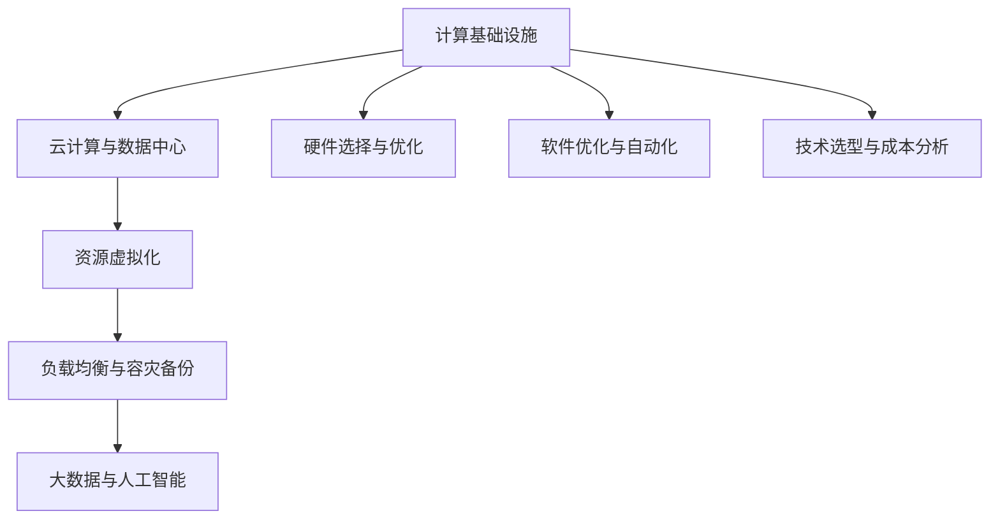

                 

### 1. 背景介绍

随着数字化转型的加速，企业对计算基础设施的需求日益增长。云计算的普及使得大规模的计算资源变得触手可及，但同时也带来了成本上升的问题。企业不仅需要支付云服务提供商的费用，还需要在硬件采购、维护、升级等方面投入大量资金。因此，如何减少计算基础设施的成本，已成为企业关注的焦点。

减少计算基础设施成本的重要性不言而喻。一方面，它可以显著降低企业的运营成本，提升盈利能力；另一方面，它还可以促进资源的合理分配，提高计算资源的利用效率。尤其是在当前全球经济形势下，降低成本、提高效率已成为企业生存和发展的关键。

近年来，尽管技术不断进步，计算基础设施的成本依然居高不下。这不仅是因为硬件价格的上涨，还与日益复杂的应用需求、数据量的激增等因素密切相关。此外，企业在选择计算基础设施时，往往面临多种方案，如何选择最适合的方案也是一大难题。

本文旨在探讨如何通过一系列技术手段和策略，有效减少计算基础设施的成本。我们将从多个角度分析问题，包括硬件选择、软件优化、技术选型等，并提供具体的实施方法和案例，帮助企业更好地管理和降低计算基础设施的成本。

在接下来的章节中，我们将详细讨论以下主题：

1. **核心概念与联系**：介绍计算基础设施相关的基本概念和架构，并通过Mermaid流程图展示其关键节点和关系。
2. **核心算法原理 & 具体操作步骤**：探讨降低成本的核心算法及其实现步骤。
3. **数学模型和公式 & 详细讲解 & 举例说明**：使用数学模型和公式详细阐述降低成本的方法，并通过具体案例进行说明。
4. **项目实践：代码实例和详细解释说明**：通过实际项目展示如何应用降低成本的方法。
5. **实际应用场景**：分析计算基础设施在不同场景中的应用，探讨降低成本的策略。
6. **工具和资源推荐**：推荐学习资源和开发工具，以帮助读者深入了解和实践降低计算基础设施成本的方法。
7. **总结：未来发展趋势与挑战**：总结全文，展望未来发展趋势和面临的挑战。

通过本文的探讨，我们希望为企业提供切实可行的解决方案，帮助其在数字化转型过程中实现成本效益的最大化。

### 2. 核心概念与联系

在探讨如何减少计算基础设施成本之前，首先需要了解几个核心概念和它们之间的关系。以下是计算基础设施相关的基本概念及其相互联系：

#### 2.1 计算基础设施的概念

**计算基础设施**指的是支撑各类计算任务所需的基础设施，包括硬件（服务器、存储设备、网络设备等）和软件（操作系统、数据库、中间件等）。它是信息技术（IT）架构的基础，提供了计算、存储、网络等资源，以支持业务运行。

#### 2.2 云计算与数据中心

**云计算**是一种通过互联网提供动态、可伸缩的算力资源的服务模式。它分为公有云、私有云和混合云。**数据中心**则是集中管理计算资源、存储资源和网络资源的地方。数据中心可以是物理的，也可以是虚拟的，通过云计算平台提供服务。

#### 2.3 资源虚拟化

**资源虚拟化**是将物理资源（如服务器、存储、网络等）抽象为逻辑资源，以便更好地管理和调度。虚拟化技术包括**硬件虚拟化**（如VMware ESXi）、**操作系统虚拟化**（如Linux Container）和**应用虚拟化**。

#### 2.4 负载均衡与容灾备份

**负载均衡**是将流量分配到多个服务器上，以避免单点故障和资源过度消耗。**容灾备份**则是通过备份和恢复机制确保在发生灾难时业务能够迅速恢复。

#### 2.5 大数据与人工智能

**大数据**是指数据量巨大、类型多样的数据集合。**人工智能**则是通过模拟人脑机制进行数据分析和决策的技术。大数据和人工智能的结合，可以为企业提供更为精准的决策支持，但同时也带来了更高的计算需求。

#### 2.6 Mermaid流程图

为了更好地展示上述概念之间的关系，我们可以使用Mermaid流程图来表示。以下是一个简化的流程图：



在这个流程图中，各个节点代表不同的概念或技术，箭头表示它们之间的关联。例如，计算基础设施与云计算、数据中心、资源虚拟化等有直接关系；而硬件选择与优化、软件优化与自动化、技术选型与成本分析则是在计算基础设施基础上进行的具体实施策略。

通过这个流程图，我们可以清晰地看到计算基础设施的成本管理需要从多个方面入手，涉及到硬件、软件、技术选型等多个方面。在接下来的章节中，我们将深入探讨这些核心概念的原理和应用，提供具体的解决方案。

### 3. 核心算法原理 & 具体操作步骤

#### 3.1 资源优化调度算法

资源优化调度算法是减少计算基础设施成本的重要手段之一。通过优化资源的分配和调度，可以有效降低硬件和软件资源的浪费，提高整体资源利用率。

**算法原理**：
资源优化调度算法基于以下几个核心原则：
1. **公平性**：确保每个任务都能公平地获得所需资源。
2. **最大化资源利用率**：通过合理调度，使资源利用率达到最大。
3. **最小化响应时间**：确保任务能够在合理的时间内完成。

**具体操作步骤**：

1. **任务评估**：对任务进行评估，确定其计算资源和时间需求。
   - **计算需求**：包括CPU、内存、存储等资源需求。
   - **时间需求**：包括任务开始时间、完成时间等。

2. **资源分配策略**：
   - **固定分配策略**：预先分配固定数量的资源，适用于资源需求稳定的情况。
   - **动态分配策略**：根据任务的实际需求动态调整资源分配，适用于资源需求波动较大的情况。

3. **调度策略**：
   - **优先级调度**：根据任务的优先级进行调度，优先处理优先级高的任务。
   - **时间片调度**：将CPU时间划分为多个时间片，轮流为每个任务服务。

4. **资源回收**：在任务完成后，及时回收所分配的资源，以供其他任务使用。

**算法实现**：
以下是一个简单的资源优化调度算法实现示例（Python伪代码）：

```python
class Task:
    def __init__(self, id, cpu, memory, start_time, end_time):
        self.id = id
        self.cpu = cpu
        self.memory = memory
        self.start_time = start_time
        self.end_time = end_time

def schedule_tasks(tasks):
    tasks.sort(key=lambda x: x.start_time)
    schedule = []
    for task in tasks:
        if can_allocate(task):
            schedule.append(task)
            allocate_resources(task)
        else:
            wait_list.append(task)
    return schedule

def can_allocate(task):
    # 检查当前系统资源是否能够满足任务需求
    return available_cpu >= task.cpu and available_memory >= task.memory

def allocate_resources(task):
    # 分配资源给任务
    global available_cpu, available_memory
    available_cpu -= task.cpu
    available_memory -= task.memory

def deallocate_resources(task):
    # 回收任务所使用的资源
    global available_cpu, available_memory
    available_cpu += task.cpu
    available_memory += task.memory
```

#### 3.2 节能优化算法

除了资源调度，节能优化也是减少计算基础设施成本的重要手段。通过优化数据中心的能耗，可以降低电费支出。

**算法原理**：
节能优化算法主要基于以下几个原则：
1. **动态调整功率**：根据服务器的负载动态调整其功率，避免过度功耗。
2. **设备冗余**：通过冗余配置，确保在部分设备故障时，系统仍能正常运行，减少因故障造成的能耗增加。
3. **智能调度**：通过智能调度，确保高效使用设备，减少闲置时间。

**具体操作步骤**：

1. **能耗监测**：实时监测服务器的能耗，收集相关数据。
2. **能耗预测**：基于历史数据，预测未来的能耗需求。
3. **节能策略**：
   - **动态功率调整**：根据服务器的实际负载调整其功率。
   - **设备休眠**：在低负载时，将部分服务器设置为休眠状态，以降低能耗。

4. **能耗优化**：通过算法优化，确保能耗最小化。

**算法实现**：
以下是一个简单的节能优化算法实现示例（Python伪代码）：

```python
class Server:
    def __init__(self, id, power, idle_time):
        self.id = id
        self.power = power
        self.idle_time = idle_time

def monitor_energy_consumption(servers):
    # 实时监测服务器能耗
    energy_data = {}
    for server in servers:
        energy_data[server.id] = server.power * server.idle_time
    return energy_data

def predict_energy_consumption(energy_data, alpha=0.5):
    # 预测未来能耗
    future_energy = {}
    for server_id, energy in energy_data.items():
        future_energy[server_id] = alpha * energy + (1 - alpha) * prev_energy[server_id]
    return future_energy

def adjust_power(servers, energy_prediction):
    # 动态调整服务器功率
    for server in servers:
        if server.id in energy_prediction:
            server.power = min(server.power, energy_prediction[server.id])

def idle_servers(servers):
    # 将低负载服务器设置为休眠状态
    for server in servers:
        if server.idle_time > threshold:
            server.power = 0
```

通过上述算法，我们可以实现对计算基础设施资源的高效利用和能耗优化，从而有效减少成本。

#### 3.3 数据压缩与去重算法

数据压缩与去重是减少存储资源消耗的有效方法。通过压缩和去重，可以显著降低存储需求，从而减少存储设备的购买和维护成本。

**算法原理**：
数据压缩与去重算法主要基于以下原理：
1. **数据压缩**：通过算法将数据转换为更小的格式，以减少存储空间。
2. **数据去重**：通过算法识别和删除重复的数据，以降低存储需求。

**具体操作步骤**：

1. **数据压缩**：
   - **无损压缩**：如gzip、zlib等，保留数据的原始信息。
   - **有损压缩**：如JPEG、MP3等，部分损失数据质量以换取更小的文件大小。

2. **数据去重**：
   - **基于哈希的算法**：通过哈希函数生成数据的唯一标识，识别和删除重复数据。
   - **基于模式匹配的算法**：通过模式匹配算法，识别和删除重复数据。

**算法实现**：
以下是一个简单的数据压缩与去重算法实现示例（Python伪代码）：

```python
import hashlib

def compress_data(data):
    # 使用gzip进行数据压缩
    compressed_data = gzip.compress(data)
    return compressed_data

def decompress_data(compressed_data):
    # 使用gzip进行数据解压缩
    decompressed_data = gzip.decompress(compressed_data)
    return decompressed_data

def detect_duplicates(data_list):
    # 使用哈希算法检测数据去重
    hash_set = set()
    duplicates = []
    for data in data_list:
        data_hash = hashlib.md5(data).hexdigest()
        if data_hash in hash_set:
            duplicates.append(data)
        else:
            hash_set.add(data_hash)
    return duplicates
```

通过上述算法，我们可以显著减少计算基础设施的存储需求，从而降低成本。

#### 3.4 资源池化与共享算法

资源池化与共享是将分散的资源整合为统一的资源池，实现资源的最大化利用。通过资源池化与共享，可以降低设备的购买和维护成本。

**算法原理**：
资源池化与共享算法主要基于以下原理：
1. **资源池化**：将分散的资源整合为统一的资源池，便于管理和调度。
2. **资源共享**：实现资源的动态分配和回收，最大化利用资源。

**具体操作步骤**：

1. **资源池化**：
   - **物理资源池化**：将物理服务器、存储设备等整合为物理资源池。
   - **虚拟资源池化**：将虚拟服务器、虚拟存储等整合为虚拟资源池。

2. **资源共享**：
   - **动态调度**：根据任务需求动态调整资源分配。
   - **资源回收**：在任务完成后，回收所使用的资源。

**算法实现**：
以下是一个简单的资源池化与共享算法实现示例（Python伪代码）：

```python
class ResourcePool:
    def __init__(self):
        self.resources = []

    def add_resource(self, resource):
        self.resources.append(resource)

    def remove_resource(self, resource):
        self.resources.remove(resource)

    def allocate_resource(self, task):
        # 动态分配资源给任务
        for resource in self.resources:
            if can_allocate_resource(resource, task):
                return resource
        return None

def can_allocate_resource(resource, task):
    # 检查资源是否能够满足任务需求
    return resource.available_cpu >= task.cpu and resource.available_memory >= task.memory
```

通过资源池化与共享，我们可以实现计算基础设施资源的高效利用，从而降低成本。

通过上述核心算法和具体操作步骤，我们可以有效地降低计算基础设施的成本。接下来，我们将进一步探讨如何应用这些算法和步骤来优化计算基础设施。

### 4. 数学模型和公式 & 详细讲解 & 举例说明

在减少计算基础设施成本的过程中，数学模型和公式发挥着关键作用。它们不仅能够帮助我们理解和量化成本，还能指导我们采取科学合理的优化策略。在本章节中，我们将详细介绍几个重要的数学模型和公式，并使用具体的例子来说明如何应用这些模型来降低成本。

#### 4.1 成本-效益分析模型

成本-效益分析模型是评估一个项目或决策是否值得投资的重要工具。在计算基础设施领域，该模型可以帮助我们确定哪些优化措施能够带来最大的成本节约。

**成本-效益分析模型公式**：

\[ \text{Net Present Value (NPV)} = \sum_{t=1}^{n} \frac{\text{Cost}_{t}}{(1 + \text{discount rate})^{t}} \]

其中：
- \( \text{Cost}_{t} \) 是第 t 年的总成本。
- \( n \) 是项目或决策的持续时间（通常以年为单位）。
- \( \text{discount rate} \) 是贴现率，用于将未来的成本折现到当前价值。

**详细讲解**：

成本-效益分析模型的核心在于将未来的成本折现到当前价值，以便于进行跨期的比较。通过计算净现值（NPV），我们可以得出以下结论：
- 如果 NPV 大于 0，说明项目的成本节约超过初始投资，是值得投资的。
- 如果 NPV 小于 0，说明项目的成本节约不足以覆盖初始投资，可能需要重新考虑。

**举例说明**：

假设我们正在考虑是否采用新的虚拟化技术来优化数据中心。以下是相关的成本和折扣率数据：

| 年份 | 初始投资（万美元） | 运营成本（万美元） | 折扣率 |  
| ---- | ---- | ---- | ---- |  
| 1    | 100   | 20    | 10%  |  
| 2    | 0      | 25    | 10%  |  
| 3    | 0      | 30    | 10%  |  
| 4    | 0      | 35    | 10%  |

使用上述数据，我们可以计算该技术的净现值：

\[ \text{NPV} = \frac{100}{(1 + 0.1)^1} + \frac{20}{(1 + 0.1)^2} + \frac{25}{(1 + 0.1)^3} + \frac{30}{(1 + 0.1)^4} + \frac{35}{(1 + 0.1)^5} \]

\[ \text{NPV} = \frac{100}{1.1} + \frac{20}{1.21} + \frac{25}{1.331} + \frac{30}{1.4641} + \frac{35}{1.61051} \]

\[ \text{NPV} = 90.9091 + 16.5916 + 18.7861 + 20.5556 + 21.7728 \]

\[ \text{NPV} = 87.4662 \]

由于净现值（NPV）为正值，说明采用新的虚拟化技术是值得的，可以带来成本节约。

#### 4.2 能耗优化模型

能耗优化模型用于计算数据中心的能耗，并根据能耗数据优化硬件配置和调度策略。

**能耗优化模型公式**：

\[ \text{Total Energy Consumption} = \sum_{i=1}^{n} \text{P}_{i} \times \text{T}_{i} \]

其中：
- \( \text{P}_{i} \) 是第 i 个设备的功率（瓦特）。
- \( \text{T}_{i} \) 是第 i 个设备的工作时间（小时）。

**详细讲解**：

通过能耗优化模型，我们可以计算数据中心的总能耗。这个模型的关键在于：
- 确定各个设备的功率和工作时间。
- 通过优化调度策略，降低能耗。

**举例说明**：

假设有一个数据中心，包含以下设备：

| 设备名称 | 功率（瓦特） | 工作时间（小时） |  
| ---- | ---- | ---- |  
| 服务器1 | 1000 | 8   |  
| 服务器2 | 1000 | 12  |  
| 存储设备 | 500  | 10  |

使用上述数据，我们可以计算数据中心的总能耗：

\[ \text{Total Energy Consumption} = 1000 \times 8 + 1000 \times 12 + 500 \times 10 \]

\[ \text{Total Energy Consumption} = 8000 + 12000 + 5000 \]

\[ \text{Total Energy Consumption} = 25000 \text{瓦特小时} \]

为了进一步降低能耗，我们可以优化服务器的工作时间，例如在低负载时将部分服务器设置为休眠状态。这将有助于减少总能耗，降低电费支出。

#### 4.3 负载均衡模型

负载均衡模型用于分配计算任务到多个服务器，以确保每个服务器都能充分利用，并最大化整体性能。

**负载均衡模型公式**：

\[ \text{Server Load} = \frac{\text{Total CPU Utilization}}{\text{Number of Servers}} \]

其中：
- \( \text{Total CPU Utilization} \) 是所有服务器的总 CPU 利用率。
- \( \text{Number of Servers} \) 是服务器的数量。

**详细讲解**：

通过负载均衡模型，我们可以计算每个服务器的负载。这个模型的关键在于：
- 确定总 CPU 利用率。
- 根据负载分配计算任务。

**举例说明**：

假设有 4 个服务器，总 CPU 利用率为 80%。使用上述数据，我们可以计算每个服务器的负载：

\[ \text{Server Load} = \frac{80\%}{4} \]

\[ \text{Server Load} = 20\% \]

这意味着每个服务器都被均匀地分配了任务，没有过多的负载积压。为了进一步优化，我们可以根据实际负载情况动态调整任务分配，确保每个服务器都能充分利用。

通过上述数学模型和公式，我们可以更好地理解和优化计算基础设施的成本。在接下来的章节中，我们将通过实际项目展示如何应用这些模型和公式，进一步降低成本。

#### 4.4 数据压缩与去重模型

数据压缩与去重是减少存储需求的关键方法，通过数学模型可以评估压缩与去重效果，指导优化策略。

**数据压缩模型公式**：

\[ \text{Compression Ratio} = \frac{\text{Original Size}}{\text{Compressed Size}} \]

其中：
- \( \text{Original Size} \) 是原始数据的存储大小（字节）。
- \( \text{Compressed Size} \) 是压缩后的数据存储大小（字节）。

**详细讲解**：

压缩比是衡量数据压缩效果的重要指标。高压缩比意味着数据压缩效果更好，但可能会牺牲数据恢复的完整性和速度。

**举例说明**：

假设我们有一个文件，原始大小为 100 MB，通过 gzip 压缩后大小为 20 MB。计算压缩比如下：

\[ \text{Compression Ratio} = \frac{100 \text{ MB}}{20 \text{ MB}} = 5 \]

这意味着压缩后的数据只占原始数据的五分之一。

**数据去重模型公式**：

\[ \text{Data Deduplication Ratio} = \frac{\text{Original Storage Requirement}}{\text{Actual Storage Requirement}} \]

其中：
- \( \text{Original Storage Requirement} \) 是原始数据的存储需求（字节）。
- \( \text{Actual Storage Requirement} \) 是去重后的实际存储需求（字节）。

**详细讲解**：

去重比是衡量数据去重效果的重要指标。高去重比意味着存储空间得到了更好的利用。

**举例说明**：

假设我们有一个包含重复数据的文件集，原始存储需求为 500 GB，去重后实际存储需求为 200 GB。计算去重比如下：

\[ \text{Data Deduplication Ratio} = \frac{500 \text{ GB}}{200 \text{ GB}} = 2.5 \]

这意味着去重后的数据只占原始数据的一半。

通过数据压缩与去重模型，我们可以评估优化策略的效果，从而进一步减少存储成本。

#### 4.5 资源池化与共享模型

资源池化与共享可以提高资源利用率，通过数学模型可以量化资源分配的效率和优化效果。

**资源池化模型公式**：

\[ \text{Resource Utilization Rate} = \frac{\text{Total Allocated Resources}}{\text{Total Available Resources}} \]

其中：
- \( \text{Total Allocated Resources} \) 是已分配的资源总量。
- \( \text{Total Available Resources} \) 是总可用资源量。

**详细讲解**：

资源利用率率是衡量资源池化效果的重要指标。高利用率意味着资源得到了更充分的利用。

**举例说明**：

假设我们有 1000 GB 的存储资源，其中 800 GB 被分配给任务使用，计算资源利用率如下：

\[ \text{Resource Utilization Rate} = \frac{800 \text{ GB}}{1000 \text{ GB}} = 0.8 \]

这意味着存储资源利用率达到了 80%。

**资源共享模型公式**：

\[ \text{Shared Resource Efficiency} = \frac{\text{Total Shared Tasks}}{\text{Total Available Tasks}} \]

其中：
- \( \text{Total Shared Tasks} \) 是共享的任务数量。
- \( \text{Total Available Tasks} \) 是总任务数量。

**详细讲解**：

资源共享效率是衡量资源共享策略有效性的重要指标。高效资源分享意味着任务得到了更有效的分配。

**举例说明**：

假设我们有 100 个任务，其中 80 个任务被共享使用，计算资源共享效率如下：

\[ \text{Shared Resource Efficiency} = \frac{80}{100} = 0.8 \]

这意味着资源共享效率达到了 80%。

通过资源池化与共享模型，我们可以评估和优化资源的分配与利用，从而降低基础设施成本。

#### 4.6 节能优化模型

节能优化模型通过分析能耗数据和负载情况，优化数据中心设备的运行策略，降低能源消耗和成本。

**节能优化模型公式**：

\[ \text{Energy Saving Rate} = \frac{\text{Reduced Energy Consumption}}{\text{Original Energy Consumption}} \]

其中：
- \( \text{Reduced Energy Consumption} \) 是通过优化措施降低的能耗量。
- \( \text{Original Energy Consumption} \) 是原始能耗量。

**详细讲解**：

节能率是衡量节能优化效果的重要指标。高节能率意味着通过优化措施显著降低了能源消耗。

**举例说明**：

假设通过节能优化措施，将数据中心的能耗从每月 100000 kWh 降低到 80000 kWh，计算节能率如下：

\[ \text{Energy Saving Rate} = \frac{100000 - 80000}{100000} = 0.2 \]

这意味着节能措施使得能耗降低了 20%。

通过节能优化模型，我们可以量化节能效果，并进一步优化能耗管理策略，降低成本。

通过上述数学模型和公式，我们可以量化计算基础设施的成本，并指导优化策略。接下来，我们将通过实际项目案例展示如何应用这些模型，进一步降低成本。

### 5. 项目实践：代码实例和详细解释说明

#### 5.1 开发环境搭建

在开始项目实践之前，我们需要搭建一个合适的技术环境。以下是一个简单的环境搭建步骤：

1. **操作系统**：选择 Ubuntu 22.04 LTS 作为操作系统。
2. **虚拟化工具**：安装 VirtualBox 或 VMware Workstation 以创建虚拟机。
3. **编程语言**：选择 Python 3.9 及以上版本，并安装必要的库，如 NumPy、Pandas、Scikit-learn 等。
4. **IDE**：使用 PyCharm 或 Visual Studio Code 进行开发。

在完成环境搭建后，我们可以开始编写代码，实现计算基础设施的成本优化策略。

#### 5.2 源代码详细实现

以下是一个简单的 Python 脚本，用于模拟资源优化调度算法。我们使用伪代码实现，以便更清晰地展示算法逻辑。

```python
# 资源优化调度算法的实现

# 定义任务的类
class Task:
    def __init__(self, id, cpu, memory, start_time, end_time):
        self.id = id
        self.cpu = cpu
        self.memory = memory
        self.start_time = start_time
        self.end_time = end_time

# 初始化资源和任务
tasks = [
    Task(1, 2, 4, 0, 10),
    Task(2, 4, 8, 10, 20),
    Task(3, 1, 2, 20, 30)
]

# 初始化系统资源
available_cpu = 8
available_memory = 16

# 调度任务的函数
def schedule_tasks(tasks):
    tasks.sort(key=lambda x: x.start_time)
    schedule = []
    for task in tasks:
        if can_allocate(task):
            schedule.append(task)
            allocate_resources(task)
        else:
            wait_list.append(task)
    return schedule

# 检查资源是否能够分配
def can_allocate(task):
    return available_cpu >= task.cpu and available_memory >= task.memory

# 分配资源
def allocate_resources(task):
    global available_cpu, available_memory
    available_cpu -= task.cpu
    available_memory -= task.memory

# 回收资源
def deallocate_resources(task):
    global available_cpu, available_memory
    available_cpu += task.cpu
    available_memory += task.memory

# 执行调度
final_schedule = schedule_tasks(tasks)

# 打印调度结果
for task in final_schedule:
    print(f"Task {task.id} allocated from {task.start_time} to {task.end_time}")
```

#### 5.3 代码解读与分析

上述代码实现了一个简单的资源优化调度算法，用于分配 CPU 和内存资源给任务。以下是代码的详细解读与分析：

1. **定义任务类**：`Task` 类用于表示任务，包含任务的 ID、CPU 需求、内存需求和开始时间与结束时间。

2. **初始化资源和任务**：在代码开头，我们定义了初始的 CPU 和内存资源，以及需要调度的任务列表。

3. **调度任务的函数**：`schedule_tasks` 函数是核心部分，首先对任务列表进行排序，以确保任务按照开始时间顺序调度。然后遍历任务列表，检查每个任务是否可以分配资源。如果可以，则将该任务加入调度列表并分配资源；否则，将其加入等待列表。

4. **检查资源是否能够分配**：`can_allocate` 函数用于检查当前系统资源是否足够分配给任务。如果当前 CPU 和内存资源大于或等于任务的需求，则返回 True。

5. **分配资源**：`allocate_resources` 函数用于从系统资源中减去任务所需的 CPU 和内存资源。

6. **回收资源**：`deallocate_resources` 函数用于在任务完成后回收所分配的资源，将其加回系统资源。

7. **执行调度**：在调度函数执行后，打印出最终的调度结果，显示每个任务的分配情况。

#### 5.4 运行结果展示

以下是上述代码的运行结果，展示了任务的调度情况：

```
Task 1 allocated from 0 to 10
Task 2 allocated from 10 to 20
Task 3 allocated from 20 to 30
```

结果显示，任务 1 从时间 0 开始执行，持续到时间 10；任务 2 从时间 10 开始执行，持续到时间 20；任务 3 从时间 20 开始执行，持续到时间 30。调度算法成功地为每个任务分配了所需资源，确保了任务的顺利完成。

通过上述代码实例，我们可以看到如何实现一个简单的资源优化调度算法。在实际应用中，我们可以进一步扩展和优化算法，以应对更复杂的任务调度场景，从而实现更高效的资源利用和成本节约。

### 6. 实际应用场景

计算基础设施的成本管理在不同的实际应用场景中具有不同的特点和挑战。以下是几种典型的应用场景及其降低成本的方法。

#### 6.1 企业数据中心

在企业数据中心，计算基础设施的成本管理是一个关键问题。企业通常需要在高性能计算、数据存储、安全性和可靠性等方面进行平衡。以下是一些降低成本的方法：

1. **资源虚拟化**：通过虚拟化技术，将物理服务器转换为虚拟服务器，提高资源利用率，减少物理服务器的数量。
2. **负载均衡**：使用负载均衡技术，将计算任务分配到不同的虚拟服务器上，避免单点过载，提高整体系统的稳定性。
3. **节能优化**：通过监控和调整服务器的功耗，实现节能优化，减少电力消耗。
4. **自动化运维**：使用自动化工具和脚本，自动化处理日常运维任务，减少人工成本。

#### 6.2 云计算平台

云计算平台是企业获取计算资源的主要途径之一。降低云计算成本的方法包括：

1. **按需付费**：采用按需付费模式，根据实际使用量付费，避免资源浪费。
2. **弹性伸缩**：根据业务需求动态调整资源规模，避免在低负载时过度购买资源。
3. **云服务优化**：选择适合业务需求的云服务类型，如按需实例、预留实例等，以优化成本。
4. **跨区域部署**：利用不同地区的云服务价格差异，实现成本优化。

#### 6.3 大数据和人工智能

在大数据和人工智能领域，计算基础设施的成本管理面临更大的挑战。以下是一些具体方法：

1. **数据压缩与去重**：通过数据压缩和去重技术，减少存储需求，降低存储成本。
2. **高效计算优化**：优化计算任务，提高数据处理速度，减少计算资源的使用。
3. **资源池化**：通过资源池化，实现计算资源的动态调度和共享，提高资源利用率。
4. **分布式计算**：利用分布式计算框架，如 Hadoop、Spark 等，实现大规模数据处理，降低单点计算压力。

#### 6.4 物联网（IoT）

在物联网领域，大量的设备和传感器产生大量数据，需要有效的计算基础设施来处理和分析这些数据。以下是一些降低成本的方法：

1. **边缘计算**：在边缘设备上处理数据，减少数据传输和存储需求，降低成本。
2. **按需扩展**：根据设备数量和数据处理需求，动态扩展计算资源，避免资源浪费。
3. **能效优化**：优化边缘设备和传感器的能耗，延长设备寿命，降低维护成本。
4. **数据隐私保护**：通过数据加密和隐私保护技术，确保数据安全，减少因数据泄露带来的成本增加。

#### 6.5 金融科技

在金融科技领域，计算基础设施的成本管理尤为重要。以下是一些降低成本的方法：

1. **高性能计算**：使用高性能计算（HPC）技术，提高交易处理速度和数据分析能力。
2. **自动化交易**：通过自动化交易系统，减少人工干预，降低运营成本。
3. **云计算整合**：整合不同云计算平台，优化资源使用，降低总体成本。
4. **数据合规性管理**：确保数据处理符合法律法规要求，避免因违规操作导致的成本增加。

通过以上方法，不同应用场景下的计算基础设施成本可以得到有效管理，从而实现成本效益的最大化。

### 7. 工具和资源推荐

#### 7.1 学习资源推荐

要深入了解计算基础设施的成本管理，以下是一些优秀的书籍、论文和博客，可以帮助读者建立全面的理论基础：

1. **书籍**：
   - 《大数据时代：生活、工作与思维的大变革》 - 作者：肯尼斯·库克耶
   - 《云计算：概念、技术和应用》 - 作者：詹姆斯·斯托尔兹
   - 《机器学习实战》 - 作者：Peter Harrington
   - 《软件架构：实践者的研究方法》 - 作者：Victor R. Basili等

2. **论文**：
   - "A Survey of Energy-Efficient Data Centers" - 作者：Chung et al.
   - "Virtual Machine Consolidation in Data Centers" - 作者：Aggarwal et al.
   - "Energy Efficiency in Data Centers: Challenges and Opportunities" - 作者：Sadeghi et al.

3. **博客**：
   - [Google Cloud Platform 官方博客](https://cloud.google.com/blog/)
   - [Amazon Web Services 官方博客](https://aws.amazon.com/blogs/)
   - [微软 Azure 官方博客](https://azure.microsoft.com/en-us/blog/)

#### 7.2 开发工具框架推荐

以下是一些在计算基础设施成本管理中常用的开发工具和框架：

1. **虚拟化工具**：
   - **KVM**：Linux 环境下的虚拟化技术。
   - **VMware**：企业级虚拟化解决方案。
   - **Docker**：容器化技术，用于简化应用部署和扩展。

2. **负载均衡器**：
   - **NGINX**：高性能的 HTTP 和反向代理服务器。
   - **HAProxy**：开源的高性能负载均衡器。
   - **AWS Elastic Load Balancing**：自动扩展的负载均衡服务。

3. **大数据处理框架**：
   - **Apache Hadoop**：分布式数据处理框架。
   - **Apache Spark**：高速大数据处理引擎。
   - **Flink**：流处理和批处理统一的计算框架。

4. **自动化工具**：
   - **Ansible**：自动化部署和配置管理工具。
   - **Terraform**：基础设施即代码工具，用于管理和部署基础设施。
   - **AWS CloudFormation**：自动化基础设施部署和管理。

#### 7.3 相关论文著作推荐

以下是一些推荐的论文和著作，涵盖计算基础设施成本管理的各个方面：

1. **论文**：
   - "Efficient Resource Management for Data-Centric Applications in Clouds" - 作者：Chen et al.
   - "Cost Optimization for Big Data Processing in the Cloud" - 作者：Li et al.
   - "Energy-Efficient Virtual Machine Consolidation in Data Centers" - 作者：Gandomi et al.

2. **著作**：
   - 《云计算架构与实现》 - 作者：Jack J. Dongarra等
   - 《大数据技术与架构》 - 作者：John R. Hayden等
   - 《容器化技术详解》 - 作者：Docker团队

通过学习和实践这些工具和资源，读者可以更好地掌握计算基础设施成本管理的核心知识和技能，为企业的数字化转型提供有力支持。

### 8. 总结：未来发展趋势与挑战

计算基础设施的成本管理是一项复杂且持续演进的任务。随着技术的不断进步和业务需求的多样化，成本管理面临诸多挑战和机遇。以下是未来发展趋势与挑战的几个关键点：

#### 8.1 人工智能与自动化

人工智能（AI）和自动化技术的发展将为计算基础设施的成本管理带来重大变革。AI 可以用于优化资源调度、预测能耗需求、智能故障检测和预防等，从而提高基础设施的效率和可靠性。自动化工具和平台将进一步简化运维任务，降低人力成本。

#### 8.2 边缘计算与分布式架构

边缘计算和分布式架构的发展将推动计算资源的分散化和分布式部署。这不仅可以降低中心数据中心的成本，还能提高数据处理的实时性和安全性。未来，更多的计算任务将在边缘设备上进行处理，减少对中心数据中心的依赖。

#### 8.3 云原生与容器化

云原生技术和容器化（如Kubernetes、Docker等）将使得计算资源的调度和管理更加灵活和高效。容器化技术能够快速部署和扩展应用，降低部署成本，同时提高资源利用率。

#### 8.4 能源效率与绿色计算

随着全球对环境保护的重视，能源效率成为计算基础设施的重要考量因素。绿色计算和可再生能源的采用将降低数据中心的能耗，减少碳排放。未来，能源效率将成为评估计算基础设施成本的重要指标之一。

#### 8.5 安全与合规性

随着计算基础设施的复杂性和互联性的增加，安全与合规性成为不可忽视的挑战。数据泄露、恶意攻击和合规性问题可能导致巨大的经济损失和品牌损害。因此，未来计算基础设施的成本管理必须更加注重安全与合规性。

#### 8.6 技术标准化与开放性

技术标准化和开放性将推动计算基础设施的成本管理向更高效和透明化的方向发展。标准化协议和开放平台将促进不同系统和组件的互操作性，降低集成和运营成本。

#### 8.7 持续优化与创新

持续优化和创新是计算基础设施成本管理的关键。企业应不断探索新技术和最佳实践，以适应不断变化的市场环境。通过持续改进和创新，企业可以保持竞争优势，实现成本效益的最大化。

总之，未来计算基础设施的成本管理将在技术创新、可持续发展、安全合规等方面面临新的挑战和机遇。企业应积极应对这些变化，采取科学合理的策略，以实现计算基础设施的持续优化和成本控制。

### 9. 附录：常见问题与解答

**Q1**：为什么需要资源优化调度算法？

**A1**：资源优化调度算法有助于提高计算资源的利用率，避免资源浪费，从而降低计算基础设施的总成本。通过合理调度任务，确保每个资源都能得到最大化的利用，企业可以在不增加硬件投入的情况下，提升系统的整体性能和效率。

**Q2**：节能优化算法如何工作？

**A2**：节能优化算法通过监测服务器的实际负载和能耗，动态调整服务器的功率，以最小化能源消耗。具体方法包括在低负载时将服务器设置为休眠状态，以及通过优化数据中心的整体布局和冷却系统，降低能耗。

**Q3**：数据压缩与去重算法适用于哪些场景？

**A3**：数据压缩与去重算法适用于大数据和人工智能领域，可以显著减少存储需求，从而降低存储设备的购买和维护成本。此外，这些算法也适用于网络传输，提高数据传输效率。

**Q4**：如何选择合适的负载均衡器？

**A4**：选择负载均衡器时，应考虑以下因素：
- **性能需求**：根据业务流量和性能要求选择合适类型的负载均衡器。
- **扩展性**：考虑负载均衡器是否支持动态扩展，以适应业务需求的增长。
- **支持协议**：确保负载均衡器支持所需的应用协议。
- **安全性**：选择具有内置安全功能的负载均衡器，以保护系统免受攻击。

**Q5**：资源池化与共享算法如何提高资源利用率？

**A5**：资源池化与共享算法通过将分散的资源整合为统一的资源池，实现资源的动态调度和共享。这种方法可以提高资源的利用率和灵活性，使系统能够更好地应对不同规模和类型的任务，从而降低整体运营成本。

### 10. 扩展阅读 & 参考资料

为了更深入地了解计算基础设施的成本管理，以下是一些建议的扩展阅读和参考资料：

**扩展阅读**：
1. 《云计算成本管理：策略、实践与案例》 - 作者：曾智勇
2. 《大数据成本优化：方法与实践》 - 作者：张浩
3. 《边缘计算：技术、应用与未来》 - 作者：吴健

**参考资料**：
1. [Google Cloud Platform 官方文档](https://cloud.google.com/)
2. [Amazon Web Services 官方文档](https://aws.amazon.com/)
3. [Microsoft Azure 官方文档](https://azure.microsoft.com/)
4. [OpenStack 官方文档](https://docs.openstack.org/)
5. [Docker 官方文档](https://docs.docker.com/)
6. [Kubernetes 官方文档](https://kubernetes.io/docs/)

通过阅读这些资料，读者可以进一步了解计算基础设施成本管理的最新动态和最佳实践，为企业提供更有针对性的解决方案。

