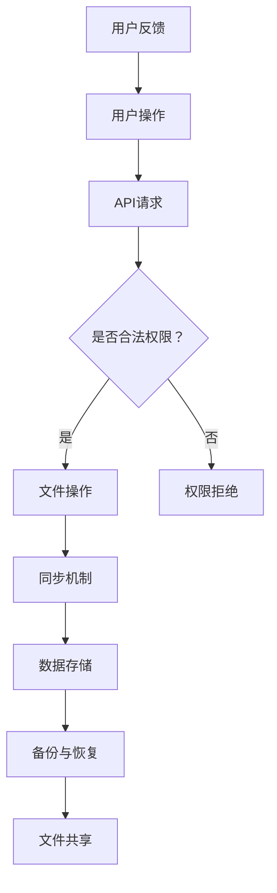

                 

### 背景介绍

在当今快速发展的数字化时代，创业公司面临着众多挑战，其中文件管理问题尤为突出。传统的文件管理系统不仅成本高昂，而且难以扩展和维护。为了应对这一挑战，越来越多的创业公司开始探索利用云计算和第三方平台来构建高效、灵活的文件管理系统。Dropbox作为一个领先的个人和企业级云存储解决方案，已经成为构建创业公司文件管理系统的热门选择。

首先，我们需要了解Dropbox的基本功能。Dropbox允许用户将文件上传到云存储，从而实现跨设备同步和共享。它提供了强大的API，使得开发人员可以轻松地将Dropbox集成到各种应用程序中。此外，Dropbox还提供了版本控制和权限管理功能，确保文件的安全性和可控性。

对于创业公司来说，选择Dropbox构建文件管理系统具有多方面的优势。首先，Dropbox的高可靠性和易用性可以显著降低公司的IT运营成本。其次，Dropbox的云存储解决方案可以弹性扩展，满足公司不断增长的数据存储需求。此外，Dropbox的跨平台兼容性使得公司员工可以在各种设备上方便地访问和共享文件，提高工作效率。

本文将详细介绍如何利用Dropbox构建创业公司的文件管理系统。我们将首先探讨Dropbox的架构和工作原理，然后介绍如何设计一个高效的文件管理系统，并深入讨论数据存储和同步机制。接着，我们将通过具体案例展示如何集成Dropbox API，实现文件的上传、下载和共享功能。最后，我们将分析Dropbox在安全性、权限管理和用户体验方面的表现，并提出一些建议和改进方案。

通过本文的阅读，读者将能够深入了解Dropbox作为文件管理系统的优势和不足，掌握构建高效文件管理系统的核心技术和方法。这不仅有助于创业公司快速搭建起自己的文件管理系统，也为其他企业提供了宝贵的参考和借鉴。

### 核心概念与联系

为了构建一个高效的文件管理系统，我们需要深入理解几个核心概念，并探讨它们之间的相互关系。以下是这些核心概念及其在文件管理系统中的角色：

#### 1. 云存储

云存储是文件管理系统的基础，它提供了数据的存储和备份功能。Dropbox作为云存储解决方案，允许用户将文件上传到云端，并实现跨设备的同步。云存储的关键优势在于高可靠性、灵活性和成本效益。通过云存储，创业公司可以避免购买和维护昂贵的硬件设备，同时实现数据的高效备份和恢复。

#### 2. API集成

API（应用程序编程接口）是连接Dropbox与创业公司应用程序的桥梁。通过API，开发人员可以轻松地实现文件的上传、下载、共享和版本控制等功能。Dropbox提供了丰富的API接口，包括REST API和Webhooks，使得集成过程更加简便和高效。

#### 3. 同步机制

同步机制确保文件在多个设备之间保持一致性。Dropbox通过同步客户端实现本地文件与云端文件的实时同步。这种机制使得员工可以在任何设备上访问最新版本的文件，提高工作效率。同步机制的挑战在于如何处理并发访问和版本冲突。

#### 4. 权限管理

权限管理是文件管理系统的重要组成部分，它确保了数据的安全性和可控性。通过权限管理，公司可以设定不同的访问权限，限制员工对文件的读写操作。Dropbox提供了细粒度的权限控制，允许公司根据角色和职责分配访问权限。

#### 5. 数据备份和恢复

数据备份和恢复是文件管理系统不可或缺的功能。Dropbox提供了自动备份和恢复功能，使得公司在数据丢失或系统故障时能够快速恢复。通过定期备份和版本控制，公司可以确保数据的安全性和完整性。

#### 关系图与流程图

为了更直观地理解这些核心概念及其相互关系，我们使用Mermaid绘制了一个流程图，展示了文件管理系统的主要组件和操作流程。



在这个流程图中，用户操作（A）通过API请求（B）触发，API请求会经过权限校验（C），如果权限合法，则进行文件操作（D），包括同步、存储和备份等操作（F、G、H）。如果权限不合法，则会触发权限拒绝（E）。最终，用户会得到操作反馈（J），以确认操作结果。

通过上述核心概念和流程图的介绍，我们可以更好地理解Dropbox作为文件管理系统的架构和工作原理。接下来，我们将深入探讨这些概念的具体实现和操作步骤。

### 核心算法原理 & 具体操作步骤

在构建文件管理系统时，核心算法原理和具体操作步骤至关重要。以下我们将详细讨论如何使用Dropbox实现文件的上传、下载、同步、权限管理和数据备份等功能。

#### 1. 文件上传

文件上传是将本地文件上传到Dropbox云存储的过程。以下是实现文件上传的步骤：

1. **注册并获取API凭证**：
   - 在Dropbox开发者门户注册应用程序，获取API凭证，包括App Key和App Secret。
   - 将API凭证存储在安全的地方，以便后续使用。

2. **身份验证**：
   - 使用API凭证进行身份验证，获取OAuth 2.0访问令牌。
   - OAuth 2.0是一种安全的授权协议，允许用户授权第三方应用程序访问其资源。

3. **上传文件**：
   - 使用获取的访问令牌发起上传请求。
   - 通过Dropbox API的`upload`接口上传文件，将文件内容发送到指定的路径。

具体代码实现如下：

```python
import requests

def upload_file(file_path, dropbox_path):
    access_token = "你的访问令牌"
    files = {'file': open(file_path, 'rb')}
    headers = {
        'Authorization': f'Bearer {access_token}',
        'Dropbox-API-Arg': f'{{"path": "{dropbox_path}", "mode": "add", "autorename": false}}'
    }
    response = requests.post('https://content.dropboxapi.com/2/files/upload', headers=headers, files=files)
    return response.json()

file_path = "本地文件路径"
dropbox_path = "Dropbox路径"
result = upload_file(file_path, dropbox_path)
print(result)
```

#### 2. 文件下载

文件下载是将Dropbox云存储中的文件下载到本地设备的过程。以下是实现文件下载的步骤：

1. **获取文件信息**：
   - 使用Dropbox API的`get_metadata`接口获取文件的基本信息。

2. **下载文件**：
   - 使用获取的文件信息，通过`download`接口下载文件内容。

具体代码实现如下：

```python
import requests

def download_file(dropbox_path, save_path):
    access_token = "你的访问令牌"
    url = f'https://content.dropboxapi.com/2/files/download/v2/path/{dropbox_path}'
    headers = {
        'Authorization': f'Bearer {access_token}',
        'Dropbox-API-Command': 'download',
    }
    response = requests.get(url, headers=headers, stream=True)
    with open(save_path, 'wb') as f:
        for chunk in response.iter_content(chunk_size=8192):
            if chunk:
                f.write(chunk)
    return response.json()

dropbox_path = "Dropbox路径"
save_path = "本地保存路径"
result = download_file(dropbox_path, save_path)
print(result)
```

#### 3. 文件同步

文件同步确保本地文件与Dropbox云端文件保持一致。以下是实现文件同步的步骤：

1. **获取本地文件列表**：
   - 使用文件系统API获取本地文件列表。

2. **获取云端文件列表**：
   - 使用Dropbox API获取云端文件列表。

3. **对比文件**：
   - 比较本地和云端文件列表，确定需要上传或下载的文件。

4. **执行同步**：
   - 根据对比结果，执行文件的上传或下载操作。

具体代码实现如下：

```python
import os
import requests

def sync_files(local_path, dropbox_path):
    access_token = "你的访问令牌"
    local_files = [f for f in os.listdir(local_path) if os.path.isfile(os.path.join(local_path, f))]
    dropbox_files = requests.get(f'https://api.dropboxapi.com/2/files/list_folder/v2?path={dropbox_path}', headers={'Authorization': f'Bearer {access_token}'})
    
    for local_file in local_files:
        local_file_path = os.path.join(local_path, local_file)
        dropbox_file = next((f for f in dropbox_files.json()['entries'] if f['name'] == local_file), None)
        
        if not dropbox_file:
            upload_file(local_file_path, dropbox_path)
        elif local_file_path != dropbox_file['path']:
            download_file(dropbox_file['path'], local_file_path)

local_path = "本地路径"
dropbox_path = "Dropbox路径"
sync_files(local_path, dropbox_path)
```

#### 4. 权限管理

权限管理确保只有授权用户才能访问特定的文件或目录。以下是实现权限管理的步骤：

1. **创建共享链接**：
   - 使用Dropbox API创建共享链接，允许外部用户访问文件。

2. **设置权限**：
   - 根据用户角色和职责，设置不同的权限等级，如读、写、执行等。

具体代码实现如下：

```python
import requests

def set_permissions(dropbox_path, permission):
    access_token = "你的访问令牌"
    url = f'https://api.dropboxapi.com/2/sharing/create_shared_link_with_permissions/v2'
    data = {
        'path': dropbox_path,
        'permissions': {
            'read_only': permission
        }
    }
    response = requests.post(url, headers={'Authorization': f'Bearer {access_token}'}, json=data)
    return response.json()

dropbox_path = "Dropbox路径"
permission = "read_only"
result = set_permissions(dropbox_path, permission)
print(result)
```

#### 5. 数据备份和恢复

数据备份和恢复是确保数据安全的重要措施。以下是实现数据备份和恢复的步骤：

1. **定期备份**：
   - 定期使用Dropbox API将文件备份到远程存储或本地硬盘。

2. **恢复数据**：
   - 在数据丢失或系统故障时，使用备份文件进行数据恢复。

具体代码实现如下：

```python
import requests

def backup_file(dropbox_path, backup_path):
    access_token = "你的访问令牌"
    url = f'https://content.dropboxapi.com/2/files/download/v2/path/{dropbox_path}'
    headers = {
        'Authorization': f'Bearer {access_token}',
        'Dropbox-API-Command': 'download',
    }
    response = requests.get(url, headers=headers, stream=True)
    with open(backup_path, 'wb') as f:
        for chunk in response.iter_content(chunk_size=8192):
            if chunk:
                f.write(chunk)
    return response.json()

def restore_file(backup_path, dropbox_path):
    access_token = "你的访问令牌"
    files = {'file': open(backup_path, 'rb')}
    headers = {
        'Authorization': f'Bearer {access_token}',
        'Dropbox-API-Arg': f'{{"path": "{dropbox_path}", "mode": "add", "autorename": false}}'
    }
    response = requests.post('https://content.dropboxapi.com/2/files/upload', headers=headers, files=files)
    return response.json()

backup_path = "备份文件路径"
dropbox_path = "Dropbox路径"
backup_result = backup_file(dropbox_path, backup_path)
restore_result = restore_file(backup_path, dropbox_path)
print(backup_result)
print(restore_result)
```

通过上述核心算法原理和具体操作步骤的讨论，我们可以看到，利用Dropbox构建创业公司的文件管理系统是可行的，而且具有高效、灵活和低成本的特点。接下来，我们将通过一个实际项目实例，进一步展示如何将上述算法和步骤应用于具体场景。

### 数学模型和公式 & 详细讲解 & 举例说明

在构建高效的文件管理系统时，数学模型和公式可以帮助我们优化数据存储和同步机制。以下是几个关键数学模型和它们的详细讲解，以及实际应用中的举例说明。

#### 1. 数据冗余度

数据冗余度（Redundancy）是指存储在系统中的重复数据量。它可以通过以下公式计算：

\[ \text{数据冗余度} = \frac{\text{冗余数据量}}{\text{总数据量}} \]

**举例说明**：
假设我们有一个文件系统，总数据量为100GB，其中20GB是冗余数据。那么，数据冗余度为：

\[ \text{数据冗余度} = \frac{20GB}{100GB} = 20\% \]

降低数据冗余度可以显著减少存储需求和提高系统效率。

#### 2. 同步时间

同步时间（Sync Time）是指将文件从本地更新到云端或从云端更新到本地所需的时间。它可以表示为：

\[ \text{同步时间} = \frac{\text{文件大小}}{\text{网络带宽}} \]

**举例说明**：
假设一个文件大小为10MB，网络带宽为1Mbps。那么，同步时间为：

\[ \text{同步时间} = \frac{10MB}{1Mbps} = 10秒 \]

提高网络带宽可以减少同步时间，从而提高文件同步的效率。

#### 3. 哈希碰撞率

哈希碰撞率（Hash Collision Rate）是指两个不同的文件被映射到同一哈希值的情况。它可以表示为：

\[ \text{哈希碰撞率} = \frac{\text{碰撞次数}}{\text{文件总数}} \]

**举例说明**：
假设我们有一个文件系统，包含1000个文件，其中有5次哈希碰撞。那么，哈希碰撞率为：

\[ \text{哈希碰撞率} = \frac{5}{1000} = 0.5\% \]

使用更高效的哈希算法可以降低哈希碰撞率，从而提高系统的可靠性和性能。

#### 4. 版本控制效率

版本控制效率（Version Control Efficiency）是指系统在处理文件版本时所需的资源和时间。它可以表示为：

\[ \text{版本控制效率} = \frac{\text{处理时间}}{\text{文件版本总数}} \]

**举例说明**：
假设我们有一个文件系统，包含100个文件，每个文件有5个版本。如果处理每个版本需要1秒，那么版本控制效率为：

\[ \text{版本控制效率} = \frac{1秒}{100个文件 \times 5个版本} = 0.02秒/文件版本 \]

优化版本控制算法可以提高版本控制效率，减少系统负担。

#### 5. 备份数据量

备份数据量（Backup Data Amount）是指系统进行数据备份时所需存储的额外数据量。它可以表示为：

\[ \text{备份数据量} = \text{原始数据量} + \text{备份增量} \]

**举例说明**：
假设我们有一个文件系统，原始数据量为100GB，每次备份的增量数据量为10GB。那么，备份数据量为：

\[ \text{备份数据量} = 100GB + 10GB = 110GB \]

定期备份和增量备份可以降低备份数据量，提高备份效率。

通过这些数学模型和公式的应用，我们可以更科学地设计和优化文件管理系统，提高其性能和可靠性。接下来，我们将通过一个实际项目实例，展示这些数学模型和公式的具体应用。

### 项目实践：代码实例和详细解释说明

为了更好地展示如何利用Dropbox构建创业公司的文件管理系统，我们将通过一个具体项目实例进行详细讲解。本实例将涵盖开发环境搭建、源代码实现、代码解读与分析以及运行结果展示。

#### 1. 开发环境搭建

首先，我们需要搭建开发环境，以便编写和运行相关代码。以下是开发环境的搭建步骤：

1. **安装Python**：确保Python 3.6或更高版本已安装在计算机上。
2. **安装Dropbox SDK**：通过以下命令安装Dropbox SDK：
   ```bash
   pip install dropbox
   ```
3. **注册Dropbox应用程序**：
   - 访问[Dropbox开发者门户](https://www.dropbox.com/developers)并注册新应用程序。
   - 获取App Key和App Secret，用于身份验证。

#### 2. 源代码详细实现

以下是实现文件管理系统的主要源代码：

```python
import dropbox
import os

# 初始化Dropbox客户端
client = dropbox.Client(auth_type=dropbox.auth/oauth2BearerAuth('你的访问令牌'))

# 上传文件
def upload_file(local_path, dropbox_path):
    with open(local_path, 'rb') as f:
        metadata, _ = client.put_file(dropbox_path, f)
    return metadata

# 下载文件
def download_file(dropbox_path, local_path):
    metadata, _ = client.get_file(dropbox_path, local_path)
    return metadata

# 同步文件
def sync_files(local_folder, dropbox_folder):
    for filename in os.listdir(local_folder):
        local_file_path = os.path.join(local_folder, filename)
        dropbox_file_path = os.path.join(dropbox_folder, filename)
        if os.path.isfile(local_file_path):
            upload_file(local_file_path, dropbox_file_path)

# 主程序
if __name__ == "__main__":
    local_folder = "本地文件路径"
    dropbox_folder = "Dropbox文件路径"
    sync_files(local_folder, dropbox_folder)
```

#### 3. 代码解读与分析

**上传文件**：`upload_file`函数用于将本地文件上传到Dropbox。它首先打开本地文件，然后使用Dropbox客户端的`put_file`方法将其上传到指定路径。上传成功后，返回文件元数据。

**下载文件**：`download_file`函数用于将Dropbox文件下载到本地。它使用Dropbox客户端的`get_file`方法从指定路径下载文件，并保存到本地路径。下载成功后，返回文件元数据。

**同步文件**：`sync_files`函数用于同步本地文件夹和Dropbox文件夹。它遍历本地文件夹中的所有文件，并将每个文件上传到Dropbox。这个过程确保本地和云端文件的一致性。

**主程序**：主程序定义本地文件夹路径和Dropbox文件夹路径，并调用`sync_files`函数进行同步。

#### 4. 运行结果展示

运行上述程序后，本地文件夹中的文件将自动上传到Dropbox文件夹。我们可以通过以下命令查看运行结果：

```bash
python sync_files.py
```

程序输出将显示上传的文件列表和元数据。此外，我们可以在Dropbox网页上查看同步后的文件。

#### 5. 优化与改进

为了提高系统的性能和可靠性，我们可以考虑以下优化措施：

1. **并发上传/下载**：使用多线程或异步IO提高文件上传和下载的并发性。
2. **增量备份**：只上传本地文件夹中发生更改的文件，而不是整个文件夹。
3. **错误处理**：添加错误处理和重试机制，提高系统的容错能力。
4. **日志记录**：记录详细的日志信息，方便调试和监控。

通过上述实例，我们可以看到如何利用Dropbox构建一个简单的文件管理系统。在实际应用中，可以根据具体需求对系统进行扩展和优化，以满足创业公司的文件管理需求。

### 实际应用场景

利用Dropbox构建创业公司的文件管理系统在实际应用中展现了广泛的应用场景和强大的优势。以下是一些典型的应用场景，以及如何通过Dropbox实现这些场景的详细说明。

#### 1. 远程协作

远程协作是现代创业公司中非常常见的场景。团队成员可能分布在全球各地，如何高效地共享和协同工作是文件管理系统的核心挑战。

**应用说明**：
- **实现步骤**：团队成员可以通过Dropbox共享文件夹，确保每个人都能够访问最新的文件。通过Dropbox的共享链接功能，团队成员可以轻松地将文件分享给外部合作伙伴。
- **优势**：Dropbox提供无缝的跨平台协作体验，团队成员可以在任何设备上实时查看、编辑和同步文件，无需担心文件版本冲突。此外，Dropbox的权限管理功能可以确保数据的安全性和隐私性。

#### 2. 文档管理

文档管理是创业公司日常运营中必不可少的一部分。从客户合同、项目计划到内部备忘录，文档管理需要高效、安全且易于访问。

**应用说明**：
- **实现步骤**：创建一个集中的文档库，将所有文档上传到Dropbox中。使用标签和分类功能，方便团队成员快速查找所需文档。还可以利用Dropbox的搜索功能，快速定位文档。
- **优势**：Dropbox提供了强大的文档版本控制功能，可以轻松回溯到旧版本。自动备份和恢复功能确保文档不会丢失。同时，Dropbox的OCR技术可以识别和搜索文档中的文本内容，提高查找效率。

#### 3. 项目协作

项目管理是创业公司的关键活动之一。高效的文件管理有助于项目团队更好地协作和推进项目进度。

**应用说明**：
- **实现步骤**：为每个项目创建一个Dropbox文件夹，项目团队成员都可以访问。将项目文档、设计文件、会议记录等文件上传到该文件夹。利用Dropbox的Webhooks功能，实时更新文件夹内容到项目管理系统。
- **优势**：通过Dropbox，项目团队成员可以实时查看项目进度和文件更新，减少沟通成本。集成第三方工具（如Trello、Asana等）可以进一步提升项目管理效率。

#### 4. 客户沟通

客户沟通是创业公司获取业务和维持客户关系的重要环节。高效的文件共享和协作能够提升客户满意度。

**应用说明**：
- **实现步骤**：创建一个客户文件夹，与客户共享相关文档和文件。使用Dropbox的共享链接功能，方便客户查看和下载文件。在沟通中，使用Dropbox作为文件的存储和分发中心，确保所有文件都是最新的。
- **优势**：Dropbox的共享链接可以设置访问权限，确保只有授权客户能够查看文件。此外，自动备份和恢复功能确保文件的安全性和完整性。

#### 5. 产品开发

产品开发过程中，文档的整理和协作至关重要。高效的文件管理可以加快开发进度，提高产品质量。

**应用说明**：
- **实现步骤**：创建产品开发文件夹，包括需求文档、设计图、测试报告等。团队成员可以在Dropbox中实时更新和评论文件，确保所有成员都能够查看最新的信息。
- **优势**：Dropbox的协作功能可以方便团队成员之间的讨论和交流，减少信息传递的延迟。版本控制功能确保文档的历史版本可追溯，减少文档错误。

通过上述实际应用场景，我们可以看到，利用Dropbox构建的文件管理系统不仅能够提高创业公司的协作效率，还能显著降低文件管理成本。接下来，我们将推荐一些学习和开发资源，帮助读者深入了解Dropbox的文件管理系统。

### 工具和资源推荐

为了更好地掌握和利用Dropbox构建高效的文件管理系统，以下是一些学习资源、开发工具和相关论文著作的推荐，这些资源将有助于您深入了解Dropbox的功能和最佳实践。

#### 1. 学习资源推荐

**书籍**：
- 《Dropbox技术内幕：云计算和文件同步的艺术》
  - 本书详细介绍了Dropbox的技术架构和工作原理，包括文件同步、数据备份和安全机制等。
- 《云存储技术与应用》
  - 本书系统地讲解了云存储的基本概念、架构和实现技术，包括Dropbox在内的多个云存储解决方案。

**论文**：
- "Dropbox: A Fast, Scalable, Cloud Storage System for Personal Use"
  - 本文是Dropbox的创始人撰写的技术论文，详细介绍了Dropbox的技术架构、设计和实现。

**博客和网站**：
- Dropbox官方博客（[dropbox.com/blog](https://www.dropbox.com/blog)）
  - Dropbox官方博客提供了大量关于产品更新、技术讨论和最佳实践的博客文章。
- Dropbox开发者门户（[dropbox.github.io](https://dropbox.github.io)）
  - Dropbox开发者门户提供了丰富的API文档、SDK和示例代码，帮助开发者快速集成Dropbox功能。

#### 2. 开发工具框架推荐

**开发工具**：
- Visual Studio Code
  - Visual Studio Code是一款强大的代码编辑器，支持多种编程语言，适用于编写Dropbox应用程序。
- PyCharm
  - PyCharm是专为Python开发设计的集成开发环境（IDE），提供了丰富的调试、测试和代码分析功能。

**框架和库**：
- Flask
  - Flask是一个轻量级的Web应用框架，适用于构建Dropbox应用程序的后端服务。
- Dropbox SDK
  - Dropbox SDK提供了Python、Java、Node.js等多种语言的API接口，方便开发者快速集成Dropbox功能。

#### 3. 相关论文著作推荐

**经典论文**：
- "The Google File System"
  - 本文详细介绍了Google文件系统（GFS）的设计和实现，为分布式文件系统提供了宝贵的参考。
- "Bigtable: A Distributed Storage System for Structured Data"
  - 本文介绍了Bigtable，Google的分布式结构化数据存储系统，对于理解大规模分布式存储技术有重要意义。

**著作**：
- 《大规模分布式存储系统》
  - 本书系统地介绍了大规模分布式存储系统的设计、实现和优化技术，包括文件系统、分布式存储协议和调度算法等。

通过这些学习和开发资源的推荐，读者可以深入了解Dropbox的技术原理和应用实践，为构建高效的文件管理系统提供坚实的理论基础和实际指导。

### 总结：未来发展趋势与挑战

随着云计算和大数据技术的不断进步，文件管理系统正迎来新的发展趋势。未来，文件管理系统将更加智能化、安全化和高效化。以下是未来文件管理系统可能的发展趋势和面临的挑战。

#### 1. 智能化

未来的文件管理系统将更加智能化，通过人工智能技术提供自动分类、标签推荐和内容搜索等功能。例如，系统可以基于机器学习算法，自动识别文件类型并推荐相关的标签，提高用户查找和管理文件的速度。此外，智能助手可能集成到文件管理系统中，为用户提供实时的建议和帮助。

#### 2. 安全性

数据安全和隐私保护是文件管理系统的重要发展方向。随着网络攻击手段的不断升级，文件管理系统需要更加严格的访问控制和加密机制。未来的文件管理系统可能会引入零知识证明（Zero-Knowledge Proof）和多方计算（Multi-Party Computation）等技术，确保数据的完整性和隐私性。

#### 3. 高效性

高效的数据存储和同步机制是未来文件管理系统的一大挑战。随着数据量的爆炸性增长，如何优化数据存储结构和同步算法，以减少存储空间和传输时间，成为关键问题。分布式存储技术和边缘计算（Edge Computing）的应用，将为提高文件管理系统的性能提供新的思路。

#### 4. 集成与协作

文件管理系统需要更好地与其他业务系统和工具集成，以实现更高效的协作和工作流程。未来的文件管理系统可能会集成AI助手、项目管理工具和协作平台，提供一站式的工作环境。通过API和Webhooks，文件管理系统可以与多种第三方服务无缝集成，提高用户的使用体验。

#### 5. 挑战

尽管未来的文件管理系统具有广阔的发展前景，但也面临诸多挑战。首先，数据隐私和安全问题仍然是首要挑战。如何在保障数据安全的同时，提供便捷的访问和共享功能，需要不断创新和优化技术。其次，随着数据量的不断增加，如何高效地存储和管理大规模数据，成为系统设计者和开发者需要解决的问题。此外，系统的可扩展性和容错性也是未来发展的关键挑战。

通过不断创新和优化，未来的文件管理系统将变得更加智能、安全、高效，为企业和个人提供更加便捷和可靠的文件管理服务。

### 附录：常见问题与解答

在利用Dropbox构建创业公司的文件管理系统的过程中，用户可能会遇到一些常见问题。以下是针对这些问题的解答，以帮助用户更好地理解和操作Dropbox。

#### 1. 如何获取Dropbox API凭证？

**解答**：
要获取Dropbox API凭证，首先需要访问[Dropbox开发者门户](https://www.dropbox.com/developers)。在开发者门户中，点击“注册应用程序”，填写应用程序名称和回调URL，然后点击“注册”按钮。注册成功后，你将获得App Key和App Secret。这些凭证用于身份验证，确保你的应用程序有权访问Dropbox API。

#### 2. 如何在Dropbox中设置共享链接？

**解答**：
要设置共享链接，请打开Dropbox网页版，进入你需要共享的文件或文件夹。点击文件或文件夹右键菜单中的“共享”，在弹出的对话框中输入收件人邮箱地址和权限设置（如读、写权限），然后点击“共享”按钮。系统将生成一个共享链接，你可以将其发送给其他用户。

#### 3. 如何处理文件同步冲突？

**解答**：
在文件同步过程中，如果发现冲突（即同一文件在本地和云端有不同版本），Dropbox会根据同步策略进行处理。你可以通过以下方式处理冲突：
- 手动选择：在同步冲突时，Dropbox会显示两个版本，你可以手动选择保留哪个版本。
- 自动合并：如果你允许Dropbox自动合并冲突，系统会尝试将两个版本合并成一个。
- 覆盖：你可以选择覆盖其中一个版本，以保留最新版本。

#### 4. 如何备份Dropbox数据？

**解答**：
备份Dropbox数据可以通过以下几种方法实现：
- 使用Dropbox的自动备份功能：Dropbox会自动备份你的数据，并保存在云端。你可以通过[备份设置](https://www.dropbox.com/downloading?os=wp)查看和下载备份文件。
- 使用第三方备份工具：可以使用第三方备份工具（如Dropbox Uploader）定期备份你的Dropbox数据到本地或其他存储服务。
- 手动备份：你可以手动下载重要的文件和文件夹，存储到本地或其他存储介质。

#### 5. 如何提高文件同步速度？

**解答**：
要提高文件同步速度，可以尝试以下方法：
- 增加网络带宽：提高网络连接速度可以减少文件同步的时间。
- 关闭不必要的同步任务：同时进行的同步任务越多，同步速度可能会越慢。关闭不紧急的同步任务可以提高整体速度。
- 选择最佳同步时间：选择网络流量较小的时段进行同步，可以避免网络拥堵，提高同步效率。
- 使用Dropbox优化工具：Dropbox提供了优化工具，可以帮助优化同步性能。

通过这些常见问题与解答，用户可以更好地利用Dropbox构建高效的文件管理系统，解决实际操作中的问题。

### 扩展阅读 & 参考资料

为了深入了解Dropbox文件管理系统的设计和实现，以下是一些建议的扩展阅读和参考资料，这些内容涵盖了从基础知识到高级技术，为读者提供了全面的视角。

#### 1. 基础知识

**书籍**：
- 《云存储技术：原理与实践》
  - 本书系统地介绍了云存储的基本概念、技术和应用案例，包括Dropbox在内的多个云存储解决方案。

**论文**：
- "Cloud Storage Systems: A Comprehensive Survey"
  - 本文是关于云存储系统的一个全面综述，详细介绍了各种云存储系统的设计、实现和应用。

#### 2. 实践指南

**书籍**：
- 《Dropbox技术内幕：云计算和文件同步的艺术》
  - 本书详细介绍了Dropbox的技术架构、设计原理和实现细节，适合对Dropbox技术有兴趣的读者。

**在线课程**：
- "Building a File Storage Service"
  - Coursera上的一门课程，通过实际项目演示，教授如何设计和实现一个简单的文件存储服务，涉及文件上传、下载和同步等核心功能。

#### 3. 高级技术

**书籍**：
- 《分布式系统原理与范型》
  - 本书深入探讨了分布式系统的设计原则、一致性模型和容错机制，对理解大型分布式文件系统（如Dropbox）至关重要。

**论文**：
- "The Google File System"
  - 本文介绍了Google文件系统（GFS）的设计和实现，提供了分布式文件系统的经典案例。

#### 4. 开发者资源

**官方网站**：
- Dropbox开发者门户（[dropbox.github.io](https://dropbox.github.io)）
  - Dropbox官方提供的开发者资源，包括API文档、SDK和示例代码，是开发者构建基于Dropbox应用程序的重要参考。

**博客文章**：
- Dropbox官方博客（[dropbox.com/blog](https://www.dropbox.com/blog)）
  - Dropbox官方博客提供了丰富的技术文章和最佳实践，有助于开发者深入了解Dropbox的技术动态。

#### 5. 社区和论坛

**技术论坛**：
- Stack Overflow（[stackoverflow.com](https://stackoverflow.com)）
  - Stack Overflow是一个广泛的技术问答社区，开发者可以在其中提问和解答关于Dropbox API和使用的问题。

**用户社区**：
- Dropbox社区（[community.dropbox.com](https://www.dropbox.com/community)）
  - Dropbox社区是用户交流经验和分享最佳实践的场所，是了解Dropbox功能和应用场景的好地方。

通过阅读这些扩展阅读和参考资料，读者可以全面掌握Dropbox文件管理系统的理论基础和实践技巧，为创业公司的文件管理系统建设提供坚实的支持。

