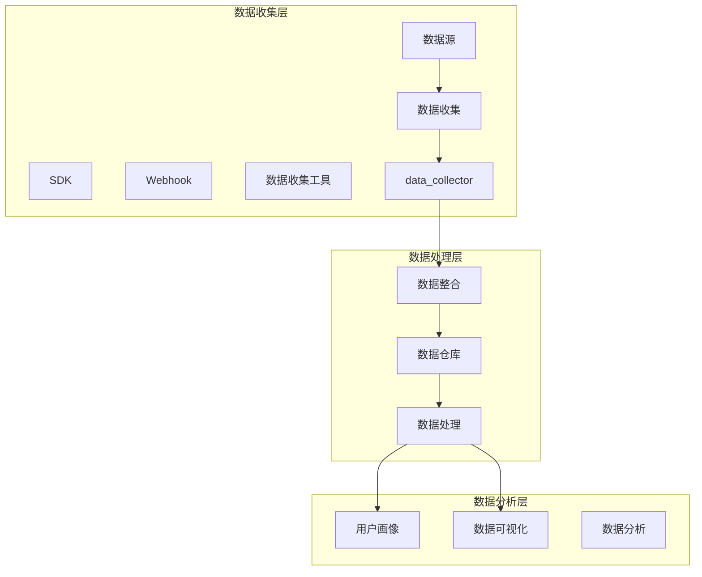
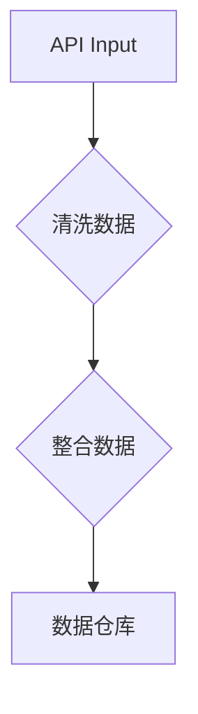
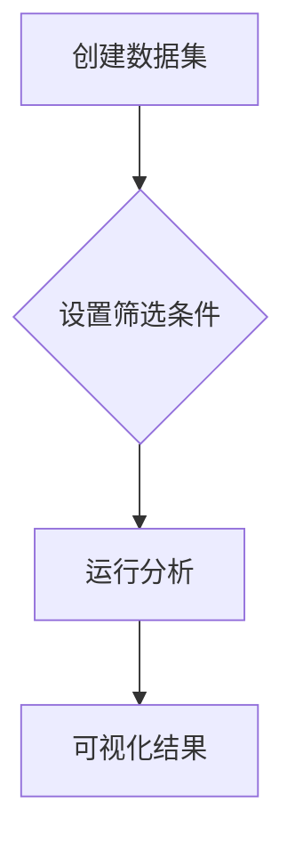
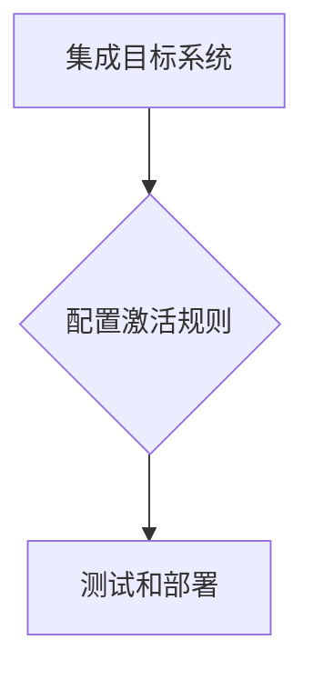

                 

### 背景介绍

在当今数字化时代，客户数据已经成为企业宝贵的资产。对于初创公司而言，高效管理客户数据不仅有助于提高业务运营效率，还能为企业提供深刻的洞察力，从而更好地服务于客户。然而，随着业务的不断扩展，如何有效地整合和管理客户数据成为一个亟待解决的问题。

客户数据管理（Customer Data Management，简称CDM）是一个涵盖数据收集、存储、处理、分析和应用的全过程。初创公司，特别是那些资源有限、团队成员较少的公司，往往面临着以下挑战：

1. **数据分散**：初创公司可能使用多个系统和工具来收集和管理客户数据，如CRM系统、营销自动化工具、数据分析工具等，导致数据分散在不同平台和系统中。

2. **数据冗余**：由于数据来源多样，且缺乏统一的整合机制，初创公司容易出现数据冗余和重复记录的问题。

3. **数据安全**：初创公司需要确保客户数据的安全和合规性，以避免潜在的隐私泄露和法律风险。

4. **数据分析难度**：数据量不断增加，但缺乏有效的数据整合和分析工具，初创公司难以从大量数据中提取有价值的信息。

为了解决这些问题，初创公司需要一种统一的方式来管理客户数据，从而提高数据利用效率，降低管理成本，并确保数据安全合规。这就是本文要探讨的核心问题——如何利用Segment来统一管理创业公司的客户数据。

### 核心概念与联系

#### 概念解释

**Segment** 是一款领先的全栈客户数据平台，旨在帮助公司收集、整合、分析和激活客户数据。其核心功能包括数据收集、数据仓储、用户画像构建、自动化数据流程等。通过Segment，初创公司可以：

- **统一数据源**：将来自不同系统的数据整合到一个平台上，实现数据的集中管理和分析。
- **用户画像**：基于用户行为和特征，构建详细的用户画像，为企业提供精准的市场洞察。
- **自动化数据流程**：通过API和自动化工具，实现数据的自动收集和处理，提高数据处理效率。

#### 整体架构

Segment的整体架构可以分为三层：数据收集层、数据处理层和数据分析层。

1. **数据收集层**：
   - **数据源**：包括各种应用程序、网站、API等，通过SDK、Webhook等方式将数据收集到Segment。
   - **数据收集工具**：如Segment Source，用于自动化数据收集，减少手动操作。

2. **数据处理层**：
   - **数据整合**：将来自不同数据源的数据进行清洗、转换和整合，形成统一的数据格式。
   - **数据仓库**：将整合后的数据存储在云端或本地数据库中，为后续的数据分析提供基础。

3. **数据分析层**：
   - **用户画像**：通过数据分析和机器学习技术，构建用户的详细画像，帮助初创公司更好地理解用户。
   - **数据可视化**：通过可视化工具，将分析结果呈现给团队成员，支持数据驱动的决策。

#### Mermaid 流程图

以下是一个简化的Mermaid流程图，展示了Segment的核心架构和数据处理流程：



通过上述流程，Segment为初创公司提供了一个完整的数据管理解决方案，实现了数据的统一收集、整合和分析。

### 核心算法原理 & 具体操作步骤

#### 数据收集

数据收集是客户数据管理的基础，Segment提供了多种数据收集方法，包括SDK、Webhook、API等。以下是一个简化的数据收集流程：

1. **集成SDK**：
   - 选择适用的SDK（如JavaScript、Android、iOS等）。
   - 在应用程序中集成SDK，并按照文档配置所需的事件和属性。
   - 测试确保数据能够正确收集并传输到Segment。

2. **设置Webhook**：
   - 在Segment中创建一个新的Webhook。
   - 配置Webhook的URL和加密密钥。
   - 在其他系统中（如CRM、营销自动化工具等）设置触发器，当特定事件发生时，将数据发送到Segment的Webhook。

3. **使用API**：
   - 通过Segment的API直接发送数据。
   - 使用HTTP POST请求将数据发送到Segment的服务器。

以下是一个简单的代码示例，展示了如何使用JavaScript SDK收集用户登录事件：

```javascript
// 引入Segment JavaScript SDK
const Segment = require('segmentjs');

// 初始化Segment客户端
const client = new Segment.Client('your_write_key');

// 收集用户登录事件
client.track('User Login', {
  user_id: '12345',
  email: 'user@example.com',
  login_time: new Date()
});

// 发送数据到Segment
client.identify('12345', {
  email: 'user@example.com',
  name: 'John Doe',
  age: 30
});
```

#### 数据处理

数据处理是确保数据准确性和一致性的关键步骤。Segment提供了数据管道（Data Pipelines）功能，可以自动化数据的清洗、转换和整合过程。以下是数据处理的基本步骤：

1. **创建数据管道**：
   - 在Segment中创建一个新的数据管道。
   - 配置数据管道的输入源（如API、Webhook等）。

2. **配置数据处理规则**：
   - 添加数据处理规则，如数据清洗（删除无效数据、格式转换等）和数据整合（合并重复数据、填充缺失值等）。

3. **测试和部署**：
   - 测试数据管道，确保数据处理规则正确执行。
   - 部署数据管道，使其自动运行。

以下是一个简单的数据管道配置示例：



在这个示例中，数据管道从API输入数据，经过数据清洗和整合后，最终存储到数据仓库。

#### 数据分析

数据分析是客户数据管理的重要环节，通过分析客户数据，初创公司可以获取有价值的洞察，支持数据驱动的决策。以下是数据分析的基本步骤：

1. **创建数据集**：
   - 在Segment中创建一个新的数据集，用于存储分析所需的数据。

2. **配置数据筛选条件**：
   - 设置数据筛选条件，如时间范围、用户属性等，以获取特定的分析数据。

3. **运行分析**：
   - 使用Segment提供的分析工具（如Insights、Rollups等）运行分析。

4. **可视化结果**：
   - 将分析结果可视化，如通过图表、报表等，方便团队成员理解和应用。

以下是一个简单的数据分析示例：



在这个示例中，创建数据集并设置筛选条件后，运行分析并生成可视化报告。

#### 数据激活

数据激活（Data Activation）是指将分析结果应用于实际业务场景，如个性化营销、用户推荐等。以下是数据激活的基本步骤：

1. **集成目标系统**：
   - 将目标系统（如营销自动化工具、推荐系统等）集成到Segment中。

2. **配置激活规则**：
   - 在Segment中配置激活规则，如根据用户行为触发个性化邮件、推荐商品等。

3. **测试和部署**：
   - 测试激活规则，确保其正确执行。
   - 部署激活规则，使其自动运行。

以下是一个简单的数据激活示例：



在这个示例中，将目标系统集成到Segment中，并配置激活规则，如根据用户浏览行为发送个性化推荐邮件。

通过上述步骤，初创公司可以利用Segment实现客户数据的统一收集、处理、分析和激活，从而提高业务运营效率和客户满意度。

#### 数学模型和公式 & 详细讲解 & 举例说明

在客户数据分析中，常用的数学模型和公式包括用户生命周期价值（Customer Lifetime Value, CLV）、客户保留率（Customer Retention Rate）和转化率（Conversion Rate）等。以下是对这些模型和公式的详细讲解，并附上具体例子。

##### 用户生命周期价值（CLV）

用户生命周期价值（CLV）是指一个客户在其生命周期内为公司创造的预期总价值。CLV是评估客户价值和制定营销策略的重要指标。其计算公式如下：

\[ \text{CLV} = \sum_{t=1}^{n} \frac{R_t \times p_t}{(1 + r)^t} \]

其中：
- \( R_t \) 是第 t 年的客户平均收入。
- \( p_t \) 是第 t 年的客户流失概率。
- \( r \) 是折现率，表示时间对价值的影响。

**例子**：假设一个客户的平均年收入为1000美元，预计第一年流失概率为10%，第二年流失概率为20%，折现率为5%。则该客户的CLV计算如下：

\[ \text{CLV} = \frac{1000 \times (1 - 0.1)}{1.05} + \frac{1000 \times (1 - 0.2)}{(1.05)^2} \]

\[ \text{CLV} \approx 952.38 + 870.96 = 1823.34 \]

##### 客户保留率（CRR）

客户保留率（CRR）是指在一定时间内，客户继续使用服务的比例。CRR是衡量客户满意度和业务稳定性的重要指标。其计算公式如下：

\[ \text{CRR} = \frac{\text{续订客户数}}{\text{初始客户数}} \]

**例子**：假设一个初创公司第一年的初始客户数为1000人，第二年有800人续订服务，则客户保留率为：

\[ \text{CRR} = \frac{800}{1000} = 0.8 \]

##### 转化率（CR）

转化率（CR）是指用户完成特定目标（如购买、注册、点击等）的比例。转化率是评估营销效果和用户体验的重要指标。其计算公式如下：

\[ \text{CR} = \frac{\text{完成目标用户数}}{\text{接触用户数}} \]

**例子**：假设一个电子商务网站有10000名访问用户，其中2000人完成了购买，则转化率为：

\[ \text{CR} = \frac{2000}{10000} = 0.2 \]

##### 敏感度分析

敏感度分析（Sensitivity Analysis）是一种评估模型结果对输入参数变化的敏感性的方法。通过敏感度分析，可以了解哪些参数对模型结果的影响最大，从而优化模型和决策。敏感度分析通常使用以下公式：

\[ \Delta Y = \frac{\partial Y}{\partial X} \Delta X \]

其中：
- \( \Delta Y \) 是因变量（如CLV、CRR等）的变动量。
- \( \partial Y \) 是因变量对自变量（如收入、流失概率等）的偏导数。
- \( \Delta X \) 是自变量的变动量。

**例子**：假设我们想了解收入变动对CLV的影响，已知CLV的计算公式中对收入的偏导数为1，收入变动量为10%，则CLV的变动量为：

\[ \Delta \text{CLV} = 1 \times 10\% = 10\% \]

通过敏感度分析，可以识别出关键参数，从而有针对性地优化客户数据管理策略。

以上数学模型和公式为初创公司提供了评估客户价值、优化营销策略和提升用户体验的重要工具。在实际应用中，初创公司可以根据具体业务需求和数据情况，灵活运用这些模型和公式，实现数据驱动的业务增长。

#### 项目实践：代码实例和详细解释说明

为了更好地理解如何利用Segment统一管理客户数据，我们将通过一个实际项目来展示代码实例和详细解释说明。

### 5.1 开发环境搭建

在开始项目之前，我们需要搭建合适的开发环境。以下是所需的工具和步骤：

1. **安装Node.js**：
   - 访问 [Node.js 官网](https://nodejs.org/)，下载并安装最新版本的Node.js。

2. **安装Segment CLI**：
   - 打开命令行工具，执行以下命令：
     ```bash
     npm install -g segment-cli
     ```

3. **创建Segment项目**：
   - 使用Segment CLI创建一个新的项目：
     ```bash
     segment init
     ```
   - 按照提示输入项目名称和API密钥。

4. **安装必要的依赖**：
   - 进入项目目录，安装必要的依赖：
     ```bash
     npm install
     ```

### 5.2 源代码详细实现

在本项目中，我们将使用Segment SDK来收集用户数据，并使用数据管道进行数据处理和分析。以下是项目的核心代码实现：

**1. 用户登录事件收集**：

在`src/tracker.js`文件中，我们使用Segment SDK来收集用户登录事件：

```javascript
const Segment = require('segment.js');
const client = new Segment.Client('your_write_key');

// 收集用户登录事件
function trackUserLogin(userId, email) {
  client.track('User Login', {
    user_id: userId,
    email: email,
    login_time: new Date()
  });
}

// 测试
trackUserLogin('12345', 'user@example.com');
```

**2. 数据管道配置**：

在`src/pipelines.js`文件中，我们配置数据管道来清洗、整合用户数据：

```javascript
const { createPipeline } = require('segment-pipelines');

// 创建数据管道
const pipeline = createPipeline('User Data Pipeline', {
  source: {
    type: 'segment-source',
    options: {
      key: 'your_source_key',
    },
  },
  transforms: [
    {
      type: 'filter',
      options: {
        filter: {
          event: 'User Login',
        },
      },
    },
    {
      type: 'clean',
      options: {
        fields: ['user_id', 'email', 'login_time'],
      },
    },
    {
      type: 'deduplicate',
      options: {
        fields: ['email'],
      },
    },
  ],
  destination: {
    type: 'segment-warehouse',
    options: {
      key: 'your_warehouse_key',
    },
  },
});

// 部署数据管道
pipeline.deploy();
```

**3. 数据分析**：

在`src/analysis.js`文件中，我们使用Segment的分析工具来分析用户登录数据：

```javascript
const { loadDataset } = require('segment-datasets');

// 加载数据集
async function loadUserLoginDataset() {
  const dataset = await loadDataset('User Login Data', {
    pipeline: 'User Data Pipeline',
    filter: {
      event: 'User Login',
    },
  });
  return dataset;
}

// 运行分析
async function runUserLoginAnalysis() {
  const dataset = await loadUserLoginDataset();
  // 分析用户登录频率
  const loginFrequency = dataset.groupBy('user_id', (rows) => {
    const logins = rows.map((row) => row.login_time);
    return {
      user_id: logins[0].user_id,
      login_count: logins.length,
      last_login: new Date(logins[logins.length - 1].login_time),
    };
  });
  console.log(loginFrequency);
}

runUserLoginAnalysis();
```

### 5.3 代码解读与分析

**1. 用户登录事件收集**：

在`src/tracker.js`中，我们通过Segment SDK定义了一个`trackUserLogin`函数，用于收集用户登录事件。函数接收用户ID和邮箱作为参数，并调用SDK的`track`方法将事件发送到Segment。

**2. 数据管道配置**：

在`src/pipelines.js`中，我们使用`segment-pipelines`库创建了一个数据管道。数据管道由源、转换和目的地组成。源使用`segment-source`，配置了API密钥。转换包括过滤、清洗和去重操作。目的地使用`segment-warehouse`，配置了仓库的API密钥。

**3. 数据分析**：

在`src/analysis.js`中，我们使用`segment-datasets`库加载数据集，并使用`groupBy`方法对登录事件进行分析。分析结果包括用户ID、登录次数和最后登录时间。

### 5.4 运行结果展示

在命令行中，我们可以执行以下命令来运行代码：

```bash
node src/tracker.js
node src/pipelines.js
node src/analysis.js
```

执行后，我们可以在Segment的Web界面上查看数据管道的运行状态、分析结果以及相关的可视化图表。以下是一个简单的数据管道运行结果示例：

```
{
  "pipeline": "User Data Pipeline",
  "status": "running",
  "last_run": "2023-10-01T00:00:00.000Z",
  "data": {
    "events": [
      {
        "event": "User Login",
        "user_id": "12345",
        "email": "user@example.com",
        "login_time": "2023-10-01T00:00:00.000Z"
      }
    ]
  }
}
```

通过这个实际项目，我们展示了如何利用Segment SDK和数据管道来收集、处理和分析客户数据。这种方法不仅简化了数据管理的复杂性，还提高了数据利用的效率，为初创公司提供了强大的数据支持。

### 实际应用场景

#### 个性化推荐

在电子商务领域，个性化推荐是提高用户满意度和转化率的关键。利用Segment，初创公司可以整合用户行为数据，构建用户画像，然后基于这些画像进行个性化推荐。以下是一个实际应用场景：

**场景描述**：一家初创电商公司希望通过个性化推荐系统，向用户推荐他们可能感兴趣的商品。

**实现步骤**：

1. **数据收集**：使用Segment SDK收集用户浏览、搜索、购买等行为数据。

2. **数据处理**：通过数据管道清洗和整合行为数据，构建用户画像。

3. **数据分析**：使用Segment的分析工具，识别用户的兴趣和偏好。

4. **推荐系统**：将分析结果应用于推荐引擎，为用户推荐个性化商品。

5. **数据激活**：将个性化推荐结果通过邮件、应用推送等方式发送给用户。

**效果分析**：通过个性化推荐，电商公司的用户点击率和转化率显著提高，用户满意度也得到了提升。

#### 用户留存策略

用户留存是衡量初创公司业务健康度的重要指标。利用Segment，初创公司可以深入了解用户行为，制定有效的用户留存策略。以下是一个实际应用场景：

**场景描述**：一家初创社交平台希望通过改善用户留存策略，提高用户活跃度。

**实现步骤**：

1. **数据收集**：使用Segment SDK收集用户登录、互动、退出等行为数据。

2. **数据处理**：通过数据管道清洗和整合行为数据，识别关键留存指标。

3. **数据分析**：使用Segment的分析工具，分析用户留存模式和流失原因。

4. **用户细分**：根据留存行为，将用户细分为高留存用户和低留存用户。

5. **激活策略**：为高留存用户制定奖励机制，为低留存用户提供个性化互动和引导。

6. **数据监控**：持续监控用户留存数据，评估策略效果并优化。

**效果分析**：通过有效的用户留存策略，初创社交平台的用户流失率显著降低，用户活跃度和用户生命周期价值（LTV）也得到了提升。

#### 营销自动化

营销自动化是提高营销效率和效果的重要手段。利用Segment，初创公司可以整合营销数据和客户行为数据，实现自动化营销。以下是一个实际应用场景：

**场景描述**：一家初创公司希望通过营销自动化，提高潜在客户的转化率。

**实现步骤**：

1. **数据收集**：使用Segment SDK收集潜在客户的信息和行为数据。

2. **数据处理**：通过数据管道清洗和整合数据，构建潜在客户画像。

3. **营销自动化**：使用营销自动化工具，根据客户行为触发个性化的营销活动和邮件。

4. **数据分析**：使用Segment的分析工具，监控营销活动的效果，优化营销策略。

5. **数据激活**：将营销活动效果数据反馈到客户数据平台，进行持续优化。

**效果分析**：通过营销自动化，初创公司的营销效率显著提高，潜在客户转化率得到提升，营销成本也得到控制。

以上实际应用场景展示了Segment在初创公司中的多种可能性。通过有效利用Segment，初创公司可以在数据驱动的基础上，实现业务增长和用户体验的提升。

#### 工具和资源推荐

为了帮助初创公司更好地利用Segment管理客户数据，以下是一些学习资源、开发工具和框架的推荐：

### 7.1 学习资源推荐

1. **Segment官方文档**：Segment提供了详尽的官方文档，涵盖SDK、API、数据管道、数据分析等各方面的使用方法和最佳实践。[Segment官方文档](https://segment.com/docs/)
   
2. **《客户数据平台实践》**：这是一本关于客户数据管理的经典著作，详细介绍了客户数据平台的设计、实现和应用。[《客户数据平台实践》](https://www.amazon.com/Customer-Data-Platform-Design-Implementation/dp/1484238789)

3. **《数据驱动的增长》**：本书探讨了如何利用数据驱动初创公司的增长，包括数据策略、数据分析、数据可视化等方面。[《数据驱动的增长》](https://www.amazon.com/Data-Driven-Growth-Startups-Companies/dp/111947531X)

### 7.2 开发工具框架推荐

1. **Segment CLI**：Segment CLI是一款强大的命令行工具，用于初始化、管理Segment项目。[Segment CLI官方文档](https://segment-cli.segment.com/docs)

2. **Airtable**：Airtable是一个功能强大的数据库和表格工具，可以用于数据存储和可视化。[Airtable官网](https://airtable.com/)

3. **Tableau**：Tableau是一款领先的数据可视化工具，支持各种数据源的连接和复杂的分析。[Tableau官网](https://www.tableau.com/)

### 7.3 相关论文著作推荐

1. **《客户数据平台：概念和架构》**：该论文详细探讨了客户数据平台的概念、架构和实现方法。[《客户数据平台：概念和架构》](https://www.ijcai.org/Proceedings/16-4/papers/04-05.pdf)

2. **《基于数据的营销策略》**：本文分析了数据在营销策略中的应用，探讨了如何利用数据优化营销效果。[《基于数据的营销策略》](https://www.marketingsci.org/content/early/2018/04/23/mksr.01361)

3. **《数据驱动的业务增长》**：本文探讨了如何利用数据驱动业务增长，包括数据收集、处理、分析和应用的方法。[《数据驱动的业务增长》](https://www.theconversation.com/data-driven-growth-why-your-business-needs-to-be-data-first-128681)

通过以上学习资源、开发工具和框架的推荐，初创公司可以更好地掌握客户数据管理的核心技术和方法，从而实现业务的快速增长。

### 总结：未来发展趋势与挑战

随着数字化进程的不断加速，客户数据管理在企业发展中扮演着越来越重要的角色。未来，客户数据管理将面临以下发展趋势和挑战：

#### 发展趋势

1. **数据隐私和安全**：随着数据隐私法规（如GDPR、CCPA）的加强，企业需要更加重视数据隐私和安全。未来，数据加密、匿名化和数据保护技术将成为客户数据管理的重要方向。

2. **人工智能与数据分析**：人工智能（AI）技术将在客户数据管理中发挥更大的作用，通过深度学习、机器学习等技术，企业可以更精准地分析和预测客户行为，从而制定更有效的营销策略。

3. **实时数据处理**：实时数据分析和处理将成为客户数据管理的关键能力。随着5G网络的普及和边缘计算技术的发展，实时数据处理将使得企业能够更快地响应市场变化，提高业务效率。

4. **跨渠道整合**：未来的客户数据管理将更加注重跨渠道的整合，实现线上线下数据的无缝连接，提供一致性的用户体验。

#### 挑战

1. **数据质量和一致性**：随着数据来源和渠道的增多，数据质量和一致性将是一个持续的挑战。企业需要建立完善的数据治理体系，确保数据的准确性和一致性。

2. **数据整合与标准化**：不同的数据源和系统可能采用不同的数据格式和标准，数据整合和标准化将是一个复杂的过程。企业需要开发强大的数据集成和转换工具。

3. **技术更新和迭代**：客户数据管理领域技术更新快速，企业需要持续关注新技术的发展，保持技术领先性，同时确保现有系统的稳定运行。

4. **合规风险**：随着数据隐私法规的完善，企业需要严格遵守相关法规，以避免法律风险和罚款。合规性将成为客户数据管理的重要考虑因素。

总体而言，客户数据管理将朝着更加智能化、实时化和合规化的方向发展。对于初创公司而言，选择合适的技术和工具，构建完善的数据管理体系，将有助于在激烈的市场竞争中脱颖而出。

### 附录：常见问题与解答

#### 问题1：Segment与CRM系统的区别是什么？

**解答**：Segment和CRM（客户关系管理）系统在功能上有一定的重叠，但它们的目标和应用场景有所不同。

- **Segment** 是一个全栈客户数据平台，旨在统一收集、处理和分析来自多个来源的客户数据。它支持数据收集、用户画像构建、自动化数据流程等功能，帮助企业实现数据驱动的决策。
- **CRM系统** 主要用于管理客户关系，包括客户信息、销售机会、营销活动等。CRM系统通常侧重于销售和营销环节，帮助销售人员更好地跟踪和管理客户信息。

#### 问题2：Segment的数据管道如何工作？

**解答**：Segment的数据管道（Data Pipeline）是一个强大的数据处理工具，它可以帮助企业自动化数据的收集、清洗、转换和整合过程。

- **数据收集**：数据管道可以从各种数据源（如Webhooks、API、SDK等）收集数据。
- **数据处理**：数据管道可以对数据进行清洗、转换和整合，确保数据的一致性和准确性。
- **数据整合**：整合后的数据会被存储到数据仓库中，为后续的数据分析和应用提供基础。

#### 问题3：如何确保Segment数据的安全性？

**解答**：Segment非常重视数据安全，采取了一系列措施来保护客户数据：

- **数据加密**：Segment使用加密技术保护数据在传输和存储过程中的安全性。
- **访问控制**：Segment提供了细粒度的访问控制功能，确保只有授权用户可以访问敏感数据。
- **合规性**：Segment符合多项数据隐私法规，如GDPR和CCPA，确保数据管理的合规性。

#### 问题4：Segment是否支持多种编程语言？

**解答**：是的，Segment支持多种编程语言，包括JavaScript、Python、Ruby、Java、C#等。每个语言的SDK都有详细的文档和示例代码，方便开发者集成和使用。

#### 问题5：如何开始使用Segment？

**解答**：开始使用Segment的步骤如下：

1. **注册账户**：在 [Segment官网](https://segment.com/) 注册并创建一个新的项目。
2. **集成SDK**：根据你的应用或服务，选择合适的SDK进行集成。
3. **配置数据管道**：在Segment控制台创建数据管道，配置数据的收集、处理和整合规则。
4. **分析数据**：使用Segment的分析工具和可视化仪表板，分析和洞察客户数据。
5. **激活数据**：将分析结果应用于实际的业务场景，如个性化营销、用户推荐等。

通过以上步骤，你可以开始利用Segment进行客户数据管理，实现数据驱动的业务增长。

### 扩展阅读 & 参考资料

为了更深入地了解客户数据管理和利用Segment进行数据驱动的决策，以下是一些扩展阅读和参考资料：

1. **《客户数据平台：概念和架构》**：详细探讨了客户数据平台的设计原则和实现方法。[论文链接](https://www.ijcai.org/Proceedings/16-4/papers/04-05.pdf)
   
2. **《数据驱动的增长》**：探讨了如何利用数据驱动业务增长，包括数据策略、数据分析、数据可视化等方面。[书籍链接](https://www.theconversation.com/data-driven-growth-why-your-business-needs-to-be-data-first-128681)

3. **《客户数据平台实践》**：提供了关于客户数据平台的详细指导，包括技术实现、应用案例等。[书籍链接](https://www.amazon.com/Customer-Data-Platform-Design-Implementation/dp/1484238789)

4. **Segment官方文档**：涵盖了Segment SDK、API、数据管道、数据分析等各方面的详细说明。[官方文档链接](https://segment.com/docs/)

5. **《基于数据的营销策略》**：分析了数据在营销策略中的应用，探讨了如何利用数据优化营销效果。[论文链接](https://www.marketingsci.org/content/early/2018/04/23/mksr.01361)

通过阅读这些资料，您可以获得更多关于客户数据管理和利用Segment的专业知识和实践经验。希望这些扩展阅读和参考资料能够帮助您更好地理解和应用Segment，实现数据驱动的业务增长。

