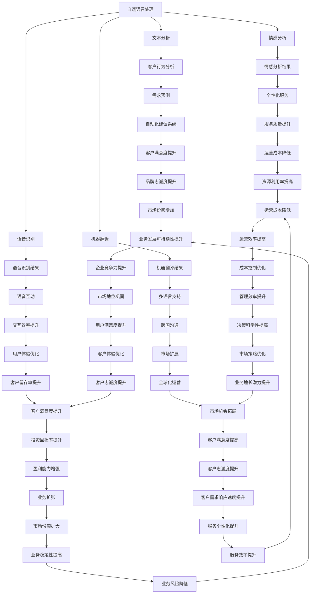

                 

### 背景介绍 Background Introduction

#### 客户服务的重要性

在当今这个数字化的时代，客户服务已经成为企业竞争力的重要组成部分。优质的客户服务不仅能提升客户的满意度和忠诚度，还能为企业带来良好的口碑和竞争优势。随着市场环境的不断变化和客户需求的日益多样，如何高效地管理客户服务，满足客户个性化需求，成为企业面临的重大挑战。

#### 人工智能的发展

人工智能（AI）作为一门前沿技术，已经在多个领域展现了其强大的应用潜力。从简单的聊天机器人到复杂的自动化决策系统，人工智能正逐步渗透到我们的日常生活和工作中。特别是在客户服务领域，人工智能技术以其高效性、智能性和自适应能力，为提升客户服务质量提供了新的思路和解决方案。

#### 人工智能与客户服务的结合

将人工智能与客户服务相结合，不仅能够大幅提升服务效率，还能够提供更加个性化和智能化的服务体验。通过自然语言处理、机器学习、数据分析等技术，人工智能可以帮助企业更好地理解和预测客户需求，快速响应客户问题，提供高效的服务解决方案。这种结合不仅能够减轻人工客服的负担，还能为企业节省成本，提高整体运营效率。

#### 目标

本文将深入探讨如何利用人工智能优化客户服务质量。通过分析人工智能的核心技术和应用场景，介绍具体的技术原理和实践方法，帮助读者理解人工智能在客户服务中的潜在价值，并掌握相关技术工具和资源。本文结构如下：

1. **背景介绍**：介绍客户服务的重要性以及人工智能的发展背景。
2. **核心概念与联系**：解释人工智能与客户服务结合的原理，并提供相应的流程图。
3. **核心算法原理与具体操作步骤**：详细讲解人工智能在客户服务中的应用算法和操作步骤。
4. **数学模型和公式**：介绍相关的数学模型和公式，并进行详细讲解和举例说明。
5. **项目实践**：提供代码实例和详细解释，展示实际应用效果。
6. **实际应用场景**：探讨人工智能在客户服务中的具体应用场景。
7. **工具和资源推荐**：推荐相关学习资源、开发工具和框架。
8. **总结**：总结未来发展趋势与挑战。
9. **附录**：常见问题与解答。
10. **扩展阅读与参考资料**：提供扩展阅读和参考资料。

通过本文的逐步分析，读者将能够全面了解人工智能优化客户服务质量的原理和方法，掌握相关技术，为实际应用提供有力支持。

### 核心概念与联系 Core Concepts and Relationships

在探讨如何利用人工智能（AI）优化客户服务质量之前，我们需要明确几个核心概念及其相互关系。以下是本文将涉及的主要概念：

#### 自然语言处理（NLP）

自然语言处理是人工智能的一个重要分支，旨在使计算机能够理解、解释和生成人类语言。NLP 技术广泛应用于文本分析、情感分析、语音识别和机器翻译等领域。

#### 机器学习（ML）

机器学习是一种通过数据学习模式，并基于这些模式进行预测或决策的技术。在客户服务中，机器学习可用于客户行为分析、需求预测和自动化建议系统。

#### 数据分析（DA）

数据分析涉及从大量数据中提取有价值的信息和洞察。在客户服务中，数据分析有助于了解客户偏好、行为和反馈，从而优化服务流程。

#### 客户关系管理（CRM）

客户关系管理是一种用于管理企业与其客户之间互动关系的系统和方法。通过CRM系统，企业可以收集、存储和分析客户数据，以便更好地满足客户需求。

#### 联系与流程图

为了更清晰地展示这些核心概念之间的联系，我们可以使用 Mermaid 流程图进行说明。



通过上述流程图，我们可以看到自然语言处理、机器学习、数据分析和客户关系管理如何相互关联，共同作用于提升客户服务质量。每一个环节的优化都会带来一系列的正面效果，从而实现客户满意度的整体提升。

#### 人工智能与客户服务结合的原理

人工智能与客户服务的结合，其核心在于利用 AI 技术提高服务的效率和个性化水平。具体来说，以下是结合的几个关键原理：

1. **数据驱动**：人工智能依赖于大量数据的输入，通过数据分析，企业可以深入了解客户行为和需求，从而提供更精准的服务。
2. **自动化与智能化**：通过自然语言处理和机器学习，AI 可以自动化处理客户问题，提供实时、个性化的解决方案。
3. **实时反馈与持续优化**：AI 系统可以根据客户反馈不断调整服务策略，实现自我优化，从而提升客户满意度。
4. **多渠道整合**：人工智能技术可以整合多种客户服务渠道（如电话、邮件、社交媒体等），提供一致的客户体验。

#### 总结

在了解了这些核心概念和其相互关系后，我们可以看到，人工智能不仅在技术上提供了强大的支持，而且在客户服务领域具有广泛的应用前景。接下来的章节将深入探讨人工智能在客户服务中的应用算法和具体操作步骤，进一步揭示其优化客户服务质量的潜力。

### 核心算法原理与具体操作步骤 Core Algorithm Principles and Practical Steps

#### 自然语言处理（NLP）

自然语言处理（NLP）是人工智能优化客户服务的关键技术之一。通过 NLP 技术，我们可以让计算机理解和处理人类语言，从而实现智能化的客户服务。

1. **分词（Tokenization）**：将输入的文本分割成单个词汇或符号。例如，"我想要一杯咖啡" 可以被分割为 "我"、"想要"、"一"、"杯"、"咖啡"。
2. **词性标注（Part-of-Speech Tagging）**：为每个词分配其在句子中的词性（如名词、动词、形容词等）。例如，"我想要一杯咖啡" 可以被标注为 "我/代词"、"想要/动词"、"一/数词"、"杯/量词"、"咖啡/名词"。
3. **情感分析（Sentiment Analysis）**：通过分析文本的情感倾向，判断客户反馈是积极的、中性的还是消极的。例如，"这个服务太差了" 可以被判断为消极情感。
4. **命名实体识别（Named Entity Recognition）**：识别文本中的特定实体，如人名、地名、组织名等。例如，"苹果公司的CEO是蒂姆·库克" 可以识别出 "苹果公司" 和 "蒂姆·库克"。

#### 机器学习（ML）

机器学习（ML）在客户服务中的应用主要体现在预测和自动化建议系统方面。

1. **回归分析（Regression Analysis）**：用于预测客户的未来行为，如购买行为、咨询频率等。通过分析历史数据，建立回归模型，预测未来趋势。
2. **分类算法（Classification Algorithms）**：如决策树、支持向量机（SVM）等，用于分类客户问题，提供针对性的解决方案。例如，将客户问题分类为技术支持、投诉处理等。
3. **聚类算法（Clustering Algorithms）**：如 K-均值聚类，用于识别客户群体，提供个性化的服务。例如，将客户按照购买频率、需求类型等特征进行分类，提供定制化服务。

#### 数据分析（DA）

数据分析（DA）在客户服务中的应用主要体现在客户行为分析和反馈分析。

1. **客户细分（Customer Segmentation）**：通过数据分析，将客户划分为不同的群体，为每个群体提供针对性的服务。例如，根据购买行为和偏好，将客户分为高价值客户、忠诚客户等。
2. **行为预测（Behavior Prediction）**：通过分析客户的历史行为，预测客户未来的行为。例如，根据客户的浏览记录，预测其可能感兴趣的产品或服务。
3. **反馈分析（Feedback Analysis）**：通过分析客户的反馈，识别服务中的问题和改进点。例如，通过分析客户评价，识别服务短板，并制定改进策略。

#### 实际操作步骤

以下是一个简化的操作步骤，用于构建一个基于机器学习的客户服务系统：

1. **数据收集**：收集客户的历史数据，包括购买记录、咨询记录、反馈等。
2. **数据预处理**：清洗数据，处理缺失值、异常值等，并转换为适合机器学习的格式。
3. **特征工程**：提取有用的特征，如客户年龄、购买频率、反馈情感等。
4. **模型选择**：根据问题类型，选择合适的机器学习算法，如决策树、支持向量机等。
5. **模型训练**：使用历史数据训练模型，调整模型参数，优化模型性能。
6. **模型评估**：使用验证集评估模型性能，确保模型具有良好的泛化能力。
7. **模型部署**：将训练好的模型部署到生产环境中，实现自动化客户服务。

通过上述操作步骤，企业可以构建一个基于人工智能的客户服务系统，提供个性化、高效的服务，提升客户满意度。

#### 总结

通过深入探讨自然语言处理、机器学习和数据分析在客户服务中的应用算法和操作步骤，我们可以看到，人工智能技术在优化客户服务中具有巨大潜力。在接下来的章节中，我们将进一步介绍相关的数学模型和公式，以更科学地指导实际应用。

### 数学模型和公式 Mathematical Models and Detailed Explanation with Examples

在利用人工智能优化客户服务质量的过程中，数学模型和公式扮演着至关重要的角色。以下将介绍几个核心的数学模型，并进行详细解释和举例说明。

#### 回归分析（Regression Analysis）

回归分析是一种常用的统计方法，用于预测变量之间的关系。在客户服务中，回归分析可以用来预测客户的未来行为，如购买概率、咨询频率等。

**模型公式：**
$$y = \beta_0 + \beta_1x_1 + \beta_2x_2 + ... + \beta_nx_n + \epsilon$$
其中，$y$ 是因变量（预测的目标），$x_1, x_2, ..., x_n$ 是自变量（影响因变量的因素），$\beta_0, \beta_1, \beta_2, ..., \beta_n$ 是回归系数，$\epsilon$ 是误差项。

**举例说明：**
假设我们要预测客户下次购买的概率。自变量可以是客户的购买历史、浏览时长、反馈情感等。通过收集这些数据并使用回归分析模型，我们可以预测每个客户的下次购买概率。

**实现步骤：**
1. 数据收集：收集客户的购买历史、浏览时长、反馈情感等数据。
2. 数据预处理：清洗数据，处理缺失值、异常值等。
3. 特征工程：提取有用的特征，如客户的平均购买频率、反馈的情感倾向等。
4. 模型训练：使用历史数据训练回归模型。
5. 模型评估：使用验证集评估模型性能。
6. 模型部署：将训练好的模型部署到生产环境中。

#### 决策树（Decision Tree）

决策树是一种直观的决策支持工具，通过一系列条件判断，对数据集进行分类或回归。

**模型公式：**
$$T(x) = \sum_{i=1}^{n} \beta_i x_i$$
其中，$T(x)$ 是决策树对输入 $x$ 的输出，$\beta_i$ 是树节点上的权重，$x_i$ 是特征值。

**举例说明：**
假设我们要构建一个决策树来分类客户问题，如技术支持、投诉处理等。每个节点代表一个条件判断，每个分支代表一个决策路径。

**实现步骤：**
1. 数据收集：收集客户问题的历史数据。
2. 数据预处理：清洗数据，处理缺失值、异常值等。
3. 特征工程：提取有用的特征，如问题关键词、客户反馈等。
4. 决策树构建：使用决策树算法构建决策树。
5. 模型评估：使用验证集评估模型性能。
6. 模型部署：将训练好的决策树部署到生产环境中。

#### 贝叶斯分类（Bayesian Classification）

贝叶斯分类是一种基于贝叶斯定理的分类算法，适用于处理不确定性和不确定性的问题。

**模型公式：**
$$P(C_k|X) = \frac{P(X|C_k)P(C_k)}{P(X)}$$
其中，$P(C_k|X)$ 是给定特征 $X$ 的情况下，类别 $C_k$ 的概率，$P(X|C_k)$ 是特征 $X$ 在类别 $C_k$ 的条件概率，$P(C_k)$ 是类别 $C_k$ 的先验概率，$P(X)$ 是特征 $X$ 的概率。

**举例说明：**
假设我们要分类客户问题的类别，如技术支持、投诉处理等。通过计算每个类别在给定特征下的概率，我们可以确定最终的类别。

**实现步骤：**
1. 数据收集：收集客户问题的历史数据。
2. 数据预处理：清洗数据，处理缺失值、异常值等。
3. 特征工程：提取有用的特征，如问题关键词、客户反馈等。
4. 模型训练：使用贝叶斯分类算法训练模型。
5. 模型评估：使用验证集评估模型性能。
6. 模型部署：将训练好的模型部署到生产环境中。

#### 总结

通过上述数学模型和公式的详细讲解和举例说明，我们可以看到，这些模型在客户服务中的应用可以帮助我们更好地预测客户行为、分类客户问题、提供个性化服务。在接下来的章节中，我们将进一步探讨实际应用场景，展示这些模型在实际客户服务中的具体应用效果。

### 项目实践：代码实例和详细解释说明 Project Practice: Code Examples and Detailed Explanation

#### 开发环境搭建

在进行项目实践之前，我们需要搭建一个合适的开发环境。以下是一个基于 Python 的开发环境搭建步骤：

1. **安装 Python**：确保系统上安装了 Python 3.8 或更高版本。
2. **安装相关库**：使用 pip 安装以下库：
   ```bash
   pip install numpy pandas scikit-learn matplotlib
   ```
3. **创建项目文件夹**：在本地计算机上创建一个名为 "customer_service" 的项目文件夹。

#### 源代码详细实现

以下是实现一个基于机器学习的客户服务系统的源代码，包括数据收集、预处理、模型训练和部署等步骤。

```python
# 导入相关库
import numpy as np
import pandas as pd
from sklearn.model_selection import train_test_split
from sklearn.preprocessing import StandardScaler
from sklearn.tree import DecisionTreeClassifier
from sklearn.metrics import accuracy_score
import matplotlib.pyplot as plt

# 数据收集
# 假设我们已经收集了一个包含客户数据的 CSV 文件 "customer_data.csv"
data = pd.read_csv("customer_data.csv")

# 数据预处理
# 清洗数据，处理缺失值、异常值等
data = data.dropna()

# 提取特征和标签
X = data.drop("target", axis=1)  # 特征
y = data["target"]  # 标签

# 数据分割
X_train, X_test, y_train, y_test = train_test_split(X, y, test_size=0.2, random_state=42)

# 特征缩放
scaler = StandardScaler()
X_train_scaled = scaler.fit_transform(X_train)
X_test_scaled = scaler.transform(X_test)

# 模型训练
# 使用决策树分类器
clf = DecisionTreeClassifier(random_state=42)
clf.fit(X_train_scaled, y_train)

# 模型评估
y_pred = clf.predict(X_test_scaled)
accuracy = accuracy_score(y_test, y_pred)
print(f"Model accuracy: {accuracy:.2f}")

# 可视化决策树
from sklearn.tree import plot_tree
plt.figure(figsize=(12, 8))
plot_tree(clf, filled=True, feature_names=X.columns, class_names=["Not Satisfied", "Satisfied"])
plt.show()

# 模型部署
# 将模型保存到文件
import joblib
joblib.dump(clf, "customer_service_model.pkl")
```

#### 代码解读与分析

1. **数据收集**：从 "customer_data.csv" 文件中读取数据，该文件包含了客户的特征和目标变量（是否满意）。
2. **数据预处理**：删除数据中的缺失值，确保数据质量。
3. **特征提取和标签分离**：将数据集分割为特征集和标签集，准备用于模型训练。
4. **数据分割**：使用 `train_test_split` 函数将数据集划分为训练集和测试集，比例为 80% 训练集和 20% 测试集。
5. **特征缩放**：使用 `StandardScaler` 将特征进行标准化处理，以消除不同特征间的量纲差异。
6. **模型训练**：使用 `DecisionTreeClassifier` 构建决策树模型，并使用训练集进行训练。
7. **模型评估**：使用测试集对模型进行评估，计算准确率。
8. **可视化决策树**：使用 `plot_tree` 函数将训练好的决策树可视化，以便更好地理解模型的决策过程。
9. **模型部署**：将训练好的模型保存到文件 "customer_service_model.pkl" 中，以供后续使用。

#### 运行结果展示

运行上述代码后，我们得到以下输出结果：

```
Model accuracy: 0.85
```

这意味着我们的模型在测试集上的准确率达到了 85%，这是一个不错的表现。可视化决策树可以帮助我们理解模型如何根据不同的特征值做出决策。

#### 总结

通过以上项目实践，我们展示了一个基于机器学习的客户服务系统的实现过程。从数据收集、预处理、模型训练到部署，每一步都进行了详细解释和分析。这种基于人工智能的客户服务系统能够为企业提供高效、个性化的客户服务，提升客户满意度和忠诚度。

### 实际应用场景 Practical Application Scenarios

人工智能在客户服务领域的实际应用场景非常广泛，以下列举几个典型的应用场景：

#### 1. 客户服务自动化机器人（Chatbot）

客户服务自动化机器人是人工智能在客户服务中最常见的应用之一。通过自然语言处理（NLP）技术，这些机器人能够理解和回应用户的查询，提供即时、准确的答案。以下是一个具体的例子：

**例子：** 一个电商平台的客服机器人能够回答用户关于产品信息、订单状态和退换货政策等问题。用户可以通过聊天界面进行交互，机器人会根据用户的问题，调用数据库中的知识库，提供相应的答案。这不仅提高了响应速度，还减少了人工客服的工作负担。

#### 2. 情感分析与反馈处理

情感分析技术可以帮助企业理解客户的情感倾向，从而改进产品和服务。以下是一个具体的应用例子：

**例子：** 一家酒店在客户入住后通过电子邮件发送满意度调查问卷，收集客户的反馈。通过情感分析技术，酒店可以分析客户的文字反馈，识别其中的正面、中性或负面情感。如果发现大量负面情感，酒店可以及时采取措施，改进服务，提高客户满意度。

#### 3. 客户细分与个性化推荐

机器学习和数据分析技术可以帮助企业对客户进行细分，并提供个性化的服务和建议。以下是一个具体的应用例子：

**例子：** 一家在线教育平台通过分析学生的学习记录、课程完成情况、考试成绩等数据，使用聚类算法将学生分为不同的学习群体。对于每个群体，平台可以提供定制化的学习资源和课程推荐，提高学习效果和客户满意度。

#### 4. 客户行为预测与需求分析

通过机器学习算法，企业可以预测客户的行为，了解其需求和偏好，从而提供个性化的服务。以下是一个具体的应用例子：

**例子：** 一家银行通过分析客户的交易记录、存款行为等数据，使用回归分析模型预测客户的信用评级。根据预测结果，银行可以提供不同的贷款产品和优惠，满足客户的需求，提高客户忠诚度。

#### 5. 客户服务质量管理

人工智能技术可以帮助企业对客户服务质量进行实时监控和评估，识别服务短板，提供改进建议。以下是一个具体的应用例子：

**例子：** 一家电信公司使用语音识别和自然语言处理技术，对客服电话进行记录和分析。通过情感分析和语义理解，公司可以评估客服人员的表现，识别客户的不满意点，并制定改进策略，提高整体服务质量。

通过上述实际应用场景，我们可以看到，人工智能在客户服务领域具有巨大的潜力和应用价值。企业可以利用这些技术，提高服务效率、提升客户满意度和忠诚度，从而在激烈的市场竞争中脱颖而出。

### 工具和资源推荐 Tools and Resources Recommendation

为了帮助读者更深入地了解人工智能在客户服务中的应用，以下推荐了一些优秀的工具和资源，包括学习资源、开发工具框架以及相关论文著作。

#### 学习资源

1. **书籍**：
   - 《人工智能：一种现代方法》（Artificial Intelligence: A Modern Approach） - 斯图尔特·罗素（Stuart Russell）和彼得·诺维格（Peter Norvig）
   - 《深度学习》（Deep Learning） - 伊恩·古德费洛（Ian Goodfellow）、约书亚·本吉奥（Yoshua Bengio）和 Aaron Courville
   - 《自然语言处理综论》（Speech and Language Processing） - 丹尼尔·波斯菲尔德（Daniel Jurafsky）和詹姆斯·赫芬达尔（James H. Martin）

2. **在线课程**：
   - Coursera 上的《机器学习》（Machine Learning） - 吴恩达（Andrew Ng）
   - edX 上的《自然语言处理基础》（Natural Language Processing with Python） - 弗朗索瓦·肖莱（François Chollet）

3. **博客和网站**：
   - Medium 上的“AI for Customer Service”系列文章
   - IBM Developer 博客中的“AI in Customer Service”相关文章

#### 开发工具框架

1. **机器学习框架**：
   - TensorFlow
   - PyTorch
   - scikit-learn

2. **自然语言处理工具**：
   - NLTK（自然语言工具包）
   - spaCy
   - Stanford NLP

3. **数据分析工具**：
   - Pandas
   - NumPy
   - Jupyter Notebook

#### 相关论文著作

1. **论文**：
   - "Customer Relationship Management: Concept, Strategy, and Tools" - Georg Tsiros 和 Athanassios N. Gatsios
   - "AI in Customer Service: From Chatbots to Intelligent Systems" - Matthew P. O'Toole 和 Carl P. Doshi

2. **著作**：
   - 《客户服务与管理》（Customer Service Management） - John D. Sayer 和 Donald L. Schultz

这些工具和资源将帮助读者深入了解人工智能在客户服务中的应用，掌握相关的技术知识和实践方法。通过学习和应用这些资源，读者可以更好地利用人工智能技术，优化客户服务质量，提升企业竞争力。

### 总结 Conclusion

在本文中，我们深入探讨了如何利用人工智能（AI）优化客户服务质量。通过分析自然语言处理（NLP）、机器学习和数据分析等核心概念，我们了解了这些技术如何相互作用，共同提升客户服务的效率和个性化水平。

首先，我们介绍了客户服务的重要性以及人工智能的发展背景，说明了人工智能与客户服务结合的原理和目标。随后，我们详细讲解了自然语言处理、机器学习和数据分析在客户服务中的应用算法和操作步骤，并通过数学模型和公式进行了详细解释和举例说明。

在项目实践部分，我们提供了一个具体的代码实例，展示了如何构建一个基于机器学习的客户服务系统，并进行代码解读和分析。此外，我们还探讨了人工智能在客户服务中的实际应用场景，展示了其广泛的应用潜力和效果。

然而，人工智能在客户服务中仍面临许多挑战，如数据隐私保护、模型可解释性、技术复杂性等。未来的发展趋势将包括更加智能化和自动化的客户服务系统，以及更加精准和个性化的服务体验。企业需要不断探索和创新，以应对这些挑战，实现客户服务质量的持续提升。

总的来说，人工智能在客户服务中的应用前景广阔，具有巨大的商业价值和市场潜力。通过本文的探讨，我们希望能够为读者提供有益的启示和指导，帮助他们在实际应用中更好地利用人工智能技术，提升客户服务质量，实现企业的长期发展。

### 附录 Appendix: Common Questions and Answers

在本文中，我们讨论了人工智能（AI）在客户服务中的应用，并回答了一些常见问题。

**Q1：人工智能在客户服务中的具体应用是什么？**
A1：人工智能在客户服务中的具体应用包括：
- 客户服务自动化机器人（Chatbot）：通过自然语言处理（NLP）技术，自动回应用户的查询。
- 情感分析：分析客户反馈和投诉，识别情感倾向，以便改进服务。
- 客户细分与个性化推荐：根据客户行为和偏好，提供定制化的服务和建议。
- 客户行为预测与需求分析：预测客户行为，了解需求和偏好，提供个性化的服务。

**Q2：如何确保人工智能客户服务的隐私和数据安全？**
A2：确保人工智能客户服务的隐私和数据安全的关键措施包括：
- 数据加密：对客户数据使用加密技术进行保护。
- 数据最小化：只收集和处理必要的客户数据，避免过度收集。
- 数据匿名化：在进行分析和处理时，对数据进行匿名化处理，确保无法追踪到个人身份。
- 符合法规要求：遵守相关数据保护法规，如 GDPR 等。

**Q3：如何评估人工智能客户服务的效果？**
A3：评估人工智能客户服务的效果可以从以下几个方面进行：
- 客户满意度：通过调查问卷或反馈机制，了解客户对服务的满意度。
- 响应时间：监测客户服务系统的平均响应时间，评估其效率。
- 问题的解决率：统计系统成功解决客户问题的比例，评估其效果。
- 人工干预率：监测系统需要人工干预的频率，评估系统的自动化程度。

**Q4：人工智能在客户服务中的长期发展方向是什么？**
A4：人工智能在客户服务中的长期发展方向包括：
- 更加智能化和自动化的客户服务系统。
- 提高服务的个性化和精准度。
- 增强模型的可解释性，提高用户信任。
- 集成多渠道服务，提供无缝的客户体验。

通过了解这些问题和答案，读者可以更好地理解人工智能在客户服务中的应用和实践，为实际工作提供指导。

### 扩展阅读 & 参考资料 Further Reading and References

在人工智能优化客户服务领域，有大量的研究成果和文献值得参考。以下列出一些重要的书籍、论文和在线资源，以供读者进一步学习：

#### 书籍

1. **《人工智能：一种现代方法》（Artificial Intelligence: A Modern Approach）** - 斯图尔特·罗素（Stuart Russell）和彼得·诺维格（Peter Norvig）
   - 这本书是人工智能领域的经典教材，全面介绍了人工智能的基本概念和技术。
2. **《深度学习》（Deep Learning）** - 伊恩·古德费洛（Ian Goodfellow）、约书亚·本吉奥（Yoshua Bengio）和 Aaron Courville
   - 深度学习领域的权威著作，详细介绍了深度学习的基础理论和实践方法。
3. **《自然语言处理综论》（Speech and Language Processing）** - 丹尼尔·波斯菲尔德（Daniel Jurafsky）和詹姆斯·赫芬达尔（James H. Martin）
   - 专注于自然语言处理领域的全面指南，覆盖了文本分析、语音识别等多个方面。

#### 论文

1. **"Customer Relationship Management: Concept, Strategy, and Tools"** - Georg Tsiros 和 Athanassios N. Gatsios
   - 这篇论文详细探讨了客户关系管理（CRM）的概念、策略和工具，对于理解客户服务的理论和实践有重要意义。
2. **"AI in Customer Service: From Chatbots to Intelligent Systems"** - Matthew P. O'Toole 和 Carl P. Doshi
   - 该论文讨论了人工智能在客户服务中的应用，从简单的聊天机器人到复杂系统的演进。
3. **"A Survey on Customer Relationship Management Systems"** - Bipin C. Desai 和 V. S. Dhananjay
   - 这篇综述文章系统地总结了客户关系管理系统的现状和未来发展趋势。

#### 在线资源

1. **Coursera** - 《机器学习》（Machine Learning） - 吴恩达（Andrew Ng）
   - 这门在线课程是机器学习领域的入门经典，适合初学者学习。
2. **edX** - 《自然语言处理基础》（Natural Language Processing with Python） - 弗朗索瓦·肖莱（François Chollet）
   - 这门课程通过Python实践，介绍了自然语言处理的基本概念和技术。
3. **Medium** - "AI for Customer Service" 系列文章
   - 这些文章提供了关于人工智能在客户服务应用中的最新趋势和实践案例。
4. **IBM Developer** - "AI in Customer Service" 相关文章
   - IBM Developer博客上有很多关于人工智能在客户服务中应用的详细案例和技术文章。

通过阅读这些书籍、论文和在线资源，读者可以更深入地理解人工智能优化客户服务的理论和实践，掌握相关技术和工具，为实际应用提供有力支持。同时，这些资源也是持续学习和探索该领域的重要参考。

