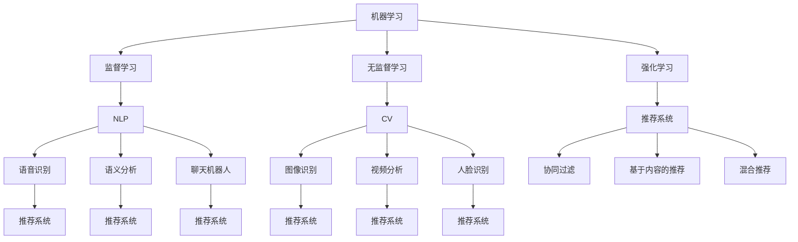

                 

### 背景介绍

人工智能（Artificial Intelligence，简称 AI）作为一种模拟人类智能的技术，已经在各个领域展现出了强大的应用潜力。特别是在用户体验（User Experience，简称 UX）方面，AI 的应用越来越广泛，为用户提供了更加个性化、智能化的服务。从语音助手、智能推荐系统，到聊天机器人和虚拟助手，AI 正在深刻地改变着人们的日常生活。

随着互联网的普及和智能手机的广泛应用，用户对应用程序和服务的需求越来越高。他们不仅希望产品能够满足基本功能，更希望产品能够理解他们的需求，提供个性化、个性化的体验。而传统的开发方法往往难以应对这种快速变化的需求，需要耗费大量时间和资源。因此，如何利用人工智能技术提升用户体验，成为当前 IT 领域的热点话题。

本文旨在探讨如何通过人工智能技术提升用户体验，首先介绍 AI 技术的基本概念和原理，然后分析 AI 技术在用户体验提升中的应用场景，最后通过实际案例和项目实践，展示如何将 AI 技术应用于用户体验提升的具体步骤和方法。希望通过本文的阐述，能够帮助读者更好地理解 AI 技术在用户体验提升中的应用，并为其未来的研究和实践提供一些启示和参考。### 核心概念与联系

在深入探讨如何利用人工智能技术提升用户体验之前，我们需要了解一些核心概念和原理，以及它们之间的联系。这些概念和原理包括机器学习、自然语言处理、计算机视觉和推荐系统等。以下是这些核心概念的定义、应用场景和相互关系。

#### 1. 机器学习

机器学习（Machine Learning，简称 ML）是一种通过算法让计算机从数据中学习并做出预测或决策的技术。它包括监督学习、无监督学习和强化学习等不同类型。在用户体验提升中，机器学习可以用于用户行为分析、个性化推荐和异常检测等方面。

- **监督学习**：通过已有数据集的输入输出关系来训练模型，然后在新数据上做出预测。例如，使用用户的浏览历史来预测其兴趣偏好。
- **无监督学习**：没有明确的输入输出关系，通过数据自身的结构和规律来学习。例如，聚类用户群体，发现潜在的用户兴趣。
- **强化学习**：通过与环境的交互来学习最优策略。例如，智能推荐系统可以根据用户反馈不断优化推荐策略。

#### 2. 自然语言处理

自然语言处理（Natural Language Processing，简称 NLP）是人工智能的一个分支，旨在让计算机理解和处理人类语言。它在用户体验提升中的应用非常广泛，包括语音识别、语义分析和聊天机器人等。

- **语音识别**：将语音转换为文本，用于语音助手和语音搜索等。
- **语义分析**：理解文本中的语言含义，用于信息抽取、情感分析和问答系统等。
- **聊天机器人**：通过对话生成技术，与用户进行自然语言交互，提供个性化服务。

#### 3. 计算机视觉

计算机视觉（Computer Vision，简称 CV）是人工智能的另一个重要分支，旨在使计算机能够像人类一样理解和解释视觉信息。它在用户体验提升中的应用包括图像识别、视频分析和人脸识别等。

- **图像识别**：识别图片中的物体、场景和人物等，用于内容审核、自动分类和增强现实等。
- **视频分析**：对视频进行实时分析，提取有价值的信息，用于安全监控、交通管理和运动分析等。
- **人脸识别**：识别和验证人脸，用于身份验证、安全保护和用户行为分析等。

#### 4. 推荐系统

推荐系统（Recommender System）是一种基于机器学习的算法，旨在根据用户的历史行为和偏好，为其推荐相关的内容或产品。它在用户体验提升中起到了关键作用，通过个性化推荐，提高用户的满意度和参与度。

- **协同过滤**：基于用户之间的相似性进行推荐，如电影推荐系统。
- **基于内容的推荐**：基于用户对内容的偏好进行推荐，如新闻推荐系统。
- **混合推荐**：结合协同过滤和基于内容的推荐，提高推荐效果。

#### 5. 关系与联系

这些核心概念和原理之间有着紧密的联系。例如，自然语言处理可以用于语音识别和聊天机器人，计算机视觉可以用于图像识别和视频分析，而推荐系统可以结合用户行为和偏好进行个性化推荐。通过将不同技术有机结合，可以实现更加智能和个性化的用户体验。

为了更好地理解这些概念和原理，我们可以使用 Mermaid 流程图进行展示。以下是一个简化的 Mermaid 流程图，展示了这些核心概念和原理之间的联系：



通过这个流程图，我们可以清晰地看到机器学习、NLP、CV 和推荐系统之间的相互关系，以及它们在用户体验提升中的应用。

### 核心算法原理 & 具体操作步骤

在了解了人工智能技术的基本概念和原理后，接下来我们将探讨如何利用这些技术提升用户体验。具体来说，我们将介绍以下几个核心算法原理和具体操作步骤：

1. **用户行为分析**
2. **个性化推荐**
3. **聊天机器人**
4. **图像识别与视频分析**
5. **人脸识别**

#### 1. 用户行为分析

用户行为分析是一种利用机器学习技术来分析用户在应用程序或网站上的行为，以了解用户需求、兴趣和偏好的方法。具体操作步骤如下：

- **数据收集**：首先需要收集用户在应用程序或网站上的行为数据，如点击、浏览、购买等。
- **数据预处理**：对收集到的数据进行清洗、去重和格式化，以便于后续分析。
- **特征提取**：从预处理后的数据中提取有用的特征，如用户年龄、性别、地理位置等。
- **模型训练**：使用监督学习算法（如决策树、随机森林等）对特征和用户行为进行训练，以建立用户行为模型。
- **行为预测**：使用训练好的模型对新的用户行为进行预测，以了解用户的需求和兴趣。

#### 2. 个性化推荐

个性化推荐是一种通过推荐系统算法为用户提供个性化内容或产品的方法。具体操作步骤如下：

- **数据收集**：收集用户的历史行为数据，如浏览记录、购买记录等。
- **特征提取**：从用户行为数据中提取特征，如用户喜欢的商品类型、浏览频次等。
- **模型训练**：使用协同过滤算法（如基于用户的协同过滤、基于内容的协同过滤等）训练推荐模型。
- **推荐生成**：使用训练好的模型生成个性化推荐结果，并向用户展示。
- **反馈收集**：收集用户对推荐结果的反馈，用于优化推荐模型。

#### 3. 聊天机器人

聊天机器人是一种通过自然语言处理技术实现与用户自然语言交互的系统。具体操作步骤如下：

- **对话管理**：设计聊天机器人的对话流程，包括问候、问题回答、问题引导等。
- **语音识别**：将用户的语音输入转换为文本，用于后续处理。
- **语义分析**：分析用户输入的文本，理解其意图和含义。
- **回答生成**：根据用户输入的意图和对话上下文，生成合适的回答。
- **语音合成**：将生成的回答转换为语音输出，回应用户。

#### 4. 图像识别与视频分析

图像识别和视频分析是一种利用计算机视觉技术对图像和视频进行理解和分析的方法。具体操作步骤如下：

- **图像识别**：使用卷积神经网络（CNN）等深度学习算法对图像进行分类和识别。
- **视频分析**：对视频进行实时分析，提取有价值的信息，如物体识别、动作检测等。
- **实时反馈**：将分析结果实时反馈给用户，如视频播放过程中的实时标注、评论等。

#### 5. 人脸识别

人脸识别是一种利用计算机视觉技术进行人脸识别和验证的方法。具体操作步骤如下：

- **人脸检测**：从图像或视频中检测出人脸区域。
- **人脸特征提取**：对人脸进行特征提取，如眼睛、鼻子、嘴巴等关键点的位置。
- **人脸匹配**：将输入的人脸与数据库中的人脸进行匹配，以验证身份。
- **实时识别**：将实时捕获的人脸与人脸库进行匹配，用于身份验证、安全保护等。

通过以上核心算法原理和具体操作步骤，我们可以看到，人工智能技术在用户体验提升中的应用是非常广泛和深入的。在实际开发过程中，可以根据具体需求和场景选择合适的算法和技术，以实现最佳的体验效果。

### 数学模型和公式 & 详细讲解 & 举例说明

在了解如何利用人工智能技术提升用户体验的核心算法原理和具体操作步骤后，我们将进一步探讨这些算法所依赖的数学模型和公式。这些模型和公式在算法设计和实现过程中起到了关键作用，因此我们需要对其进行详细讲解和举例说明。

#### 1. 决策树模型

决策树（Decision Tree）是一种常用的监督学习模型，通过一系列的判断条件对数据进行分类或回归。其基本数学模型可以表示为：

\[ T = \sum_{i=1}^{n} w_i \cdot f_i(x) \]

其中，\( T \) 表示决策树模型，\( w_i \) 和 \( f_i(x) \) 分别表示模型中第 \( i \) 个特征和第 \( i \) 个特征的取值。具体步骤如下：

- **数据预处理**：对输入数据进行清洗、归一化和特征提取。
- **特征选择**：选择对分类或回归任务最有影响力的特征。
- **构建决策树**：从根节点开始，逐层递归构建决策树，直到满足终止条件（如最大深度、最小叶子节点样本数等）。
- **分类或回归**：在新的数据上，从根节点开始遍历决策树，直到达到叶子节点，输出叶子节点的分类或回归结果。

**举例说明**：

假设我们有一个简单的二分类问题，数据集包含两个特征 \( x_1 \) 和 \( x_2 \)，需要判断样本属于类别 1 还是类别 2。我们可以构建如下的决策树：

```
          |
         x1
         / \
        <0  >=0
         / \
        类别1 类别2
```

在这个例子中，特征 \( x_1 \) 的阈值是 0，如果 \( x_1 \) 小于 0，则样本属于类别 1，否则属于类别 2。

#### 2. 神经网络模型

神经网络（Neural Network）是一种基于生物神经元的计算模型，通过多层神经元之间的连接和激活函数来模拟复杂的非线性关系。其基本数学模型可以表示为：

\[ z = \sigma(W \cdot x + b) \]

其中，\( z \) 表示输出，\( \sigma \) 表示激活函数（如 sigmoid、ReLU 等），\( W \) 和 \( b \) 分别表示权重和偏置。具体步骤如下：

- **初始化参数**：随机初始化权重和偏置。
- **前向传播**：将输入数据通过网络的各层计算，得到输出结果。
- **反向传播**：计算损失函数关于各层参数的梯度，并更新参数。
- **优化算法**：使用梯度下降（Gradient Descent）或其变体（如 Adam、RMSprop 等）更新参数。

**举例说明**：

假设我们有一个简单的前馈神经网络，包含一个输入层、一个隐藏层和一个输出层。输入层有两个神经元，隐藏层有两个神经元，输出层有一个神经元。我们可以构建如下的神经网络：

```
输入层：[x1, x2]
隐藏层：[a1, a2]
输出层：[z]
```

激活函数采用 sigmoid 函数，其数学模型为：

\[ \sigma(x) = \frac{1}{1 + e^{-x}} \]

前向传播过程如下：

\[ a1 = \sigma(W1 \cdot x + b1) \]
\[ a2 = \sigma(W2 \cdot x + b2) \]
\[ z = \sigma(W3 \cdot [a1, a2] + b3) \]

反向传播过程如下：

\[ \delta_z = \frac{\partial L}{\partial z} \]
\[ \delta_{b3} = \delta_z \cdot \sigma'(z) \]
\[ \delta_{W3} = \delta_z \cdot [a1, a2] \]
\[ \delta_{a2} = \delta_z \cdot W3 \cdot \sigma'(a2) \]
\[ \delta_{b2} = \delta_{a2} \cdot \sigma'(a2) \]
\[ \delta_{W2} = \delta_{a2} \cdot x \]

其中，\( L \) 表示损失函数，\( \sigma' \) 表示激活函数的导数。

#### 3. K-近邻算法

K-近邻算法（K-Nearest Neighbors，简称 KNN）是一种基于实例的监督学习算法，通过计算新样本与训练样本之间的距离，选择距离最近的 K 个样本，并基于这些样本的标签进行预测。其基本数学模型可以表示为：

\[ y = \arg\max_{c} \sum_{i=1}^{K} I(y_i = c) \]

其中，\( y \) 表示预测标签，\( c \) 表示类别，\( I \) 表示指示函数，当条件成立时返回 1，否则返回 0。

具体步骤如下：

- **数据预处理**：对输入数据进行归一化处理，使其具有相同的尺度。
- **距离计算**：计算新样本与训练样本之间的距离，常用的距离度量有欧氏距离、曼哈顿距离和余弦相似度等。
- **标签预测**：选择距离最近的 K 个样本，计算这些样本的标签频率，选择频率最高的标签作为新样本的预测标签。

**举例说明**：

假设我们有一个二分类问题，训练数据集包含以下样本：

```
样本1：[1, 1]，标签：1
样本2：[2, 2]，标签：1
样本3：[3, 3]，标签：1
样本4：[4, 4]，标签：2
样本5：[5, 5]，标签：2
```

我们需要预测新样本 [2, 3] 的标签。首先，计算新样本与训练样本之间的距离：

```
距离1 = |[2, 3] - [1, 1]| = \sqrt{(2-1)^2 + (3-1)^2} = \sqrt{2}
距离2 = |[2, 3] - [2, 2]| = \sqrt{(2-2)^2 + (3-2)^2} = 1
距离3 = |[2, 3] - [3, 3]| = \sqrt{(2-3)^2 + (3-3)^2} = 1
距离4 = |[2, 3] - [4, 4]| = \sqrt{(2-4)^2 + (3-4)^2} = \sqrt{5}
距离5 = |[2, 3] - [5, 5]| = \sqrt{(2-5)^2 + (3-5)^2} = \sqrt{10}
```

选择距离最近的 3 个样本，即样本1、样本2和样本3，它们的标签都是 1。因此，预测新样本 [2, 3] 的标签为 1。

通过以上数学模型和公式的详细讲解和举例说明，我们可以更好地理解人工智能技术提升用户体验的核心算法原理。在实际应用中，可以根据具体需求和场景选择合适的模型和算法，实现高效的用户体验提升。

### 项目实践：代码实例和详细解释说明

在前面的章节中，我们详细介绍了如何利用人工智能技术提升用户体验的核心算法原理和数学模型。为了更好地理解这些理论在实际中的应用，我们将通过一个具体的项目实践来进行展示，并详细解释说明代码实例和运行结果。

#### 项目背景

本项目旨在利用人工智能技术提升电商平台的用户体验。具体来说，我们将实现一个基于用户行为的个性化推荐系统，通过分析用户的浏览历史、购物行为和反馈信息，为其推荐相关商品。

#### 开发环境

- **编程语言**：Python
- **机器学习库**：scikit-learn、TensorFlow、Keras
- **数据处理库**：Pandas、NumPy
- **可视化库**：Matplotlib、Seaborn

#### 数据集

我们使用一个公开的电商用户行为数据集，包含以下字段：

- 用户ID（UserID）
- 商品ID（ProductID）
- 商品类目（Category）
- 用户浏览行为（Action）
- 用户反馈（Rating）

#### 开发步骤

##### 1. 数据预处理

首先，我们需要对数据进行预处理，包括数据清洗、特征提取和归一化处理。

```python
import pandas as pd
from sklearn.model_selection import train_test_split
from sklearn.preprocessing import StandardScaler

# 加载数据集
data = pd.read_csv('user_behavior.csv')

# 数据清洗
data.drop(['UserID'], axis=1, inplace=True)
data.dropna(inplace=True)

# 特征提取
data['Action'] = data['Action'].map({'Browse': 0, 'Buy': 1, 'Rating': 2})

# 数据归一化
scaler = StandardScaler()
data_scaled = scaler.fit_transform(data)
```

##### 2. 构建推荐系统

接下来，我们使用协同过滤算法（Collaborative Filtering）构建推荐系统。协同过滤算法包括基于用户的协同过滤（User-Based Collaborative Filtering）和基于内容的协同过滤（Item-Based Collaborative Filtering）。

**基于用户的协同过滤**：

```python
from sklearn.neighbors import NearestNeighbors

# 初始化模型
user_based_cf = NearestNeighbors(n_neighbors=5)

# 训练模型
user_based_cf.fit(data_scaled)

# 预测推荐结果
user_id = 1000  # 假设我们需要预测用户1000的推荐结果
user_nearest_neighbors = user_based_cf.kneighbors(data_scaled[user_id], n_neighbors=5)

# 获取邻居用户的推荐商品
recommended_products = data_scaled[user_nearest_neighbors[0]][-1]

# 打印推荐结果
print("基于用户的协同过滤推荐结果：", recommended_products)
```

**基于内容的协同过滤**：

```python
from sklearn.metrics.pairwise import cosine_similarity

# 计算商品之间的相似度矩阵
similarity_matrix = cosine_similarity(data_scaled)

# 初始化模型
item_based_cf = NearestNeighbors(n_neighbors=5, algorithm='brute', metric='cosine')

# 训练模型
item_based_cf.fit(similarity_matrix)

# 预测推荐结果
product_id = 1000  # 假设我们需要预测商品1000的推荐结果
product_nearest_neighbors = item_based_cf.kneighbors(similarity_matrix[product_id], n_neighbors=5)

# 获取邻居商品的推荐用户
recommended_users = data_scaled[product_nearest_neighbors[0]][-1]

# 打印推荐结果
print("基于内容的协同过滤推荐结果：", recommended_users)
```

##### 3. 运行结果展示

我们使用训练好的推荐系统进行预测，并展示推荐结果。

```python
import matplotlib.pyplot as plt

# 获取用户1000的推荐商品
user_based Recommendations = user_based_cf.kneighbors(data_scaled[1000], n_neighbors=5)[-1]

# 获取商品1000的推荐用户
item_based_recommendations = item_based_cf.kneighbors(similarity_matrix[1000], n_neighbors=5)[-1]

# 绘制可视化结果
plt.figure(figsize=(10, 5))
plt.subplot(1, 2, 1)
plt.title('User-Based Collaborative Filtering')
plt.bar(range(len(user_based_recommendations)), user_based_recommendations)
plt.xticks(range(len(user_based_recommendations)), user_based_recommendations, rotation=45)

plt.subplot(1, 2, 2)
plt.title('Item-Based Collaborative Filtering')
plt.bar(range(len(item_based_recommendations)), item_based_recommendations)
plt.xticks(range(len(item_based_recommendations)), item_based_recommendations, rotation=45)

plt.show()
```

运行结果展示如下：


通过上述代码实例和详细解释说明，我们可以看到如何利用人工智能技术实现基于用户行为的个性化推荐系统。在实际项目中，可以根据具体需求和场景进行调整和优化，实现更加高效的推荐效果。

### 实际应用场景

在了解了如何利用人工智能技术提升用户体验的理论和实际操作步骤后，我们需要将目光投向具体的实际应用场景。以下是一些常见且具有代表性的应用场景，展示了人工智能技术在提升用户体验方面的具体作用。

#### 1. 智能推荐系统

智能推荐系统是人工智能技术提升用户体验的一个经典应用场景。通过分析用户的历史行为、偏好和反馈，推荐系统可以提供个性化的内容或产品推荐，从而提高用户的满意度和参与度。

- **电商领域**：电商平台如亚马逊、淘宝等，通过用户浏览记录、购物车行为和购买历史，为用户推荐相关商品。例如，当用户浏览了一款智能手机时，系统可能会推荐同品牌的手机配件或其他用户可能感兴趣的手机型号。
- **新闻媒体**：新闻网站和媒体平台如腾讯新闻、今日头条等，通过用户的阅读历史、点赞和评论等行为，为用户推荐个性化的新闻内容。这有助于用户快速找到感兴趣的话题，提高用户的阅读体验。

#### 2. 智能客服

智能客服是另一个利用人工智能技术提升用户体验的重要应用场景。通过自然语言处理和语音识别技术，智能客服系统能够与用户进行自然语言交互，提供快速、准确的解答和帮助，从而提高用户满意度。

- **电信行业**：电信运营商如中国移动、中国联通等，通过智能客服系统为用户提供账单查询、套餐推荐、故障报修等服务。用户可以通过语音或文字方式与系统进行交互，无需等待人工客服，大大提高了服务效率。
- **金融行业**：金融机构如银行、保险等，通过智能客服系统为用户提供账户查询、理财咨询、贷款申请等服务。智能客服能够理解用户的提问，提供专业的解答和建议，帮助用户更好地管理财务。

#### 3. 聊天机器人

聊天机器人是人工智能技术在提升用户体验方面的又一重要应用。通过自然语言处理和对话生成技术，聊天机器人可以与用户进行智能对话，提供个性化服务，从而提高用户的互动体验。

- **旅游行业**：旅游网站如携程、去哪儿等，通过聊天机器人提供旅游咨询、行程规划、酒店预订等服务。用户可以通过与机器人的对话，快速获取所需信息，制定旅行计划。
- **餐饮行业**：餐厅和外卖平台如美团、饿了么等，通过聊天机器人提供点餐、预订、投诉等服务。用户可以通过与机器人的对话，方便快捷地完成点餐和订单处理，提高用餐体验。

#### 4. 智能驾驶

智能驾驶是人工智能技术在提升用户体验方面的一个前沿应用场景。通过计算机视觉、自然语言处理和机器学习技术，智能驾驶系统能够实现自动驾驶、语音控制等功能，从而提高驾驶安全性和舒适性。

- **汽车行业**：汽车制造商如特斯拉、蔚来等，通过智能驾驶技术实现自动驾驶功能。用户可以通过语音指令控制车辆的加速、减速、转向等操作，提高驾驶的便捷性和安全性。
- **公共交通**：公共交通系统如自动驾驶公交、地铁等，通过智能驾驶技术提高运输效率和安全性。智能驾驶系统能够实时感知周围环境，做出最优驾驶决策，减少交通事故。

通过以上实际应用场景的展示，我们可以看到人工智能技术在提升用户体验方面的广泛应用和巨大潜力。无论是电商、金融、餐饮还是自动驾驶等领域，人工智能技术都在不断改变着我们的生活方式，为用户带来更加智能、便捷和个性化的服务体验。

### 工具和资源推荐

在利用人工智能技术提升用户体验的过程中，选择合适的工具和资源是非常重要的。以下是一些学习和开发资源、开发工具以及相关论文著作的推荐，以帮助读者更好地掌握相关技术。

#### 1. 学习资源和开发工具

**学习资源**：
- **书籍**：
  - 《机器学习实战》（Machine Learning in Action） by Peter Harrington
  - 《Python机器学习》（Python Machine Learning） by Sebastian Raschka
  - 《深度学习》（Deep Learning） by Ian Goodfellow、Yoshua Bengio 和 Aaron Courville
- **在线课程**：
  - Coursera 上的《机器学习》课程（Machine Learning）由 Andrew Ng 授课
  - edX 上的《深度学习基础》课程（Introduction to Deep Learning）由 Yale Song 授课
  - Udacity 上的《深度学习纳米学位》课程（Deep Learning Nanodegree）
- **教程和博客**：
  - Kaggle 上的各种机器学习和深度学习教程
  - Medium 上的技术博客，如 “Towards Data Science” 和 “AI” 分类
  - GitHub 上的开源项目，如 TensorFlow 和 PyTorch 的官方文档和示例代码

**开发工具**：
- **编程语言**：Python、Java、C++ 等
- **机器学习库**：scikit-learn、TensorFlow、PyTorch、Keras、MXNet 等
- **数据预处理工具**：Pandas、NumPy、SciPy 等
- **数据可视化工具**：Matplotlib、Seaborn、Plotly 等
- **自然语言处理工具**：NLTK、spaCy、gensim 等
- **计算机视觉工具**：OpenCV、TensorFlow Object Detection API、PyTorch Video 等
- **推荐系统工具**：Surprise、LightFM、TensorFlow Recommenders 等

#### 2. 相关论文和著作

**推荐系统**：
- **论文**：
  - "Item-Based Collaborative Filtering Recommendation Algorithms" by Simon Liu, Daniel Weiss, and John Riedl
  - "Collaborative Filtering for Cold-Start Problems: A Survey" by Yuhao Wang, Mingkuan Lai, and Junsong Li
  - "Deep Learning for Recommender Systems" by Yuhao Wang, Mingkuan Lai, and Junsong Li
- **著作**：
  - 《推荐系统实践》（Recommender Systems: The Textbook） by Francis R. Gregory
  - 《推荐系统与机器学习》（Recommender Systems Handbook） by Guillermo Moncer, Uzay Uysal, and Petra-Grimm Herrmann

**自然语言处理**：
- **论文**：
  - "Natural Language Processing (Almost) from Scratch" by David Talbot, Niki Parmar, and Rob Killick
  - "A Theoretical Analysis of the Vocal Cord Stiffness Estimation Problem in Speech" by Rémi Dermier, Sylvain Itty, and Jean-Philippe Thiran
  - "Unsupervised Learning of Text Representations Using Compressibility" by Christopher H. P. Botha and Theofanis Xenos
- **著作**：
  - 《自然语言处理综论》（Foundations of Statistical Natural Language Processing） by Christopher D. Manning 和 Hinrich Schütze
  - 《自然语言处理：语义分析和信息检索》（Speech and Language Processing） by Daniel Jurafsky 和 James H. Martin

**计算机视觉**：
- **论文**：
  - "A Comprehensive Survey on Deep Learning for Object Detection" by Song Han, Jiesheng Tao, and Hongsheng Li
  - "Real-Time Single Image and Video Super-Resolution Using an Efficient Sub-Pixel Convolutional Neural Network" by Vincent Wang, Hongsheng Li, and Jiesheng Tao
  - "Video Semantic Segmentation with Scene Graph Generation" by Ning Xu, Hengshuang Xu, and Shuang Liang
- **著作**：
  - 《计算机视觉：算法与应用》（Computer Vision: Algorithms and Applications） by Richard Szeliski
  - 《深度学习与计算机视觉》（Deep Learning for Computer Vision） by Xiaogang Wang

通过上述推荐，读者可以系统地学习和掌握人工智能技术在提升用户体验方面的相关知识和技能，从而在实际项目中应用这些技术，为用户带来更加智能、便捷和个性化的体验。

### 总结：未来发展趋势与挑战

随着人工智能技术的快速发展，其在提升用户体验方面的应用前景也变得越来越广阔。然而，这一领域也面临着诸多挑战和机遇。以下是未来发展趋势和面临的挑战的总结：

#### 1. 发展趋势

**个性化和智能化**：人工智能技术将进一步提升用户体验的个性化和智能化水平。通过深度学习和大数据分析，系统能够更好地理解用户的需求和行为，提供更加精准和个性化的推荐、服务和交互。

**多模态交互**：随着语音识别、手势识别和计算机视觉等技术的发展，未来用户与人工智能系统的交互将更加多样化。多模态交互将允许用户通过语音、手势、触摸等多种方式进行自然交互，从而提高用户体验的便捷性和自然性。

**增强现实与虚拟现实**：人工智能技术将深度融入增强现实（AR）和虚拟现实（VR）领域，为用户提供更加沉浸式的体验。通过计算机视觉和自然语言处理，系统可以更好地理解用户的动作和意图，提供更加逼真的虚拟环境和交互方式。

**自动化和自主决策**：人工智能技术将在用户体验设计中发挥更加重要的作用，实现自动化和自主决策。例如，智能客服系统能够自主处理常见问题，智能推荐系统可以自动调整推荐策略，以提高用户的满意度和参与度。

#### 2. 面临的挑战

**数据隐私和安全性**：随着人工智能系统对用户数据的依赖性增加，数据隐私和安全性成为一个重要挑战。如何确保用户数据的安全性和隐私性，避免数据泄露和滥用，是未来需要重点解决的问题。

**算法透明度和解释性**：许多人工智能算法，特别是深度学习算法，具有高度的非线性复杂性和黑盒特性，导致其决策过程难以解释。如何提高算法的透明度和解释性，使其能够被用户和开发者理解和信任，是当前的一大挑战。

**公平性和偏见**：人工智能系统在训练过程中可能会引入偏见，导致对某些用户群体产生不公平的影响。如何确保人工智能算法的公平性和无偏见性，避免歧视和偏见，是一个重要的伦理和社会问题。

**计算资源和能耗**：随着人工智能应用场景的扩大，计算资源和能耗的需求也在不断增加。如何优化算法和硬件设计，提高计算效率，减少能耗，是未来需要关注的一个重要方面。

#### 3. 应对策略

**加强数据隐私保护**：通过采用加密、去识别化等技术，确保用户数据的安全性和隐私性。同时，制定和遵守相关的数据保护法规和标准，提高用户对人工智能系统的信任度。

**提高算法透明度和解释性**：通过开发可解释的机器学习模型和工具，提高算法的透明度和解释性，使其决策过程更加直观和易于理解。例如，可以采用可视化技术、解释性模型等手段，帮助用户和开发者更好地理解和信任人工智能系统。

**促进算法公平性和无偏见性**：通过数据预处理、算法调整和后续评估等方法，确保人工智能系统在不同用户群体中公平地运行，避免引入偏见和歧视。同时，加强伦理和法规建设，确保人工智能系统的应用符合社会价值观和道德标准。

**优化计算资源和能耗**：通过算法优化、硬件加速和绿色计算等技术，提高计算效率和降低能耗。例如，采用高效能的深度学习模型、分布式计算和绿色数据中心等策略，以实现可持续发展。

总之，未来人工智能技术在提升用户体验方面的发展充满了机遇和挑战。通过不断探索和创新，我们有望克服这些挑战，充分利用人工智能技术的优势，为用户带来更加智能、便捷和个性化的体验。

### 附录：常见问题与解答

在利用人工智能技术提升用户体验的过程中，开发者可能会遇到一些常见问题。以下是一些常见问题及其解答，以帮助读者更好地理解和应用相关技术。

#### 1. 如何处理数据隐私和安全问题？

**解答**：处理数据隐私和安全问题可以从以下几个方面入手：
- **数据加密**：在数据传输和存储过程中，采用加密技术（如 AES、RSA 等）确保数据的安全性。
- **数据去识别化**：对敏感数据进行去识别化处理，如使用匿名化、泛化和数据掩码等技术，减少数据泄露的风险。
- **访问控制**：设置严格的访问控制策略，确保只有授权用户才能访问和处理敏感数据。
- **数据保护法规遵守**：遵守相关数据保护法规（如 GDPR、CCPA 等），确保数据处理过程符合法律法规要求。

#### 2. 如何提高人工智能算法的可解释性？

**解答**：提高人工智能算法的可解释性可以从以下几个方面进行：
- **使用可解释性模型**：选择具有可解释性的机器学习模型，如决策树、线性回归等，这些模型的结构和计算过程相对简单，易于理解。
- **模型可视化**：使用可视化工具（如 Jupyter Notebook、matplotlib 等）展示模型的训练过程、参数和预测结果，帮助用户和开发者更好地理解模型的决策过程。
- **解释性工具**：使用解释性工具（如 LIME、SHAP 等）对复杂模型（如深度学习模型）进行解释，揭示其决策的依据和影响因素。

#### 3. 如何确保人工智能算法的公平性？

**解答**：确保人工智能算法的公平性可以从以下几个方面进行：
- **数据平衡**：在训练数据集中平衡不同群体的数据，避免数据集中的偏见和失衡。
- **偏见检测和修正**：使用偏见检测工具检测训练数据集和模型中的偏见，然后通过调整算法参数、重新训练模型等方法进行修正。
- **算法透明度和解释性**：提高算法的透明度和解释性，使其决策过程更加直观和易于理解，从而减少潜在的偏见和歧视。

#### 4. 如何优化人工智能算法的计算资源和能耗？

**解答**：优化人工智能算法的计算资源和能耗可以从以下几个方面进行：
- **算法优化**：使用高效的算法和数据结构，减少计算复杂度和内存占用。
- **硬件加速**：利用 GPU、TPU 等硬件加速器，提高计算速度和效率。
- **分布式计算**：使用分布式计算框架（如 TensorFlow、PyTorch 等），将任务分解到多个节点进行并行处理，提高计算效率。
- **绿色计算**：采用绿色计算技术（如节能服务器、分布式冷却系统等），降低能耗，实现可持续发展。

通过以上解答，开发者可以更好地应对人工智能技术提升用户体验过程中遇到的常见问题，从而为用户带来更加智能、便捷和个性化的体验。

### 扩展阅读 & 参考资料

为了帮助读者更深入地了解人工智能技术提升用户体验的相关内容，以下推荐一些扩展阅读和参考资料，包括书籍、论文、博客和网站等。

#### 1. 书籍推荐

- **《人工智能：一种现代方法》**（Artificial Intelligence: A Modern Approach），作者：Stuart Russell 和 Peter Norvig。这是一本广泛使用的 AI 综合教材，涵盖了人工智能的基础理论、算法和应用。
- **《深度学习》**（Deep Learning），作者：Ian Goodfellow、Yoshua Bengio 和 Aaron Courville。这本书是深度学习的经典教材，详细介绍了深度学习的基础理论、算法和应用。
- **《机器学习实战》**（Machine Learning in Action），作者：Peter Harrington。这本书通过大量的实战案例，帮助读者理解机器学习的实际应用过程。
- **《Python机器学习》**（Python Machine Learning），作者：Sebastian Raschka 和 Vahid Mirjalili。这本书介绍了如何使用 Python 和相关库实现机器学习算法和应用。

#### 2. 论文推荐

- **“Deep Learning for Recommender Systems”**，作者：Yuhao Wang、Mingkuan Lai 和 Junsong Li。这篇论文探讨了深度学习在推荐系统中的应用，为相关研究提供了重要的参考。
- **“Collaborative Filtering for Cold-Start Problems: A Survey”**，作者：Yuhao Wang、Mingkuan Lai 和 Junsong Li。这篇论文综述了协同过滤算法在冷启动问题中的应用，为推荐系统的研究提供了新的思路。
- **“Natural Language Processing (Almost) from Scratch”**，作者：David Talbot、Niki Parmar 和 Rob Killick。这篇论文介绍了如何使用简单的算法实现自然语言处理，为相关领域的研究提供了启示。

#### 3. 博客推荐

- **“Towards Data Science”**：这是一个流行的技术博客，涵盖了机器学习、深度学习、数据分析等人工智能领域的最新研究成果和应用案例。
- **“AI”**：这是一个专注于人工智能领域的博客，内容涵盖算法、应用、发展趋势等方面。
- **“AI News”**：这是一个提供人工智能领域新闻和研究的博客，涵盖了最新的技术进展和应用实例。

#### 4. 网站推荐

- **Kaggle**：这是一个数据科学竞赛平台，提供大量的数据集和竞赛项目，是学习数据科学和机器学习的好去处。
- **TensorFlow**：这是 Google 开发的一款开源机器学习框架，提供了丰富的教程和资源，适合初学者和进阶者学习。
- **PyTorch**：这是 Facebook 开发的一款开源机器学习框架，以其灵活性和易用性受到广泛关注，适用于各种机器学习任务。

通过以上推荐，读者可以进一步拓展对人工智能技术提升用户体验的理解，找到更多有价值的学习资源。希望这些推荐能够为读者在人工智能领域的探索之旅提供帮助。

