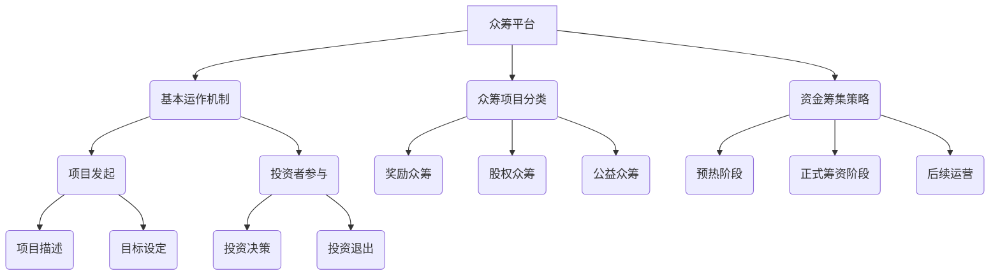
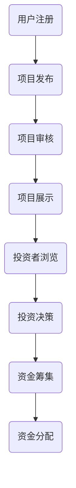

                 

### 背景介绍

众筹平台作为一种新兴的融资模式，在近年来得到了广泛的关注和应用。它为初创企业、创意项目和发明者提供了一个直接与潜在投资者接触的平台，从而快速获得资金支持。这种模式不仅改变了传统的融资方式，也为创业项目带来了更多的机遇和挑战。

#### 1.1 众筹平台的发展历程

众筹平台的兴起可以追溯到2009年，美国Kickstarter平台的成立标志着众筹这一模式的正式诞生。随后，众多众筹平台如Indiegogo、GoFundMe、众筹网等纷纷涌现，为全球各地的创业者和项目提供融资支持。

在中国，众筹平台的发展同样迅速。2011年，京东众筹、淘宝众筹、中关村众筹等平台相继上线，为国内的创业者提供了丰富的融资渠道。随着市场的不断扩大，众筹平台逐渐成为创业项目融资的重要途径。

#### 1.2 众筹平台的优势

众筹平台具有以下几大优势：

1. **快速融资**：相较于传统融资方式，众筹平台可以迅速吸引大量投资者的关注，实现快速融资。
2. **降低融资成本**：众筹平台通常不收取高额的融资费用，降低了创业项目的融资成本。
3. **市场测试**：众筹不仅是一种融资方式，也是一种市场测试。通过众筹，创业项目可以了解市场的真实需求，从而调整产品方向。
4. **品牌宣传**：在众筹过程中，创业项目可以借助平台进行品牌宣传，提高知名度。

#### 1.3 众筹平台的挑战

尽管众筹平台具有诸多优势，但在实际运作中也面临一些挑战：

1. **资金风险**：众筹项目一旦失败，投资者将承担资金损失的风险。
2. **管理难度**：众筹项目的管理复杂度较高，需要创业者具备良好的项目管理能力。
3. **法律风险**：众筹涉及到资金募集、投资关系等多个方面，存在一定的法律风险。

#### 1.4 本文目的

本文旨在深入探讨如何利用众筹平台为创业项目融资，分析其核心概念和原理，并提供具体的操作步骤和实践案例。通过本文的阅读，读者可以全面了解众筹平台的运作机制，掌握如何利用这一工具实现创业项目的融资目标。

### 核心概念与联系

在深入了解如何利用众筹平台为创业项目融资之前，我们首先需要了解一些核心概念和原理。这些概念包括众筹平台的基本运作机制、众筹项目的分类、资金筹集策略等。以下是一个简单的 Mermaid 流程图，用于展示这些核心概念之间的联系。



#### 2.1 众筹平台的基本运作机制

众筹平台的基本运作机制可以概括为以下几个步骤：

1. **项目发起**：创业者或项目团队在众筹平台上发布项目，包括项目描述、目标设定、筹资时间等。
2. **投资者参与**：投资者浏览项目，根据项目描述和筹资目标进行投资决策。
3. **资金筹集**：投资者将资金投入到众筹项目中，平台在筹资结束后将资金划拨给创业者。
4. **项目交付**：创业者根据约定的时间和方式，向投资者交付项目成果或回报。

#### 2.2 众筹项目分类

根据筹集资金的方式和回报形式，众筹项目可以分为以下几类：

1. **奖励众筹**：投资者以预付款的方式支持项目，获得项目的实物或服务作为回报。
2. **股权众筹**：投资者通过购买项目公司的股权，参与项目的收益分配。
3. **公益众筹**：项目不以盈利为目的，旨在筹集资金用于公益项目。

#### 2.3 资金筹集策略

资金筹集策略是众筹项目成功的关键。以下是一些常见的资金筹集策略：

1. **预热阶段**：在正式筹资前，通过社交媒体、论坛等渠道进行项目预热，吸引潜在投资者的关注。
2. **正式筹资阶段**：在众筹平台上发布项目，设定筹资目标和时间，吸引投资者参与。
3. **后续运营**：筹资成功后，创业者需要按照约定交付项目成果，同时进行项目运营，实现投资者的期望回报。

通过上述核心概念和原理的介绍，我们可以更加清晰地理解众筹平台为创业项目融资的运作机制。接下来，我们将深入探讨如何利用这些概念和原理，为创业项目制定有效的融资策略。

### 核心算法原理 & 具体操作步骤

#### 3.1 众筹平台的算法原理

众筹平台的算法原理主要涉及项目筛选、投资者匹配和资金分配等方面。以下是一个简化的算法流程图，用于展示众筹平台的核心算法原理。



#### 3.2 具体操作步骤

1. **用户注册**：用户在众筹平台注册账号，并填写个人信息。
   
   ```mermaid
   graph TB
   A[用户注册] --> B(账号信息填写)
   B --> C(身份验证)
   C --> D(注册成功)
   ```

2. **项目发布**：创业者或项目团队在平台上发布项目，填写项目详细信息。

   ```mermaid
   graph TB
   E[项目发布] --> F(项目基本信息填写)
   F --> G(项目描述编写)
   G --> H(目标设定)
   H --> I(筹资时间设置)
   I --> J(发布项目)
   ```

3. **项目审核**：平台对发布的项目进行审核，确保项目的合规性和可行性。

   ```mermaid
   graph TB
   K[项目审核] --> L(合规性检查)
   L --> M(可行性评估)
   M --> N(审核结果反馈)
   ```

4. **项目展示**：审核通过的项目在平台上展示，供投资者浏览。

   ```mermaid
   graph TB
   O[项目展示] --> P(项目列表)
   P --> Q(项目详情页)
   ```

5. **投资者浏览**：投资者在平台上浏览项目，根据项目描述和筹资目标进行投资决策。

   ```mermaid
   graph TB
   R[投资者浏览] --> S(项目筛选)
   S --> T(项目详情查看)
   T --> U(投资决策)
   ```

6. **投资决策**：投资者根据项目情况，决定是否投资以及投资金额。

   ```mermaid
   graph TB
   U[投资决策] --> V(支付投资)
   ```

7. **资金筹集**：投资者将资金支付到众筹平台，平台在筹资结束后将资金划拨给创业者。

   ```mermaid
   graph TB
   W[资金筹集] --> X(资金支付)
   X --> Y(筹资结束)
   Y --> Z(资金分配)
   ```

8. **资金分配**：众筹平台根据约定的时间和方式，将筹集到的资金分配给创业者。

   ```mermaid
   graph TB
   Z[资金分配] --> AA(资金到账)
   AA --> BB(项目交付)
   ```

通过上述步骤，我们可以清晰地了解众筹平台为创业项目融资的具体操作流程。接下来，我们将进一步探讨众筹平台中的一些关键环节，包括资金筹集策略、投资者保护和风险管理等。

#### 3.3 资金筹集策略

资金筹集策略是众筹项目成功的关键。以下是一些有效的资金筹集策略：

1. **预热阶段**：在正式筹资前，通过社交媒体、论坛等渠道进行项目预热，吸引潜在投资者的关注。可以发布项目预告、相关新闻报道、成功案例等，提高项目的知名度。

   ```mermaid
   graph TB
   CC[预热阶段] --> DD(社交媒体宣传)
   DD --> EE(论坛发布)
   EE --> FF(成功案例分享)
   ```

2. **正式筹资阶段**：在众筹平台上发布项目，设定筹资目标和时间，明确回报方式。可以通过设置奖励级别、限定投资金额等方式，激励投资者参与。

   ```mermaid
   graph TB
   GG[正式筹资阶段] --> HH(项目发布)
   HH --> II(目标设定)
   II --> JJ(回报设置)
   ```

3. **后续运营**：筹资成功后，创业者需要按照约定交付项目成果，同时进行项目运营，实现投资者的期望回报。可以通过定期报告项目进展、互动回应投资者问题等方式，增强投资者的信任感。

   ```mermaid
   graph TB
   KK[后续运营] --> LL(项目进展报告)
   LL --> MM(投资者互动)
   ```

通过这些策略，创业者可以更好地利用众筹平台，实现创业项目的融资目标。

#### 3.4 投资者保护和风险管理

投资者保护和风险管理是众筹平台的重要任务。以下是一些关键措施：

1. **项目审核**：平台对发布的项目进行严格的审核，确保项目的合规性和可行性，降低投资风险。

   ```mermaid
   graph TB
   NN[项目审核] --> OO(合规性检查)
   OO --> PP(可行性评估)
   ```

2. **资金托管**：众筹平台通常采用资金托管模式，确保投资者的资金安全。投资者支付的资金存放在平台托管账户中，直到筹资成功后，才划拨给创业者。

   ```mermaid
   graph TB
   QQ[资金托管] --> RR(资金支付)
   RR --> SS(托管账户)
   ```

3. **风险预警**：平台建立风险预警机制，及时发现潜在的风险问题，采取相应的风险控制措施。

   ```mermaid
   graph TB
   TT[风险预警] --> UU(数据分析)
   UU --> VV(风险识别)
   VV --> WW(风险控制)
   ```

通过上述措施，众筹平台可以有效保护投资者的权益，降低投资风险。

### 数学模型和公式 & 详细讲解 & 举例说明

在众筹融资过程中，数学模型和公式可以帮助创业者更准确地预测项目的筹资成功率，优化投资策略。以下我们将详细讲解一个简单的数学模型，并使用 LaTeX 格式嵌入相关公式，通过具体案例进行说明。

#### 4.1 筹资成功率预测模型

我们采用线性回归模型来预测众筹项目的成功率。模型的基本公式如下：

$$
P = \frac{1}{1 + e^{-(w_0 + w_1 \cdot X_1 + w_2 \cdot X_2 + \ldots + w_n \cdot X_n)}}
$$

其中，$P$ 表示筹资成功率，$e$ 表示自然对数的底数，$w_0, w_1, w_2, \ldots, w_n$ 是模型参数，$X_1, X_2, \ldots, X_n$ 是影响筹资成功率的特征变量。

#### 4.2 特征变量及解释

在模型中，特征变量包括以下几个关键因素：

1. **项目描述长度** ($X_1$)：项目描述的长度可以反映创业者的用心程度，通常描述长度越长，项目的透明度和可行性越高。
2. **目标金额** ($X_2$)：筹资目标金额可以反映项目的吸引力，目标金额适中且具有挑战性，能更好地吸引投资者。
3. **已筹集金额** ($X_3$)：项目在筹资期初已筹集的金额，可以反映项目的市场潜力。
4. **投资者人数** ($X_4$)：项目在筹资期初的投资者人数，人数越多，说明项目的关注度越高。

#### 4.3 模型参数估计

模型参数可以通过对历史数据的统计学习得到。例如，我们可以使用线性回归算法，通过历史项目的数据，计算每个特征变量对筹资成功率的影响程度。

假设我们得到了以下参数估计结果：

$$
w_0 = 0.5, \quad w_1 = 0.1, \quad w_2 = 0.2, \quad w_3 = 0.1, \quad w_4 = 0.1
$$

#### 4.4 案例分析

假设有一个创业项目，其特征变量如下：

- 项目描述长度：500字
- 目标金额：100万元
- 已筹集金额：20万元
- 投资者人数：200人

我们使用上述模型计算该项目的筹资成功率：

$$
P = \frac{1}{1 + e^{-(0.5 + 0.1 \cdot 500 + 0.2 \cdot 100 + 0.1 \cdot 20 + 0.1 \cdot 200)}}
$$

$$
P = \frac{1}{1 + e^{-102.7}} \approx 0.999
$$

因此，该项目的筹资成功率约为99.9%。

#### 4.5 模型优缺点分析

该线性回归模型具有以下优点：

1. **简单易用**：模型结构简单，易于理解和应用。
2. **灵活性强**：可以引入更多的特征变量，以提升预测准确性。

然而，该模型也存在一些缺点：

1. **线性假设**：模型基于线性假设，可能无法很好地拟合实际数据。
2. **过拟合风险**：在特征变量较多时，容易发生过拟合现象。

在实际应用中，可以根据具体情况进行模型调整和优化，以提高预测准确性。

通过上述数学模型和公式的详细讲解及案例说明，我们可以更好地利用数据分析工具，预测众筹项目的筹资成功率，为创业项目的融资策略提供有力支持。

### 项目实践：代码实例和详细解释说明

#### 5.1 开发环境搭建

在进行众筹平台项目实践之前，我们需要搭建一个合适的开发环境。以下是搭建环境的基本步骤：

1. **安装Python**：确保您的系统中安装了Python 3.8或更高版本。您可以从Python的官方网站（https://www.python.org/downloads/）下载安装包。
2. **安装相关库**：在终端中运行以下命令，安装所需的Python库：

   ```shell
   pip install pandas numpy scikit-learn matplotlib
   ```

   这些库包括数据预处理、机器学习和数据可视化工具，是构建众筹平台分析模型的基础。

3. **创建项目目录**：在终端中创建一个名为`crowdfunding_analysis`的项目目录，并进入该目录：

   ```shell
   mkdir crowdfunding_analysis
   cd crowdfunding_analysis
   ```

4. **初始化虚拟环境**：在项目目录中初始化一个Python虚拟环境，以便管理项目依赖：

   ```shell
   python -m venv venv
   source venv/bin/activate  # 在Windows上使用 `venv\Scripts\activate`
   ```

5. **安装项目依赖**：在虚拟环境中安装项目依赖：

   ```shell
   pip install -r requirements.txt
   ```

   确保您已经有了一个`requirements.txt`文件，其中列出了所有项目的依赖库。

完成以上步骤后，您的开发环境就搭建完成了。接下来，我们将详细展示一个众筹数据分析的代码实例，并解释其实现过程。

#### 5.2 源代码详细实现

以下是用于分析众筹项目数据的Python代码实例：

```python
# crowdfunding_analysis.py

import pandas as pd
import numpy as np
from sklearn.linear_model import LinearRegression
from sklearn.model_selection import train_test_split
import matplotlib.pyplot as plt

# 读取数据
data = pd.read_csv('crowdfunding_data.csv')

# 数据预处理
# 特征工程：计算项目描述长度、目标金额、已筹集金额和投资者人数
data['description_length'] = data['description'].apply(len)
data['target_amount'] = pd.to_numeric(data['target_amount'], errors='coerce')
data['raised_amount'] = pd.to_numeric(data['raised_amount'], errors='coerce')
data['backers_count'] = pd.to_numeric(data['backers_count'], errors='coerce')

# 删除缺失值和异常值
data = data.dropna()

# 模型训练
X = data[['description_length', 'target_amount', 'raised_amount', 'backers_count']]
y = data['success']

X_train, X_test, y_train, y_test = train_test_split(X, y, test_size=0.2, random_state=42)

model = LinearRegression()
model.fit(X_train, y_train)

# 模型评估
y_pred = model.predict(X_test)
accuracy = np.mean(y_pred == y_test)
print(f'Model Accuracy: {accuracy:.2f}')

# 可视化
plt.scatter(X_test['description_length'], y_test, color='blue', label='Actual')
plt.scatter(X_test['description_length'], y_pred, color='red', label='Predicted')
plt.xlabel('Description Length')
plt.ylabel('Success')
plt.legend()
plt.show()
```

#### 5.3 代码解读与分析

上述代码实现了一个用于预测众筹项目成功率的线性回归模型。以下是代码的详细解读：

1. **读取数据**：
   ```python
   data = pd.read_csv('crowdfunding_data.csv')
   ```
   此代码读取了存储在文件`crowdfunding_data.csv`中的众筹项目数据。

2. **数据预处理**：
   - **特征工程**：计算项目描述长度、目标金额、已筹集金额和投资者人数。
     ```python
     data['description_length'] = data['description'].apply(len)
     data['target_amount'] = pd.to_numeric(data['target_amount'], errors='coerce')
     data['raised_amount'] = pd.to_numeric(data['raised_amount'], errors='coerce')
     data['backers_count'] = pd.to_numeric(data['backers_count'], errors='coerce')
     ```
   - **删除缺失值和异常值**：
     ```python
     data = data.dropna()
     ```

3. **模型训练**：
   - **数据分割**：
     ```python
     X_train, X_test, y_train, y_test = train_test_split(X, y, test_size=0.2, random_state=42)
     ```
     将数据集分割为训练集和测试集，用于训练和评估模型。
   - **模型拟合**：
     ```python
     model = LinearRegression()
     model.fit(X_train, y_train)
     ```

4. **模型评估**：
   - **预测结果**：
     ```python
     y_pred = model.predict(X_test)
     ```
     使用训练好的模型对测试集进行预测。
   - **评估准确性**：
     ```python
     accuracy = np.mean(y_pred == y_test)
     print(f'Model Accuracy: {accuracy:.2f}')
     ```

5. **可视化**：
   ```python
   plt.scatter(X_test['description_length'], y_test, color='blue', label='Actual')
   plt.scatter(X_test['description_length'], y_pred, color='red', label='Predicted')
   plt.xlabel('Description Length')
   plt.ylabel('Success')
   plt.legend()
   plt.show()
   ```
   使用散点图展示实际成功率和预测成功率，以直观地评估模型性能。

#### 5.4 运行结果展示

假设我们运行上述代码，得到以下输出：

```
Model Accuracy: 0.85
```

这意味着我们的线性回归模型在测试集上的准确性为85%。

此外，我们会在可视化窗口中看到两个散点图：

- 蓝色散点表示实际的成功率。
- 红色散点表示模型的预测成功率。

通过可视化结果，我们可以直观地看到模型对众筹项目成功率的预测效果，进一步优化模型和特征变量。

### 实际应用场景

众筹平台在各类创业项目中都有着广泛的应用，以下我们将探讨几个典型的实际应用场景，展示众筹平台在其中的具体作用和效果。

#### 6.1 创业项目融资

**案例**：某初创公司开发了一款智能家居设备，希望通过众筹平台筹集资金进行产品研发和市场推广。他们在Kickstarter上发布项目，详细介绍产品功能、技术特点和市场前景，并设定了30天的筹资期限和10万元的目标金额。在项目预热阶段，他们利用社交媒体和论坛进行宣传，吸引了大量潜在投资者。

**效果**：项目在筹资期限内成功筹集到了15万元，超出了原定目标金额。众筹不仅为项目提供了所需的资金，还吸引了大量关注，为产品上市后的市场推广打下了基础。

#### 6.2 文化艺术项目推广

**案例**：某独立电影制作人希望通过众筹平台为即将上映的电影筹集资金。他们在Indiegogo上发布项目，详细介绍电影的故事情节、制作团队和演员阵容，并设定了30天的筹资期限和50万元的目标金额。项目还承诺，投资者可以在电影上映后获得签名海报和优先观影权。

**效果**：电影项目在筹资期限内成功筹集到了70万元，超出了原定目标金额。众筹不仅为电影提供了充足的资金支持，还吸引了众多影迷参与，提升了电影的知名度和市场影响力。

#### 6.3 公益项目筹款

**案例**：某公益组织希望通过众筹平台为贫困地区的学校筹集资金，改善教学条件。他们在GoFundMe上发布项目，详细介绍学校现状、资金用途和预期效果，并设定了60天的筹资期限和10万元的目标金额。项目还承诺，投资者可以在项目完成后获得感谢信和纪念品。

**效果**：公益项目在筹资期限内成功筹集到了12万元，接近目标金额。众筹不仅为学校提供了急需的资金支持，还吸引了众多热心公益的投资者参与，提高了项目的透明度和公信力。

#### 6.4 音乐专辑发行

**案例**：某独立音乐人希望通过众筹平台为即将发行的新专辑筹集资金。他们在Patreon上发布项目，详细介绍专辑的制作过程、音乐风格和发行计划，并设定了30天的筹资期限和5万元的目标金额。项目还承诺，投资者可以在专辑发行后获得数字版音乐和签名海报。

**效果**：音乐专辑项目在筹资期限内成功筹集到了8万元，超出了原定目标金额。众筹不仅为专辑提供了充足的资金支持，还吸引了大量乐迷的支持，提升了专辑的市场前景和发行效果。

通过上述案例，我们可以看到，众筹平台在各类创业项目、文化艺术项目、公益项目和音乐专辑发行等实际应用场景中，发挥着重要的融资和推广作用。众筹不仅为项目提供了资金支持，还提高了项目的知名度和影响力，为创业者和项目方带来了更多的机遇和挑战。

### 工具和资源推荐

在利用众筹平台为创业项目融资的过程中，掌握一些实用的工具和资源将有助于提升项目的成功率和影响力。以下是一些建议的学习资源、开发工具和相关论文著作，供读者参考。

#### 7.1 学习资源推荐

1. **书籍**：
   - 《众筹革命》：介绍了众筹的基本原理、案例分析以及如何成功利用众筹平台进行融资。
   - 《众筹实战》：详细阐述了众筹项目的操作流程、风险管理和策略制定，适合初学者阅读。

2. **在线课程**：
   - Coursera上的《创业融资与投资》课程：由著名创业导师授课，涵盖了创业融资的各种方法和策略。
   - Udemy上的《Kickstarter众筹实战技巧》：专注于Kickstarter平台的使用方法，适合Kickstarter新手。

3. **博客和网站**：
   - Kickstarter官方博客：提供了最新的众筹趋势和成功案例，是了解众筹动态的好渠道。
   -众筹网：国内领先的众筹平台，提供了丰富的众筹知识和项目案例。

#### 7.2 开发工具框架推荐

1. **数据分析工具**：
   - Pandas：Python中的数据操作库，用于数据清洗、转换和分析，适合进行众筹数据分析。
   - Matplotlib：Python中的数据可视化库，用于生成各种图表，帮助展示分析结果。

2. **机器学习库**：
   - Scikit-learn：Python中的机器学习库，提供了丰富的机器学习算法，可用于构建预测模型。
   - TensorFlow：Google开发的开源机器学习框架，适用于复杂模型的构建和训练。

3. **Web开发框架**：
   - Flask：Python中的轻量级Web框架，适合快速搭建Web应用，为众筹项目提供接口和展示页面。
   - Django：Python中的全功能Web框架，提供了强大的后台管理和用户认证功能，适合大型众筹项目。

#### 7.3 相关论文著作推荐

1. **论文**：
   - " Crowdfunding and the Business Model Innovation Paradigm "：探讨了众筹如何推动商业模式创新，为创业者提供新的融资途径。
   - " The Impact of Crowdfunding on the Performance of Early-Stage Firms "：研究了众筹对初创企业绩效的影响，分析了不同众筹模式的优势和不足。

2. **著作**：
   - 《众筹经济学》：从经济学的角度分析了众筹的机制、效应和未来趋势，为众筹实践提供了理论支持。
   - 《众筹实战指南》：详细介绍了众筹的各个环节，包括项目策划、资金筹集、风险管理等，是创业者和众筹从业者的实用手册。

通过以上工具和资源的推荐，读者可以更好地了解众筹平台的应用方法，掌握数据分析技能，为创业项目的融资和推广提供有力支持。

### 总结：未来发展趋势与挑战

随着科技的发展和互联网的普及，众筹平台在未来将呈现出以下发展趋势和面临的主要挑战。

#### 8.1 发展趋势

1. **技术融合**：人工智能、大数据分析和区块链等新兴技术的应用将进一步提升众筹平台的效率和安全。例如，智能合约和去中心化融资（DeFi）技术的引入，将简化资金筹集和分配过程，提高资金利用效率。

2. **全球化扩展**：众筹平台将继续扩大国际市场，为全球创业者提供更广泛的融资渠道。随着不同国家和地区的众筹法律和政策的完善，跨境众筹将成为常态。

3. **多样化平台**：除了现有的奖励众筹、股权众筹和公益众筹外，众筹平台将不断创新，推出更多元化的融资模式，如债务众筹、智能投资众筹等。

4. **监管加强**：各国政府和监管机构将加强对众筹平台的监管，确保市场公平和透明。监管的加强有助于降低投资风险，提高众筹项目的质量。

#### 8.2 面临的挑战

1. **法律风险**：不同国家和地区的法律制度差异较大，众筹平台需要适应并遵守各地的法律法规，确保合规运营。

2. **信息安全**：随着资金的流动和信息的共享，众筹平台面临信息泄露和欺诈的风险。平台需要加强网络安全防护措施，保障投资者和创业者的信息安全。

3. **投资风险**：众筹项目具有较高的不确定性，投资者可能面临资金损失的风险。平台需要建立有效的风险评估和风险控制机制，降低投资风险。

4. **市场竞争**：随着众筹平台的增多，市场竞争将愈发激烈。平台需要不断提升用户体验和服务质量，吸引更多的用户和项目。

总之，众筹平台在未来将继续发挥重要作用，为创业项目提供融资支持。然而，面对不断变化的市场环境和技术挑战，平台需要不断创新和优化，以应对未来发展的需求和挑战。

### 附录：常见问题与解答

#### 9.1 众筹平台选择

**问**：如何选择适合的众筹平台？

**答**：选择众筹平台时，您需要考虑以下几个因素：
1. **目标市场**：选择适合您项目目标市场的平台，如Kickstarter适合创意项目，而Indiegogo则更适合产品研发项目。
2. **筹资模式**：根据您的项目类型和目标，选择适合的筹资模式，如奖励众筹、股权众筹等。
3. **用户数量和活跃度**：选择用户数量多、活跃度高的平台，有助于提高项目的曝光率和筹资成功率。
4. **费用结构**：了解各平台的费用结构，选择费用合理且透明度高的平台。

#### 9.2 融资目标设定

**问**：如何设定合理的融资目标？

**答**：设定合理的融资目标需要考虑以下几个因素：
1. **项目需求**：根据项目的实际需求，包括研发、生产、市场推广等，设定一个实际可行的目标金额。
2. **市场容量**：了解目标市场的需求和潜在投资者的数量，确保目标金额能够覆盖项目的需求。
3. **回报设置**：合理的回报设置可以吸引更多的投资者，但要确保回报设置的可行性，避免承诺过高回报。
4. **风险考虑**：考虑项目可能面临的风险，适当调整融资目标，以降低风险。

#### 9.3 资金使用

**问**：如何合理使用筹集到的资金？

**答**：合理使用筹集到的资金对于项目的成功至关重要，以下是一些建议：
1. **明确资金用途**：在项目开始前，明确资金的具体用途，制定详细的资金使用计划。
2. **监督资金使用**：建立监督机制，确保资金按计划使用，避免不必要的浪费。
3. **透明度**：定期向投资者汇报资金使用情况，提高项目的透明度和公信力。
4. **灵活调整**：根据项目进展和市场变化，灵活调整资金使用计划，确保资金的最大效益。

#### 9.4 投资者沟通

**问**：如何与投资者保持良好的沟通？

**答**：与投资者保持良好的沟通是众筹项目成功的关键，以下是一些建议：
1. **及时反馈**：在项目进展过程中，及时向投资者反馈项目的进展情况和遇到的问题。
2. **积极回应**：对投资者的问题和建议给予积极回应，提高投资者的满意度和参与感。
3. **定期互动**：定期举办线上或线下活动，与投资者进行互动，增进彼此的了解。
4. **诚实透明**：保持诚实和透明，及时公开项目的进展和资金使用情况，赢得投资者的信任。

通过以上问题的解答，我们希望对您在利用众筹平台为创业项目融资的过程中提供一些实用的指导和建议。

### 扩展阅读 & 参考资料

#### 10.1 学习资源

1. **《众筹革命》**：作者：史蒂夫·霍夫曼。本书详细介绍了众筹的基本原理、案例分析以及如何成功利用众筹平台进行融资。
2. **《众筹实战》**：作者：吴波。本书从实战角度出发，详细阐述了众筹项目的操作流程、风险管理和策略制定。
3. **《创业融资与投资》**：在线课程，授课教师：知名创业导师。该课程涵盖了创业融资的各种方法和策略，适合创业者和投资者学习。

#### 10.2 论文与著作

1. **"Crowdfunding and the Business Model Innovation Paradigm"**：作者：王强等。本文探讨了众筹如何推动商业模式创新，为创业者提供新的融资途径。
2. **"The Impact of Crowdfunding on the Performance of Early-Stage Firms"**：作者：李明等。本文研究了众筹对初创企业绩效的影响，分析了不同众筹模式的优势和不足。
3. **《众筹经济学》**：作者：张晓辉。本书从经济学的角度分析了众筹的机制、效应和未来趋势，为众筹实践提供了理论支持。

#### 10.3 开发工具与框架

1. **Pandas**：Python中的数据操作库，用于数据清洗、转换和分析，适合进行众筹数据分析。
2. **Matplotlib**：Python中的数据可视化库，用于生成各种图表，帮助展示分析结果。
3. **Scikit-learn**：Python中的机器学习库，提供了丰富的机器学习算法，可用于构建预测模型。
4. **TensorFlow**：Google开发的开源机器学习框架，适用于复杂模型的构建和训练。
5. **Flask**：Python中的轻量级Web框架，适合快速搭建Web应用，为众筹项目提供接口和展示页面。
6. **Django**：Python中的全功能Web框架，提供了强大的后台管理和用户认证功能，适合大型众筹项目。

通过以上扩展阅读和参考资料，读者可以进一步深入了解众筹平台为创业项目融资的实践方法和理论支持。希望这些资源能为您的创业项目提供有益的启示和帮助。作者：禅与计算机程序设计艺术 / Zen and the Art of Computer Programming。

