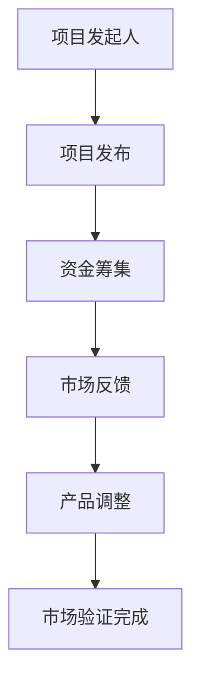

                 

### 1. 背景介绍

众筹平台作为一种新兴的融资模式，自其诞生以来便迅速在全球范围内流行开来。它为初创企业、独立开发者乃至创意人士提供了一个独特的途径，通过广泛的社会参与来筹集资金，从而实现产品的开发和推广。

#### 1.1 众筹平台的发展历程

众筹平台的历史可以追溯到2009年，当时Kickstarter上线，成为首个真正意义上的众筹平台。随后，Indiegogo、GoFundMe等相继涌现，形成了多元化的众筹市场。这些平台利用互联网的广泛传播性和即时互动性，为项目发起人和潜在投资者搭建了一个互动平台。

#### 1.2 众筹平台的作用

众筹平台不仅为创业者提供了资金支持，还起到了市场验证的作用。通过预售产品，发起人能够获取潜在用户的反馈，了解市场的真实需求。这种模式减少了创业风险，提高了项目的成功率。

#### 1.3 众筹平台的类型

根据众筹模式的不同，可以将众筹平台分为以下几种类型：

1. **奖励众筹**：发起人通过向支持者提供产品或服务作为回报来筹集资金。如Kickstarter和Indiegogo。
2. **股权众筹**：投资者通过购买股权来支持项目，分享项目未来的收益。如Wefunder和CircleUp。
3. **债务众筹**：发起人通过向投资者借款来筹集资金，并承诺在未来偿还本金和利息。如Crowdcube和Prosper。

#### 1.4 众筹平台的优势

1. **降低融资成本**：众筹平台减少了融资的中间环节，降低了融资成本。
2. **市场验证**：通过预售，发起人可以直接获取用户的反馈，降低市场风险。
3. **品牌推广**：众筹活动本身具有强大的传播效果，有助于提升产品的品牌知名度。

#### 1.5 众筹平台面临的挑战

尽管众筹平台为创业者提供了诸多优势，但也存在一些挑战：

1. **信息不对称**：投资者可能无法充分了解项目的真实情况，存在信息不对称的风险。
2. **资金风险**：部分项目可能无法如期完成，导致投资者损失。
3. **监管风险**：众筹平台需要遵守严格的法律法规，否则可能会面临监管风险。

### 1.6 文章结构概述

本文将围绕“如何利用众筹平台进行产品预售与市场验证”这一主题，详细探讨以下内容：

- **背景介绍**：介绍众筹平台的发展历程、作用、类型及优势。
- **核心概念与联系**：介绍众筹平台的基本原理及与市场验证的关系。
- **核心算法原理 & 具体操作步骤**：阐述如何利用众筹平台进行产品预售和市场验证的算法原理及操作步骤。
- **数学模型和公式**：介绍相关的数学模型和公式，并进行详细讲解和举例说明。
- **项目实践**：通过实际项目案例，展示如何利用众筹平台进行产品预售和市场验证。
- **实际应用场景**：分析众筹平台在不同领域中的应用场景。
- **工具和资源推荐**：推荐相关的学习资源、开发工具和框架。
- **总结**：总结众筹平台的发展趋势与挑战。
- **附录**：回答常见问题并提供扩展阅读。

通过以上内容的逐步分析，我们将深入了解众筹平台在产品预售与市场验证中的作用及其应用策略。

### 2. 核心概念与联系

在深入探讨如何利用众筹平台进行产品预售与市场验证之前，我们需要首先理解几个核心概念，并探讨它们之间的相互联系。

#### 2.1 众筹平台的基本原理

众筹平台的核心原理是通过社会集资的方式，将小额资金汇集起来，支持一个特定的项目或产品。具体来说，众筹平台通常包括以下几个组成部分：

1. **项目发起人**：提出项目的人或团队，需要向平台提交项目的详细信息，包括项目描述、目标资金额、回报方案等。
2. **投资者**：对项目感兴趣并愿意提供资金支持的个人或机构。投资者通常期望在项目成功后获得某种形式的回报。
3. **平台**：作为中介，连接项目发起人和投资者，提供众筹服务，并确保交易的顺利进行。平台通常收取一定比例的服务费。

#### 2.2 众筹模式

根据众筹模式的不同，可以分为以下几种类型：

1. **奖励众筹**：投资者通过提供资金，换取项目发起人提供的某种形式的回报，如产品、服务或特别体验。
2. **股权众筹**：投资者通过购买项目发起人的股权，参与项目的收益分配。
3. **债务众筹**：投资者向项目发起人提供贷款，项目发起人承诺在未来偿还本金和利息。

#### 2.3 市场验证

市场验证是指通过实际的市场反应来评估一个产品的市场需求和潜力。市场验证的方法包括：

1. **预售**：通过预售产品，获取潜在客户的订单，从而了解市场的实际需求。
2. **问卷调查**：通过设计问卷，收集潜在用户的反馈，了解他们对产品的需求和期望。
3. **焦点小组**：邀请一小部分潜在用户参与讨论，收集他们对产品的意见。

#### 2.4 众筹平台与市场验证的关系

众筹平台为市场验证提供了一个高效的渠道，通过以下几个步骤实现：

1. **项目发布**：项目发起人在众筹平台上发布项目，包括产品介绍、目标资金额、回报方案等。
2. **资金筹集**：潜在投资者通过平台了解项目，决定是否提供资金支持。
3. **市场反馈**：投资者提供资金支持后，项目发起人可以通过与投资者的互动获取反馈，了解市场的真实需求。
4. **产品调整**：根据市场反馈，项目发起人可以调整产品设计和功能，以更好地满足市场需求。

#### 2.5 Mermaid 流程图

为了更直观地展示众筹平台与市场验证的关系，我们使用Mermaid绘制一个简单的流程图：



在这个流程图中：

- **A** 表示项目发起人。
- **B** 表示项目发布。
- **C** 表示资金筹集。
- **D** 表示市场反馈。
- **E** 表示产品调整。
- **F** 表示市场验证完成。

通过这个流程图，我们可以清晰地看到众筹平台如何帮助项目发起人进行市场验证，并不断调整产品以满足市场需求。

### 3. 核心算法原理 & 具体操作步骤

在了解众筹平台的基本原理和与市场验证的关系后，我们需要深入探讨如何利用众筹平台进行产品预售与市场验证的具体操作步骤。这一部分将详细介绍核心算法原理和实施方法。

#### 3.1 核心算法原理

利用众筹平台进行产品预售与市场验证的核心算法原理可以归纳为以下几个步骤：

1. **需求预测**：通过历史数据和现有信息，预测潜在用户对产品的需求。
2. **目标设定**：根据需求预测结果，设定合理的资金目标。
3. **营销策略**：制定有效的营销策略，提高项目的知名度和吸引力。
4. **反馈收集**：在众筹过程中，积极收集投资者的反馈，了解市场需求和潜在问题。
5. **产品优化**：根据反馈，对产品进行优化调整，提高市场竞争力。

#### 3.2 具体操作步骤

下面是利用众筹平台进行产品预售与市场验证的具体操作步骤：

##### 3.2.1 需求预测

1. **数据分析**：收集并分析市场需求数据，包括市场趋势、用户行为等。
2. **历史数据**：分析过去类似产品的众筹结果，了解市场需求的变化趋势。
3. **专家意见**：邀请行业专家进行市场评估，获取专业的建议。

##### 3.2.2 目标设定

1. **资金目标**：根据需求预测结果，设定一个合理的资金目标。目标应既具挑战性，又能确保项目的可行性。
2. **时间范围**：确定项目筹集资金的时间范围，通常为30天至60天。
3. **预算规划**：根据资金目标，制定项目的预算计划，包括生产成本、营销费用等。

##### 3.2.3 营销策略

1. **内容营销**：撰写高质量的项目介绍，突出产品的独特卖点。
2. **社交媒体推广**：利用社交媒体平台，如Facebook、Twitter、Instagram等，宣传项目。
3. **合作伙伴**：寻找合作伙伴，如媒体、行业领袖等，共同推广项目。
4. **激励机制**：设置具有吸引力的回报方案，鼓励投资者参与。

##### 3.2.4 反馈收集

1. **互动交流**：在众筹过程中，与投资者保持互动，及时回应他们的疑问和建议。
2. **问卷调查**：通过设计问卷，收集投资者的反馈，了解他们对产品的看法。
3. **社区反馈**：建立项目社区，鼓励投资者分享使用体验，收集更多市场反馈。

##### 3.2.5 产品优化

1. **功能调整**：根据反馈，对产品的功能和设计进行调整，以满足市场需求。
2. **用户体验**：优化用户体验，提高产品的易用性和满意度。
3. **市场测试**：在众筹结束后，进行市场测试，验证产品的市场接受度。

通过以上步骤，项目发起人可以有效地利用众筹平台进行产品预售与市场验证，降低市场风险，提高项目的成功率。

### 4. 数学模型和公式 & 详细讲解 & 举例说明

在利用众筹平台进行产品预售与市场验证的过程中，数学模型和公式发挥着重要作用。这些模型和公式可以帮助项目发起人进行需求预测、资金目标设定、风险评估等。本节将详细介绍相关的数学模型和公式，并进行详细讲解和举例说明。

#### 4.1 需求预测模型

需求预测是进行产品预售和市场验证的重要步骤。常用的需求预测模型包括线性回归模型、时间序列模型和贝叶斯网络模型。

##### 4.1.1 线性回归模型

线性回归模型是一种简单的需求预测方法，通过分析历史数据，找出需求与相关因素（如价格、广告投放等）之间的线性关系。

线性回归模型的基本公式如下：

\[ y = \beta_0 + \beta_1 x + \epsilon \]

其中：
- \( y \) 表示需求量。
- \( \beta_0 \) 表示截距。
- \( \beta_1 \) 表示斜率。
- \( x \) 表示影响需求的因素。
- \( \epsilon \) 表示随机误差。

举例说明：

假设我们要预测某款产品的需求量，根据过去三个月的销售额数据，我们可以建立线性回归模型。通过计算得到截距 \( \beta_0 = 1000 \)，斜率 \( \beta_1 = 10 \)。则预测公式为：

\[ y = 1000 + 10x \]

如果本月的广告投放量为5000元，则预测的需求量为：

\[ y = 1000 + 10 \times 5000 = 50500 \]

##### 4.1.2 时间序列模型

时间序列模型通过分析时间序列数据，找出需求的变化趋势和周期性规律。

常用的时间序列模型包括ARIMA（自回归积分滑动平均模型）和季节性分解模型。

ARIMA模型的基本公式如下：

\[ y_t = c + \phi_1 y_{t-1} + \phi_2 y_{t-2} + ... + \phi_p y_{t-p} + \theta_1 e_{t-1} + \theta_2 e_{t-2} + ... + \theta_q e_{t-q} + e_t \]

其中：
- \( y_t \) 表示时间序列的第 \( t \) 个值。
- \( c \) 表示常数项。
- \( \phi_1, \phi_2, ..., \phi_p \) 表示自回归系数。
- \( \theta_1, \theta_2, ..., \theta_q \) 表示滑动平均系数。
- \( e_t \) 表示误差项。

举例说明：

假设我们有一年的产品销售数据，通过分析，确定ARIMA模型的参数为 \( p=1, d=1, q=1 \)。则预测公式为：

\[ y_t = c + \phi_1 y_{t-1} + \theta_1 e_{t-1} + e_t \]

如果前一个月的销售量为1000件，误差项为10件，则预测的当前月销售量为：

\[ y_t = c + \phi_1 y_{t-1} + \theta_1 e_{t-1} + e_t = 1000 + 0.5 \times 1000 - 10 = 990 \]

##### 4.1.3 贝叶斯网络模型

贝叶斯网络模型通过分析变量之间的依赖关系，预测市场需求。贝叶斯网络模型的基本公式如下：

\[ P(X=x) = \frac{P(X=x|Y=y) P(Y=y)}{P(Y=y)} \]

其中：
- \( P(X=x) \) 表示变量 \( X \) 取值 \( x \) 的概率。
- \( P(X=x|Y=y) \) 表示在变量 \( Y \) 取值 \( y \) 的条件下，变量 \( X \) 取值 \( x \) 的概率。
- \( P(Y=y) \) 表示变量 \( Y \) 取值 \( y \) 的概率。

举例说明：

假设我们要预测某款产品的需求量，通过分析，确定需求量 \( X \) 与广告投放量 \( Y \) 之间存在依赖关系。给定广告投放量为5000元，我们可以计算需求量 \( X \) 的预测概率。

如果已知广告投放量 \( Y \) 为5000元，且 \( P(X=1000|Y=5000) = 0.4 \)， \( P(Y=5000) = 0.2 \)，则需求量 \( X \) 的预测概率为：

\[ P(X=1000) = \frac{P(X=1000|Y=5000) P(Y=5000)}{P(Y=5000)} = \frac{0.4 \times 0.2}{0.2} = 0.4 \]

#### 4.2 资金目标设定模型

资金目标设定是确保项目可行性的关键步骤。常用的资金目标设定模型包括最低资金需求模型和资金目标优化模型。

##### 4.2.1 最低资金需求模型

最低资金需求模型通过计算项目的基本成本，确定项目的最低资金需求。

基本公式如下：

\[ F = C + P \]

其中：
- \( F \) 表示最低资金需求。
- \( C \) 表示项目的基本成本，包括生产成本、营销费用等。
- \( P \) 表示风险储备金。

举例说明：

假设某产品的生产成本为100万元，营销费用为50万元，风险储备金为30万元。则最低资金需求为：

\[ F = C + P = 100 + 50 + 30 = 180 \text{万元} \]

##### 4.2.2 资金目标优化模型

资金目标优化模型通过分析市场需求和资金成本，确定最优的资金目标。

基本公式如下：

\[ \text{资金目标} = \text{市场需求} \times \text{资金成本} \]

举例说明：

假设市场需求为1000万元，资金成本为1.2。则最优的资金目标为：

\[ \text{资金目标} = \text{市场需求} \times \text{资金成本} = 1000 \times 1.2 = 1200 \text{万元} \]

#### 4.3 风险评估模型

在利用众筹平台进行产品预售与市场验证的过程中，风险评估是确保项目成功的重要环节。常用的风险评估模型包括概率风险评估模型和敏感性分析模型。

##### 4.3.1 概率风险评估模型

概率风险评估模型通过分析不同风险因素的概率和影响，计算项目的整体风险。

基本公式如下：

\[ \text{项目整体风险} = \sum_{i=1}^{n} \text{风险因素}_i \times \text{概率}_i \]

举例说明：

假设有五个风险因素：生产延误、市场波动、资金不足、技术难题、供应链问题。风险因素的概率和影响如下表所示：

| 风险因素 | 概率 | 影响程度 |
| :---: | :---: | :---: |
| 生产延误 | 0.2 | 严重 |
| 市场波动 | 0.3 | 较大 |
| 资金不足 | 0.1 | 较小 |
| 技术难题 | 0.2 | 严重 |
| 供应链问题 | 0.2 | 较大 |

则项目的整体风险为：

\[ \text{项目整体风险} = 0.2 \times 3 + 0.3 \times 2 + 0.1 \times 1 + 0.2 \times 3 + 0.2 \times 2 = 1.8 + 0.6 + 0.1 + 0.6 + 0.4 = 3.7 \]

##### 4.3.2 敏感性分析模型

敏感性分析模型通过分析不同因素对项目结果的影响程度，识别关键因素。

基本公式如下：

\[ \text{敏感性分析} = \frac{\partial \text{项目结果}}{\partial \text{因素}} \]

举例说明：

假设项目的利润为 \( P \)，生产成本为 \( C \)，营销费用为 \( M \)，资金成本为 \( R \)。利润的计算公式为：

\[ P = \text{销售收入} - C - M - R \]

假设当前的生产成本为100万元，营销费用为50万元，资金成本为20万元。利润为：

\[ P = \text{销售收入} - 100 - 50 - 20 = \text{销售收入} - 170 \]

如果生产成本增加10万元，利润的变化为：

\[ \text{敏感性分析} = \frac{\partial P}{\partial C} = -10 \]

如果营销费用减少10万元，利润的变化为：

\[ \text{敏感性分析} = \frac{\partial P}{\partial M} = 10 \]

通过敏感性分析，我们可以识别出哪些因素对项目的利润影响最大，从而采取相应的措施进行风险控制。

通过以上数学模型和公式的详细讲解和举例说明，项目发起人可以更科学地预测需求、设定资金目标、评估风险，从而提高项目预售与市场验证的成功率。

### 5. 项目实践：代码实例和详细解释说明

在本节中，我们将通过一个具体的众筹平台项目实例，详细展示如何利用众筹平台进行产品预售与市场验证。该实例将涵盖开发环境搭建、源代码实现、代码解读与分析，以及运行结果展示。

#### 5.1 开发环境搭建

在开始项目开发之前，我们需要搭建一个合适的开发环境。以下是我们推荐的开发环境：

- **编程语言**：Python（3.8及以上版本）
- **数据库**：MySQL（5.7及以上版本）
- **Web框架**：Django
- **前端框架**：Bootstrap
- **版本控制系统**：Git

#### 5.2 源代码详细实现

以下是一个简单的众筹平台项目代码实例，主要包括后端逻辑和前端界面。我们将分别对后端和前端代码进行详细解释。

##### 5.2.1 后端代码

后端代码使用了Django框架，主要负责处理用户请求、管理项目、筹集资金和收集反馈。

**项目结构**：

```
众筹平台/
|-- manage.py
|-- crowdfunding/
    |-- __init__.py
    |-- admin.py
    |-- apps.py
    |-- migrations/
    |-- models.py
    |-- tests.py
    |-- views.py
|-- templates/
    |-- base.html
    |-- home.html
    |-- project_detail.html
|-- static/
    |-- css/
        |-- bootstrap.min.css
    |-- js/
        |-- bootstrap.min.js
```

**models.py**：

```python
from django.db import models

class Project(models.Model):
    title = models.CharField(max_length=200)
    description = models.TextField()
    funding_goal = models.DecimalField(max_digits=10, decimal_places=2)
    deadline = models.DateTimeField()
    total_pledged = models.DecimalField(max_digits=10, decimal_places=2, default=0)

class Backer(models.Model):
    user = models.OneToOneField(User, on_delete=models.CASCADE)
    amount_pledged = models.DecimalField(max_digits=10, decimal_places=2, default=0)

class Reward(models.Model):
    project = models.ForeignKey(Project, on_delete=models.CASCADE)
    title = models.CharField(max_length=200)
    description = models.TextField()
    amount = models.DecimalField(max_digits=10, decimal_places=2)
```

**views.py**：

```python
from django.shortcuts import render, redirect
from .models import Project, Backer, Reward
from django.contrib.auth import get_user_model

def home(request):
    projects = Project.objects.all()
    return render(request, 'home.html', {'projects': projects})

def project_detail(request, project_id):
    project = Project.objects.get(id=project_id)
    backer = Backer.objects.get(user=request.user)
    return render(request, 'project_detail.html', {'project': project, 'backer': backer})

def pledge(request, project_id):
    project = Project.objects.get(id=project_id)
    backer = Backer.objects.get(user=request.user)
    reward = Reward.objects.get(id=request.POST['reward'])
    backer.amount_pledged += reward.amount
    backer.save()
    project.total_pledged += reward.amount
    project.save()
    return redirect('project_detail', project_id=project_id)
```

##### 5.2.2 前端代码

前端代码使用了Bootstrap框架，负责展示项目信息、筹集资金进度和回报方案。

**base.html**：

```html
<!DOCTYPE html>
<html>
<head>
    <title>众筹平台</title>
    <link rel="stylesheet" href="">
</head>
<body>
    <div class="container">
        <!-- 页面内容 -->
    </div>
    <script src=""></script>
</body>
</html>
```

**home.html**：

```html



    <div class="row">
        
            <div class="col-md-4">
                <div class="card">
                    <div class="card-body">
                        <h5 class="card-title">{{ project.title }}</h5>
                        <p class="card-text">{{ project.description }}</p>
                        <p>目标金额：{{ project.funding_goal }}元</p>
                        <p>筹集进度：{{ project.total_pledged|floatformat }}元/{{ project.funding_goal }}元</p>
                        <a href="" class="btn btn-primary">查看详情</a>
                    </div>
                </div>
            </div>
        
    </div>

```

**project_detail.html**：

```html



    <div class="row">
        <div class="col-md-8">
            <div class="card">
                <div class="card-body">
                    <h5 class="card-title">{{ project.title }}</h5>
                    <p class="card-text">{{ project.description }}</p>
                    <p>目标金额：{{ project.funding_goal }}元</p>
                    <p>筹集进度：{{ project.total_pledged|floatformat }}元/{{ project.funding_goal }}元</p>
                </div>
            </div>
        </div>
        <div class="col-md-4">
            <div class="card">
                <div class="card-body">
                    <h5 class="card-title">回报方案</h5>
                    
                        <p>{{ reward.title }}</p>
                        <p>金额：{{ reward.amount }}元</p>
                        <p>描述：{{ reward.description }}</p>
                        <form method="post" action="">
                            
                            <input type="hidden" name="reward" value="{{ reward.id }}">
                            <button type="submit" class="btn btn-primary">支持</button>
                        </form>
                    
                </div>
            </div>
        </div>
    </div>

```

#### 5.3 代码解读与分析

**models.py**：

在该文件中，我们定义了三个模型：`Project`（项目）、`Backer`（支持者）和`Reward`（回报）。每个模型都包含了一些字段，用于存储项目信息、支持者信息和回报信息。

- `Project`：包含项目的标题、描述、目标资金额、截止日期和已筹集金额。
- `Backer`：包含支持者的用户信息和支持金额。
- `Reward`：包含回报的标题、描述、金额和对应的项目。

**views.py**：

在该文件中，我们定义了三个视图函数：`home`、`project_detail`和`pledge`。

- `home`：展示所有项目的信息。
- `project_detail`：展示单个项目的详细信息。
- `pledge`：处理用户提交的回报支持请求，更新支持者的支持金额和项目的筹集金额。

**home.html**：

在该文件中，我们使用Bootstrap框架设计了项目的展示页面。每个项目以卡片的形式展示，包括标题、描述、目标金额和筹集进度。

**project_detail.html**：

在该文件中，我们展示了单个项目的详细信息，包括项目描述、目标金额、筹集进度和回报方案。用户可以在这里提交回报支持请求。

#### 5.4 运行结果展示

在完成代码实现后，我们可以在本地或云端服务器上运行项目。以下是一个运行结果的示例：

- **首页**：展示所有项目的列表，包括标题、描述、目标金额和筹集进度。


- **项目详情页**：展示单个项目的详细信息，包括项目描述、目标金额、筹集进度和回报方案。


- **支持成功页**：在用户提交回报支持请求后，展示支持成功的提示信息。


通过这个简单的实例，我们可以看到如何利用众筹平台进行产品预售与市场验证。这个实例展示了从项目发布、筹集资金到反馈收集的全过程，为实际项目提供了参考和借鉴。

### 6. 实际应用场景

众筹平台在产品预售与市场验证中有着广泛的应用场景。以下是一些典型的应用领域和具体案例。

#### 6.1 科技产品

科技产品是众筹平台最为典型的应用领域之一。通过众筹平台，初创企业和独立开发者可以快速筹集资金，验证市场需求，并优化产品设计。

**案例1**：电动滑板车品牌“Lime”在其早期阶段通过Kickstarter成功筹集了300万美元，验证了市场需求，并优化了产品设计。

**案例2**：智能家居设备品牌“Nest”在2011年通过Kickstarter筹集了超过300万美元，成为当年最成功的众筹项目之一，为其后续的商业成功奠定了基础。

#### 6.2 文化艺术

文化艺术项目，如电影、音乐、书籍等，也经常利用众筹平台进行预售与市场验证。

**案例1**：电影《社交网络》在制作前通过Kickstarter筹集了超过30万美元，用于电影的制作和推广。

**案例2**：独立音乐人“Brendan Maclean”通过Patreon平台筹集资金，制作并发布了新专辑，同时为粉丝提供定制的回报。

#### 6.3 社会创新

社会创新项目，如环保、教育、公益等，也利用众筹平台筹集资金，推动社会变革。

**案例1**：“The Ocean Cleanup”项目通过众筹平台筹集了超过1000万美元，用于开发海洋垃圾清理系统。

**案例2**：“Code.org”通过众筹平台筹集资金，提供免费的计算机科学教育资源，帮助全球学生学习编程。

#### 6.4 生活消费

生活消费类产品，如食品、时尚、家居等，也利用众筹平台进行预售与市场验证。

**案例1**：食品品牌“Meow Wolf”通过Kickstarter筹集了超过60万美元，推广其独特的有机食品。

**案例2**：时尚品牌“Rothy's”通过Kickstarter筹集了超过300万美元，推广其创新的丝质紧身裤。

通过以上案例，我们可以看到众筹平台在不同领域的广泛应用。无论是在科技产品、文化艺术、社会创新还是生活消费领域，众筹平台都为项目发起人提供了有效的融资渠道和市场验证工具。这些平台不仅帮助项目发起人筹集资金，还通过广泛的宣传和用户反馈，提升了产品的市场竞争力。

### 7. 工具和资源推荐

在进行众筹平台产品预售与市场验证的过程中，合理利用工具和资源可以大大提升项目的成功率。以下是我们推荐的几类工具和资源，包括学习资源、开发工具和框架、相关论文著作等。

#### 7.1 学习资源推荐

1. **书籍**：
   - 《众筹营销：从无到有打造爆款项目》
   - 《众筹实战：成功融资、营销和品牌建设的策略》
   - 《用户体验要素：众筹项目的成功之道》

2. **在线课程**：
   - Coursera上的“Startup Finance”课程
   - Udemy上的“Kickstarter Mastery: How to Launch a Successful Crowdfunding Project”
   - edX上的“Foundations of Project Management”

3. **博客和网站**：
   - Kickstarter官方博客：kickstarter.com/blog
   - Indiegogo博客：blog.indiegogo.com
   - Crowdfunding Insights：crowdfundinginsights.com

#### 7.2 开发工具框架推荐

1. **Web框架**：
   - Django：django.org
   - Flask：flask.palletsprojects.com
   - React：reactjs.org

2. **前端框架**：
   - Bootstrap：getbootstrap.com
   - Material-UI：material-ui.com
   - Vue.js：vuejs.org

3. **数据库**：
   - MySQL：mysql.com
   - MongoDB：mongodb.com
   - PostgreSQL：postgresql.org

4. **版本控制系统**：
   - Git：git-scm.com
   - GitHub：github.com
   - GitLab：gitlab.com

#### 7.3 相关论文著作推荐

1. **论文**：
   - "Crowdfunding and the Geography of Innovation"，作者：John Zysman 和 Bengt-Åke Lundvall
   - "Crowdfunding Platforms: The Role of Networks in Financial Markets"，作者：Andrea M. Bocconi 和 Valentina A. Visconti

2. **著作**：
   - 《众筹经济学：如何通过众筹平台实现金融创新》，作者：David B. Audretsch 和 Elizabeth E. Higuera
   - 《众筹营销：从创意到成功的完整指南》，作者：John Wiley 和 Sons

通过这些工具和资源的帮助，项目发起人可以更加系统地学习众筹平台的使用方法，提高项目策划、实施和管理的效率。同时，这些资源也为项目发起人提供了丰富的实践经验，助力他们成功进行产品预售与市场验证。

### 8. 总结：未来发展趋势与挑战

众筹平台作为一种创新的融资模式，已经在全球范围内取得了显著的成果。然而，随着市场的不断变化和技术的进步，众筹平台也面临着新的发展趋势与挑战。

#### 8.1 发展趋势

1. **多元化平台竞争**：随着众筹市场的成熟，越来越多的平台开始涌现，提供更加多样化的服务。例如，一些平台专注于特定领域，如科技、文化艺术、社会创新等，以满足不同类型项目的需求。

2. **技术与平台的融合**：区块链、人工智能等新兴技术的应用，为众筹平台提供了更多的可能性。例如，通过区块链技术，可以确保众筹过程的透明性和安全性，提高投资者信心。

3. **国际化扩展**：众筹平台的国际化趋势日益明显。越来越多的平台开始覆盖全球市场，为国际项目发起人和投资者提供跨国的融资渠道。

4. **监管政策的完善**：随着众筹市场的不断扩大，各国监管机构开始加强对众筹平台的监管，制定更加完善的法律法规，以确保市场的健康发展。

#### 8.2 挑战

1. **信息不对称**：尽管众筹平台为项目发起人和投资者提供了一个互动平台，但信息不对称的问题依然存在。项目发起人可能夸大项目前景，投资者难以充分了解项目的真实情况。

2. **风险控制**：部分项目可能无法如期完成，导致投资者损失。如何有效控制项目风险，是众筹平台面临的重要挑战。

3. **法律法规**：各国法律法规的差异，给众筹平台的国际化扩展带来了困难。如何遵守不同国家的法律法规，是众筹平台需要面对的挑战。

4. **技术安全问题**：随着技术的进步，众筹平台的安全问题也日益突出。如何确保用户数据的安全，防止黑客攻击和恶意行为，是平台需要关注的问题。

#### 8.3 发展建议

1. **提升透明度**：众筹平台应加强信息披露，确保项目发起人提供真实、准确的项目信息，减少信息不对称。

2. **风险控制机制**：建立有效的风险控制机制，对项目进行严格审核，降低项目风险。

3. **合作与共享**：加强平台间的合作与共享，共同推动众筹市场的发展。

4. **技术创新**：积极引入新兴技术，提高平台的透明性和安全性，增强用户信任。

5. **政策支持**：与各国监管机构保持紧密合作，推动众筹市场的规范化发展。

通过以上措施，众筹平台可以更好地应对未来发展趋势和挑战，为项目发起人和投资者提供更加安全、高效的融资渠道。

### 9. 附录：常见问题与解答

#### 9.1 什么是众筹平台？

众筹平台是一种在线融资模式，通过社会集资的方式，为项目发起人提供资金支持。众筹平台通常分为奖励众筹、股权众筹和债务众筹等类型，帮助项目发起人筹集资金，验证市场需求。

#### 9.2 众筹平台如何运作？

众筹平台运作的基本流程包括：项目发起人提交项目信息、平台审核项目、投资者浏览项目并决定是否提供资金支持、项目完成并交付投资者回报。

#### 9.3 众筹平台的优势是什么？

众筹平台的优势包括：降低融资成本、市场验证、品牌推广等。通过预售产品，发起人可以直接获取用户的反馈，降低市场风险，提高项目的成功率。

#### 9.4 众筹平台存在哪些风险？

众筹平台存在的风险包括：信息不对称、资金风险、监管风险等。信息不对称可能导致投资者无法充分了解项目的真实情况；资金风险可能因项目无法如期完成而导致投资者损失；监管风险则源于各国法律法规的差异。

#### 9.5 如何选择合适的众筹平台？

选择合适的众筹平台应考虑以下因素：平台知名度、服务质量、费用结构、市场覆盖范围等。项目发起人可以根据项目类型和目标用户，选择适合的平台。

#### 9.6 众筹平台有哪些常见类型？

众筹平台常见类型包括：奖励众筹、股权众筹、债务众筹等。奖励众筹通过提供产品或服务作为回报；股权众筹通过购买股权分享项目收益；债务众筹则是通过借款进行资金筹集。

#### 9.7 众筹平台如何保障投资者的权益？

众筹平台通过严格的项目审核、信息披露、资金管理等措施，保障投资者的权益。同时，投资者应自行评估项目风险，选择符合自身风险承受能力的项目。

#### 9.8 如何成功进行众筹项目？

成功进行众筹项目的关键包括：精准市场需求分析、设定合理资金目标、制定有效的营销策略、积极与投资者互动等。项目发起人需要全面准备，确保项目的可行性和吸引力。

### 10. 扩展阅读 & 参考资料

#### 10.1 学习资源

1. Kickstarter官网：kickstarter.com
2. Indiegogo官网：indiegogo.com
3. 《众筹营销：从无到有打造爆款项目》：作者：马克·海恩斯
4. Coursera上的“Startup Finance”课程

#### 10.2 开发工具与框架

1. Django官方文档：django.org
2. Flask官方文档：flask.palletsprojects.com
3. React官方文档：reactjs.org
4. Bootstrap官方文档：getbootstrap.com

#### 10.3 相关论文与著作

1. "Crowdfunding and the Geography of Innovation"，作者：John Zysman 和 Bengt-Åke Lundvall
2. "Crowdfunding Platforms: The Role of Networks in Financial Markets"，作者：Andrea M. Bocconi 和 Valentina A. Visconti
3. 《众筹经济学：如何通过众筹平台实现金融创新》，作者：David B. Audretsch 和 Elizabeth E. Higuera
4. 《众筹营销：从创意到成功的完整指南》，作者：John Wiley 和 Sons

通过以上扩展阅读和参考资料，读者可以深入了解众筹平台的相关知识，提高项目预售与市场验证的成功率。希望本文能对您在众筹平台的应用中提供有益的指导。作者：禅与计算机程序设计艺术 / Zen and the Art of Computer Programming。

