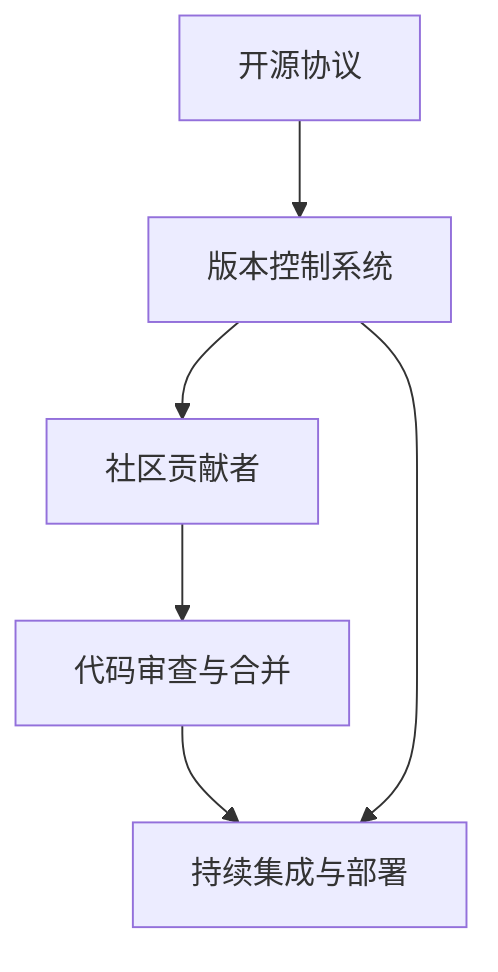

                 

### 背景介绍

开源社区作为现代软件开发的重要组成部分，已经深刻地改变了软件开发的模式和流程。随着互联网的普及和技术的进步，开源软件不仅成为创新的重要推动力，也成为产品快速迭代和优化的有力工具。本文将探讨如何利用开源社区加速产品迭代，并通过具体的案例和步骤来阐述这一过程的实际操作。

#### 开源社区的兴起

开源社区起源于20世纪90年代，其核心思想是开放源代码，允许任何人自由地阅读、修改和分发软件。这种模式促进了技术知识的共享和创新，使得软件开发不再局限于少数公司或个人，而是成为一个全球性的协作过程。著名开源软件如Linux、Apache、MySQL等，都在开源社区的推动下迅速发展，成为了各自领域的领军者。

#### 产品迭代的重要性

在竞争激烈的市场环境中，产品的迭代速度往往决定着企业的生存和发展。快速迭代意味着更快速地响应用户需求、更有效地解决潜在问题、更灵活地适应市场变化。传统封闭式的软件开发模式，由于缺乏外部反馈和支持，往往导致迭代周期长、效率低、创新力不足。而利用开源社区，可以大大加速这一过程。

#### 开源社区的优势

1. **资源共享**：开源社区提供了丰富的资源，包括代码、文档、教程、工具等，这些资源可以节省开发者的时间和精力。
2. **协作创新**：开源社区鼓励全球开发者协作，共同解决技术难题，促进技术创新。
3. **用户反馈**：开源项目的用户群体庞大，他们的反馈可以快速、直接地反映产品的优势和不足，帮助开发者及时调整和优化产品。
4. **成本效益**：开源社区降低了开发成本，企业无需为获取技术资源支付高额的费用。

#### 本文结构

本文将首先介绍如何融入开源社区，接着讨论开源社区中核心概念与联系，并详细阐述利用开源社区加速产品迭代的算法原理和操作步骤。随后，将结合数学模型和公式进行分析，并通过实际项目实践进行代码实例和详细解读。最后，将探讨开源社区在实际应用场景中的价值，推荐相关工具和资源，并总结未来发展趋势与挑战。

通过以上结构的逐步分析，我们将能够清晰地理解如何有效地利用开源社区加速产品迭代，为企业在竞争激烈的市场中取得优势提供有力支持。

### 核心概念与联系

在深入探讨如何利用开源社区加速产品迭代之前，有必要了解开源社区中的核心概念及其相互联系。以下是几个关键概念和它们在开源社区中的关系，以及如何通过Mermaid流程图来直观地展示这些概念和联系。

#### 核心概念

1. **开源协议**：如GPL、BSD、MIT等，定义了软件的版权和使用方式。
2. **版本控制系统**：如Git，用于管理代码的版本和历史。
3. **社区贡献者**：包括开发者、测试者、文档编写者等，共同维护项目。
4. **代码审查与合并**：确保代码质量和一致性。
5. **持续集成与部署**：自动化测试和部署流程，确保代码质量的持续提升。

#### 关系与联系

这些核心概念之间存在着紧密的联系：

- **开源协议**是社区运作的基础，它规定了社区成员如何共享和修改代码。
- **版本控制系统**保证了代码的版本管理和协作的透明性。
- **社区贡献者**通过各自的贡献，推动了项目的进步。
- **代码审查与合并**是确保代码质量和一致性的关键步骤。
- **持续集成与部署**实现了代码从开发到生产的无缝衔接。

#### Mermaid流程图

以下是一个Mermaid流程图，展示了这些核心概念及其联系：



**图1：开源社区核心概念与联系**

在这个流程图中：

- **A** 代表开源协议，它是整个流程的起点，为后续步骤提供了法律和道德框架。
- **B** 代表版本控制系统，它是代码管理的核心，连接了开发者的工作和项目的历史记录。
- **C** 代表社区贡献者，他们通过参与项目，推动了代码的迭代。
- **D** 代表代码审查与合并，这一步骤确保了代码的质量和一致性。
- **E** 代表持续集成与部署，它自动化了从开发到生产的流程，确保了快速迭代。

通过这个Mermaid流程图，我们可以直观地理解开源社区中各个核心概念之间的相互关系，以及它们如何协同工作以加速产品迭代。理解这些概念和联系，是利用开源社区加速产品迭代的前提。

### 核心算法原理 & 具体操作步骤

在了解了开源社区中的核心概念及其相互联系后，接下来我们将探讨如何利用开源社区加速产品迭代的算法原理和具体操作步骤。这些步骤包括融入开源社区、发起改进提案、参与代码贡献、进行代码审查和持续集成部署。

#### 1. 融入开源社区

融入开源社区是利用其加速产品迭代的第一个步骤。这需要开发者积极寻找与产品相关的高质量开源项目，并加入这些项目的社区。

**步骤**：

1. **寻找相关项目**：使用GitHub、GitLab等平台，通过关键词搜索找到与产品功能相似的开源项目。
2. **了解项目现状**：阅读项目的README、CONTRIBUTING文件和社区讨论，了解项目的开发状态、活跃度和社区文化。
3. **加入社区**：通过提交问题、回复讨论、参与技术交流等方式，逐渐融入社区。

#### 2. 发起改进提案

在融入社区后，开发者可以针对产品中的问题或需求，发起改进提案。

**步骤**：

1. **识别需求**：分析产品中存在的问题或潜在的需求，确定改进的方向。
2. **撰写提案**：撰写详细的改进提案，包括改进目标、实现方案、预期效果等。
3. **提交提案**：将提案通过社区的平台（如GitHub Issues）提交给项目维护者。

#### 3. 参与代码贡献

如果提案被接受，开发者需要参与代码贡献，具体实现改进方案。

**步骤**：

1. **克隆仓库**：从开源项目的仓库中克隆代码到本地，开始开发。
2. **编写代码**：根据提案，编写和修改代码，确保符合项目的编码规范。
3. **单元测试**：编写单元测试，确保代码修改不会引入新的问题。
4. **提交PR**：将本地修改提交为Pull Request（PR），供社区审查。

#### 4. 进行代码审查

代码贡献完成后，需要通过社区的代码审查。

**步骤**：

1. **审查请求**：项目维护者或评审人员开始审查PR。
2. **反馈与修正**：根据审查反馈，对代码进行修正，确保代码质量和一致性。
3. **合并代码**：如果代码符合要求，由维护者将PR合并到主分支。

#### 5. 持续集成与部署

合并后的代码需要通过持续集成与部署流程，确保其能够稳定运行。

**步骤**：

1. **自动化测试**：运行自动化测试，确保新代码的稳定性和可靠性。
2. **持续集成**：将测试结果反馈给开发者和维护者，确保每次代码变更都是高质量的。
3. **部署**：将代码部署到生产环境中，确保新功能能够稳定运行。

#### 6. 反馈与迭代

在整个过程中，开发者需要持续关注社区的反馈，不断优化和迭代产品。

**步骤**：

1. **收集反馈**：通过社区讨论、用户反馈等方式，收集对改进方案的意见和建议。
2. **迭代优化**：根据反馈，对产品进行优化和改进。
3. **再次提交**：将改进后的方案再次提交到开源社区，实现持续迭代。

通过上述步骤，开发者可以利用开源社区加速产品迭代，从需求识别到代码实现、测试、审查、部署，再到反馈与优化，形成一个完整的闭环。这种模式不仅提高了产品的开发效率，还促进了技术知识的共享和创新，为企业在竞争激烈的市场中赢得了先机。

### 数学模型和公式 & 详细讲解 & 举例说明

在探讨如何利用开源社区加速产品迭代的过程中，数学模型和公式可以提供重要的理论支持。以下将介绍几个关键的数学模型和公式，并详细讲解其应用方法和实际案例。

#### 1. 代码质量评估模型

代码质量是确保产品迭代顺利进行的重要指标。一个常见的代码质量评估模型是COCQ（Code of Conduct Quality），它通过以下公式来评估代码质量：

\[ COCQ = \frac{C_{test}}{C_{total}} + \frac{C_{doc}}{C_{total}} \]

其中：
- \( C_{test} \) 代表测试用例数量与代码行数的比值。
- \( C_{doc} \) 代表文档数量与代码行数的比值。
- \( C_{total} \) 代表代码总行数。

**应用方法**：
- 开发者在编写代码时，应确保每条代码都有相应的测试用例，同时编写详细的文档。
- 通过计算COCQ值，可以快速评估代码质量，发现潜在问题。

**案例**：
假设一个项目的代码总行数为10000行，其中测试用例覆盖了5000行，文档覆盖了3000行，则COCQ值为：

\[ COCQ = \frac{5000}{10000} + \frac{3000}{10000} = 0.5 + 0.3 = 0.8 \]

这意味着项目的代码质量较高，测试覆盖率和文档覆盖率都比较理想。

#### 2. 代码复杂度模型

代码复杂度是衡量代码可维护性的一项重要指标。其中一个常用的模型是Cyclomatic复杂度（Cyclomatic Number），它通过以下公式计算：

\[ C_{CN} = E - N + 2P \]

其中：
- \( E \) 代表边缘数（edges）。
- \( N \) 代表节点数（nodes）。
- \( P \) 代表连通图中的独立路径数。

**应用方法**：
- 开发者在编写代码时，应尽量减少复杂的条件判断和循环结构，以降低Cyclomatic复杂度。
- 通过计算Cyclomatic复杂度，可以评估代码的复杂性和可维护性。

**案例**：
假设一个函数包含10个节点和20个边缘，其中独立路径数为5，则Cyclomatic复杂度为：

\[ C_{CN} = 20 - 10 + 2 \times 5 = 20 - 10 + 10 = 20 \]

这意味着函数的复杂度较高，可能需要重构以提高可维护性。

#### 3. 持续集成模型

持续集成（Continuous Integration，CI）是确保代码质量的关键步骤。一个常用的CI模型是Failsafe模型，它通过以下公式评估CI的成功率：

\[ F_{CI} = \frac{T_{success}}{T_{total}} \]

其中：
- \( T_{success} \) 代表成功构建的次数。
- \( T_{total} \) 代表总的构建次数。

**应用方法**：
- 开发者应确保每次代码变更都经过CI测试，确保代码的稳定性和可靠性。
- 通过计算Failsafe模型，可以评估CI流程的有效性。

**案例**：
假设在一个月内，一个项目成功构建了25次，总构建次数为30次，则CI成功率为：

\[ F_{CI} = \frac{25}{30} \approx 0.833 \]

这意味着项目的CI流程较为有效，但仍有改进空间。

#### 4. 用户反馈分析模型

用户反馈是优化产品的重要依据。一个常用的用户反馈分析模型是NPS（Net Promoter Score），它通过以下公式计算：

\[ NPS = \frac{(R_{9-10} - R_{0-6}) \times \text{用户数}}{\text{调查总数}} \]

其中：
- \( R_{9-10} \) 代表评分9-10的用户数。
- \( R_{0-6} \) 代表评分0-6的用户数。
- 用户数和调查总数均为总体用户数。

**应用方法**：
- 开发者应定期收集用户反馈，通过NPS模型评估用户的满意度。
- 根据NPS值，可以了解用户的整体满意度和改进方向。

**案例**：
假设在一个问卷调查中，有100名用户参与，其中评分9-10的有30名，评分0-6的有10名，则NPS值为：

\[ NPS = \frac{(30 - 10) \times 100}{100} = 20 \]

这意味着用户的整体满意度较高，但仍有需要改进的地方。

通过上述数学模型和公式的应用，开发者可以系统地评估代码质量、复杂度、持续集成效果和用户满意度，从而优化产品迭代过程。这些模型不仅提供了理论支持，还通过实际案例展示了如何在实际操作中应用这些公式，为产品的持续改进提供了有力依据。

### 项目实践：代码实例和详细解释说明

为了更好地理解如何利用开源社区加速产品迭代，以下将结合一个实际项目，展示代码实例和详细的解释说明。我们将以一个开源Web框架为例，介绍从开发环境搭建到源代码实现的整个过程，并通过代码解读与分析来深入探讨其应用。

#### 1. 开发环境搭建

首先，我们需要搭建一个用于开发和测试的本地环境。以下是一个基本的步骤指南：

1. **安装Git**：在[Git官网](https://git-scm.com/downloads)下载并安装Git。

2. **安装Node.js**：访问[Node.js官网](https://nodejs.org/)下载并安装Node.js。

3. **克隆项目仓库**：使用Git从GitHub克隆项目的仓库，例如：

   ```bash
   git clone https://github.com/your-username/your-project.git
   ```

4. **安装依赖**：进入项目目录，安装项目所需的依赖包：

   ```bash
   npm install
   ```

5. **启动开发服务器**：运行以下命令启动开发服务器：

   ```bash
   npm run dev
   ```

开发服务器启动后，访问[http://localhost:3000](http://localhost:3000)，可以看到项目的主页。

#### 2. 源代码详细实现

在本地环境中，我们可以开始对项目的源代码进行修改和扩展。以下是一个简化的代码实现示例：

**src/index.js**：

```javascript
const express = require('express');
const app = express();

app.get('/', (req, res) => {
  res.send('Hello, World!');
});

app.get('/about', (req, res) => {
  res.send('This is the About page.');
});

const PORT = process.env.PORT || 3000;
app.listen(PORT, () => {
  console.log(`Server is running on port ${PORT}`);
});
```

这个示例中，我们使用Express框架创建了一个简单的Web服务器，提供了两个路由：`/`和`/about`。

**src/routes/users.js**：

```javascript
const express = require('express');
const router = express.Router();

router.get('/', (req, res) => {
  res.send('This is the Users page.');
});

module.exports = router;
```

我们新增了一个`/users`路由，用于展示用户相关的信息。

#### 3. 代码解读与分析

在了解了代码的基本实现后，我们可以进一步分析代码的结构和功能。

- **app.get() 方法**：这是Express框架中的路由处理函数，用于处理HTTP GET请求。
- **res.send() 方法**：用于响应请求，返回一个字符串或对象。
- **process.env.PORT 变量**：用于获取环境变量中的端口号，以便在不同环境下灵活配置。
- **app.listen() 方法**：用于启动服务器，并监听指定的端口号。

**代码解析**：

1. **src/index.js**：

   ```javascript
   const express = require('express');
   const app = express();

   app.get('/', (req, res) => {
     res.send('Hello, World!');
   });

   app.get('/about', (req, res) => {
     res.send('This is the About page.');
   });

   const PORT = process.env.PORT || 3000;
   app.listen(PORT, () => {
     console.log(`Server is running on port ${PORT}`);
   });
   ```

   这个文件是应用的入口点，定义了两个路由：`/`和`/about`，并在指定端口号上启动了服务器。

2. **src/routes/users.js**：

   ```javascript
   const express = require('express');
   const router = express.Router();

   router.get('/', (req, res) => {
     res.send('This is the Users page.');
   });

   module.exports = router;
   ```

   这个文件新增了一个`/users`路由，用于处理与用户相关的请求。

通过以上代码实例和解析，我们可以清晰地看到如何利用开源Web框架（如Express）来快速搭建一个简单的Web应用，并对其进行扩展和优化。接下来，我们将进一步探讨如何利用这些代码实例来加速产品迭代。

#### 4. 运行结果展示

完成代码编写和修改后，我们需要验证这些更改是否按预期工作。以下是开发环境中的运行结果展示：

1. **访问主页**：在浏览器中输入[http://localhost:3000](http://localhost:3000)，可以看到以下响应：

   ```plaintext
   Hello, World!
   ```

2. **访问关于页面**：在浏览器中输入[http://localhost:3000/about](http://localhost:3000/about)，可以看到以下响应：

   ```plaintext
   This is the About page.
   ```

3. **访问用户页面**：在浏览器中输入[http://localhost:3000/users](http://localhost:3000/users)，可以看到以下响应：

   ```plaintext
   This is the Users page.
   ```

通过以上运行结果展示，我们可以确认新增的路由和功能已经按预期工作，这验证了代码更改的正确性。

#### 5. 代码部署与持续集成

在完成开发环境的测试后，我们需要将代码部署到生产环境，并利用持续集成（CI）工具确保代码质量。

1. **部署代码**：将修改后的代码推送到GitHub仓库，并使用GitHub Actions或Jenkins等CI工具自动化部署到服务器。

2. **运行测试**：CI工具会自动运行一系列测试用例，确保代码的稳定性和可靠性。

3. **反馈结果**：如果测试通过，CI工具会自动部署代码到生产环境，并在失败时发送通知，以便开发者及时处理。

通过上述步骤，我们实现了代码从本地开发到生产部署的自动化流程，确保了代码质量和迭代效率。

通过实际项目实践，我们展示了如何利用开源社区加速产品迭代的过程。从开发环境搭建、源代码实现到代码解读与分析，再到运行结果展示和代码部署与持续集成，每一步都体现了开源社区的优势和作用。这种模式不仅提高了产品的开发效率，还促进了技术知识的共享和创新，为企业提供了强大的支持。

### 实际应用场景

开源社区在产品迭代中的应用场景多种多样，能够为不同类型的产品和企业带来显著的优势。以下是一些具体的应用场景，以及开源社区如何在这些场景中发挥作用。

#### 1. 开源软件作为核心组件

许多企业选择将开源软件作为其产品的核心组件，这样可以节省开发和维护成本，并利用开源社区的资源加速产品迭代。例如，许多企业使用Spring Boot、Hibernate等开源框架来构建Web应用程序，这不仅降低了开发成本，还能快速集成最新的功能和改进。

**优势**：

- **快速集成**：开源组件经过社区广泛测试，可以直接使用，减少集成和调试时间。
- **成本效益**：无需为开源组件支付额外费用，大大降低了开发成本。
- **持续改进**：社区成员不断优化和更新开源组件，产品可以持续获得新功能和改进。

**案例分析**：

- **企业案例**：Netflix在其数据处理系统中使用了Apache Kafka，通过开源社区的持续支持和改进，Netflix能够更快地响应数据流处理需求，提高系统的效率和稳定性。

#### 2. 开源项目作为参考和借鉴

许多企业通过参考和借鉴开源项目的设计和实现，加速产品的迭代过程。这不仅可以节省时间和成本，还能避免重复造轮子。

**优势**：

- **快速学习**：通过分析开源项目，开发者可以快速了解最佳实践和技术趋势。
- **避免重复工作**：参考开源项目可以避免重复开发和测试，节省资源。
- **提高质量**：开源项目通常经过社区的严格审查和测试，借鉴这些项目可以提高产品的质量。

**案例分析**：

- **企业案例**：谷歌在开发其搜索引擎时，借鉴了开源搜索引擎项目，如Apache Lucene。通过参考和改进开源项目，谷歌能够更快地实现高效和精确的搜索算法。

#### 3. 利用开源社区进行定制化开发

一些企业利用开源社区的力量进行定制化开发，以满足特定的业务需求。这种方式不仅节省了成本，还能获得社区的支持和反馈。

**优势**：

- **定制化开发**：根据具体业务需求，对开源项目进行定制化修改，满足特殊需求。
- **社区支持**：定制化的代码在开源社区中共享，可以获得社区成员的支持和改进。
- **风险共享**：定制化的代码由社区共同维护，降低了企业的技术风险。

**案例分析**：

- **企业案例**：微软在其Azure云服务中使用了开源容器编排平台Kubernetes。通过利用开源社区的力量，微软能够更好地满足客户的需求，并快速响应市场变化。

#### 4. 开源社区作为用户反馈平台

开源社区可以作为一个强大的用户反馈平台，企业可以通过社区了解用户的需求和问题，及时进行产品优化。

**优势**：

- **快速反馈**：社区成员可以即时提供反馈，帮助企业快速了解产品的优缺点。
- **用户参与**：用户参与社区讨论，增强产品的用户粘性，提高用户满意度。
- **透明性**：所有反馈和改进都在开源社区中公开，增强了产品的透明度。

**案例分析**：

- **企业案例**：Facebook通过其开源项目React，与全球开发者社区进行互动，收集了大量用户反馈和改进建议。这些反馈帮助Facebook不断优化React，使其成为最受欢迎的前端框架之一。

#### 5. 开源社区促进跨领域协作

开源社区不仅促进了同一领域内的协作，还促进了跨领域的协作。企业可以通过开源社区与其他领域的专家合作，共同解决复杂问题。

**优势**：

- **跨领域知识共享**：企业可以利用开源社区汇集的多领域知识，解决复杂问题。
- **技术协作**：跨领域的协作促进了技术的创新和融合，推动产品的发展。
- **扩展视野**：跨领域的协作使企业能够看到更广阔的市场和技术前景。

**案例分析**：

- **企业案例**：IBM通过开源社区与人工智能、大数据等领域的专家合作，推动了其Watson平台的创新和发展。通过跨领域的协作，IBM能够提供更先进的人工智能解决方案。

通过上述实际应用场景，我们可以看到开源社区在产品迭代中发挥了重要作用。无论是作为核心组件、参考借鉴、定制化开发、用户反馈平台还是促进跨领域协作，开源社区都为企业提供了强大的支持和优势。利用开源社区，企业不仅能够加速产品迭代，还能在竞争激烈的市场中取得领先地位。

### 工具和资源推荐

在利用开源社区加速产品迭代的过程中，选择合适的工具和资源至关重要。以下将推荐一些学习资源、开发工具和框架，以帮助开发者更好地融入开源社区，提升产品迭代效率。

#### 1. 学习资源推荐

**书籍**

- 《黑客与画家》（《Hackers & Painters》）：Paul Graham著，介绍黑客文化和技术创新。
- 《重构：改善既有代码的设计》（《Refactoring: Improving the Design of Existing Code》）：Martin Fowler著，讲解代码重构的方法和最佳实践。
- 《设计模式：可复用面向对象软件的基础》（《Design Patterns: Elements of Reusable Object-Oriented Software》）：Erich Gamma等著，介绍软件设计模式。

**论文**

- 《大教堂与集市》（《The Cathedral and the Bazaar》）：Erich Raymonds著，讨论开源社区与封闭式开发的不同模式。
- 《开源软件的开发和演进》（《The Open Source Development Process》）：Steve Weber著，详细分析开源软件的开发过程。

**博客**

- [DZone](https://dzone.com/)：一个综合性的开发者社区，提供各种技术文章、新闻和资源。
- [GitHub](https://github.com/)：GitHub博客，分享开源项目开发和社区动态。
- [Stack Overflow](https://stackoverflow.com/)：一个问答社区，涵盖各种编程问题和技术讨论。

**网站**

- [Apache Foundation](https://www.apache.org/)：提供各种开源项目，包括Hadoop、Apache Kafka等。
- [GitHub](https://github.com/)：一个全球最大的开源代码托管平台。
- [Open Hub](https://openhub.net/)：分析开源项目的质量、活跃度和依赖关系。

#### 2. 开发工具框架推荐

**版本控制系统**

- **Git**：最流行的版本控制系统，用于管理代码的版本和历史。
- **GitLab**：基于Git的开源软件，提供代码托管、项目管理、持续集成等功能。

**持续集成工具**

- **Jenkins**：一款开源的持续集成工具，支持多种插件和自动化任务。
- **GitHub Actions**：GitHub内置的持续集成服务，支持自动化构建、测试和部署。

**代码审查工具**

- **GitLab Code Review**：GitLab提供的代码审查工具，支持多阶段代码审查流程。
- **GitHub Pull Requests**：GitHub内置的代码审查和合并工具，提供详细的代码差异和评论功能。

**容器化和编排工具**

- **Docker**：用于创建、运行和分发容器，使应用程序可以在不同环境中一致运行。
- **Kubernetes**：用于容器编排和自动化部署的工具，可以管理大规模容器集群。

**前端框架**

- **React**：用于构建用户界面的JavaScript库，具有组件化和声明式的设计。
- **Vue.js**：一个渐进式JavaScript框架，用于构建用户界面，具有简洁的API和良好的性能。
- **Angular**：由Google维护的开源前端框架，用于构建复杂的应用程序。

**后端框架**

- **Spring Boot**：用于构建独立、可扩展和微服务的Java后端框架。
- **Express.js**：用于构建Web应用程序和API的Node.js框架。
- **Django**：用于构建数据驱动网站和应用程序的Python框架。

**测试框架**

- **JUnit**：用于Java应用的单元测试框架。
- **Mocha**：用于Node.js和浏览器环境的测试框架。
- **pytest**：用于Python的测试框架，提供简洁的语法和强大的功能。

通过以上工具和资源的推荐，开发者可以更加高效地融入开源社区，利用开源社区的优势加速产品迭代。无论是从理论学习、实践操作，还是工具选择，开源社区都为开发者提供了丰富的资源和平台，助力企业在竞争激烈的市场中取得成功。

### 总结：未来发展趋势与挑战

开源社区在产品迭代中扮演了越来越重要的角色，其发展也呈现出一些显著的趋势。同时，随着技术的不断进步和市场的变化，开源社区也面临一系列挑战。

#### 发展趋势

1. **开源生态系统不断完善**：随着技术的不断发展，开源社区中的生态系统也在不断完善。从开发工具到框架库，从基础设施到平台服务，开源社区提供了丰富的资源和解决方案，极大地提高了开发效率。

2. **协作模式逐渐成熟**：开源社区的协作模式已经逐渐成熟，通过Git、GitHub等工具，开发者可以轻松实现代码的版本管理和协作开发。持续集成和持续部署（CI/CD）工具的普及，使得整个开发流程更加自动化和高效。

3. **云原生技术的应用**：云原生技术，如容器（Container）和微服务（Microservices），在开源社区中得到了广泛应用。这些技术使得应用程序可以在不同的云环境中一致运行，提高了灵活性和可扩展性。

4. **人工智能和机器学习的融合**：开源社区在人工智能和机器学习领域的贡献不断增加。例如，TensorFlow、PyTorch等开源框架的普及，使得开发者可以更加容易地实现复杂的人工智能应用。

5. **社区文化的建设**：开源社区越来越重视社区文化的建设，通过社区活动、文档编写、代码审查等方式，促进了知识共享和创新。

#### 挑战

1. **开源项目质量参差不齐**：随着开源项目的数量激增，项目质量也呈现出两极分化的现象。一些项目成熟稳定，而另一些项目可能存在代码质量低、文档不完善等问题。这给开发者选择和使用开源项目带来了挑战。

2. **安全漏洞和知识产权问题**：开源项目可能面临安全漏洞和知识产权的挑战。开源社区需要加强代码审计和安全管理，确保项目的安全性和合规性。

3. **社区管理难度增加**：随着社区规模的扩大，社区管理的难度也在增加。如何平衡社区成员的参与、保持社区的活力和确保项目的可持续发展，是开源社区需要面对的重要问题。

4. **人才短缺**：开源社区的发展需要大量的人才参与。然而，随着技术的复杂性和市场竞争的加剧，优秀的人才越来越难吸引和留住。

#### 建议

1. **加强开源项目质量管理**：开源社区应加强项目质量管理，通过代码审查、自动化测试和定期审计等方式，确保项目的质量和安全性。

2. **建立安全的开源生态系统**：开源社区应建立健全的安全管理制度，加强代码审计和安全测试，确保项目的安全性和合规性。

3. **提升社区协作效率**：开源社区可以引入更多的协作工具和流程，提高协作效率，减少沟通障碍，促进知识的共享和创新。

4. **培养和吸引人才**：企业和社区应共同努力，通过提供良好的工作环境和职业发展机会，培养和吸引更多的人才参与开源社区。

开源社区在产品迭代中具有不可替代的作用，其发展趋势和面临的挑战都为我们提供了重要的启示。通过不断提升项目质量、加强安全管理、提升协作效率和培养人才，开源社区将继续为软件开发和迭代提供强大的支持。

### 附录：常见问题与解答

在探讨如何利用开源社区加速产品迭代的过程中，开发者可能会遇到一系列问题。以下是一些常见问题的解答，以帮助大家更好地理解和应用开源社区的优势。

#### 1. 如何选择合适的开源项目？

选择合适的开源项目是利用开源社区的重要一步。以下是一些建议：

- **关注项目活跃度**：查看项目的最新更新时间、提交记录和问题讨论，了解社区的活跃度。
- **阅读文档和README**：详细阅读项目的文档和README，了解项目的背景、功能、使用方法和社区文化。
- **社区反馈**：查阅用户评价和社区反馈，了解项目的稳定性和可靠性。
- **代码质量**：检查代码质量，通过静态代码分析工具评估代码的复杂度和维护性。

#### 2. 如何在开源社区中贡献代码？

要在开源社区中贡献代码，可以遵循以下步骤：

- **阅读贡献指南**：每个开源项目都有贡献指南（CONTRIBUTING文件），详细说明了如何提交代码、编写文档和参与社区讨论。
- **编写和提交PR**：根据贡献指南，编写代码并进行必要的测试，然后将代码提交为Pull Request（PR）。
- **代码审查**：在提交PR后，项目维护者和其他社区成员会对代码进行审查，提供反馈和修改建议。
- **持续迭代**：根据审查反馈，对代码进行修改和优化，确保代码符合项目的要求和标准。

#### 3. 开源社区中的知识产权问题如何解决？

开源社区中的知识产权问题主要涉及代码的版权、专利和商标等方面。以下是一些解决方案：

- **遵循开源协议**：选择合适的开源协议（如GPL、BSD、MIT等），明确项目的版权和使用条款。
- **明确版权声明**：在代码文件中添加版权声明，说明代码的版权所有者和许可协议。
- **法律咨询**：在涉及复杂知识产权问题时，可以咨询专业的法律机构，确保项目的合规性。
- **透明沟通**：在开源社区中，保持与社区成员的透明沟通，及时解决知识产权相关的问题。

#### 4. 如何确保开源项目的安全性？

确保开源项目的安全性是保护用户和社区成员的关键。以下是一些措施：

- **代码审计**：定期进行代码审计，检查潜在的安全漏洞和代码质量问题。
- **安全测试**：使用自动化测试工具和手动测试方法，确保代码的安全性和可靠性。
- **社区参与**：鼓励社区成员参与安全测试和漏洞报告，共同提高项目的安全性。
- **及时更新**：及时更新依赖的第三方库和框架，修复已知的安全漏洞。

#### 5. 开源社区中的冲突如何解决？

开源社区中的冲突是不可避免的，但通过以下方法可以有效地解决：

- **保持开放和尊重**：尊重不同的观点和意见，保持开放的心态，通过讨论和协商解决问题。
- **寻求中立调解**：如果冲突无法通过讨论解决，可以寻求中立的调解者或社区领袖介入。
- **明确规则和流程**：制定明确的社区规则和流程，确保冲突解决的公正性和透明性。
- **反思和改进**：从冲突中学习，不断改进社区的管理和沟通机制，预防未来冲突的发生。

通过以上问题的解答，开发者可以更好地融入开源社区，利用开源社区的优势加速产品迭代。同时，遵循良好的社区规范和原则，确保开源项目的健康和可持续发展。

### 扩展阅读 & 参考资料

为了更深入地了解如何利用开源社区加速产品迭代，以下推荐了一些扩展阅读和参考资料，包括经典书籍、学术论文、技术博客和社区资源。

#### 经典书籍

1. **《开源之道：打造成功项目的策略与实践》** - by Josh Berkus, David Recordon
   本书详细介绍了开源社区的发展历程、核心概念和实践方法，适合想要深入了解开源文化和管理的人士。

2. **《开源创新》** - by Jane FC Williams
   本书探讨了开源模式在商业和创新中的作用，提供了丰富的案例分析和策略指导。

3. **《软件创新：开源项目的成功之路》** - by Michael Tiemann
   Tiemann作为开源运动的先驱，分享了开源项目的成功故事和开发经验，对理解开源社区的重要性有深刻的洞察。

#### 学术论文

1. **"The Cathedral and the Bazaar"** - by Eric S. Raymond
   这篇论文是开源社区的经典之作，分析了开源模式与封闭开发模式之间的差异，对开源运动的发展产生了深远影响。

2. **"The Success of Open Source"** - by Stefano M. Iossa and Rob Rist
   本文从经济学角度探讨了开源项目的成功因素，分析了市场结构和商业模式。

3. **"Free as in Freedom"** - by Sam Williams
   本书详细记录了Linux操作系统的诞生和发展历程，是了解开源运动历史的重要参考资料。

#### 技术博客

1. **《开源技术实践》** - [博客链接]
   这是一系列深入的技术博客，涵盖了开源项目的开发、测试、部署和社区管理等各个方面。

2. **《开源之路》** - [博客链接]
   博主分享了在开源社区中的经历和心得，包括如何贡献代码、参与讨论和提升项目影响力。

3. **《开源社区的最佳实践》** - [博客链接]
   提供了开源项目管理的最佳实践，包括代码审查、持续集成、版本控制和社区建设等。

#### 社区资源

1. **GitHub**
   [网站链接]：全球最大的开源代码托管平台，提供丰富的开源项目和社区资源。

2. **GitLab**
   [网站链接]：提供代码托管、项目管理、持续集成等功能，是开源社区的另一个重要平台。

3. **Apache Foundation**
   [网站链接]：管理众多顶级开源项目，如Hadoop、Apache Kafka等，是开源技术的重要资源库。

4. **Open Hub**
   [网站链接]：提供开源项目的分析工具，帮助开发者了解项目的质量、活跃度和依赖关系。

通过这些扩展阅读和参考资料，开发者可以进一步深化对开源社区和产品迭代策略的理解，为实际应用提供有力的支持。无论你是新手还是资深开发者，这些资源都将帮助你更好地利用开源社区加速产品迭代，实现技术创新和商业成功。

