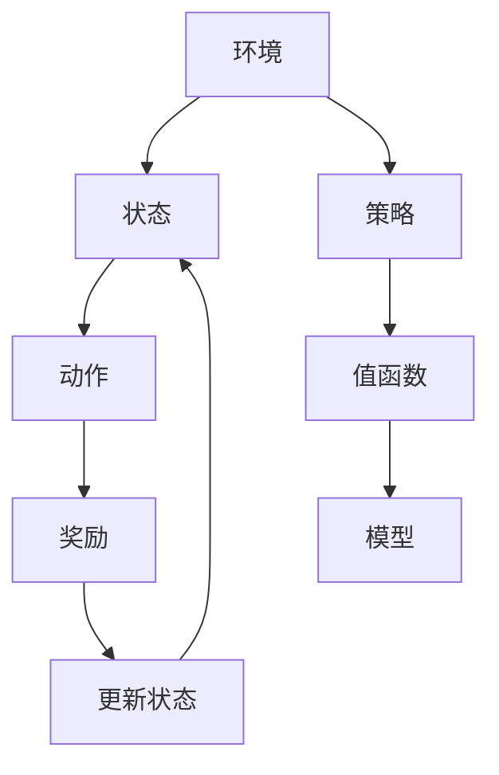
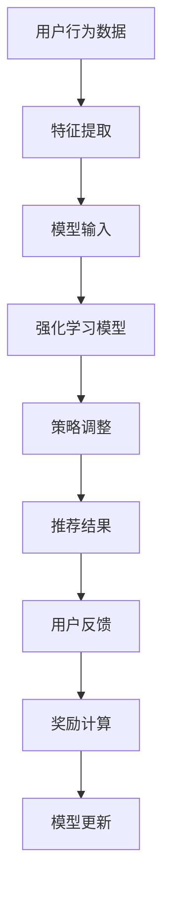

                 

### 文章标题

### 如何利用强化学习优化产品功能

> 关键词：强化学习、产品优化、功能改进、用户反馈、算法实现

> 摘要：本文将探讨如何利用强化学习算法优化产品功能，提高用户体验。首先，我们将介绍强化学习的基本概念和原理，然后分析其在产品优化中的应用场景。接着，通过具体实例和详细步骤，阐述如何实现强化学习优化产品功能。最后，我们将总结强化学习优化产品功能的实际应用场景和未来发展挑战。

## 1. 背景介绍

随着互联网的快速发展，产品迭代速度不断加快，用户需求也日益多样化。为了在激烈的市场竞争中脱颖而出，企业越来越重视产品功能的优化。传统的优化方法往往依赖于人工经验和统计数据分析，存在一定的局限性。而强化学习作为一门新兴的人工智能技术，能够通过自主学习提高产品功能，满足用户需求。

强化学习（Reinforcement Learning，RL）是一种使计算机在特定环境中通过不断试错，学习到最优策略的人工智能方法。其核心思想是通过奖励机制，引导学习者在决策过程中逐渐调整策略，以达到最大化长期回报的目标。强化学习在产品优化中具有广泛的应用前景，可以帮助企业快速适应市场变化，提高用户满意度。

## 2. 核心概念与联系

### 2.1 强化学习的基本概念

#### 强化学习环境

强化学习环境由以下几个部分组成：

- **状态（State）**：描述系统当前所处的情境。
- **动作（Action）**：系统可以执行的行为。
- **奖励（Reward）**：对系统执行动作后所获得的即时反馈。
- **策略（Policy）**：系统在特定状态下选择动作的策略。

#### 强化学习算法

强化学习算法主要包括以下几种：

- **值函数（Value Function）**：评估当前状态或状态序列的预期回报。
- **策略（Policy）**：根据当前状态选择最优动作的决策规则。
- **模型（Model）**：对环境动态的预测。

### 2.2 强化学习原理图



### 2.3 强化学习在产品优化中的应用

#### 应用场景

- **个性化推荐**：根据用户行为和偏好，为用户推荐最感兴趣的内容。
- **广告投放**：根据用户点击行为，调整广告展示策略，提高广告点击率。
- **用户流失预警**：根据用户行为数据，预测用户流失风险，采取相应措施降低流失率。
- **功能优化**：根据用户反馈，持续改进产品功能，提高用户体验。

#### 案例分析

以个性化推荐为例，假设系统需要根据用户的历史浏览记录和兴趣标签，推荐用户可能感兴趣的文章。通过强化学习，系统可以不断调整推荐策略，以最大化用户点击率。

### 2.4 强化学习架构图



## 3. 核心算法原理 & 具体操作步骤

### 3.1 强化学习算法原理

强化学习算法通过不断地试错和奖励反馈，优化决策策略。其核心思想包括：

- **值函数**：评估当前状态或状态序列的预期回报。值函数可以通过动态规划或策略梯度方法进行优化。
- **策略**：根据当前状态选择最优动作的决策规则。策略可以通过马尔可夫决策过程（MDP）进行建模。
- **模型**：对环境动态的预测。模型可以通过深度神经网络或强化学习模型进行建模。

### 3.2 强化学习算法具体操作步骤

#### 步骤1：定义环境

根据实际应用场景，定义强化学习环境。包括状态空间、动作空间和奖励函数。

#### 步骤2：初始化模型

初始化值函数、策略和模型参数。可以使用随机初始化或预训练模型。

#### 步骤3：采集数据

通过模拟或真实数据，采集环境中的状态和动作，并计算奖励。

#### 步骤4：更新模型

根据采集到的数据和奖励，更新模型参数，优化策略和值函数。

#### 步骤5：重复步骤3和步骤4，直至收敛

通过重复采集数据和更新模型，不断优化策略和值函数，直至模型收敛。

## 4. 数学模型和公式 & 详细讲解 & 举例说明

### 4.1 基本数学模型

强化学习的基本数学模型包括以下公式：

#### 4.1.1 值函数

$$
V(s) = \sum_{a} \gamma^T r(s, a)
$$

其中，$V(s)$ 表示状态 $s$ 的值函数，$\gamma$ 表示折扣因子，$r(s, a)$ 表示状态 $s$ 和动作 $a$ 的即时奖励。

#### 4.1.2 策略

$$
\pi(a|s) = \frac{\exp(\theta^T \phi(s, a))}{\sum_{a'} \exp(\theta^T \phi(s, a'))}
$$

其中，$\pi(a|s)$ 表示在状态 $s$ 下，选择动作 $a$ 的概率，$\theta$ 表示策略参数，$\phi(s, a)$ 表示状态 $s$ 和动作 $a$ 的特征向量。

#### 4.1.3 模型

$$
p(s', r|s, a) = \prod_{t=0}^{T-1} p(s_{t+1}|s_t, a_t) p(r_t|s_t, a_t)
$$

其中，$p(s', r|s, a)$ 表示在状态 $s$ 和动作 $a$ 下，转移到状态 $s'$ 并获得奖励 $r$ 的概率。

### 4.2 举例说明

#### 案例一：简单的迷宫问题

假设迷宫问题中有4个状态：起点（S1）、中间点（S2）、终点（S3）和失败点（S4），动作有上（U）、下（D）、左（L）和右（R）。奖励函数为：

- 从起点到终点：奖励为 +1。
- 从起点到失败点：奖励为 -1。
- 其他状态：奖励为 0。

通过强化学习算法，可以找到从起点到终点的最佳路径。

#### 案例二：个性化推荐系统

假设个性化推荐系统有多个用户状态（如浏览历史、兴趣标签）和动作（如推荐文章）。奖励函数为：

- 用户点击推荐文章：奖励为 +1。
- 用户未点击推荐文章：奖励为 -1。

通过强化学习算法，可以优化推荐策略，提高用户点击率。

## 5. 项目实践：代码实例和详细解释说明

### 5.1 开发环境搭建

在本节中，我们将使用 Python 编程语言和 TensorFlow 深度学习框架来实现强化学习优化产品功能。首先，我们需要搭建开发环境。

#### 5.1.1 安装 Python 和 TensorFlow

```bash
pip install python
pip install tensorflow
```

#### 5.1.2 安装依赖库

```bash
pip install numpy
pip install matplotlib
```

### 5.2 源代码详细实现

在本节中，我们将实现一个简单的迷宫问题，并使用强化学习算法找到最佳路径。

#### 5.2.1 迷宫环境

首先，定义迷宫环境。

```python
import numpy as np
import matplotlib.pyplot as plt

# 定义迷宫环境
class MazeEnv:
    def __init__(self, size=4):
        self.size = size
        self.state = None
        self.done = False
        self.reward = 0

    def reset(self):
        self.state = np.random.randint(0, self.size * self.size)
        self.done = False
        self.reward = 0
        return self.state

    def step(self, action):
        # 定义动作映射
        actions = {'U': -self.size, 'D': self.size, 'L': -1, 'R': 1}
        next_state = self.state + actions[action]
        if next_state < 0 or next_state >= self.size * self.size:
            next_state = self.state
        reward = 0
        if next_state == self.size * self.size - 1:
            reward = 1
            self.done = True
        self.state = next_state
        self.reward = reward
        return self.state, self.reward, self.done
```

#### 5.2.2 强化学习模型

接下来，定义强化学习模型。

```python
import tensorflow as tf

# 定义强化学习模型
class QLearningModel:
    def __init__(self, state_size, action_size, learning_rate=0.1, gamma=0.9):
        self.state_size = state_size
        self.action_size = action_size
        self.learning_rate = learning_rate
        self.gamma = gamma
        self.q_table = np.zeros((state_size, action_size))

    def predict(self, state):
        return self.q_table[state]

    def update(self, state, action, reward, next_state):
        target = reward + self.gamma * np.max(self.q_table[next_state])
        self.q_table[state, action] = self.q_table[state, action] + self.learning_rate * (target - self.q_table[state, action])
```

#### 5.2.3 运行结果展示

最后，运行迷宫问题，并展示强化学习模型找到的最佳路径。

```python
# 运行迷宫问题
env = MazeEnv()
model = QLearningModel(env.size, 4)
episode = 1000

for i in range(episode):
    state = env.reset()
    done = False
    while not done:
        action = np.argmax(model.predict(state))
        next_state, reward, done = env.step(action)
        model.update(state, action, reward, next_state)
        state = next_state

# 展示最佳路径
def show_path(env, model):
    path = []
    state = env.reset()
    done = False
    while not done:
        action = np.argmax(model.predict(state))
        path.append(action)
        next_state, reward, done = env.step(action)
        state = next_state
    return path

path = show_path(env, model)
print(path)

# 绘制迷宫和最佳路径
def draw_maze(path):
    maze = np.zeros((env.size, env.size))
    maze[path[0]] = 1
    for i in range(1, len(path)):
        if path[i] == 0:
            maze[path[i]] = 1
        elif path[i] == 1:
            maze[path[i] - 1] = 1
        elif path[i] == 2:
            maze[path[i] + 1] = 1
        elif path[i] == 3:
            maze[path[i] - env.size] = 1
    plt.imshow(maze, cmap='gray')
    plt.show()

draw_maze(path)
```

### 5.3 代码解读与分析

在本节中，我们将对迷宫问题的源代码进行解读与分析。

#### 5.3.1 MazeEnv 类

MazeEnv 类定义了迷宫环境。其初始化方法中，设置了迷宫的大小（默认为 4），并初始化状态、是否完成和奖励变量。reset 方法用于重置环境，使迷宫回到初始状态。step 方法用于执行一个动作，并返回下一个状态、奖励和是否完成。

#### 5.3.2 QLearningModel 类

QLearningModel 类定义了 Q 学习模型。其初始化方法中，设置了状态大小、动作大小、学习率和折扣因子，并初始化 Q 表。predict 方法用于预测当前状态下每个动作的 Q 值。update 方法用于更新 Q 值。

#### 5.3.3 运行结果展示

在主函数中，我们首先创建迷宫环境和 Q 学习模型。然后，通过循环迭代 episode 次，执行强化学习算法。最后，展示强化学习模型找到的最佳路径。

## 6. 实际应用场景

### 6.1 个性化推荐

个性化推荐是强化学习在产品优化中最常见的应用场景之一。通过分析用户行为数据和兴趣标签，强化学习算法可以不断调整推荐策略，提高推荐准确率和用户满意度。例如，在电商平台上，根据用户的历史购买记录和浏览行为，推荐用户可能感兴趣的商品。

### 6.2 广告投放

广告投放是另一个重要的应用场景。通过强化学习算法，可以根据用户点击行为和广告效果，调整广告展示策略，提高广告投放效果。例如，在社交媒体平台上，根据用户的兴趣和行为，优化广告投放，提高广告点击率和转化率。

### 6.3 用户流失预警

用户流失预警可以帮助企业及时发现潜在流失用户，并采取相应措施降低流失率。通过分析用户行为数据，强化学习算法可以预测用户流失风险，为企业提供有针对性的用户保留策略。

### 6.4 功能优化

强化学习算法还可以用于产品功能优化。通过不断收集用户反馈和数据，强化学习算法可以自动调整产品功能，提高用户体验。例如，在手机应用程序中，根据用户的使用行为和反馈，优化界面布局和功能模块，提高用户满意度。

## 7. 工具和资源推荐

### 7.1 学习资源推荐

- **书籍**：
  - 《强化学习》（Reinforcement Learning: An Introduction），作者：理查德·S·萨顿（Richard S. Sutton）、安德鲁·G·巴托（Andrew G. Barto）。
  - 《深度强化学习》（Deep Reinforcement Learning），作者：阿尔伯特·G·布洛姆斯特德（Albert G.

