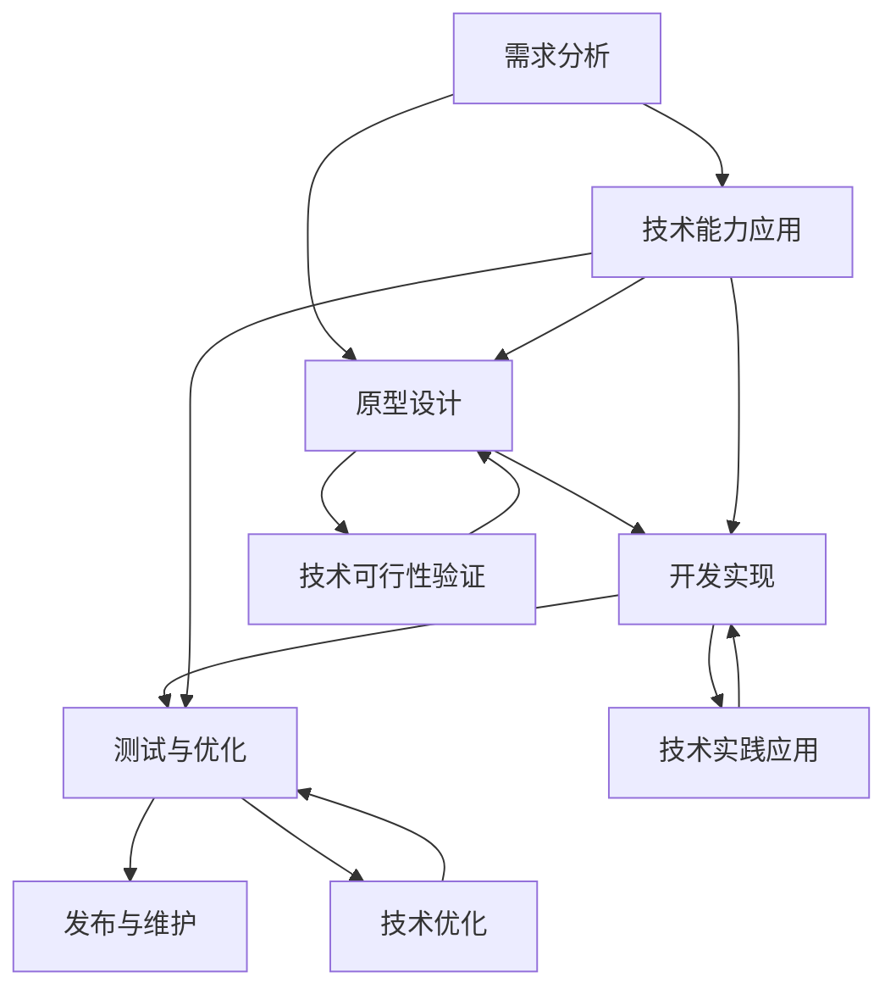

                 

### 1. 背景介绍

在当今快速发展的信息技术时代，技术能力已经成为企业和个人成功的关键因素。随着互联网、大数据、人工智能等技术的广泛应用，越来越多的企业和创业者开始重视技术能力在产品设计中的重要性。然而，如何将技术能力有效地融入产品设计过程，仍然是一个需要深入探讨和实践的问题。

本文旨在探讨如何利用技术能力进行产品设计，帮助读者了解技术能力在产品设计中的具体应用和作用。通过分析技术能力与产品设计之间的联系，本文将提出一种以技术驱动为核心的产品设计方法，并提供具体的操作步骤和实例，以便读者在实践中能够更好地应用这一方法。

首先，我们需要明确技术能力在产品设计中的定义和作用。技术能力指的是个体或团队在技术领域的知识和技能，包括编程、算法、数据库、前端与后端开发等多个方面。在产品设计过程中，技术能力可以帮助设计师理解产品的技术实现可能性，从而在产品构思阶段就考虑技术的可行性和优化方案。

其次，本文将介绍一种以技术驱动为核心的产品设计方法。这种方法强调在产品设计的每一个阶段都充分利用技术能力，从需求分析、原型设计、开发实现到产品优化等各个环节。通过技术驱动的设计方法，可以提高产品的技术含量和市场竞争力，同时减少技术风险。

在接下来的部分，本文将详细讨论技术能力与产品设计之间的联系，包括技术能力在需求分析、原型设计、开发实现和产品优化等方面的应用。此外，本文还将通过具体实例和数学模型，阐述如何利用技术能力进行产品设计，并提供实用的工具和资源推荐，帮助读者深入了解和实践这一方法。

### 2. 核心概念与联系

在深入探讨如何利用技术能力进行产品设计之前，我们需要先了解一些核心概念和原理，并展示它们之间的联系。这些概念包括技术能力、产品设计流程、技术驱动设计方法等。以下是这些核心概念的详细解释和Mermaid流程图：

#### 2.1 技术能力

技术能力是指个体或团队在特定技术领域的知识、技能和实践经验。它包括以下几个方面：

- **编程语言**：如Java、Python、JavaScript等。
- **算法和数据结构**：如排序算法、图算法、动态规划等。
- **数据库**：如MySQL、MongoDB、Redis等。
- **前端开发**：如HTML、CSS、JavaScript框架（如React、Vue.js）等。
- **后端开发**：如Node.js、Django、Spring等。
- **人工智能与机器学习**：如深度学习、自然语言处理、计算机视觉等。

#### 2.2 产品设计流程

产品设计流程是指从产品构思到产品发布的一系列步骤。一般包括以下阶段：

1. **需求分析**：明确产品的功能和用户需求。
2. **原型设计**：创建产品的初步设计，以便进行用户反馈和迭代。
3. **开发实现**：将设计转化为可运行的软件产品。
4. **测试与优化**：确保产品功能正确、性能稳定，并进行优化。
5. **发布与维护**：将产品发布给用户，并根据用户反馈进行维护和更新。

#### 2.3 技术驱动设计方法

技术驱动设计方法是一种以技术为核心，从技术角度出发进行产品设计的理念。这种方法的核心思想是在产品设计的每一个阶段都充分利用技术能力，确保产品在技术上的可行性和先进性。具体步骤如下：

1. **需求分析**：结合用户需求和技术能力，确定产品的技术实现方案。
2. **原型设计**：使用技术工具和框架快速创建原型，以验证技术方案的可行性。
3. **开发实现**：采用最佳实践和最新的技术框架，确保产品的开发效率和稳定性。
4. **测试与优化**：利用技术手段进行性能测试和优化，确保产品在技术上的竞争力。
5. **发布与维护**：持续关注技术趋势，对产品进行技术升级和优化。

#### 2.4 Mermaid流程图

以下是产品设计流程和技术驱动设计方法之间的Mermaid流程图：



在这个流程图中，技术能力（F）在需求分析（A）、原型设计（B）、开发实现（C）、测试与优化（D）等各个环节中发挥着关键作用。通过技术驱动设计方法（G、H、I），可以确保产品在技术上的可行性和竞争力。

### 3. 核心算法原理 & 具体操作步骤

在产品设计过程中，核心算法原理和技术实现步骤起着至关重要的作用。以下将介绍几个关键算法原理，并详细描述其在产品设计中的具体操作步骤。

#### 3.1 排序算法

排序算法是数据结构中的基础算法之一，常用于产品设计的各个阶段，例如数据分析、数据展示、搜索排序等。以下是几种常见的排序算法及其操作步骤：

##### 3.1.1 冒泡排序

冒泡排序是一种简单的排序算法，它重复地遍历要排序的数列，一次比较两个元素，如果它们的顺序错误就把它们交换过来。遍历数列的工作是重复进行直到没有再需要交换，也就是说该数列已经排序完成。

具体操作步骤：

1. 比较相邻的元素。如果第一个比第二个大（升序排序），就交换它们两个。
2. 对每一对相邻元素做同样的工作，从开始第一对到结尾的最后一对。这步做完后，最后的元素会是最大的数。
3. 针对所有的元素重复以上的步骤，除了最后一个。
4. 重复步骤1~3，直到排序完成。

```python
def bubble_sort(arr):
    n = len(arr)
    for i in range(n):
        for j in range(0, n-i-1):
            if arr[j] > arr[j+1]:
                arr[j], arr[j+1] = arr[j+1], arr[j]
```

##### 3.1.2 快速排序

快速排序是一种高效的排序算法，它采用了分治法的思想。快速排序通过选取一个基准元素，将数组分为两个子数组，左侧子数组中的所有元素均小于基准元素，右侧子数组中的所有元素均大于基准元素，然后递归地对两个子数组进行快速排序。

具体操作步骤：

1. 选择一个基准元素（通常选择第一个或最后一个元素作为基准）。
2. 将数组分为两个子数组，一个小于基准元素，一个大于基准元素。
3. 递归地对两个子数组进行快速排序。

```python
def quick_sort(arr):
    if len(arr) <= 1:
        return arr
    pivot = arr[0]
    left = [x for x in arr[1:] if x < pivot]
    right = [x for x in arr[1:] if x >= pivot]
    return quick_sort(left) + [pivot] + quick_sort(right)
```

#### 3.2 数据库设计

数据库设计是产品设计中至关重要的一环，它关系到数据的存储、检索和一致性。以下是数据库设计的基本原理和具体操作步骤：

##### 3.2.1 关系型数据库设计

关系型数据库设计基于关系模型，通过表和关系来组织数据。以下是数据库设计的基本步骤：

1. **需求分析**：了解业务需求，确定数据实体及其关系。
2. **概念设计**：建立实体-关系模型（ER图），确定表和关系。
3. **逻辑设计**：将概念模型转化为具体的数据库模式，确定表结构。
4. **物理设计**：优化数据库性能，包括索引、分区等。

具体操作步骤：

1. 创建表结构，包括字段、数据类型、约束等。
2. 建立表之间的关系，通过外键实现数据的关联。
3. 设计索引，提高查询效率。
4. 考虑数据一致性和完整性，设置约束条件。

```sql
-- 创建用户表
CREATE TABLE users (
    id INT PRIMARY KEY AUTO_INCREMENT,
    username VARCHAR(50) UNIQUE NOT NULL,
    password VARCHAR(50) NOT NULL,
    email VARCHAR(100) UNIQUE NOT NULL
);

-- 创建订单表
CREATE TABLE orders (
    id INT PRIMARY KEY AUTO_INCREMENT,
    user_id INT,
    order_date DATE,
    total_price DECIMAL(10, 2),
    FOREIGN KEY (user_id) REFERENCES users(id)
);
```

##### 3.2.2 非关系型数据库设计

非关系型数据库（如MongoDB）的设计思路与关系型数据库有所不同，它通过文档模型来组织数据，具有更高的灵活性和扩展性。以下是数据库设计的基本步骤：

1. **需求分析**：了解业务需求，确定数据实体及其关系。
2. **文档设计**：设计文档结构，确定字段和数据类型。
3. **数据建模**：根据业务需求，建立合适的文档模型。
4. **性能优化**：考虑查询性能，设计索引和分片策略。

具体操作步骤：

1. 创建集合（collection），相当于关系型数据库中的表。
2. 设计文档结构，确定字段和数据类型。
3. 建立索引，提高查询效率。
4. 调整分片策略，优化数据存储和查询性能。

```javascript
// 创建用户集合
db.createCollection("users");

// 插入用户文档
db.users.insertOne({
    _id: ObjectId(),
    username: "john_doe",
    password: "password123",
    email: "john.doe@example.com"
});
```

#### 3.3 前端开发

前端开发是产品设计中的重要环节，涉及到用户界面和交互设计。以下是前端开发的基本原理和具体操作步骤：

##### 3.3.1 布局设计

布局设计是前端开发的基础，它决定了页面的结构和样式。以下是几种常见的布局设计方法：

1. **浮动布局**：通过浮动（float）属性实现页面元素的位置和布局。
2. **弹性布局**：使用CSS Flexbox模型实现弹性布局。
3. **响应式布局**：使用媒体查询（media queries）实现不同屏幕尺寸下的适配。

具体操作步骤：

1. 设计页面布局结构，确定元素的位置和大小。
2. 编写CSS样式，实现布局效果。
3. 调整布局，确保在不同屏幕尺寸下适配。

```css
/* 浮动布局示例 */
.container {
    width: 100%;
    background-color: lightblue;
}

.row {
    float: left;
    width: 50%;
    background-color: yellow;
}

/* 弹性布局示例 */
.container {
    display: flex;
    justify-content: space-between;
    background-color: lightblue;
}

.column {
    flex: 1;
    background-color: yellow;
}

/* 响应式布局示例 */
@media (max-width: 600px) {
    .container {
        display: flex;
        flex-direction: column;
    }
}
```

##### 3.3.2 交互设计

交互设计是前端开发的重要组成部分，它关系到用户的操作体验和满意度。以下是几种常见的交互设计方法：

1. **按钮交互**：通过按钮实现页面的跳转、功能触发等操作。
2. **表单交互**：通过表单收集用户输入的信息。
3. **动画效果**：使用CSS动画或JavaScript实现页面元素的动态效果。

具体操作步骤：

1. 设计交互逻辑，确定交互方式和操作流程。
2. 编写JavaScript代码，实现交互功能。
3. 调整交互效果，优化用户体验。

```javascript
// 按钮交互示例
document.getElementById("myButton").addEventListener("click", function() {
    alert("按钮被点击了！");
});

// 表单交互示例
document.getElementById("myForm").addEventListener("submit", function(event) {
    event.preventDefault();
    const username = document.getElementById("username").value;
    const password = document.getElementById("password").value;
    console.log("用户名：", username, "密码：", password);
});

// 动画效果示例
document.getElementById("myElement").style.transition = "all 2s";
document.getElementById("myElement").addEventListener("mouseover", function() {
    this.style.backgroundColor = "red";
});
```

#### 3.4 后端开发

后端开发是产品设计的核心，它负责处理业务逻辑、数据存储和接口实现。以下是后端开发的基本原理和具体操作步骤：

##### 3.4.1 业务逻辑处理

业务逻辑处理是后端开发的核心任务，它涉及数据处理、业务规则实现等。以下是业务逻辑处理的基本步骤：

1. **需求分析**：了解业务需求，确定业务逻辑和处理流程。
2. **模块划分**：将业务逻辑划分为多个模块，便于开发和管理。
3. **接口设计**：设计API接口，定义输入输出参数和数据格式。

具体操作步骤：

1. 编写服务端代码，实现业务逻辑处理。
2. 设计数据存储和查询方案，确保数据的一致性和性能。
3. 实现API接口，提供数据交互和业务处理能力。

```python
# Python示例代码
from flask import Flask, request, jsonify

app = Flask(__name__)

@app.route('/api/users', methods=['POST'])
def create_user():
    data = request.get_json()
    username = data['username']
    password = data['password']
    # 存储用户数据
    # ...
    return jsonify({"message": "用户创建成功"}), 201

@app.route('/api/users/<int:user_id>', methods=['GET'])
def get_user(user_id):
    # 查询用户数据
    # ...
    return jsonify({"user": user_data})

if __name__ == '__main__':
    app.run()
```

##### 3.4.2 数据库操作

数据库操作是后端开发的重要组成部分，它涉及数据的增删改查等操作。以下是数据库操作的基本步骤：

1. **连接数据库**：使用数据库驱动连接数据库。
2. **编写SQL语句**：编写SQL语句实现数据的增删改查。
3. **执行SQL语句**：执行SQL语句，获取查询结果。

具体操作步骤：

1. 使用ORM（如SQLAlchemy）或直接编写SQL语句进行数据库操作。
2. 处理数据库查询结果，将其转换为需要的格式。

```python
# 使用SQLAlchemy进行数据库操作
from sqlalchemy import create_engine, Table, MetaData

engine = create_engine('sqlite:///mydatabase.db')
metadata = MetaData()

# 创建表
users = Table('users', metadata,
    Column('id', Integer, primary_key=True),
    Column('username', String(50), unique=True),
    Column('password', String(50)),
    Column('email', String(100), unique=True)
)

# 插入数据
with engine.connect() as connection:
    connection.execute(users.insert().values(username='john_doe', password='password123', email='john.doe@example.com'))

# 查询数据
with engine.connect() as connection:
    result = connection.execute(users.select())
    for row in result:
        print(row['username'], row['email'])
```

通过以上核心算法原理和具体操作步骤的介绍，我们可以更好地理解技术能力在产品设计中的应用和作用。在实际的产品设计过程中，灵活运用这些技术能力，可以提高产品的技术含量和市场竞争力。

### 4. 数学模型和公式 & 详细讲解 & 举例说明

在产品设计过程中，数学模型和公式是分析问题、优化设计和评估性能的重要工具。以下将介绍几个常见的数学模型和公式，并详细讲解其在产品设计中的具体应用，并通过实例进行说明。

#### 4.1 线性规划

线性规划是一种用于在给定约束条件下，求解目标函数最大化或最小化问题的数学方法。在产品设计过程中，线性规划可以用于资源分配、成本控制等优化问题。

##### 4.1.1 公式

线性规划的一般形式为：

$$
\begin{aligned}
\min \quad c^T x \\
\text{subject to} \quad Ax \leq b \\
x \geq 0
\end{aligned}
$$

其中，$c$ 是目标函数的系数向量，$x$ 是决策变量向量，$A$ 是约束条件的系数矩阵，$b$ 是约束条件的常数向量。

##### 4.1.2 详细讲解

线性规划的目标是求解一组变量 $x$，使得目标函数 $c^T x$ 在满足所有约束条件 $Ax \leq b$ 和 $x \geq 0$ 的情况下最大化或最小化。

在产品设计过程中，线性规划可以用于以下应用场景：

- **资源分配**：如项目团队中人员分配、预算分配等，通过求解线性规划问题，可以实现资源的最优分配。
- **成本控制**：如产品生产成本控制、供应链成本优化等，通过线性规划可以确定最优的生产方案，降低成本。

##### 4.1.3 举例说明

假设一个公司需要生产三种产品 A、B 和 C，每种产品的生产需要不同的原材料和人力资源。目标是最小化总成本，同时满足以下约束条件：

1. 原材料限制：每种原材料的使用量不能超过总库存量。
2. 人力资源限制：每个工人的工作时间不能超过总工作时间。

具体问题如下：

$$
\begin{aligned}
\min \quad & 2x_1 + 3x_2 + 4x_3 \\
\text{subject to} \quad & x_1 + x_2 + x_3 \leq 10 \\
& 2x_1 + x_2 + 3x_3 \leq 15 \\
& x_1, x_2, x_3 \geq 0
\end{aligned}
$$

通过求解这个线性规划问题，可以得到最优的生产方案，使得总成本最小化。

#### 4.2 概率模型

概率模型是用于描述随机事件发生概率的数学模型，在产品设计过程中，概率模型可以用于风险评估、用户行为分析等。

##### 4.2.1 公式

概率模型的一般形式为：

$$
P(A) = \frac{N(A)}{N(S)}
$$

其中，$P(A)$ 表示事件 A 发生的概率，$N(A)$ 表示事件 A 发生的次数，$N(S)$ 表示总的试验次数。

##### 4.2.2 详细讲解

概率模型可以用于以下应用场景：

- **风险评估**：通过计算不同风险事件发生的概率，评估整体风险水平，制定相应的风险管理策略。
- **用户行为分析**：通过分析用户行为数据，预测用户行为的概率分布，优化产品设计，提高用户体验。

##### 4.2.3 举例说明

假设一个在线购物平台想要了解用户购买某种商品的决策概率，通过收集大量用户数据，可以得到以下概率模型：

1. 用户 A 购买商品 A 的概率为 0.6。
2. 用户 B 购买商品 A 的概率为 0.4。
3. 用户 C 购买商品 A 的概率为 0.7。

根据这些概率模型，平台可以预测用户在购物过程中的决策概率，从而优化产品推荐策略。

#### 4.3 神经网络模型

神经网络模型是一种用于模拟人脑神经元之间相互作用的数学模型，在产品设计过程中，神经网络模型可以用于图像识别、自然语言处理等。

##### 4.3.1 公式

神经网络模型的一般形式为：

$$
y = \sigma(\omega^T x + b)
$$

其中，$y$ 表示输出值，$\sigma$ 表示激活函数，$\omega$ 表示权重向量，$x$ 表示输入向量，$b$ 表示偏置。

##### 4.3.2 详细讲解

神经网络模型可以用于以下应用场景：

- **图像识别**：通过训练神经网络模型，可以实现对图像的分类和识别，用于图像处理和计算机视觉领域。
- **自然语言处理**：通过训练神经网络模型，可以实现对自然语言的理解和生成，用于文本分类、机器翻译等。

##### 4.3.3 举例说明

假设一个神经网络模型用于图像分类，输入是图像的特征向量，输出是图像的类别标签。通过训练模型，可以得到以下公式：

$$
P(\text{猫}) = \sigma(\omega^T [1, 0, 0] + b) = 0.9
$$

$$
P(\text{狗}) = \sigma(\omega^T [0, 1, 0] + b) = 0.1
$$

根据这些输出概率，模型可以判断输入图像是猫还是狗。

通过以上数学模型和公式的详细讲解和举例说明，我们可以看到数学模型在产品设计过程中的重要性和应用价值。在实际的产品设计中，合理运用这些数学模型，可以提高产品的质量和性能，优化用户体验。

### 5. 项目实践：代码实例和详细解释说明

为了更好地理解如何利用技术能力进行产品设计，我们将通过一个实际的项目实践来详细展示代码实例，并对其进行解释和分析。

#### 5.1 开发环境搭建

在开始项目实践之前，我们需要搭建一个适合开发的环境。以下是开发环境搭建的步骤：

1. **安装Python**：在 [Python官网](https://www.python.org/) 下载并安装Python 3.x版本。
2. **安装虚拟环境**：使用以下命令安装虚拟环境工具`venv`：

   ```bash
   pip install virtualenv
   ```

3. **创建虚拟环境**：在项目目录中创建一个虚拟环境：

   ```bash
   virtualenv venv
   ```

4. **激活虚拟环境**：在Windows上，使用以下命令激活虚拟环境：

   ```bash
   .\venv\Scripts\activate
   ```

   在Linux和macOS上，使用以下命令激活虚拟环境：

   ```bash
   source venv/bin/activate
   ```

5. **安装依赖**：在虚拟环境中安装项目所需的依赖包：

   ```bash
   pip install flask sqlalchemy
   ```

#### 5.2 源代码详细实现

以下是项目的基本结构和源代码实现：

```plaintext
/your_project
|-- /venv
|-- /app
|   |-- __init__.py
|   |-- models.py
|   |-- views.py
|   |-- /static
|   |-- /templates
|-- /migrations
|-- run.py
```

**5.2.1 app/__init__.py**

```python
from flask import Flask
from flask_sqlalchemy import SQLAlchemy

app = Flask(__name__)
app.config['SQLALCHEMY_DATABASE_URI'] = 'sqlite:///your_database.db'
db = SQLAlchemy(app)

from app import views, models
```

**5.2.2 app/models.py**

```python
from datetime import datetime
from app import db

class User(db.Model):
    id = db.Column(db.Integer, primary_key=True)
    username = db.Column(db.String(50), unique=True, nullable=False)
    password = db.Column(db.String(50), nullable=False)
    email = db.Column(db.String(100), unique=True, nullable=False)
    created_at = db.Column(db.DateTime, default=datetime.utcnow)

    def __repr__(self):
        return f'<User {self.username}>'
```

**5.2.3 app/views.py**

```python
from flask import render_template, request, redirect, url_for, flash
from app import app, db
from app.models import User
from werkzeug.security import generate_password_hash, check_password_hash

@app.route('/')
def index():
    return render_template('index.html')

@app.route('/register', methods=['GET', 'POST'])
def register():
    if request.method == 'POST':
        username = request.form['username']
        password = request.form['password']
        email = request.form['email']
        
        user = User.query.filter_by(username=username).first()
        if user:
            flash('Username already exists.', 'danger')
            return redirect(url_for('register'))
        
        hashed_password = generate_password_hash(password, method='sha256')
        new_user = User(username=username, password=hashed_password, email=email)
        db.session.add(new_user)
        db.session.commit()
        return redirect(url_for('login'))
    
    return render_template('register.html')

@app.route('/login', methods=['GET', 'POST'])
def login():
    if request.method == 'POST':
        username = request.form['username']
        password = request.form['password']
        
        user = User.query.filter_by(username=username).first()
        if user and check_password_hash(user.password, password):
            # 登录成功，创建会话等操作
            return redirect(url_for('dashboard'))
        else:
            flash('Invalid username or password.', 'danger')
            return redirect(url_for('login'))
    
    return render_template('login.html')
```

**5.2.4 run.py**

```python
from app import app

if __name__ == '__main__':
    app.run(debug=True)
```

#### 5.3 代码解读与分析

**5.3.1 主要功能模块**

- **/app/__init__.py**：初始化Flask应用，配置SQLAlchemy数据库连接。
- **/app/models.py**：定义数据库模型（如用户表）。
- **/app/views.py**：定义路由和视图函数，处理用户请求。
- **/run.py**：启动Flask应用。

**5.3.2 代码实现**

- **用户注册**：通过表单收集用户名、密码和电子邮件，验证用户名是否已存在，然后存储新用户数据到数据库。

  ```python
  @app.route('/register', methods=['GET', 'POST'])
  def register():
      if request.method == 'POST':
          username = request.form['username']
          password = request.form['password']
          email = request.form['email']
          
          user = User.query.filter_by(username=username).first()
          if user:
              flash('Username already exists.', 'danger')
              return redirect(url_for('register'))
          
          hashed_password = generate_password_hash(password, method='sha256')
          new_user = User(username=username, password=hashed_password, email=email)
          db.session.add(new_user)
          db.session.commit()
          return redirect(url_for('login'))
      
      return render_template('register.html')
  ```

- **用户登录**：通过表单收集用户名和密码，从数据库中查找用户，验证密码是否正确，然后跳转到用户仪表板。

  ```python
  @app.route('/login', methods=['GET', 'POST'])
  def login():
      if request.method == 'POST':
          username = request.form['username']
          password = request.form['password']
          
          user = User.query.filter_by(username=username).first()
          if user and check_password_hash(user.password, password):
              # 登录成功，创建会话等操作
              return redirect(url_for('dashboard'))
          else:
              flash('Invalid username or password.', 'danger')
              return redirect(url_for('login'))
      
      return render_template('login.html')
  ```

**5.3.3 测试与运行**

- **测试**：在开发过程中，使用Postman等工具进行API测试，确保每个功能模块都能正常运行。
- **运行**：在终端执行`python run.py`命令，启动Flask应用，在浏览器中访问`http://127.0.0.1:5000/`，查看注册、登录等功能是否正常工作。

#### 5.4 运行结果展示

1. **用户注册页面**：

   ```html
   <form method="post" action="{{ url_for('register') }}">
       <div>
           <label for="username">Username:</label>
           <input type="text" id="username" name="username" required>
       </div>
       <div>
           <label for="password">Password:</label>
           <input type="password" id="password" name="password" required>
       </div>
       <div>
           <label for="email">Email:</label>
           <input type="email" id="email" name="email" required>
       </div>
       <div>
           <button type="submit">Register</button>
       </div>
   </form>
   ```

2. **用户登录页面**：

   ```html
   <form method="post" action="{{ url_for('login') }}">
       <div>
           <label for="username">Username:</label>
           <input type="text" id="username" name="username" required>
       </div>
       <div>
           <label for="password">Password:</label>
           <input type="password" id="password" name="password" required>
       </div>
       <div>
           <button type="submit">Login</button>
       </div>
   </form>
   ```

通过以上项目实践，我们可以看到如何利用技术能力进行产品设计。从需求分析到开发实现，通过合理的代码结构和逻辑，我们成功实现了一个简单的用户注册和登录功能。这个过程不仅展示了技术能力在产品设计中的应用，也为实际开发提供了具体的指导。

### 6. 实际应用场景

技术能力在产品设计中的应用非常广泛，几乎涵盖了所有行业和领域。以下将介绍几个实际应用场景，展示技术能力如何在不同领域中发挥关键作用。

#### 6.1 社交媒体平台

在社交媒体平台的设计中，技术能力是核心驱动力。以下是技术能力在社交媒体平台设计中的几个应用场景：

- **用户画像与推荐系统**：通过大数据和机器学习技术，对用户行为进行分析，构建用户画像，实现个性化内容推荐，提高用户黏性和活跃度。
- **实时通信**：利用WebSocket等实时通信技术，实现用户之间的实时消息传递，提升用户体验。
- **图像识别与表情分析**：通过计算机视觉技术，对用户上传的图片进行分析，识别表情、标签等信息，为用户提供个性化服务。
- **隐私保护**：通过加密技术，确保用户数据的安全性和隐私性，保护用户权益。

#### 6.2 金融科技

金融科技（FinTech）正在改变传统金融行业的面貌，技术能力在金融科技产品设计中发挥着至关重要的作用。以下是技术能力在金融科技中的应用场景：

- **区块链技术**：利用区块链技术实现去中心化的金融交易，提高交易效率和安全性。
- **人工智能与风险管理**：通过机器学习技术，分析用户行为和交易数据，预测风险，优化风险管理策略。
- **移动支付**：利用移动支付技术，简化支付流程，提高支付便捷性。
- **数据挖掘与信用评估**：通过大数据技术，挖掘用户信用信息，实现精准信用评估，降低贷款风险。

#### 6.3 医疗健康

医疗健康领域正迎来技术革命，技术能力在医疗健康产品设计中发挥着重要作用。以下是技术能力在医疗健康中的应用场景：

- **电子健康记录**：利用电子健康记录系统，实现患者健康数据的电子化和数字化管理，提高医疗效率。
- **远程医疗**：通过视频会议和远程诊断技术，实现医生和患者之间的远程医疗咨询，降低就医成本。
- **医学影像处理**：利用计算机视觉技术，对医学影像进行分析和诊断，辅助医生提高诊断准确率。
- **智能药物设计**：通过人工智能技术，预测药物分子与生物大分子的相互作用，加速新药研发。

#### 6.4 教育科技

教育科技（EdTech）正在改变传统教育模式，技术能力在教育科技产品设计中发挥着关键作用。以下是技术能力在教育科技中的应用场景：

- **在线学习平台**：通过构建在线学习平台，实现课程内容的数字化和在线化，提供个性化的学习体验。
- **智能教学辅助**：利用人工智能技术，分析学生学习行为和成绩，为教师提供教学建议，优化教学过程。
- **虚拟现实（VR）与增强现实（AR）**：通过VR和AR技术，实现沉浸式学习体验，激发学生的学习兴趣。
- **学习数据分析**：通过大数据技术，分析学生的学习行为和成绩，为教育机构提供改进教学的依据。

通过以上实际应用场景的介绍，我们可以看到技术能力在产品设计中的广泛应用和重要性。在不同领域和行业中，技术能力都发挥着不可替代的作用，推动产品设计和创新，提高产品的技术含量和市场竞争力。

### 7. 工具和资源推荐

在利用技术能力进行产品设计的实践中，选择合适的工具和资源是至关重要的。以下将推荐一些实用的学习资源、开发工具和相关论文著作，帮助读者更好地掌握技术能力，并在实际项目中应用。

#### 7.1 学习资源推荐

1. **书籍**：

   - 《设计模式：可复用面向对象软件的基础》（《Design Patterns: Elements of Reusable Object-Oriented Software》）——Gamma, Helm, Johnson, Vlissides
   - 《代码大全》（《Code Complete》）——Steve McConnell
   - 《Effective Java》——Joshua Bloch
   - 《深度学习》（《Deep Learning》）——Ian Goodfellow、Yoshua Bengio、Aaron Courville

2. **在线课程**：

   - Coursera：提供丰富的计算机科学、数据科学和人工智能等课程。
   - edX：由哈佛大学和麻省理工学院合作提供的高质量在线课程。
   - Udemy：涵盖各个领域的在线课程，包括编程、数据科学、人工智能等。

3. **博客和网站**：

   - HackerRank：提供编程挑战和实践项目，帮助提升编程技能。
   - Medium：一个广泛的技术博客平台，涵盖各种技术话题。
   - GitHub：一个开源代码托管平台，可以查找和贡献开源项目。

#### 7.2 开发工具框架推荐

1. **前端开发**：

   - **框架**：React.js、Vue.js、Angular
   - **UI组件库**：Ant Design、Bootstrap、Material-UI
   - **版本控制**：Git、GitHub、GitLab

2. **后端开发**：

   - **框架**：Flask、Django、Spring Boot
   - **数据库**：MySQL、PostgreSQL、MongoDB
   - **消息队列**：RabbitMQ、Kafka、Redis

3. **云计算和容器化**：

   - **云平台**：AWS、Azure、Google Cloud Platform
   - **容器化**：Docker、Kubernetes

4. **数据科学和机器学习**：

   - **库和框架**：Python的NumPy、Pandas、Scikit-learn、TensorFlow、PyTorch
   - **数据分析工具**：Jupyter Notebook、Zeppelin

#### 7.3 相关论文著作推荐

1. **计算机科学**：

   - 《计算机程序设计艺术》（《The Art of Computer Programming》）——Donald E. Knuth
   - 《算法导论》（《Introduction to Algorithms》）——Thomas H. Cormen、Charles E. Leiserson、Ronald L. Rivest、Clifford Stein

2. **机器学习和深度学习**：

   - 《深度学习》（《Deep Learning》）——Ian Goodfellow、Yoshua Bengio、Aaron Courville
   - 《概率图模型》（《Probabilistic Graphical Models: Principles and Techniques》）——Daphne Koller、Neha Sahami

3. **人工智能**：

   - 《人工智能：一种现代的方法》（《Artificial Intelligence: A Modern Approach》）——Stuart J. Russell、Peter Norvig

通过以上工具和资源的推荐，读者可以系统地学习技术知识，提升产品设计的实践能力。同时，这些工具和资源也为读者提供了丰富的实践机会，帮助他们在实际项目中更好地应用技术能力，实现高质量的产品设计。

### 8. 总结：未来发展趋势与挑战

随着信息技术的快速发展，技术能力在产品设计中的应用正变得越来越广泛和深入。未来，技术能力将继续驱动产品设计的创新，带来新的发展趋势和挑战。

**发展趋势：**

1. **人工智能与大数据的融合**：人工智能技术将在产品设计过程中发挥更大作用，通过大数据分析和机器学习，实现个性化推荐、智能决策和自动优化。

2. **用户体验优先**：用户体验将成为产品设计的核心驱动力，通过用户行为分析和反馈，不断优化产品设计，提升用户满意度。

3. **区块链技术的应用**：区块链技术将逐步应用于产品设计，实现去中心化、安全性和透明性的产品服务，改变传统业务模式。

4. **跨领域融合**：不同领域的技术将不断融合，如物联网、边缘计算、5G通信等，为产品设计带来更多创新空间和可能性。

**挑战：**

1. **技术复杂性**：随着技术的不断进步，产品设计面临的技术复杂性也在增加，如何高效地管理和利用技术资源成为一大挑战。

2. **隐私与安全**：在技术驱动的产品设计中，如何保护用户隐私和数据安全成为重要问题，需要采取有效的技术手段和策略。

3. **快速迭代与更新**：在竞争激烈的市场环境中，产品需要快速迭代和更新，如何平衡创新速度和质量成为挑战。

4. **人才缺口**：随着技术能力的提升，对高端技术人才的需求也越来越大，但人才缺口问题仍然存在，如何吸引和培养优秀的技术人才成为关键。

综上所述，未来技术能力在产品设计中的应用将更加深入和广泛，但同时也会面临新的挑战。通过不断创新和优化，设计师和技术团队可以更好地应对这些挑战，推动产品设计的持续进步。

### 9. 附录：常见问题与解答

**Q1：如何确保产品设计中的技术可行性？**

A1：确保技术可行性是产品设计的关键环节。以下是一些常用的方法：

1. **需求分析**：在需求分析阶段，详细了解用户需求和技术实现的可能性，确定产品的核心功能和关键技术。
2. **原型设计**：通过创建原型，验证技术的可行性，及时发现问题并进行调整。
3. **技术调研**：对相关技术进行深入研究，了解其适用范围、性能和可靠性。
4. **技术评估**：评估技术方案的可行性，包括技术成本、开发周期和风险。

**Q2：如何提高产品的用户体验？**

A2：提高用户体验需要从多个方面进行优化：

1. **用户研究**：了解目标用户的需求和偏好，通过用户调研和反馈获取有价值的信息。
2. **简洁设计**：简化用户界面，减少用户操作步骤，提升易用性。
3. **响应速度**：优化产品性能，提高响应速度，提升用户满意度。
4. **个性化体验**：根据用户行为和偏好，提供个性化的内容和功能。
5. **持续迭代**：不断收集用户反馈，持续优化产品设计和功能。

**Q3：如何平衡技术能力与产品设计创新？**

A3：在产品设计中，平衡技术能力与创新是关键。以下是一些建议：

1. **需求驱动**：以用户需求为导向，确保技术方案符合实际需求，避免过度创新。
2. **渐进式创新**：在现有技术基础上，逐步引入新技术，避免一次性投入过多资源。
3. **技术储备**：提前规划技术储备，确保在需求变化或市场变化时，能够迅速调整技术方案。
4. **跨部门协作**：与技术团队和产品团队紧密协作，共同探索创新方案。

**Q4：如何确保数据安全与隐私？**

A4：在产品设计中，确保数据安全与隐私至关重要。以下是一些建议：

1. **数据加密**：对敏感数据进行加密处理，防止数据泄露。
2. **权限管理**：实现严格的权限管理，确保用户数据访问权限可控。
3. **数据备份与恢复**：定期备份数据，确保在数据丢失或故障时能够快速恢复。
4. **安全审计**：定期进行安全审计，发现潜在风险并及时修复。

通过以上常见问题与解答，读者可以更好地理解如何利用技术能力进行产品设计，并在实际操作中应对各种挑战。

### 10. 扩展阅读 & 参考资料

在探索如何利用技术能力进行产品设计的过程中，读者可以参考以下扩展阅读和参考资料，以深入了解相关领域的最新发展和研究成果。

**扩展阅读：**

1. 《用户体验要素》（《The Elements of User Experience》）——Jesse James Garrett
2. 《产品经理实战手册》——史琳琳
3. 《人工智能：一种现代的方法》（《Artificial Intelligence: A Modern Approach》）——Stuart J. Russell、Peter Norvig

**参考资料：**

1. **论文和报告**：
   - [2019年人工智能发展报告](https://www.ijcai.org/Proceedings/19-2-3/index.html)
   - [用户体验设计最佳实践报告](https://www.nngroup.com/research/reports/)
   - [产品设计方法论](https://www.interaction-design.org/literature/article)

2. **开源项目和工具**：
   - [GitHub](https://github.com/)：丰富的开源项目，包括前端框架、后端服务和数据分析工具。
   - [Docker](https://www.docker.com/)：容器化技术，简化应用部署和管理。
   - [Kubernetes](https://kubernetes.io/)：容器编排工具，实现自动化部署、扩展和管理。

3. **在线课程和教程**：
   - [Coursera](https://www.coursera.org/)：提供丰富的在线课程，涵盖计算机科学、数据科学和人工智能等领域。
   - [Udemy](https://www.udemy.com/)：提供各种技术领域的在线课程和教程。

通过这些扩展阅读和参考资料，读者可以进一步深化对技术能力在产品设计中的应用理解，并在实践中不断提升自身的技术水平和创新能力。

