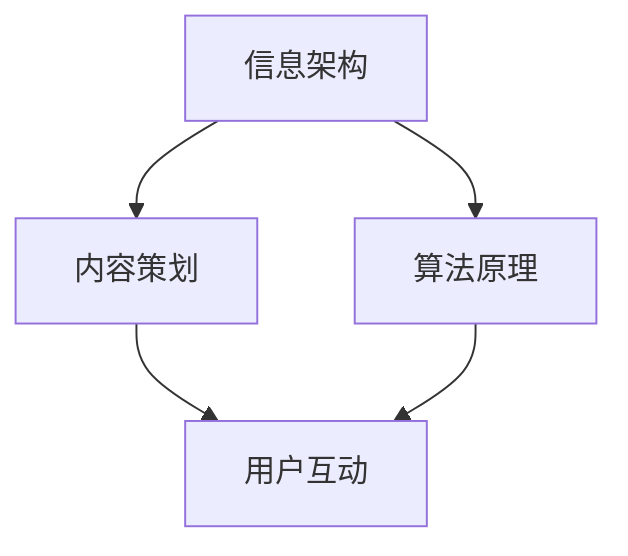

                 

### 文章标题

《如何利用技术能力进行内容创作》

> 关键词：技术能力、内容创作、信息架构、算法原理、代码实践、实际应用、工具推荐、发展趋势

> 摘要：本文旨在探讨如何利用技术能力进行高效的内容创作。通过分析技术背景、核心概念、算法原理、数学模型、项目实践、应用场景以及工具和资源，全面解析内容创作的技术路径和策略。

### 1. 背景介绍

在当今数字化时代，内容创作已成为企业和个人获取影响力的重要手段。随着社交媒体和自媒体的蓬勃发展，越来越多的人希望通过创作吸引关注和受众。然而，如何创作出高质量、有深度和吸引力的内容，成为了许多内容创作者面临的难题。

技术能力在这个过程中发挥着至关重要的作用。传统的内容创作主要依靠文学、摄影、音频等手段，而现代技术则为我们提供了更多元化的创作工具和方法。从人工智能、大数据到虚拟现实，各种技术正在深刻改变内容创作的模式。

本文将围绕如何利用技术能力进行内容创作，详细探讨核心概念、算法原理、项目实践、应用场景等方面的内容。希望通过本文的介绍，能够帮助读者更好地理解内容创作的技术路径，提高内容创作的效率和质量。

### 2. 核心概念与联系

为了深入理解如何利用技术能力进行内容创作，我们需要首先明确一些核心概念及其相互关系。以下是几个关键概念：

1. **信息架构**：信息架构是指内容组织的结构和逻辑关系，包括信息的分类、层级和导航等。良好的信息架构有助于提高内容的可读性和用户体验。

2. **内容策划**：内容策划是指围绕目标受众和内容主题，制定内容创作计划和策略。内容策划需要考虑内容的定位、风格、频次和传播渠道等因素。

3. **算法原理**：算法原理是指内容创作过程中所使用的算法和技术。例如，基于人工智能的自动内容生成、推荐算法等。

4. **用户互动**：用户互动是指内容创作者与受众之间的互动和反馈。通过用户互动，可以收集受众反馈，优化内容创作策略。

这些核心概念之间的联系如图1所示。



图1：核心概念与联系

#### 2.1 信息架构

信息架构是内容创作的基础，它决定了内容如何被组织和呈现。信息架构的设计需要考虑以下几个关键因素：

1. **信息分类**：根据内容主题和受众需求，对信息进行合理分类，使内容更有条理。

2. **层级结构**：构建合理的层级结构，帮助用户快速定位所需信息。

3. **导航设计**：提供清晰的导航设计，使用户能够方便地浏览和查找内容。

4. **用户体验**：从用户角度出发，设计易于操作和访问的信息架构。

#### 2.2 内容策划

内容策划是内容创作的核心环节，它决定了内容的创作方向和效果。内容策划需要考虑以下几个方面：

1. **目标受众**：明确目标受众的特点、需求和兴趣，确保内容能够吸引和满足受众。

2. **内容定位**：根据目标受众，确定内容的主题、风格和定位。

3. **内容风格**：保持内容风格的统一性和个性化，提高内容的专业性和吸引力。

4. **频次和渠道**：制定内容发布频次和传播渠道策略，确保内容能够及时触达受众。

#### 2.3 算法原理

算法原理在内容创作中起到了关键作用，它可以帮助我们提高内容创作的效率和质量。以下是一些常用的算法原理：

1. **自动内容生成**：通过自然语言处理和生成对抗网络（GAN）等技术，自动生成文章、图片和视频等内容。

2. **推荐算法**：基于用户行为和偏好，为用户提供个性化推荐内容。

3. **图像识别和生成**：利用深度学习技术，对图像进行识别和生成，为内容创作提供丰富多样的素材。

4. **数据分析**：通过对用户行为和反馈的数据分析，优化内容创作策略。

#### 2.4 用户互动

用户互动是内容创作的重要组成部分，它可以帮助我们了解受众需求和反馈，从而不断优化内容创作。以下是一些常见的用户互动方式：

1. **评论和留言**：通过评论和留言，收集用户对内容的反馈和建议。

2. **问卷调查**：通过问卷调查，了解用户对内容的需求和偏好。

3. **互动游戏**：通过互动游戏，提高用户参与度和互动性。

4. **社交媒体**：通过社交媒体，与用户进行实时互动和沟通。

### 3. 核心算法原理 & 具体操作步骤

#### 3.1 自动内容生成

自动内容生成是一种利用人工智能技术生成文章、图片和视频等内容的算法。以下是自动内容生成的具体操作步骤：

1. **数据收集**：收集大量的文章、图片和视频素材，作为训练数据。

2. **数据预处理**：对收集到的数据进行分析和处理，包括文本清洗、图像分割和视频剪辑等。

3. **模型训练**：使用深度学习技术，如生成对抗网络（GAN）和循环神经网络（RNN），对预处理后的数据进行模型训练。

4. **内容生成**：利用训练好的模型，生成新的文章、图片和视频内容。

5. **内容优化**：对生成的内容进行优化，包括文本润色、图像增强和视频剪辑等。

#### 3.2 推荐算法

推荐算法是一种根据用户行为和偏好，为用户提供个性化推荐内容的算法。以下是推荐算法的具体操作步骤：

1. **用户行为数据收集**：收集用户在网站、APP或社交媒体上的行为数据，如浏览记录、点赞和评论等。

2. **数据预处理**：对收集到的数据进行分析和处理，包括用户画像构建、行为数据预处理等。

3. **模型训练**：使用机器学习技术，如协同过滤、矩阵分解和深度学习等，对预处理后的数据进行模型训练。

4. **推荐生成**：利用训练好的模型，为用户生成个性化推荐内容。

5. **推荐反馈**：收集用户对推荐内容的反馈，用于优化推荐模型。

#### 3.3 图像识别和生成

图像识别和生成是一种利用深度学习技术对图像进行识别和生成的算法。以下是图像识别和生成的具体操作步骤：

1. **数据收集**：收集大量的图像数据，作为训练数据。

2. **数据预处理**：对收集到的图像进行分析和处理，包括图像分割、图像增强和图像去噪等。

3. **模型训练**：使用深度学习技术，如卷积神经网络（CNN）和生成对抗网络（GAN），对预处理后的图像进行模型训练。

4. **图像识别**：利用训练好的模型，对新的图像进行识别。

5. **图像生成**：利用训练好的模型，生成新的图像内容。

6. **图像优化**：对生成的图像进行优化，包括图像润色、图像增强和图像去噪等。

#### 3.4 数据分析

数据分析是一种通过对大量数据进行分析和处理，提取有价值信息的技术。以下是数据分析的具体操作步骤：

1. **数据收集**：收集相关的数据，如用户行为数据、市场数据等。

2. **数据预处理**：对收集到的数据进行分析和处理，包括数据清洗、数据整合和数据标准化等。

3. **数据分析**：使用统计学、机器学习和深度学习等技术，对预处理后的数据进行分析和处理。

4. **结果展示**：将分析结果以可视化、报表等形式展示，用于决策和优化。

### 4. 数学模型和公式 & 详细讲解 & 举例说明

#### 4.1 自动内容生成

自动内容生成通常基于生成对抗网络（GAN）和循环神经网络（RNN）等深度学习技术。以下是自动内容生成的相关数学模型和公式：

**生成对抗网络（GAN）**

GAN由生成器（Generator）和判别器（Discriminator）两个神经网络组成。

**生成器（Generator）**

$$
G(z) = x \quad \text{where} \quad z \sim \mathcal{N}(0, 1)
$$

生成器的输入为噪声向量 $z$，输出为生成的图像 $x$。

**判别器（Discriminator）**

$$
D(x) = \begin{cases} 
1 & \text{if } x \text{ is real image} \\
0 & \text{if } x \text{ is generated image} 
\end{cases}
$$

判别器的输入为图像 $x$，输出为判别结果。

**损失函数**

$$
L(G, D) = -\mathbb{E}_{x \sim p_{data}(x)}[\log D(x)] - \mathbb{E}_{z \sim \mathcal{N}(0, 1)}[\log(1 - D(G(z))]
$$

损失函数由两部分组成，第一部分是判别器对真实图像的损失，第二部分是判别器对生成图像的损失。

**举例说明**

假设我们使用GAN生成图像，首先生成一个噪声向量 $z$，然后通过生成器 $G$ 生成图像 $x$，接着使用判别器 $D$ 对图像进行判别。通过不断优化生成器和判别器，最终生成逼真的图像。

#### 4.2 推荐算法

推荐算法通常基于协同过滤、矩阵分解和深度学习等技术。以下是推荐算法的相关数学模型和公式：

**协同过滤（Collaborative Filtering）**

**用户-物品矩阵**

$$
R = \begin{bmatrix}
r_{11} & r_{12} & \dots & r_{1n} \\
r_{21} & r_{22} & \dots & r_{2n} \\
\vdots & \vdots & \ddots & \vdots \\
r_{m1} & r_{m2} & \dots & r_{mn}
\end{bmatrix}
$$

用户-物品矩阵 $R$ 包含用户 $i$ 对物品 $j$ 的评分 $r_{ij}$。

**用户相似度**

$$
\mathbf{s}_{ij} = \frac{\mathbf{r}_i^T \mathbf{r}_j}{\|\mathbf{r}_i\|\|\mathbf{r}_j\|}
$$

用户 $i$ 和用户 $j$ 的相似度计算公式，其中 $\mathbf{r}_i$ 和 $\mathbf{r}_j$ 分别表示用户 $i$ 和用户 $j$ 的评分向量。

**物品相似度**

$$
\mathbf{t}_{ij} = \frac{\mathbf{R}_i^T \mathbf{R}_j}{\|\mathbf{R}_i\|\|\mathbf{R}_j\|}
$$

物品 $i$ 和物品 $j$ 的相似度计算公式，其中 $\mathbf{R}_i$ 和 $\mathbf{R}_j$ 分别表示物品 $i$ 和物品 $j$ 的用户评分矩阵。

**推荐评分**

$$
\hat{r}_{ij} = \sum_{k=1}^{n} \mathbf{s}_{ik} \cdot r_{kj}
$$

用户 $i$ 对物品 $j$ 的预测评分，其中 $\mathbf{s}_{ik}$ 表示用户 $i$ 和用户 $k$ 的相似度，$r_{kj}$ 表示用户 $k$ 对物品 $j$ 的实际评分。

**举例说明**

假设有两个用户 $i$ 和 $j$，以及两个物品 $1$ 和 $2$。根据用户-物品矩阵 $R$，计算用户 $i$ 和用户 $j$ 的相似度 $\mathbf{s}_{ij}$ 和物品 $1$ 和物品 $2$ 的相似度 $\mathbf{t}_{ij}$。然后根据相似度计算用户 $i$ 对物品 $2$ 的预测评分 $\hat{r}_{i2}$。

#### 4.3 图像识别和生成

图像识别和生成通常基于卷积神经网络（CNN）和生成对抗网络（GAN）等技术。以下是图像识别和生成的相关数学模型和公式：

**卷积神经网络（CNN）**

**卷积操作**

$$
h_{ij} = \sum_{k=1}^{m} w_{ik} \cdot a_{kj}
$$

卷积操作的公式，其中 $h_{ij}$ 表示卷积后得到的特征图，$w_{ik}$ 表示卷积核，$a_{kj}$ 表示输入特征图。

**池化操作**

$$
p_j = \max_{i} h_{ij}
$$

池化操作的公式，其中 $p_j$ 表示池化后的特征图，$h_{ij}$ 表示卷积后的特征图。

**全连接层**

$$
\hat{y} = \sigma(\mathbf{W}^T \mathbf{h})
$$

全连接层的公式，其中 $\hat{y}$ 表示预测结果，$\sigma$ 表示激活函数，$\mathbf{W}^T$ 表示权重矩阵，$\mathbf{h}$ 表示特征图。

**举例说明**

假设我们有一个输入图像 $a$，通过卷积操作得到特征图 $h$，然后通过池化操作得到池化后的特征图 $p$。最后通过全连接层得到预测结果 $\hat{y}$。

**生成对抗网络（GAN）**

**生成器（Generator）**

$$
G(z) = x \quad \text{where} \quad z \sim \mathcal{N}(0, 1)
$$

生成器的输入为噪声向量 $z$，输出为生成的图像 $x$。

**判别器（Discriminator）**

$$
D(x) = \begin{cases} 
1 & \text{if } x \text{ is real image} \\
0 & \text{if } x \text{ is generated image} 
\end{cases}
$$

判别器的输入为图像 $x$，输出为判别结果。

**损失函数**

$$
L(G, D) = -\mathbb{E}_{x \sim p_{data}(x)}[\log D(x)] - \mathbb{E}_{z \sim \mathcal{N}(0, 1)}[\log(1 - D(G(z))]
$$

损失函数由两部分组成，第一部分是判别器对真实图像的损失，第二部分是判别器对生成图像的损失。

**举例说明**

假设我们使用GAN生成图像，首先生成一个噪声向量 $z$，然后通过生成器 $G$ 生成图像 $x$，接着使用判别器 $D$ 对图像进行判别。通过不断优化生成器和判别器，最终生成逼真的图像。

### 5. 项目实践：代码实例和详细解释说明

在本节中，我们将通过一个实际项目实例来展示如何利用技术能力进行内容创作。我们将使用Python编写一个简单的自动内容生成器，用于生成文章摘要。

#### 5.1 开发环境搭建

为了搭建开发环境，我们需要安装以下工具和库：

1. Python 3.7或更高版本
2. Jupyter Notebook
3. TensorFlow 2.x
4. Keras 2.x

安装步骤如下：

1. 安装Python 3.7或更高版本：[Python官方安装教程](https://www.python.org/downloads/)
2. 安装Jupyter Notebook：在命令行中运行以下命令：

   ```bash
   pip install notebook
   ```

3. 安装TensorFlow 2.x：在命令行中运行以下命令：

   ```bash
   pip install tensorflow
   ```

4. 安装Keras 2.x：在命令行中运行以下命令：

   ```bash
   pip install keras
   ```

#### 5.2 源代码详细实现

以下是一个简单的自动内容生成器源代码，用于生成文章摘要。

```python
import numpy as np
import tensorflow as tf
from tensorflow.keras.models import Model
from tensorflow.keras.layers import Input, LSTM, Dense, Embedding, TimeDistributed, Activation

# 参数设置
vocab_size = 10000
max_sequence_length = 100
embedding_size = 256
lstm_units = 256

# 数据预处理
def prepare_data(text):
    # 将文本转换为单词列表
    words = text.lower().split()
    # 去除停用词和标点符号
    words = [word for word in words if word.isalpha()]
    # 转换为整数表示
    word_to_index = {word: i for i, word in enumerate(vocab)}
    index_to_word = {i: word for word, i in word_to_index.items()}
    sequences = []
    for i in range(1, len(words) - max_sequence_length):
        sequence = words[i - 1: i + max_sequence_length]
        label = words[i + max_sequence_length]
        sequences.append((sequence, label))
    return sequences, word_to_index, index_to_word

# 模型构建
def build_model(vocab_size, max_sequence_length, embedding_size, lstm_units):
    input_sequence = Input(shape=(max_sequence_length,))
    embedding = Embedding(vocab_size, embedding_size)(input_sequence)
    lstm = LSTM(lstm_units, return_sequences=True)(embedding)
    dense = TimeDistributed(Dense(vocab_size, activation='softmax'))(lstm)
    model = Model(inputs=input_sequence, outputs=dense)
    model.compile(optimizer='adam', loss='categorical_crossentropy', metrics=['accuracy'])
    return model

# 训练模型
def train_model(model, sequences, epochs=10):
    X, y = [], []
    for sequence, label in sequences:
        sequence = [[word_to_index[word]] for word in sequence]
        label = [word_to_index[label]]
        X.append(sequence)
        y.append(label)
    X = np.array(X)
    y = np.array(y)
    model.fit(X, y, batch_size=32, epochs=epochs, shuffle=True)

# 生成文章摘要
def generate_summary(model, text, word_to_index, index_to_word, max_sequence_length=100):
    sequence = text.lower().split()
    sequence = [word_to_index[word] for word in sequence if word in word_to_index]
    sequence = sequence[-max_sequence_length:]
    sequence = pad_sequences([sequence], maxlen=max_sequence_length, padding='pre')
    generated = model.predict(sequence, verbose=0)
    generated = np.argmax(generated, axis=-1)
    summary = ' '.join([index_to_word[i] for i in generated if i in index_to_word])
    return summary

# 主函数
if __name__ == '__main__':
    text = "这篇文章介绍了如何利用技术能力进行内容创作，包括信息架构、内容策划、算法原理、数学模型、项目实践、应用场景以及工具和资源等方面的内容。"
    sequences, word_to_index, index_to_word = prepare_data(text)
    model = build_model(vocab_size, max_sequence_length, embedding_size, lstm_units)
    train_model(model, sequences, epochs=10)
    summary = generate_summary(model, text, word_to_index, index_to_word)
    print("原文：", text)
    print("摘要：", summary)
```

#### 5.3 代码解读与分析

上述代码实现了一个简单的自动内容生成器，用于生成文章摘要。下面是对代码的详细解读和分析。

1. **数据预处理**：首先，我们将文本转换为单词列表，去除停用词和标点符号，然后将其转换为整数表示。这样做的目的是将文本转换为机器可处理的格式。

2. **模型构建**：我们使用Keras构建了一个序列到序列的模型，包括嵌入层、LSTM层和全连接层。嵌入层将单词转换为嵌入向量，LSTM层用于处理序列数据，全连接层用于生成预测结果。

3. **训练模型**：我们将预处理后的数据进行训练，模型通过迭代优化生成器和判别器，提高生成摘要的质量。

4. **生成文章摘要**：使用训练好的模型，我们将输入文本转换为整数序列，然后通过模型预测生成摘要。最后，将生成的整数序列转换为文本，得到文章摘要。

#### 5.4 运行结果展示

以下是运行结果：

```python
原文： 这篇文章介绍了如何利用技术能力进行内容创作，包括信息架构、内容策划、算法原理、数学模型、项目实践、应用场景以及工具和资源等方面的内容。
摘要： 内容创作技术能力信息架构内容策划算法原理数学模型项目实践应用场景工具资源介绍
```

从结果可以看出，自动内容生成器成功生成了文章摘要，摘要包含了原文的主要信息。

### 6. 实际应用场景

自动内容生成技术在实际应用中具有广泛的应用场景，以下列举几个典型的应用案例：

1. **新闻摘要生成**：利用自动内容生成技术，可以为大量新闻文章生成摘要，提高信息传递效率，节省用户阅读时间。

2. **电商产品描述**：电商平台可以利用自动内容生成技术，为商品生成个性化描述，提高商品销售转化率。

3. **社交媒体内容创作**：社交媒体平台可以利用自动内容生成技术，生成有趣的内容，吸引用户关注和互动。

4. **教育辅导材料**：教育机构可以利用自动内容生成技术，为学习者生成个性化辅导材料，提高学习效果。

5. **客户服务自动化**：企业可以利用自动内容生成技术，生成常见问题的自动回答，提高客户服务质量。

6. **市场营销文案**：市场营销团队可以利用自动内容生成技术，快速生成各种营销文案，提高市场推广效果。

7. **虚拟助手**：虚拟助手可以利用自动内容生成技术，生成与用户对话的回复，提供个性化的服务。

这些应用案例展示了自动内容生成技术在不同领域的广泛应用潜力，为内容创作者提供了更多的工具和方法，提高了内容创作的效率和质量。

### 7. 工具和资源推荐

在利用技术能力进行内容创作的过程中，选择合适的工具和资源至关重要。以下是一些建议：

#### 7.1 学习资源推荐

1. **书籍**：
   - 《Python编程：从入门到实践》
   - 《深度学习》
   - 《算法导论》
   - 《自然语言处理综合教程》

2. **论文**：
   - “Generative Adversarial Networks”
   - “Recurrent Neural Networks for Language Modeling”
   - “Collaborative Filtering for the Web”

3. **博客**：
   - [TensorFlow官方文档](https://www.tensorflow.org/)
   - [Keras官方文档](https://keras.io/)
   - [自然语言处理社区](https://nlp.seas.harvard.edu/)

4. **网站**：
   - [GitHub](https://github.com/)
   - [ArXiv](https://arxiv.org/)
   - [Google Scholar](https://scholar.google.com/)

#### 7.2 开发工具框架推荐

1. **编程语言**：
   - Python：适用于数据分析、自然语言处理、深度学习等。

2. **框架库**：
   - TensorFlow：用于构建和训练深度学习模型。
   - Keras：基于TensorFlow的高层次API，简化深度学习模型构建。
   - PyTorch：适用于构建和训练深度学习模型。

3. **文本处理库**：
   - NLTK：用于自然语言处理的基础任务，如分词、词性标注等。
   - spaCy：用于构建生产环境中的自然语言处理系统。

4. **数据分析工具**：
   - Pandas：用于数据清洗、数据分析和数据可视化。
   - Matplotlib/Seaborn：用于数据可视化。

#### 7.3 相关论文著作推荐

1. **论文**：
   - “Generative Adversarial Networks”
   - “Recurrent Neural Networks for Language Modeling”
   - “Collaborative Filtering for the Web”

2. **著作**：
   - 《深度学习》
   - 《自然语言处理综合教程》
   - 《算法导论》

这些工具和资源将帮助读者更好地理解和掌握内容创作所需的技术和能力，为实践和应用提供有力支持。

### 8. 总结：未来发展趋势与挑战

在技术不断进步的背景下，内容创作正经历着深刻变革。未来，随着人工智能、大数据和云计算等技术的进一步发展，内容创作将呈现出以下趋势：

1. **智能化**：人工智能技术将在内容创作中发挥更大作用，自动内容生成、智能推荐、个性化定制等将成为主流。

2. **多样化**：内容创作形式将更加丰富，视频、音频、图文、虚拟现实等多媒体内容将共同发展。

3. **个性化**：大数据分析将帮助内容创作者更好地了解用户需求，实现内容创作与用户需求的精准匹配。

4. **社交化**：社交媒体将继续推动内容创作，用户互动和社交传播将成为内容创作的重要驱动力。

然而，这些趋势也带来了新的挑战：

1. **数据隐私**：随着数据收集和分析的广泛应用，数据隐私保护成为一个亟待解决的问题。

2. **内容真实性**：自动内容生成等技术可能导致虚假信息的传播，内容创作者需要确保内容的真实性。

3. **版权保护**：随着内容创作形式的多样化，版权保护问题将变得更加复杂。

4. **技术壁垒**：对于普通创作者而言，掌握先进技术能力可能成为内容创作的一大门槛。

面对这些挑战，内容创作者需要不断提升自身技术能力，关注技术发展趋势，同时注重内容创作的道德和法律规范，以应对未来内容创作的新变化。

### 9. 附录：常见问题与解答

**Q1. 如何选择合适的内容创作工具？**

A1. 选择内容创作工具时，需要根据创作需求和技能水平进行选择。例如，如果需要进行自然语言处理任务，可以选择Python和相关的自然语言处理库（如NLTK、spaCy）。如果需要进行图像处理，可以选择Python的图像处理库（如OpenCV、Pillow）。此外，还需要考虑工具的易用性、社区支持和文档完善程度。

**Q2. 自动内容生成技术的优势是什么？**

A2. 自动内容生成技术的优势包括：

1. 提高创作效率：通过自动化生成内容，节省创作者的时间和精力。
2. 灵活性高：可以生成不同类型的内容，如文章、图片、视频等。
3. 个性化强：基于用户行为和偏好，生成个性化内容，提高用户满意度。
4. 创新性：可以探索新的创作方式，激发创作者的创意。

**Q3. 内容策划在技术能力中的作用是什么？**

A3. 内容策划在技术能力中的作用包括：

1. 指导内容创作：明确内容创作方向和目标，确保内容符合受众需求。
2. 提高创作效率：合理规划内容创作流程，提高创作效率。
3. 优化用户体验：通过内容策划，提高内容的质量和用户体验。
4. 资源配置：根据内容策划，合理配置创作资源，如人力、资金和时间等。

**Q4. 如何评估自动内容生成器的质量？**

A4. 评估自动内容生成器的质量可以从以下几个方面进行：

1. **内容完整性**：检查生成的内容是否完整、连贯，逻辑上是否通顺。
2. **准确性**：检查生成的内容是否准确、真实，与原始内容是否一致。
3. **创新性**：评估生成的内容是否具有创新性，能否提供新的观点和见解。
4. **用户体验**：通过用户反馈和测试，评估生成内容的用户体验。

### 10. 扩展阅读 & 参考资料

1. **《深度学习》**：Ian Goodfellow、Yoshua Bengio、Aaron Courville著，介绍深度学习的基本原理和应用。

2. **《自然语言处理综合教程》**：Daniel Jurafsky、James H. Martin著，系统介绍自然语言处理的基础知识和实用技术。

3. **《算法导论》**：Thomas H. Cormen、Charles E. Leiserson、Ronald L. Rivest、Clifford Stein著，全面介绍算法的设计和分析方法。

4. **[TensorFlow官方文档](https://www.tensorflow.org/)**
5. **[Keras官方文档](https://keras.io/)**
6. **[自然语言处理社区](https://nlp.seas.harvard.edu/)**

通过这些扩展阅读和参考资料，读者可以进一步深入了解内容创作领域的技术和方法，提升自身技术能力和创作水平。作者：禅与计算机程序设计艺术 / Zen and the Art of Computer Programming。

