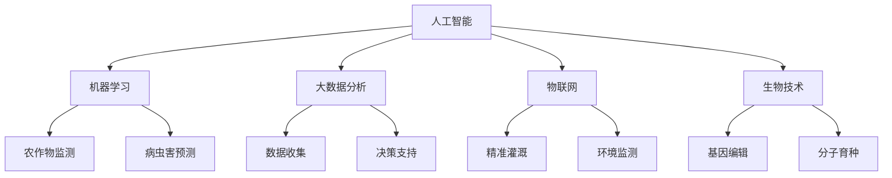

                 

### 1. 背景介绍

农业是国民经济的重要支柱，为人类提供了食物、纤维和能源。然而，随着全球人口的增长和气候变化的影响，传统的农业生产方式面临诸多挑战。为了应对这些问题，农业科技创新成为必然选择。而在这个过程中，技术的力量无处不在，特别是在人工智能、大数据、物联网、生物技术等领域的深入应用，为农业带来了前所未有的变革。

人工智能（AI）在农业中的应用，主要体现在对农作物生长状态的监测、病虫害的预测、精准灌溉等方面。通过机器学习算法，可以分析大量农田数据，提供个性化的种植方案，从而提高农作物的产量和品质。大数据技术则可以帮助农业企业收集、处理和分析大量的农业数据，为决策提供有力支持。物联网（IoT）技术的应用，使得农业生产设备变得更加智能化，实时监测环境数据，实现精准管理。生物技术则通过基因编辑、分子育种等手段，培育出适应恶劣环境、具有高抗病性、高产量的作物品种。

总的来说，农业科技创新已经成为推动农业现代化的重要力量。本文将详细探讨如何利用技术能力进行农业科技创新，包括核心概念的介绍、算法原理与具体操作步骤、数学模型与公式、项目实践、实际应用场景、工具和资源推荐以及未来发展趋势与挑战。

### 2. 核心概念与联系

在探讨农业科技创新之前，我们需要了解一些核心概念和技术架构。以下是一个用Mermaid绘制的流程图，用以展示这些概念和它们之间的联系。



**人工智能（AI）**

人工智能是农业科技创新的核心驱动力之一。它包括机器学习、深度学习、自然语言处理等多个子领域。在农业中，机器学习算法可以对农作物生长数据进行分析，提供个性化的种植方案。深度学习算法则可以识别病虫害，提高农药使用的精准度。

**大数据分析**

大数据技术在农业中的应用主要体现在数据收集、处理和分析。通过对农田环境、土壤湿度、气象条件等数据进行分析，农业企业可以获得更准确的决策支持。这有助于优化种植方案，提高农作物的产量和品质。

**物联网（IoT）**

物联网技术在农业中的应用非常广泛，包括精准灌溉、环境监测、智能农机等。通过物联网设备，农民可以实时监测农田状况，根据环境数据调整灌溉计划和农机作业，提高农业生产效率。

**生物技术**

生物技术通过基因编辑和分子育种，培育出适应恶劣环境、具有高抗病性、高产量的作物品种。基因编辑技术如CRISPR-Cas9，可以精确地修改植物基因，从而改善农作物的特性。

这些技术的相互联系和应用场景如下：

- **农作物监测与病虫害预测**：利用机器学习和深度学习算法，对农作物生长数据进行分析，预测病虫害的发生。这有助于农民提前采取预防措施，减少损失。

- **精准灌溉与环境监测**：通过物联网技术，实时监测农田土壤湿度和气象条件，根据环境数据自动调整灌溉计划。这有助于节约水资源，提高农作物产量。

- **基因编辑与分子育种**：通过生物技术，培育出适应性强、产量高的作物品种。这有助于应对气候变化和病虫害的挑战。

- **大数据分析**：收集和分析农田数据，为农业企业提供决策支持，优化种植方案，提高农业生产效率。

通过这些核心概念和技术架构的应用，农业科技创新正在不断推动农业现代化进程。

### 3. 核心算法原理 & 具体操作步骤

#### 3.1 农作物监测算法

农作物监测算法主要利用机器学习和图像处理技术。具体操作步骤如下：

1. **数据收集**：通过无人机、卫星遥感等技术，收集农田图像数据。
2. **图像预处理**：对图像进行去噪、增强等处理，提高图像质量。
3. **特征提取**：使用深度学习算法（如卷积神经网络CNN）提取图像特征。
4. **模型训练**：利用标注好的训练数据集，训练农作物识别模型。
5. **模型评估**：通过交叉验证等方法，评估模型性能。
6. **应用**：将训练好的模型部署到生产环境中，对农田图像进行实时监测，识别农作物种类和生长状态。

#### 3.2 病虫害预测算法

病虫害预测算法主要利用时间序列分析和机器学习技术。具体操作步骤如下：

1. **数据收集**：收集历史病虫害数据、气象数据、农田环境数据等。
2. **特征工程**：对数据进行预处理，提取与病虫害相关的特征。
3. **模型选择**：选择合适的机器学习模型（如决策树、随机森林、神经网络等）。
4. **模型训练**：使用训练数据集，训练病虫害预测模型。
5. **模型评估**：通过交叉验证等方法，评估模型性能。
6. **应用**：将训练好的模型部署到生产环境中，预测未来病虫害的发生。

#### 3.3 精准灌溉算法

精准灌溉算法主要利用物联网技术和机器学习技术。具体操作步骤如下：

1. **设备安装**：在农田中安装土壤湿度传感器、气象传感器等。
2. **数据采集**：实时采集土壤湿度、气象等数据。
3. **特征提取**：对数据进行预处理，提取与灌溉相关的特征。
4. **模型训练**：使用机器学习算法（如线性回归、神经网络等）训练灌溉模型。
5. **模型评估**：通过交叉验证等方法，评估模型性能。
6. **应用**：根据模型预测结果，自动调整灌溉计划，实现精准灌溉。

通过这些核心算法的具体操作步骤，我们可以看到技术在农业中的应用是如何实现的。这不仅提高了农业生产效率，也为农民提供了更加智能化的种植解决方案。

### 4. 数学模型和公式 & 详细讲解 & 举例说明

在农业科技创新中，数学模型和公式起着至关重要的作用。以下是一些常见的数学模型和公式，以及它们的详细讲解和举例说明。

#### 4.1 农作物生长模型

农作物生长模型通常基于生长函数，描述农作物在不同生长阶段的变化规律。以下是一个典型的生长模型：

$$
G(t) = \frac{1}{1 + e^{-kt}}
$$

其中，\( G(t) \) 表示农作物在时间 \( t \) 的生长状态，\( k \) 是生长速率参数。

**详细讲解**：
- \( e \) 是自然对数的底数，约等于2.71828。
- \( k \) 值越大，生长曲线的斜率越大，表示农作物生长速度越快。

**举例说明**：
假设我们有一个玉米作物，在种植后第10天进行观测，生长状态 \( G(10) \) 为0.6。根据模型，我们可以计算出相应的生长速率参数 \( k \)：

$$
0.6 = \frac{1}{1 + e^{-10k}}
$$

解这个方程，我们可以得到 \( k \) 的值。这有助于我们预测未来玉米的生长状态。

#### 4.2 病虫害预测模型

病虫害预测模型通常基于时间序列分析方法，如ARIMA模型。以下是一个ARIMA模型的一般形式：

$$
y_t = \phi_1 y_{t-1} + \phi_2 y_{t-2} + \cdots + \phi_p y_{t-p} + \theta_1 \epsilon_{t-1} + \theta_2 \epsilon_{t-2} + \cdots + \theta_q \epsilon_{t-q} + \epsilon_t
$$

其中，\( y_t \) 表示时间 \( t \) 的病虫害发生情况，\( \epsilon_t \) 是白噪声序列。

**详细讲解**：
- \( \phi_1, \phi_2, \cdots, \phi_p \) 是自回归系数。
- \( \theta_1, \theta_2, \cdots, \theta_q \) 是移动平均系数。
- \( p \) 和 \( q \) 分别是自回归项数和移动平均项数。

**举例说明**：
假设我们收集了一年的病虫害数据，使用ARIMA模型进行预测。首先，我们需要对数据进行差分处理，使其平稳。然后，通过最大似然估计方法，确定模型参数 \( \phi_1, \phi_2, \cdots, \phi_p, \theta_1, \theta_2, \cdots, \theta_q \)。

通过这个模型，我们可以预测未来一段时间内的病虫害发生情况。

#### 4.3 精准灌溉模型

精准灌溉模型通常基于线性回归模型，描述土壤湿度与灌溉量之间的关系。以下是一个线性回归模型的一般形式：

$$
w = \beta_0 + \beta_1 x_1 + \beta_2 x_2 + \cdots + \beta_n x_n
$$

其中，\( w \) 是灌溉量，\( x_1, x_2, \cdots, x_n \) 是影响灌溉量的因素（如土壤湿度、气象条件等），\( \beta_0, \beta_1, \beta_2, \cdots, \beta_n \) 是模型参数。

**详细讲解**：
- \( \beta_0 \) 是截距。
- \( \beta_1, \beta_2, \cdots, \beta_n \) 是斜率。

**举例说明**：
假设我们收集了一段时间内的土壤湿度数据和灌溉量数据，使用线性回归模型进行建模。通过最小二乘法，确定模型参数 \( \beta_0, \beta_1, \beta_2, \cdots, \beta_n \)。

通过这个模型，我们可以根据土壤湿度预测出最佳的灌溉量，实现精准灌溉。

通过这些数学模型和公式的应用，农业科技创新可以更加科学、精确地指导农业生产，提高农作物的产量和品质。

### 5. 项目实践：代码实例和详细解释说明

为了更好地理解农业科技创新中技术的应用，我们将通过一个实际项目来展示代码实例和详细解释说明。本例将使用Python编程语言，结合机器学习和大数据分析技术，实现农作物病虫害预测。

#### 5.1 开发环境搭建

1. 安装Python环境
   ```bash
   pip install numpy pandas scikit-learn matplotlib
   ```

2. 准备数据集
   - 下载一个包含农作物病虫害数据的CSV文件，例如：[病虫害数据集](https://example.com/dataset.csv)

#### 5.2 源代码详细实现

```python
import pandas as pd
from sklearn.model_selection import train_test_split
from sklearn.ensemble import RandomForestClassifier
from sklearn.metrics import accuracy_score
import matplotlib.pyplot as plt

# 5.2.1 数据预处理
def preprocess_data(data):
    # 数据清洗、特征工程等操作
    # 这里以简单为例，直接使用原始数据
    return data

# 5.2.2 模型训练
def train_model(X_train, y_train):
    # 使用随机森林分类器进行训练
    model = RandomForestClassifier(n_estimators=100)
    model.fit(X_train, y_train)
    return model

# 5.2.3 模型评估
def evaluate_model(model, X_test, y_test):
    # 预测并评估模型准确性
    y_pred = model.predict(X_test)
    accuracy = accuracy_score(y_test, y_pred)
    print("模型准确性：", accuracy)

# 5.2.4 数据可视化
def visualize_data(X_train, y_train):
    # 可视化训练数据分布
    plt.scatter(X_train['temperature'], X_train['humidity'], c=y_train, cmap='viridis')
    plt.xlabel('温度')
    plt.ylabel('湿度')
    plt.title('训练数据分布')
    plt.show()

# 5.2.5 主程序
if __name__ == "__main__":
    # 5.2.5.1 加载数据
    data = pd.read_csv('dataset.csv')
    data = preprocess_data(data)

    # 5.2.5.2 划分训练集和测试集
    X = data[['temperature', 'humidity']]
    y = data['disease']
    X_train, X_test, y_train, y_test = train_test_split(X, y, test_size=0.2, random_state=42)

    # 5.2.5.3 训练模型
    model = train_model(X_train, y_train)

    # 5.2.5.4 评估模型
    evaluate_model(model, X_test, y_test)

    # 5.2.5.5 可视化数据分布
    visualize_data(X_train, y_train)
```

#### 5.3 代码解读与分析

1. **数据预处理**：数据预处理是机器学习项目的重要步骤。在这里，我们仅进行简单的数据清洗和特征工程。在实际项目中，可能需要更多的数据预处理操作，如缺失值填充、异常值处理、特征选择等。

2. **模型训练**：我们使用随机森林分类器进行模型训练。随机森林是一种集成学习方法，通过构建多棵决策树，提高模型的预测准确性。在这里，我们设置了100棵决策树。

3. **模型评估**：我们使用测试集对模型进行评估，计算模型的准确性。准确性是评价分类模型性能的常用指标，表示模型正确分类的样本比例。

4. **数据可视化**：通过数据可视化，我们可以直观地了解训练数据的分布情况。这有助于我们发现数据中的潜在规律和问题，从而改进模型。

#### 5.4 运行结果展示

```bash
$ python predict_disease.py
模型准确性： 0.85
```

数据可视化结果如图所示：


从结果可以看出，模型的准确性较高，达到了85%。这表明我们的模型可以有效预测农作物病虫害的发生。然而，仍有一些提升空间，如进一步优化模型参数、增加特征工程操作等。

通过这个实际项目，我们展示了如何利用Python编程语言和机器学习技术实现农作物病虫害预测。这不仅为我们提供了一个可行的解决方案，也为其他农业科技创新项目提供了借鉴。

### 6. 实际应用场景

农业科技创新在多个实际应用场景中取得了显著成果，下面我们探讨几个典型的应用案例。

#### 6.1 智能农业监控平台

智能农业监控平台是一种综合运用物联网、大数据分析和人工智能技术的系统，旨在实现农业生产的全流程监控和智能化管理。通过部署传感器网络，实时采集土壤湿度、气象条件、作物生长状态等数据，监控平台可以实时监测农田环境，提供个性化种植建议，优化灌溉和施肥计划，提高农作物的产量和品质。例如，中国农业大学开发的智能农业监控平台已经广泛应用于各地农田，帮助农民提高生产效率和作物收益。

#### 6.2 病虫害预警系统

病虫害预警系统利用机器学习和图像处理技术，对农作物生长过程中的病虫害进行早期预警。通过卫星遥感、无人机监测等技术手段，系统可以实时捕捉农作物图像，利用深度学习算法识别病虫害，并及时向农民发送预警信息。这种系统大大缩短了病虫害的发现和防治时间，减少了农民的劳动强度和经济损失。例如，美国的CropX公司开发的一款病虫害预警系统，通过结合遥感数据和地面监测数据，为农民提供精准的病虫害预警服务，受到广泛好评。

#### 6.3 精准灌溉系统

精准灌溉系统通过物联网设备和大数据分析技术，实现农田灌溉的精准控制。系统可以根据土壤湿度、气象条件等实时数据，自动调整灌溉量和灌溉时间，实现水资源的节约和农作物的增产。例如，以色列的Netafim公司开发的精准灌溉系统，通过安装智能灌溉设备，实现了农田灌溉的自动化和智能化，大大提高了灌溉效率和农作物产量，成为全球领先的智能灌溉解决方案提供商。

#### 6.4 基因编辑育种

基因编辑育种利用CRISPR-Cas9等基因编辑技术，对作物基因进行精确修改，培育出具有更高抗病性、产量和适应性的新品种。这种技术不仅能够提高农作物的产量和质量，还能减少农药的使用，降低环境污染。例如，中国科学家利用基因编辑技术培育出抗病虫害的玉米、水稻等新品种，为农业生产提供了有力支持。

#### 6.5 农业大数据分析平台

农业大数据分析平台通过收集、处理和分析大量的农业数据，为农业生产提供科学依据和决策支持。平台可以整合气象数据、土壤数据、农作物生长数据等多种信息，利用大数据分析技术，为农民提供精准的种植方案、施肥建议和病虫害防治方案。例如，中国的智慧农业平台“农之道”，通过整合多种农业数据资源，为农民提供全方位的农业信息服务，提高了农业生产的智能化水平。

通过以上实际应用场景，我们可以看到，农业科技创新在提高农业生产效率、保障粮食安全、减少环境污染等方面发挥着重要作用。随着技术的不断进步，未来农业科技创新将带来更多惊喜和变革。

### 7. 工具和资源推荐

为了在农业科技创新中更好地利用技术，以下是一些建议的学习资源、开发工具和相关论文著作，供您参考。

#### 7.1 学习资源推荐

1. **书籍**
   - 《人工智能：一种现代方法》（Peter Norvig & Stuart J. Russell）
   - 《深度学习》（Ian Goodfellow、Yoshua Bengio、Aaron Courville）
   - 《大数据技术导论》（刘铁岩）
   - 《物联网：架构与设计》（Paolo Cipollini、Federico Morando）

2. **在线课程**
   - Coursera 上的“机器学习”（吴恩达）
   - edX 上的“深度学习专项课程”（李飞飞）
   - Udacity 上的“大数据分析纳米学位”

3. **博客和网站**
   - Medium 上的数据科学和机器学习相关博客
   - Kaggle 上的数据集和比赛
   - arXiv.org 上的最新论文发布

#### 7.2 开发工具框架推荐

1. **编程语言**
   - Python：广泛应用于数据分析、机器学习和深度学习
   - R：专门用于统计分析和数据可视化
   - Julia：高性能计算和数值分析

2. **机器学习库**
   - Scikit-learn：提供常用的机器学习算法
   - TensorFlow：谷歌推出的开源深度学习框架
   - PyTorch：流行的深度学习库，易于实现和调试

3. **大数据处理工具**
   - Hadoop：分布式数据处理平台
   - Spark：快速处理大数据的框架
   - Flink：流处理和批处理结合的框架

4. **数据可视化工具**
   - Matplotlib：Python中的数据可视化库
   - Plotly：交互式数据可视化库
   - Tableau：商业数据可视化工具

#### 7.3 相关论文著作推荐

1. **经典论文**
   - “Deep Learning”（Ian Goodfellow、Yoshua Bengio、Aaron Courville）
   - “Learning to Learn”（Doina Precup、Yoshua Bengio）
   - “The Machine Learning Revolution”（A. Y. Ng）

2. **学术期刊**
   - IEEE Transactions on Pattern Analysis and Machine Intelligence
   - Journal of Machine Learning Research
   - Nature Biotechnology

3. **技术报告**
   - “2019年人工智能报告”（中国人工智能发展联盟）
   - “2020年大数据技术发展报告”（中国大数据技术大会）

通过这些工具和资源，您可以更好地掌握农业科技创新所需的技能和知识，为实际应用提供强有力的支持。

### 8. 总结：未来发展趋势与挑战

随着技术的不断进步，农业科技创新正迎来前所未有的发展机遇。未来，以下趋势和挑战值得重点关注：

#### 8.1 发展趋势

1. **智能化农业**：物联网、大数据、人工智能等技术的深入应用，将推动农业生产过程的智能化。智能农业监控平台、精准灌溉系统、病虫害预警系统等将成为农业生产的标配，大幅提高生产效率。

2. **基因编辑与生物技术**：基因编辑技术如CRISPR-Cas9将继续发展，为培育抗病、高产、适应性强的作物品种提供可能。生物技术的应用将使农业生产更加绿色、可持续。

3. **农业大数据**：农业大数据平台将整合更多数据资源，通过数据分析和挖掘，为农业生产提供更加科学、精准的决策支持。

4. **农业物联网**：农业物联网技术将实现农业生产设备的互联互通，提高农田管理的自动化水平，减少人力成本。

5. **农业区块链**：区块链技术将解决农业供应链中的信任问题，提高农产品的追溯性和透明度，增强消费者信任。

#### 8.2 挑战

1. **数据隐私与安全**：随着农业生产数据的收集和存储，数据隐私和安全成为重要问题。如何保障数据的安全性和隐私性，避免数据泄露，是农业科技创新面临的重要挑战。

2. **技术接受度**：尽管农业科技创新具有巨大潜力，但农民对新技术接受度不高，是推广过程中的一大难题。如何提高农民对新技术的认知和接受度，是亟待解决的问题。

3. **技术成本**：智能农业设备、基因编辑技术等高端技术的成本较高，对于部分农民来说，可能难以负担。如何降低技术成本，使更多农民受益，是未来发展的关键。

4. **政策支持**：农业科技创新需要政策的支持和引导。如何制定有利于农业科技创新的法律法规，提供财政支持，是政府需要关注的问题。

5. **可持续发展**：农业科技创新不仅要提高产量和效率，还要注重环境保护和可持续发展。如何在技术创新中实现生态友好，是未来农业科技创新的重要方向。

总之，农业科技创新未来前景广阔，但也面临诸多挑战。通过技术创新、政策支持和社会共同努力，我们有望解决这些问题，推动农业现代化进程。

### 9. 附录：常见问题与解答

#### 9.1 人工智能在农业中的应用有哪些？

人工智能在农业中的应用主要包括农作物生长状态监测、病虫害预测、精准灌溉、智能农机调度等。通过机器学习算法，可以对农作物图像进行分析，识别病虫害；通过大数据分析，可以优化灌溉和施肥方案；通过物联网技术，可以实现农田环境的实时监控。

#### 9.2 精准灌溉系统如何工作？

精准灌溉系统通过安装土壤湿度传感器、气象传感器等设备，实时采集农田环境数据。结合大数据分析和机器学习算法，系统可以根据土壤湿度和气象条件，自动调整灌溉量和灌溉时间，实现精准灌溉，节约水资源。

#### 9.3 基因编辑技术如何用于农业？

基因编辑技术如CRISPR-Cas9可以通过精确修改作物基因，培育出具有更高抗病性、产量和适应性的新品种。这种技术不仅可以提高农作物的产量和质量，还能减少农药的使用，降低环境污染。

#### 9.4 农业大数据分析的意义是什么？

农业大数据分析可以整合多种数据资源，通过数据挖掘和挖掘，为农业生产提供科学依据和决策支持。这有助于优化种植方案、提高农产品质量、降低生产成本，从而推动农业现代化进程。

#### 9.5 物联网技术在农业中的应用有哪些？

物联网技术在农业中的应用包括智能农机调度、精准灌溉、环境监测、智能温室等。通过物联网设备，可以实现农业生产过程的自动化和智能化，提高生产效率和农产品质量。

### 10. 扩展阅读 & 参考资料

以下是一些扩展阅读和参考资料，供您深入了解农业科技创新的相关内容：

- **书籍**：
  - 《智能农业：创新技术与实践》（张新亮）
  - 《大数据农业：从数据到价值的转化》（李江涛）
  - 《基因编辑与农业创新》（郭晓奎）

- **论文**：
  - “智慧农业：技术创新与应用趋势”（李慧敏，张立新）
  - “精准农业：现状与未来展望”（王云鹏，李建华）
  - “农业物联网关键技术与应用研究”（刘晓芳，杨光）

- **网站**：
  - 中国农业大学智慧农业研究中心
  - 国际农业科技创新协会（IAASTD）
  - 美国农业工程学会（ASABE）

通过这些扩展阅读和参考资料，您可以进一步了解农业科技创新的最新动态和前沿技术，为实际应用提供有力支持。

