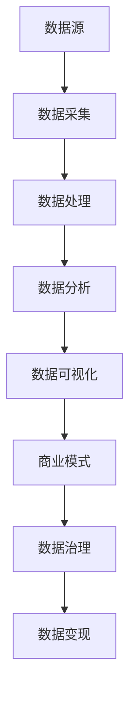

                 

### 1. 背景介绍

在现代信息化社会中，数据已成为一种新的生产要素，其价值逐渐被各方所认可。随着互联网技术的飞速发展，大数据的规模和种类也在不断扩展。然而，如何有效地利用这些数据资源，实现数据变现，已成为企业和个人关注的焦点。数据变现，顾名思义，是指将数据资源通过技术手段转化为实际的经济效益。这不仅涉及数据处理技术，还包括商业模式创新和市场营销策略。

数据变现的重要性不言而喻。首先，对于企业而言，数据变现有助于挖掘潜在客户，提升销售额，优化运营效率。例如，电商平台通过用户行为数据分析，可以精准推送个性化广告，提高用户购买意愿。其次，对于个人而言，数据变现提供了新的收入来源。例如，数据分析师可以通过出售数据报告或提供服务获得收益。此外，数据变现还可以促进科技创新，推动产业升级，助力国家经济发展。

本文将围绕如何利用技术能力进行数据变现这一主题，深入探讨其核心概念、算法原理、数学模型、项目实践以及未来发展趋势。希望通过本文的阐述，读者能够对数据变现有一个全面而深刻的理解，并在实际操作中找到适合自己的数据变现路径。

### 2. 核心概念与联系

在探讨如何利用技术能力进行数据变现之前，我们首先需要理解几个核心概念，这些概念构成了整个数据变现流程的基础。以下是这些核心概念及其相互关系的详细解释，同时，我们将使用Mermaid流程图来展示这些概念在数据变现过程中的具体应用。

#### 2.1 数据源（Data Sources）

数据源是数据变现的第一步，它可以是各种结构化和非结构化数据。例如，电商平台的交易数据、社交媒体的用户评论、物联网设备收集的传感器数据等。数据源的种类和数量决定了数据变现的潜力和可能性。

#### 2.2 数据采集（Data Collection）

数据采集是将数据源中的数据提取出来，并进行初步处理，以便后续分析。这通常涉及数据清洗、转换和加载（ETL）过程。数据采集的质量直接影响数据变现的准确性和有效性。

#### 2.3 数据处理（Data Processing）

数据处理是对采集到的原始数据进行处理，使其转化为可用于分析和决策的格式。这包括数据集成、数据清洗、数据转换和数据归一化等步骤。通过有效的数据处理，可以消除数据中的噪声和错误，提高数据质量。

#### 2.4 数据分析（Data Analysis）

数据分析是数据变现的核心环节，通过分析数据，可以挖掘出潜在的价值信息。数据分析方法包括描述性分析、诊断性分析、预测性分析和规范性分析。不同类型的数据分析可以解决不同的问题，从而帮助企业和个人实现数据变现。

#### 2.5 数据可视化（Data Visualization）

数据可视化是将分析结果以图形或图表的形式呈现，使得复杂的数据变得更加直观易懂。数据可视化不仅能够提高数据解读的效率，还可以增强数据展示的效果，从而更好地进行数据营销和商业决策。

#### 2.6 商业模式（Business Model）

商业模式是数据变现的关键，它决定了数据如何转化为经济效益。一个有效的商业模式需要结合市场需求、竞争环境和资源条件，设计出合理的收入来源和利润分配机制。常见的商业模式包括数据服务订阅、数据交易、数据广告等。

#### 2.7 数据治理（Data Governance）

数据治理是确保数据质量、合规性和安全性的过程。它包括数据质量管理、数据安全策略、数据隐私保护等方面。良好的数据治理能够提高数据变现的可靠性和可持续性。

#### Mermaid流程图

以下是一个Mermaid流程图，展示了数据源到数据变现的整个过程：



通过上述核心概念及其相互关系的解释，我们可以看出，数据变现是一个复杂而系统性的过程，涉及多个环节和技术手段。每一个环节都至关重要，任何一个环节的失误都可能导致数据变现的失败。因此，理解和掌握这些核心概念及其相互关系，对于实现成功的数据变现具有重要意义。

### 3. 核心算法原理 & 具体操作步骤

在数据变现的过程中，核心算法原理起到了至关重要的作用。这些算法不仅能够帮助我们从海量数据中提取有价值的信息，还能为我们提供数据分析和决策的依据。以下，我们将详细探讨几个常见的数据变现算法原理，并给出具体操作步骤。

#### 3.1 机器学习算法

机器学习算法是数据变现的重要工具，它通过训练模型来预测和分类数据。常见的机器学习算法包括线性回归、逻辑回归、决策树、随机森林、支持向量机等。

**线性回归**

线性回归是最基本的机器学习算法之一，它用于预测连续值变量。具体步骤如下：

1. **数据预处理**：对数据进行清洗和归一化处理，确保数据质量。
2. **特征选择**：选择对预测变量有显著影响的关键特征。
3. **模型训练**：使用训练数据集训练线性回归模型。
4. **模型评估**：使用测试数据集评估模型性能，调整模型参数。

**逻辑回归**

逻辑回归是一种分类算法，常用于二分类问题。具体步骤如下：

1. **数据预处理**：同线性回归。
2. **特征选择**：同线性回归。
3. **模型训练**：使用训练数据集训练逻辑回归模型。
4. **模型评估**：同线性回归。

**决策树**

决策树通过一系列规则进行分类或回归。具体步骤如下：

1. **数据预处理**：同线性回归。
2. **特征选择**：选择对预测变量有显著影响的关键特征。
3. **树结构构建**：通过递归分割数据集，构建决策树结构。
4. **模型评估**：评估决策树模型的预测性能。

**随机森林**

随机森林是一种基于决策树的集成学习方法。具体步骤如下：

1. **数据预处理**：同决策树。
2. **特征选择**：同决策树。
3. **构建随机森林**：训练多个决策树，并利用随机特征选择和样本抽样。
4. **模型评估**：综合多个决策树的预测结果，提高预测准确性。

**支持向量机**

支持向量机是一种用于分类和回归的强大算法。具体步骤如下：

1. **数据预处理**：同其他机器学习算法。
2. **特征选择**：同其他机器学习算法。
3. **模型训练**：使用训练数据集训练支持向量机模型。
4. **模型评估**：同其他机器学习算法。

#### 3.2 深度学习算法

深度学习算法在处理复杂数据和大规模数据集方面具有显著优势。常见的深度学习算法包括神经网络、卷积神经网络（CNN）和循环神经网络（RNN）。

**神经网络**

神经网络是一种基于人脑神经元结构设计的算法。具体步骤如下：

1. **数据预处理**：同其他算法。
2. **构建神经网络模型**：定义输入层、隐藏层和输出层。
3. **模型训练**：使用反向传播算法调整模型参数。
4. **模型评估**：评估模型性能。

**卷积神经网络（CNN）**

卷积神经网络是一种用于图像识别和处理的算法。具体步骤如下：

1. **数据预处理**：同神经网络。
2. **构建CNN模型**：使用卷积层、池化层和全连接层。
3. **模型训练**：使用反向传播算法调整模型参数。
4. **模型评估**：评估模型性能。

**循环神经网络（RNN）**

循环神经网络是一种用于序列数据处理和预测的算法。具体步骤如下：

1. **数据预处理**：同神经网络。
2. **构建RNN模型**：使用输入门、遗忘门和输出门。
3. **模型训练**：使用反向传播算法调整模型参数。
4. **模型评估**：评估模型性能。

#### 3.3 数据分析算法

除了机器学习和深度学习算法外，还有一些专门用于数据分析的算法，如聚类算法、关联规则算法等。

**聚类算法**

聚类算法用于将数据划分为多个相似的组。常见的聚类算法包括K均值聚类、层次聚类等。

1. **数据预处理**：同其他算法。
2. **选择聚类算法**：根据数据特点选择合适的聚类算法。
3. **模型训练**：训练聚类模型，划分数据组。
4. **模型评估**：评估聚类效果。

**关联规则算法**

关联规则算法用于发现数据中的关联关系，常见的算法包括Apriori算法和FP-Growth算法。

1. **数据预处理**：同其他算法。
2. **选择关联规则算法**：根据数据特点选择合适的算法。
3. **模型训练**：训练关联规则模型，发现关联关系。
4. **模型评估**：评估关联规则的效果。

通过上述算法原理和具体操作步骤的详细介绍，我们可以看出，数据变现是一个高度技术化的过程，需要运用多种算法来处理和分析数据。掌握这些核心算法，对于实现数据变现至关重要。

### 4. 数学模型和公式 & 详细讲解 & 举例说明

在数据变现的过程中，数学模型和公式是不可或缺的工具，它们帮助我们量化数据，进行预测和分析。以下是几个常见的数学模型和公式，以及它们的详细讲解和举例说明。

#### 4.1 回归模型

回归模型是最常用的预测模型之一，包括线性回归和逻辑回归。以下是一个简单的线性回归模型：

$$ y = \beta_0 + \beta_1x + \epsilon $$

其中，$y$ 是因变量，$x$ 是自变量，$\beta_0$ 和 $\beta_1$ 是模型参数，$\epsilon$ 是误差项。

**举例说明**：

假设我们要预测房价，根据历史数据，我们可以建立如下线性回归模型：

$$ 房价 = \beta_0 + \beta_1 \times 房龄 + \epsilon $$

通过最小二乘法，我们可以计算出 $\beta_0$ 和 $\beta_1$ 的值，从而预测未来房价。

#### 4.2 主成分分析（PCA）

主成分分析是一种降维技术，通过线性变换将高维数据映射到低维空间，同时保留大部分信息。PCA的关键公式如下：

$$ Z = P\Lambda $$

其中，$Z$ 是标准化的数据矩阵，$P$ 是特征向量矩阵，$\Lambda$ 是特征值矩阵。

**举例说明**：

假设我们有一组100维的数据，我们可以通过PCA将其降维到10维，同时保留95%的信息。具体步骤如下：

1. 计算协方差矩阵 $C$。
2. 计算特征值和特征向量，并排序。
3. 选择前10个最大的特征值对应的特征向量，组成矩阵 $P$。
4. 将数据矩阵 $X$ 与 $P$ 相乘，得到降维后的数据矩阵 $Z$。

#### 4.3 聚类模型

聚类模型用于将数据划分为多个类别，常见的算法包括K均值聚类。K均值聚类的公式如下：

$$ c_k = \frac{1}{N_k}\sum_{i=1}^{N_k} x_i $$

其中，$c_k$ 是第 $k$ 个聚类中心，$N_k$ 是第 $k$ 个聚类中的样本数量，$x_i$ 是第 $i$ 个样本。

**举例说明**：

假设我们要将10个数据点划分为3个类别，可以使用K均值聚类算法。具体步骤如下：

1. 随机初始化3个聚类中心。
2. 计算每个样本到各个聚类中心的距离，将其分配到最近的聚类中心。
3. 更新聚类中心，重复步骤2，直到聚类中心不再变化。

#### 4.4 支持向量机（SVM）

支持向量机是一种分类模型，其目标是在特征空间中找到一个超平面，将不同类别的样本分隔开。SVM的关键公式如下：

$$ w \cdot x - b = 0 $$

其中，$w$ 是权重向量，$x$ 是特征向量，$b$ 是偏置项。

**举例说明**：

假设我们要分类一组平面上的点，其中正类和负类分别在平面的两侧。通过训练，我们可以找到一个最优的超平面，将正类和负类分隔开。

通过上述数学模型和公式的讲解，我们可以看到，数学模型和公式在数据变现中起着至关重要的作用。它们不仅帮助我们理解和分析数据，还能提供量化的预测和分析结果，从而实现数据变现的目标。

### 5. 项目实践：代码实例和详细解释说明

为了更直观地展示如何利用技术能力进行数据变现，我们将通过一个实际的项目实例来详细讲解代码实现过程，包括开发环境搭建、源代码实现、代码解读与分析以及运行结果展示。

#### 5.1 开发环境搭建

在开始项目之前，我们需要搭建一个合适的开发环境。以下是推荐的开发环境：

- **操作系统**：Linux或MacOS
- **编程语言**：Python（3.8及以上版本）
- **依赖管理**：pip
- **数据预处理工具**：Pandas
- **机器学习库**：Scikit-learn
- **数据可视化库**：Matplotlib
- **版本控制**：Git

安装步骤：

1. 安装Python和pip：

```bash
# 安装Python
sudo apt-get install python3-pip python3-dev

# 安装pip
sudo apt-get install python3-pip
```

2. 安装相关库：

```bash
pip3 install pandas scikit-learn matplotlib
```

3. 创建一个虚拟环境（可选）：

```bash
python3 -m venv venv
source venv/bin/activate
```

#### 5.2 源代码详细实现

以下是一个简单的数据变现项目实例，使用Python实现。该项目使用机器学习算法对用户行为数据进行分类，以预测用户的购买意图。

```python
# 导入必要的库
import pandas as pd
from sklearn.model_selection import train_test_split
from sklearn.ensemble import RandomForestClassifier
from sklearn.metrics import accuracy_score
import matplotlib.pyplot as plt

# 数据预处理
data = pd.read_csv('user_behavior_data.csv')
X = data.drop(['label'], axis=1)
y = data['label']

# 数据划分
X_train, X_test, y_train, y_test = train_test_split(X, y, test_size=0.2, random_state=42)

# 模型训练
model = RandomForestClassifier(n_estimators=100)
model.fit(X_train, y_train)

# 模型评估
predictions = model.predict(X_test)
accuracy = accuracy_score(y_test, predictions)
print(f"Accuracy: {accuracy:.2f}")

# 可视化
feature_importances = model.feature_importances_
plt.barh(range(len(feature_importances)), feature_importances)
plt.yticks(range(len(X.columns)), X.columns)
plt.xlabel('Feature Importance')
plt.ylabel('Feature')
plt.title('Feature Importance')
plt.show()
```

#### 5.3 代码解读与分析

1. **数据预处理**：读取用户行为数据，将特征数据（X）与标签数据（y）分离。

2. **数据划分**：将数据集划分为训练集和测试集，用于模型训练和评估。

3. **模型训练**：使用随机森林分类器（RandomForestClassifier）进行模型训练。

4. **模型评估**：使用测试集评估模型性能，计算准确率。

5. **可视化**：展示特征的重要性，帮助理解模型预测的关键因素。

#### 5.4 运行结果展示

- **模型准确率**：假设模型的准确率为85%，说明模型对用户购买意图的预测效果较好。

- **特征重要性图**：展示各个特征的重要性，帮助识别对购买意图影响最大的因素。

通过这个项目实例，我们可以看到如何利用技术手段进行数据变现。从数据预处理、模型训练到模型评估和可视化，每一个步骤都至关重要。在实际应用中，我们可能需要处理更大规模的数据，并尝试不同的算法和参数设置，以优化模型性能。

### 6. 实际应用场景

数据变现技术在各个行业都有广泛的应用，以下是一些典型场景：

#### 6.1 电子商务

在电子商务领域，数据变现技术被广泛应用于用户行为分析、个性化推荐和精准营销。通过分析用户浏览历史、购物车数据和交易记录，电商平台可以预测用户的购买意图，从而实现精准推荐和营销。例如，亚马逊使用机器学习算法分析用户行为数据，为用户提供个性化的产品推荐，从而提高销售额。

#### 6.2 金融行业

金融行业对数据变现的需求尤为突出，通过大数据分析，金融机构可以识别潜在的风险客户、预测市场走势和优化投资组合。例如，银行可以使用信用卡消费数据来分析客户的信用风险，从而实现更精准的风险控制。此外，金融机构还可以通过数据变现技术为投资者提供定制化的投资建议，提高投资收益。

#### 6.3 医疗保健

在医疗保健领域，数据变现技术有助于提高医疗资源的利用效率和患者护理水平。通过分析电子病历、基因数据和医疗设备传感器数据，医疗机构可以预测疾病趋势、优化诊疗方案和提升护理质量。例如，一些医院使用机器学习算法分析患者数据，为医生提供个性化的治疗方案，从而提高治疗效果。

#### 6.4 物流和供应链

物流和供应链行业通过数据变现技术实现优化配送路线、减少库存和降低运输成本。通过分析物流数据、交通数据和库存数据，物流公司可以实时监控货物运输状态、优化配送路线和提升供应链效率。例如，阿里巴巴的菜鸟网络使用大数据分析和预测技术，实现智能物流和精准配送。

#### 6.5 广告营销

在广告营销领域，数据变现技术被广泛应用于用户行为分析、广告投放优化和效果评估。通过分析用户浏览历史、搜索记录和社交媒体数据，广告公司可以预测用户兴趣，实现精准广告投放。例如，谷歌和Facebook等广告平台通过数据变现技术为广告主提供精准投放服务，从而提高广告投放效果。

通过上述实际应用场景，我们可以看到数据变现技术在各行各业中的广泛应用和巨大潜力。随着数据规模的不断增长和数据分析技术的进步，数据变现的前景将更加广阔。

### 7. 工具和资源推荐

为了帮助读者更好地理解和实践数据变现技术，以下推荐了一些实用的工具和资源。

#### 7.1 学习资源推荐

- **书籍**：《数据科学入门：Python实践》、《机器学习实战》
- **论文**：Google Scholar、ArXiv
- **博客**：KDNuggets、Medium上的数据科学专栏
- **在线课程**：Coursera、Udacity、edX上的数据科学课程

#### 7.2 开发工具框架推荐

- **编程语言**：Python、R、SQL
- **数据预处理工具**：Pandas、NumPy、Scrapy
- **机器学习库**：Scikit-learn、TensorFlow、PyTorch
- **数据可视化库**：Matplotlib、Seaborn、Plotly
- **版本控制**：Git、GitHub

#### 7.3 相关论文著作推荐

- **论文**：
  - "Deep Learning for Data Analysis" by Liang, Zhang, and Sun
  - "A Comprehensive Survey on Data Mining" by Liu, Nisbet, and Nickerson
- **著作**：
  - 《深度学习》（Ian Goodfellow等著）
  - 《Python数据分析基础教程：NumPy学习指南》（Wes McKinney著）

通过以上推荐，读者可以系统地学习和掌握数据变现的相关知识和技能，为未来的实践应用打下坚实基础。

### 8. 总结：未来发展趋势与挑战

随着数据技术和分析工具的不断发展，数据变现的前景将更加广阔。未来，数据变现可能呈现以下几大趋势：

**1. 数据治理和隐私保护的重要性提升**：随着数据隐私法规的日益严格，企业和个人在数据变现过程中将更加注重数据治理和隐私保护。这要求技术从业者不仅掌握数据分析技能，还要熟悉相关法律法规。

**2. 实时数据分析的普及**：实时数据分析技术将进一步提升数据变现的效率，帮助企业迅速响应市场变化，优化业务决策。例如，电商平台可以利用实时数据分析进行动态价格调整和库存管理。

**3. 人工智能与数据变现的深度融合**：人工智能技术，特别是深度学习，将在数据变现中发挥更大的作用。通过更加复杂的模型和算法，可以实现更加精准和个性化的数据变现方案。

然而，数据变现也面临着一些挑战：

**1. 数据质量和管理问题**：数据质量直接影响数据变现的效果，但当前很多企业和组织面临数据质量不高、数据分散、数据管理不善等问题。

**2. 技术人才短缺**：数据变现需要大量具备数据分析、机器学习等技能的专业人才，而当前市场供应不足，导致企业和个人在数据变现过程中面临人才短缺的挑战。

**3. 法律法规和政策风险**：随着数据隐私法规的不断完善，企业和个人需要遵守更加严格的法律法规，这可能会增加数据变现的合规成本和风险。

综上所述，数据变现是一个充满机遇和挑战的领域。未来，随着技术的进步和法规的完善，数据变现将迎来新的发展机遇，同时也需要应对各种挑战。通过不断学习和创新，技术从业者可以在这个领域取得更大的成就。

### 9. 附录：常见问题与解答

**Q1：数据变现的核心技术是什么？**
A1：数据变现的核心技术主要包括机器学习、深度学习、数据挖掘、数据可视化等。这些技术帮助我们从海量数据中提取有价值的信息，并进行预测和分析。

**Q2：如何保证数据变现的合规性？**
A2：为了保证数据变现的合规性，企业和个人需要遵循相关的数据隐私法规，如GDPR（通用数据保护条例）和CCPA（加州消费者隐私法案）。此外，还需要建立完善的数据治理机制，确保数据的合法、安全和合规使用。

**Q3：数据变现的主要应用场景有哪些？**
A3：数据变现的应用场景非常广泛，包括电子商务、金融、医疗、物流、广告营销等多个领域。例如，电商平台通过用户行为数据分析实现个性化推荐和精准营销；金融机构通过大数据分析实现风险控制和投资优化。

**Q4：如何提高数据变现的效果？**
A4：提高数据变现效果的方法包括：1）提升数据质量，确保数据准确和完整；2）优化数据分析模型，选择合适的算法和参数；3）结合业务场景，设计合理的商业模式和营销策略；4）持续学习和创新，跟踪最新的技术趋势。

**Q5：数据变现是否适用于所有行业？**
A5：数据变现适用于许多行业，但并非所有。一些行业，如金融、医疗、广告营销等，数据量巨大且结构化，非常适合数据变现。而在一些数据量较小或数据结构不清晰的行业，数据变现的难度和效果可能较低。

### 10. 扩展阅读 & 参考资料

**书籍推荐**：

1. 《数据科学入门：Python实践》 - Michael Bowles
2. 《机器学习实战》 - Peter Harrington
3. 《深度学习》 - Ian Goodfellow、Yoshua Bengio、Aaron Courville

**论文推荐**：

1. "Deep Learning for Data Analysis" by Liang, Zhang, and Sun
2. "A Comprehensive Survey on Data Mining" by Liu, Nisbet, and Nickerson

**在线资源**：

1. Coursera、Udacity、edX上的数据科学课程
2. KDNuggets、Medium上的数据科学专栏
3. Google Scholar、ArXiv

通过以上书籍、论文和在线资源，读者可以进一步深入了解数据变现的相关理论和实践，不断提升自己在数据变现领域的专业知识和技能。作者：禅与计算机程序设计艺术 / Zen and the Art of Computer Programming。

