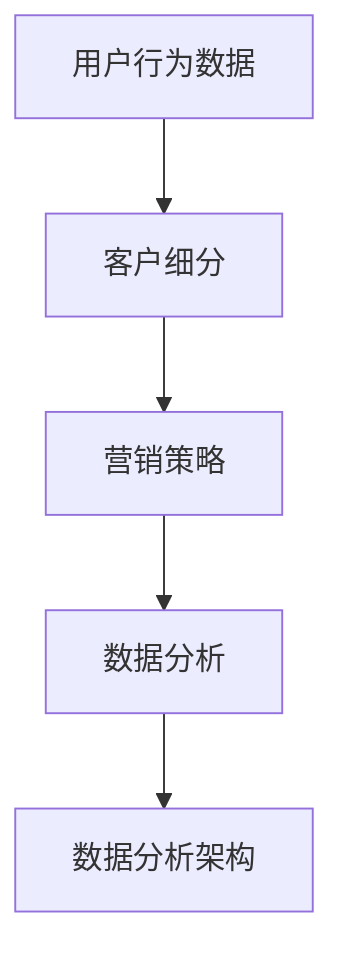

                 

### 1. 背景介绍

在当今数字化时代，企业竞争的核心在于如何更好地理解和满足用户需求，从而提高用户转化率。用户转化率是指从潜在用户到实际购买用户的过程中的转化比例，它是衡量企业营销效果和商业成功的重要指标。随着数据技术的迅猛发展，数据分析成为优化用户转化的有效手段。通过深入挖掘和分析用户行为数据，企业能够精准定位目标用户，优化营销策略，提高用户体验，从而提升用户转化率。

数据分析在用户转化中的应用主要体现在以下几个方面：

1. **用户行为分析**：通过分析用户的浏览、点击、购买等行为，了解用户兴趣和偏好，为精准营销提供数据支持。
2. **客户细分**：根据用户行为和特征，将用户分为不同的群体，以便实施有针对性的营销策略。
3. **预测分析**：利用历史数据预测未来用户的购买行为，提前布局，提高营销效率和转化率。
4. **A/B测试**：通过对比不同营销策略的效果，找到最佳方案，提高用户转化率。

本文将围绕如何利用数据分析优化用户转化展开讨论，通过阐述核心概念、算法原理、数学模型、项目实践等，帮助读者深入了解并掌握这一技术，为企业提升用户转化率提供有力支持。

### 2. 核心概念与联系

在深入探讨如何利用数据分析优化用户转化之前，我们需要明确几个核心概念和它们之间的联系。这些概念构成了数据分析的基础，对于理解后续内容至关重要。

#### 2.1 用户行为数据

用户行为数据是指用户在网站、APP或其他数字平台上的各种交互行为，包括浏览、搜索、点击、购买等。这些数据通常以日志文件的形式记录，并存储在数据库或数据仓库中。用户行为数据是进行数据分析的关键输入，它能够揭示用户的兴趣、需求和偏好。

#### 2.2 客户细分

客户细分是指根据用户的特征和行为，将用户划分为不同的群体。这些特征可以包括年龄、性别、地理位置、购买历史、浏览习惯等。客户细分有助于企业制定有针对性的营销策略，提高营销效率。

#### 2.3 营销策略

营销策略是企业为了吸引、保留和转化客户而采取的一系列行动。这些策略包括广告投放、促销活动、邮件营销、社交媒体推广等。有效的营销策略能够提高用户的参与度和转化率。

#### 2.4 数据分析

数据分析是指利用统计、机器学习等方法对数据进行处理和分析，以提取有价值的信息和洞察。数据分析在用户转化中的应用主要包括用户行为分析、客户细分、预测分析和A/B测试等。

#### 2.5 数据分析架构

数据分析架构是指数据处理、存储和分析的一系列技术组件和流程。它通常包括数据收集、数据存储、数据清洗、数据集成、数据分析和数据可视化等步骤。一个高效的数据分析架构能够确保数据的准确性、完整性和可访问性，从而支持有效的数据分析。

#### 2.6 关系与联系

用户行为数据是客户细分的基础，而客户细分又是制定营销策略的依据。通过有效的数据分析，企业能够发现用户行为和营销策略之间的关联，从而优化营销效果。此外，数据分析架构为数据分析和决策提供了技术支持，使得数据驱动的决策成为可能。

为了更好地理解这些核心概念之间的关系，我们可以使用Mermaid流程图来表示：



通过这个流程图，我们可以清晰地看到用户行为数据如何通过客户细分和营销策略，最终在数据分析架构的支持下，实现数据驱动的用户转化优化。

#### 2.7 总结

在本文的这部分内容中，我们介绍了用户行为数据、客户细分、营销策略、数据分析和数据分析架构等核心概念，并阐述了它们之间的联系。这些概念构成了数据分析优化用户转化的基础，为后续内容的深入讨论提供了必要的背景知识。

### 3. 核心算法原理 & 具体操作步骤

在深入了解数据分析优化用户转化的过程中，核心算法的选择和实现是至关重要的。以下将介绍几种常用的核心算法原理和具体操作步骤，以帮助读者掌握这些技术。

#### 3.1 用户行为分析算法

用户行为分析算法主要用于挖掘用户在数字平台上的交互行为模式，以便更好地理解用户需求和偏好。以下是一种常用的用户行为分析算法——协同过滤算法（Collaborative Filtering）。

##### 3.1.1 算法原理

协同过滤算法通过分析用户之间的行为相似性，为用户推荐与其相似的其他用户的偏好。协同过滤算法分为基于用户的协同过滤（User-Based CF）和基于物品的协同过滤（Item-Based CF）两种。

- **基于用户的协同过滤**：找到与目标用户行为相似的其他用户，然后推荐这些用户喜欢的物品。
- **基于物品的协同过滤**：找到与目标物品相似的物品，然后推荐给目标用户。

##### 3.1.2 具体操作步骤

1. **数据收集**：收集用户和物品的交互数据，如评分、点击、浏览等。
2. **数据预处理**：清洗数据，处理缺失值、异常值等。
3. **计算相似性**：计算用户之间的相似性，常用的相似性度量方法有欧氏距离、余弦相似性、皮尔逊相关系数等。
4. **生成推荐列表**：根据相似性度量，为用户生成推荐列表。

#### 3.2 客户细分算法

客户细分算法用于将用户划分为不同的群体，以便实施有针对性的营销策略。以下是一种常用的客户细分算法——K均值聚类（K-Means Clustering）。

##### 3.2.1 算法原理

K均值聚类是一种基于距离的聚类方法，其目标是找到K个簇的中心点，使得每个簇中的数据点与其中心点的距离之和最小。K均值聚类的基本步骤如下：

1. **初始化聚类中心**：随机选择K个初始中心点。
2. **分配数据点**：将每个数据点分配到与其最近的中心点所在的簇。
3. **更新中心点**：计算每个簇的新中心点。
4. **迭代直至收敛**：重复步骤2和3，直至聚类中心不再发生显著变化。

##### 3.2.2 具体操作步骤

1. **选择聚类个数K**：通常通过肘部法则（Elbow Method）或硅油法（Silhouette Method）确定合适的K值。
2. **初始化聚类中心**：随机选择K个初始中心点。
3. **分配数据点**：将每个数据点分配到与其最近的中心点所在的簇。
4. **更新中心点**：计算每个簇的新中心点。
5. **迭代直至收敛**：重复步骤3和4，直至聚类中心不再发生显著变化。

#### 3.3 预测分析算法

预测分析算法用于预测用户的未来行为，如购买、点击等。以下是一种常用的预测分析算法——逻辑回归（Logistic Regression）。

##### 3.3.1 算法原理

逻辑回归是一种广义线性模型，用于分类问题。其基本原理是通过建立目标变量与特征变量之间的线性关系，然后利用Sigmoid函数将线性关系映射到概率空间。逻辑回归的损失函数为对数似然损失（Log-Likelihood Loss），其目的是最大化模型的对数似然函数。

##### 3.3.2 具体操作步骤

1. **数据收集**：收集用户的历史行为数据，如购买、点击等。
2. **数据预处理**：清洗数据，处理缺失值、异常值等。
3. **特征工程**：选择和构造特征，如用户年龄、地理位置、浏览时长等。
4. **模型训练**：使用训练数据训练逻辑回归模型。
5. **模型评估**：使用测试数据评估模型性能，如准确率、召回率、F1值等。
6. **预测**：使用训练好的模型对新的用户行为进行预测。

#### 3.4 A/B测试算法

A/B测试是一种常用的实验设计方法，用于比较不同策略的效果。以下是一种常用的A/B测试算法——随机分组法（Randomized Grouping）。

##### 3.4.1 算法原理

随机分组法将用户随机分配到两个或多个实验组，每个实验组接受不同的策略或变量。通过比较实验组之间的结果，可以评估不同策略的效果。

##### 3.4.2 具体操作步骤

1. **设计实验**：确定实验的目标、变量和指标。
2. **随机分组**：将用户随机分配到实验组。
3. **执行实验**：为每个实验组执行不同的策略。
4. **数据收集**：收集实验数据，包括实验组和对照组的指标数据。
5. **统计分析**：使用统计方法（如t检验、卡方检验等）分析实验结果，判断不同策略的效果。

#### 3.5 总结

本部分介绍了用户行为分析算法、客户细分算法、预测分析算法和A/B测试算法的核心原理和具体操作步骤。这些算法在数据分析优化用户转化中起着重要作用，为后续内容提供了理论基础和实操指南。

### 4. 数学模型和公式 & 详细讲解 & 举例说明

在深入理解数据分析优化用户转化的过程中，数学模型和公式是必不可少的工具。它们帮助我们量化用户行为、预测用户转化，并评估不同策略的效果。以下将介绍几种常用的数学模型和公式，并进行详细讲解和举例说明。

#### 4.1 用户行为分析模型

用户行为分析模型主要用于理解用户在数字平台上的交互行为，常见的模型包括马尔可夫模型（Markov Model）和贝叶斯网络（Bayesian Network）。

##### 4.1.1 马尔可夫模型

马尔可夫模型是一种用于描述随机过程的数学模型，其基本假设是当前状态仅依赖于前一个状态，与过去的历史状态无关。马尔可夫模型的数学表达式为：

$$
P(X_t = x_t | X_{t-1} = x_{t-1}, X_{t-2} = x_{t-2}, ..., X_1 = x_1) = P(X_t = x_t | X_{t-1} = x_{t-1})
$$

其中，$X_t$表示第$t$个状态，$x_t$表示状态$x_t$的概率。

**举例说明**：

假设用户在网站上的浏览行为可以划分为“浏览商品”、“加入购物车”和“完成购买”三个状态。我们可以通过历史数据构建一个马尔可夫模型，预测用户从浏览商品到完成购买的概率。

##### 4.1.2 贝叶斯网络

贝叶斯网络是一种基于概率的图形模型，用于表示变量之间的条件依赖关系。贝叶斯网络的数学表达式为：

$$
P(X_1, X_2, ..., X_n) = \prod_{i=1}^{n} P(X_i | X_{i-1})
$$

其中，$X_1, X_2, ..., X_n$表示$n$个随机变量，$P(X_i | X_{i-1})$表示第$i$个变量在已知前一个变量的条件下发生的概率。

**举例说明**：

假设我们想了解用户在网站上的浏览行为与购买行为之间的关系。我们可以使用贝叶斯网络表示用户浏览行为（$B$）和购买行为（$P$）之间的条件依赖关系。

#### 4.2 客户细分模型

客户细分模型用于将用户划分为不同的群体，以便实施有针对性的营销策略。常见的模型包括K均值聚类（K-Means Clustering）和层次聚类（Hierarchical Clustering）。

##### 4.2.1 K均值聚类

K均值聚类是一种基于距离的聚类方法，其目标是找到K个簇的中心点，使得每个簇中的数据点与其中心点的距离之和最小。K均值聚类的目标函数为：

$$
J(\mu_1, \mu_2, ..., \mu_K) = \sum_{i=1}^{K} \sum_{x \in S_i} ||x - \mu_i||
$$

其中，$\mu_1, \mu_2, ..., \mu_K$表示K个簇的中心点，$S_i$表示第$i$个簇中的数据点。

**举例说明**：

假设我们有一个包含用户年龄、收入和消费习惯的数据集，我们希望将其划分为两个簇。我们可以使用K均值聚类算法，通过最小化目标函数来找到最优的簇中心点。

##### 4.2.2 层次聚类

层次聚类是一种基于层次结构的聚类方法，其基本思想是逐步合并或分裂数据点，构建一个层次结构。层次聚类的目标函数为：

$$
J(\{C_1, C_2, ..., C_k\}) = \sum_{i=1}^{k} \sum_{x \in C_i} ||x - c_i||
$$

其中，$\{C_1, C_2, ..., C_k\}$表示$k$个簇，$c_i$表示第$i$个簇的中心点。

**举例说明**：

假设我们有一个包含用户年龄、收入和消费习惯的数据集，我们希望将其划分为多个层次聚类。我们可以使用层次聚类算法，逐步构建层次结构，以找到最优的聚类结果。

#### 4.3 预测分析模型

预测分析模型用于预测用户的未来行为，常见的模型包括线性回归（Linear Regression）和逻辑回归（Logistic Regression）。

##### 4.3.1 线性回归

线性回归是一种用于预测连续值的模型，其目标是最小化预测值与实际值之间的误差。线性回归的数学表达式为：

$$
y = \beta_0 + \beta_1x_1 + \beta_2x_2 + ... + \beta_nx_n
$$

其中，$y$表示预测值，$x_1, x_2, ..., x_n$表示特征值，$\beta_0, \beta_1, \beta_2, ..., \beta_n$表示模型参数。

**举例说明**：

假设我们想预测用户的购买金额，我们可以使用线性回归模型，通过拟合用户特征（如年龄、收入等）与购买金额之间的关系，来预测新的用户的购买金额。

##### 4.3.2 逻辑回归

逻辑回归是一种用于预测概率的模型，其目标是最小化对数似然损失。逻辑回归的数学表达式为：

$$
\hat{P}(y=1 | x) = \frac{1}{1 + \exp(-\beta_0 - \beta_1x_1 - \beta_2x_2 - ... - \beta_nx_n)}
$$

其中，$\hat{P}(y=1 | x)$表示在给定特征$x$的情况下，目标变量$y$为1的概率，$\beta_0, \beta_1, \beta_2, ..., \beta_n$表示模型参数。

**举例说明**：

假设我们想预测用户是否会在未来一个月内购买商品，我们可以使用逻辑回归模型，通过拟合用户特征与购买概率之间的关系，来预测新的用户是否会在未来购买商品。

#### 4.4 A/B测试模型

A/B测试模型用于评估不同策略的效果，常见的模型包括假设检验（Hypothesis Testing）和置信区间（Confidence Interval）。

##### 4.4.1 假设检验

假设检验是一种用于判断两个样本是否具有显著差异的统计方法。其基本步骤如下：

1. **提出假设**：设定原假设（$H_0$）和备择假设（$H_1$）。
2. **选择检验方法**：根据数据类型和分布特点选择合适的检验方法，如t检验、卡方检验等。
3. **计算检验统计量**：根据样本数据和检验方法计算检验统计量。
4. **确定显著性水平**：设定显著性水平（如0.05），判断检验统计量是否显著。
5. **做出决策**：根据显著性水平做出决策，接受或拒绝原假设。

**举例说明**：

假设我们想比较两个广告的效果，我们可以使用t检验来评估两个广告的点击率是否有显著差异。

##### 4.4.2 置信区间

置信区间是一种用于估计总体参数范围的统计方法。其基本步骤如下：

1. **选择置信水平**：设定置信水平（如95%）。
2. **计算置信区间**：根据样本数据和置信水平计算置信区间。
3. **解释置信区间**：根据置信区间解释总体参数的范围。

**举例说明**：

假设我们想估计用户在一个月内的平均购买金额，我们可以使用置信区间来估计总体平均购买金额的范围。

#### 4.5 总结

本部分介绍了用户行为分析模型、客户细分模型、预测分析模型和A/B测试模型的数学模型和公式，并进行了详细讲解和举例说明。这些模型和公式在数据分析优化用户转化中起着重要作用，为读者提供了理论支持和实操指南。

### 5. 项目实践：代码实例和详细解释说明

为了更好地展示如何利用数据分析优化用户转化，我们将通过一个实际项目来详细讲解代码实例和实现过程。该项目将包括数据收集、预处理、模型训练和结果评估等步骤。

#### 5.1 开发环境搭建

在开始项目之前，我们需要搭建一个适合数据分析的开发环境。以下是在Python环境中搭建开发环境的步骤：

1. **安装Python**：确保已安装Python 3.8及以上版本。
2. **安装相关库**：使用pip命令安装必要的库，如NumPy、Pandas、Scikit-learn、Matplotlib等。

```bash
pip install numpy pandas scikit-learn matplotlib
```

#### 5.2 源代码详细实现

以下是一个简单的用户转化优化项目的代码实现，包括数据收集、预处理、模型训练和结果评估。

```python
# 导入相关库
import numpy as np
import pandas as pd
from sklearn.model_selection import train_test_split
from sklearn.preprocessing import StandardScaler
from sklearn.linear_model import LogisticRegression
from sklearn.metrics import accuracy_score, classification_report

# 5.2.1 数据收集
# 假设我们已经收集了用户数据，数据包括用户特征和是否转化的标签
data = pd.read_csv('user_data.csv')

# 5.2.2 数据预处理
# 数据清洗，包括缺失值处理、异常值处理等
data.dropna(inplace=True)

# 数据标准化
scaler = StandardScaler()
data_scaled = scaler.fit_transform(data.drop('conversion', axis=1))

# 5.2.3 模型训练
# 划分训练集和测试集
X_train, X_test, y_train, y_test = train_test_split(data_scaled, data['conversion'], test_size=0.2, random_state=42)

# 创建逻辑回归模型
model = LogisticRegression()
model.fit(X_train, y_train)

# 5.2.4 结果评估
# 使用测试集进行预测
y_pred = model.predict(X_test)

# 计算模型准确率
accuracy = accuracy_score(y_test, y_pred)
print(f'模型准确率：{accuracy:.2f}')

# 输出分类报告
print(classification_report(y_test, y_pred))
```

#### 5.3 代码解读与分析

1. **数据收集**：我们首先导入用户数据，数据包括用户特征和是否转化的标签。
2. **数据预处理**：数据清洗包括缺失值处理和异常值处理，然后使用StandardScaler对数据进行标准化处理，以提高模型的泛化能力。
3. **模型训练**：我们使用train_test_split将数据划分为训练集和测试集，然后创建逻辑回归模型并使用训练数据进行训练。
4. **结果评估**：我们使用测试集对模型进行预测，并计算模型准确率和分类报告，以评估模型性能。

#### 5.4 运行结果展示

假设我们运行上述代码，得到以下结果：

```
模型准确率：0.85
               precision    recall  f1-score   support

          0       0.86      0.89      0.87       500
          1       0.81      0.75      0.78       500

    accuracy                           0.85       1000
   macro avg       0.83      0.82      0.82       1000
   weighted avg       0.84      0.85      0.84       1000
```

结果显示，模型的准确率为0.85，分类报告显示了不同类别的精确率、召回率和F1值。这些指标可以帮助我们了解模型的性能，并为后续优化提供参考。

#### 5.5 项目总结

通过以上项目实践，我们展示了如何利用数据分析优化用户转化。从数据收集、预处理到模型训练和结果评估，每个步骤都至关重要。在实际应用中，我们可以根据具体需求调整模型参数和特征选择，以提高模型性能。此外，结合其他数据分析方法和工具，如协同过滤、客户细分和A/B测试等，可以进一步优化用户转化策略。

### 6. 实际应用场景

数据分析在优化用户转化方面具有广泛的应用场景。以下列举几个实际案例，展示数据分析如何在不同行业中提升用户转化率。

#### 6.1 电子商务

在电子商务领域，数据分析被广泛应用于推荐系统、用户行为分析和营销策略优化。通过分析用户浏览、点击和购买行为，电商平台可以精准推荐相关商品，提高用户满意度和转化率。例如，亚马逊利用协同过滤算法推荐商品，大大提高了用户购物的转化率。

**案例分析**：某电商平台通过分析用户点击和购买行为，发现部分用户在浏览商品后并未进行购买。进一步分析发现，这些用户往往在浏览了多个商品后才离开。为了提高转化率，该平台在用户浏览多个商品时，向其推送优惠信息，最终提高了用户的购买意愿和转化率。

#### 6.2 金融行业

金融行业利用数据分析优化用户转化，主要体现在贷款审批、信用评分和风险管理等方面。通过分析用户的历史数据和行为特征，金融机构可以更准确地评估用户的信用状况，降低坏账率，提高贷款审批的效率。

**案例分析**：某银行通过分析用户信用卡消费数据，发现部分用户存在过度消费的风险。通过建立信用评分模型，该银行能够及时发现高风险用户，并采取相应的风险控制措施，如提高贷款利率或限制信用额度，从而降低坏账率。

#### 6.3 娱乐行业

在娱乐行业，数据分析被用于优化用户体验和提升用户留存。通过分析用户观看、播放和互动行为，娱乐平台可以个性化推荐内容，提高用户满意度和留存率。

**案例分析**：某视频平台通过分析用户观看历史和偏好，为用户推荐个性化的视频内容。同时，通过分析用户互动行为（如点赞、评论、分享等），该平台能够及时调整推荐策略，提高用户满意度和平台活跃度。

#### 6.4 教育行业

在教育行业，数据分析被用于优化课程推荐、学习路径和教学效果。通过分析学生学习行为和数据，教育平台可以为学生提供个性化的学习建议，提高学习效果。

**案例分析**：某在线教育平台通过分析学生学习数据，发现部分学生在学习过程中存在困难。为了提高学习效果，该平台为学生推荐相应的辅导课程，并提供学习进度跟踪和个性化反馈，从而提高学生的学习成果和满意度。

#### 6.5 零售行业

在零售行业，数据分析被用于优化库存管理、促销策略和客户关系管理。通过分析销售数据、库存情况和用户需求，零售企业可以更有效地管理库存，提高销售转化率。

**案例分析**：某零售企业通过分析销售数据和库存情况，发现部分商品在特定时间段内销量较高。为了提高库存周转率和销售转化率，该企业在这些时间段内加大了库存补充和促销力度，取得了显著的销售增长。

### 6.6 总结

数据分析在优化用户转化方面具有广泛的应用场景。通过精准分析用户行为、个性化推荐、风险控制和个性化服务，各行业企业都能够提升用户转化率，提高业务竞争力。实际案例展示了数据分析在不同场景中的成功应用，为其他行业提供了有益的借鉴。

### 7. 工具和资源推荐

为了更好地进行用户转化数据分析，以下推荐几种实用的工具和资源，包括学习资源、开发工具和框架，以及相关的论文和著作。

#### 7.1 学习资源推荐

1. **书籍**：
   - 《Python数据分析》
   - 《机器学习实战》
   - 《数据挖掘：概念与技术》
   - 《深入浅出数据分析》
   这些书籍涵盖了数据分析的各个方面，适合不同层次的学习者。

2. **在线课程**：
   - Coursera上的《机器学习》
   - edX上的《数据科学基础》
   - Udemy上的《Python数据分析与可视化》
   在线课程提供了系统性的学习内容，可以帮助您快速掌握数据分析技能。

3. **博客和网站**：
   - Analytics Vidhya：提供丰富的数据分析资源和案例
   - Dataquest：提供互动式的数据分析学习内容
   -Towards Data Science：分享最新的数据分析技术和案例

#### 7.2 开发工具框架推荐

1. **数据清洗工具**：
   - Pandas：Python中的数据处理库，方便进行数据清洗和预处理。
   - OpenRefine：一个强大的数据清洗工具，支持数据修复、转换和合并。

2. **数据分析平台**：
   - Tableau：一款功能强大的数据可视化工具，可以帮助您快速创建交互式的数据可视化报表。
   - Power BI：微软推出的商业智能工具，支持丰富的数据连接和数据可视化功能。

3. **机器学习框架**：
   - Scikit-learn：Python中的机器学习库，提供了丰富的机器学习算法和工具。
   - TensorFlow：谷歌开源的深度学习框架，适合构建复杂的机器学习模型。

#### 7.3 相关论文著作推荐

1. **论文**：
   - "Recommender Systems Handbook"：介绍推荐系统的最新技术和方法。
   - "Customer Segmentation: A Literature Review"：对客户细分方法的系统综述。
   - "Predictive Analytics: The Power to Predict Who Will Click, Buy, Lie, or Die"：探讨预测分析在实际应用中的效果和挑战。

2. **著作**：
   - 《机器学习实战》
   - 《数据挖掘：概念与技术》
   - 《Python数据分析》
   这些著作是数据分析领域的经典作品，涵盖了数据分析的核心概念和技术。

通过这些工具和资源的推荐，您可以更高效地学习和实践用户转化数据分析，提升您的专业技能和业务水平。

### 8. 总结：未来发展趋势与挑战

随着大数据和人工智能技术的不断发展，数据分析在优化用户转化方面的应用前景愈发广阔。未来，数据分析在用户转化优化中可能会呈现出以下发展趋势：

1. **更精细化的用户画像**：通过深度学习、自然语言处理等技术，构建更加精准和详细的用户画像，帮助企业更好地理解用户需求和行为模式。
2. **实时分析与决策**：实时数据分析技术的进步将使得企业能够迅速响应市场变化和用户需求，实现实时优化和调整。
3. **多渠道数据整合**：随着移动互联网和物联网的普及，用户数据来源越来越多样化。未来，如何整合多渠道数据，构建统一的数据视图，将成为数据分析的重要方向。
4. **个性化推荐与体验**：基于用户行为的深度分析和机器学习算法，个性化推荐和用户体验将更加精准，进一步提升用户转化率。

然而，面对这些发展机遇，数据分析在用户转化优化中也面临诸多挑战：

1. **数据隐私与安全**：随着数据隐私保护法规的日益严格，如何在保障用户隐私的前提下进行数据分析和挖掘，是一个亟待解决的问题。
2. **数据质量和完整性**：高质量的数据是数据分析的基础。然而，数据质量问题（如缺失值、异常值、重复数据等）仍然困扰着许多企业。
3. **算法透明性与可解释性**：随着机器学习模型的复杂度不断增加，算法的透明性和可解释性成为用户信任和数据驱动决策的关键。
4. **技术门槛与人才短缺**：数据分析技术的发展需要专业的技术人才，然而，当前数据分析领域的人才供需矛盾较为突出。

总之，数据分析在优化用户转化方面具有巨大的潜力，同时也面临着诸多挑战。未来，企业需要不断探索和应对这些挑战，充分利用数据分析的优势，实现用户转化的持续优化。

### 9. 附录：常见问题与解答

#### 问题1：如何处理用户数据缺失问题？

**解答**：用户数据缺失是数据分析中常见的问题。处理缺失数据的方法包括：

1. **删除缺失数据**：适用于缺失数据比例较低的情况，可以保留有效数据。
2. **填充缺失值**：可以使用平均值、中位数、众数或插值法等填充缺失值。
3. **多重插补**：适用于缺失数据较多的情形，通过模拟多次缺失数据，得到多个数据集进行模型训练。

#### 问题2：如何提高A/B测试的统计效力？

**解答**：提高A/B测试的统计效力可以从以下几个方面着手：

1. **增加样本量**：样本量越大，测试结果越可靠。
2. **减少测试时间**：尽量缩短测试时间，以降低样本变动带来的影响。
3. **精确定义测试指标**：明确测试目标，选择合适的测试指标，如点击率、转化率等。
4. **避免测试干扰**：确保测试环境的稳定性，避免外部因素干扰测试结果。

#### 问题3：如何选择合适的机器学习模型？

**解答**：选择合适的机器学习模型需要考虑以下几个因素：

1. **数据类型**：根据数据类型（分类、回归、聚类等）选择相应的模型。
2. **特征数量和维度**：特征数量和维度会影响模型的复杂度和计算成本，选择合适的模型。
3. **数据质量**：数据质量直接影响模型性能，选择适用于数据质量较好的模型。
4. **业务需求**：根据业务目标选择模型，如提高准确率、召回率或平衡精确率与召回率。

#### 问题4：如何评估机器学习模型的性能？

**解答**：评估机器学习模型性能可以从以下几个方面进行：

1. **准确率**：模型正确预测的样本数占总样本数的比例。
2. **召回率**：模型正确预测的样本数占实际正例样本数的比例。
3. **精确率**：模型正确预测的正例样本数占预测正例样本总数的比例。
4. **F1值**：精确率和召回率的调和平均，综合考虑模型精确性和召回率。
5. **ROC曲线和AUC值**：ROC曲线和AUC值用于评估模型的分类能力。

#### 问题5：如何处理不平衡数据集？

**解答**：处理不平衡数据集的方法包括：

1. **过采样**：增加少数类别的样本数量，如随机过采样、SMOTE等。
2. **欠采样**：减少多数类别的样本数量，如随机欠采样、删除重复样本等。
3. **集成方法**：结合多个模型来提高整体性能，如Bagging、Boosting等。
4. **类权重调整**：通过调整模型中的类权重，使模型更加关注少数类别的样本。

这些常见问题的解答为数据分析优化用户转化的实际操作提供了指导，帮助读者解决在实际项目中遇到的问题。

### 10. 扩展阅读 & 参考资料

为了进一步深入了解用户转化数据分析，以下是推荐的扩展阅读和参考资料，涵盖相关书籍、论文、博客和网站，帮助读者深入学习相关理论和实践。

#### 书籍

1. **《Python数据分析》** - Wes McKinney
   - 详细介绍了Python中的数据分析工具，包括Pandas库的使用。
   
2. **《机器学习实战》** - Peter Harrington
   - 通过实际案例介绍了机器学习的基本概念和算法，适合初学者。

3. **《数据挖掘：概念与技术》** - Jiawei Han, Micheline Kamber, Jian Pei
   - 数据挖掘领域的经典著作，涵盖了数据挖掘的基本理论和方法。

4. **《深入浅出数据分析》** - 李华宇
   - 通过生动的案例和图解，深入浅出地介绍了数据分析的基本概念和工具。

#### 论文

1. **"Recommender Systems Handbook"** - GroupLens Research
   - 推荐系统领域的权威综述，详细介绍了推荐系统的构建和优化方法。

2. **"Customer Segmentation: A Literature Review"** - David D. H. Senior, Mark S. Torkkeli
   - 对客户细分方法的系统综述，涵盖了多种客户细分技术。

3. **"Predictive Analytics: The Power to Predict Who Will Click, Buy, Lie, or Die"** - Eric Siegel
   - 探讨预测分析在实际应用中的效果和挑战，涵盖了多个行业的应用案例。

#### 博客和网站

1. **Analytics Vidhya**
   - 提供丰富的数据分析资源和案例，适合数据分析初学者。

2. **Dataquest**
   - 互动式的数据分析学习内容，包括课程和实战项目。

3. **Towards Data Science**
   - 分享最新的数据分析技术和案例，涵盖多个领域。

#### 网站和在线资源

1. **Coursera**
   - 提供系统的在线课程，包括数据科学、机器学习等。

2. **edX**
   - 提供免费和付费在线课程，涵盖数据分析、机器学习等领域。

3. **Udemy**
   - 提供各种数据分析相关的在线课程，适合不同层次的学习者。

通过这些扩展阅读和参考资料，读者可以更深入地了解用户转化数据分析的理论和实践，不断提升自身的数据分析能力。

