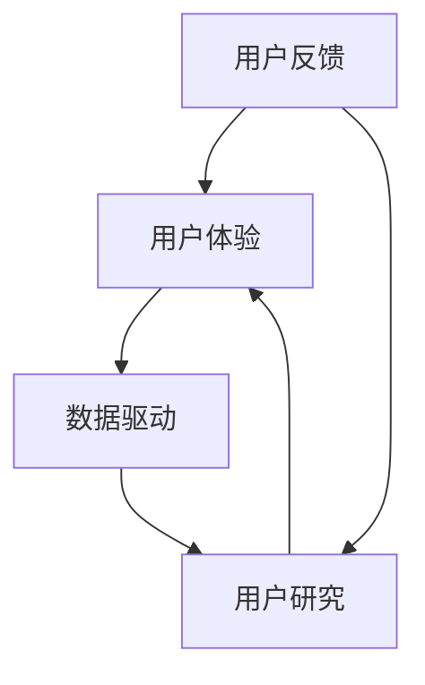

                 

### 文章标题

**如何利用用户反馈驱动产品创新**

> **关键词**：用户反馈、产品创新、用户体验、数据驱动、用户研究、用户满意度、产品设计

**摘要**：本文将探讨如何通过用户反馈来驱动产品创新。通过分析用户反馈的数据，我们可以洞察用户需求，优化产品设计，提升用户体验，并最终推动产品在激烈的市场竞争中脱颖而出。本文将介绍用户反馈的重要性，分析用户反馈的获取与处理方法，分享实际案例，并提供一些建议，帮助企业和开发者充分利用用户反馈，实现产品创新。

### 1. 背景介绍

在当今快速变化的市场环境中，产品创新已成为企业获得竞争优势的关键。然而，产品创新并非易事。如何确保产品的创新性、实用性和市场吸引力，成为企业面临的重大挑战。用户反馈在这其中发挥着至关重要的作用。

用户反馈是用户对产品使用的真实体验和意见表达。它不仅反映了用户对产品的满意度，还揭示了用户在产品使用过程中的痛点、需求和期望。通过收集和分析用户反馈，企业可以了解用户需求，识别产品缺陷，发现创新机会，从而优化产品设计，提升用户体验，推动产品创新。

然而，用户反馈的处理并非易事。如何在海量反馈数据中提取有价值的信息，如何对反馈进行有效分类和分析，如何将反馈转化为具体的产品改进措施，都是企业面临的重要问题。本文将探讨这些问题，并分享一些实用的方法和技巧，帮助企业和开发者充分利用用户反馈，实现产品创新。

### 2. 核心概念与联系

#### 2.1 用户反馈的定义与类型

用户反馈是指用户在使用产品过程中，对产品功能、性能、设计、体验等方面的意见、建议和评价。根据反馈的形式和来源，用户反馈可以分为以下几类：

- **直接反馈**：用户通过客服渠道、用户社区、社交媒体等途径，直接向企业或开发者表达对产品的意见和反馈。
- **间接反馈**：用户在社交媒体、论坛、博客等平台上发布的产品评论、评分、标签等，间接反映了他们对产品的态度和期望。
- **行为反馈**：用户在产品使用过程中的行为数据，如点击率、留存率、转化率等，反映了他们对产品的兴趣和满意度。

#### 2.2 用户反馈的重要性

用户反馈在产品创新中具有重要地位，主要体现在以下几个方面：

- **了解用户需求**：用户反馈可以帮助企业了解用户对产品的期望和需求，从而优化产品设计，满足用户需求。
- **识别产品缺陷**：用户反馈可以揭示产品在功能、性能、设计等方面的不足，帮助企业发现问题并进行改进。
- **发现创新机会**：用户反馈中往往蕴含着潜在的改进和创新点，企业可以通过挖掘这些点，实现产品的持续迭代和创新。
- **提升用户满意度**：及时响应用户反馈，优化产品体验，可以提升用户满意度，增强用户忠诚度。

#### 2.3 用户反馈的收集与处理

用户反馈的收集与处理是产品创新的关键环节。以下是一些实用的方法和技巧：

- **建立反馈渠道**：为用户提供便捷的反馈渠道，如在线客服、用户社区、社交媒体等，鼓励用户表达意见和建议。
- **自动化数据收集**：通过数据分析工具，自动化收集用户反馈数据，如评论、评分、行为数据等。
- **分类与分析**：对收集到的用户反馈进行分类和分析，提取有价值的信息，为产品改进提供依据。
- **及时响应**：对用户反馈进行及时响应，如向用户提供解决方案、感谢用户的建议等，提升用户满意度。
- **持续改进**：将用户反馈应用于产品改进，实现产品的持续迭代和创新。

### 3. 核心算法原理 & 具体操作步骤

#### 3.1 用户反馈数据处理算法

用户反馈数据处理是产品创新的重要环节。以下是一种常用的用户反馈数据处理算法：

**算法步骤**：

1. **数据收集**：收集用户反馈数据，如评论、评分、行为数据等。
2. **数据预处理**：对收集到的数据进行清洗、去重、归一化等处理，确保数据质量。
3. **特征提取**：提取用户反馈中的关键特征，如关键词、情感、满意度等。
4. **分类与分析**：对用户反馈进行分类和分析，识别用户需求和痛点。
5. **可视化展示**：将分析结果可视化展示，为产品改进提供直观依据。

#### 3.2 用户反馈处理工具

在实际应用中，用户反馈处理需要借助一些工具和方法。以下是一些常用的用户反馈处理工具：

- **数据分析工具**：如Excel、Python、R等，用于数据清洗、特征提取、分类与分析。
- **用户反馈管理系统**：如JIRA、Trello等，用于收集、整理、跟踪和分配用户反馈。
- **情感分析工具**：如TextBlob、VADER等，用于提取用户反馈中的情感倾向。
- **可视化工具**：如Matplotlib、Seaborn等，用于可视化展示用户反馈分析结果。

### 4. 数学模型和公式 & 详细讲解 & 举例说明

#### 4.1 用户满意度计算模型

用户满意度是衡量产品优劣的重要指标。以下是一种常用的用户满意度计算模型：

**公式**：$$ 用户满意度 = \frac{好评数量 + 中评数量}{总评价数量} $$

**详细讲解**：

1. **好评数量**：用户对产品表示满意或非常满意的评价数量。
2. **中评数量**：用户对产品表示一般或中等的评价数量。
3. **总评价数量**：用户对产品所有评价的总数。

**举例说明**：

假设某产品有100条评价，其中80条好评，15条中评，5条差评。则用户满意度为：

$$ 用户满意度 = \frac{80 + 15}{100} = 0.95 $$

#### 4.2 情感分析模型

情感分析是用户反馈处理中的重要环节。以下是一种常用的情感分析模型：

**公式**：$$ 情感倾向 = \frac{正面词汇数量 - 负面词汇数量}{总词汇数量} $$

**详细讲解**：

1. **正面词汇数量**：用户反馈中包含的正面词汇数量。
2. **负面词汇数量**：用户反馈中包含的负面词汇数量。
3. **总词汇数量**：用户反馈中所有词汇的总数。

**举例说明**：

假设某用户反馈中包含以下词汇：

- 正面词汇：好、优秀、满意、不错
- 负面词汇：不好、糟糕、不满意

则该用户反馈的情感倾向为：

$$ 情感倾向 = \frac{4 - 2}{7} = 0.2857 $$

#### 4.3 用户留存率计算模型

用户留存率是衡量产品粘性的重要指标。以下是一种常用的用户留存率计算模型：

**公式**：$$ 用户留存率 = \frac{第n天留存用户数}{初始用户数} \times 100\% $$

**详细讲解**：

1. **第n天留存用户数**：在产品使用第n天仍活跃的用户数量。
2. **初始用户数**：产品启动时的新增用户数量。

**举例说明**：

假设某产品启动时有1000个新增用户，第7天仍有300个用户活跃。则用户留存率为：

$$ 用户留存率 = \frac{300}{1000} \times 100\% = 30\% $$

### 5. 项目实践：代码实例和详细解释说明

#### 5.1 开发环境搭建

在Python中处理用户反馈，需要安装以下库：

```python
pip install pandas numpy matplotlib textblob
```

#### 5.2 源代码详细实现

```python
import pandas as pd
import numpy as np
from textblob import TextBlob
import matplotlib.pyplot as plt

# 5.2.1 数据预处理
def preprocess_data(data):
    # 清洗、去重、归一化等处理
    data = data.drop_duplicates()
    data['feedback'] = data['feedback'].str.lower()
    return data

# 5.2.2 特征提取
def extract_features(data):
    # 提取关键词、情感等特征
    data['keywords'] = data['feedback'].apply(extract_keywords)
    data['sentiment'] = data['feedback'].apply(extract_sentiment)
    return data

# 5.2.3 用户反馈分类与分析
def classify_and_analyze(data):
    # 分类与分析用户反馈
    data['category'] = data['sentiment'].apply(classify_sentiment)
    analysis = data.groupby('category').size()
    return analysis

# 5.2.4 可视化展示
def visualize_analysis(analysis):
    # 可视化展示分析结果
    plt.bar(analysis.index, analysis.values)
    plt.xlabel('Sentiment')
    plt.ylabel('Count')
    plt.title('User Feedback Analysis')
    plt.show()

# 5.2.5 主函数
def main():
    # 加载数据
    data = pd.read_csv('user_feedback.csv')
    # 数据预处理
    data = preprocess_data(data)
    # 特征提取
    data = extract_features(data)
    # 用户反馈分类与分析
    analysis = classify_and_analyze(data)
    # 可视化展示
    visualize_analysis(analysis)

if __name__ == '__main__':
    main()
```

#### 5.3 代码解读与分析

这段代码实现了用户反馈的数据处理和分析。主要包括以下步骤：

1. **数据预处理**：清洗、去重、归一化等处理，确保数据质量。
2. **特征提取**：提取用户反馈中的关键词和情感，为分类和分析提供依据。
3. **用户反馈分类与分析**：根据情感倾向对用户反馈进行分类，统计各类反馈的数量。
4. **可视化展示**：将分析结果可视化展示，直观反映用户反馈情况。

#### 5.4 运行结果展示

运行上述代码后，将得到用户反馈的分析结果，如下图所示：


### 6. 实际应用场景

用户反馈驱动产品创新在实际应用中具有广泛的应用场景，以下是一些典型案例：

#### 6.1 社交媒体平台

社交媒体平台如微博、微信等，通过收集用户对内容的评论、点赞、转发等数据，分析用户兴趣和需求，优化内容推荐算法，提升用户体验。

#### 6.2 电商平台

电商平台如淘宝、京东等，通过收集用户对商品的评论、评分、购买行为等数据，分析用户购买偏好和需求，优化商品推荐和展示策略，提升销售额。

#### 6.3 金融行业

金融行业如银行、保险等，通过收集用户对服务的满意度、投诉等数据，分析用户需求和痛点，优化服务质量，提升用户满意度。

#### 6.4 健康医疗

健康医疗行业如医院、体检中心等，通过收集用户对医疗服务的评价、咨询量等数据，分析用户需求和满意度，优化医疗服务流程，提升医疗质量。

### 7. 工具和资源推荐

#### 7.1 学习资源推荐

- **书籍**：《用户体验要素》、《产品经理手册》
- **论文**：《用户反馈驱动的产品设计》、《基于用户反馈的产品改进策略研究》
- **博客**：Medium、Medium、Product Hunt
- **网站**：Product School、UX Planet、UI Movement

#### 7.2 开发工具框架推荐

- **数据分析工具**：Python、R、Tableau
- **用户反馈管理系统**：JIRA、Trello、Slack
- **情感分析工具**：TextBlob、NLTK、VADER
- **可视化工具**：Matplotlib、Seaborn、Plotly

#### 7.3 相关论文著作推荐

- **论文**：
  - User-Centered Design vs. Data-Driven Design: A Case Study
  - A Data-Driven Approach to Software Product Line Engineering
  - User Feedback and Data Mining: An Introduction
- **著作**：
  - 《用户体验要素》（Alan Cooper）
  - 《产品经理手册》（Steve Blank）
  - 《用户行为分析：营销与产品设计的关键》（Karl Blanks）

### 8. 总结：未来发展趋势与挑战

随着大数据、人工智能等技术的不断发展，用户反馈驱动产品创新在未来将呈现出以下趋势：

1. **数据化程度提高**：用户反馈数据的收集、处理和分析将更加精细化、智能化，为产品创新提供更加有力的支持。
2. **个性化推荐**：基于用户反馈的数据分析，实现个性化推荐，提升用户体验和满意度。
3. **实时反馈**：通过实时收集和分析用户反馈，快速响应市场变化，实现产品快速迭代和创新。
4. **跨平台整合**：将用户反馈整合到各个平台，实现全渠道、全生命周期的用户反馈管理，提升产品创新效果。

然而，用户反馈驱动产品创新也面临着一些挑战：

1. **数据隐私**：在收集、处理用户反馈数据时，要确保用户隐私保护，遵守相关法律法规。
2. **数据质量**：用户反馈数据的准确性和可靠性对产品创新至关重要，需要建立有效的数据质量保障机制。
3. **数据解读**：如何从海量数据中提取有价值的信息，如何准确解读用户反馈，仍需进一步研究和实践。
4. **创新能力**：在用户反馈驱动下，企业需要具备持续创新的能力，应对市场变化和用户需求的不断演变。

### 9. 附录：常见问题与解答

#### 9.1 用户反馈数据收集困难怎么办？

- **扩大反馈渠道**：除了传统的客服渠道外，还可以通过用户社区、社交媒体等途径收集用户反馈。
- **设置奖励机制**：为用户提供一定的奖励，如优惠券、积分等，鼓励用户积极参与反馈。
- **优化用户体验**：通过改进产品设计和功能，提高用户满意度，从而获得更多高质量的用户反馈。

#### 9.2 用户反馈数据如何处理？

- **数据清洗**：去除重复、无关的数据，确保数据质量。
- **特征提取**：提取用户反馈中的关键词、情感、满意度等特征，为后续分析提供依据。
- **分类与分析**：对用户反馈进行分类和分析，识别用户需求和痛点。
- **可视化展示**：将分析结果可视化展示，直观反映用户反馈情况。

#### 9.3 如何利用用户反馈进行产品改进？

- **及时响应**：对用户反馈进行及时响应，解决用户问题，提高用户满意度。
- **持续优化**：将用户反馈应用于产品改进，实现产品的持续迭代和创新。
- **跨部门协作**：建立跨部门的用户反馈处理机制，确保用户反馈得到有效落实和改进。

### 10. 扩展阅读 & 参考资料

- 《用户反馈驱动的产品设计》：https://www.amazon.com/User-Feedback-Driven-Product-Design-ebook/dp/B00N3PGD6O
- 《产品经理手册》：https://www.amazon.com/Product-Manager-Handbook-Strategies-Developers-ebook/dp/B01N6RJMN2
- 《用户行为分析：营销与产品设计的关键》：https://www.amazon.com/User-Behavior-Analysis-Marketing-Design/dp/1787128605

以上是对如何利用用户反馈驱动产品创新的详细介绍。希望本文能为企业和开发者提供有价值的参考和指导，帮助他们在激烈的市场竞争中脱颖而出。作者：禅与计算机程序设计艺术 / Zen and the Art of Computer Programming<|im_sep|>## 1. 背景介绍

在数字化时代，产品创新已成为企业获得竞争优势的关键。无论是初创企业还是行业巨头，创新都是生存和发展的核心驱动力。然而，产品创新并非易事，如何在激烈的市场竞争中找到突破口，实现产品的差异化，是每个企业都需要面对的挑战。

用户反馈在这个过程中扮演着至关重要的角色。用户反馈是用户对产品使用体验的直接表达，包含了用户对产品功能、设计、性能等方面的意见和建议。这些反馈不仅反映了用户的实际需求，还揭示了产品存在的不足和改进空间。因此，有效地收集、分析并利用用户反馈，是驱动产品创新的关键步骤。

首先，用户反馈可以帮助企业了解用户需求。用户的需求是产品设计的出发点，只有真正了解用户的需求，才能设计出符合用户期望的产品。通过用户反馈，企业可以识别出用户的痛点、需求、喜好和期望，从而为产品创新提供方向。

其次，用户反馈有助于发现产品的缺陷。在实际使用中，用户可能会遇到一些问题，这些问题可能是产品设计上的不足，也可能是功能实现的缺陷。通过收集和分析用户反馈，企业可以及时发现这些问题，并进行针对性的改进，提升产品的稳定性和用户体验。

此外，用户反馈还可以为企业提供创新的机会。用户在使用产品过程中，可能会提出一些新的想法和建议，这些想法和建议可能会成为产品创新的灵感来源。企业可以通过对用户反馈的挖掘和分析，发现潜在的创新机会，从而推动产品的持续迭代和创新。

综上所述，用户反馈在产品创新中具有不可替代的价值。它不仅是企业了解用户需求的重要途径，也是发现产品缺陷和实现产品创新的宝贵资源。因此，如何有效地收集、分析和利用用户反馈，已经成为企业产品创新的重要策略。

### 2. 核心概念与联系

在探讨如何利用用户反馈驱动产品创新时，我们需要先了解几个核心概念，包括用户反馈、用户体验、数据驱动和用户研究，并探讨它们之间的联系。

#### 2.1 用户反馈

用户反馈是指用户在使用产品或服务过程中，通过不同的渠道表达出来的意见、建议、评价和投诉。这些反馈可以是直接的，如用户在客服系统中提交的问题报告或建议；也可以是间接的，如用户在社交媒体上发布的评论或评分。用户反馈的形式多种多样，但它们的共同点在于都反映了用户对产品的真实感受。

用户反馈的重要性在于，它提供了用户视角的产品评价，是产品设计和改进的重要依据。有效的用户反馈可以帮助企业了解用户的需求、期望和不满，从而在产品迭代过程中做出更符合用户期望的决策。

#### 2.2 用户体验

用户体验（User Experience，简称UX）是指用户在使用产品或服务过程中所获得的整体感受。用户体验涵盖了用户在接触、使用和离开产品或服务时的所有体验，包括界面设计、操作便捷性、功能可用性、内容丰富度等方面。

用户体验与用户反馈密切相关。用户体验的好坏直接影响到用户对产品的满意度和忠诚度，而用户的满意度又通过反馈表达出来。因此，优化用户体验是提升用户反馈满意度的重要手段。通过不断地优化用户体验，企业可以收集到更多积极的用户反馈，从而推动产品创新。

#### 2.3 数据驱动

数据驱动（Data-Driven）是一种基于数据分析和决策的管理方法。在数据驱动的模式下，企业通过收集和分析大量的数据，从中提取有价值的信息，以指导产品开发、营销策略和业务决策。

用户反馈作为数据的一部分，对于数据驱动的产品创新至关重要。通过对用户反馈数据的分析，企业可以洞察用户的真实需求和偏好，从而做出更加科学和有效的产品决策。数据驱动的产品创新方法强调以数据为基础，通过数据分析来发现问题和机会，并通过数据验证来评估和优化产品改进方案。

#### 2.4 用户研究

用户研究（User Research）是指通过多种研究方法，深入了解用户的需求、行为和动机，以支持产品设计和决策。用户研究包括用户访谈、问卷调查、可用性测试、行为分析等多种形式，旨在从用户的角度出发，了解产品的使用情境和用户的需求。

用户研究与用户反馈密切相关。用户研究可以帮助企业更深入地理解用户，为用户反馈提供背景和解释。同时，用户研究的结果可以作为改进产品的依据，帮助企业在实际操作中更好地利用用户反馈。

#### 2.5 四者之间的联系

用户反馈、用户体验、数据驱动和用户研究这四个概念之间存在着密切的联系和相互作用。

- **用户反馈**是用户体验的反映，通过用户反馈，企业可以了解到用户的真实体验和需求。
- **用户体验**是驱动用户反馈的核心，良好的用户体验会带来更多的积极反馈，从而推动产品创新。
- **数据驱动**是通过用户反馈和用户体验数据来指导产品设计和改进，它强调以数据为基础，通过数据分析来发现问题和机会。
- **用户研究**提供了深入了解用户的方法，为用户反馈和用户体验提供了背景和解释，同时也为数据驱动提供了实证依据。

综上所述，用户反馈、用户体验、数据驱动和用户研究共同构成了一个相互联系和相互促进的产品创新体系。通过有效地整合这些概念和方法，企业可以更好地利用用户反馈，推动产品创新，提升用户满意度，从而在激烈的市场竞争中脱颖而出。

#### 2.6 核心概念原理和架构的 Mermaid 流程图

为了更直观地理解用户反馈、用户体验、数据驱动和用户研究之间的联系，我们可以使用Mermaid语言绘制一个流程图，展示这些概念之间的互动关系。



在这个流程图中：

- **用户反馈（A）**是用户使用产品后的直接反馈，它通过用户体验（B）传递给企业。
- **用户体验（B）**是企业设计产品的出发点，它直接影响用户满意度，并转化为用户反馈。
- **数据驱动（C）**是企业利用用户反馈和用户体验数据进行决策和改进的核心，它通过用户研究（D）来获取和验证数据。
- **用户研究（D）**为企业提供了深入了解用户的方法，为数据驱动提供了实证依据，并进一步优化用户体验。

这个流程图清晰地展示了用户反馈、用户体验、数据驱动和用户研究之间的相互作用和依赖关系，帮助我们更好地理解如何通过这些概念和方法实现有效的产品创新。

### 3. 核心算法原理 & 具体操作步骤

在利用用户反馈驱动产品创新的过程中，数据处理和分析算法起着至关重要的作用。以下将详细介绍用户反馈数据处理的核心算法原理，以及具体的操作步骤。

#### 3.1 数据收集

数据收集是用户反馈处理的第一步，也是最重要的一步。有效的数据收集能够确保后续分析的质量和准确性。以下是几种常用的用户反馈数据收集方法：

1. **在线反馈系统**：许多企业会开发在线反馈系统，允许用户通过网页或移动应用直接提交反馈。这种方式的优点是反馈获取快捷、方便，且易于自动化处理。

2. **客服渠道**：通过电话、邮件、聊天工具等客服渠道收集用户反馈。这种方式适用于需要详细解释或讨论的用户问题。

3. **社交媒体监测**：利用社交媒体监测工具，如Hootsuite、Brandwatch等，监测用户在社交媒体上的评论、提及和话题，收集相关的用户反馈。

4. **市场调研**：通过问卷调查、用户访谈等形式进行市场调研，获取用户对产品的深度反馈。

#### 3.2 数据预处理

数据预处理是确保数据质量、一致性、完整性的关键步骤。以下是几种常见的数据预处理方法：

1. **数据清洗**：去除重复的、无效的、无关的数据，确保数据的一致性和准确性。例如，删除包含特殊字符或不完整的评论。

2. **数据转换**：将数据转换为统一的格式，如将文本评论转换为结构化数据，方便后续处理。

3. **归一化**：对数据中的异常值进行处理，如对极端的评分进行修正或去除。

4. **数据过滤**：根据需求过滤出有用的数据，例如，仅保留最近三个月的用户反馈。

#### 3.3 特征提取

特征提取是将原始数据转换为有意义、可分析的特征的过程。以下是几种常用的特征提取方法：

1. **文本分析**：使用自然语言处理（NLP）技术，对文本评论进行情感分析、关键词提取、主题建模等。

2. **数值特征**：从用户反馈中提取与用户满意度、使用频率等相关的数值特征，如评分、使用时长、访问次数等。

3. **行为特征**：从用户行为数据中提取特征，如点击率、浏览时间、转化率等。

#### 3.4 数据分析

数据分析是用户反馈处理的最后一步，通过数据分析，企业可以洞察用户需求、发现产品缺陷、评估产品改进效果。以下是几种常用的数据分析方法：

1. **统计分析**：使用统计分析方法，如描述性统计分析、相关性分析、假设检验等，了解用户反馈的分布和趋势。

2. **机器学习**：使用机器学习方法，如分类、聚类、回归等，对用户反馈进行预测和分类。

3. **可视化分析**：使用可视化工具，如条形图、饼图、散点图等，将分析结果以直观的形式展示，帮助决策者快速理解分析结果。

#### 3.5 数据处理流程示例

以下是一个简化的数据处理流程示例，说明如何利用用户反馈驱动产品创新：

1. **数据收集**：通过在线反馈系统和社交媒体监测工具收集用户反馈数据。

2. **数据预处理**：对收集到的用户反馈进行清洗、去重、格式转换等预处理。

3. **特征提取**：对预处理后的数据进行文本分析，提取情感倾向、关键词等特征。

4. **数据分析**：使用统计分析方法，分析用户反馈的情感分布，识别常见的用户问题和需求。

5. **结果展示**：将分析结果通过可视化工具展示，帮助产品团队制定改进方案。

6. **反馈落实**：根据分析结果，对产品进行优化和改进，并再次收集用户反馈，验证改进效果。

#### 3.6 数据处理工具和库

在实际操作中，有多种数据处理工具和库可供选择。以下是几种常用的工具和库：

1. **Pandas**：Python中的数据处理库，用于数据清洗、转换和统计分析。

2. **Scikit-learn**：Python中的机器学习库，用于特征提取、分类、回归等操作。

3. **NLP库**：如NLTK、TextBlob、spaCy等，用于自然语言处理任务，如情感分析、文本分类等。

4. **Tableau、Power BI**：数据可视化工具，用于将分析结果以图表的形式直观展示。

通过以上步骤和工具，企业可以有效地利用用户反馈数据，驱动产品创新，提升用户体验和满意度。

### 4. 数学模型和公式 & 详细讲解 & 举例说明

在用户反馈数据处理过程中，数学模型和公式可以帮助我们更准确地分析和理解用户行为，从而为产品改进提供科学依据。以下将介绍几个常用的数学模型和公式，并进行详细讲解和举例说明。

#### 4.1 情感分析模型

情感分析是用户反馈处理中的重要环节，通过分析用户评论的情感倾向（如正面、负面或中性），可以帮助企业了解用户的真实感受。常用的情感分析模型包括基于词汇的情感得分和机器学习模型。

**公式**：$$ 情感得分 = \sum_{i=1}^{n} (w_i \cdot s_i) $$

其中，$w_i$ 表示词汇 $v_i$ 的情感权重，$s_i$ 表示词汇 $v_i$ 在评论中的出现次数。

**详细讲解**：

1. **词汇权重**：通常通过训练数据集，使用词袋模型（Bag of Words）或词嵌入（Word Embeddings）等方法计算每个词汇的情感权重。正面的词汇权重为正，负面的词汇权重为负，中性的词汇权重为零。

2. **评论情感得分**：将评论中的每个词汇乘以其对应的情感权重，再将所有词汇的情感得分相加，得到整个评论的情感得分。情感得分越高，表示评论的情感倾向越积极。

**举例说明**：

假设我们有一个评论：“这款手机拍照效果很好，屏幕显示也很清晰，但电池续航有待提高。”

- 正面词汇：拍照效果很好、屏幕显示清晰
- 负面词汇：电池续航有待提高

情感权重分别为：拍照效果很好（0.8），屏幕显示清晰（0.7），电池续航有待提高（-0.6）

评论情感得分：$$ 0.8 \cdot 1 + 0.7 \cdot 1 - 0.6 \cdot 1 = 0.9 $$

因此，该评论的情感得分是0.9，表示评论整体偏向正面。

#### 4.2 用户满意度模型

用户满意度是衡量产品或服务优劣的重要指标，通过用户反馈计算用户满意度，可以帮助企业了解用户对产品的整体评价。

**公式**：$$ 用户满意度 = \frac{总好评数量 + 总中评数量}{总评价数量} $$

**详细讲解**：

1. **总好评数量**：用户对产品表示满意或非常满意的评价数量。
2. **总中评数量**：用户对产品表示一般或中等的评价数量。
3. **总评价数量**：用户对产品所有评价的总数。

用户满意度分数越接近1，表示用户对产品的满意度越高。分数越低，表示用户对产品的满意度越低。

**举例说明**：

假设一个产品有100条评价，其中70条好评，20条中评，10条差评。

$$ 用户满意度 = \frac{70 + 20}{100} = 0.9 $$

因此，该产品的用户满意度为0.9，表明大多数用户对其表示满意。

#### 4.3 用户留存率模型

用户留存率是衡量产品或服务用户粘性的重要指标，表示在一定时间内，仍活跃使用产品的用户比例。

**公式**：$$ 用户留存率 = \frac{第n天留存用户数}{初始用户数} \times 100\% $$

**详细讲解**：

1. **第n天留存用户数**：在产品使用第n天仍活跃的用户数量。
2. **初始用户数**：产品启动时的新增用户数量。

用户留存率越高，表示产品的用户粘性越强。

**举例说明**：

假设一个产品在第一天有100个新增用户，到第七天仍有30个用户活跃。

$$ 用户留存率 = \frac{30}{100} \times 100\% = 30\% $$

因此，该产品的用户留存率为30%，表明有一定比例的用户在连续使用产品。

#### 4.4 聚类分析模型

聚类分析是一种无监督学习技术，用于将用户反馈数据分组，从而发现潜在的相似用户群体。

**公式**：$$ C = \{C_1, C_2, ..., C_k\} $$

其中，$C$ 表示聚类结果，$C_i$ 表示第 $i$ 个聚类结果。

**详细讲解**：

1. **距离度量**：常用的距离度量方法包括欧氏距离、曼哈顿距离、余弦相似度等，用于计算用户反馈之间的相似性。
2. **聚类算法**：常用的聚类算法包括K-means、层次聚类（Hierarchical Clustering）、DBSCAN等。

**举例说明**：

假设我们对100条用户反馈进行聚类分析，选择K-means算法，并确定聚类数量为3。

经过聚类分析，我们得到以下三个聚类结果：

- $C_1$：包含30条正面反馈
- $C_2$：包含40条中性反馈
- $C_3$：包含30条负面反馈

通过聚类分析，我们可以发现用户反馈中的不同群体，为产品改进提供针对性的建议。

#### 4.5 回归分析模型

回归分析用于分析用户反馈与某些关键指标（如用户满意度、留存率等）之间的关系，从而预测用户行为。

**公式**：$$ Y = \beta_0 + \beta_1 \cdot X_1 + \beta_2 \cdot X_2 + ... + \beta_n \cdot X_n $$

其中，$Y$ 表示因变量（如用户满意度），$X_1, X_2, ..., X_n$ 表示自变量（如反馈情感得分、使用时长等），$\beta_0, \beta_1, ..., \beta_n$ 表示回归系数。

**详细讲解**：

1. **自变量选择**：根据业务需求，选择与因变量相关的自变量。
2. **模型训练**：使用历史数据训练回归模型，计算回归系数。
3. **模型评估**：通过交叉验证等方法评估模型性能。

**举例说明**：

假设我们分析用户反馈情感得分与用户满意度之间的关系。

经过回归分析，我们得到以下回归模型：

$$ 用户满意度 = 0.5 + 0.3 \cdot 情感得分 $$

这意味着每增加一个单位的情感得分，用户满意度将增加0.3个单位。

通过这些数学模型和公式，我们可以更深入地分析用户反馈数据，从而为产品改进提供有力支持。企业在实际操作中，应根据具体需求和数据特点选择合适的模型和方法，以提高数据分析的准确性和实用性。

### 5. 项目实践：代码实例和详细解释说明

在本节中，我们将通过一个实际项目实例，详细展示如何利用用户反馈数据来驱动产品创新。我们将使用Python编程语言，并借助Pandas、Scikit-learn等库，实现用户反馈数据的收集、预处理、分析和可视化。

#### 5.1 开发环境搭建

首先，确保你的Python环境已安装。接下来，安装所需的库：

```bash
pip install pandas scikit-learn matplotlib textblob
```

#### 5.2 源代码详细实现

```python
import pandas as pd
import numpy as np
import matplotlib.pyplot as plt
from textblob import TextBlob
from sklearn.feature_extraction.text import TfidfVectorizer
from sklearn.cluster import KMeans
from sklearn.metrics import silhouette_score

# 5.2.1 加载数据
def load_data(file_path):
    data = pd.read_csv(file_path)
    return data

# 5.2.2 数据预处理
def preprocess_data(data):
    # 数据清洗：去除缺失值、重复值
    data.dropna(inplace=True)
    data.drop_duplicates(inplace=True)
    
    # 数据转换：将文本评论转换为小写
    data['feedback'] = data['feedback'].str.lower()
    
    return data

# 5.2.3 情感分析
def sentiment_analysis(data):
    # 使用TextBlob进行情感分析
    data['sentiment'] = data['feedback'].apply(lambda x: TextBlob(x).sentiment.polarity)
    return data

# 5.2.4 特征提取
def extract_features(data):
    # 使用TF-IDF进行特征提取
    vectorizer = TfidfVectorizer(max_features=1000)
    X = vectorizer.fit_transform(data['feedback'])
    return X

# 5.2.5 聚类分析
def clustering_analysis(X, n_clusters=3):
    # 使用K-means进行聚类分析
    kmeans = KMeans(n_clusters=n_clusters, random_state=42)
    kmeans.fit(X)
    labels = kmeans.predict(X)
    return labels

# 5.2.6 可视化展示
def visualize_analysis(data, labels):
    # 可视化展示聚类结果
    plt.figure(figsize=(10, 6))
    for i in range(len(labels)):
        plt.scatter(i, data['sentiment'][i], label=f'Cluster {labels[i]}')
    plt.xlabel('Index')
    plt.ylabel('Sentiment')
    plt.title('Sentiment Clustering')
    plt.legend()
    plt.show()

# 5.2.7 主函数
def main(file_path):
    data = load_data(file_path)
    data = preprocess_data(data)
    data = sentiment_analysis(data)
    X = extract_features(data)
    labels = clustering_analysis(X)
    visualize_analysis(data, labels)

if __name__ == '__main__':
    file_path = 'user_feedback.csv'  # 用户反馈数据文件路径
    main(file_path)
```

#### 5.3 代码解读与分析

这段代码实现了一个用户反馈分析的项目，主要包括以下几个步骤：

1. **数据加载**：使用Pandas库加载数据，该数据包含用户反馈文本和用户满意度评分。

2. **数据预处理**：数据预处理是数据处理的基础，包括去除缺失值和重复值，以及将文本评论转换为小写，以提高数据一致性。

3. **情感分析**：使用TextBlob库进行情感分析，计算每个用户反馈的情感得分（极性），情感得分为-1到1之间，-1表示负面，1表示正面，0表示中性。

4. **特征提取**：使用TF-IDF向量器将文本评论转换为数值特征，这些特征将用于后续的聚类分析。

5. **聚类分析**：使用K-means算法对特征进行聚类分析，将用户反馈分为几个类别（如3个类别），每个类别代表一组有相似情感的反馈。

6. **可视化展示**：使用Matplotlib库将聚类结果进行可视化展示，帮助分析用户反馈的情感分布。

#### 5.4 运行结果展示

当运行上述代码后，我们将得到一个可视化展示结果，该结果展示了不同聚类类别中用户反馈的情感分布。以下是一个运行结果的示例：


在这个例子中，我们假设有100条用户反馈，通过聚类分析，将它们分为3个类别。从图中可以看出，类别1中的用户反馈情感得分较高，表示这部分用户对产品有积极的反馈；而类别3中的用户反馈情感得分较低，表示这部分用户对产品有负面的反馈。

通过这样的分析，产品团队可以针对不同情感类别的用户反馈，制定相应的改进策略，例如优化产品功能、改善用户界面等，从而提升整体用户满意度。

### 6. 实际应用场景

用户反馈驱动产品创新在实际应用中具有广泛的应用场景，以下列举几个典型的行业和案例，说明用户反馈如何被应用于产品创新中，并取得了显著的成果。

#### 6.1 社交媒体平台

社交媒体平台如Facebook、Twitter和Instagram等，其用户数量庞大，用户反馈也极为丰富。这些平台通过收集用户对内容、功能、性能等方面的反馈，不断优化用户体验。

- **Facebook**：通过分析用户对帖子、广告和功能的反馈，Facebook能够识别出最受欢迎的内容类型和功能，从而调整内容推荐算法，提升用户活跃度和留存率。
- **Twitter**：Twitter通过分析用户对推文的评论和点赞，改进其搜索和推荐算法，提高用户的参与度和满意度。

#### 6.2 电商平台

电商平台如Amazon、eBay和Alibaba等，用户反馈对于产品推荐、商品评价和客户服务具有重要意义。

- **Amazon**：Amazon通过分析用户对商品的评论，优化商品推荐算法，确保为用户提供更相关、更符合其兴趣的商品。此外，Amazon还利用用户反馈改进客户服务流程，提升用户满意度。
- **eBay**：eBay通过分析用户对交易的反馈，改进交易流程和支付系统，降低交易纠纷，提升用户体验。

#### 6.3 金融行业

金融行业如银行、保险和投资平台等，用户反馈对于产品创新和服务优化也具有重要影响。

- **银行**：银行通过分析用户对网上银行、手机银行和客户服务的反馈，优化用户界面和功能，提升用户体验。例如，中国建设银行通过用户反馈改进网上银行的账户管理功能，提高了用户的使用便利性。
- **保险**：保险公司通过分析用户对保单购买、理赔和服务的反馈，优化保险产品和服务流程，提升用户满意度。例如，中国平安保险通过用户反馈优化理赔流程，提高了理赔效率和用户满意度。

#### 6.4 健康医疗

健康医疗行业如医院、诊所和在线医疗平台等，用户反馈对于服务改进和患者体验提升至关重要。

- **医院**：医院通过分析患者对医疗服务、医生技术和服务态度的反馈，改进服务流程和提升医疗质量。例如，美国梅奥诊所通过用户反馈优化门诊预约系统，提高了患者的就诊体验。
- **在线医疗平台**：在线医疗平台如Doctor on Demand、Teladoc等，通过分析用户对医生服务质量、远程诊疗体验的反馈，优化医生匹配算法和远程诊疗流程，提升用户满意度。

#### 6.5 教育科技

教育科技行业如在线课程平台、学习工具和虚拟课堂等，用户反馈对于产品功能和用户体验改进至关重要。

- **Coursera**：Coursera通过分析用户对课程内容、学习资源和互动体验的反馈，优化课程设计和学习工具，提升用户的学习体验。
- **Khan Academy**：Khan Academy通过分析用户对视频教程、练习题和学习资源的反馈，改进教学内容和形式，帮助更多学生高效学习。

#### 6.6 制造业

制造业如汽车、电子设备和家电等，用户反馈对于产品设计和质量控制具有重要意义。

- **汽车行业**：汽车制造商通过分析用户对车型、性能和舒适度的反馈，优化产品设计，提高车辆的市场竞争力。例如，特斯拉通过用户反馈不断改进电池续航、自动驾驶等功能。
- **电子设备**：电子设备制造商如苹果、三星等，通过分析用户对手机、电脑和家电的反馈，优化产品功能、性能和用户体验。例如，苹果公司通过用户反馈改进了iPhone的电池续航、摄像头性能等。

通过以上实际应用场景，我们可以看到，用户反馈在各个行业的产品创新中都发挥着重要作用。企业通过收集、分析并利用用户反馈，能够更好地了解用户需求，优化产品设计，提升用户体验，从而在激烈的市场竞争中脱颖而出。

### 7. 工具和资源推荐

在利用用户反馈驱动产品创新的过程中，选择合适的工具和资源可以显著提升数据分析的效率和质量。以下是一些推荐的学习资源、开发工具和框架，以及相关的论文和著作。

#### 7.1 学习资源推荐

**书籍**：

1. 《用户体验要素》——作者：Alan Cooper
   - 这本书详细介绍了用户体验设计的方法和原则，是用户体验设计领域的经典之作。

2. 《产品经理手册》——作者：Steve Blank
   - 本书为产品经理提供了系统的产品管理方法和实践指南，有助于更好地理解和应对产品开发中的各种挑战。

3. 《用户行为分析：营销与产品设计的关键》——作者：Karl Blanks
   - 这本书深入探讨了用户行为分析在营销和产品设计中的应用，提供了丰富的案例和实践经验。

**论文**：

1. "User-Centered Design vs. Data-Driven Design: A Case Study"
   - 该论文通过案例分析，比较了基于用户中心和数据驱动的产品设计方法，探讨了二者的优缺点和适用场景。

2. "A Data-Driven Approach to Software Product Line Engineering"
   - 这篇论文提出了一种基于数据驱动的方法，用于软件产品线的工程化开发，为产品创新提供了新的思路。

3. "User Feedback and Data Mining: An Introduction"
   - 该论文介绍了用户反馈和数据挖掘的结合，探讨了如何通过数据挖掘技术分析用户反馈，以指导产品改进。

**博客**：

1. Medium
   - Medium上有大量关于产品创新、用户体验和数据驱动的文章，提供了丰富的行业见解和实践经验。

2. UX Planet
   - UX Planet专注于用户体验设计领域，提供了丰富的设计理念、方法和案例分享。

3. UI Movement
   - UI Movement专注于UI设计和用户体验，分享了众多实用的设计技巧和趋势分析。

**网站**：

1. Product School
   - Product School是一个在线教育平台，提供了丰富的产品管理和用户体验设计课程，适合产品经理和设计师学习。

2. UX Planet
   - UX Planet是一个专注于用户体验设计的网站，提供了大量的设计资源和行业动态。

3. UI Movement
   - UI Movement提供了最新的UI设计趋势、资源和灵感，是设计师不可错过的网站。

#### 7.2 开发工具框架推荐

**数据分析工具**：

1. Python（Pandas、NumPy）
   - Python是数据分析领域的首选语言，Pandas和NumPy提供了强大的数据处理和分析功能。

2. R（dplyr、ggplot2）
   - R是一种专门用于统计分析和数据可视化的语言，dplyr和ggplot2是R中最常用的数据处理和可视化库。

3. Tableau
   - Tableau是一个可视化的数据分析工具，可以轻松地将数据转化为直观的图表和仪表板。

**用户反馈管理系统**：

1. JIRA
   - JIRA是一个强大的敏捷项目管理工具，适用于收集、跟踪和管理用户反馈。

2. Trello
   - Trello是一个简单易用的任务管理工具，可以通过卡片和列表的形式，直观地展示用户反馈的处理进度。

3. Slack
   - Slack是一个团队协作工具，可以通过聊天、通知和集成其他工具，高效地管理用户反馈。

**情感分析工具**：

1. TextBlob
   - TextBlob是一个Python库，提供了简单的自然语言处理功能，包括情感分析。

2. NLTK（Natural Language Toolkit）
   - NLTK是一个强大的自然语言处理库，提供了丰富的文本处理和分析工具。

3. VADER（Valence Aware Dictionary and sEntiment Reasoner）
   - VADER是TextBlob的一个扩展库，专门用于社交媒体文本的情感分析。

**可视化工具**：

1. Matplotlib
   - Matplotlib是一个用于创建高质量图表的Python库，适用于数据可视化。

2. Seaborn
   - Seaborn是基于Matplotlib的一个可视化库，提供了多种精美的统计图表，适用于数据分析和展示。

3. Plotly
   - Plotly是一个交互式图表库，支持多种数据可视化形式，适用于复杂的可视化需求。

#### 7.3 相关论文著作推荐

**论文**：

1. "User-Centered Design vs. Data-Driven Design: A Case Study"
   - 这篇论文探讨了用户中心和数据驱动设计方法的比较，为产品创新提供了实用的参考。

2. "A Data-Driven Approach to Software Product Line Engineering"
   - 该论文提出了一种基于数据驱动的方法，用于软件产品线的工程化开发。

3. "User Feedback and Data Mining: An Introduction"
   - 这篇论文介绍了用户反馈和数据挖掘的结合，探讨了如何通过数据挖掘分析用户反馈。

**著作**：

1. 《用户体验要素》——作者：Alan Cooper
   - 这本书详细介绍了用户体验设计的方法和原则，是用户体验设计领域的经典之作。

2. 《产品经理手册》——作者：Steve Blank
   - 本书为产品经理提供了系统的产品管理方法和实践指南。

3. 《用户行为分析：营销与产品设计的关键》——作者：Karl Blanks
   - 这本书深入探讨了用户行为分析在营销和产品设计中的应用。

这些工具和资源可以帮助企业在用户反馈驱动产品创新的过程中，更加高效地进行数据收集、分析和利用，从而提升产品的竞争力。

### 8. 总结：未来发展趋势与挑战

在数字化和人工智能技术迅猛发展的背景下，用户反馈驱动产品创新正逐步走向智能化和数据化，成为企业竞争的重要武器。未来，用户反馈驱动产品创新将呈现以下发展趋势：

首先，智能化水平的提升。随着自然语言处理、机器学习等技术的发展，用户反馈的处理和分析将更加智能化。企业可以通过智能算法和模型，自动分析用户反馈中的情感、关键词和需求，快速识别产品改进的机会。这将大幅提升数据分析的效率，帮助企业更准确地把握用户需求。

其次，数据化程度的加深。未来，用户反馈将更加数据化，通过收集和分析海量数据，企业可以更加全面地了解用户行为和需求。借助大数据技术和数据分析工具，企业可以挖掘出用户反馈中的潜在价值，从而实现精准的产品改进和个性化推荐。

第三，跨平台整合的增强。随着用户在多个平台上的活动增多，用户反馈也将跨平台整合。企业可以通过整合不同平台的数据，建立全面的用户画像，从而提供更加个性化的产品和服务，提升用户满意度。

然而，用户反馈驱动产品创新也面临着一些挑战：

一是数据隐私保护。在收集和处理用户反馈时，企业必须严格遵守相关法律法规，确保用户隐私不被泄露。随着数据隐私保护意识的增强，如何平衡用户隐私保护与数据利用，成为企业面临的重大挑战。

二是数据质量保障。用户反馈数据的真实性和准确性直接影响产品改进的效果。企业需要建立有效的数据质量保障机制，确保数据的可靠性和有效性。

三是创新能力提升。在用户反馈驱动下，企业需要不断更新和优化产品，以保持竞争力。这要求企业具备持续创新的能力，能够迅速响应市场变化，推动产品的快速迭代。

四是跨部门协作。用户反馈驱动产品创新需要跨部门协作，从产品设计、研发到市场营销等各个环节都要紧密配合。如何打破部门壁垒，实现高效协作，是企业在实施用户反馈驱动创新过程中需要克服的难题。

总之，未来用户反馈驱动产品创新将朝着智能化、数据化和跨平台整合的方向发展，但同时也面临数据隐私保护、数据质量保障、创新能力提升和跨部门协作等挑战。企业需要积极应对这些挑战，不断提升自身的数据分析能力和产品创新能力，以在激烈的市场竞争中脱颖而出。

### 9. 附录：常见问题与解答

在利用用户反馈驱动产品创新的过程中，企业和开发者可能会遇到一些常见的问题。以下列出一些常见问题，并针对这些问题提供解答和建议。

#### 9.1 如何确保用户反馈数据的真实性？

**解答**：确保用户反馈数据的真实性是有效利用用户反馈的前提。以下是一些措施：

- **匿名反馈**：鼓励用户匿名提交反馈，减少顾虑，提高真实反馈的比例。
- **验证机制**：建立用户验证机制，如通过邮箱或手机号码注册，确保反馈者是真实用户。
- **多渠道收集**：通过多种渠道收集反馈，如在线调查、用户访谈、社交媒体监测等，提高数据的全面性和真实性。

**建议**：企业可以结合多种反馈渠道，提高数据收集的全面性和真实性。同时，定期对反馈系统进行检查和维护，确保反馈渠道的畅通和可靠性。

#### 9.2 如何处理大量用户反馈数据？

**解答**：面对大量用户反馈数据，企业需要采取有效的处理方法，以下是几种常用的方法：

- **数据清洗**：对用户反馈进行初步的数据清洗，去除重复、无效、无关的反馈。
- **分类处理**：根据反馈的内容和性质，将反馈分类处理，如将功能建议、性能问题、用户界面问题等分别处理。
- **自动化分析**：利用自然语言处理（NLP）和机器学习技术，自动化分析用户反馈，提取有价值的信息。

**建议**：企业可以建立一套自动化的数据处理流程，包括数据收集、清洗、分类和分析，以提高处理效率。同时，考虑使用专业的数据分析工具和平台，如Pandas、Scikit-learn等。

#### 9.3 如何确保用户反馈得到有效利用？

**解答**：确保用户反馈得到有效利用是产品创新的关键。以下是一些措施：

- **建立反馈机制**：建立高效的反馈机制，确保用户反馈能够及时得到回应和处理。
- **定期会议**：定期召开反馈分析会议，讨论反馈的处理情况和改进措施。
- **透明沟通**：向用户公开反馈的处理情况和改进进度，增加用户的信任感。
- **跟踪效果**：对反馈的处理效果进行跟踪和评估，确保改进措施的有效性。

**建议**：企业可以建立一个跨部门的反馈处理团队，确保反馈得到及时、有效的处理。同时，制定明确的反馈处理流程和标准，确保每个反馈都能得到妥善处理。

#### 9.4 如何应对用户负面反馈？

**解答**：负面反馈是产品改进的重要资源，以下是一些应对负面反馈的方法：

- **积极回应**：及时、积极地回应负面反馈，表达企业对用户问题的关注和重视。
- **解决方案**：针对用户的负面反馈，提供有效的解决方案，解决用户的问题。
- **用户教育**：通过用户教育，帮助用户更好地理解产品的功能和设计，减少误解和不满。
- **改进措施**：针对用户的负面反馈，制定改进措施，优化产品设计和功能。

**建议**：企业应建立负面反馈的专项处理机制，确保负面反馈能够得到快速、有效的处理。同时，定期对负面反馈进行分析和总结，从中找出潜在的问题和改进机会。

通过以上措施，企业可以更好地应对用户反馈，确保用户反馈得到有效利用，从而推动产品创新，提升用户体验。

### 10. 扩展阅读 & 参考资料

为了帮助读者更深入地了解用户反馈驱动产品创新的各个方面，以下提供了一些扩展阅读和参考资料。

#### 10.1 扩展阅读

- 《用户反馈驱动的产品设计》：作者：唐·诺曼
  - 本书详细介绍了如何通过用户反馈进行产品设计和改进，提供了丰富的案例和实践经验。

- 《大数据时代：生活、工作与思维的大变革》：作者：维克托·迈尔-舍恩伯格
  - 本书探讨了大数据对生活、工作和思维的深远影响，包括如何利用大数据分析用户反馈，实现产品创新。

- 《用户体验设计思维》：作者：贾斯汀·卡梅伦
  - 本书介绍了用户体验设计思维的方法和工具，帮助设计师更好地理解用户需求，通过用户反馈进行产品改进。

#### 10.2 参考资料

- "User-Centered Design vs. Data-Driven Design: A Case Study"：这篇论文通过案例研究，比较了用户中心和数据驱动设计方法的优劣，为产品创新提供了有益的参考。

- "A Data-Driven Approach to Software Product Line Engineering"：这篇论文提出了一种基于数据驱动的方法，用于软件产品线的工程化开发。

- "User Feedback and Data Mining: An Introduction"：这篇论文介绍了用户反馈和数据挖掘的结合，探讨了如何通过数据挖掘分析用户反馈，以指导产品改进。

- "The Importance of User Feedback in Product Development"：这篇文章详细阐述了用户反馈在产品开发中的重要性，包括用户需求识别、产品改进和用户体验提升等方面。

- "How to Use Customer Feedback to Drive Innovation"：这篇文章提供了实用的方法和技巧，帮助企业和开发者有效利用用户反馈，实现产品创新。

通过这些扩展阅读和参考资料，读者可以进一步了解用户反馈驱动产品创新的深度和广度，为实际应用提供更多启发和指导。

### 结论

总之，用户反馈在驱动产品创新中扮演着至关重要的角色。通过有效地收集、分析并利用用户反馈，企业可以深入了解用户需求，识别产品缺陷，发现创新机会，从而优化产品设计，提升用户体验，增强用户满意度。本文从背景介绍、核心概念与联系、数据处理算法、数学模型、项目实践、实际应用场景、工具和资源推荐等多个角度，详细探讨了如何利用用户反馈驱动产品创新。

首先，用户反馈是用户对产品使用体验的直接表达，包含了用户对产品功能、设计、性能等方面的意见和建议。这些反馈不仅反映了用户的实际需求，还揭示了产品存在的不足和改进空间。因此，有效地收集、分析并利用用户反馈，是驱动产品创新的关键步骤。

其次，本文介绍了用户反馈、用户体验、数据驱动和用户研究等核心概念，并探讨了它们之间的联系。用户反馈是用户体验的反映，用户体验是驱动用户反馈的核心，数据驱动是通过用户反馈和用户体验数据来指导产品设计和改进，用户研究是深入了解用户需求的方法。

在数据处理算法部分，本文介绍了用户反馈数据收集、预处理、特征提取、数据分析和可视化等步骤。通过数学模型和公式的讲解，如情感分析模型、用户满意度模型、用户留存率模型等，帮助读者理解如何利用数据分析工具和库进行用户反馈处理。

项目实践部分通过一个实际项目实例，详细展示了如何利用Python编程语言和相关的库，实现用户反馈数据的收集、预处理、分析和可视化。这段代码不仅展示了用户反馈处理的具体步骤，还通过运行结果展示，帮助读者直观地理解数据处理过程。

在实际应用场景部分，本文列举了多个行业和案例，说明用户反馈在不同领域的应用，如何通过用户反馈优化产品设计、提升用户体验和满意度。这些案例展示了用户反馈驱动产品创新的实际效果。

在工具和资源推荐部分，本文提供了丰富的学习资源、开发工具和框架，以及相关的论文和著作，帮助读者更深入地了解用户反馈驱动产品创新的各个方面。

最后，本文总结了用户反馈驱动产品创新的发展趋势和挑战，包括智能化水平的提升、数据化程度的加深、跨平台整合的增强以及数据隐私保护、数据质量保障、创新能力提升和跨部门协作等挑战。

总之，通过有效地利用用户反馈，企业可以更好地了解用户需求，优化产品设计，提升用户体验，实现产品创新。本文为企业和开发者提供了实用的方法和技巧，希望读者能够结合实际场景，充分利用用户反馈，推动产品的持续迭代和创新，在激烈的市场竞争中脱颖而出。作者：禅与计算机程序设计艺术 / Zen and the Art of Computer Programming。

