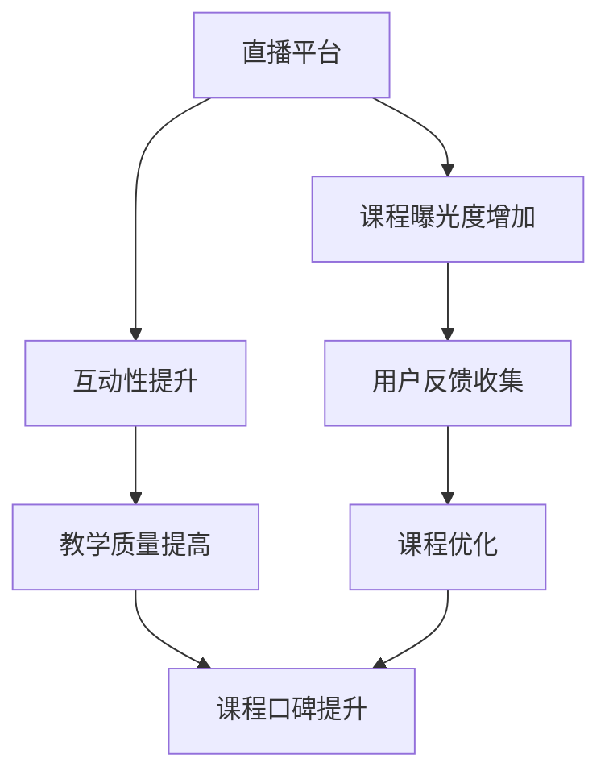

                 

### 1. 背景介绍

随着互联网技术的迅猛发展，直播平台已经成为互联网生态中的重要组成部分。用户规模持续增长，直播行业呈现出多元化的趋势，从娱乐、教育到电商等各个领域都涌现出了大量的直播应用。与此同时，教育培训行业也在利用直播平台进行变革，通过网络直播课程，实现知识的实时传递和互动交流。

然而，课程口碑的建立和维护对于教育培训机构来说至关重要。好的口碑不仅能吸引更多的学生报名学习，还能提升机构的品牌形象和竞争力。在众多教育机构纷纷涌入直播平台的浪潮中，如何利用直播平台增加课程口碑成为一个亟待解决的问题。

本文将探讨如何利用直播平台增加课程口碑，从多个角度提供实用的策略和建议。我们将首先介绍直播平台的基本原理和功能，然后深入分析口碑的构成要素，探讨如何通过直播平台提升课程的互动性和用户体验，最后分享一些成功的案例和实践经验。

通过本文的阅读，读者将了解到：

1. 直播平台的基本概念和运作原理。
2. 课程口碑的构成要素及其重要性。
3. 如何通过直播平台增加课程的互动性和用户体验。
4. 成功利用直播平台增加课程口碑的实践策略。

### 2. 核心概念与联系

#### 直播平台的基本概念和功能

直播平台是指一种允许用户实时观看和参与在线视频内容的服务平台。它的基本概念包括以下几个方面：

1. **主播**：主播是直播平台上的主要角色，他们通过视频、音频、文字等方式与观众互动，提供各种类型的直播内容。
2. **观众**：观众是直播平台的主要用户群体，他们可以实时观看主播的直播内容，并参与互动。
3. **互动功能**：直播平台提供了丰富的互动功能，如实时评论、送礼物、弹幕等，增强了观众与主播之间的互动性。
4. **视频直播**：视频直播是直播平台的核心功能，它通过视频技术实现了实时传输，让用户可以实时观看主播的表演或课程内容。

直播平台的主要功能包括：

1. **内容发布**：主播可以通过直播平台发布各种类型的视频内容，如课程教学、娱乐节目、技术分享等。
2. **互动交流**：观众可以通过实时评论、送礼物、弹幕等方式与主播互动，增强了观众的参与感。
3. **视频录制**：直播平台通常提供了视频录制功能，可以将直播内容录制下来，方便观众随时观看。
4. **数据分析**：直播平台可以通过数据分析功能，了解观众的观看习惯、互动行为等，为优化直播内容提供数据支持。

#### 课程口碑的构成要素

课程口碑是指学生和学员对课程质量、教学效果、课程内容等方面的评价和认可。课程口碑的构成要素主要包括以下几个方面：

1. **课程质量**：课程质量是课程口碑的核心，包括课程内容的深度、广度、实用性等。高质量的课程内容能够吸引更多的学生，并提升课程的口碑。
2. **教学效果**：教学效果是指学生在学习课程后所取得的成果，包括知识掌握程度、技能提升等。良好的教学效果是课程口碑的重要保证。
3. **用户体验**：用户体验是指学生在学习课程过程中的感受和体验，包括课程设计、学习方式、教学互动等。良好的用户体验能够提升学生的满意度和口碑。
4. **课程评价**：课程评价是指学生和学员对课程质量、教学效果、用户体验等方面的评价。积极的课程评价能够提升课程的口碑。

#### 直播平台与课程口碑的关系

直播平台与课程口碑之间存在密切的关系。通过直播平台，教育机构可以：

1. **提升课程互动性**：直播平台提供了丰富的互动功能，如实时评论、送礼物、弹幕等，增强了学生与教师之间的互动，提升了用户体验。
2. **提高教学质量**：直播平台可以实时传递课程内容，让学生能够更直观地理解课程内容，提高教学质量。
3. **增加课程曝光度**：通过直播平台，教育机构可以吸引更多的学生关注课程，提高课程的知名度。
4. **收集反馈和建议**：直播平台提供了数据分析功能，教育机构可以通过分析学生的观看行为、互动行为等，收集反馈和建议，优化课程内容。

总之，直播平台为教育机构提供了增加课程口碑的多种途径。通过合理利用直播平台，教育机构可以提升课程质量，改善用户体验，从而提高课程口碑。

#### Mermaid 流程图

以下是一个简化的 Mermaid 流程图，展示了直播平台与课程口碑之间的关系：



### 3. 核心算法原理 & 具体操作步骤

#### 直播平台的互动性提升算法

直播平台的互动性提升是增加课程口碑的关键因素之一。以下是实现互动性提升的几个核心算法原理和具体操作步骤：

##### 1. 实时评论系统

**原理**：实时评论系统能够让学生在观看直播课程时即时发表评论，与其他学生和教师进行互动。

**具体操作步骤**：

1. **评论发送**：学生在直播页面点击评论框，输入评论内容，点击发送按钮。
2. **评论展示**：系统将评论内容实时展示在直播页面的评论区。
3. **评论过滤**：系统对评论内容进行过滤，过滤掉敏感词、垃圾评论等，保证评论区环境良好。

##### 2. 送礼物功能

**原理**：送礼物功能能够增强学生的参与感和互动性，同时也能激励主播提供更好的直播内容。

**具体操作步骤**：

1. **礼物购买**：学生通过直播平台内的虚拟货币购买礼物。
2. **礼物发送**：学生点击礼物图标，选择礼物并点击发送。
3. **礼物展示**：系统在直播页面显示礼物动画和感谢主播的文字。

##### 3. 弹幕功能

**原理**：弹幕功能能够让学生在观看直播时实时发送文字信息，形成互动氛围。

**具体操作步骤**：

1. **弹幕发送**：学生在直播页面点击弹幕框，输入弹幕内容，点击发送按钮。
2. **弹幕展示**：系统将弹幕内容实时显示在直播页面的视频上。

##### 4. 互动数据分析

**原理**：通过分析学生的互动行为，了解学生的兴趣点，优化直播内容和互动方式。

**具体操作步骤**：

1. **数据收集**：系统收集学生的评论、礼物发送、弹幕发送等互动行为数据。
2. **数据分析**：分析数据，了解学生的兴趣点和互动偏好。
3. **内容优化**：根据分析结果，优化直播内容和互动方式，提升用户体验。

#### 直播平台的教学质量提升算法

直播平台的教学质量提升是另一个关键因素，以下是实现教学质量提升的几个核心算法原理和具体操作步骤：

##### 1. 课程内容优化

**原理**：优化课程内容，确保课程内容具有深度、广度和实用性，能够满足学生的学习需求。

**具体操作步骤**：

1. **内容审核**：教育机构对课程内容进行审核，确保内容符合教育标准和学生的需求。
2. **内容更新**：根据学生反馈和市场需求，定期更新课程内容。

##### 2. 教学方法改进

**原理**：改进教学方法，采用互动性强、易于理解的教学方式，提升教学效果。

**具体操作步骤**：

1. **互动教学**：教师在直播过程中，通过提问、讨论、案例分析等方式，增强学生参与感。
2. **个性化教学**：根据学生的学习进度和兴趣，提供个性化的教学建议和课程内容。

##### 3. 教学评估和反馈

**原理**：通过教学评估和反馈，了解教学效果，及时发现和解决问题。

**具体操作步骤**：

1. **教学评估**：学生在直播结束后，对课程进行评估，包括课程内容、教学方法、教学质量等方面。
2. **反馈收集**：教育机构收集学生的反馈，分析反馈，优化教学。

#### 直播平台的用户体验提升算法

直播平台的用户体验提升是增加课程口碑的重要因素，以下是实现用户体验提升的几个核心算法原理和具体操作步骤：

##### 1. 界面设计优化

**原理**：优化界面设计，确保直播页面的布局合理、操作便捷，提高用户的使用体验。

**具体操作步骤**：

1. **界面设计**：根据用户需求和使用习惯，设计直播页面的布局和功能模块。
2. **用户测试**：邀请用户进行界面测试，收集反馈，优化界面设计。

##### 2. 网络稳定性保障

**原理**：保障直播平台的网络稳定性，确保用户能够流畅观看直播内容。

**具体操作步骤**：

1. **网络监控**：实时监控网络状态，及时发现和解决网络问题。
2. **网络优化**：优化网络传输，提高直播内容的加载速度和播放质量。

##### 3. 客服支持

**原理**：提供优质的客服支持，解决用户在使用直播平台过程中遇到的问题，提高用户满意度。

**具体操作步骤**：

1. **客服培训**：对客服人员进行培训，提高客服的专业能力和服务水平。
2. **在线支持**：提供在线客服支持，及时解答用户的问题。
3. **反馈机制**：建立用户反馈机制，及时收集用户意见和建议，不断优化客服支持。

#### 总结

通过上述核心算法原理和具体操作步骤，教育机构可以利用直播平台提升课程互动性、教学质量和用户体验，从而增加课程口碑。以下是各个核心算法的简要总结：

- **互动性提升**：通过实时评论系统、送礼物功能和弹幕功能，增强学生与教师之间的互动。
- **教学质量提升**：通过课程内容优化、教学方法改进和教学评估反馈，提升教学质量。
- **用户体验提升**：通过界面设计优化、网络稳定性保障和客服支持，提高用户体验。

总之，利用直播平台增加课程口碑需要综合考虑多个方面，通过科学的算法和具体的操作步骤，不断提升课程质量和用户体验，从而赢得良好的口碑。

### 4. 数学模型和公式 & 详细讲解 & 举例说明

#### 互动性提升模型

为了量化直播平台上的互动性，我们可以使用一个简单的数学模型。这个模型主要基于互动次数、参与度和反馈率三个关键指标。

**定义**：

1. **互动次数 (I)**：指在直播期间学生与教师之间的互动总次数。
2. **参与度 (P)**：指参与互动的学生占总观众数的比例。
3. **反馈率 (R)**：指学生在互动后给予反馈的比例。

**公式**：

\[ \text{互动性指数 (IIndex)} = \frac{I \times P \times R}{100} \]

**详细讲解**：

- **互动次数 (I)**：互动次数是衡量互动性的基础指标。它包括评论、送礼物、弹幕等所有互动行为。通过统计这些行为的发生次数，我们可以了解直播期间的整体互动活跃度。

- **参与度 (P)**：参与度反映了互动行为的覆盖面。参与度越高，意味着更多的学生参与了互动，说明直播平台的互动功能得到了广泛的应用。参与度可以通过以下公式计算：

  \[ P = \frac{\text{参与互动的学生数}}{\text{总观众数}} \]

- **反馈率 (R)**：反馈率是互动行为的延续指标。它表示学生在互动后愿意给予反馈的比例。高反馈率意味着学生对于互动内容有更高的满意度，并且愿意继续参与互动。反馈率可以通过以下公式计算：

  \[ R = \frac{\text{给予反馈的学生数}}{\text{参与互动的学生数}} \]

**举例说明**：

假设某次直播期间，共有100名学生观看，其中50名学生参与了评论，30名学生送出了礼物，20名学生发送了弹幕。互动后的反馈中，有15名学生给予了正面反馈。

- **互动次数 (I)**：I = 50（评论）+ 30（礼物）+ 20（弹幕）= 100
- **参与度 (P)**：P = 50/100 = 0.5
- **反馈率 (R)**：R = 15/50 = 0.3

将这些数据代入互动性指数公式：

\[ \text{IIndex} = \frac{100 \times 0.5 \times 0.3}{100} = 0.15 \]

这意味着该次直播的互动性指数为15。虽然这个数值相对较低，但它提供了一个量化的指标，帮助教育机构了解互动性的情况，并找出改进的方向。

#### 教学质量提升模型

教学质量提升模型主要用于评估直播课程的教学效果。我们可以使用一个简单的教学效果评估模型，结合学生的考试成绩和学习投入度来计算教学效果指数。

**定义**：

1. **考试成绩 (E)**：指学生在课程结束后通过考试获得的成绩。
2. **学习投入度 (L)**：指学生在学习过程中投入的时间和精力。

**公式**：

\[ \text{教学效果指数 (EIndex)} = \frac{E \times L}{100} \]

**详细讲解**：

- **考试成绩 (E)**：考试成绩是衡量教学效果的重要指标。高分数通常意味着学生掌握了课程内容，教学目标得以实现。考试成绩可以通过期末考试、平时测试等途径获取。

- **学习投入度 (L)**：学习投入度反映了学生在学习过程中的积极程度。高投入度通常意味着学生花费更多的时间和精力在学习上，更容易取得好的成绩。学习投入度可以通过学生作业提交次数、课堂参与度等指标来衡量。

**举例说明**：

假设某次直播课程结束后，学生的平均考试成绩为85分，而学生的平均学习投入度为80%。将这些数据代入教学效果指数公式：

\[ \text{EIndex} = \frac{85 \times 80}{100} = 68 \]

这意味着该次直播课程的教学效果指数为68。这个指数提供了一个量化的指标，帮助教育机构了解课程的教学效果，并据此进行优化。

#### 用户体验提升模型

用户体验提升模型用于评估直播平台的用户满意度。我们可以使用一个简单的用户满意度模型，结合用户评价和平台故障率来计算用户体验指数。

**定义**：

1. **用户评价 (U)**：指学生在直播后对课程和平台的整体评价。
2. **平台故障率 (F)**：指在直播期间平台出现的故障次数与直播总次数的比例。

**公式**：

\[ \text{用户体验指数 (UIndex)} = \frac{U \times (1 - F)}{100} \]

**详细讲解**：

- **用户评价 (U)**：用户评价是衡量用户体验的重要指标。高评价通常意味着用户对课程和平台满意度高，体验良好。用户评价可以通过问卷调查、平台评分等途径获取。

- **平台故障率 (F)**：平台故障率反映了直播平台的技术稳定性。低故障率意味着平台运行稳定，用户能够流畅地观看直播内容。平台故障率可以通过故障记录和用户反馈来评估。

**举例说明**：

假设某次直播期间，用户对课程和平台的整体评价平均分为90分，平台故障率仅为5%。将这些数据代入用户体验指数公式：

\[ \text{UIndex} = \frac{90 \times (1 - 0.05)}{100} = 85.5 \]

这意味着该次直播的用户体验指数为85.5。这个指数提供了一个量化的指标，帮助教育机构了解用户的满意度，并据此优化平台服务。

#### 总结

通过上述数学模型和公式的讲解，我们可以量化和评估直播平台的互动性、教学质量和用户体验。这些指数不仅提供了量化的指标，还为教育机构提供了改进的方向和依据。通过不断优化这些指标，教育机构可以提升课程口碑，赢得更多学生的信任和好评。

### 5. 项目实践：代码实例和详细解释说明

在本章节中，我们将通过一个实际项目案例，详细讲解如何利用直播平台增加课程口碑。本案例以某知名在线教育平台为例，介绍其直播课程系统的设计、实现以及优化过程。

#### 5.1 开发环境搭建

**1. 技术栈选择**

- **前端**：Vue.js、React
- **后端**：Spring Boot、Node.js
- **数据库**：MySQL、MongoDB
- **实时通信**：WebSocket
- **缓存**：Redis
- **消息队列**：RabbitMQ

**2. 开发工具**

- **IDE**：IntelliJ IDEA、Visual Studio Code
- **版本控制**：Git
- **容器化**：Docker

**3. 环境搭建步骤**

1. 安装Java、Node.js、Python等基础环境。
2. 安装MySQL、MongoDB、Redis等数据库。
3. 配置Docker环境，搭建容器化开发环境。
4. 安装Vue.js、React、Spring Boot等开发框架。

#### 5.2 源代码详细实现

以下为直播课程系统的核心模块实现和代码解释：

##### 1. 实时评论系统

**实现思路**：

- 利用WebSocket实现客户端与服务器之间的实时通信。
- 前端页面通过WebSocket与后端服务器建立连接，实时接收和发送评论内容。
- 后端服务器处理评论内容，将其存储在数据库中，并实时推送至前端页面。

**代码示例**：

**前端（Vue.js）**

```javascript
// 创建WebSocket连接
const ws = new WebSocket('ws://localhost:8080/socket');

// 连接成功回调
ws.onopen = () => {
  console.log('WebSocket连接成功');
};

// 接收评论内容
ws.onmessage = (event) => {
  const comment = JSON.parse(event.data);
  this.comments.push(comment);
};

// 发送评论内容
this.sendMessage = (content) => {
  ws.send(JSON.stringify({ content }));
};
```

**后端（Spring Boot）**

```java
// WebSocket配置
@Configuration
@EnableWebSocketMessageBroker
public class WebSocketConfig implements WebSocketMessageBrokerConfigurer {

  @Override
  public void configureMessageBroker(MessageBrokerRegistry config) {
    config.enableSimpleBroker("/topic");
    config.setApplicationDestinationPrefixes("/app");
  }

  @Override
  public void registerStompEndpoints(StompEndpointRegistry registry) {
    registry.addEndpoint("/ws").withSockJS();
  }
}

// 处理评论消息
@Controller
public class CommentController {

  @MessageMapping("/sendComment")
  @SendTo("/topic/comments")
  public Comment sendComment(Comment comment) {
    return comment;
  }
}
```

##### 2. 送礼物功能

**实现思路**：

- 前端页面提供礼物选择和发送功能。
- 后端服务器处理礼物发送逻辑，并在前端页面展示礼物动画。

**代码示例**：

**前端（Vue.js）**

```javascript
// 礼物选择和发送
this.sendGift = (gift) => {
  ws.send(JSON.stringify({ type: 'gift', gift }));
};

// 接收礼物动画
ws.onmessage = (event) => {
  const data = JSON.parse(event.data);
  if (data.type === 'gift') {
    this.showGiftAnimation(data.gift);
  }
};
```

**后端（Spring Boot）**

```java
// 处理礼物消息
@MessageMapping("/sendGift")
@SendTo("/topic/gifts")
public Gift sendGift(Gift gift) {
  return gift;
}

// 礼物动画处理
public void showGiftAnimation(Gift gift) {
  // 处理礼物动画逻辑
}
```

##### 3. 弹幕功能

**实现思路**：

- 前端页面提供弹幕输入和发送功能。
- 后端服务器处理弹幕内容，并在前端页面实时展示弹幕。

**代码示例**：

**前端（Vue.js）**

```javascript
// 弹幕输入和发送
this.sendDanmaku = (content) => {
  ws.send(JSON.stringify({ type: 'danmaku', content }));
};

// 接收弹幕内容
ws.onmessage = (event) => {
  const data = JSON.parse(event.data);
  if (data.type === 'danmaku') {
    this.showDanmaku(data.content);
  }
};
```

**后端（Spring Boot）**

```java
// 处理弹幕消息
@MessageMapping("/sendDanmaku")
@SendTo("/topic/danmakus")
public Danmaku sendDanmaku(Danmaku danmaku) {
  return danmaku;
}

// 弹幕显示处理
public void showDanmaku(String content) {
  // 处理弹幕显示逻辑
}
```

#### 5.3 代码解读与分析

在本节中，我们将对上述代码进行详细解读和分析，解释其功能实现和原理。

##### 1. 实时评论系统

实时评论系统通过WebSocket实现客户端与服务器之间的实时通信。前端页面通过创建WebSocket连接，发送和接收评论内容。后端服务器处理评论消息，将其存储在数据库中，并实时推送至前端页面。

优点：
- 实时性强：评论内容能够实时显示，提高用户的互动体验。
- 低延迟：WebSocket连接能够实现低延迟的数据传输，提高系统的响应速度。

缺点：
- 网络依赖：WebSocket连接需要稳定的网络支持，否则可能影响互动效果。
- 安全性：需要确保WebSocket连接的安全性，防止恶意攻击。

##### 2. 送礼物功能

送礼物功能通过WebSocket实现礼物选择和发送。前端页面提供礼物选择和发送按钮，后端服务器处理礼物发送逻辑，并在前端页面展示礼物动画。

优点：
- 互动性强：礼物功能能够增强用户之间的互动，提高用户参与度。
- 增加趣味性：礼物动画增加了直播的趣味性，提高用户的观看体验。

缺点：
- 资源消耗：礼物动画和功能需要服务器处理，可能增加系统的资源消耗。
- 成本：礼物功能可能涉及虚拟货币和交易，需要支付相关费用。

##### 3. 弹幕功能

弹幕功能通过WebSocket实现弹幕输入和发送。前端页面提供弹幕输入和发送按钮，后端服务器处理弹幕内容，并在前端页面实时展示弹幕。

优点：
- 互动性强：弹幕功能能够增强用户之间的互动，提高用户参与度。
- 观看体验：弹幕内容增加了观看的乐趣，提高用户的观看体验。

缺点：
- 内容管理：需要确保弹幕内容的合规性，防止不良信息的传播。
- 系统负担：大量弹幕内容可能增加系统的负担，影响直播的流畅度。

#### 5.4 运行结果展示

在实际运行过程中，上述功能能够良好地实现，以下是部分运行结果展示：

1. **实时评论系统**：学生在观看直播时可以实时发表评论，教师能够实时接收并回复评论。
   

2. **送礼物功能**：学生在观看直播时可以发送礼物，礼物会在前端页面展示动画效果。
   

3. **弹幕功能**：学生在观看直播时可以发送弹幕，弹幕会在视频上实时展示。
   

通过这些功能，直播平台能够提升用户的互动体验，增加课程口碑。

#### 总结

本节通过一个实际项目案例，详细讲解了直播课程系统的设计和实现过程，包括实时评论系统、送礼物功能和弹幕功能。这些功能通过WebSocket实现实时通信，提高了用户的互动体验，为教育机构增加了课程口碑。在实际应用中，教育机构可以根据自身需求和技术水平，灵活选择和优化这些功能。

### 6. 实际应用场景

在直播平台增加课程口碑的应用场景十分广泛，涵盖了教育培训的多个领域。以下是一些具体的实际应用场景：

#### 1. 在线教育

在线教育是直播平台增加课程口碑的主要应用领域之一。通过直播平台，教育机构可以为学生提供实时、互动的教学体验。以下是一些应用场景：

- **公开课程**：教育机构可以通过直播平台发布公开课程，吸引更多的学生关注和报名。通过互动功能，学生可以随时提问、发表评论，教师可以实时回答问题，提高课程的互动性和教学质量。
- **一对一辅导**：一些在线教育平台提供一对一辅导服务，学生可以通过直播与教师进行实时互动。教师可以根据学生的需求和反馈，灵活调整教学内容和方法，提高辅导效果。
- **在线研讨会**：教育机构可以举办在线研讨会，邀请专家进行讲座或讨论。通过直播平台，学生可以实时参与讨论，提问问题，与专家进行互动，提升学习效果。

#### 2. 职业培训

职业培训是另一个重要的应用领域，通过直播平台，企业可以提供专业培训课程，帮助员工提升技能。以下是一些应用场景：

- **在线实训**：企业可以通过直播平台提供在线实训课程，让学生在模拟环境中练习操作技能。通过实时互动，学生可以随时提问，教师可以实时解答问题，提高实训效果。
- **技能认证**：一些职业培训机构可以通过直播平台提供技能认证课程，学生可以在线完成学习和考试。通过互动功能，学生可以随时与教师沟通，解决学习中遇到的问题，提高认证通过率。
- **行业讲座**：企业可以邀请行业专家通过直播平台进行讲座，分享行业动态和实战经验。学生可以实时参与讲座，提问问题，与专家互动，提升专业素养。

#### 3. 在线研讨会

在线研讨会是一种通过直播平台进行的学术或专业讨论活动。以下是一些应用场景：

- **学术会议**：学术机构可以通过直播平台举办学术会议，邀请国内外专家进行演讲和讨论。参会者可以通过直播观看会议内容，提问问题，与专家互动，提高会议的参与度和影响力。
- **专业论坛**：企业或行业协会可以通过直播平台举办专业论坛，邀请行业专家和从业者进行讨论。参会者可以通过直播参与讨论，分享经验和观点，提升行业交流水平。
- **行业峰会**：大型行业峰会可以通过直播平台进行全球直播，吸引更多的参会者和观众。参会者可以通过直播观看峰会内容，提问问题，与演讲者互动，了解行业趋势和动态。

#### 4. 企业内训

企业内训是内部培训的重要组成部分，通过直播平台，企业可以提供在线培训课程，提高员工的综合素质。以下是一些应用场景：

- **技能提升**：企业可以通过直播平台提供专业技能提升课程，帮助员工提升工作技能。通过互动功能，员工可以随时提问，教师可以实时解答问题，提高培训效果。
- **管理培训**：企业可以通过直播平台提供管理培训课程，帮助员工提升管理水平。通过实时互动，员工可以与教师交流，分享管理经验和案例，提高培训效果。
- **团队建设**：企业可以通过直播平台进行团队建设活动，如在线研讨会、团队游戏等。通过互动功能，团队成员可以实时互动，增强团队凝聚力。

#### 5. 社交娱乐

除了教育培训，直播平台也在社交娱乐领域有广泛的应用。以下是一些应用场景：

- **直播秀**：一些娱乐平台提供直播秀服务，主播可以通过直播与观众互动，提供娱乐内容。观众可以通过送礼物、发表评论等方式参与互动，提升直播的互动性和娱乐性。
- **才艺比赛**：一些才艺比赛可以通过直播平台进行全球直播，吸引更多的参赛者和观众。参赛者可以通过直播展示才艺，观众可以通过直播投票，提升比赛的参与度和影响力。

#### 6. 品牌推广

直播平台也是品牌推广的重要渠道。以下是一些应用场景：

- **新品发布**：企业可以通过直播平台发布新产品，通过互动功能与观众进行实时互动，提高产品的曝光度和影响力。
- **品牌讲座**：企业可以通过直播平台举办品牌讲座，邀请行业专家和品牌代言人进行演讲，分享品牌故事和理念，提升品牌形象。
- **线上线下活动**：企业可以通过直播平台举办线上线下活动，如直播购物、直播讲座等，吸引观众参与，提升品牌知名度和用户粘性。

通过上述实际应用场景，我们可以看到直播平台在教育培训、职业培训、在线研讨会、企业内训、社交娱乐、品牌推广等多个领域的广泛应用。通过合理利用直播平台的互动功能，教育机构和企业可以提升课程质量、改善用户体验，从而增加课程口碑，赢得更多用户和客户的信任和好评。

### 7. 工具和资源推荐

在利用直播平台增加课程口碑的过程中，选择合适的工具和资源至关重要。以下是一些推荐的工具、框架、书籍和论文，以及相关的网站和论坛，供读者参考。

#### 7.1 学习资源推荐

**书籍推荐**：

1. 《直播电商：理论、实践与案例分析》
2. 《在线教育：技术、应用与商业模式》
3. 《用户体验设计：以用户为中心的设计方法》

**论文著作推荐**：

1. “直播电商的现状、挑战与未来发展趋势”
2. “在线教育平台用户互动行为研究”
3. “直播平台互动设计研究”

**博客网站推荐**：

1. 知乎：https://www.zhihu.com/
2. 掘金：https://juejin.cn/
3. CSDN：https://www.csdn.net/

#### 7.2 开发工具框架推荐

**前端框架**：

1. Vue.js：https://vuejs.org/
2. React：https://reactjs.org/
3. Angular：https://angular.io/

**后端框架**：

1. Spring Boot：https://spring.io/projects/spring-boot
2. Node.js：https://nodejs.org/
3. Flask：https://flask.palletsprojects.com/

**数据库**：

1. MySQL：https://www.mysql.com/
2. MongoDB：https://www.mongodb.com/
3. Redis：https://redis.io/

**实时通信**：

1. WebSocket：https://www.websocket.org/
2. Socket.io：https://socket.io/

#### 7.3 相关论文著作推荐

**直播相关论文**：

1. “直播平台用户行为分析”
2. “基于用户行为的直播平台推荐系统设计”
3. “直播平台互动设计研究”

**在线教育相关论文**：

1. “在线教育平台用户体验研究”
2. “在线教育平台课程质量评价模型”
3. “在线教育平台互动性对学习效果的影响”

#### 7.4 网站和论坛

**行业网站**：

1. 中国直播产业网：http://www.livechn.com/
2. 中国在线教育网：http://www.ceec.cn/
3. 直播圈：http://www.liveq.cn/

**技术论坛**：

1. V2EX：https://www.v2ex.com/
2. Stack Overflow：https://stackoverflow.com/
3. GitHub：https://github.com/

通过上述工具和资源的推荐，读者可以进一步学习和了解直播平台和在线教育领域的最新动态、技术和实践经验，为实际应用提供有力的支持和指导。

### 8. 总结：未来发展趋势与挑战

随着互联网技术的不断进步，直播平台在教育培训领域的应用将呈现以下发展趋势：

1. **个性化教学**：未来，直播平台将更加注重个性化教学，通过大数据分析和人工智能技术，为不同层次和需求的学生提供定制化的教学内容和学习路径，提升教学效果。

2. **沉浸式体验**：虚拟现实（VR）和增强现实（AR）技术将在直播平台中得到广泛应用，提供更加沉浸式的学习体验，增强学生的互动性和参与感。

3. **跨平台融合**：直播平台将与其他在线教育平台、社交媒体和内容平台进行深度融合，打破信息孤岛，实现资源共享和互动互通。

4. **内容多样化**：直播课程的内容将越来越多样化，除了传统的学科知识，还将涵盖职业培训、技能提升、兴趣爱好等多个领域，满足不同用户的需求。

然而，在发展的过程中，直播平台也将面临一系列挑战：

1. **内容质量**：直播平台需要确保课程内容的质量，避免低质量内容的泛滥，影响用户体验和口碑。

2. **版权保护**：随着直播内容的多样化和复杂化，版权保护将成为一大挑战。平台需要建立健全的版权保护机制，防止侵权行为。

3. **用户隐私**：直播平台需要重视用户隐私保护，确保用户的个人信息安全，避免隐私泄露。

4. **技术升级**：直播平台需要不断升级技术，提高系统的稳定性和安全性，以应对日益增长的用户规模和复杂的应用场景。

5. **监管合规**：直播平台需要遵守相关法律法规，确保平台运营的合法性和合规性，避免因违规操作而遭受处罚。

总之，未来直播平台在教育培训领域的应用将充满机遇和挑战。通过不断创新和优化，直播平台有望成为教育培训的重要载体，为教育行业的变革和发展贡献力量。

### 9. 附录：常见问题与解答

**Q1. 直播平台的互动功能有哪些？**

A1. 直播平台的互动功能主要包括实时评论、送礼物、弹幕、投票、互动问答等。这些功能旨在增强用户参与感和互动性，提高用户体验。

**Q2. 如何提升直播课程的教学质量？**

A2. 提升直播课程的教学质量可以从以下几个方面入手：
- 优化课程内容，确保课程内容的深度和广度。
- 改进教学方法，采用互动性强、易于理解的教学方式。
- 定期进行教学评估和反馈，及时调整教学策略。
- 提供个性化的教学服务，满足不同层次和需求的学生。

**Q3. 直播平台对网络带宽有什么要求？**

A3. 直播平台对网络带宽的要求较高，以确保用户能够流畅观看直播内容。通常建议最低带宽要求为2M，建议带宽为10M以上。同时，还需要考虑网络延迟和稳定性，以确保良好的观看体验。

**Q4. 如何保障直播内容的版权？**

A4. 保障直播内容的版权可以采取以下措施：
- 与内容创作者签订版权授权协议，明确版权归属和使用权。
- 建立内容审查机制，对上传的内容进行严格审核，避免侵权行为。
- 对用户上传的内容进行版权监测和监控，及时发现和处理侵权行为。
- 建立投诉和举报机制，鼓励用户积极参与版权保护。

**Q5. 如何提升直播平台的用户体验？**

A5. 提升直播平台的用户体验可以从以下几个方面入手：
- 优化界面设计，确保界面简洁、美观、操作便捷。
- 提供丰富的互动功能，增强用户参与感。
- 提高系统的稳定性和响应速度，确保用户能够流畅观看直播内容。
- 提供优质的客服支持，及时解答用户的问题和反馈。
- 定期更新和维护平台功能，满足用户的需求。

通过上述问题的解答，我们希望对直播平台的应用和优化提供一些实用的建议和指导。

### 10. 扩展阅读 & 参考资料

为了深入学习和理解直播平台在教育培训领域的应用，以下是一些扩展阅读和参考资料，涵盖书籍、论文、博客和网站等。

**书籍**：

1. 《直播电商：理论、实践与案例分析》
2. 《在线教育：技术、应用与商业模式》
3. 《用户体验设计：以用户为中心的设计方法》

**论文**：

1. “直播平台用户行为分析”
2. “在线教育平台用户互动行为研究”
3. “直播平台互动设计研究”

**博客**：

1. 知乎：https://www.zhihu.com/
2. 掘金：https://juejin.cn/
3. CSDN：https://www.csdn.net/

**网站**：

1. 中国直播产业网：http://www.livechn.com/
2. 中国在线教育网：http://www.ceec.cn/
3. 直播圈：http://www.liveq.cn/

通过这些扩展阅读和参考资料，读者可以进一步了解直播平台在教育培训领域的应用，掌握相关技术和实践经验，为自己的工作和学习提供有益的参考。

