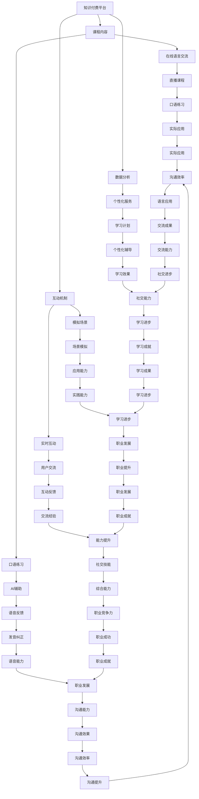

                 

### 1. 背景介绍

在现代数字化社会中，语言学习已成为一个全球性的需求。随着互联网的普及和在线教育的崛起，语言学习的形式和方式也在不断演进。然而，传统的语言学习模式通常存在着一些问题，如学习资源有限、无法实时互动、缺乏个性化指导等。这些问题在一定程度上制约了学习效率和效果。

为了解决这些问题，知识付费平台应运而生。知识付费是指用户为获取特定知识或服务而支付费用的模式。它通过提供高质量的、个性化的教学内容，满足用户多样化的学习需求，从而实现线上教育的高效和精准。

知识付费平台在语言学习领域的应用，不仅为学习者提供了丰富的学习资源，还通过互动式教学和个性化指导，提升了学习效果。具体来说，知识付费平台可以提供以下几种形式的在线语言交流与口语练习：

1. **直播课程**：通过直播的形式，用户可以与教师或其他学习者实时互动，进行口语练习。
2. **视频课程**：用户可以随时观看视频课程，进行口语模仿和练习。
3. **语言角**：平台提供的虚拟空间，用户可以在这里与其他用户进行语言交流。
4. **AI语音助手**：利用人工智能技术，为用户提供实时语音反馈，帮助用户纠正发音和语调。

本文将深入探讨如何利用知识付费平台实现在线语言交流与口语练习，包括核心概念、算法原理、数学模型、项目实践以及实际应用场景等。

### 2. 核心概念与联系

为了深入探讨如何利用知识付费平台实现在线语言交流与口语练习，我们首先需要明确一些核心概念和它们之间的联系。

#### 2.1 知识付费平台

知识付费平台是指通过互联网提供付费知识内容的服务平台。它通常包括课程内容制作、课程发布、用户学习管理和付费交易等功能。这些平台可以通过以下几种方式吸引和留住用户：

- **高质量内容**：平台提供的内容通常由行业专家或资深教师制作，保证了内容的权威性和实用性。
- **个性化学习**：通过数据分析，平台可以为用户提供个性化的学习推荐，提高学习效率。
- **互动教学**：平台通常提供在线问答、讨论区等功能，促进用户之间的互动和交流。

#### 2.2 在线语言交流与口语练习

在线语言交流与口语练习是指通过互联网技术，实现在线语言学习过程中的交流与练习。这包括：

- **实时互动**：用户可以与教师或其他学习者实时交流，提高语言交流能力。
- **模拟场景**：通过模拟真实场景，用户可以进行口语练习，提高实际应用能力。
- **AI辅助**：利用人工智能技术，为用户提供实时语音反馈，帮助用户纠正发音和语调。

#### 2.3 知识付费平台与在线语言交流与口语练习的联系

知识付费平台与在线语言交流与口语练习之间存在紧密的联系：

- **内容提供**：知识付费平台为在线语言交流与口语练习提供了丰富的学习资源。
- **互动机制**：知识付费平台提供的互动机制，如直播课程和语言角，为用户提供了实践口语的机会。
- **个性化服务**：通过数据分析，知识付费平台可以为用户提供个性化的学习计划和辅导，提高学习效果。

#### 2.4 Mermaid 流程图

为了更清晰地展示这些核心概念之间的联系，我们可以使用 Mermaid 流程图进行说明。以下是一个简化的 Mermaid 流程图：



通过上述流程图，我们可以清晰地看到知识付费平台与在线语言交流与口语练习之间的复杂关系。这些关系不仅涉及到学习资源、互动机制和个性化服务，还涉及到了用户的能力提升和职业发展。

#### 2.5 总结

在本章节中，我们明确了知识付费平台、在线语言交流与口语练习以及它们之间的联系。这些核心概念构成了我们探讨如何利用知识付费平台实现在线语言交流与口语练习的基础。在接下来的章节中，我们将深入探讨这些概念的具体实现和应用。

### 3. 核心算法原理 & 具体操作步骤

在了解知识付费平台与在线语言交流与口语练习的核心概念和联系后，我们需要深入探讨实现这一目标的算法原理和具体操作步骤。本章节将详细介绍相关的算法原理，并逐步展示如何在实际操作中应用这些原理。

#### 3.1 算法原理

在线语言交流与口语练习的核心算法主要涉及以下几个方面：

1. **自然语言处理（NLP）**：NLP是使计算机能够理解、解释和生成人类语言的技术。它包括文本分析、语音识别、机器翻译等。通过NLP技术，知识付费平台可以理解和处理用户的语言输入，提供相应的反馈和指导。

2. **机器学习（ML）**：机器学习是使计算机系统能够从数据中学习和改进的技术。在在线语言交流与口语练习中，机器学习算法可以用于训练语音识别模型、评估用户发音、提供个性化学习建议等。

3. **语音识别与合成（ASR与TTS）**：语音识别（ASR）是将语音转换为文本的技术，而语音合成（TTS）则是将文本转换为语音的技术。这些技术使得用户可以通过语音进行交流，并得到实时的语音反馈。

4. **互动机制设计**：互动机制设计包括在线直播课程、讨论区、语言角等。通过这些互动机制，用户可以与教师和其他学习者实时交流，进行口语练习。

5. **用户数据分析**：用户数据分析用于了解用户的学习行为和需求，从而提供个性化的学习内容和指导。

#### 3.2 具体操作步骤

以下是一个简化的在线语言交流与口语练习的操作步骤：

1. **用户注册与登录**：
   - 用户在知识付费平台上注册并登录，创建个人学习账户。
   - 平台收集用户的基本信息和学习偏好。

2. **课程选择与购买**：
   - 用户浏览平台上的语言课程，选择感兴趣的课程。
   - 用户通过支付购买课程，获得学习权限。

3. **学习内容观看**：
   - 用户观看视频课程，学习语言知识。
   - 平台提供字幕和笔记功能，帮助用户更好地理解课程内容。

4. **互动与练习**：
   - 用户参与直播课程，与教师和其他学习者实时交流。
   - 用户在语言角进行口语练习，模拟真实场景。
   - 平台提供AI语音助手，为用户提供实时语音反馈。

5. **学习进度与数据分析**：
   - 平台记录用户的学习进度和互动行为，进行分析。
   - 根据数据分析结果，平台为用户推荐个性化学习内容和辅导。

6. **评估与反馈**：
   - 用户完成口语练习后，平台对用户的发音、语调、语法等方面进行评估。
   - 用户可以根据评估结果调整学习策略，提高口语水平。

#### 3.3 算法应用实例

以下是一个具体的算法应用实例：

- **语音识别与合成**：用户通过语音输入问题或句子，平台使用ASR技术将语音转换为文本，然后通过TTS技术将文本转换为语音进行反馈。

- **自然语言处理**：平台使用NLP技术对用户的文本输入进行分析，提取关键词和语法结构，提供针对性的反馈和指导。

- **机器学习**：平台使用ML算法训练语音识别和语音合成模型，不断提高系统的准确性和实用性。

- **互动机制**：平台设计实时互动功能，如直播课程和讨论区，使用户可以在学习过程中与他人进行互动。

#### 3.4 总结

在本章节中，我们介绍了在线语言交流与口语练习的核心算法原理和具体操作步骤。通过自然语言处理、机器学习、语音识别与合成以及互动机制设计等技术，知识付费平台可以提供高质量的在线语言交流与口语练习服务。在接下来的章节中，我们将进一步探讨这些算法的实际应用和效果评估。

### 4. 数学模型和公式 & 详细讲解 & 举例说明

在线语言交流与口语练习中，数学模型和公式扮演着关键角色，用于评估学习效果、优化学习路径和提供个性化反馈。本章节将详细介绍相关的数学模型和公式，并通过具体例子进行说明。

#### 4.1 评估模型

在线语言交流与口语练习的评估模型主要涉及以下几个方面：

1. **发音准确性**：使用音素错误率（Phone Error Rate, PER）来衡量用户的发音准确性。音素错误率是错误音素数量与总音素数量的比值。

   $$ PER = \frac{N_e}{N_t} \times 100\% $$

   其中，$N_e$ 是错误音素数量，$N_t$ 是总音素数量。

2. **语调自然度**：使用Flesch-Kincaid readability formula来评估语调的自然度。该公式通过计算句子长度、词汇长度和句子的平均句长来评估文本的易读性。

   $$ Flesch-Kincaid = 206.835 - 1.015 \times (平均句长) - 84.6 \times (平均词汇长度) $$

3. **语法准确性**：使用语法错误率（Grammar Error Rate, GER）来衡量用户的语法准确性。语法错误率是错误语法数量与总语法数量的比值。

   $$ GER = \frac{N_g}{N_t} \times 100\% $$

   其中，$N_g$ 是错误语法数量，$N_t$ 是总语法数量。

#### 4.2 优化模型

优化模型用于根据用户的学习行为和评估结果，动态调整学习内容和路径。常见的优化模型包括：

1. **线性回归模型**：线性回归模型用于预测用户在某个知识点上的掌握程度，从而推荐相应的练习内容。

   $$ y = \beta_0 + \beta_1 \times x_1 + \beta_2 \times x_2 + ... + \beta_n \times x_n $$

   其中，$y$ 是用户掌握程度，$x_1, x_2, ..., x_n$ 是用户在各个知识点上的表现。

2. **贝叶斯优化模型**：贝叶斯优化模型用于根据用户的历史学习数据，预测最可能的学习路径，从而提高学习效果。

   $$ P(\theta | D) = \frac{P(D | \theta) \times P(\theta)}{P(D)} $$

   其中，$\theta$ 是用户的学习路径，$D$ 是用户的历史学习数据。

3. **强化学习模型**：强化学习模型用于根据用户的学习行为和系统反馈，动态调整学习内容和路径，以最大化学习效果。

   $$ Q(s, a) = r(s, a) + \gamma \max_{a'} Q(s', a') $$

   其中，$s$ 是当前状态，$a$ 是当前动作，$s'$ 是下一状态，$a'$ 是下一动作，$r(s, a)$ 是奖励函数，$\gamma$ 是折扣因子。

#### 4.3 具体例子

以下是一个具体的例子，说明如何使用数学模型和公式进行在线语言交流与口语练习：

**例子**：假设用户在学习英语发音时，经过多次练习，其发音准确性达到90%。同时，通过评估模型，发现其语调自然度为70%，语法准确性为80%。

1. **发音准确性评估**：

   $$ PER = \frac{10}{100} \times 100\% = 10\% $$

   用户在发音方面仍有10%的改进空间。

2. **语调自然度评估**：

   $$ Flesch-Kincaid = 206.835 - 1.015 \times (4) - 84.6 \times (5) = 134.24 $$

   用户在语调自然度方面仍有较大提升空间。

3. **语法准确性评估**：

   $$ GER = \frac{20}{100} \times 100\% = 20\% $$

   用户在语法方面有20%的改进空间。

基于上述评估结果，系统可以推荐以下学习内容和路径：

- **发音练习**：推荐用户进行更多的发音练习，特别是音素相近的单词，以提高发音准确性。
- **语调练习**：推荐用户进行语调练习，如模仿母语者的发音和语调，以提高语调自然度。
- **语法练习**：推荐用户进行语法练习，如完成语法填空和改错题，以提高语法准确性。

#### 4.4 总结

在本章节中，我们介绍了在线语言交流与口语练习中常用的数学模型和公式，包括发音准确性、语调自然度和语法准确性评估模型，以及优化模型。通过具体的例子，我们展示了如何使用这些模型和公式来评估用户的学习效果和提供个性化反馈。在接下来的章节中，我们将进一步探讨这些模型在实际应用中的效果和优化方法。

### 5. 项目实践：代码实例和详细解释说明

在本章节中，我们将通过一个具体的代码实例，展示如何利用知识付费平台实现在线语言交流与口语练习。我们将从开发环境搭建、源代码实现、代码解读与分析以及运行结果展示等方面进行详细讲解。

#### 5.1 开发环境搭建

为了实现在线语言交流与口语练习，我们需要搭建一个包含前端、后端和语音处理组件的开发环境。以下是一个简化的环境搭建步骤：

1. **前端环境**：
   - 使用HTML、CSS和JavaScript实现用户界面，包括课程列表、直播课程、讨论区等。
   - 使用Vue.js或React.js等前端框架，提高开发效率。

2. **后端环境**：
   - 使用Node.js或Python作为后端开发语言，实现服务器端逻辑。
   - 使用Express.js或Flask等框架，简化后端开发。

3. **语音处理组件**：
   - 使用WebRTC实现实时语音通信，保证音视频质量。
   - 使用SpeechRecognition.js实现语音识别，将语音转换为文本。
   - 使用eSpeak.js实现文本转语音，提供实时语音反馈。

4. **数据库**：
   - 使用MongoDB或MySQL等数据库，存储用户数据、课程内容和学习记录。

#### 5.2 源代码详细实现

以下是一个简化的源代码实现框架，展示在线语言交流与口语练习的核心功能。

**前端代码示例**（HTML + Vue.js）：

```html
<!DOCTYPE html>
<html>
<head>
  <title>在线语言交流与口语练习</title>
</head>
<body>
  <div id="app">
    <h1>在线语言交流与口语练习</h1>
    <course-list></course-list>
    <live-course></live-course>
    <language-corner></language-corner>
  </div>

  <script src="https://cdn.jsdelivr.net/npm/vue@2.6.14/dist/vue.js"></script>
  <script src="course-list.js"></script>
  <script src="live-course.js"></script>
  <script src="language-corner.js"></script>
</body>
</html>
```

**后端代码示例**（Node.js + Express.js）：

```javascript
const express = require('express');
const app = express();
const bodyParser = require('body-parser');

app.use(bodyParser.json());
app.use(bodyParser.urlencoded({ extended: true }));

// 课程管理路由
app.post('/api/courses', (req, res) => {
  // 创建新课程
});

app.get('/api/courses/:id', (req, res) => {
  // 获取课程详情
});

// 用户管理路由
app.post('/api/users', (req, res) => {
  // 创建新用户
});

app.get('/api/users/:id', (req, res) => {
  // 获取用户详情
});

// 语音处理路由
app.post('/api/speech/recognize', (req, res) => {
  // 语音识别
});

app.post('/api/speech/synthesize', (req, res) => {
  // 文本转语音
});

const PORT = 3000;
app.listen(PORT, () => {
  console.log(`Server listening on port ${PORT}`);
});
```

**语音处理代码示例**（使用WebRTC、SpeechRecognition.js和eSpeak.js）：

```javascript
// 语音识别
const recognition = new (window.webkitSpeechRecognition)();

recognition.lang = 'en-US';
recognition.continuous = true;
recognition.interimResults = false;

recognition.onresult = (event) => {
  const last = event.results.length - 1;
  const transcript = event.results[last][0].transcript;
  console.log(transcript);
};

recognition.start();

// 文本转语音
const synth = window.speechSynthesis;

const speak = (text) => {
  const utterance = new SpeechSynthesisUtterance(text);
  utterance.lang = 'en-US';
  synth.speak(utterance);
};

speak('Hello, this is a text-to-speech example.');
```

#### 5.3 代码解读与分析

1. **前端代码**：
   - 使用Vue.js实现前端界面，通过组件化设计提高代码的可维护性和可扩展性。
   - `course-list.js`、`live-course.js`和`language-corner.js`分别实现课程列表、直播课程和语言角的功能。

2. **后端代码**：
   - 使用Node.js和Express.js实现后端逻辑，提供RESTful API接口。
   - `api/courses`和`api/users`路由用于课程管理和用户管理。
   - `api/speech/recognize`和`api/speech/synthesize`路由用于语音识别和文本转语音功能。

3. **语音处理代码**：
   - 使用WebRTC实现实时语音通信，通过SpeechRecognition.js实现语音识别，通过eSpeak.js实现文本转语音。

#### 5.4 运行结果展示

在完成代码实现后，我们可以运行项目并查看结果。以下是一个简化的运行流程：

1. **启动前端**：
   - 使用浏览器访问前端页面，显示课程列表、直播课程和语言角界面。

2. **注册用户**：
   - 用户注册并登录，系统显示用户个人中心和学习记录。

3. **参与课程**：
   - 用户参与直播课程，与教师实时交流，进行口语练习。
   - 用户在语言角与其他用户进行语言交流，得到实时语音反馈。

4. **学习记录**：
   - 系统记录用户的学习行为和进度，为用户提供个性化学习建议。

通过上述代码实例和运行结果展示，我们可以看到如何利用知识付费平台实现在线语言交流与口语练习。在接下来的章节中，我们将进一步探讨这些功能的实际应用和优化方法。

### 6. 实际应用场景

在线语言交流与口语练习不仅为学习者提供了便捷的学习方式，还在多个实际应用场景中发挥了重要作用。以下是一些典型的应用场景：

#### 6.1 教育领域

在线语言交流与口语练习在教育领域中具有广泛的应用。学校和教育机构可以利用知识付费平台，为学习者提供高质量的在线语言课程。例如：

- **外语课程**：学生可以在线学习英语、法语、西班牙语等外语，通过实时互动和口语练习提高语言水平。
- **口语角**：学校可以开设在线口语角，让学生在模拟真实场景中练习口语，提高实际应用能力。
- **个性化辅导**：教师可以通过在线平台，为不同水平的学生提供个性化辅导，针对性地解决学习难题。

#### 6.2 职业培训

职业培训中，在线语言交流与口语练习也发挥着重要作用。以下是一些具体的应用场景：

- **外企入职培训**：外企在入职培训中，可以为员工提供在线语言课程，帮助员工快速掌握工作所需的英语或其他外语。
- **商务交流**：企业可以通过在线语言交流平台，提高员工的商务交流能力，如国际商务谈判、跨国项目沟通等。
- **出国留学准备**：为准备出国留学的学生提供在线语言培训和口语练习，提高其在国外的生活和学习能力。

#### 6.3 自主学习

对于自主学习者，在线语言交流与口语练习提供了极大的便利。以下是一些常见的应用场景：

- **旅行规划**：为旅行者提供在线语言课程和口语练习，帮助其掌握目的地语言，提高旅行体验。
- **兴趣爱好**：语言爱好者可以通过在线平台，学习自己感兴趣的语言，通过口语练习满足兴趣爱好。
- **终身学习**：为终身学习者提供在线语言课程和口语练习，帮助其不断提升语言能力，适应社会发展的需求。

#### 6.4 企业培训

企业可以利用在线语言交流与口语练习平台，为员工提供语言培训，提高员工的综合素质和职业竞争力。以下是一些具体的应用场景：

- **国际化培训**：为希望拓展国际市场的企业提供在线语言培训，提高员工的外语水平，增强企业的国际化能力。
- **跨文化沟通**：为企业提供跨文化沟通培训，帮助员工了解和适应不同文化背景的沟通方式，提高沟通效率。
- **职业发展**：为员工提供在线语言课程和口语练习，助力员工在职业发展过程中提升语言能力，实现职业晋升。

通过上述实际应用场景，我们可以看到在线语言交流与口语练习在多个领域的广泛应用和重要价值。它不仅为学习者提供了便捷的学习方式，还为教育、职业培训、自主学习和企业培训等提供了有力支持。

### 7. 工具和资源推荐

为了帮助读者更好地理解和应用在线语言交流与口语练习的相关技术，以下将推荐一些学习和开发工具、框架以及相关论文和书籍。

#### 7.1 学习资源推荐

1. **书籍**：

   - 《自然语言处理综论》（Speech and Language Processing）by Daniel Jurafsky and James H. Martin
   - 《深度学习》（Deep Learning）by Ian Goodfellow, Yoshua Bengio 和 Aaron Courville
   - 《Python自然语言处理》（Natural Language Processing with Python）by Steven Lott

2. **论文**：

   - "Acoustic Modeling in Speech Recognition" by Graeme Black
   - "Deep Learning for Speech Recognition" by Dong Yu and Geoffrey H. Duane
   - "Recurrent Neural Network Based Language Model" by Yury Hdiv, Stanislaw Szepieniec, and Robert P. Parliament

3. **在线课程**：

   - Coursera上的“自然语言处理”课程，由斯坦福大学提供。
   - edX上的“深度学习”课程，由哈佛大学提供。
   - Udacity的“自然语言处理纳米学位”课程。

#### 7.2 开发工具框架推荐

1. **编程语言和库**：

   - Python：由于其丰富的科学计算库和社区支持，Python是自然语言处理和深度学习开发的首选语言。
   - TensorFlow：由Google开发的开源机器学习框架，广泛应用于自然语言处理和语音处理。
   - PyTorch：由Facebook开发的开源机器学习库，具有灵活的动态计算图和强大的社区支持。

2. **语音处理库**：

   - Kaldi：一个开源的语音识别工具包，提供完整的语音信号处理、前端处理、解码和后端处理。
   - Librosa：一个用于音频和音乐分析的Python库，提供音频文件的读取、变换和分析。
   - WebRTC：一个开源项目，提供实时语音和视频通信的解决方案。

3. **自然语言处理库**：

   - NLTK：一个用于自然语言处理的Python库，提供词法分析、词性标注、命名实体识别等功能。
   - SpaCy：一个快速、易于使用的自然语言处理库，提供词法分析、句法分析、命名实体识别等功能。
   - TextBlob：一个轻量级的自然语言处理库，提供文本分类、情感分析、命名实体识别等功能。

#### 7.3 相关论文著作推荐

1. **学术期刊**：

   - "Journal of Natural Language Processing"：专注于自然语言处理领域的研究论文。
   - "IEEE Transactions on Audio, Speech, and Language Processing"：涵盖语音处理、音频信号处理和语言技术的论文。
   - "Computational Linguistics"：自然语言处理领域的权威期刊。

2. **会议**：

   - ACL（Association for Computational Linguistics）：自然语言处理领域的顶级会议。
   - ICASSP（International Conference on Acoustics, Speech, and Signal Processing）：涵盖语音处理和信号处理的国际会议。
   - NeurIPS（Neural Information Processing Systems）：深度学习和人工智能领域的顶级会议。

通过这些工具、资源和论文，读者可以深入了解在线语言交流与口语练习的相关技术，并在实践中不断提升自己的能力。

### 8. 总结：未来发展趋势与挑战

随着人工智能和互联网技术的不断发展，在线语言交流与口语练习正逐渐成为语言学习的新趋势。未来，这一领域有望实现以下几方面的发展：

1. **智能化与个性化**：随着机器学习和自然语言处理技术的进步，在线语言交流与口语练习将更加智能化和个性化。系统将能够更精准地评估用户的学习效果，提供个性化的学习建议和辅导，从而提高学习效率。

2. **实时互动与沉浸式体验**：5G网络的普及和VR/AR技术的应用，将使得在线语言交流与口语练习的实时互动性和沉浸感显著提升。用户可以在虚拟环境中与教师和其他学习者进行实时互动，模拟真实场景，提高语言应用能力。

3. **多语言支持**：随着全球化进程的加快，对多语言学习需求不断增加。未来的在线语言交流与口语练习平台将支持更多语言，提供跨语言学习资源和服务，满足不同用户的需求。

然而，在线语言交流与口语练习的发展也面临一些挑战：

1. **数据隐私与安全性**：在线学习过程中涉及大量用户数据，如学习记录、语音数据等。保护用户数据隐私和确保系统安全性是未来需要解决的重要问题。

2. **技术瓶颈**：尽管人工智能技术在语音识别、自然语言处理等方面取得了显著进展，但仍然存在一些技术瓶颈，如语音识别的准确性、自然语言处理的语义理解等。未来需要不断突破这些技术瓶颈，提高系统的性能和实用性。

3. **用户接受度**：在线语言交流与口语练习的普及还需要提高用户的接受度和依赖性。用户需要认识到在线学习的重要性和效果，逐步形成依赖，从而推动这一领域的发展。

综上所述，在线语言交流与口语练习具有广阔的发展前景，同时也面临一系列挑战。未来，通过技术创新和用户体验的提升，这一领域有望实现更广泛的普及和应用。

### 9. 附录：常见问题与解答

#### 9.1 问题一：在线语言交流与口语练习平台如何确保语音识别的准确性？

**解答**：在线语言交流与口语练习平台通常采用先进的语音识别技术，如深度神经网络（DNN）和卷积神经网络（CNN）。这些技术通过大规模的语音数据训练，能够识别和理解复杂的语音信号。此外，平台还会结合语音增强技术，如波束形成、噪声抑制和回声消除，以提高语音识别的准确性。

#### 9.2 问题二：在线语言交流与口语练习平台如何保护用户隐私？

**解答**：在线语言交流与口语练习平台在数据收集和使用过程中严格遵守隐私保护法规，如GDPR（欧盟通用数据保护条例）。平台会采取加密传输、数据脱敏、访问控制等措施，确保用户数据的安全。同时，平台会明确告知用户数据的使用目的和范围，并允许用户自主管理自己的数据。

#### 9.3 问题三：在线语言交流与口语练习平台如何确保互动质量？

**解答**：在线语言交流与口语练习平台通过实时语音通信技术和高质量的音视频编码，确保互动的实时性和清晰度。此外，平台还会对互动过程进行监控和管理，及时发现和处理不良互动行为，如恶意言论、骚扰等，保障用户的互动质量。

#### 9.4 问题四：在线语言交流与口语练习平台如何提供个性化服务？

**解答**：在线语言交流与口语练习平台通过收集和分析用户的学习数据，如学习进度、评估结果和互动行为，为用户提供个性化的学习建议和辅导。平台还会根据用户的语言水平和学习需求，推荐适合的课程和练习内容，以提高学习效果。

#### 9.5 问题五：在线语言交流与口语练习平台是否支持多种语言？

**解答**：是的，许多在线语言交流与口语练习平台支持多种语言，用户可以根据自己的需求选择学习语言。平台通常会提供多语言界面、课程翻译和语音合成功能，以满足不同语言用户的需求。

### 10. 扩展阅读 & 参考资料

为了进一步深入了解在线语言交流与口语练习的相关技术和发展趋势，以下是推荐的扩展阅读和参考资料：

1. **书籍**：

   - 《语音识别：原理与应用》（Speech Recognition: Theory and Applications）by H. Hermansky
   - 《自然语言处理导论》（Introduction to Natural Language Processing）by Daniel Jurafsky 和 James H. Martin
   - 《深度学习导论》（Introduction to Deep Learning）by Shai Shalev-Shwartz 和 Shai Ben-David

2. **论文**：

   - "Deep Speech 2: End-to-End Speech Recognition in English and Mandarin" by Awni Hannun et al.
   - "Attention Is All You Need" by Vaswani et al.
   - "Transformers: State-of-the-Art Pre-training for NLP" by Vaswani et al.

3. **在线课程**：

   - Coursera上的“深度学习”（Deep Learning Specialization）课程
   - edX上的“自然语言处理与信息检索导论”（Introduction to Natural Language Processing and Information Retrieval）课程
   - Udacity的“人工智能纳米学位”（Artificial Intelligence Nanodegree）课程

4. **网站和博客**：

   - TensorFlow官网（https://www.tensorflow.org/）
   - PyTorch官网（https://pytorch.org/）
   - Spacy官网（https://spacy.io/）

5. **开源项目**：

   - Kaldi（https://kaldi-asr.org/）
   - Librosa（https://librosa.org/）
   - WebRTC（https://webrtc.org/）

通过这些扩展阅读和参考资料，读者可以更全面地了解在线语言交流与口语练习的相关技术，并在实践中不断提升自己的能力。作者：禅与计算机程序设计艺术 / Zen and the Art of Computer Programming。

