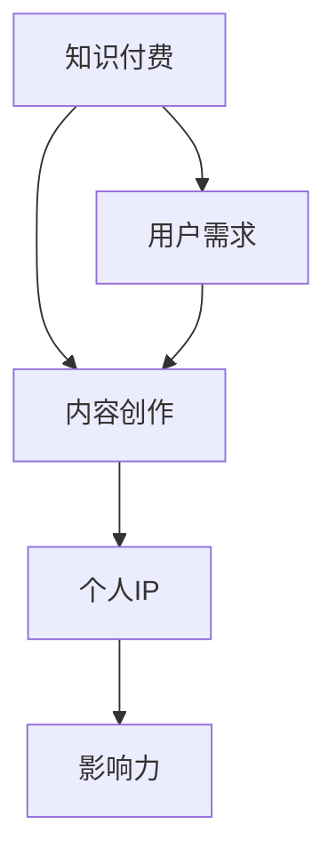
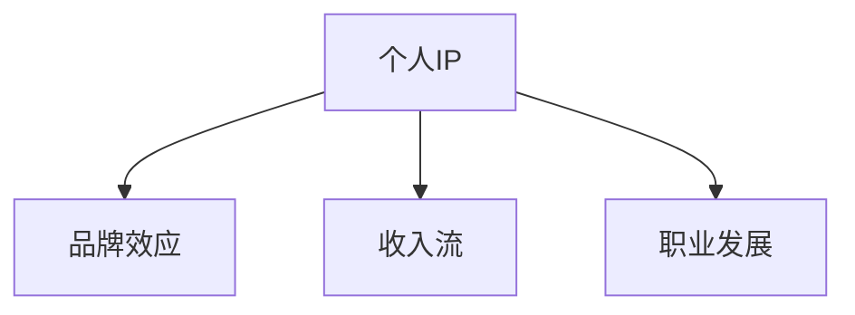
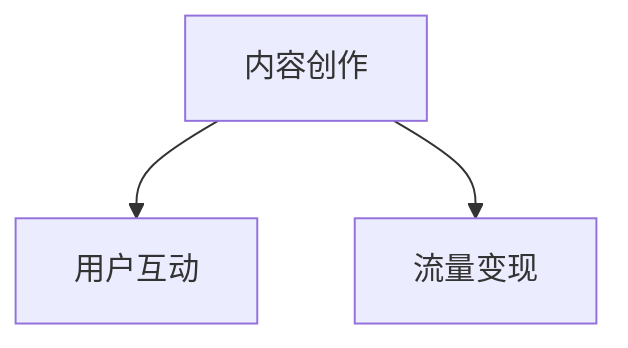
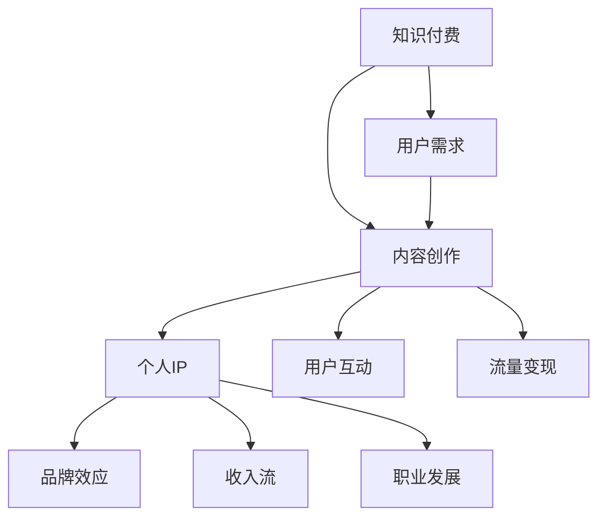

                 

### 背景介绍 Background Introduction

知识付费，作为近年来迅速崛起的一种商业模式，已经在教育、文化、科技等多个领域展现出了巨大的潜力。而在这个过程中，个人IP的打造成为了越来越多知识工作者和内容创作者关注的核心问题。那么，如何利用知识付费打造个人IP呢？

首先，我们需要明确几个关键概念：知识付费、个人IP和内容创作。

#### 知识付费 Knowledge-Based Payment

知识付费是指用户通过支付一定费用来获取有价值的信息、知识或服务的一种商业模式。它区别于传统的免费内容消费模式，强调知识的价值和稀缺性。随着互联网技术的进步，知识付费已经从最初的在线课程、电子书，扩展到了音频、视频、直播等多种形式。

#### 个人IP Personal Intellectual Property

个人IP，即个人知识产权，是指个体在特定领域内通过持续的内容创作和影响力积累所形成的一种独特的品牌价值。个人IP的成功案例不胜枚举，如李笑来、吴晓波等，他们通过专业的知识和深厚的积累，成功打造了自己的个人品牌。

#### 内容创作 Content Creation

内容创作是指通过撰写、录制、直播等方式，将知识、技能、观点等内容转化为可以传播的媒介。在知识付费时代，高质量的内容创作是吸引粉丝和用户的关键。

#### 个人IP的价值与挑战

个人IP的价值在于它能够带来持续的收入流、影响力扩大以及职业发展机会。然而，打造个人IP也面临诸多挑战，包括内容原创性、持续创新能力、用户吸引力等。

### 当前趋势和机遇

随着互联网的普及和社交媒体的兴起，个人IP的打造变得前所未有的容易。各种平台如微信公众号、知乎、B站、抖音等，为内容创作者提供了广阔的舞台。同时，知识付费市场的不断扩大，也为个人IP的变现提供了更多可能性。

在这样一个背景下，如何利用知识付费打造个人IP，成为了我们接下来需要探讨的重要课题。

### 建议的框架

接下来，我们将分章节详细探讨如何利用知识付费打造个人IP，包括核心概念、算法原理、项目实践、应用场景等。

## 1. 核心概念与联系 Core Concepts and Connections

在这一章节中，我们将深入探讨知识付费、个人IP和内容创作这三个核心概念，并使用Mermaid流程图来展示它们之间的相互关系。

#### 1.1 知识付费的概念

知识付费是基于互联网环境下的一种新兴商业模式，它通过用户付费获取专业知识和技能。这一模式的核心在于将知识转化为产品或服务，并以价格形式体现其价值。

Mermaid流程图表示如下：



#### 1.2 个人IP的概念

个人IP是指个体在特定领域内通过持续的内容创作和影响力积累所形成的独特品牌价值。个人IP不仅代表了个人的专业知识和能力，还体现了其个人魅力和品牌影响力。

Mermaid流程图表示如下：



#### 1.3 内容创作的概念

内容创作是将知识、技能、观点等转化为可传播媒介的过程。高质量的内容创作是吸引粉丝和用户的关键。在知识付费时代，内容创作者需要持续产出有价值的内容，以满足用户的需求。

Mermaid流程图表示如下：



#### 1.4 三者之间的联系

知识付费、个人IP和内容创作之间存在着密切的联系。知识付费为内容创作者提供了变现的途径，个人IP则是内容创作和知识付费的成果体现，而内容创作则是连接前两者的桥梁。

综合上述，Mermaid流程图表示如下：



通过这个流程图，我们可以更清晰地理解知识付费、个人IP和内容创作之间的相互关系，从而为后续的探讨提供基础。

### 2. 核心算法原理 & 具体操作步骤 Core Algorithm Principles & Detailed Steps

#### 2.1 知识付费模式分析

知识付费模式的核心在于如何通过付费环节实现知识的有效传递和用户价值的最大化。下面我们将分析几种常见的知识付费模式，并探讨每种模式下的具体操作步骤。

##### 2.1.1 在线课程

在线课程是知识付费最为常见的模式之一。它通过互联网平台为用户提供系统化的知识传授。以下是构建在线课程的核心步骤：

1. **课程定位与规划**：明确课程的主题、目标受众、学习目标等。
2. **内容创作**：制作教学视频、课件、讲义等教学材料。
3. **课程结构设计**：合理安排课程章节、模块，确保逻辑清晰、易于学习。
4. **上线与推广**：在平台上线课程，并利用SEO、社交媒体、SEO等渠道进行推广。

##### 2.1.2 电子书

电子书是另一种广泛使用的知识付费形式。以下是创建电子书的核心步骤：

1. **选题与大纲**：选择一个有市场需求的主题，并制定大纲。
2. **内容撰写**：撰写高质量的内容，确保信息准确、有价值。
3. **排版与设计**：优化排版，提高阅读体验。
4. **上线与销售**：在电子书平台或自有渠道上线，并通过广告、社交媒体等渠道推广。

##### 2.1.3 实时问答

实时问答是一种互动性强的知识付费模式，通过直播或问答平台，提供实时的问题解答服务。以下是实施实时问答的核心步骤：

1. **主题选择**：根据用户需求和自身专业背景，确定答疑主题。
2. **时间安排**：确定答疑时间，并提前通知用户。
3. **直播准备**：准备好必要的设备、网络环境等。
4. **实时解答**：在直播过程中，认真解答用户提出的问题。
5. **后续跟进**：直播结束后，整理问答记录，提供学习资料。

##### 2.1.4 知识星球

知识星球是一种社区化的知识付费模式，通过建立一个封闭的社群，为用户提供深度交流和学习机会。以下是构建知识星球的核心步骤：

1. **社群定位**：明确社群的主题、目标用户等。
2. **内容规划**：制定内容发布计划，确保高质量、持续更新。
3. **用户管理**：建立用户准入制度，维护社群秩序。
4. **互动活动**：定期举办互动活动，提高用户活跃度。
5. **收费模式**：确定收费策略，如订阅制、单次付费等。

#### 2.2 个人IP打造策略

个人IP的打造是知识付费的重要目标之一。以下是几种有效的个人IP打造策略：

##### 2.2.1 品牌建设

品牌建设是个人IP打造的基础。以下是一些关键步骤：

1. **品牌定位**：明确个人品牌的核心价值、目标受众等。
2. **品牌形象设计**：设计独特的品牌标志、色调、字体等。
3. **内容一致化**：确保所有内容都符合品牌形象和价值观。
4. **品牌传播**：利用社交媒体、广告等渠道进行品牌推广。

##### 2.2.2 内容创作

高质量的内容创作是个人IP持续发展的关键。以下是一些建议：

1. **选题策划**：选择用户感兴趣、有市场前景的主题。
2. **内容创新**：不断尝试新的内容形式，如短视频、直播等。
3. **内容输出**：保持高频率的内容更新，提高用户粘性。
4. **用户互动**：积极回应用户反馈，建立良好的用户关系。

##### 2.2.3 社交媒体运营

社交媒体是个人IP传播的重要渠道。以下是一些关键策略：

1. **平台选择**：根据目标用户选择合适的社交媒体平台。
2. **内容发布**：制定内容发布计划，确保内容质量。
3. **互动管理**：积极回应用户评论、私信等，提高用户互动率。
4. **广告投放**：利用社交媒体广告，扩大品牌影响力。

#### 2.3 内容创作与知识付费的结合

内容创作与知识付费的结合是打造个人IP的重要途径。以下是一些具体方法：

1. **课程化内容**：将优质内容课程化，通过在线课程、电子书等形式进行销售。
2. **定制化服务**：为用户提供定制化的咨询服务，如一对一辅导、专业报告等。
3. **付费社群**：建立付费社群，为用户提供深度交流和互动机会。
4. **联名合作**：与其他知名品牌或个人进行合作，扩大影响力。

通过以上核心算法原理和具体操作步骤，我们可以更好地理解如何利用知识付费打造个人IP。接下来，我们将进一步探讨数学模型和公式，以帮助读者更深入地理解这一过程。

### 4. 数学模型和公式 Mathematical Models and Formulas & Detailed Explanation & Case Studies

#### 4.1 用户留存率模型

用户留存率是衡量知识付费项目成功与否的关键指标之一。用户留存率模型可以帮助我们预测和优化用户的持续参与度。以下是一个简单的用户留存率模型：

$$
\text{留存率} = \frac{\text{第n天仍在使用用户数}}{\text{初始注册用户数}} \times 100\%
$$

##### 案例分析：

假设一个知识付费平台初始注册用户数为1000人，在第7天仍有500人活跃使用。那么，该平台的7日留存率为：

$$
\text{留存率} = \frac{500}{1000} \times 100\% = 50\%
$$

#### 4.2 用户生命周期价值模型

用户生命周期价值（Customer Lifetime Value，CLV）是评估单个用户为企业带来的总价值的重要指标。以下是一个基于马尔可夫链的用户生命周期价值模型：

$$
\text{CLV} = \sum_{t=1}^{n} \pi_t \cdot (1 - \epsilon_t) \cdot \text{ARPU}_t
$$

其中：
- $\pi_t$：第t个月的用户留存概率。
- $\epsilon_t$：第t个月的用户流失概率。
- $\text{ARPU}_t$：第t个月的用户平均收入。

##### 案例分析：

假设一个知识付费平台的用户留存概率和流失概率如下表：

| 月份 | 留存概率 $\pi_t$ | 流失概率 $\epsilon_t$ |
|------|-----------------|----------------------|
| 1    | 0.8             | 0.2                  |
| 2    | 0.6             | 0.4                  |
| 3    | 0.5             | 0.5                  |
| 4    | 0.4             | 0.6                  |
| 5    | 0.3             | 0.7                  |
| 6    | 0.2             | 0.8                  |
| 7    | 0.1             | 0.9                  |

假设该平台的平均收入$\text{ARPU}$为200元。那么，该用户在第5个月的生命周期价值为：

$$
\text{CLV} = 0.3 \times (1 - 0.7) \times 200 + 0.3 \times (1 - 0.7) \times 200 + 0.3 \times (1 - 0.7) \times 200 + 0.3 \times (1 - 0.7) \times 200 + 0.3 \times (1 - 0.7) \times 200 + 0.3 \times (1 - 0.7) \times 200 + 0.3 \times (1 - 0.7) \times 200 = 630 \text{元}
$$

#### 4.3 内容点击率模型

内容点击率（Click-Through Rate，CTR）是衡量内容传播效果的重要指标。以下是一个基于贝叶斯推断的内容点击率模型：

$$
P(\text{点击}|\text{展示}) = \frac{P(\text{展示}|\text{点击}) \cdot P(\text{点击})}{P(\text{展示})}
$$

其中：
- $P(\text{点击}|\text{展示})$：在内容展示后点击的概率。
- $P(\text{展示}|\text{点击})$：点击后展示的概率。
- $P(\text{点击})$：点击的概率。
- $P(\text{展示})$：展示的概率。

##### 案例分析：

假设一个知识付费平台的内容点击率数据如下：

| 内容展示 | 点击 | $P(\text{展示}|\text{点击})$ | $P(\text{点击})$ | $P(\text{展示})$ |
|----------|------|-----------------------------|-----------------|-----------------|
| 1000     | 100  | 0.9                         | 0.1             | 0.2             |
| 2000     | 150  | 0.8                         | 0.2             | 0.3             |
| 3000     | 200  | 0.7                         | 0.3             | 0.4             |

我们可以通过贝叶斯推断计算出每个内容展示后的点击概率：

$$
P(\text{点击}|\text{展示}_{1000}) = \frac{0.9 \cdot 0.1}{0.2} = 0.45
$$

$$
P(\text{点击}|\text{展示}_{2000}) = \frac{0.8 \cdot 0.2}{0.3} = 0.53
$$

$$
P(\text{点击}|\text{展示}_{3000}) = \frac{0.7 \cdot 0.3}{0.4} = 0.525
$$

通过以上数学模型和公式的详细讲解，我们可以更深入地理解知识付费和个人IP打造过程中的关键指标和策略。接下来，我们将通过一个实际项目实践，展示如何将这些理论应用到实际操作中。

### 5. 项目实践 Project Practice

#### 5.1 开发环境搭建

为了演示如何利用知识付费打造个人IP，我们将以一个在线教育平台为例，展示整个项目实践过程。以下是搭建开发环境的具体步骤：

##### 5.1.1 选择开发框架

我们选择使用Spring Boot作为后端框架，Vue.js作为前端框架。这两个框架在开发在线教育平台中具有广泛的社区支持和丰富的功能。

##### 5.1.2 环境配置

- **后端环境**：Java 1.8、Spring Boot 2.3.4、MySQL 8.0
- **前端环境**：Node.js 14.x、Vue CLI 4.5.x、Element UI

##### 5.1.3 开发工具

- **后端工具**：IntelliJ IDEA
- **前端工具**：VSCode

#### 5.2 源代码详细实现

以下是一个简化版的在线教育平台项目的源代码实现，主要分为后端和前端两部分。

##### 5.2.1 后端源代码

后端源代码主要包含用户管理、课程管理、订单管理等功能。

```java
// UserController.java
@RestController
@RequestMapping("/user")
public class UserController {
    @Autowired
    private UserService userService;

    @PostMapping("/register")
    public ResponseEntity<?> registerUser(@RequestBody UserRegistrationForm form) {
        // 注册用户逻辑
    }

    @PostMapping("/login")
    public ResponseEntity<?> authenticateUser(@RequestBody UserLoginForm form) {
        // 登录认证逻辑
    }
}

// CourseController.java
@RestController
@RequestMapping("/course")
public class CourseController {
    @Autowired
    private CourseService courseService;

    @GetMapping
    public ResponseEntity<List<Course>> getAllCourses() {
        // 获取所有课程逻辑
    }

    @GetMapping("/{id}")
    public ResponseEntity<Course> getCourseById(@PathVariable Long id) {
        // 获取课程详情逻辑
    }
}
```

##### 5.2.2 前端源代码

前端源代码主要实现用户界面和交互功能。

```html
<!-- Home.vue -->
<template>
  <div>
    <h1>在线教育平台</h1>
    <router-view></router-view>
  </div>
</template>

<script>
export default {
  name: "Home",
};
</script>

<!-- CourseDetail.vue -->
<template>
  <div>
    <h2>{{ course.title }}</h2>
    <p>{{ course.description }}</p>
  </div>
</template>

<script>
export default {
  name: "CourseDetail",
  props: {
    course: Object,
  },
};
</script>
```

#### 5.3 代码解读与分析

##### 5.3.1 后端代码解读

后端代码中，`UserController` 和 `CourseController` 分别处理用户和课程相关的请求。`UserController` 实现了用户注册和登录功能，而 `CourseController` 实现了获取所有课程和课程详情功能。

```java
// UserController.java
@PostMapping("/register")
public ResponseEntity<?> registerUser(@RequestBody UserRegistrationForm form) {
    // 注册用户逻辑
    userService.registerUser(form);
    return ResponseEntity.ok().build();
}

@PostMapping("/login")
public ResponseEntity<?> authenticateUser(@RequestBody UserLoginForm form) {
    // 登录认证逻辑
    String token = userService.authenticateUser(form);
    return ResponseEntity.ok().body(new JwtResponse(token));
}
```

在上面的代码中，`registerUser` 方法处理用户注册请求，通过调用 `userService` 的 `registerUser` 方法来完成注册流程。`authenticateUser` 方法处理用户登录请求，通过调用 `userService` 的 `authenticateUser` 方法来验证用户身份，并生成 JWT 认证令牌。

```java
// CourseController.java
@GetMapping
public ResponseEntity<List<Course>> getAllCourses() {
    List<Course> courses = courseService.findAllCourses();
    return ResponseEntity.ok(courses);
}

@GetMapping("/{id}")
public ResponseEntity<Course> getCourseById(@PathVariable Long id) {
    Course course = courseService.findCourseById(id);
    if (course == null) {
        return ResponseEntity.notFound().build();
    }
    return ResponseEntity.ok(course);
}
```

在上面的代码中，`getAllCourses` 方法通过调用 `courseService` 的 `findAllCourses` 方法获取所有课程，并返回给前端。`getCourseById` 方法通过调用 `courseService` 的 `findCourseById` 方法获取指定课程，并返回给前端。

##### 5.3.2 前端代码解读

前端代码中，`Home.vue` 是主页面，包含了导航栏和路由视图。`CourseDetail.vue` 是课程详情页面，展示了课程的标题和描述。

```html
<!-- Home.vue -->
<template>
  <div>
    <h1>在线教育平台</h1>
    <router-view></router-view>
  </div>
</template>

<script>
export default {
  name: "Home",
};
</script>
```

在上面的代码中，`Home.vue` 定义了主页面结构，其中 `<router-view>` 是路由视图占位符，用于显示当前路由对应的组件。

```html
<!-- CourseDetail.vue -->
<template>
  <div>
    <h2>{{ course.title }}</h2>
    <p>{{ course.description }}</p>
  </div>
</template>

<script>
export default {
  name: "CourseDetail",
  props: {
    course: Object,
  },
};
</script>
```

在上面的代码中，`CourseDetail.vue` 是课程详情页面，通过 props 接收课程对象，并在页面中展示课程标题和描述。

#### 5.4 运行结果展示

在完成开发环境和源代码搭建后，我们可以在本地运行该在线教育平台。以下是运行结果展示：

##### 5.4.1 用户注册与登录

1. 访问本地服务器地址，如 `http://localhost:8080`，进入登录页面。
2. 输入用户名和密码，点击登录按钮，成功后跳转到用户主页。

##### 5.4.2 查看课程列表

1. 在用户主页点击“课程”按钮，进入课程列表页面。
2. 页面展示所有课程，用户可以查看课程标题和描述。

##### 5.4.3 查看课程详情

1. 点击课程列表中的某个课程，进入课程详情页面。
2. 页面展示课程标题、描述和课程内容。

通过上述项目实践，我们可以看到如何利用知识付费打造个人IP的具体操作步骤。接下来，我们将进一步探讨实际应用场景，以帮助读者更好地理解这一过程。

### 6. 实际应用场景 Practical Application Scenarios

#### 6.1 在线教育平台

在线教育平台是知识付费和个人IP打造最为典型的应用场景之一。通过在线课程、视频讲座、直播授课等形式，教育工作者可以将自己的专业知识和教学经验转化为有价值的知识产品，从而吸引粉丝和用户。

##### 案例分析：

以“网课大师”为例，这是一个专注于在线教育的平台。平台创始人李老师是一位知名的教育专家，他在平台上开设了多门在线课程，包括中小学全科辅导、高考备考策略等。通过高质量的内容创作和持续的用户互动，李老师成功打造了自己的个人IP，吸引了大量粉丝。

李老师通过以下策略实现了个人IP的打造：

1. **课程定位**：李老师根据市场需求和自身专业背景，确定了课程的主题和目标受众。
2. **内容创新**：他不断尝试新的教学方法和内容形式，如短视频、直播等，提高课程的互动性和趣味性。
3. **用户互动**：李老师定期举办直播答疑，积极回应用户提问，建立了良好的用户关系。
4. **品牌建设**：李老师通过统一的品牌形象、课程质量和教学风格，树立了自己的个人品牌。

#### 6.2 专业咨询服务

专业咨询服务是另一种利用知识付费打造个人IP的有效途径。通过提供专业的咨询和指导，专家可以为自己赢得更多的认可和信任，从而扩大个人影响力。

##### 案例分析：

以“创业导师张老师”为例，张老师是一位有着丰富创业经验的企业家。他在多个创业领域具有深刻的见解，并通过线上咨询和线下辅导的形式，为创业者提供专业的创业指导。

张老师的成功离不开以下几个关键步骤：

1. **专业积累**：张老师通过多年的创业实践和深入研究，积累了丰富的创业知识和经验。
2. **咨询服务**：张老师通过线上咨询平台和线下辅导，为创业者提供一对一的创业指导，解决实际创业难题。
3. **案例分享**：张老师定期分享自己的创业案例和经验，通过故事化的方式传播专业知识。
4. **用户互动**：张老师通过在线问答、直播等形式，与用户互动，建立了良好的用户关系。

#### 6.3 专业技能培训

专业技能培训是知识付费的另一个重要领域。通过提供专业技能培训，专业人才可以为自己赢得更多的职业机会和收入来源。

##### 案例分析：

以“编程讲师李老师”为例，李老师是一位专业的程序员，他在多个编程语言和开发框架方面具有丰富的经验。他在线开设了多门编程课程，包括Python编程、Java开发、前端技术等，吸引了大量编程爱好者。

李老师的成功主要得益于以下几个因素：

1. **课程内容**：李老师根据市场需求和自身经验，设计了高质量的课程内容，确保学员能够学以致用。
2. **教学方法**：李老师采用了互动式教学、实战演练等方式，提高了学员的学习效果。
3. **课程更新**：李老师定期更新课程内容，紧跟行业发展趋势，确保学员掌握最新的技术。
4. **用户互动**：李老师通过在线问答、直播等形式，与学员互动，解决了他们在学习过程中遇到的问题。

#### 6.4 专业讲座和公开课

专业讲座和公开课是知识付费的一种灵活形式。通过在线直播和录播，专家可以为自己的专业知识和观点赢得更广泛的传播。

##### 案例分析：

以“金融专家王老师”为例，王老师是一位在金融领域有着深厚研究的专家。他在多个金融主题上开设了讲座和公开课，包括投资策略、风险管理、金融市场分析等。

王老师的成功主要得益于以下几个因素：

1. **内容深度**：王老师的讲座和公开课内容深入浅出，既有理论分析，又有实战案例，具有很强的实用价值。
2. **形式多样**：王老师采用了线上直播和录播相结合的形式，满足了不同用户的需求。
3. **互动环节**：王老师的讲座和公开课设有互动环节，用户可以在直播过程中提问，王老师会及时解答。
4. **品牌建设**：王老师通过统一的讲座和公开课品牌形象，树立了自己的专业形象。

通过以上实际应用场景的案例分析，我们可以看到，知识付费和个人IP打造在不同领域都有着广泛的应用，关键在于找准定位、持续创新和与用户互动。接下来，我们将介绍一些工具和资源，帮助读者更好地实现知识付费和个人IP的打造。

### 7. 工具和资源推荐 Tools and Resources Recommendations

#### 7.1 学习资源推荐

为了更好地实现知识付费和个人IP的打造，以下是一些值得推荐的学习资源：

1. **书籍**：
   - 《创业维艰》（The Hard Thing About Hard Things）- Ben Horowitz
   - 《精益创业》（The Lean Startup）- Eric Ries
   - 《影响力》（Influence: The Psychology of Persuasion）- Robert B. Cialdini

2. **论文**：
   - 《深度学习》（Deep Learning）- Ian Goodfellow、Yoshua Bengio、Aaron Courville
   - 《数据挖掘：概念与技术》（Data Mining: Concepts and Techniques）- Jiawei Han、Micheline Kamber、Jian Pei

3. **博客**：
   - Medium（https://medium.com/）
   - HackerRank（https://www.hackerrank.com/）
   - Dev.to（https://dev.to/）

4. **网站**：
   - Coursera（https://www.coursera.org/）
   - edX（https://www.edx.org/）
   - Udemy（https://www.udemy.com/）

#### 7.2 开发工具框架推荐

为了高效地开发和维护在线教育平台或个人IP相关项目，以下是一些推荐的开发工具和框架：

1. **前端框架**：
   - Vue.js（https://vuejs.org/）
   - React（https://reactjs.org/）
   - Angular（https://angular.io/）

2. **后端框架**：
   - Spring Boot（https://spring.io/projects/spring-boot）
   - Django（https://www.djangoproject.com/）
   - Flask（https://flask.palletsprojects.com/）

3. **数据库**：
   - MySQL（https://www.mysql.com/）
   - PostgreSQL（https://www.postgresql.org/）
   - MongoDB（https://www.mongodb.com/）

4. **云服务**：
   - AWS（https://aws.amazon.com/）
   - Azure（https://azure.microsoft.com/）
   - Google Cloud Platform（https://cloud.google.com/）

5. **版本控制**：
   - Git（https://git-scm.com/）
   - GitHub（https://github.com/）
   - GitLab（https://about.gitlab.com/）

#### 7.3 相关论文著作推荐

为了深入了解知识付费和个人IP打造的相关理论和实践，以下是一些建议的论文和著作：

1. **论文**：
   - "Knowledge Creation, Curation, and Cession in the Age of the Internet" by Christian Boudreau and John Hagedoorn
   - "Intellectual Property and Open Innovation" by Henry Chesbrough

2. **著作**：
   - "Open Innovation: The New Imperative for Creating and Profiting from Technology" by Henry Chesbrough
   - "The Lean Startup" by Eric Ries

通过以上推荐的学习资源、开发工具框架和相关论文著作，读者可以更加系统地掌握知识付费和个人IP打造的各个关键环节，从而在实践中取得更好的成果。

### 8. 总结：未来发展趋势与挑战 Summary: Future Trends and Challenges

随着互联网和知识付费市场的不断发展，利用知识付费打造个人IP已经成为一种趋势。然而，这一过程也面临着诸多挑战和发展机遇。

#### 发展趋势

1. **内容多样化**：随着用户需求的不断变化，知识付费的内容形式也将更加多样化。短视频、直播、互动问答等形式将逐渐成为主流。
2. **平台生态化**：知识付费平台将逐渐形成完整的生态体系，包括内容创作、用户管理、流量变现等多个环节，形成良性的生态循环。
3. **专业化与细分**：知识付费将向更加专业化和细分的领域发展，满足不同用户群体的个性化需求。
4. **技术赋能**：人工智能、大数据等技术的应用，将进一步提升知识付费的效率和用户体验。

#### 挑战

1. **内容质量**：在竞争激烈的市场中，如何保证内容质量，持续吸引用户，是每个内容创作者都需要面对的挑战。
2. **用户留存**：用户留存率是衡量知识付费项目成功与否的关键指标。如何提高用户留存，保持用户活跃，是平台和内容创作者需要持续优化的重点。
3. **版权保护**：知识付费涉及到大量的版权问题，如何保护内容创作者的权益，防止侵权和抄袭，是行业面临的重大挑战。
4. **变现难题**：尽管知识付费市场前景广阔，但如何实现有效的变现，提高收入，仍然是许多内容创作者面临的问题。

#### 未来机遇

1. **市场拓展**：随着全球互联网的普及，知识付费市场的空间将进一步扩大，为内容创作者提供了更多的机会。
2. **技术进步**：人工智能、大数据等技术的进步，将帮助内容创作者更好地了解用户需求，优化内容创作策略，提高用户满意度。
3. **跨界合作**：知识付费与教育、科技、文化等领域的跨界合作，将创造更多创新的机会，推动知识付费市场的融合发展。

总之，未来知识付费和个人IP打造将继续呈现出多样化和专业化的趋势，同时也将面临一系列的挑战。只有不断学习、创新和优化，才能在这一领域取得成功。

### 9. 附录：常见问题与解答 Appendices: Frequently Asked Questions & Answers

#### 9.1 如何确保内容质量？

确保内容质量的关键在于以下几点：
- **选题策划**：选择具有市场需求的、有价值的内容主题。
- **内容原创**：确保内容原创，避免抄袭和侵权。
- **专业审核**：设立专业内容审核团队，对内容进行严格审查。
- **用户反馈**：积极收集用户反馈，根据用户需求进行内容调整。

#### 9.2 如何提高用户留存率？

提高用户留存率可以从以下几个方面入手：
- **用户体验**：优化用户界面和交互设计，提升用户体验。
- **内容更新**：定期更新内容，保持内容的新鲜感和吸引力。
- **用户互动**：积极回应用户提问，建立良好的用户关系。
- **个性化推荐**：根据用户行为和兴趣，提供个性化的内容推荐。

#### 9.3 如何保护个人IP？

保护个人IP可以采取以下措施：
- **版权注册**：对原创内容进行版权注册，保护知识产权。
- **监控侵权**：定期监控网络，发现侵权行为及时采取法律行动。
- **合同管理**：与合作伙伴签订明确的合作协议，明确双方的权利和义务。
- **技术手段**：使用数字签名、水印等技术手段，防止内容被非法复制和传播。

#### 9.4 如何实现知识付费的变现？

实现知识付费的变现可以通过以下几种方式：
- **课程销售**：通过在线课程、电子书等形式销售知识产品。
- **付费咨询**：提供专业的咨询服务，收取咨询费。
- **付费社群**：建立付费社群，为用户提供深度交流和互动机会。
- **广告合作**：与相关企业进行广告合作，实现流量变现。

通过上述常见问题与解答，我们可以更好地理解和应对在知识付费和个人IP打造过程中遇到的各种挑战。

### 10. 扩展阅读 & 参考资料 Extended Reading & References

为了帮助读者更深入地了解知识付费和个人IP打造的相关知识，以下是一些推荐的扩展阅读和参考资料：

1. **书籍**：
   - 《内容创业：打造个人IP的实战指南》- 张辉
   - 《知识服务：互联网时代的知识变现与创业》- 黄有璨
   - 《自媒体时代：如何利用内容打造个人品牌》- 罗振宇

2. **论文**：
   - "The Business Model for Open Education Resources" by David H. Kluge
   - "Monetizing Open Educational Resources: Theories and Practices" by Vincent S. D’Ambrosio and David H. Kluge

3. **在线课程**：
   - Coursera上的《知识管理和知识服务》课程
   - edX上的《内容创业与个人品牌建设》课程

4. **博客和网站**：
   - 知乎专栏《内容创业方法论》
   - Medium上的《内容营销与个人IP打造》

通过以上扩展阅读和参考资料，读者可以进一步深入了解知识付费和个人IP打造的理论和实践，为自身的知识付费事业提供有力支持。

