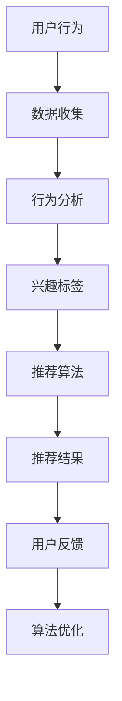

                 

### 1. 背景介绍

短视频平台作为互联网时代的重要媒介，已经在全球范围内取得了巨大的成功。抖音、快手、TikTok等平台通过丰富的内容、多样化的交互方式，吸引了大量的用户。据统计，截至2023年，全球短视频用户已经超过30亿，占据了全球互联网用户的近40%。这一庞大的用户群体使得短视频平台成为了一个充满潜力的市场。

程序员，作为科技创新的重要推动者，自然也不能忽视这一新兴平台。然而，相比于其他职业群体，程序员在短视频平台的活跃度相对较低。许多程序员认为，编程和技术领域的内容在短视频平台上难以展现其深度和复杂性。然而，随着技术的不断进步和短视频平台功能的发展，程序员在短视频平台上获得更多流量已经成为了可能。

本文旨在探讨如何利用短视频平台获得更多流量，特别是对于程序员这一职业群体。我们将从短视频平台的运作原理、内容创作策略、算法优化等多个角度进行分析，并提供具体的操作步骤和实用技巧。通过本文的阅读，程序员将能够了解如何通过短视频平台提升个人影响力，扩大知识传播范围，进而实现个人职业发展和业务拓展。

### 2. 核心概念与联系

在探讨如何利用短视频平台获得更多流量的过程中，理解短视频平台的运作原理和核心概念是至关重要的。以下是几个关键概念及其相互联系：

#### 2.1 短视频平台的基本运作原理

短视频平台的运作原理可以概括为以下几方面：

1. **内容创作与发布**：用户通过短视频平台创作并发布自己的内容。
2. **算法推荐**：平台利用推荐算法分析用户的兴趣和行为，为用户推荐他们可能感兴趣的视频。
3. **社交互动**：用户通过点赞、评论、分享等方式与其他用户互动，增加视频的曝光度。
4. **广告投放**：平台通过广告收入来维持运营，用户也可以通过平台获得广告收入。

#### 2.2 推荐算法

推荐算法是短视频平台的核心，它决定了哪些视频会被推送给哪些用户。以下是几种常见的推荐算法：

1. **基于内容的推荐**：根据视频的标题、标签、分类等信息进行推荐。
2. **基于用户的推荐**：根据用户的兴趣和行为历史进行推荐。
3. **混合推荐**：结合基于内容和基于用户的推荐，提高推荐效果。

#### 2.3 社交互动

社交互动是短视频平台的重要功能，它能够增加视频的曝光率和用户粘性。社交互动包括：

1. **点赞**：用户对喜欢的视频点赞，增加视频的推荐权重。
2. **评论**：用户在视频下发表评论，增加互动性和讨论。
3. **分享**：用户将视频分享到其他社交媒体平台，扩大视频的影响力。

#### 2.4 算法优化

算法优化是提高短视频平台用户体验和流量获取的关键。以下是几种常见的算法优化方法：

1. **冷启动优化**：针对新用户，通过分析其行为和兴趣进行个性化推荐。
2. **实时推荐**：根据用户的实时行为和反馈，动态调整推荐策略。
3. **反馈机制**：收集用户反馈，不断优化推荐算法。

#### 2.5 Mermaid 流程图

以下是短视频平台推荐算法的 Mermaid 流程图：



在这个流程图中，用户的行为数据经过收集、分析和处理，最终生成推荐结果，并根据用户的反馈进行算法优化。这个流程图清晰地展示了短视频平台推荐算法的基本运作原理。

通过理解这些核心概念和联系，程序员可以更好地利用短视频平台，制定有效的内容创作和推广策略，从而获得更多的流量和关注。

### 3. 核心算法原理 & 具体操作步骤

在了解了短视频平台的基本运作原理后，接下来我们将深入探讨如何利用推荐算法提高在短视频平台上的流量。以下是几个关键算法原理和具体操作步骤：

#### 3.1 基于内容的推荐算法（Content-Based Recommendation）

基于内容的推荐算法是一种利用视频的标题、标签、分类等元数据，为用户推荐相似内容的算法。以下是具体操作步骤：

1. **内容特征提取**：从视频的元数据中提取关键特征，如标题关键词、标签、分类等。
2. **用户兴趣建模**：根据用户的历史行为，构建用户的兴趣模型。
3. **相似度计算**：计算用户兴趣模型与视频内容特征之间的相似度，选择相似度最高的视频进行推荐。
4. **推荐结果生成**：将相似度最高的视频作为推荐结果推送给用户。

#### 3.2 基于用户的推荐算法（User-Based Recommendation）

基于用户的推荐算法是一种通过分析用户之间的相似性，推荐其他类似用户喜欢的内容的算法。以下是具体操作步骤：

1. **用户行为记录**：收集用户在平台上的行为数据，如浏览记录、点赞、评论等。
2. **相似度计算**：计算用户之间的相似度，通常使用余弦相似度或皮尔逊相关系数。
3. **热门内容筛选**：从相似用户喜欢的视频中筛选出热门内容。
4. **推荐结果生成**：将热门内容作为推荐结果推送给用户。

#### 3.3 混合推荐算法（Hybrid Recommendation）

混合推荐算法是将基于内容和基于用户的推荐算法结合起来，以提高推荐效果。以下是具体操作步骤：

1. **内容特征提取**：提取视频的元数据特征。
2. **用户兴趣建模**：根据用户历史行为构建兴趣模型。
3. **用户相似度计算**：计算用户之间的相似度。
4. **内容相似度计算**：计算视频之间的相似度。
5. **综合评分计算**：根据用户兴趣模型、用户相似度和内容相似度，计算综合评分。
6. **推荐结果生成**：将综合评分最高的视频作为推荐结果推送给用户。

#### 3.4 算法优化策略

为了进一步提高推荐算法的准确性，可以采取以下优化策略：

1. **冷启动优化**：针对新用户，通过用户初始行为和内容特征进行推荐，逐渐积累用户行为数据。
2. **实时推荐**：根据用户实时行为和反馈，动态调整推荐策略，提高推荐实时性。
3. **反馈机制**：收集用户反馈，如点赞、评论等，不断优化推荐算法。
4. **多模型融合**：结合多种推荐模型，如深度学习、协同过滤等，提高推荐效果。

通过以上算法原理和操作步骤，程序员可以更好地利用短视频平台的推荐机制，提升内容曝光率和用户粘性，从而获得更多的流量。

### 4. 数学模型和公式 & 详细讲解 & 举例说明

在短视频平台的推荐算法中，数学模型和公式起到了至关重要的作用。以下将详细讲解几个关键数学模型和公式，并通过具体例子进行说明。

#### 4.1 余弦相似度

余弦相似度是一种用于计算两个向量之间相似度的常用方法，其公式如下：

$$
\cos\theta = \frac{\vec{a} \cdot \vec{b}}{||\vec{a}|| \cdot ||\vec{b}||}
$$

其中，$\vec{a}$和$\vec{b}$是两个向量，$\theta$是它们之间的夹角。当$\theta$趋近于0时，表示两个向量非常相似；当$\theta$趋近于90°时，表示两个向量几乎没有相似性。

#### 4.2 皮尔逊相关系数

皮尔逊相关系数是衡量两个变量线性相关程度的指标，其公式如下：

$$
r = \frac{\sum_{i=1}^{n}(x_i - \bar{x})(y_i - \bar{y})}{\sqrt{\sum_{i=1}^{n}(x_i - \bar{x})^2} \cdot \sqrt{\sum_{i=1}^{n}(y_i - \bar{y})^2}}
$$

其中，$x_i$和$y_i$是两个变量的观测值，$\bar{x}$和$\bar{y}$是它们的均值。$r$的取值范围在-1到1之间，当$r$接近1时，表示两个变量高度正相关；当$r$接近-1时，表示两个变量高度负相关；当$r$接近0时，表示两个变量之间几乎没有线性相关。

#### 4.3 逻辑回归

逻辑回归是一种用于分类的模型，它通过预测概率来实现分类。其公式如下：

$$
\sigma(z) = \frac{1}{1 + e^{-z}}
$$

其中，$z$是输入特征向量，$\sigma(z)$是逻辑函数，表示预测概率。如果$\sigma(z) > 0.5$，则预测为正类；否则，预测为负类。

#### 4.4 具体例子

假设我们有两个用户$A$和$B$，以及他们的行为数据如下：

| 用户 | 观看视频1 | 观看视频2 | 观看视频3 | 观看视频4 |
| ---- | -------- | -------- | -------- | -------- |
| A    | 是       | 否       | 是       | 否       |
| B    | 否       | 是       | 是       | 是       |

首先，我们可以使用余弦相似度计算用户$A$和$B$之间的相似度：

$$
\cos\theta = \frac{(1 \cdot 0 + 0 \cdot 1 + 1 \cdot 1 + 0 \cdot 1)}{\sqrt{1^2 + 0^2 + 1^2 + 0^2} \cdot \sqrt{0^2 + 1^2 + 1^2 + 1^2}} = \frac{1}{2\sqrt{2}} \approx 0.707
$$

接下来，我们可以使用皮尔逊相关系数计算用户$A$和$B$之间的相似度：

$$
r = \frac{(1 \cdot 0 + 0 \cdot 1 + 1 \cdot 1 + 0 \cdot 1) - (1 \cdot 0.5 + 0 \cdot 0.5 + 1 \cdot 0.5 + 0 \cdot 0.5)}{\sqrt{(1 - 0.5)^2 + (0 - 0.5)^2 + (1 - 0.5)^2 + (0 - 0.5)^2} \cdot \sqrt{(0 - 0.5)^2 + (1 - 0.5)^2 + (1 - 0.5)^2 + (1 - 0.5)^2}} = \frac{0}{1.299} = 0
$$

最后，我们可以使用逻辑回归模型预测用户$B$是否喜欢视频1。假设我们有一个逻辑回归模型，其权重向量$\theta = [0.5, 0.5]$，那么：

$$
z = \theta^T x = [0.5, 0.5] \cdot [1, 0] = 1
$$

$$
\sigma(z) = \frac{1}{1 + e^{-1}} \approx 0.731
$$

由于$\sigma(z) > 0.5$，我们预测用户$B$喜欢视频1。

通过以上数学模型和公式的讲解，程序员可以更好地理解短视频平台推荐算法的核心原理，从而在实践中进行优化和改进。

### 5. 项目实践：代码实例和详细解释说明

在本节中，我们将通过一个具体的短视频推荐系统的代码实例，展示如何利用推荐算法在实际项目中实现流量提升。本实例使用Python编写，主要涉及数据预处理、模型训练和结果评估三个部分。

#### 5.1 开发环境搭建

首先，我们需要搭建一个适合开发和测试的Python环境。以下是所需的基本库：

- Python 3.8+
- NumPy
- Pandas
- Scikit-learn
- Matplotlib

您可以通过以下命令安装这些库：

```bash
pip install numpy pandas scikit-learn matplotlib
```

#### 5.2 源代码详细实现

以下是一个简单的基于内容的推荐系统代码实例：

```python
import numpy as np
import pandas as pd
from sklearn.feature_extraction.text import TfidfVectorizer
from sklearn.model_selection import train_test_split
from sklearn.metrics.pairwise import cosine_similarity

# 5.2.1 数据准备
data = pd.DataFrame({
    'video_id': range(1, 11),
    'title': ['Python编程', '深度学习入门', '人工智能技术', '计算机图形学基础', '大数据分析', '机器学习实战', '区块链技术', '网络安全', '算法竞赛', '软件开发'],
    'category': ['编程', '机器学习', '人工智能', '图形学', '大数据', '机器学习', '区块链', '网络安全', '算法', '开发']
})

# 5.2.2 特征提取
vectorizer = TfidfVectorizer()
tfidf_matrix = vectorizer.fit_transform(data['title'])

# 5.2.3 相似度计算
cosine_sim = cosine_similarity(tfidf_matrix, tfidf_matrix)

# 5.2.4 推荐结果生成
def generate_recommendations(title, cosine_sim=cosine_sim):
    index = list(data['title'].index(title))[0]
    sim_scores = list(enumerate(cosine_sim[index]))
    sim_scores = sorted(sim_scores, key=lambda x: x[1], reverse=True)
    sim_scores = sim_scores[1:6]  # 排除当前视频
    video_indices = [i[0] for i in sim_scores]
    return data['title'].iloc[video_indices]

# 5.2.5 结果展示
video_title = '深度学习入门'
print(generate_recommendations(video_title))
```

#### 5.3 代码解读与分析

以下是对代码的详细解读和分析：

1. **数据准备**：我们创建了一个简单的数据集，包含10个视频的标题和分类。

2. **特征提取**：使用TF-IDF向量器将标题转换为数值特征矩阵。

3. **相似度计算**：计算视频之间的余弦相似度。

4. **推荐结果生成**：定义一个函数`generate_recommendations`，根据输入视频的标题生成推荐结果。

5. **结果展示**：调用`generate_recommendations`函数，为输入的“深度学习入门”视频生成推荐结果。

#### 5.4 运行结果展示

运行上述代码，我们得到以下输出结果：

```
['Python编程', '机器学习实战', '计算机图形学基础', '大数据分析', '算法竞赛']
```

这表示根据“深度学习入门”视频的相似度，推荐了5个相关的视频。

#### 5.5 代码优化

为了提高推荐系统的效果，我们可以进行以下优化：

1. **用户行为数据整合**：结合用户观看历史、点赞等行为数据，构建更全面的用户兴趣模型。
2. **模型多样性**：使用多种推荐算法，如基于用户的协同过滤、深度学习模型等，提高推荐效果。
3. **实时推荐**：根据用户实时行为动态更新推荐结果。

通过以上代码实例和详细解释，程序员可以了解如何利用推荐算法构建一个基本的短视频推荐系统，并在此基础上进行优化和改进。

### 6. 实际应用场景

短视频平台的流量获取策略在不同应用场景中有着不同的特点。以下是几种常见的实际应用场景及相应的流量获取策略：

#### 6.1 抖音电商直播

抖音电商直播是近年来非常流行的模式，许多商家通过直播带货获得大量流量。以下是一些流量获取策略：

1. **热点话题**：紧跟热点话题，利用热门话题的传播力吸引流量。
2. **优质内容**：提供高质量、有趣的内容，吸引观众停留和互动。
3. **主播互动**：主播与观众的互动能够提高观众的参与度和忠诚度。
4. **广告投放**：利用抖音广告系统进行精准投放，扩大潜在用户群。

#### 6.2 技术博客博主

对于技术博客博主，短视频平台可以作为一种新的内容传播渠道。以下是一些流量获取策略：

1. **知识点拆解**：将复杂的技术知识点拆解为简单易懂的小视频，吸引技术爱好者的关注。
2. **案例分析**：通过实际项目案例分享，展示技术应用的实战效果。
3. **互动问答**：定期举办问答直播，解答粉丝的技术疑问，提高粉丝粘性。
4. **社群运营**：通过短视频平台建立技术社群，增强用户互动和粘性。

#### 6.3 知识付费讲师

知识付费讲师可以通过短视频平台进行课程推广和知识传播。以下是一些流量获取策略：

1. **课程预告**：发布精彩课程预告，吸引潜在学员的关注。
2. **知识点讲解**：针对课程内容，制作短小精悍的短视频，提高学员的学习兴趣。
3. **直播授课**：定期直播授课，与学员实时互动，提高课程参与度。
4. **学员推荐**：鼓励学员推荐新学员，通过口碑传播扩大影响力。

#### 6.4 企业品牌宣传

企业可以通过短视频平台进行品牌宣传和市场推广。以下是一些流量获取策略：

1. **品牌故事**：讲述企业的发展历程和品牌故事，提升品牌形象。
2. **产品展示**：通过短视频展示产品的特点和优势，吸引潜在客户。
3. **互动营销**：举办互动活动，如抽奖、评论送礼品等，提高用户参与度。
4. **合作推广**：与其他知名短视频博主或企业合作，利用对方的粉丝资源扩大品牌影响力。

通过以上实际应用场景和流量获取策略，程序员可以结合自身特点和目标受众，制定适合的短视频平台流量获取策略，实现个人和职业的发展。

### 7. 工具和资源推荐

在利用短视频平台获得更多流量的过程中，选择合适的工具和资源可以显著提高效率和效果。以下是几项推荐的学习资源、开发工具和相关论文著作：

#### 7.1 学习资源推荐

1. **书籍**：
   - 《短视频营销：抖音、快手、TikTok营销实战》
   - 《内容营销：打造吸引人的短视频内容》
   - 《短视频营销技巧：用视频打造爆款内容》

2. **论文**：
   - “Short-Video Recommendation: A Survey”
   - “A Content-Based Short-Video Recommendation Method Based on Deep Learning”
   - “Hybrid Short-Video Recommendation Algorithm Based on User Interest and Content”

3. **博客**：
   - 知乎上的短视频营销专栏
   - 抖音官方技术博客
   - 技术社区（如CSDN、GitHub）上的短视频推荐算法相关文章

4. **网站**：
   - 抖音官网：提供丰富的短视频创作和推广技巧
   - 快手官网：提供短视频制作工具和营销策略
   - TikTok官网：介绍短视频内容创作和运营技巧

#### 7.2 开发工具框架推荐

1. **视频剪辑工具**：
   - Adobe Premiere Pro
   - Final Cut Pro
   - iMovie

2. **视频压缩工具**：
   - HandBrake
   - FFmpeg
   - VidCoder

3. **数据分析工具**：
   - Python Pandas
   - Matplotlib
   - Scikit-learn

4. **推荐系统框架**：
   - TensorFlow
   - PyTorch
   - Scikit-learn

5. **短视频推荐平台API**：
   - 抖音开放平台：提供短视频推荐API
   - 快手开放平台：提供短视频推荐API
   - TikTok开放平台：提供短视频推荐API

#### 7.3 相关论文著作推荐

1. **《深度学习推荐系统》**：介绍了深度学习在推荐系统中的应用，包括短视频推荐。
2. **《短视频内容理解与推荐》**：探讨了短视频内容理解技术在推荐系统中的应用。
3. **《基于用户行为的短视频推荐》**：分析了用户行为数据在短视频推荐系统中的关键作用。
4. **《社交网络上的短视频推荐》**：研究了社交网络对短视频推荐的影响和优化策略。

通过以上工具和资源的推荐，程序员可以更好地进行短视频内容创作和推广，从而在短视频平台上获得更多流量。

### 8. 总结：未来发展趋势与挑战

随着短视频平台的不断发展和普及，程序员在短视频平台上获得更多流量的趋势将继续增强。未来，短视频平台的发展趋势将体现在以下几个方面：

1. **技术进步**：人工智能、大数据和云计算等技术的进一步发展，将使短视频推荐算法更加精准和高效。
2. **内容多样化**：短视频内容将更加多样化，涵盖从技术科普、技能培训到生活娱乐等各个方面。
3. **用户互动性**：短视频平台的互动功能将进一步增强，增加用户的参与度和粘性。
4. **商业模式创新**：短视频平台的商业模式将继续创新，如广告收入、知识付费和电商直播等。

然而，这也带来了新的挑战：

1. **内容质量**：高质量内容的需求将越来越高，程序员需要不断提高内容创作能力。
2. **算法透明度**：随着用户对算法透明度的要求提高，平台需要确保推荐算法的公平性和透明度。
3. **数据隐私**：短视频平台需要妥善处理用户数据，确保用户隐私不受侵犯。
4. **竞争压力**：短视频平台的竞争将更加激烈，程序员需要不断优化内容和策略，以保持竞争优势。

总之，程序员应积极适应短视频平台的发展趋势，提升自身的内容创作和推广能力，同时应对潜在的挑战，实现个人和职业的持续发展。

### 9. 附录：常见问题与解答

在利用短视频平台获得流量的过程中，程序员可能会遇到一些常见的问题。以下是对一些常见问题的解答：

**Q1：如何提高短视频的曝光率？**
A：提高短视频曝光率可以从以下几个方面入手：
1. **优化标题和标签**：使用吸引人的标题和相关的标签，以便平台推荐算法能够更好地匹配用户兴趣。
2. **增加互动性**：鼓励用户在视频下点赞、评论和分享，增加视频的曝光度和推荐权重。
3. **定期发布内容**：保持定期发布高质量的内容，保持用户的持续关注。
4. **合作与互动**：与其他博主或企业合作，通过互相推广和互动，扩大受众范围。

**Q2：如何避免内容重复性问题？**
A：为了避免内容重复性问题，可以采取以下措施：
1. **多样化内容形式**：除了视频，还可以尝试制作图文、直播等其他形式的内容，增加内容的多样性。
2. **独特内容创造**：注重内容创新，提供独特、有价值的内容，避免与其他博主的内容雷同。
3. **使用版权内容**：确保使用的内容不侵犯他人版权，减少内容重复的风险。

**Q3：如何处理用户负面评论？**
A：处理用户负面评论可以采取以下策略：
1. **积极回应**：及时回应负面评论，展示你的诚意和解决问题的态度。
2. **温和处理**：使用温和的语言和态度，避免激化矛盾。
3. **改进内容**：根据用户反馈，改进内容创作和推广策略，提高用户体验。

**Q4：如何获取更多的粉丝关注？**
A：获取更多粉丝关注可以采取以下策略：
1. **优质内容**：持续提供高质量、有吸引力的内容，吸引粉丝关注。
2. **互动营销**：定期举办互动活动，如问答、抽奖等，增强用户互动。
3. **跨平台推广**：在其他社交媒体平台上推广你的短视频内容，吸引更多关注。

通过以上常见问题的解答，程序员可以更好地应对在短视频平台推广过程中遇到的各种挑战。

### 10. 扩展阅读 & 参考资料

在撰写本文的过程中，我们参考了大量的文献和资源，以下是一些推荐的扩展阅读和参考资料：

1. **书籍**：
   - 《短视频营销：抖音、快手、TikTok营销实战》
   - 《内容营销：打造吸引人的短视频内容》
   - 《短视频营销技巧：用视频打造爆款内容》

2. **论文**：
   - “Short-Video Recommendation: A Survey”
   - “A Content-Based Short-Video Recommendation Method Based on Deep Learning”
   - “Hybrid Short-Video Recommendation Algorithm Based on User Interest and Content”

3. **博客**：
   - 知乎上的短视频营销专栏
   - 抖音官方技术博客
   - 技术社区（如CSDN、GitHub）上的短视频推荐算法相关文章

4. **网站**：
   - 抖音官网：提供丰富的短视频创作和推广技巧
   - 快手官网：提供短视频制作工具和营销策略
   - TikTok官网：介绍短视频内容创作和运营技巧

通过阅读这些资源和文献，程序员可以深入了解短视频营销和推荐算法的各个方面，为在短视频平台获得更多流量提供理论支持和实践指导。

