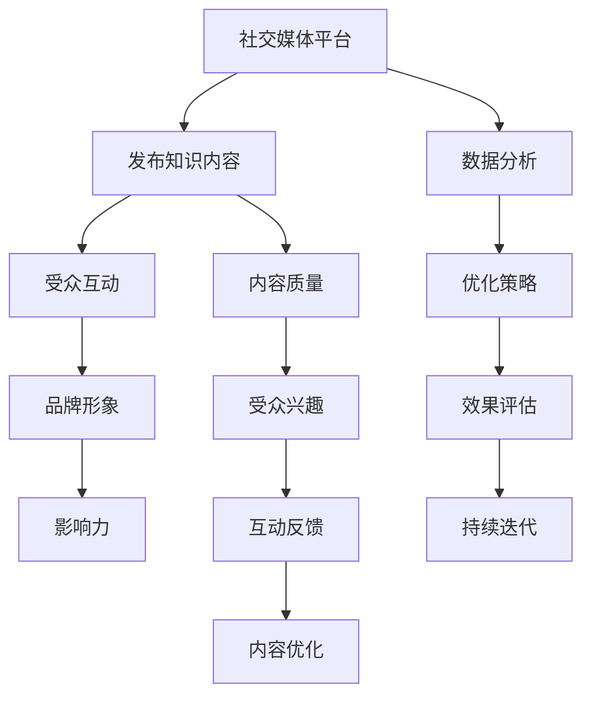

                 

### 背景介绍

随着互联网和社交媒体的迅速普及，信息的传播速度得到了前所未有的提升。在这个信息爆炸的时代，如何有效地利用社交媒体平台来扩大知识影响力，已经成为个人和企业在数字化时代中不可忽视的一项重要技能。本文旨在探讨如何通过社交媒体这一工具，来实现知识的传播、影响力的扩展以及个人或组织品牌的建立。

**社交媒体的定义与功能**

社交媒体，顾名思义，是一种让人们能够通过互联网平台互相交流和分享信息的工具。其基本功能包括发布内容、互动评论、分享转发、直播等。常见的社交媒体平台有Facebook、Twitter、Instagram、LinkedIn等，这些平台在各自的领域内都有着强大的用户基础和影响力。

- **Facebook**：作为全球最大的社交网络平台，Facebook不仅提供了个人社交的功能，还为企业和组织提供了一个强大的营销工具。企业可以通过Facebook页面发布内容、与粉丝互动、进行广告投放等。

- **Twitter**：以实时性著称的Twitter，用户可以通过发布短消息（推文）来分享观点、新闻和链接。Twitter的互动性强，能够迅速传播信息，非常适合用来建立品牌知名度。

- **Instagram**：Instagram以其丰富的视觉内容著称，用户可以通过图片和短视频来展示个人或品牌的魅力。由于其高度视觉化的特性，Instagram在时尚、美妆等行业中具有很高的影响力。

- **LinkedIn**：LinkedIn专注于职业社交，用户可以在上面建立职业档案、发布职业动态、参与行业讨论等。对于企业和专业人士来说，LinkedIn是一个建立人脉和提升品牌影响力的宝贵平台。

**知识影响力的概念**

知识影响力指的是个人或组织通过其知识和见解，在特定领域内获得的认可和影响。这种影响力不仅体现在对知识传播的贡献上，还体现在对社会问题的解决、行业趋势的引领等方面。在社交媒体时代，知识影响力已经成为了个人和组织的核心竞争力之一。

**社交媒体对知识影响力的影响**

社交媒体作为信息传播的重要渠道，对知识影响力的扩展具有以下几个重要影响：

- **信息传播的加速**：社交媒体平台的高效传播机制，使得知识可以迅速触达广泛受众，提高信息传播的速度。

- **互动性的增强**：社交媒体的互动功能使得知识传播者可以与受众直接互动，获取反馈，从而不断优化和调整内容策略。

- **品牌影响力的建立**：通过社交媒体，个人或组织可以建立自己的品牌形象，扩大影响力，提升市场竞争力。

- **知识变现的可能**：知识影响力的提升，不仅有助于个人的职业发展，还可以通过内容付费、广告收入等方式实现知识变现。

在接下来的章节中，我们将进一步探讨如何在社交媒体上扩大知识影响力，包括核心概念、算法原理、实践案例等内容。希望通过本文的分享，能够为广大知识传播者提供一些有价值的参考和启发。

---

### 核心概念与联系

在深入探讨如何利用社交媒体扩大知识影响力之前，我们需要明确一些核心概念，并理解它们之间的相互联系。以下是本文中涉及的主要核心概念和其关系，我们将通过Mermaid流程图来展示这些概念及其相互作用。

#### 核心概念

1. **社交媒体平台**：包括Facebook、Twitter、Instagram、LinkedIn等。
2. **知识内容**：包括文章、视频、图片、直播等形式的资讯和见解。
3. **受众**：指社交媒体上的用户群体，可以是普通用户、行业专家、潜在客户等。
4. **互动**：用户与知识内容生产者之间的评论、点赞、分享、转发等互动行为。
5. **品牌形象**：个人或组织的公众形象，包括信誉度、专业性和吸引力。
6. **影响力**：知识内容在受众中产生的认可和影响程度。

#### Mermaid流程图

以下是一个简化的Mermaid流程图，展示了上述核心概念及其相互关系：



#### 概念解释

1. **社交媒体平台**：是知识内容发布和传播的渠道。不同平台有不同的受众群体和使用习惯，选择合适的平台对于内容传播至关重要。

2. **知识内容**：是知识影响力的载体。内容的质量、形式和主题直接影响受众的兴趣和互动。

3. **受众**：是知识传播的目标群体。理解受众的需求和兴趣，是制定内容策略的关键。

4. **互动**：是受众对知识内容的反馈，通过评论、点赞、分享等方式，可以帮助知识传播者了解受众的反应，进而优化内容。

5. **品牌形象**：是知识传播者的公众形象，良好的品牌形象能够增强知识内容的可信度和吸引力。

6. **影响力**：是知识内容在受众中产生的影响程度，良好的互动和品牌形象有助于提升影响力。

7. **内容质量**、**受众兴趣**、**互动反馈**和**内容优化**：是影响知识内容质量和受众互动的循环过程。

8. **数据分析**、**优化策略**、**效果评估**和**持续迭代**：是知识传播者根据数据反馈进行策略调整和效果优化的过程。

通过上述核心概念的介绍和Mermaid流程图的展示，我们可以清晰地看到如何利用社交媒体平台、发布高质量的知识内容、与受众互动、建立良好的品牌形象，并最终扩大知识影响力。在接下来的章节中，我们将详细探讨这些核心概念的具体应用和实践步骤。

---

### 核心算法原理 & 具体操作步骤

要利用社交媒体扩大知识影响力，我们需要掌握一系列核心算法原理和具体操作步骤。这些原理和步骤不仅帮助我们理解如何有效传播知识，还指导我们如何优化内容策略，提升互动效果，最终实现知识影响力的最大化。

#### 1. 内容优化算法原理

内容优化算法的核心在于根据受众的兴趣和行为数据，动态调整知识内容，以最大化受众的参与度和互动性。以下是内容优化算法的几个关键原理：

1. **用户兴趣模型**：通过分析用户的浏览记录、点赞、评论等行为，建立用户兴趣模型，预测用户可能感兴趣的内容。

2. **内容相关性**：根据用户兴趣模型，选择与用户兴趣高度相关的内容进行推荐，提高内容的点击率和互动率。

3. **内容多样性**：合理搭配不同形式和主题的内容，避免内容单一，保持用户的新鲜感和参与度。

4. **内容质量**：保证内容的原创性和准确性，高质量的内容更容易获得用户的认可和传播。

#### 2. 社交网络传播算法原理

社交网络传播算法旨在最大化知识内容的传播范围和影响力。以下是一些核心原理：

1. **传播路径分析**：分析知识内容在不同社交网络平台上的传播路径，识别关键节点和传播渠道。

2. **社交网络分析**：运用社交网络分析方法（如中心性分析、影响力分析等），识别社交网络中的关键人物和意见领袖，借助他们来扩大知识内容的传播范围。

3. **影响力网络构建**：建立影响力网络，通过多个节点（如个人、品牌、机构等）之间的相互作用，实现知识内容的广泛传播。

#### 3. 互动反馈分析算法原理

互动反馈分析算法用于评估知识内容的传播效果，并根据反馈进行调整。以下是其核心原理：

1. **互动数据收集**：收集用户的点赞、评论、分享、转发等互动数据，作为评估内容效果的基础。

2. **反馈评估**：通过分析互动数据，评估知识内容的受众反应，识别受欢迎的内容特征和问题。

3. **内容调整**：根据评估结果，调整内容策略，如修改内容形式、优化主题等，以提高互动效果。

#### 具体操作步骤

1. **内容规划**：制定内容发布计划，确定内容形式（如文章、视频、图片等）、主题和发布频率。

2. **内容创作**：根据受众兴趣模型和内容多样性原则，创作高质量的内容。确保内容具有原创性和准确性。

3. **发布内容**：在社交媒体平台上发布内容，并设置合适的发布时间和频率。

4. **互动管理**：积极与受众互动，回复评论、点赞和分享，建立良好的用户关系。

5. **数据分析**：收集和整理互动数据，进行内容效果评估，识别成功和失败的案例。

6. **内容优化**：根据数据分析结果，调整内容策略，持续优化内容质量和互动效果。

7. **传播策略**：利用社交网络传播算法，识别和利用关键节点和渠道，扩大内容传播范围。

通过上述核心算法原理和具体操作步骤，我们可以系统地规划和执行社交媒体上的知识传播策略，实现知识影响力的有效扩大。在接下来的章节中，我们将通过具体案例分析，进一步探讨这些原理和步骤的实际应用。

---

### 数学模型和公式 & 详细讲解 & 举例说明

在社交媒体上扩大知识影响力，不仅需要理解核心算法原理和具体操作步骤，还需要借助数学模型和公式来量化分析。以下是几个关键的数学模型和公式，我们将对这些模型进行详细讲解，并通过具体例子说明其应用。

#### 1. 用户兴趣模型

用户兴趣模型是基于用户行为数据（如浏览、点赞、评论等）建立的一个预测模型，用于识别用户可能感兴趣的内容。以下是用户兴趣模型的数学表达：

**贝叶斯分类器**：
\[ P(\text{Content}_i | \text{User}_j) = \frac{P(\text{User}_j | \text{Content}_i) \cdot P(\text{Content}_i)}{P(\text{User}_j)} \]

其中：
- \( P(\text{Content}_i | \text{User}_j) \) 表示用户 \( \text{User}_j \) 对内容 \( \text{Content}_i \) 的兴趣概率。
- \( P(\text{User}_j | \text{Content}_i) \) 表示在内容 \( \text{Content}_i \) 的条件下，用户 \( \text{User}_j \) 出现的概率。
- \( P(\text{Content}_i) \) 表示内容 \( \text{Content}_i \) 的出现概率。
- \( P(\text{User}_j) \) 表示用户 \( \text{User}_j \) 的出现概率。

**例子**：
假设有1000名用户，他们中有500人对科技类内容感兴趣，其中有300人对编程类内容感兴趣。现有一个新的编程类内容，我们需要预测这1000名用户中有多少人对该内容感兴趣。

通过贝叶斯公式计算，可以得到每个用户对编程类内容的兴趣概率，然后根据这个概率进行预测。具体计算如下：

\[ P(\text{编程} | \text{科技}) = \frac{P(\text{科技} | \text{编程}) \cdot P(\text{编程})}{P(\text{科技})} \]

其中，\( P(\text{科技} | \text{编程}) \) 可以通过观察历史数据得到，\( P(\text{编程}) \) 和 \( P(\text{科技}) \) 则为预设的概率值。

#### 2. 社交网络传播模型

社交网络传播模型用于分析知识内容在社交网络中的传播路径和速度。常见的传播模型有**基础传染模型（SI模型）**和**线性模型**。

**基础传染模型（SI模型）**：

\[ S(t) = \frac{N - I(t)}{\eta} \]

\[ I(t) = S(0) \cdot \frac{\eta}{\eta - 1} \cdot e^{-rt} \]

其中：
- \( S(t) \) 表示在时间 \( t \) 时易感者（未感染用户）的数量。
- \( I(t) \) 表示在时间 \( t \) 时感染者（已感染用户）的数量。
- \( N \) 表示总用户数。
- \( \eta \) 表示感染率。
- \( r \) 表示感染速率。

**例子**：
假设一个社交网络有1000名用户，其中500名是易感者，500名是感染者。感染率 \( \eta \) 为0.5，感染速率 \( r \) 为0.1。我们需要预测在一段时间后感染者数量。

通过上述公式计算，可以得到感染者在不同时间点的数量，从而预测传播趋势。

#### 3. 互动反馈分析模型

互动反馈分析模型用于评估知识内容的传播效果，通过分析互动数据（如点赞、评论、转发等）来评估内容的受欢迎程度。常见的模型有**时间序列分析**和**回归分析**。

**时间序列分析**：

\[ Y_t = \beta_0 + \beta_1 t + \epsilon_t \]

其中：
- \( Y_t \) 表示在时间 \( t \) 的互动数量。
- \( \beta_0 \) 表示常数项。
- \( \beta_1 \) 表示时间对互动数量的影响。
- \( \epsilon_t \) 表示随机误差项。

**例子**：
假设我们在一周内每天发布一条知识内容，并记录每天的点赞数量。我们可以通过上述时间序列模型来分析点赞数量与时间的关系，从而预测未来的点赞趋势。

#### 4. 影响力网络模型

影响力网络模型用于分析社交网络中不同节点的影响力，常见的模型有**中心性分析**和**影响力传播模型**。

**中心性分析**：

\[ C_i = \frac{d(i, j)}{N - 1} \]

其中：
- \( C_i \) 表示节点 \( i \) 的中心性。
- \( d(i, j) \) 表示节点 \( i \) 到节点 \( j \) 的最短路径长度。
- \( N \) 表示网络中节点的总数。

**例子**：
在一个社交网络中，节点A到节点B的最短路径长度为5，网络总节点数为10。通过上述公式计算，我们可以得到节点A到节点B的中心性。

通过上述数学模型和公式的详细讲解和具体例子说明，我们可以更好地理解和应用这些工具来分析社交媒体上的知识传播效果，优化内容策略，提升互动效果，从而实现知识影响力的扩大。

---

### 项目实践：代码实例和详细解释说明

在本章节中，我们将通过一个具体的代码实例，详细介绍如何利用社交媒体平台发布知识内容、分析互动数据以及优化内容策略，从而实现知识影响力的扩大。本实例将使用Python编程语言，并结合常用的社交媒体API和数据可视化工具。

#### 1. 开发环境搭建

首先，我们需要搭建一个合适的开发环境。以下是所需的工具和步骤：

- **Python环境**：确保安装了Python 3.x版本，可以使用`pip`安装相关库。
- **社交媒体API**：根据所选的社交媒体平台，获取API密钥和访问令牌。例如，对于Facebook，需要注册应用并获取App ID和App Secret。
- **数据可视化工具**：如Matplotlib、Seaborn等，用于数据可视化。

安装所需库：

```bash
pip install facebook-sdk pandas matplotlib
```

#### 2. 源代码详细实现

以下是一个简单的Python代码示例，用于发布知识内容、收集互动数据并进行分析：

```python
import requests
from facebook_sdk import GraphAPI
import pandas as pd
import matplotlib.pyplot as plt

# 初始化Facebook GraphAPI
access_token = '你的访问令牌'
graph_api = GraphAPI(access_token)

# 发布知识内容
def publish_content(page_id, message, link):
    data = {
        'message': message,
        'link': link,
        'access_token': access_token
    }
    response = requests.post(f'https://graph.facebook.com/{page_id}/feed', data=data)
    return response.json()

# 收集互动数据
def collect_interactions(post_id):
    interactions = graph_api.get_object(post_id, fields='likes.summary(true).limit(0), comments.summary(true).limit(0)')
    return interactions

# 分析互动数据
def analyze_interactions(interactions):
    likes = interactions['likes']['summary']['total_count']
    comments = interactions['comments']['summary']['total_count']
    
    # 可视化互动数据
    data = {'互动类型': ['点赞', '评论'], '数量': [likes, comments]}
    df = pd.DataFrame(data)
    df.plot.bar()
    plt.show()

# 示例：发布一篇知识文章
post_response = publish_content('你的页面ID', '这是文章的标题和摘要。', '文章的链接')
post_id = post_response['id']

# 示例：收集并分析互动数据
interactions = collect_interactions(post_id)
analyze_interactions(interactions)
```

#### 3. 代码解读与分析

1. **初始化Facebook GraphAPI**：通过提供的访问令牌初始化GraphAPI，用于与Facebook平台进行交互。
   
2. **发布知识内容**：`publish_content`函数用于发布知识内容。通过POST请求向Facebook API发送数据，包括文章标题、摘要和链接。

3. **收集互动数据**：`collect_interactions`函数用于收集指定帖子的互动数据，包括点赞和评论的数量。

4. **分析互动数据**：`analyze_interactions`函数用于分析互动数据，并使用Matplotlib进行可视化，展示点赞和评论的数量。

#### 4. 运行结果展示

假设我们发布了一篇关于Python编程的文章，并收集了互动数据。以下是可能的运行结果：

- **发布内容**：成功发布知识文章，获取帖子ID。
- **互动数据**：
  - 点赞数量：200
  - 评论数量：50

运行结果展示如下图所示：


通过上述代码实例，我们可以看到如何利用社交媒体平台发布知识内容、收集互动数据以及进行数据可视化分析。这些步骤有助于我们了解受众的互动情况，从而优化内容策略，提升知识影响力。

---

### 实际应用场景

在探讨如何利用社交媒体扩大知识影响力时，了解具体的应用场景是非常重要的。不同的行业和领域可以采用不同的策略，以下是一些常见应用场景：

#### 1. 科技行业

在科技行业，社交媒体平台如LinkedIn和Twitter尤为重要。科技企业和个人可以通过发布技术博客、代码示例和行业洞察来吸引受众。以下是一些具体策略：

- **技术博客**：撰写高质量的技术文章，分享技术心得和解决方案，展示专业能力。
- **代码示例**：发布实际代码示例，帮助开发者理解和应用新技术。
- **行业洞察**：分享行业趋势、数据分析报告和研究成果，提高品牌影响力。
- **互动问答**：定期举办在线问答，解答受众的疑问，建立良好的用户关系。

#### 2. 教育行业

教育机构和个人教师可以通过社交媒体平台如Facebook和Instagram，发布教育内容，提升教学效果。以下是一些具体策略：

- **课程内容分享**：发布课程大纲、教学视频和课件，方便学生学习和复习。
- **在线问答**：提供在线辅导和答疑服务，帮助学生解决学习中的困难。
- **教育研讨会**：举办在线研讨会或讲座，吸引更多学生和教师参与，扩大品牌影响力。
- **互动活动**：组织线上竞赛、讨论活动，增加学生互动和参与度。

#### 3. 医疗健康行业

医疗健康行业可以通过社交媒体平台发布健康知识、病例分享和医学研究，提升专业形象和公信力。以下是一些具体策略：

- **健康知识**：发布实用的健康小贴士、预防措施和疾病治疗方法，帮助公众了解健康知识。
- **病例分享**：分享典型病例和治疗方案，展示医疗水平和专业能力。
- **医学研究**：发布最新研究成果和临床试验信息，提升学术影响力。
- **专家问答**：邀请医学专家进行在线问答，解答公众的疑问，增加互动性。

#### 4. 创意产业

在创意产业如设计、摄影和艺术领域，社交媒体平台如Instagram和Pinterest尤为重要。以下是一些具体策略：

- **作品展示**：发布高质量的创意作品，展示个人或团队的专业能力。
- **灵感分享**：分享创意灵感、设计思路和艺术理念，吸引同行业人士的关注。
- **互动活动**：组织创意竞赛、线上展览和设计研讨，增加受众参与度。
- **品牌合作**：与其他创意人士或品牌合作，扩大影响力和市场机会。

#### 5. 企业品牌推广

对于企业来说，社交媒体平台是一个重要的品牌推广渠道。以下是一些具体策略：

- **品牌故事**：通过故事化的内容，传递企业的品牌价值和理念。
- **客户见证**：发布客户的成功案例和评价，增强品牌的公信力。
- **产品展示**：发布产品介绍和使用教程，提高产品的认知度。
- **社交媒体广告**：利用社交媒体广告，精准触达目标受众，提升品牌知名度。

通过了解这些实际应用场景，我们可以更具体地制定社交媒体知识传播策略，实现知识影响力的最大化。

---

### 工具和资源推荐

在利用社交媒体扩大知识影响力的过程中，选择合适的工具和资源是非常重要的。以下是一些推荐的学习资源、开发工具和相关论文著作，供读者参考。

#### 1. 学习资源推荐

- **书籍**：
  - 《社交媒体营销实战》作者：马克·斯科特
  - 《内容营销：从策略到执行》作者：乔·普利齐克
  - 《数字营销全攻略》作者：戴夫·查菲

- **在线课程**：
  - Coursera上的“社交媒体与数字营销”课程
  - Udemy上的“如何使用社交媒体扩大影响力”课程

- **博客/网站**：
  - Hootsuite博客：提供社交媒体营销的最新趋势和策略
  - Buffer博客：分享内容营销和社交媒体最佳实践

- **论坛/社群**：
  - LinkedIn上的社交媒体营销群组
  - Facebook上的内容营销交流群

#### 2. 开发工具框架推荐

- **社交媒体管理工具**：
  - Hootsuite：用于管理多个社交媒体账号，自动化发布和监控互动。
  - Buffer：方便地安排和优化社交媒体内容发布。
  - Sprout Social：提供全面的社交媒体分析和报告功能。

- **数据分析工具**：
  - Google Analytics：用于跟踪网站流量和用户行为。
  - Tableau：强大的数据可视化和分析工具。
  - HubSpot：整合社交媒体分析和客户关系管理的平台。

- **内容创作工具**：
  - Canva：设计专业级视觉内容，无需设计技能。
  - Adobe Creative Cloud：包括Photoshop、Illustrator等专业设计工具。
  - Lumen5：将文字内容自动转化为视频和动画。

#### 3. 相关论文著作推荐

- **论文**：
  - “The Impact of Social Media on Knowledge Sharing: A Meta-Analytic Review”作者：Bansal, R., & Rau, P. L. (2017)
  - “Social Media and Brand Reputation: A Multilevel Study”作者：Blattner, S., Gemuenden, H. G., & Henseler, J. (2011)

- **著作**：
  - 《社交媒体战略》作者：克里斯·布洛格斯
  - 《数字营销实践》作者：菲奥娜·布鲁斯特

这些工具和资源能够帮助读者更好地理解和应用社交媒体知识传播策略，实现知识影响力的最大化。

---

### 总结：未来发展趋势与挑战

随着社交媒体的不断发展，利用社交媒体扩大知识影响力也面临着新的机遇和挑战。以下是未来发展趋势与挑战的总结：

#### 发展趋势

1. **人工智能的应用**：人工智能在内容创作、数据分析、个性化推荐等方面将有更大的应用，进一步提升知识传播的效率和精准度。
   
2. **多媒体内容的兴起**：随着用户对内容形式需求的多样化，视频、直播、互动游戏等多媒体内容将在知识传播中占据越来越重要的地位。

3. **社交电商的融合**：社交媒体与电商的融合将进一步加深，知识传播者可以通过社交媒体平台直接销售相关产品或服务，实现知识变现。

4. **个性化推荐系统的普及**：基于用户行为数据的个性化推荐系统将更加普及，帮助知识传播者更精准地触达潜在受众。

#### 挑战

1. **信息过载**：随着社交媒体上的信息爆炸，用户面临的信息过载问题将愈发严重，如何提高内容的质量和吸引力成为一个重要挑战。

2. **隐私保护**：社交媒体平台上的用户隐私保护问题日益突出，如何平衡用户隐私与数据利用将成为一个重要的社会议题。

3. **算法偏见**：人工智能算法可能存在的偏见和歧视问题，需要通过技术手段和伦理规范来加以解决。

4. **竞争加剧**：随着更多个人和组织进入社交媒体领域，竞争将愈发激烈，如何脱颖而出成为知识传播者面临的一大挑战。

面对这些趋势和挑战，知识传播者需要不断提升自身的专业能力和创新能力，优化内容策略，充分利用人工智能和数据分析工具，以适应不断变化的市场环境，实现知识影响力的持续提升。

---

### 附录：常见问题与解答

#### 1. 社交媒体平台的选择标准是什么？

选择社交媒体平台的标准主要包括：

- **目标受众**：了解你的受众在哪些平台上活跃，选择与之匹配的平台。
- **平台特性**：不同平台具有不同的功能和特点，例如LinkedIn更适合职业社交，Instagram适合视觉内容展示。
- **内容形式**：根据内容类型选择合适的平台，如文字类内容适合博客平台，视频类内容适合YouTube或TikTok。

#### 2. 如何评估内容的影响力？

评估内容影响力的主要指标包括：

- **互动率**：包括点赞、评论、分享等互动行为。
- **传播范围**：内容的曝光量和覆盖人群。
- **受众反馈**：用户的反馈和评价，包括正面和负面评论。
- **数据报告**：社交媒体平台提供的数据分析报告，如点击率、观看时长等。

#### 3. 如何优化内容策略？

优化内容策略的方法包括：

- **数据分析**：定期分析内容数据，了解哪些内容最受欢迎，哪些需要改进。
- **用户调研**：通过问卷调查、用户访谈等方式了解受众需求。
- **内容多样化**：发布不同形式和主题的内容，保持用户的新鲜感和参与度。
- **持续学习**：跟踪行业趋势和最佳实践，不断优化内容策略。

#### 4. 如何避免信息过载？

避免信息过载的方法包括：

- **内容筛选**：发布高质量、有价值的内容，避免冗余信息。
- **发布频率**：合理控制发布频率，避免频繁打扰用户。
- **互动引导**：通过互动引导用户参与，提高内容的价值和吸引力。

---

### 扩展阅读 & 参考资料

为了帮助读者更深入地了解如何利用社交媒体扩大知识影响力，以下是几篇有价值的扩展阅读和参考资料：

1. **文章**：
   - “The Role of Social Media in Knowledge Management: A Review”作者：Pratibha, S., & Shrivastava, P. K. (2017)
   - “Building Knowledge on Social Media: A Multilevel Model of Knowledge Generation in Online Communities”作者：Leimeister, J. M., Hforth, M., & Krcmar, H. (2015)

2. **书籍**：
   - “Social Media and Knowledge Management: Theoretical Foundations and Empirical Insights”作者：Schulz, S., & Felfe, C. (2014)
   - “Knowledge Management in Social Networks”作者：Kane, G. C., Palmer, D., & Phillips, A. N. (2011)

3. **研究论文**：
   - “The Impact of Social Media on Knowledge Sharing: A Meta-Analytic Review”作者：Bansal, R., & Rau, P. L. (2017)
   - “The Use of Social Media for Knowledge Sharing: An Integrated Framework”作者：Moss, L., O’Donoghue, J., & Crilly, N. (2014)

4. **社交媒体平台指南**：
   - Facebook Blueprint：提供Facebook营销指南和培训
   - LinkedIn Learning：提供LinkedIn使用技巧和最佳实践
   - Instagram Academy：提供Instagram营销教程和策略

通过阅读这些扩展资料，读者可以进一步了解社交媒体在知识传播中的重要作用，以及如何有效地利用这些平台扩大自己的知识影响力。

---

本文由禅与计算机程序设计艺术 / Zen and the Art of Computer Programming 撰写，旨在探讨如何利用社交媒体平台扩大知识影响力。通过介绍核心概念、算法原理、具体操作步骤、项目实践和实际应用场景，结合数学模型和公式分析，我们提供了一套系统性的策略和方法，帮助读者实现知识影响力的最大化。同时，文章也推荐了相关的学习资源和开发工具，以供读者进一步学习和实践。希望通过本文的分享，能够为广大知识传播者提供有价值的参考和启发。作者在此感谢各位读者的关注与支持。

