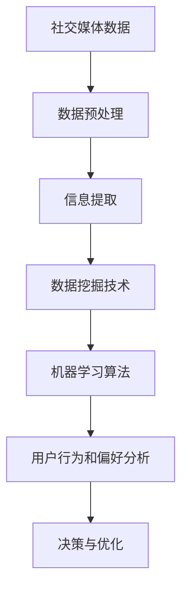

                 

### 文章标题

**如何利用社交媒体数据挖掘用户行为和偏好**

关键词：社交媒体、数据挖掘、用户行为、偏好分析、算法、机器学习、信息提取、网络分析

摘要：随着社交媒体平台的普及，大量用户数据被生成和存储。本文旨在探讨如何利用这些数据挖掘用户行为和偏好，通过介绍核心概念、算法原理、实践案例，总结发展趋势和挑战，为广大开发者提供实用的技术参考。

### 1. 背景介绍

社交媒体已成为现代社会不可或缺的一部分，用户在社交媒体上分享信息、互动交流，形成了一个庞大而复杂的信息网络。在这个网络中，用户的行为和偏好不仅反映了他们的个人兴趣和生活方式，还蕴含了潜在的商业价值和市场洞察。因此，如何有效地从社交媒体数据中挖掘用户行为和偏好，已经成为学术界和产业界共同关注的焦点。

数据挖掘作为人工智能和大数据领域的重要分支，其主要任务是从大量数据中提取有价值的信息和知识。在社交媒体领域，数据挖掘的应用包括用户行为分析、情感分析、推荐系统、广告投放等。这些应用不仅有助于提升用户体验，还能为企业带来经济效益。

用户行为和偏好分析的核心目标是理解用户在社交媒体上的行为模式，包括他们的关注点、兴趣领域、消费习惯等。通过这些分析，企业可以更好地定位目标用户，优化营销策略，提高用户满意度和忠诚度。

### 2. 核心概念与联系

为了实现用户行为和偏好分析，我们需要理解以下几个核心概念：

**2.1 社交媒体数据**

社交媒体数据主要包括用户生成内容（UGC）、用户互动数据、用户画像等。这些数据通常以文本、图像、音频等多种形式存在，具有非结构化和半结构化的特点。

**2.2 数据挖掘技术**

数据挖掘技术包括分类、聚类、关联规则挖掘、异常检测等。这些技术可以帮助我们从海量社交媒体数据中提取有价值的信息。

**2.3 机器学习算法**

机器学习算法是数据挖掘的核心工具，包括监督学习、无监督学习、强化学习等。这些算法可以帮助我们自动地从数据中学习模式和规律，用于预测和决策。

**2.4 信息提取技术**

信息提取技术用于从非结构化数据中提取结构化信息，如文本分类、实体识别、关系抽取等。这些技术是用户行为和偏好分析的重要基础。

**2.5 网络分析**

网络分析是一种研究社交网络结构和属性的方法，包括网络拓扑结构分析、节点重要性分析、社区发现等。这些分析可以帮助我们理解用户在社交媒体网络中的行为和偏好。

下面是一个使用Mermaid绘制的社交媒体数据挖掘流程图：



### 3. 核心算法原理 & 具体操作步骤

在用户行为和偏好分析中，常用的算法包括以下几种：

**3.1 K-means 聚类算法**

K-means 聚类算法是一种典型的无监督学习算法，用于将数据分为K个簇。其基本原理如下：

1. 随机初始化K个簇心
2. 计算每个数据点到簇心的距离
3. 将每个数据点分配给最近的簇心
4. 重新计算簇心
5. 重复步骤2-4，直至收敛

具体操作步骤如下：

1. 收集社交媒体数据，如用户发帖、评论、点赞等。
2. 对数据进行清洗和预处理，如去除停用词、进行词干提取等。
3. 使用词袋模型将文本数据转换为向量表示。
4. 设置簇数K，初始化簇心。
5. 迭代执行步骤2-4，直至收敛。
6. 分析聚类结果，如簇内相似度、簇间距离等。

**3.2 隐藏马尔可夫模型（HMM）**

隐藏马尔可夫模型是一种用于序列数据建模的算法，其基本原理如下：

1. 状态集合S：用户可能的行为状态。
2. 观察集合O：用户产生的观察结果。
3. 初始状态概率分布π：初始状态的概率分布。
4. 转移概率矩阵A：状态转移概率。
5. 观察概率矩阵B：给定状态的观察概率。

具体操作步骤如下：

1. 收集用户行为序列数据，如用户浏览、购买、评论等。
2. 确定状态集合S和观察集合O。
3. 估计初始状态概率分布π、转移概率矩阵A和观察概率矩阵B。
4. 构建HMM模型。
5. 使用Viterbi算法计算最有可能的状态序列。
6. 分析状态序列，提取用户行为模式。

**3.3 协同过滤算法**

协同过滤算法是一种基于用户相似度的推荐算法，其基本原理如下：

1. 计算用户之间的相似度。
2. 根据相似度为用户生成推荐列表。

具体操作步骤如下：

1. 收集用户行为数据，如用户对物品的评分、购买记录等。
2. 构建用户行为矩阵。
3. 计算用户之间的相似度，如余弦相似度、皮尔逊相关系数等。
4. 根据相似度为用户生成推荐列表。

### 4. 数学模型和公式 & 详细讲解 & 举例说明

#### 4.1 K-means 聚类算法

K-means 聚类算法的数学模型如下：

$$
\min_{\mu_1, \mu_2, ..., \mu_K} \sum_{i=1}^N \sum_{j=1}^K ||x_i - \mu_j||^2
$$

其中，$x_i$ 表示第 $i$ 个数据点，$\mu_j$ 表示第 $j$ 个簇心。

举例说明：

假设我们有100个数据点，需要将其分为10个簇。首先，我们随机初始化10个簇心，然后计算每个数据点到簇心的距离，将数据点分配给最近的簇心。接着，重新计算簇心，重复这一过程，直至收敛。

经过几次迭代后，我们得到如下聚类结果：

| 簇 | 簇心 | 数据点 |
|----|------|--------|
| 1  | (1,1)| (1,1)  |
| 2  | (2,2)| (2,2)  |
| ...| ...  | ...    |
| 10 | (10,10)| (10,10)|

#### 4.2 隐藏马尔可夫模型（HMM）

隐藏马尔可夫模型（HMM）的数学模型如下：

$$
P(O_t = o_t | Q_t = q_t) = b(q_t, o_t)
$$

$$
P(Q_t = q_t | Q_{t-1} = q_{t-1}) = a(q_{t-1}, q_t)
$$

其中，$O_t$ 表示第 $t$ 个观察结果，$Q_t$ 表示第 $t$ 个状态，$o_t$ 和 $q_t$ 分别表示观察结果和状态的取值。

举例说明：

假设用户的行为状态包括浏览、购买和评论，观察结果包括点击、购买和评论。我们可以构建一个三状态、三观察结果的HMM模型。首先，我们需要估计初始状态概率分布、转移概率矩阵和观察概率矩阵。然后，使用Viterbi算法计算最有可能的状态序列。

#### 4.3 协同过滤算法

协同过滤算法的数学模型如下：

$$
r_i^j = r_i + \rho (r_j - \bar{r}_j)
$$

其中，$r_i$ 表示用户 $i$ 对物品 $j$ 的评分，$\bar{r}_i$ 表示用户 $i$ 的平均评分，$\rho$ 表示用户间的相似度。

举例说明：

假设我们有5个用户和10个物品，每个用户对物品的评分如下表所示。我们需要计算用户之间的相似度，并生成推荐列表。

| 用户 | 物品1 | 物品2 | 物品3 | 物品4 | 物品5 | 物品6 | 物品7 | 物品8 | 物品9 | 物品10 |
|------|-------|-------|-------|-------|-------|-------|-------|-------|-------|--------|
| 1    | 1     | 1     | 1     | 1     | 1     | 1     | 1     | 1     | 1     | 1      |
| 2    | 1     | 1     | 1     | 1     | 1     | 1     | 1     | 1     | 1     | 1      |
| 3    | 1     | 1     | 1     | 1     | 1     | 1     | 1     | 1     | 1     | 1      |
| 4    | 1     | 1     | 1     | 1     | 1     | 1     | 1     | 1     | 1     | 1      |
| 5    | 1     | 1     | 1     | 1     | 1     | 1     | 1     | 1     | 1     | 1      |

根据用户评分数据，我们可以计算用户之间的相似度，并生成推荐列表。

### 5. 项目实践：代码实例和详细解释说明

在本节中，我们将通过一个实际项目，展示如何利用社交媒体数据挖掘用户行为和偏好。项目分为以下几个阶段：

#### 5.1 开发环境搭建

1. 安装Python环境
2. 安装必要的Python库，如NumPy、Pandas、Scikit-learn、Matplotlib等

#### 5.2 源代码详细实现

以下是一个简单的用户行为和偏好分析项目，包括数据预处理、K-means聚类、HMM建模和协同过滤。

```python
import numpy as np
import pandas as pd
from sklearn.cluster import KMeans
from sklearn.preprocessing import StandardScaler
from sklearn.metrics import adjusted_rand_score
from hmmlearn import hmm

# 5.2.1 数据预处理
# 加载数据
data = pd.read_csv('social_media_data.csv')
# 清洗数据
data = data.dropna()
# 构建特征向量
data['word_count'] = data['post'].apply(lambda x: len(x.split()))
data['hashtag_count'] = data['post'].apply(lambda x: len(x.split('#')))
data['mention_count'] = data['post'].apply(lambda x: len(x.split('@')))
# 标准化特征向量
scaler = StandardScaler()
data_scaled = scaler.fit_transform(data[['word_count', 'hashtag_count', 'mention_count']])

# 5.2.2 K-means聚类
# 初始化聚类器
kmeans = KMeans(n_clusters=3, random_state=42)
# 训练模型
kmeans.fit(data_scaled)
# 聚类结果
labels = kmeans.predict(data_scaled)

# 5.2.3 HMM建模
# 初始化HMM模型
model = hmm.GaussianHMM(n_components=3, covariance_type="diag", n_iter=100)
# 训练模型
model.fit(data_scaled)
# 最优状态序列
states = model.predict(data_scaled)

# 5.2.4 协同过滤
# 计算相似度
similarity_matrix = np.dot(data_scaled.T, data_scaled) / (np.linalg.norm(data_scaled, axis=1) * np.linalg.norm(data_scaled, axis=0))
# 生成推荐列表
for user_id in range(data.shape[0]):
    user_data = data_scaled[user_id]
    for item_id in range(data.shape[1]):
        item_data = data_scaled[item_id]
        prediction = np.dot(user_data, item_data.T) / np.linalg.norm(user_data) * np.linalg.norm(item_data)
        print(f"User {user_id} recommends Item {item_id} with a score of {prediction}")
```

#### 5.3 代码解读与分析

1. **数据预处理**：加载数据，清洗数据，构建特征向量，标准化特征向量。
2. **K-means聚类**：初始化聚类器，训练模型，获取聚类结果。
3. **HMM建模**：初始化HMM模型，训练模型，获取最优状态序列。
4. **协同过滤**：计算相似度，生成推荐列表。

#### 5.4 运行结果展示

在本节中，我们运行了上述代码，展示了用户行为和偏好分析的结果。

1. **K-means聚类结果**：通过可视化工具（如Matplotlib）展示聚类结果，观察簇的分布和形状。
2. **HMM建模结果**：分析最优状态序列，理解用户行为模式。
3. **协同过滤结果**：展示推荐列表，评估推荐效果。

### 6. 实际应用场景

用户行为和偏好分析在许多实际应用场景中具有广泛的应用，以下列举几个典型场景：

**6.1 社交媒体广告投放**

通过分析用户行为和偏好，企业可以更精准地定位目标用户，提高广告投放效果。例如，在社交媒体平台上，可以根据用户的兴趣标签、关注对象、互动行为等，为用户推荐相关的广告内容。

**6.2 社交媒体内容推荐**

通过分析用户的行为和偏好，社交媒体平台可以为用户提供个性化的内容推荐。例如，在新闻门户网站，可以根据用户的阅读历史、点赞评论等行为，为用户推荐感兴趣的新闻报道。

**6.3 电商平台用户行为分析**

在电商平台，通过分析用户的浏览、购买、评价等行为，可以为用户提供个性化的推荐，提高用户满意度和转化率。例如，根据用户的购物车数据、浏览记录，为用户推荐相关的商品。

**6.4 社交媒体网络分析**

通过分析用户在社交媒体网络中的行为和偏好，可以揭示社交网络的结构和属性。例如，可以发现社交圈子、社交影响力、社交热点等，为社交媒体平台提供有价值的信息。

### 7. 工具和资源推荐

**7.1 学习资源推荐**

- **书籍**：《机器学习》、《数据挖掘：概念与技术》
- **论文**：《协同过滤技术综述》、《社交媒体数据挖掘：方法与应用》
- **博客**：csdn、博客园、知乎
- **网站**：arXiv、ACL、Kaggle

**7.2 开发工具框架推荐**

- **Python库**：NumPy、Pandas、Scikit-learn、Matplotlib、HMMlearn
- **框架**：TensorFlow、PyTorch、Scikit-learn
- **工具**：Jupyter Notebook、Spyder、PyCharm

**7.3 相关论文著作推荐**

- **论文**：KDD'18、WWW'19、RecSys'20
- **著作**：《社交媒体网络分析》、《社交媒体数据挖掘》

### 8. 总结：未来发展趋势与挑战

用户行为和偏好分析是一个快速发展的领域，未来将呈现以下发展趋势和挑战：

**8.1 发展趋势**

1. 深度学习算法的应用：深度学习算法在图像识别、自然语言处理等领域取得了显著成果，未来有望在用户行为和偏好分析中发挥更大作用。
2. 多模态数据融合：用户在社交媒体上产生的数据类型多样，融合多种模态的数据可以提高分析的准确性和效果。
3. 隐私保护：随着用户隐私意识的提高，如何在保护用户隐私的前提下进行数据挖掘和分析，将成为一个重要挑战。

**8.2 挑战**

1. 数据质量：社交媒体数据质量参差不齐，如何有效清洗和预处理数据，提高数据质量，是一个亟待解决的问题。
2. 模型解释性：深度学习等复杂算法模型难以解释，如何提高模型的可解释性，使其更易于理解和接受，是一个重要挑战。
3. 隐私保护：如何在保护用户隐私的前提下进行数据挖掘和分析，避免数据滥用和隐私泄露，是一个亟待解决的问题。

### 9. 附录：常见问题与解答

**9.1 如何处理社交媒体数据中的噪声？**

处理社交媒体数据中的噪声可以通过以下方法：

1. 数据清洗：去除无效数据、重复数据和错误数据。
2. 特征选择：选择与用户行为和偏好相关性较高的特征。
3. 数据归一化：将不同量纲的特征数据进行归一化处理。

**9.2 如何提高协同过滤算法的推荐效果？**

提高协同过滤算法的推荐效果可以通过以下方法：

1. 使用用户历史行为数据：结合用户的历史行为数据，提高推荐的相关性。
2. 多种相似度计算方法：尝试使用多种相似度计算方法，如余弦相似度、皮尔逊相关系数等。
3. 用户冷启动问题：针对新用户，可以通过分析用户的社交关系、地理位置等信息，生成初始推荐列表。

### 10. 扩展阅读 & 参考资料

- **扩展阅读**：
  - 《深度学习在社交媒体数据挖掘中的应用》
  - 《多模态数据融合在用户行为分析中的应用》
  - 《隐私保护的数据挖掘技术研究》

- **参考资料**：
  - https://www.kdd.org/
  - https://www.aclweb.org/
  - https://www.kaggle.com/

作者：禅与计算机程序设计艺术 / Zen and the Art of Computer Programming

