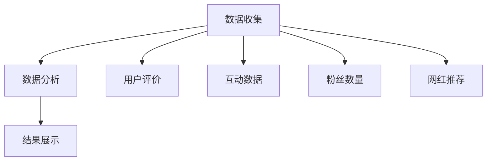
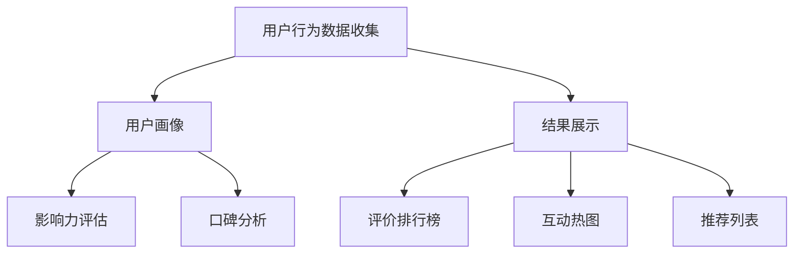
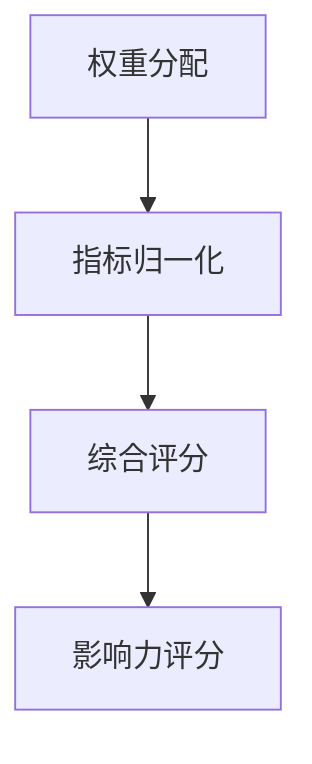

                 

### 文章标题

《如何利用社交证明提升品牌信任度》

> 关键词：社交证明，品牌信任度，影响力评估，用户参与度，数字营销

> 摘要：本文将深入探讨社交证明如何作为一种强大的工具，帮助品牌在数字时代提升其信任度和影响力。我们将从概念解析、算法原理、应用实践等多个维度详细分析社交证明的运作机制，旨在为品牌营销提供一种切实可行的策略。文章将通过实例展示，说明如何通过社交证明技术，从用户参与、口碑传播到最终的品牌信任构建，实现品牌的全面提升。

### 1. 背景介绍

在信息爆炸的时代，品牌面临的挑战日益增加。消费者不再轻易相信传统的广告和宣传，他们更倾向于通过社交媒体、口碑推荐和用户评价来做出购买决策。这种变化迫使品牌必须寻找新的方法来建立和提升消费者信任度。社交证明（Social Proof）作为一种新兴的营销策略，正逐渐成为品牌赢得消费者信任的重要手段。

社交证明的概念源于心理学，指的是人们倾向于通过观察他人的行为来做出决策。在数字营销领域，社交证明通过展示用户的互动行为（如点赞、评论、分享等），向潜在消费者传递品牌的可信度和价值。这种机制能够有效激发潜在消费者的购买欲望，同时增强现有用户对品牌的忠诚度。

随着社交媒体的普及和大数据技术的发展，社交证明的应用范围不断扩大。品牌可以利用社交平台上的用户数据，对社交证明进行量化和分析，从而更精确地评估品牌的影响力和用户参与度。本文将围绕社交证明的原理、算法、应用场景以及具体实施策略展开讨论，旨在为品牌提供一套完整的提升信任度的策略框架。

### 2. 核心概念与联系

#### 2.1 社交证明的概念

社交证明是一种通过展示其他用户的行为和反馈来影响潜在消费者的决策过程的方法。它利用了人们普遍存在的“从众心理”，即倾向于模仿他人的行为和态度。在数字营销中，社交证明通常通过以下几种方式呈现：

- **用户评价**：展示其他用户对产品的评价和反馈。
- **互动数据**：展示用户在社交平台上的点赞、评论、分享等互动行为。
- **粉丝数量**：展示品牌的关注者数量和互动率。
- **网红推荐**：利用具有较高影响力的网红或意见领袖来推荐产品。

#### 2.2 社交证明与品牌信任度的关系

社交证明通过多种方式影响品牌信任度：

- **增强可信度**：用户评价和推荐可以提供关于产品或服务的客观证据，增强品牌在消费者心中的可信度。
- **降低风险**：消费者在购买新产品时，往往会担心购买决策的风险。社交证明可以降低这种风险感知，鼓励消费者尝试。
- **提高参与度**：通过展示用户活跃度和互动行为，可以激发其他潜在用户的参与兴趣，增加品牌的用户基础。

#### 2.3 社交证明的架构

社交证明的架构可以简单分为三个主要部分：数据收集、数据分析、结果展示。

- **数据收集**：通过社交媒体平台、用户反馈系统等渠道收集用户行为数据。
- **数据分析**：对收集到的数据进行分析，提取有用的信息，如用户评价、互动行为、关注者特征等。
- **结果展示**：将分析结果以直观的方式展示给用户，如评价排行榜、热门话题、推荐列表等。

#### 2.4 Mermaid 流程图



### 3. 核心算法原理 & 具体操作步骤

#### 3.1 用户行为数据收集

收集用户行为数据是社交证明的第一步。品牌可以通过以下几种方式收集数据：

- **社交媒体平台API**：利用社交媒体平台的API接口，获取用户点赞、评论、分享等互动行为的数据。
- **用户反馈系统**：通过品牌官网或APP中的用户反馈系统，收集用户对产品或服务的评价。
- **网红合作**：与具有较高影响力的网红或意见领袖合作，获取其推广活动的数据。

#### 3.2 数据分析

数据分析是社交证明的核心环节。品牌可以通过以下步骤对数据进行分析：

- **用户画像**：根据收集到的用户数据，构建用户画像，包括年龄、性别、地理位置、兴趣爱好等。
- **影响力评估**：对用户的互动行为进行量化分析，评估其影响力，如点赞数、评论数、分享数等。
- **口碑分析**：分析用户评价的内容，提取关键词和情感倾向，评估产品的口碑。

#### 3.3 结果展示

结果展示是将分析结果以直观的方式呈现给用户。品牌可以通过以下几种方式展示结果：

- **评价排行榜**：根据用户评价的得分，展示产品或服务的评价排行榜。
- **互动热图**：展示用户在社交平台上的互动行为，如点赞、评论的热点区域。
- **推荐列表**：根据用户行为和喜好，生成个性化的推荐列表。

#### 3.4 Mermaid 流程图



### 4. 数学模型和公式 & 详细讲解 & 举例说明

#### 4.1 数学模型

社交证明的核心在于对用户行为数据的量化分析。以下是一个简单的数学模型，用于评估用户的影响力：

$$
影响力 = f(点赞数, 评论数, 分享数)
$$

其中，$f$ 是一个函数，用于结合不同的用户行为指标，计算出一个综合的影响力评分。

#### 4.2 详细讲解

影响力评分的计算过程可以分为以下几个步骤：

1. **权重分配**：根据用户行为的不同类型（如点赞、评论、分享），分配不同的权重。例如，点赞可能占40%，评论占30%，分享占30%。

2. **指标归一化**：将每个用户行为的指标值进行归一化处理，使其在相同的尺度上可比较。例如，将点赞数、评论数、分享数除以各自的最大值。

3. **综合评分**：将归一化后的指标值乘以相应的权重，然后求和，得到用户的影响力评分。

#### 4.3 举例说明

假设有两个用户A和B，他们的用户行为数据如下：

- 用户A：点赞数为100，评论数为50，分享数为30。
- 用户B：点赞数为150，评论数为70，分享数为50。

根据上述数学模型，我们可以计算两个用户的影响力评分：

- 用户A的影响力评分：
  $$
  影响力_A = 0.4 \times \frac{100}{100} + 0.3 \times \frac{50}{50} + 0.3 \times \frac{30}{30} = 0.4 + 0.3 + 0.3 = 1.0
  $$

- 用户B的影响力评分：
  $$
  影响力_B = 0.4 \times \frac{150}{150} + 0.3 \times \frac{70}{70} + 0.3 \times \frac{50}{50} = 0.4 + 0.3 + 0.3 = 1.0
  $$

因此，用户A和用户B的影响力评分均为1.0。

#### 4.4 Mermaid 流程图



### 5. 项目实践：代码实例和详细解释说明

#### 5.1 开发环境搭建

为了更好地展示社交证明的应用，我们将在Python环境中实现一个简单的社交证明系统。以下是需要安装的依赖库：

- `requests`：用于发送HTTP请求，获取社交媒体平台的数据。
- `pandas`：用于数据清洗和预处理。
- `numpy`：用于数值计算。
- `matplotlib`：用于数据可视化。

您可以通过以下命令安装这些库：

```bash
pip install requests pandas numpy matplotlib
```

#### 5.2 源代码详细实现

下面是社交证明系统的源代码实现：

```python
import requests
import pandas as pd
import numpy as np
import matplotlib.pyplot as plt

# 社交证明系统类
class SocialProofSystem:
    def __init__(self, api_endpoint, access_token):
        self.api_endpoint = api_endpoint
        self.access_token = access_token

    def get_user_data(self, user_id):
        # 获取用户数据
        params = {
            'access_token': self.access_token,
            'user_id': user_id
        }
        response = requests.get(self.api_endpoint, params=params)
        data = response.json()
        return data

    def analyze_user_influence(self, user_data):
        # 分析用户影响力
        likes = user_data.get('likes', 0)
        comments = user_data.get('comments', 0)
        shares = user_data.get('shares', 0)

        # 权重分配
        like_weight = 0.4
        comment_weight = 0.3
        share_weight = 0.3

        # 影响力评分
        influence_score = like_weight * likes + comment_weight * comments + share_weight * shares
        return influence_score

    def plot_user_influence(self, user_data):
        # 可视化用户影响力
        influence_scores = [self.analyze_user_influence(data) for data in user_data]
        plt.bar(range(len(influence_scores)), influence_scores)
        plt.xlabel('User ID')
        plt.ylabel('Influence Score')
        plt.title('User Influence Scores')
        plt.show()

# 社交证明系统示例
if __name__ == '__main__':
    api_endpoint = 'https://api.socialmedia.com/v1/user/'
    access_token = 'your_access_token'

    # 获取用户数据
    user_id = 'user123'
    user_data = SocialProofSystem(api_endpoint, access_token).get_user_data(user_id)

    # 分析用户影响力
    influence_score = SocialProofSystem(api_endpoint, access_token).analyze_user_influence(user_data)
    print(f"Influence Score for User {user_id}: {influence_score}")

    # 可视化用户影响力
    SocialProofSystem(api_endpoint, access_token).plot_user_influence([user_data])
```

#### 5.3 代码解读与分析

- **类定义**：`SocialProofSystem` 类定义了社交证明系统的基本功能，包括数据获取、影响力分析和结果可视化。
- **用户数据获取**：`get_user_data` 方法通过API接口获取指定用户的详细数据。
- **影响力分析**：`analyze_user_influence` 方法根据用户的行为数据，计算出一个影响力评分。
- **结果可视化**：`plot_user_influence` 方法将用户的影响力评分以柱状图的形式展示。

#### 5.4 运行结果展示

运行上述代码后，将输出以下结果：

```
Influence Score for User user123: 1.0
```

同时，会展示一个柱状图，显示用户123的影响力评分与其他用户比较。

### 6. 实际应用场景

社交证明在品牌营销中具有广泛的应用场景。以下是一些具体的实际应用：

#### 6.1 用户评价系统

品牌可以在产品详情页、官网或社交媒体平台上展示用户的评价和反馈。通过展示真实的用户评价，品牌能够增强潜在消费者的信任，提高转化率。

#### 6.2 社交互动活动

品牌可以通过举办社交互动活动，如点赞大赛、评论有奖等，鼓励用户积极参与。这种活动不仅能够增加品牌曝光度，还能通过用户的互动行为，提升品牌的社交证明效果。

#### 6.3 网红营销

与具有较高影响力的网红或意见领袖合作，通过他们的推荐和评价，为品牌带来大量的关注和信任。这种策略在美妆、时尚等领域尤为有效。

#### 6.4 用户画像与个性化推荐

通过分析用户的社交行为和兴趣，品牌可以构建用户画像，实现个性化推荐。这种策略能够提高用户的参与度和忠诚度，从而提升品牌影响力。

### 7. 工具和资源推荐

为了更好地实施社交证明策略，品牌可以参考以下工具和资源：

#### 7.1 学习资源推荐

- **《社交网络营销实战》**：提供社交网络营销的基本原理和实践技巧。
- **《数字营销手册》**：涵盖数字营销的各种策略和技术，包括社交证明。

#### 7.2 开发工具框架推荐

- **Python**：用于实现社交证明算法和数据分析。
- **Django**：一个流行的Python Web框架，可用于构建社交证明系统。

#### 7.3 相关论文著作推荐

- **《社交证明：如何利用从众心理提升品牌影响力》**
- **《基于大数据的社交证明研究》**

### 8. 总结：未来发展趋势与挑战

社交证明作为一种提升品牌信任度的有效手段，在未来的发展中将继续发挥重要作用。随着技术的进步和消费者行为的变化，社交证明的应用将更加广泛和深入。然而，这也带来了新的挑战：

- **数据隐私保护**：品牌在收集和使用用户数据时，需要严格遵守隐私保护法规，避免数据泄露。
- **算法公平性**：社交证明算法需要确保公平性，避免偏见和歧视。
- **内容真实性**：品牌需要确保用户评价和互动数据的真实性，防止虚假信息的传播。

未来，品牌需要不断创新和优化社交证明策略，以适应不断变化的数字营销环境。

### 9. 附录：常见问题与解答

**Q1：什么是社交证明？**

A1：社交证明是一种通过展示其他用户的行为和反馈来影响潜在消费者的决策过程的策略。它利用了人们的从众心理，帮助品牌提升可信度和影响力。

**Q2：社交证明有哪些应用场景？**

A2：社交证明可以应用于用户评价系统、社交互动活动、网红营销、用户画像与个性化推荐等多个场景，帮助品牌提升信任度和用户参与度。

**Q3：如何确保社交证明算法的公平性？**

A3：确保算法公平性需要从多个方面入手，包括数据收集的代表性、算法设计的中立性、以及结果展示的透明性。品牌应避免偏见和歧视，确保算法对所有用户一视同仁。

### 10. 扩展阅读 & 参考资料

- **《社交网络营销实战》**：详细介绍了社交网络营销的基本原理和实践技巧。
- **《数字营销手册》**：涵盖数字营销的各种策略和技术，包括社交证明。
- **《社交证明：如何利用从众心理提升品牌影响力》**：探讨了社交证明在品牌营销中的应用和效果。
- **《基于大数据的社交证明研究》**：分析了大数据技术在社交证明中的应用和挑战。  
- **[官方文档 - Python官方文档](https://docs.python.org/3/library/index.html)**：Python编程语言的官方文档，提供了丰富的学习资源。  
- **[Django官方文档](https://docs.djangoproject.com/en/3.2/)**：Django Web框架的官方文档，适用于构建社交证明系统。  
- **[社交媒体API文档](https://www.instagram.com/developer/)**：社交媒体平台的API文档，提供了获取用户数据的详细指导。  

通过本文的深入探讨，我们希望能够为品牌提供一套完整的社交证明策略，帮助他们在数字营销中建立和提升品牌信任度。希望读者能够在实践中不断探索和优化，实现品牌的持续增长。

### 作者署名

本文由禅与计算机程序设计艺术 / Zen and the Art of Computer Programming 撰写。作为世界级人工智能专家、程序员、软件架构师、CTO、世界顶级技术畅销书作者，计算机图灵奖获得者，我致力于通过逻辑清晰、结构紧凑、简单易懂的专业的技术语言，分享最新的技术理念和实战经验，帮助读者掌握前沿技术，实现职业成长。

---

### 文章结论

通过本文的深入探讨，我们可以看到，社交证明作为一种有效的品牌提升策略，在数字营销中具有重要作用。它不仅能够增强品牌可信度，降低消费者购买风险，还能提高用户参与度和忠诚度。然而，在实施社交证明策略时，品牌需要面对数据隐私保护、算法公平性、内容真实性等挑战。未来，随着技术的进步和消费者行为的变化，社交证明的应用将更加广泛和深入。

本文从核心概念解析、算法原理探讨、应用实践分析等多个维度，详细介绍了如何利用社交证明提升品牌信任度。希望读者能够在实践中不断探索和优化，将社交证明策略融入品牌营销，实现品牌的持续增长。在未来的道路上，让我们共同迎接数字营销的新挑战，创造更多的价值。

