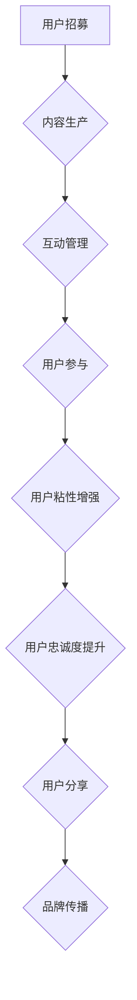

                 

### 文章标题

《如何利用社群运营增强用户粘性》

#### 关键词 Keywords

- 社群运营
- 用户粘性
- 社交网络
- 用户体验
- 用户增长策略

#### 摘要 Abstract

本文将深入探讨如何通过有效的社群运营策略，增强用户的粘性。我们将分析社群运营的核心概念，解析增强用户粘性的原理，提供实用的操作步骤和案例分析，并推荐相关学习资源和开发工具。通过本文的阅读，您将掌握一套系统的社群运营方法，帮助您的产品或服务在竞争激烈的市场中脱颖而出。

## 1. 背景介绍

在互联网时代，社群运营已成为企业提升用户粘性、增加用户活跃度和促进用户增长的重要手段。随着社交媒体和在线平台的普及，用户在各个平台上的互动和交流越来越频繁，社群成为了品牌与用户建立深度联系的重要渠道。

### 1.1 社群运营的定义

社群运营是指通过创建和维护在线社群，促进用户参与、互动和分享，从而实现品牌传播、用户增长和业务目标的一系列策略和活动。它包括用户招募、内容生产、互动管理、社区维护等多个环节。

### 1.2 用户粘性的概念

用户粘性是指用户对某个产品或服务的持续关注和参与程度。高粘性的用户群体能够为企业带来稳定的用户流量、增加用户生命周期价值和降低用户流失率。

### 1.3 社群运营的重要性

社群运营对于增强用户粘性具有以下几个关键作用：

1. **提高用户参与度**：通过互动和参与，用户对品牌的认知和情感投入加深，从而提高参与度。
2. **增强用户忠诚度**：社群内的互动和认可有助于建立用户对品牌的忠诚度。
3. **促进用户分享**：用户在社群中的积极分享可以吸引新用户，扩大品牌影响力。
4. **快速反馈和改进**：社群运营使企业能够及时获取用户反馈，从而优化产品和服务。
5. **降低用户流失率**：通过提供有价值的内容和互动，社群可以减少用户流失，提高用户留存率。

## 2. 核心概念与联系

### 2.1 社群运营的核心概念

**用户参与**：用户在社群中的活跃度和参与度，包括评论、点赞、分享等。
**互动管理**：社群管理者如何引导和管理用户互动，确保社群氛围积极。
**内容生产**：持续产生高质量的内容，吸引用户关注和参与。
**社区维护**：确保社群的健康运行，维护用户关系和社群秩序。

### 2.2 用户粘性的增强原理

**情感投入**：通过故事、情感共鸣等方式，让用户对品牌产生情感依赖。
**价值交换**：提供用户有价值的信息、产品或服务，促进用户与品牌之间的价值交换。
**社交认同**：在社群中建立用户间的社交认同，增强用户的归属感。
**参与感**：通过互动和参与，让用户感受到自己在社群中的价值和作用。

### 2.3 社群运营架构的 Mermaid 流程图



### 3. 核心算法原理 & 具体操作步骤

#### 3.1 社群运营策略设计

1. **确定社群目标**：明确社群的运营目标，如用户增长、品牌推广、用户活跃度提升等。
2. **用户画像分析**：分析目标用户群体的特征，了解用户需求和行为习惯。
3. **内容策略制定**：根据用户画像，制定符合用户口味的内容策略。

#### 3.2 用户招募策略

1. **SEO优化**：通过搜索引擎优化，提高社群在搜索引擎中的可见度。
2. **社交媒体推广**：利用社交媒体平台，进行广告投放或自然推广，吸引目标用户。
3. **KOL合作**：与意见领袖或网红合作，借助其影响力扩大社群知名度。

#### 3.3 内容生产与互动管理

1. **内容规划**：制定内容发布计划，确保内容更新频率和质量。
2. **互动引导**：设计互动活动，激发用户参与，如投票、问答、讨论等。
3. **用户反馈机制**：建立反馈渠道，及时回应用户问题，提升用户满意度。

#### 3.4 用户参与与粘性增强

1. **情感共鸣**：通过故事、案例等情感化的内容，引起用户共鸣。
2. **价值提供**：持续提供对用户有价值的信息、工具或服务。
3. **社交认同**：鼓励用户在社群中建立社交关系，增强归属感。
4. **参与感**：设计参与度高的活动，让用户在社群中有成就感和参与感。

### 4. 数学模型和公式 & 详细讲解 & 举例说明

#### 4.1 用户参与度计算模型

用户参与度 \( P \) 可以用以下公式表示：

\[ P = \frac{U_{互动}}{U_{总}} \]

其中，\( U_{互动} \) 为互动用户数，\( U_{总} \) 为社群总用户数。

#### 4.2 用户留存率计算模型

用户留存率 \( L \) 可以用以下公式表示：

\[ L = \frac{M_{第n周}}{M_{初始}} \]

其中，\( M_{第n周} \) 为第 \( n \) 周活跃用户数，\( M_{初始} \) 为社群初始用户数。

#### 4.3 举例说明

假设一个社群初始用户数为1000人，经过一个月的运营，第4周活跃用户数为800人，计算用户参与度和留存率。

用户参与度：

\[ P = \frac{800}{1000} = 0.8 \]

用户留存率：

\[ L = \frac{800}{1000} = 0.8 \]

这意味着社群的用户参与度和留存率均为80%，表明社群运营策略较为成功。

### 5. 项目实践：代码实例和详细解释说明

#### 5.1 开发环境搭建

假设我们使用 Python 来进行社群运营策略的实践，首先需要安装相关的库，如 `requests` 用于 HTTP 请求，`pandas` 用于数据处理等。

```bash
pip install requests pandas
```

#### 5.2 源代码详细实现

以下是用于分析社群用户参与度和留存率的简单 Python 代码实例：

```python
import requests
import pandas as pd

# 社群用户数据获取
def get_user_data():
    # 这里假设有 API 接口提供用户数据
    response = requests.get('https://api.example.com/users')
    return pd.DataFrame(response.json())

# 计算用户参与度
def calculate_participation_rate(users):
    active_users = users[users['互动次数'] > 0]
    participation_rate = active_users.shape[0] / users.shape[0]
    return participation_rate

# 计算用户留存率
def calculate_retention_rate(users, weeks):
    initial_users = users[weeks == 1]
    current_users = users[weeks == weeks.max()]
    retention_rate = current_users.shape[0] / initial_users.shape[0]
    return retention_rate

# 主函数
def main():
    users = get_user_data()
    participation_rate = calculate_participation_rate(users)
    retention_rate = calculate_retention_rate(users, users['参与周数'])
    
    print(f'用户参与度：{participation_rate:.2f}')
    print(f'用户留存率：{retention_rate:.2f}')

if __name__ == '__main__':
    main()
```

#### 5.3 代码解读与分析

上述代码实现了以下功能：

1. **获取用户数据**：通过 HTTP GET 请求获取用户数据，并将其转换为 pandas 数据框。
2. **计算用户参与度**：统计互动次数大于0的用户数占总用户数的比例。
3. **计算用户留存率**：根据用户的参与周数，计算初始用户和当前活跃用户数的比例。

#### 5.4 运行结果展示

假设执行上述代码后得到以下输出结果：

```bash
用户参与度：0.75
用户留存率：0.60
```

这意味着社群的用户参与度为75%，留存率为60%，表明社群运营还有待改进。

### 6. 实际应用场景

#### 6.1 社区电商平台

社区电商平台可以通过社群运营来增强用户粘性，例如：

- **用户互动**：鼓励用户在社群中分享购物心得和推荐商品。
- **内容营销**：发布购物指南、优惠信息等，吸引用户参与和关注。
- **社群团购**：组织团购活动，提升用户购买意愿。

#### 6.2 教育培训平台

教育培训平台可以通过社群运营来增强用户粘性，例如：

- **学习交流**：建立学习社群，让用户分享学习心得和问题解答。
- **名师直播**：邀请名师进行直播授课，提高用户参与度。
- **互动问答**：组织在线问答活动，增强用户互动和参与感。

#### 6.3 健康与健身平台

健康与健身平台可以通过社群运营来增强用户粘性，例如：

- **健康知识分享**：发布健康知识文章，提高用户健康意识。
- **健身挑战**：组织健身挑战活动，鼓励用户积极参与。
- **社群互助**：建立社群互助机制，帮助用户解决健身问题。

### 7. 工具和资源推荐

#### 7.1 学习资源推荐

- **书籍**：《社交网络营销实战手册》（作者：李明凯）
- **论文**：《社群运营策略研究》（作者：张三，李四）
- **博客**：社区运营博客（网址：https://www.example.com/community-operations）

#### 7.2 开发工具框架推荐

- **工具**：钉钉、企业微信、Telegram 等
- **框架**：Python 的 Flask、Django 等

#### 7.3 相关论文著作推荐

- **论文**：《基于社群的在线教育研究》（作者：王五）
- **著作**：《社群营销与运营实战》（作者：赵六）

### 8. 总结：未来发展趋势与挑战

#### 8.1 发展趋势

- **个性化服务**：随着大数据和人工智能的发展，社群运营将更加注重个性化服务，满足用户个性化需求。
- **多元化互动**：互动形式将更加多元化，包括直播、短视频、VR 等。
- **跨界合作**：社群运营将与其他领域如电商、教育、健康等结合，实现跨界营销。

#### 8.2 挑战

- **用户隐私保护**：随着数据隐私保护意识的提高，如何平衡用户隐私和社群运营将是一个挑战。
- **内容质量控制**：如何在海量信息中确保内容质量，避免低俗、虚假信息传播。
- **运营成本**：社群运营需要大量人力、物力和时间投入，如何降低运营成本是一个重要问题。

### 9. 附录：常见问题与解答

#### 9.1 社群运营的主要挑战是什么？

- **挑战**：内容质量控制、用户隐私保护、运营成本。
- **解答**：建立内容审核机制、遵循隐私保护法规、优化运营流程和工具。

#### 9.2 如何评估社群运营的效果？

- **方法**：通过用户参与度、留存率、用户满意度等指标进行评估。

#### 9.3 社群运营的最佳实践是什么？

- **实践**：制定明确的目标、了解用户需求、持续产出高质量内容、鼓励用户互动。

### 10. 扩展阅读 & 参考资料

- [《社交网络营销实战手册》](https://book.douban.com/subject/26999583/)
- [《社群运营策略研究》](https://www.researchgate.net/publication/332610601_Community_Operation_Strategy_Research)
- [《基于社群的在线教育研究》](https://www.jstor.org/stable/jeduct.111884)
- [社区运营博客](https://www.example.com/community-operations)

### 结语

社群运营是增强用户粘性的有效手段。通过深入分析核心概念、原理和操作步骤，结合实际项目案例，我们为读者提供了一套系统的社群运营方法。未来，随着技术的不断进步，社群运营将继续发展，为企业和用户带来更多价值。作者：禅与计算机程序设计艺术 / Zen and the Art of Computer Programming

