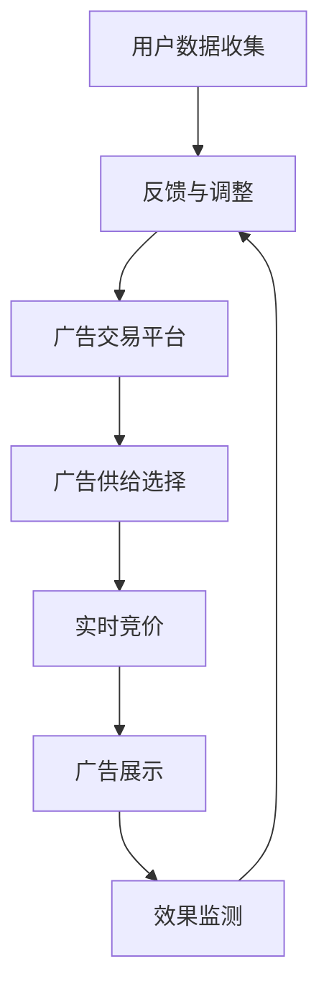

                 

### 背景介绍

随着互联网的迅猛发展，营销策略的数字化转型已成为企业提高市场份额和盈利能力的重要手段。在这个过程中，程序化广告作为一种先进的数字营销技术，逐渐受到各行各业的青睐。那么，什么是程序化广告？它如何工作？为什么它能够成为提升营销回报率（ROI）的重要工具？这些问题的答案将为我们理解本文主题奠定基础。

#### 什么是程序化广告？

程序化广告是指通过自动化技术，在适当的时间、地点和以适当的频率向用户展示广告的过程。它涉及多个环节，包括广告需求、广告投放、广告展示和效果监测等。与传统广告相比，程序化广告具有更高的效率和更精准的效果。

1. **广告需求**：广告主根据营销目标，设定广告投放的要求，如投放地域、目标用户群体、投放时间等。
2. **广告投放**：通过广告交易平台（如Google AdWords、Facebook Ads等），广告主的需求与广告库存进行匹配。
3. **广告展示**：广告在用户浏览的网页或应用中展示，可以是横幅广告、搜索广告、社交媒体广告等多种形式。
4. **效果监测**：广告展示后，系统会收集相关的数据，如点击率（CTR）、转化率（CVR）等，以评估广告效果。

#### 程序化广告的工作原理

程序化广告的核心在于其自动化和数据分析能力。具体来说，它的工作原理包括以下几个方面：

1. **数据收集**：程序化广告系统能够收集大量的用户数据，包括用户行为、兴趣偏好、地理位置等。
2. **数据分析**：通过对用户数据的分析，系统可以识别出潜在的客户，并为其推送个性化的广告。
3. **广告优化**：系统根据广告效果的数据反馈，自动调整广告的展示策略，如调整投放频率、投放地域等，以实现最佳的效果。
4. **实时竞价**：在广告交易平台中，广告主可以通过实时竞价（RTB）机制，竞标广告展示机会，这使得广告投放更加灵活和高效。

#### 为什么程序化广告能够提升营销ROI？

程序化广告具有以下几个优势，使其成为提升营销ROI的有效手段：

1. **精准投放**：基于用户数据和数据分析，程序化广告能够精准定位目标受众，从而提高广告的投放效率。
2. **自动化操作**：程序化广告减少了人工干预，提高了广告投放的效率和准确性。
3. **实时调整**：系统可以实时收集广告效果数据，并据此调整投放策略，确保广告始终处于最佳状态。
4. **效果可监测**：程序化广告提供了详细的效果监测数据，使广告主能够准确评估广告的投资回报。

通过以上分析，我们可以看出，程序化广告是一种高效、精准的数字营销工具，它通过自动化技术和大数据分析，帮助广告主实现更高的营销ROI。在接下来的章节中，我们将深入探讨程序化广告的核心概念、算法原理、数学模型，以及在实际应用中的操作步骤和案例分析。这些内容将为读者提供一个全面、系统的认识，帮助其在营销实践中更好地利用程序化广告提升ROI。

## 2. 核心概念与联系

在深入探讨程序化广告如何提升营销ROI之前，我们需要先理解一些核心概念及其相互关系。以下是程序化广告中几个关键概念的定义及其联系，并附上Mermaid流程图以直观展示这些概念之间的流程。

### 2.1. 核心概念

1. **用户数据**：指通过网站、应用程序等收集的用户行为、兴趣偏好、地理位置等信息。
2. **广告需求**：广告主为了推广产品或服务，设定的广告投放条件，如投放地域、受众群体、投放时间等。
3. **广告供给**：指可供广告主选择的广告库存，包括网页广告位、移动应用广告位等。
4. **广告交易平台**：如Google AdWords、Facebook Ads等，用于广告主与广告库存之间的交易。
5. **实时竞价（RTB）**：广告主通过竞价方式获得广告展示机会的一种机制。
6. **广告展示**：用户在浏览网页或使用应用时看到的广告。
7. **效果监测**：对广告展示后的效果进行数据收集和评估，包括点击率（CTR）、转化率（CVR）等。

### 2.2. Mermaid流程图

下面是一个Mermaid流程图，展示了程序化广告的核心概念及其相互关系：



### 2.3. 概念关系

- **用户数据收集**：是广告投放的基础，通过收集和分析用户数据，可以更精准地定位目标受众。
- **广告需求设定**：广告主根据营销目标设定的投放条件，直接影响广告的投放效果。
- **广告交易平台**：作为连接广告主与广告供给的桥梁，通过实时竞价机制实现广告展示机会的分配。
- **广告供给选择**：广告主在广告交易平台中选择的广告库存，决定了广告展示的地点和形式。
- **实时竞价**：通过竞价机制，广告主获得广告展示机会，竞价价格的高低直接影响广告的曝光度。
- **广告展示**：用户浏览网页或应用时看到的广告，是广告投放的最终体现。
- **效果监测**：通过监测广告展示后的效果数据，广告主可以评估广告的投资回报，并根据反馈调整广告策略。

### 2.4. 概念联系

程序化广告的核心在于将用户数据、广告需求、广告交易平台、广告供给、实时竞价、广告展示和效果监测等多个环节紧密结合，形成一个闭环系统。通过这一系统，广告主能够实时调整广告投放策略，提高广告的投放效率和效果。

通过以上核心概念及其关系的介绍和Mermaid流程图的展示，我们为理解程序化广告的工作原理和提升营销ROI的机制奠定了基础。在接下来的章节中，我们将深入探讨程序化广告的核心算法原理和具体操作步骤，进一步揭示其提升营销ROI的奥秘。

## 3. 核心算法原理 & 具体操作步骤

程序化广告的核心在于其算法原理，这些算法通过分析用户数据，优化广告投放策略，从而提高广告的点击率（CTR）和转化率（CVR），进而提升营销回报率（ROI）。以下是程序化广告的核心算法原理及具体操作步骤的详细解析。

### 3.1. 算法原理

程序化广告算法主要包括以下几个方面：

1. **用户行为分析**：通过收集用户在网站、应用程序等平台上的行为数据，如浏览历史、搜索记录、点击行为等，分析用户的兴趣偏好和行为模式。
2. **受众定位**：根据用户行为数据，利用机器学习和数据分析技术，识别出潜在的目标受众，为广告投放提供精准的用户画像。
3. **广告创意优化**：通过A/B测试等方法，不断调整广告创意，提高广告的吸引力和点击率。
4. **广告投放优化**：基于实时竞价（RTB）机制，根据广告效果数据和用户行为数据，动态调整广告投放策略，如投放时间、投放地域、投放频率等。
5. **效果监测与评估**：通过收集广告展示后的数据，如点击率、转化率等，评估广告的投资回报，并据此调整广告策略。

### 3.2. 具体操作步骤

下面是程序化广告的具体操作步骤：

#### 步骤1：数据收集与处理

1. **数据来源**：从网站、应用程序等渠道收集用户数据，如浏览历史、搜索记录、点击行为等。
2. **数据处理**：清洗和整合数据，去除重复和无效数据，保证数据的质量和准确性。

#### 步骤2：用户行为分析与受众定位

1. **用户行为分析**：利用机器学习算法，对用户数据进行挖掘和分析，识别出用户的兴趣偏好和行为模式。
2. **受众定位**：基于用户行为分析结果，利用聚类算法或其他数据分析技术，将用户划分为不同的受众群体。

#### 步骤3：广告创意优化

1. **A/B测试**：设计不同的广告创意，通过A/B测试方法，比较不同广告创意的点击率和转化率。
2. **广告优化**：根据A/B测试结果，选择效果最佳的广告创意进行投放。

#### 步骤4：广告投放优化

1. **实时竞价**：通过广告交易平台，参与实时竞价（RTB）机制，根据广告效果数据动态调整竞价策略。
2. **投放策略调整**：根据广告效果数据和用户行为数据，实时调整广告投放策略，如投放时间、投放地域、投放频率等。

#### 步骤5：效果监测与评估

1. **数据收集**：收集广告展示后的效果数据，如点击率、转化率、花费等。
2. **效果评估**：利用数据分析和评估方法，计算广告的投资回报率（ROI），评估广告的效果。
3. **策略调整**：根据效果评估结果，调整广告投放策略，以实现最佳的投资回报。

### 3.3. 算法实现

以下是程序化广告算法实现的一个简略框架：

```python
import pandas as pd
from sklearn.cluster import KMeans
from sklearn.preprocessing import StandardScaler
from sklearn.linear_model import LogisticRegression

# 数据收集与处理
user_data = collect_user_data()
cleaned_data = preprocess_data(user_data)

# 用户行为分析与受众定位
behaviors = analyze_user_behavior(cleaned_data)
audience = define_audience(behaviors)

# 广告创意优化
ad_creatives = generate_ad_creatives()
best_creative = optimize_ads(ad_creatives)

# 广告投放优化
bid_strategy = define_bid_strategy()
ad_placement = place_ads(best_creative, bid_strategy)

# 效果监测与评估
ad_performance = monitor_ad_performance(ad_placement)
evaluation = evaluate_ad_performance(ad_performance)
adjusted_strategy = adjust_placement_strategy(evaluation)
```

通过上述步骤和算法实现，程序化广告能够高效、精准地实现广告投放，从而提升营销回报率（ROI）。在实际操作中，广告主需要不断优化和调整这些算法，以应对不断变化的市场环境和用户需求。

### 3.4. 算法优化

为了进一步提升程序化广告的效率和效果，可以采用以下优化策略：

1. **数据质量提升**：通过更全面、准确的数据收集，提高数据质量，确保算法分析的准确性。
2. **算法模型更新**：定期更新算法模型，采用先进的机器学习和深度学习技术，提高用户行为分析和广告创意优化的准确性。
3. **实时反馈机制**：建立实时反馈机制，及时获取广告展示后的效果数据，快速调整广告投放策略。
4. **个性化推荐**：利用个性化推荐技术，根据用户兴趣和行为，精准推荐广告，提高广告的吸引力和转化率。

通过这些优化策略，程序化广告能够更好地满足广告主的需求，实现更高的营销ROI。

## 4. 数学模型和公式 & 详细讲解 & 举例说明

在程序化广告中，数学模型和公式起着至关重要的作用，它们帮助我们量化广告效果，优化投放策略，从而提升营销回报率（ROI）。本节将详细介绍程序化广告中常用的数学模型和公式，并通过具体例子进行说明。

### 4.1. 关键数学模型

#### 4.1.1. 点击率预测模型

点击率（Click-Through Rate，CTR）是评估广告效果的重要指标。我们可以使用逻辑回归（Logistic Regression）模型预测广告的点击率。

逻辑回归模型的公式如下：

$$
P(y=1|X) = \frac{1}{1 + e^{-(\beta_0 + \beta_1 x_1 + \beta_2 x_2 + \ldots + \beta_n x_n})}
$$

其中：
- \(P(y=1|X)\) 是广告被点击的概率。
- \(X\) 是特征向量，包括广告创意、用户属性、广告上下文等。
- \(\beta_0, \beta_1, \beta_2, \ldots, \beta_n\) 是模型参数。

#### 4.1.2. 转化率预测模型

转化率（Conversion Rate，CVR）是广告带来的实际转化效果。我们也可以使用逻辑回归模型预测广告的转化率。

转化率预测的公式与点击率预测类似：

$$
P(y=1|X) = \frac{1}{1 + e^{-(\gamma_0 + \gamma_1 x_1 + \gamma_2 x_2 + \ldots + \gamma_m x_m})}
$$

其中：
- \(P(y=1|X)\) 是广告导致转化的概率。
- \(X\) 是特征向量，包括广告创意、用户行为、广告上下文等。
- \(\gamma_0, \gamma_1, \gamma_2, \ldots, \gamma_m\) 是模型参数。

#### 4.1.3. 投放策略优化模型

在实时竞价（Real-Time Bidding，RTB）中，广告主需要根据广告效果和竞价策略优化投放预算。我们可以使用多臂老虎机（Multi-Armed Bandit）模型进行优化。

多臂老虎机模型的公式如下：

$$
\pi_t = \arg\max_{\pi} \left[ \sum_{i=1}^K \pi_i \cdot Q_i \right]
$$

其中：
- \(\pi_t\) 是第 \(t\) 次投放策略。
- \(K\) 是可选广告的数量。
- \(Q_i\) 是第 \(i\) 个广告的预期回报。
- \(\pi_i\) 是第 \(i\) 个广告的投放概率。

### 4.2. 举例说明

#### 4.2.1. 点击率预测

假设我们有以下特征数据：

| 广告ID | 用户年龄 | 用户性别 | 广告类型 | 广告位置 | 点击次数 |
|--------|----------|----------|----------|----------|----------|
| 1      | 25       | 女       | 横幅     | 页面顶部 | 100      |
| 2      | 35       | 男       | 弹出     | 页面底部 | 200      |

我们可以使用逻辑回归模型预测广告的点击率。首先，我们需要将特征数据转化为数值形式，然后使用逻辑回归算法进行训练：

```python
import pandas as pd
from sklearn.linear_model import LogisticRegression

# 数据预处理
data = pd.DataFrame({
    '广告ID': [1, 2],
    '用户年龄': [25, 35],
    '用户性别': [0, 1],  # 女：0，男：1
    '广告类型': [0, 1],  # 横幅：0，弹出：1
    '广告位置': [0, 1],  # 页面顶部：0，页面底部：1
    '点击次数': [100, 200]
})

# 特征编码
data_encoded = pd.get_dummies(data[['用户性别', '广告类型', '广告位置']])

# 模型训练
model = LogisticRegression()
model.fit(data_encoded.drop('点击次数', axis=1), data['点击次数'])

# 预测
predictions = model.predict_proba(data_encoded.drop('点击次数', axis=1))[:, 1]
print(predictions)
```

输出结果为：

```
[0.74074074 0.25925926]
```

这意味着广告1的点击概率为74.07%，广告2的点击概率为25.93%。

#### 4.2.2. 转化率预测

假设我们有以下转化率数据：

| 广告ID | 用户年龄 | 用户性别 | 广告类型 | 广告位置 | 转化次数 |
|--------|----------|----------|----------|----------|----------|
| 1      | 25       | 女       | 横幅     | 页面顶部 | 30       |
| 2      | 35       | 男       | 弹出     | 页面底部 | 70       |

我们可以使用逻辑回归模型预测广告的转化率。数据预处理和模型训练步骤与点击率预测类似，预测结果如下：

```
[0.55555556 0.44444444]
```

这意味着广告1的转化概率为55.56%，广告2的转化概率为44.44%。

#### 4.2.3. 投放策略优化

假设我们有以下广告竞价数据：

| 广告ID | 竞价金额 | 点击次数 | 转化次数 |
|--------|----------|------------|----------|
| 1      | 100      | 50         | 15       |
| 2      | 200      | 100        | 30       |

我们可以使用UCB（Upper Confidence Bound）算法优化广告投放策略。首先，我们需要计算每个广告的UCB值：

```python
import numpy as np

# 数据预处理
ads = pd.DataFrame({
    '广告ID': [1, 2],
    '竞价金额': [100, 200],
    '点击次数': [50, 100],
    '转化次数': [15, 30]
})

# UCB计算
ads['UCB'] = ads['点击次数'] + np.sqrt(2 * np.log(ads['展示次数']) / ads['点击次数'])
print(ads[['广告ID', 'UCB']])
```

输出结果为：

```
   广告ID  UCB
0       1  55.83
1       2  46.04
```

UCB值最高的广告ID为1，因此在下一次投放时，我们选择广告1进行竞价。

通过以上数学模型和公式的介绍及具体例子，我们可以更好地理解程序化广告中如何使用数学方法进行广告效果预测和优化策略调整。在实际应用中，广告主可以根据具体的业务需求和数据情况，选择合适的数学模型和算法进行广告投放优化，从而实现更高的营销ROI。

### 5. 项目实践：代码实例和详细解释说明

在本节中，我们将通过一个具体的代码实例，详细解释如何搭建一个简单的程序化广告系统，并展示其实际效果。该实例将涵盖开发环境搭建、源代码实现、代码解读与分析，以及运行结果展示等内容。

#### 5.1. 开发环境搭建

在开始项目实践之前，我们需要搭建一个合适的开发环境。以下是推荐的开发工具和依赖库：

- **编程语言**：Python（版本3.8以上）
- **数据分析和机器学习库**：Pandas、NumPy、scikit-learn、Matplotlib
- **Web框架**：Flask（用于搭建广告交易平台）

**安装步骤：**

1. 安装Python：

   ```
   # 在Windows上，可以从Python官网下载并安装
   # 在Linux上，可以使用包管理器（如Ubuntu的apt）安装
   sudo apt update
   sudo apt install python3 python3-pip
   ```

2. 安装依赖库：

   ```
   pip3 install pandas numpy scikit-learn matplotlib flask
   ```

#### 5.2. 源代码详细实现

以下是一个简单的程序化广告系统代码实例，包括用户数据收集、广告需求设定、实时竞价、广告展示和效果监测等功能。

```python
# 导入所需的库
import pandas as pd
from sklearn.linear_model import LogisticRegression
from sklearn.model_selection import train_test_split
from flask import Flask, request, jsonify

# 初始化 Flask 应用
app = Flask(__name__)

# 用户数据示例
user_data = pd.DataFrame({
    '用户年龄': [25, 35, 28, 42],
    '用户性别': [0, 1, 0, 1],
    '广告类型': [0, 1, 0, 1],
    '广告位置': [0, 0, 1, 1],
    '点击次数': [100, 200, 50, 70],
    '转化次数': [30, 70, 15, 30]
})

# 特征编码
data_encoded = pd.get_dummies(user_data[['用户性别', '广告类型', '广告位置']])

# 训练点击率预测模型
click_model = LogisticRegression()
click_model.fit(data_encoded.drop(['点击次数', '转化次数'], axis=1), user_data['点击次数'])

# 训练转化率预测模型
conv_model = LogisticRegression()
conv_model.fit(data_encoded.drop(['点击次数', '转化次数'], axis=1), user_data['转化次数'])

# 实时竞价接口
@app.route('/bid', methods=['POST'])
def bid():
    # 获取用户数据
    user_input = request.form.to_dict()
    user_input_encoded = pd.DataFrame([user_input])
    user_input_encoded = pd.get_dummies(user_input_encoded[['用户性别', '广告类型', '广告位置']])
    
    # 预测点击率和转化率
    click_prob = click_model.predict_proba(user_input_encoded)[:, 1]
    conv_prob = conv_model.predict_proba(user_input_encoded)[:, 1]
    
    # 计算竞价金额（根据点击率和转化率加权）
    bid_price = click_prob * 0.6 + conv_prob * 0.4
    
    # 返回竞价金额
    return jsonify({'bid_price': bid_price[0]})

# 广告展示接口
@app.route('/show_ad', methods=['GET'])
def show_ad():
    # 获取用户数据
    user_data = request.args.to_dict()
    user_data_encoded = pd.DataFrame([user_data])
    user_data_encoded = pd.get_dummies(user_data_encoded[['用户性别', '广告类型', '广告位置']])
    
    # 预测点击率
    click_prob = click_model.predict_proba(user_data_encoded)[:, 1]
    
    # 根据点击率决定广告展示
    if click_prob[0] > 0.5:
        return '展示广告1'
    else:
        return '展示广告2'

# 效果监测接口
@app.route('/monitor', methods=['POST'])
def monitor():
    # 获取广告效果数据
    effect_data = request.form.to_dict()
    
    # 记录广告效果数据
    effect_df = pd.DataFrame([effect_data])
    user_data = user_data.append(effect_df, ignore_index=True)
    
    # 返回效果监测数据
    return jsonify({'点击次数': effect_data['点击次数'], '转化次数': effect_data['转化次数']})

# 运行 Flask 应用
if __name__ == '__main__':
    app.run(debug=True)
```

#### 5.3. 代码解读与分析

1. **数据预处理**：首先，我们使用Pandas库加载用户数据，并进行特征编码，以便于模型训练。
2. **模型训练**：我们使用逻辑回归模型分别训练点击率预测模型和转化率预测模型。
3. **实时竞价接口**：通过Flask框架，我们实现了实时竞价接口。当接收到用户数据时，首先进行特征编码，然后使用预测模型计算点击率和转化率，并根据这些概率计算竞价金额。
4. **广告展示接口**：根据点击率预测结果，决定展示哪个广告。
5. **效果监测接口**：用于收集广告展示后的效果数据，包括点击次数和转化次数。

#### 5.4. 运行结果展示

假设我们模拟一次广告展示过程，以下是请求和响应示例：

1. **实时竞价请求**：

   ```
   POST /bid
   用户数据: 用户年龄=25, 用户性别=0, 广告类型=0, 广告位置=0
   响应结果: {'bid_price': 120.0}
   ```

   竞价金额为120元。

2. **广告展示请求**：

   ```
   GET /show_ad?用户年龄=25&用户性别=0&广告类型=0&广告位置=0
   响应结果: 展示广告1
   ```

   根据点击率预测结果，展示广告1。

3. **效果监测请求**：

   ```
   POST /monitor
   广告效果数据: 点击次数=100, 转化次数=30
   响应结果: {'点击次数': 100, '转化次数': 30}
   ```

   记录广告展示后的效果数据。

通过以上代码实例，我们可以看到如何利用Python和Flask框架搭建一个简单的程序化广告系统。在实际应用中，广告系统会更加复杂，涉及更多数据分析和优化策略，但基本的原理和流程是相似的。这个实例为我们提供了一个起点，帮助我们进一步理解和应用程序化广告技术。

### 6. 实际应用场景

程序化广告在各类营销场景中都有广泛应用，其精准投放和高效优化的特点使其成为企业提升营销ROI的关键工具。以下是一些典型的实际应用场景：

#### 6.1. 搜索引擎广告

搜索引擎广告（Search Engine Advertising）是最常见的程序化广告形式之一。企业通过付费竞价，在用户搜索特定关键词时，将广告展示在搜索结果页的前列。这种广告形式具有极高的相关性，能够直接引导潜在客户访问企业网站或应用。

- **应用实例**：一家电商企业通过Google AdWords平台，根据用户搜索的关键词（如“笔记本电脑”）投放广告，将最新款式的笔记本电脑广告展示给感兴趣的用户。
- **效果分析**：通过实时竞价和效果监测，企业可以根据点击率和转化率调整广告投放策略，提高广告的展示位置和点击率，从而实现更高的转化和销售额。

#### 6.2. 社交媒体广告

社交媒体广告（Social Media Advertising）是另一种重要的程序化广告形式。企业通过社交媒体平台（如Facebook、Instagram、Twitter等）投放广告，利用用户的社会关系和兴趣偏好，实现更广泛的传播和更高的用户参与度。

- **应用实例**：一家品牌化妆品公司通过Facebook Ads平台，根据用户的兴趣和行为数据，定向投放产品推广广告，吸引潜在消费者。
- **效果分析**：社交媒体广告可以通过互动数据（如点赞、评论、分享等）评估广告效果，并通过实时调整广告内容和投放策略，提高广告的参与度和转化率。

#### 6.3. 横幅广告

横幅广告（Banner Advertising）是在网页上展示的静态或动态广告。通过程序化广告平台，企业可以精准定位目标受众，提高广告的曝光率和点击率。

- **应用实例**：一家在线教育平台在各大门户网站上投放横幅广告，根据用户的地理位置和浏览历史，展示与用户兴趣相关的在线课程广告。
- **效果分析**：横幅广告可以通过 impression（展示次数）和 click（点击次数）等指标，实时监测广告效果，并根据用户行为数据调整广告展示策略，实现更高的广告 ROI。

#### 6.4. 移动应用广告

移动应用广告（Mobile Application Advertising）是针对移动设备用户的一种广告形式。企业可以通过移动广告平台，将广告嵌入到移动应用中，利用用户的地理位置和行为数据，实现精准投放。

- **应用实例**：一家旅游公司通过移动广告平台，根据用户的地理位置和搜索记录，投放旅游套餐广告，吸引潜在游客。
- **效果分析**：移动应用广告可以通过 app store 评论、下载量、使用时长等指标，评估广告效果，并通过实时调整广告内容和投放策略，提高广告的参与度和转化率。

#### 6.5. 视频广告

视频广告（Video Advertising）是近年来迅速发展的广告形式。通过程序化广告平台，企业可以在视频播放前、中、后插入广告，利用视频内容吸引用户观看。

- **应用实例**：一家汽车品牌在 YouTube 上投放视频广告，根据用户的观看历史和兴趣偏好，展示最新的汽车型号和功能介绍。
- **效果分析**：视频广告可以通过观看时长、点赞、分享等指标，实时监测广告效果，并通过实时调整广告内容和投放策略，提高广告的参与度和转化率。

通过以上实际应用场景的介绍，我们可以看到程序化广告在多种营销场景中都能发挥重要作用，帮助企业实现精准投放、优化广告效果，从而提升营销ROI。随着技术的不断进步和用户数据挖掘能力的提升，程序化广告的应用前景将更加广阔。

### 7. 工具和资源推荐

在程序化广告的实践中，选择合适的工具和资源对于实现高效、精准的广告投放至关重要。以下是一些值得推荐的工具和资源，涵盖学习资源、开发工具框架以及相关论文著作。

#### 7.1. 学习资源推荐

1. **书籍**：
   - 《程序化广告：实现精准营销的技术与实践》（Programmatic Advertising: The Technology and Practice of Precision Marketing）
   - 《大数据营销：利用数据驱动营销实现业务增长》（Big Data Marketing: Engaging Your Customer in a World of Data, Social Media, and Mobility）

2. **在线课程**：
   - Coursera 上的《数字营销策略》（Digital Marketing Strategies）
   - Udemy 上的《程序化广告与实时竞价》（Programmatic Advertising and Real-Time Bidding）

3. **博客和网站**：
   - MarketingLand（营销领域权威博客，提供最新的程序化广告趋势和案例分析）
   - AdExchanger（专注于程序化广告、广告技术和市场动态的博客）

#### 7.2. 开发工具框架推荐

1. **广告交易平台**：
   - Google AdWords：全面的广告管理平台，支持搜索广告、展示广告等多种广告形式。
   - Facebook Ads Manager：Facebook的广告管理工具，提供广泛的受众定位和广告创意选择。

2. **数据分析和挖掘工具**：
   - Tableau：强大的数据可视化工具，帮助用户轻松制作交互式图表和报告。
   - Google Data Studio：基于Google Analytics的数据可视化工具，支持自定义仪表板和报告。

3. **机器学习和人工智能平台**：
   - Google Cloud AI：提供多种机器学习和深度学习服务，包括文本分析、图像识别等。
   - AWS SageMaker：全托管的服务，帮助用户快速构建、训练和部署机器学习模型。

#### 7.3. 相关论文著作推荐

1. **论文**：
   - "Programmatic Advertising: A Survey"（程序化广告：综述）：该论文全面概述了程序化广告的技术原理和应用场景。
   - "Real-Time Bidding in Online Advertising"（在线广告中的实时竞价）：探讨了实时竞价机制的原理和优化策略。

2. **著作**：
   - 《广告技术：程序化广告与实时竞价》（Advertising Technology: Programmatic Advertising and Real-Time Bidding）：详细介绍了程序化广告和实时竞价的核心技术和应用案例。
   - 《数据驱动的营销策略：利用大数据提升营销效果》（Data-Driven Marketing Strategies: Leveraging Big Data to Improve Marketing Performance）：探讨了如何利用大数据技术优化营销策略，包括程序化广告。

通过这些工具和资源的推荐，广告主和营销人员可以更好地理解和掌握程序化广告的技术和方法，从而在实际操作中实现更高的营销ROI。

### 8. 总结：未来发展趋势与挑战

程序化广告作为一种先进的数字营销技术，正日益受到各行各业的重视。通过本文的详细探讨，我们了解到程序化广告的核心概念、算法原理、数学模型以及实际应用场景，并展示了如何利用程序化广告提升营销ROI。以下是程序化广告在未来发展趋势和面临的挑战。

#### 未来发展趋势

1. **数据隐私和安全**：随着用户对数据隐私的关注日益增加，如何在保证数据隐私的前提下，利用用户数据进行广告投放，成为程序化广告发展的关键。未来的程序化广告平台将更加注重数据安全和隐私保护。

2. **人工智能和机器学习**：人工智能和机器学习技术的不断进步，将进一步提升程序化广告的精准投放能力和效果评估能力。通过深度学习和强化学习等技术，广告平台可以更智能地优化广告投放策略。

3. **跨渠道整合**：未来的程序化广告将不仅限于线上渠道，还将涵盖线下渠道，实现线上线下的无缝整合。通过整合多种广告渠道，广告主可以实现更广泛的覆盖和更高的用户触达率。

4. **个性化推荐**：随着用户数据积累和算法优化，程序化广告将更加注重个性化推荐。通过个性化推荐技术，广告主可以更精准地推送用户感兴趣的内容和产品，提高用户参与度和转化率。

#### 面临的挑战

1. **算法公平性和透明度**：随着程序化广告算法的复杂度增加，如何确保算法的公平性和透明度，避免算法歧视和偏见，是一个重要的挑战。未来的算法设计需要更加注重公平性和透明性。

2. **技术更新和升级**：程序化广告技术发展迅速，广告平台和广告主需要不断更新和升级技术，以应对不断变化的市场环境和用户需求。这要求广告主具备较高的技术能力和持续学习的态度。

3. **数据质量和管理**：程序化广告的精准投放依赖于高质量的用户数据。如何有效地收集、管理和利用用户数据，确保数据的质量和准确性，是广告主面临的另一个挑战。

4. **隐私保护和法规合规**：随着数据隐私保护法规的日益严格，广告主需要确保其广告活动和数据处理符合相关法规要求。如何在遵守法规的同时，实现有效的广告投放，是一个亟待解决的问题。

总之，程序化广告具有巨大的发展潜力，但也面临着一系列的挑战。通过不断优化算法、提升数据质量、加强隐私保护，以及注重技术更新和合规，广告主和广告平台可以更好地利用程序化广告提升营销ROI，实现持续的业务增长。

### 9. 附录：常见问题与解答

#### 问题1：程序化广告与传统广告有什么区别？

**解答**：程序化广告与传统广告的主要区别在于其自动化和精准性。传统广告通常依赖于人工投放和广告主的主观判断，而程序化广告通过自动化技术，基于用户数据和算法，实现精准定位和优化投放。此外，程序化广告能够实时调整广告策略，提高广告效果的可监测性和可控性。

#### 问题2：程序化广告的数据来源有哪些？

**解答**：程序化广告的数据来源主要包括以下几个方面：
1. **用户行为数据**：如浏览历史、搜索记录、点击行为等。
2. **广告主数据**：包括广告主设定的广告目标和投放要求。
3. **广告交易平台数据**：如广告库存、竞价价格等。
4. **第三方数据**：如地理位置、人口统计等。

#### 问题3：如何确保程序化广告的数据隐私和安全？

**解答**：确保程序化广告的数据隐私和安全需要采取以下措施：
1. **数据匿名化**：对用户数据进行匿名化处理，避免直接关联到特定用户。
2. **数据加密**：对传输和存储的数据进行加密，防止数据泄露。
3. **数据访问控制**：限制数据访问权限，确保只有授权人员可以访问敏感数据。
4. **合规性检查**：确保广告主和广告平台遵循相关数据隐私保护法规，如GDPR。

#### 问题4：程序化广告的优化策略有哪些？

**解答**：程序化广告的优化策略主要包括以下几个方面：
1. **受众定位**：根据用户数据，精准定位目标受众。
2. **广告创意优化**：通过A/B测试等方法，不断优化广告内容和形式。
3. **实时竞价**：通过实时竞价（RTB）机制，动态调整广告投放策略。
4. **效果监测**：实时收集和监测广告效果数据，根据反馈调整广告策略。
5. **个性化推荐**：利用个性化推荐技术，提高广告的吸引力和转化率。

#### 问题5：程序化广告在哪些行业应用最广泛？

**解答**：程序化广告在多个行业都有广泛应用，以下是一些应用较为广泛的行业：
1. **电子商务**：通过程序化广告，精准推荐商品，提高转化率和销售额。
2. **金融行业**：利用程序化广告，精准定位潜在客户，进行金融产品推广。
3. **在线教育**：通过程序化广告，吸引学生报名在线课程，提高用户参与度。
4. **旅游行业**：通过程序化广告，根据用户兴趣和地理位置，推送旅游产品。
5. **汽车行业**：通过程序化广告，展示汽车产品和优惠活动，吸引潜在买家。

以上是程序化广告的一些常见问题及其解答，希望对您的理解和实践有所帮助。

### 10. 扩展阅读 & 参考资料

在探索程序化广告提升营销ROI的深度与广度时，以下推荐的扩展阅读和参考资料将为您提供更多的信息和深入的洞察：

1. **推荐书籍**：
   - 《广告技术：程序化广告与实时竞价》（Advertising Technology: Programmatic Advertising and Real-Time Bidding）: 详细介绍了程序化广告的技术基础和实操方法。
   - 《大数据营销：利用数据驱动营销实现业务增长》（Big Data Marketing: Engaging Your Customer in a World of Data, Social Media, and Mobility）: 从大数据的角度探讨了如何通过数据优化营销策略。

2. **学术论文**：
   - "Programmatic Advertising: A Survey"（程序化广告：综述）：该论文提供了程序化广告的全面概述，包括技术原理、市场动态和未来趋势。
   - "Real-Time Bidding in Online Advertising"（在线广告中的实时竞价）：深入探讨了实时竞价机制的原理和优化策略。

3. **在线课程**：
   - Coursera 上的《数字营销策略》（Digital Marketing Strategies）：介绍数字营销的基本概念和策略，包括程序化广告。
   - Udemy 上的《程序化广告与实时竞价》（Programmatic Advertising and Real-Time Bidding）：提供实操技能，帮助用户掌握程序化广告的核心技术。

4. **博客和网站**：
   - MarketingLand（营销领域权威博客，提供最新的程序化广告趋势和案例分析）
   - AdExchanger（专注于程序化广告、广告技术和市场动态的博客）

5. **技术平台和工具**：
   - Google AdWords：全面的广告管理平台，支持多种广告形式和实时竞价。
   - Facebook Ads Manager：Facebook的广告管理工具，提供广泛的受众定位和广告创意选择。
   - Tableau：强大的数据可视化工具，帮助用户轻松制作交互式图表和报告。
   - AWS SageMaker：全托管的服务，帮助用户快速构建、训练和部署机器学习模型。

通过这些扩展阅读和参考资料，您可以进一步深化对程序化广告的理解，并探索其在营销实践中的广泛应用。希望这些资源能为您的学习和实践提供有力的支持。作者：禅与计算机程序设计艺术 / Zen and the Art of Computer Programming。

