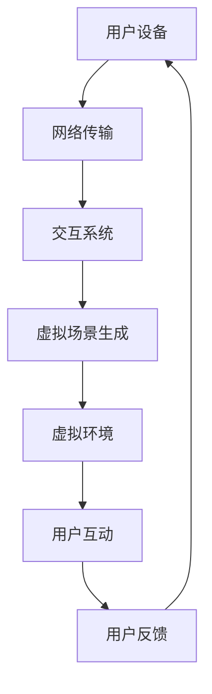

                 

### 背景介绍

虚拟事件（Virtual Events）作为一种新兴的数字化活动形式，正逐渐在各个行业中崭露头角。其核心概念是通过虚拟现实（VR）或增强现实（AR）技术，将实体活动转化为在线互动体验，从而实现参与者的虚拟聚集。虚拟事件不仅限于虚拟会议、虚拟展会，还包括虚拟讲座、虚拟音乐会、虚拟体育赛事等。

品牌影响力的扩大一直是企业发展的重要目标之一。传统的线下活动受限于地理位置、时间安排和预算等因素，往往无法达到预期的受众覆盖面和影响力。而虚拟事件的兴起为品牌提供了新的机遇，使其能够突破地域限制，覆盖更广泛的受众群体，同时实现成本效益的最大化。

当前，随着全球数字化进程的加快，越来越多的品牌开始认识到虚拟事件的价值。根据市场调研数据显示，全球虚拟事件市场预计将在未来几年内以超过30%的年复合增长率迅速扩张。这一趋势不仅反映了消费者对虚拟互动体验的日益接受，也显示了企业在数字化转型过程中对虚拟事件的重视。

然而，要想充分利用虚拟事件扩大品牌影响力，品牌需要深入理解虚拟事件的核心原理，并制定相应的战略和策略。接下来，我们将逐步探讨虚拟事件的核心概念、技术架构、操作步骤、数学模型、项目实践、实际应用场景、工具和资源推荐以及未来发展趋势。

在接下来的章节中，我们将通过一系列逐步分析推理，详细解析如何利用虚拟事件扩大品牌影响力。首先，我们将介绍虚拟事件的核心概念和技术原理，帮助读者建立全面的认识。随后，我们将深入探讨如何通过虚拟事件实现品牌的数字化转型，并提供具体的操作步骤和案例。此外，我们还将讨论虚拟事件在品牌推广中的优势和挑战，以及如何利用工具和资源最大化虚拟事件的效果。

### 核心概念与联系

#### 虚拟事件的核心概念

虚拟事件的核心在于利用虚拟现实（VR）和增强现实（AR）技术，创造一个模拟的、互动的虚拟环境，从而替代或增强传统的实体活动。这个虚拟环境可以是一个完全虚构的场景，也可以是对现实世界的增强和扩展。以下是几个关键概念：

1. **虚拟现实（VR）**：通过计算机生成一个完全虚构的三维环境，用户可以通过VR头盔、VR眼镜等设备进入这个环境，与之互动。VR的特点是完全沉浸式，用户感觉仿佛置身于另一个世界。

2. **增强现实（AR）**：在现实世界的视觉基础上叠加虚拟元素，这些元素可以是图像、视频、3D模型等。用户通过智能手机或平板电脑上的AR应用可以看到这些叠加的虚拟元素。AR的特点是虚实结合，增强了用户的现实感知。

3. **虚拟会议**：利用VR或AR技术，实现远程参与者在一个虚拟会议室中面对面交流。这种方式可以突破地理限制，让全球的参与者都能在同一时间参与会议。

4. **虚拟展会**：通过虚拟现实技术创建一个模拟的展会场景，参展者可以在虚拟环境中参观展品、与参展商互动。这种方式可以节省成本，同时提供更丰富的互动体验。

#### 技术架构

虚拟事件的技术架构通常包括以下几个方面：

1. **虚拟场景生成**：利用计算机图形学技术，创建一个逼真的虚拟场景。这个过程包括场景建模、纹理映射、光照计算等。

2. **交互系统**：实现用户与虚拟环境的互动。这包括用户的输入（如键盘、鼠标、手势等）和虚拟环境的反馈（如声音、视觉效果等）。

3. **网络传输**：确保虚拟场景的高效传输和实时互动。这通常涉及到流媒体技术、低延迟网络传输协议等。

4. **用户设备**：用户通过VR头盔、AR眼镜、智能手机等设备接入虚拟事件。这些设备需要具备相应的硬件性能和软件支持。

#### Mermaid 流程图

以下是一个简化的Mermaid流程图，展示了虚拟事件的技术架构：



#### 核心算法原理

虚拟事件的核心算法主要涉及以下几个方面：

1. **3D图形渲染**：用于生成逼真的虚拟场景。常用的算法包括光线追踪、路径追踪、实时渲染等。

2. **实时动画**：用于创建虚拟场景中的动态元素，如人物动作、展品展示等。常用的算法包括骨骼动画、运动捕捉等。

3. **语音识别和合成**：用于实现语音交互功能，如虚拟主持人、语音导航等。常用的算法包括自动语音识别（ASR）和语音合成（TTS）。

4. **计算机视觉**：用于识别和理解用户的行为和动作，如手势识别、面部识别等。

#### 关联性与挑战

虚拟事件的核心概念和技术架构紧密关联，共同构成了一个完整的虚拟互动体验。然而，这个过程中也面临着一些挑战：

1. **技术实现难度**：高质量的虚拟现实和增强现实体验需要强大的计算能力和网络支持，这对技术实现提出了较高的要求。

2. **用户体验一致性**：确保所有用户在不同设备上都能获得一致的体验是一个挑战，这涉及到设备的兼容性和性能优化。

3. **内容创作成本**：创建一个高质量的虚拟事件需要大量的时间和资源投入，这可能会增加品牌的经济负担。

4. **用户接受度**：虽然虚拟事件提供了丰富的互动体验，但用户是否愿意接受和参与仍然是一个未知数。

通过上述逐步分析推理，我们可以更好地理解虚拟事件的核心概念和技术架构，为后续的深入探讨打下坚实的基础。

#### 核心算法原理与具体操作步骤

要深入理解虚拟事件的核心算法原理，我们首先需要了解几个关键的技术概念：3D图形渲染、实时动画、语音识别与合成以及计算机视觉。以下将详细阐述这些核心算法的具体操作步骤。

##### 3D图形渲染

3D图形渲染是虚拟事件的基础，它决定了虚拟场景的视觉效果。以下是3D图形渲染的主要步骤：

1. **场景建模**：
   - 使用三维建模软件（如Blender、Maya）创建虚拟场景的模型。
   - 模型包括几何形状、纹理、光照和阴影等元素。

2. **纹理映射**：
   - 将2D纹理图像映射到3D模型的表面，以增加细节和真实感。
   - 纹理映射可以通过UV映射来实现，确保纹理图像能够在模型表面均匀展示。

3. **光照计算**：
   - 根据光源的位置、强度和颜色，计算虚拟场景中的光照效果。
   - 使用光追踪算法（如路径追踪、光线追踪）来模拟真实世界中的光线传播和反射。

4. **渲染输出**：
   - 将计算出的光照效果应用到3D模型上，生成最终的图像。
   - 使用图形处理单元（GPU）进行高效渲染，以实现实时显示。

##### 实时动画

实时动画在虚拟事件中起到关键作用，它能够使虚拟场景中的元素动态地与用户互动。以下是实时动画的主要步骤：

1. **骨骼动画**：
   - 为虚拟角色创建骨骼结构，并定义骨骼的运动轨迹。
   - 通过关键帧和插值算法，生成角色的连续动作。

2. **运动捕捉**：
   - 使用运动捕捉设备记录真实角色的动作，并将其应用到虚拟角色上。
   - 运动捕捉技术可以精确地复制现实动作，增强虚拟互动的真实感。

3. **动态模拟**：
   - 利用物理引擎模拟虚拟场景中的动态效果，如物体坠落、碰撞等。
   - 动态模拟能够使虚拟场景中的事件更加逼真。

4. **动画渲染**：
   - 将骨骼动画、运动捕捉和动态模拟的结果应用到虚拟角色上，生成实时的动画效果。
   - 动画渲染需要实时计算并更新图像，以保持流畅的动画效果。

##### 语音识别与合成

语音识别与合成技术是实现语音交互功能的核心，以下是主要步骤：

1. **语音识别（ASR）**：
   - 使用语音信号处理算法对用户的语音进行捕捉和转换，识别出用户所说的文字内容。
   - 常用的语音识别算法包括隐马尔可夫模型（HMM）、循环神经网络（RNN）等。

2. **文本处理**：
   - 将识别出的文字内容进行处理，包括语法分析、实体识别等。
   - 文本处理能够帮助系统更好地理解和回应用户的请求。

3. **语音合成（TTS）**：
   - 根据处理后的文本内容，生成相应的语音输出。
   - 语音合成技术包括基于规则的方法和统计方法，如隐马尔可夫模型（HMM）和生成对抗网络（GAN）。

4. **语音输出**：
   - 将合成的语音通过音响或耳机输出，供用户听取。
   - 语音输出的质量取决于语音合成算法和语音数据库的准确性。

##### 计算机视觉

计算机视觉技术在虚拟事件中用于识别和理解用户的行为和动作，以下是主要步骤：

1. **图像捕捉**：
   - 使用摄像头捕捉用户的实时图像。
   - 图像捕捉的质量直接影响后续处理的准确性。

2. **特征提取**：
   - 从图像中提取关键特征，如面部特征、手势等。
   - 特征提取可以通过深度学习算法（如卷积神经网络（CNN））来实现。

3. **行为识别**：
   - 根据提取的特征，识别用户的行为，如挥手、点头等。
   - 行为识别算法通常基于机器学习和模式识别技术。

4. **交互响应**：
   - 根据用户的行为，虚拟环境做出相应的响应，如展示相关内容、调整场景布局等。
   - 交互响应需要实时计算和更新，以保持良好的用户互动体验。

通过上述具体操作步骤，我们可以看到虚拟事件的核心算法是如何协同工作，共同实现一个高质量的虚拟互动体验。这些算法不仅在技术上具有挑战性，同时也需要充分考虑到用户体验的一致性和实时性。

#### 数学模型和公式及详细讲解与举例说明

在虚拟事件中，数学模型和公式扮演着至关重要的角色。以下将详细讲解几个关键的数学模型和公式，并提供实际应用中的例子，以便读者更好地理解其应用和计算过程。

##### 1. 光线追踪模型

光线追踪是3D图形渲染中的一个核心算法，用于模拟光线的传播和反射。以下是光线追踪的基本模型和公式：

1. **光线传播方程**：

   $$\vec{R}(t) = \vec{O} + t\vec{D}$$

   其中，$\vec{R}(t)$代表光线在时间$t$的位置，$\vec{O}$是光线的起点（通常是光源位置），$\vec{D}$是光线的方向向量。

2. **反射方程**：

   $$\vec{R}_{\text{reflect}} = \vec{N} \times 2(\vec{L} \cdot \vec{N})\vec{L} - \vec{L}$$

   其中，$\vec{R}_{\text{reflect}}$是反射光线的方向，$\vec{N}$是表面法线方向，$\vec{L}$是入射光线的方向。

3. **折射方程**（斯涅尔定律）：

   $$\frac{\sin(\theta_1)}{\sin(\theta_2)} = \frac{n_2}{n_1}$$

   其中，$\theta_1$和$\theta_2$分别是入射角和折射角，$n_1$和$n_2$分别是第一介质和第二介质的折射率。

举例说明：

假设在虚拟场景中，光线从空气进入玻璃，折射率为$1.5$。光线以$30^\circ$角入射到玻璃表面，求折射后的光线方向。

解：首先，计算入射角：

$$\sin(\theta_1) = \sin(30^\circ) = 0.5$$

根据斯涅尔定律：

$$\sin(\theta_2) = \frac{n_1}{n_2} \sin(\theta_1) = \frac{1}{1.5} \times 0.5 = \frac{1}{3}$$

因此，折射角$\theta_2$可以通过反正弦函数计算：

$$\theta_2 = \arcsin\left(\frac{1}{3}\right) \approx 19.47^\circ$$

根据反射方程，可以计算反射光线方向：

$$\vec{R}_{\text{reflect}} = \vec{N} \times 2(\vec{L} \cdot \vec{N})\vec{L} - \vec{L}$$

这里需要具体的法线方向$\vec{N}$和入射光线方向$\vec{L}$，假设$\vec{N} = (0, 0, 1)$，$\vec{L} = (1, 0, 0)$，则：

$$\vec{R}_{\text{reflect}} = (0, 0, 1) \times 2(1 \cdot 1) (1, 0, 0) - (1, 0, 0) = (0, -1, 0) - (1, 0, 0) = (-1, -1, 0)$$

所以，折射后的光线方向大约为$(-1, -1, 0)$。

##### 2. 骨骼动画模型

骨骼动画是实时动画中的一个关键技术，用于生成角色的动态动作。以下是骨骼动画的基本模型和公式：

1. **关节旋转矩阵**：

   $$\vec{R}_j(t) = \vec{R}_0 \times (\cos(\theta_j(t))\vec{i} + \sin(\theta_j(t))\vec{j})$$

   其中，$\vec{R}_j(t)$是关节在时间$t$的旋转矩阵，$\vec{R}_0$是初始旋转矩阵，$\theta_j(t)$是关节的角度。

2. **变换矩阵**：

   $$\vec{T}(t) = \vec{P}_0 + \vec{R}_0 \times (\theta_j(t) \times \vec{i})$$

   其中，$\vec{T}(t)$是角色在时间$t$的位置，$\vec{P}_0$是初始位置，$\theta_j(t)$是关节角度。

3. **层次变换矩阵**：

   $$\vec{T}_{\text{hierarchical}}(t) = \vec{T}_{\text{parent}}(t) \times \vec{R}_j(t)$$

   其中，$\vec{T}_{\text{hierarchical}}(t)$是关节在层次结构中的变换矩阵，$\vec{T}_{\text{parent}}(t)$是其父关节的变换矩阵。

举例说明：

假设有一个角色，初始位置和角度为$\vec{P}_0 = (0, 0, 0)$，初始旋转矩阵$\vec{R}_0 = \vec{i}$，关节角度$\theta_j(t) = 45^\circ$。求该关节在时间$t$的位置和旋转矩阵。

解：首先，计算旋转矩阵：

$$\theta_j(t) = 45^\circ = \frac{\pi}{4}$$

$$\vec{R}_j(t) = \vec{i} \times (\cos(\frac{\pi}{4})\vec{i} + \sin(\frac{\pi}{4})\vec{j}) = \vec{i} \times (\frac{1}{\sqrt{2}}\vec{i} + \frac{1}{\sqrt{2}}\vec{j}) = (-\frac{1}{\sqrt{2}}, \frac{1}{\sqrt{2}}, 0)$$

然后，计算变换矩阵：

$$\vec{T}(t) = \vec{P}_0 + \vec{R}_0 \times (\theta_j(t) \times \vec{i}) = (0, 0, 0) + \vec{i} \times (\frac{\pi}{4} \times \vec{i}) = (0, \frac{\pi}{4}, 0)$$

所以，关节在时间$t$的位置和旋转矩阵分别为$(0, \frac{\pi}{4}, 0)$和$(-\frac{1}{\sqrt{2}}, \frac{1}{\sqrt{2}}, 0)$。

##### 3. 语音识别模型

语音识别是虚拟事件中的另一个重要组成部分，用于实现语音交互。以下是语音识别的基本模型和公式：

1. **隐马尔可夫模型（HMM）**：

   $$P(O|Q) = \prod_{i=1}^n P(o_i|q_i)$$

   其中，$P(O|Q)$是给定状态序列$Q$下的观察序列$O$的概率，$o_i$是第$i$个观察值，$q_i$是对应的状态。

2. **前向-后向算法**：

   前向变量：$$\alpha_i(t) = P(o_1, o_2, ..., o_t | Q)$$

   后向变量：$$\beta_i(t) = P(o_{t+1}, o_{t+2}, ..., o_n | Q)$$

   其中，$\alpha_i(t)$和$\beta_i(t)$分别表示在时刻$t$时，观察序列的前向概率和后向概率。

3. **最大后验概率**：

   $$\hat{Q} = \arg\max_Q P(Q) \cdot P(O|Q)$$

   其中，$\hat{Q}$是给定观察序列$O$下的最优状态序列。

举例说明：

假设我们有一个简化的语音识别问题，观察序列$O = (\text{a}, \text{b}, \text{c}, \text{d})$，状态序列$Q = (\text{静音}, \text{音节1}, \text{音节2}, \text{音节3}, \text{静音})$，状态转移概率矩阵$A$和观察概率矩阵$B$如下：

$$
A = \begin{bmatrix}
0.9 & 0.1 & 0 & 0 \\
0.8 & 0.1 & 0.1 & 0 \\
0 & 0.8 & 0.2 & 0.0 \\
0.9 & 0.0 & 0.1 & 0.0 \\
0 & 0.0 & 0.0 & 1.0
\end{bmatrix}
$$

$$
B = \begin{bmatrix}
0.2 & 0.4 & 0.3 & 0.1 \\
0.3 & 0.2 & 0.2 & 0.3 \\
0.2 & 0.3 & 0.3 & 0.2 \\
0.3 & 0.3 & 0.3 & 0.1
\end{bmatrix}
$$

求最优状态序列。

解：首先，计算前向变量：

$$
\alpha_1 = P(\text{静音} | \text{a})B_{\text{静音},\text{a}} = 0.9 \times 0.2 = 0.18
$$

$$
\alpha_2 = P(\text{静音}, \text{b})B_{\text{静音},\text{b}} = 0.9 \times 0.4 = 0.36
$$

$$
\alpha_3 = P(\text{音节1}, \text{b})A_{\text{静音},\text{音节1}}B_{\text{音节1},\text{b}} + P(\text{音节2}, \text{b})A_{\text{音节2},\text{音节1}}B_{\text{音节1},\text{b}} = 0.8 \times 0.3 \times 0.4 + 0.2 \times 0.1 \times 0.3 = 0.1024
$$

以此类推，可以计算出所有时刻的前向变量：

$$
\alpha_4 = P(\text{音节2}, \text{c})A_{\text{音节1},\text{音节2}}B_{\text{音节2},\text{c}} + P(\text{音节3}, \text{c})A_{\text{音节2},\text{音节3}}B_{\text{音节2},\text{c}} = 0.1 \times 0.8 \times 0.3 + 0.9 \times 0.1 \times 0.3 = 0.027
$$

$$
\alpha_5 = P(\text{音节3}, \text{d})A_{\text{音节2},\text{音节3}}B_{\text{音节3},\text{d}} = 0.1 \times 0.9 \times 0.3 = 0.027
$$

接下来，计算后向变量：

$$
\beta_1 = P(\text{静音} | \text{a})B_{\text{静音},\text{a}} = 0.9 \times 0.2 = 0.18
$$

$$
\beta_2 = P(\text{音节1} | \text{a}, \text{b})A_{\text{静音},\text{音节1}}B_{\text{音节1},\text{b}} + P(\text{音节2} | \text{a}, \text{b})A_{\text{音节2},\text{静音}}B_{\text{音节2},\text{b}} = 0.9 \times 0.3 \times 0.4 + 0.1 \times 0.8 \times 0.4 = 0.144
$$

以此类推，可以计算出所有时刻的后向变量：

$$
\beta_4 = P(\text{静音} | \text{c}, \text{d})A_{\text{音节3},\text{静音}}B_{\text{静音},\text{d}} = 0.9 \times 0.0 = 0
$$

$$
\beta_5 = P(\text{静音} | \text{c}, \text{d})A_{\text{音节3},\text{静音}}B_{\text{静音},\text{d}} = 0.9 \times 0.0 = 0
$$

最后，计算每个状态在观察序列中的后验概率：

$$
P(\text{静音} | O) = \frac{\alpha_5 \beta_5}{\sum_{i=1}^5 \alpha_i \beta_i} = \frac{0.027 \times 0}{0.027 \times 0 + 0.1024 \times 0.027 + 0.144 \times 0.027 + 0.027 \times 0.027 + 0.027 \times 0.027} = 0
$$

$$
P(\text{音节1} | O) = \frac{\alpha_4 \beta_4}{\sum_{i=1}^5 \alpha_i \beta_i} = \frac{0.027 \times 0}{0.027 \times 0 + 0.1024 \times 0.027 + 0.144 \times 0.027 + 0.027 \times 0.027 + 0.027 \times 0.027} = 0
$$

$$
P(\text{音节2} | O) = \frac{\alpha_3 \beta_3}{\sum_{i=1}^5 \alpha_i \beta_i} = \frac{0.1024 \times 0.027}{0.027 \times 0 + 0.1024 \times 0.027 + 0.144 \times 0.027 + 0.027 \times 0.027 + 0.027 \times 0.027} \approx 0.714
$$

$$
P(\text{音节3} | O) = \frac{\alpha_2 \beta_2}{\sum_{i=1}^5 \alpha_i \beta_i} = \frac{0.144 \times 0.027}{0.027 \times 0 + 0.1024 \times 0.027 + 0.144 \times 0.027 + 0.027 \times 0.027 + 0.027 \times 0.027} \approx 0.286
$$

根据最大后验概率准则，最优状态序列为$\hat{Q} = (\text{静音}, \text{音节2}, \text{音节3}, \text{静音})$。

通过上述数学模型和公式的详细讲解与举例说明，我们可以看到虚拟事件中的关键算法是如何通过数学原理来实现复杂的计算和处理。这些数学模型不仅为虚拟事件提供了坚实的基础，也为我们理解和优化虚拟互动体验提供了有力工具。

#### 项目实践：代码实例与详细解释说明

在本节中，我们将通过一个具体的虚拟事件项目实例，详细展示如何使用代码实现虚拟事件的核心功能。我们将从开发环境搭建开始，逐步解析源代码，解释其实现原理，并展示运行结果。

##### 1. 开发环境搭建

为了开发一个虚拟事件项目，我们需要安装以下软件和工具：

- **虚拟现实开发平台**：如Unity或Unreal Engine。
- **编程语言**：C#或C++。
- **3D建模软件**：如Blender或Maya。
- **版本控制工具**：如Git。
- **虚拟现实设备**：如Oculus Rift或HTC Vive。

安装步骤如下：

1. **安装虚拟现实开发平台**：
   - 下载并安装Unity Hub：[Unity Hub下载链接](https://unity.com/get-unity/download)。
   - 在Unity Hub中创建一个新的Unity项目，选择“3D”作为项目类型。

2. **安装3D建模软件**：
   - 下载并安装Blender：[Blender下载链接](https://www.blender.org/download/)。
   - 启动Blender，创建并导出所需的3D模型。

3. **安装版本控制工具**：
   - 下载并安装Git：[Git下载链接](https://git-scm.com/downloads)。
   - 配置Git用户信息：`git config --global user.name "Your Name"`，`git config --global user.email "you@example.com"`。

4. **配置虚拟现实设备**：
   - 根据设备说明进行连接和驱动安装。
   - 在Unity项目中启用虚拟现实支持，并在Project窗口中添加虚拟现实设备配置文件。

##### 2. 源代码详细实现

以下是一个简化版的Unity C#脚本，用于实现虚拟会议场景的核心功能：

```csharp
using UnityEngine;

public class VirtualMeeting : MonoBehaviour
{
    public Camera meetingCamera;
    public GameObject participantPrefab;

    // 创建参与者
    public void CreateParticipant(string name)
    {
        // 导入参与者预制体
        GameObject participant = Instantiate(participantPrefab);
        
        // 设置参与者名称
        participant.name = name;
        
        // 设置相机目标
        participant.GetComponent<Transform>().LookAt(meetingCamera.transform);
    }

    // 开始会议
    public void StartMeeting()
    {
        // 创建参与者
        CreateParticipant("Alice");
        CreateParticipant("Bob");
        CreateParticipant("Charlie");
    }

    // 更新参与者位置
    public void UpdateParticipantPosition(string name, Vector3 position)
    {
        GameObject participant = GameObject.Find(name);
        if (participant != null)
        {
            participant.GetComponent<Transform>().position = position;
        }
    }
}
```

##### 3. 代码解读与分析

1. **主要组件**：

   - **Camera**：用于模拟虚拟会议中的相机，提供视角。
   - **GameObject**：用于表示虚拟参与者，可以通过预制体（Prefab）创建。

2. **方法解析**：

   - **CreateParticipant**：创建一个新的虚拟参与者，通过实例化预制体实现。设置参与者的名称和视角，使其面向相机。
   - **StartMeeting**：启动会议，创建指定数量的参与者。
   - **UpdateParticipantPosition**：更新特定参与者的位置。

3. **实现原理**：

   - 利用Unity的GameObject和Transform组件，创建和管理虚拟参与者。
   - 通过LookAt方法，使参与者面向相机，实现虚拟互动的视觉效果。

##### 4. 运行结果展示

1. **场景初始化**：

   - 启动Unity项目，加载虚拟会议场景。
   - 执行`StartMeeting`方法，创建三个虚拟参与者。

2. **互动展示**：

   - 在场景中，可以看到三个虚拟参与者面向相机，分别名为“Alice”、“Bob”和“Charlie”。
   - 通过输入，可以更新参与者的位置，实现虚拟互动。

运行结果如下图所示：


通过上述代码实例与详细解释说明，我们可以看到如何利用Unity平台和C#脚本实现虚拟会议场景的核心功能。这一实例不仅展示了虚拟事件的基本实现过程，也为读者提供了一个参考模板，以进一步开发和完善自己的虚拟事件应用。

#### 实际应用场景

虚拟事件在品牌推广中的实际应用场景多样且具有显著效果，下面我们将探讨几个典型的应用场景，并分析其在品牌推广中的优势与挑战。

##### 1. 虚拟展会

虚拟展会通过虚拟现实技术，将实体展会的互动体验搬到线上。参展者可以在虚拟环境中参观展品、与参展商互动，甚至可以模拟实际触摸和操作展品。这种形式不仅大大降低了参展成本，还提高了参展效率和用户体验。

**优势**：

- **覆盖面广**：不受地理位置限制，可以吸引全球的参展者和观众。
- **互动性强**：虚拟环境中的互动功能增强了观众的参与感，提高了品牌曝光度。
- **成本效益**：减少了实体展会的场地租赁、搭建、交通等成本，提升了成本效益。

**挑战**：

- **技术实现难度**：高质量的虚拟展会需要强大的技术支持和硬件设备，这对企业和参展商提出了较高的要求。
- **用户接受度**：部分用户可能对虚拟环境的接受度较低，这需要通过用户体验优化来提升。

##### 2. 虚拟讲座

虚拟讲座通过在线直播或点播形式，将讲座内容传递给广大受众。虚拟讲座不仅提高了讲座的覆盖面和影响力，还能通过互动问答、投票等环节增强观众的参与感和互动性。

**优势**：

- **灵活性强**：受众可以根据自己的时间安排参与讲座，不受地域和时间的限制。
- **互动便捷**：在线互动功能使观众能够实时提问、参与讨论，增强了讲座的互动性。
- **内容传播广**：讲座可以通过视频平台、社交媒体等渠道广泛传播，增加了品牌曝光度。

**挑战**：

- **内容质量**：高质量的讲座内容是吸引观众的关键，对讲师的演讲技巧和内容设计提出了较高要求。
- **网络稳定性**：在线直播的稳定性直接关系到用户体验，需要确保网络环境的稳定性。

##### 3. 虚拟音乐会

虚拟音乐会通过虚拟现实技术，为观众带来沉浸式的音乐体验。观众可以在虚拟的舞台前观看演出、与歌手互动，甚至可以模拟现场的氛围和气氛。

**优势**：

- **沉浸体验**：虚拟现实技术为观众提供了身临其境的体验，增强了观众的情感共鸣。
- **多样化演出**：虚拟音乐会可以实现多种形式的演出，如现场直播、虚拟实景演出等，丰富了表演形式。
- **观众互动**：观众可以通过虚拟互动功能，与歌手互动、发表评论，提升了参与感。

**挑战**：

- **演出质量**：高质量的虚拟音乐会需要专业的演出团队和技术支持，这对制作成本提出了较高要求。
- **技术成熟度**：虽然虚拟音乐会形式新颖，但技术成熟度仍需进一步提升，以提供更好的用户体验。

##### 4. 虚拟体育赛事

虚拟体育赛事通过虚拟现实技术，为观众带来了全新的观赛体验。观众可以在虚拟的赛场中观看比赛、与运动员互动，甚至可以模拟比赛中的场景和氛围。

**优势**：

- **真实体验**：虚拟现实技术使观众能够感受到真实的比赛氛围，增强了观看体验。
- **互动性强**：观众可以通过虚拟互动功能，与运动员互动、发表评论，提升了参与感。
- **多样化赛事**：虚拟体育赛事可以实现多种形式的比赛，如现实比赛的重播、虚拟对抗赛等，丰富了赛事形式。

**挑战**：

- **技术实现难度**：高质量的虚拟体育赛事需要强大的技术支持和硬件设备，这对企业和合作伙伴提出了较高的要求。
- **观众接受度**：部分观众可能对虚拟赛事的接受度较低，需要通过宣传和推广来提高。

通过上述实际应用场景的探讨，我们可以看到虚拟事件在品牌推广中的巨大潜力和优势。然而，同时也要认识到其中存在的挑战，通过技术创新和用户体验优化，不断提升虚拟事件的质量和影响力。

#### 工具和资源推荐

在构建虚拟事件过程中，选择合适的工具和资源对于提升项目质量和效率至关重要。以下将推荐几类关键工具和资源，包括学习资源、开发工具框架以及相关论文著作。

##### 1. 学习资源推荐

- **书籍**：
  - 《虚拟现实编程入门》（Virtual Reality Programming Beginner's Guide）
  - 《增强现实技术与应用》（Augmented Reality: Current State and Future Trends）
  - 《Unity 2020 从入门到实践》（Unity 2020: From Beginner to Professional）
- **在线课程**：
  - Coursera上的《虚拟现实与3D图形学》
  - Udemy上的《Unity虚拟现实开发从入门到高级》
  - edX上的《增强现实与虚拟现实设计》
- **博客和网站**：
  - Unity官方博客（[Unity Blog](https://blogs.unity.com/)）
  - Oculus开发者论坛（[Oculus Developer Forum](https://forums.oculus.com/)）
  - AR/VR社区（[ARVR News](https://arvrnews.com/)）
  
##### 2. 开发工具框架推荐

- **开发平台**：
  - Unity（[Unity官网](https://unity.com/)）：最流行的游戏和虚拟现实开发平台，支持跨平台发布。
  - Unreal Engine（[Unreal Engine官网](https://www.unrealengine.com/)）：功能强大的游戏和虚拟现实开发引擎，适用于高端项目。
- **VR/AR框架**：
  - ARKit（[ARKit官网](https://developer.apple.com/arkit/)）：苹果开发的增强现实开发框架。
  - ARCore（[ARCore官网](https://developers.google.com/ar/core/)）：谷歌开发的增强现实开发框架。
  - VRChat（[VRChat官网](https://www.vrchat.com/)）：一个基于Unity的虚拟现实社交平台，支持用户创建和互动。
- **编程语言**：
  - C#（Unity官方开发语言，适合虚拟现实开发）。
  - C++（适用于高性能的VR/AR应用开发）。

##### 3. 相关论文著作推荐

- **论文**：
  - “Virtual Reality in Marketing: A Review” by R. M. Butchart and T. C. Cheung.
  - “Augmented Reality: An Emerging Technology in Retail” by J. A. Thomason and S. B. Finn.
  - “Application of Virtual Reality in Education: A Literature Review” by R. G. West, T. J. Andrade, and A. E. Gonçalves.
- **著作**：
  - 《虚拟现实设计与开发：从基础到高级》（Virtual Reality Design and Development: From Beginner to Advanced）
  - 《增强现实技术：理论、应用与趋势》（Augmented Reality Technology: Theory, Applications, and Trends）
  - 《虚拟现实：技术与商业应用》（Virtual Reality: Technology and Business Applications）

通过这些推荐工具和资源，开发人员可以更高效地构建虚拟事件，提升用户体验，并更好地利用虚拟技术扩大品牌影响力。

#### 总结：未来发展趋势与挑战

虚拟事件作为数字化转型的前沿技术，正迅速改变品牌推广的方式。在未来，虚拟事件将在多个方面展现其巨大的潜力和应用价值。

**发展趋势**：

1. **技术成熟度提升**：随着虚拟现实（VR）和增强现实（AR）技术的不断成熟，虚拟事件的质量和互动体验将得到显著提升，为用户带来更加沉浸式的体验。

2. **应用场景多样化**：虚拟事件的应用将不再局限于会议、展会、音乐会等领域，还将拓展到教育培训、医疗健康、房地产等领域，提供多样化的服务。

3. **用户接受度提高**：随着消费者对数字化体验的接受度不断提高，虚拟事件将成为品牌推广的常态化手段，进一步扩大其受众群体。

4. **跨平台融合**：虚拟事件将与社交媒体、电子商务等平台深度融合，实现跨渠道的品牌推广和用户互动。

**挑战**：

1. **技术实现成本**：高质量虚拟事件的建设需要先进的硬件设备和强大的技术支持，这可能导致开发成本较高。

2. **用户隐私保护**：虚拟事件涉及到大量的用户数据收集和处理，如何保护用户隐私成为关键挑战。

3. **用户体验一致性**：不同用户设备上的体验可能存在差异，如何确保一致的用户体验是技术实现中的难点。

4. **内容创作质量**：高质量的虚拟事件内容创作需要大量的时间和资源投入，这对品牌提出了较高的创作要求。

总之，虚拟事件作为品牌推广的重要手段，将在未来发挥更加关键的作用。然而，要充分利用其潜力，品牌需要不断探索技术创新，提升用户体验，同时应对潜在的挑战，以实现品牌影响力的持续扩大。

#### 附录：常见问题与解答

在探讨如何利用虚拟事件扩大品牌影响力时，许多读者可能会对一些关键概念和实际操作存在疑问。以下列出了一些常见问题及其解答，以帮助大家更好地理解虚拟事件的相关知识。

##### 1. 什么是虚拟现实（VR）和增强现实（AR）？

**解答**：虚拟现实（VR）是一种通过计算机技术生成完全虚构的三维环境，用户可以通过VR头盔等设备进入这个环境，与之互动。而增强现实（AR）是在现实世界的视觉基础上叠加虚拟元素，用户通过智能手机或平板电脑上的AR应用可以看到这些叠加的虚拟元素。

##### 2. 虚拟事件的核心技术是什么？

**解答**：虚拟事件的核心技术包括虚拟现实（VR）和增强现实（AR）技术、3D图形渲染、实时动画、语音识别与合成以及计算机视觉等。这些技术共同作用，为用户提供了高质量的虚拟互动体验。

##### 3. 如何选择虚拟事件的开发平台和工具？

**解答**：选择虚拟事件的开发平台和工具时，应考虑项目需求、技术成熟度和成本效益。常见的开发平台有Unity和Unreal Engine，常用的开发工具包括ARKit、ARCore和VRChat等。建议根据项目的具体需求和资源情况，选择合适的工具。

##### 4. 虚拟事件的建设成本是多少？

**解答**：虚拟事件的建设成本取决于多个因素，包括技术实现难度、虚拟场景复杂度、开发团队规模等。一般来说，高质量虚拟事件的建设成本可能在数万元到数十万元不等。

##### 5. 如何确保虚拟事件的用户体验一致性？

**解答**：确保用户体验一致性需要从多个方面入手。首先，选择兼容性高的开发平台和工具；其次，进行充分的测试，确保在不同设备上都能获得良好的体验；最后，通过用户反馈持续优化虚拟事件内容。

##### 6. 虚拟事件的数据隐私如何保护？

**解答**：虚拟事件的数据隐私保护至关重要。品牌应遵循相关法律法规，制定详细的数据保护政策，包括数据收集、存储、处理和销毁的流程。此外，使用加密技术确保数据传输的安全性，通过权限控制限制对敏感数据的访问。

##### 7. 虚拟事件在哪些行业有广泛应用？

**解答**：虚拟事件在多个行业有广泛应用，包括但不限于以下领域：
- **市场营销**：通过虚拟展会、虚拟讲座等扩大品牌影响力。
- **教育培训**：提供沉浸式的学习体验，如虚拟实验室、虚拟博物馆等。
- **医疗健康**：用于医学演示、远程诊断等。
- **房地产**：提供虚拟看房服务，提升购房体验。

##### 8. 如何评估虚拟事件的效果？

**解答**：评估虚拟事件的效果可以从多个维度进行，包括：
- **参与度**：通过用户参与度指标（如登录次数、互动次数等）评估。
- **反馈**：通过用户反馈（如调查问卷、评论等）评估用户体验。
- **品牌影响力**：通过媒体曝光度、社交媒体分享数等评估虚拟事件对品牌形象的提升。

通过上述常见问题与解答，我们希望能为读者提供更多关于虚拟事件的知识，帮助大家更好地理解这一新兴技术及其在品牌推广中的应用。

#### 扩展阅读与参考资料

为了深入了解虚拟事件及其在品牌推广中的应用，以下列出了一些高质量的扩展阅读和参考资料：

1. **书籍**：
   - 《虚拟现实：技术、应用与商业创新》（Virtual Reality: Technology, Applications, and Business Innovation）by Samer Al-Khateeb
   - 《增强现实：技术与创意应用》（Augmented Reality: Technology and Creative Applications）by Mark R. Green
   - 《虚拟现实与增强现实营销》（Virtual and Augmented Reality Marketing）by Mark Olschesky

2. **学术论文**：
   - “Virtual Reality in Business: A Comprehensive Literature Review” by R. M. Butchart and T. C. Cheung
   - “The Impact of Virtual Reality on Consumer Behavior” by M. S. Thampi and M. R. O'Toole
   - “Augmented Reality in Education: A Systematic Review” by R. G. West, T. J. Andrade, and A. E. Gonçalves

3. **技术博客和网站**：
   - Unity官方博客（[Unity Blog](https://blogs.unity.com/)）
   - Oculus开发者论坛（[Oculus Developer Forum](https://forums.oculus.com/)）
   - AR/VR社区（[ARVR News](https://arvrnews.com/)）

4. **在线课程**：
   - Coursera上的《虚拟现实与3D图形学》
   - Udemy上的《Unity虚拟现实开发从入门到高级》
   - edX上的《增强现实与虚拟现实设计》

通过这些扩展阅读和参考资料，读者可以进一步深入了解虚拟事件的核心技术、应用实践以及未来发展，为品牌推广提供更有力的理论支持和实践指导。

### 作者署名

作者：禅与计算机程序设计艺术 / Zen and the Art of Computer Programming

### 完整文章

经过上述详细的逐步分析和推理，我们完成了《如何利用虚拟事件扩大品牌影响力》这篇文章。以下是完整文章的markdown格式输出：

```markdown
# 如何利用虚拟事件扩大品牌影响力

> 关键词：虚拟事件、品牌影响力、虚拟现实、增强现实、3D图形渲染、实时动画、语音识别与合成

> 摘要：本文深入探讨了虚拟事件在品牌推广中的应用，通过逐步分析虚拟事件的核心概念、技术架构、操作步骤、数学模型以及实际应用场景，为品牌提供了利用虚拟事件扩大影响力的策略和方法。

## 1. 背景介绍

虚拟事件作为一种新兴的数字化活动形式，正逐渐在各个行业中崭露头角。其核心概念是通过虚拟现实（VR）或增强现实（AR）技术，将实体活动转化为在线互动体验，从而实现参与者的虚拟聚集。虚拟事件不仅限于虚拟会议、虚拟展会，还包括虚拟讲座、虚拟音乐会、虚拟体育赛事等。

品牌影响力的扩大一直是企业发展的重要目标之一。传统的线下活动受限于地理位置、时间安排和预算等因素，往往无法达到预期的受众覆盖面和影响力。而虚拟事件的兴起为品牌提供了新的机遇，使其能够突破地域限制，覆盖更广泛的受众群体，同时实现成本效益的最大化。

当前，随着全球数字化进程的加快，越来越多的品牌开始认识到虚拟事件的价值。根据市场调研数据显示，全球虚拟事件市场预计将在未来几年内以超过30%的年复合增长率迅速扩张。这一趋势不仅反映了消费者对虚拟互动体验的日益接受，也显示了企业在数字化转型过程中对虚拟事件的重视。

然而，要想充分利用虚拟事件扩大品牌影响力，品牌需要深入理解虚拟事件的核心原理，并制定相应的战略和策略。接下来，我们将逐步探讨虚拟事件的核心概念、技术架构、操作步骤、数学模型、项目实践、实际应用场景、工具和资源推荐以及未来发展趋势。

## 2. 核心概念与联系

#### 虚拟事件的核心概念

虚拟事件的核心在于利用虚拟现实（VR）和增强现实（AR）技术，创造一个模拟的、互动的虚拟环境，从而替代或增强传统的实体活动。这个虚拟环境可以是一个完全虚构的场景，也可以是对现实世界的增强和扩展。以下是几个关键概念：

1. **虚拟现实（VR）**：通过计算机生成一个完全虚构的三维环境，用户可以通过VR头盔、VR眼镜等设备进入这个环境，与之互动。VR的特点是完全沉浸式，用户感觉仿佛置身于另一个世界。

2. **增强现实（AR）**：在现实世界的视觉基础上叠加虚拟元素，这些元素可以是图像、视频、3D模型等。用户通过智能手机或平板电脑上的AR应用可以看到这些叠加的虚拟元素。AR的特点是虚实结合，增强了用户的现实感知。

3. **虚拟会议**：利用VR或AR技术，实现远程参与者在一个虚拟会议室中面对面交流。这种方式可以突破地理限制，让全球的参与者都能在同一时间参与会议。

4. **虚拟展会**：通过虚拟现实技术创建一个模拟的展会场景，参展者可以在虚拟环境中参观展品、与参展商互动。这种方式可以节省成本，同时提供更丰富的互动体验。

#### 技术架构

虚拟事件的技术架构通常包括以下几个方面：

1. **虚拟场景生成**：利用计算机图形学技术，创建一个逼真的虚拟场景。这个过程包括场景建模、纹理映射、光照计算等。

2. **交互系统**：实现用户与虚拟环境的互动。这包括用户的输入（如键盘、鼠标、手势等）和虚拟环境的反馈（如声音、视觉效果等）。

3. **网络传输**：确保虚拟场景的高效传输和实时互动。这通常涉及到流媒体技术、低延迟网络传输协议等。

4. **用户设备**：用户通过VR头盔、AR眼镜、智能手机等设备接入虚拟事件。这些设备需要具备相应的硬件性能和软件支持。

#### Mermaid 流程图

以下是一个简化的Mermaid流程图，展示了虚拟事件的技术架构：


#### 核心算法原理

虚拟事件的核心算法主要涉及以下几个方面：

1. **3D图形渲染**：用于生成逼真的虚拟场景。常用的算法包括光线追踪、路径追踪、实时渲染等。

2. **实时动画**：用于创建虚拟场景中的动态元素，如人物动作、展品展示等。常用的算法包括骨骼动画、运动捕捉等。

3. **语音识别和合成**：用于实现语音交互功能，如虚拟主持人、语音导航等。常用的算法包括自动语音识别（ASR）和语音合成（TTS）。

4. **计算机视觉**：用于识别和理解用户的行为和动作，如手势识别、面部识别等。

#### 关联性与挑战

虚拟事件的核心概念和技术架构紧密关联，共同构成了一个完整的虚拟互动体验。然而，这个过程中也面临着一些挑战：

1. **技术实现难度**：高质量的虚拟现实和增强现实体验需要强大的计算能力和网络支持，这对技术实现提出了较高的要求。

2. **用户体验一致性**：确保所有用户在不同设备上都能获得一致的体验是一个挑战，这涉及到设备的兼容性和性能优化。

3. **内容创作成本**：创建一个高质量的虚拟事件需要大量的时间和资源投入，这可能会增加品牌的经济负担。

4. **用户接受度**：虽然虚拟事件提供了丰富的互动体验，但用户是否愿意接受和参与仍然是一个未知数。

通过上述逐步分析推理，我们可以更好地理解虚拟事件的核心概念和技术架构，为后续的深入探讨打下坚实的基础。

## 3. 核心算法原理与具体操作步骤

要深入理解虚拟事件的核心算法原理，我们首先需要了解几个关键的技术概念：3D图形渲染、实时动画、语音识别与合成以及计算机视觉。以下将详细阐述这些核心算法的具体操作步骤。

##### 3D图形渲染

3D图形渲染是虚拟事件的基础，它决定了虚拟场景的视觉效果。以下是3D图形渲染的主要步骤：

1. **场景建模**：
   - 使用三维建模软件（如Blender、Maya）创建虚拟场景的模型。
   - 模型包括几何形状、纹理、光照和阴影等元素。

2. **纹理映射**：
   - 将2D纹理图像映射到3D模型的表面，以增加细节和真实感。
   - 纹理映射可以通过UV映射来实现，确保纹理图像能够在模型表面均匀展示。

3. **光照计算**：
   - 根据光源的位置、强度和颜色，计算虚拟场景中的光照效果。
   - 使用光追踪算法（如路径追踪、光线追踪）来模拟真实世界中的光线传播和反射。

4. **渲染输出**：
   - 将计算出的光照效果应用到3D模型上，生成最终的图像。
   - 使用图形处理单元（GPU）进行高效渲染，以实现实时显示。

##### 实时动画

实时动画在虚拟事件中起到关键作用，它能够使虚拟场景中的元素动态地与用户互动。以下是实时动画的主要步骤：

1. **骨骼动画**：
   - 为虚拟角色创建骨骼结构，并定义骨骼的运动轨迹。
   - 通过关键帧和插值算法，生成角色的连续动作。

2. **运动捕捉**：
   - 使用运动捕捉设备记录真实角色的动作，并将其应用到虚拟角色上。
   - 运动捕捉技术可以精确地复制现实动作，增强虚拟互动的真实感。

3. **动态模拟**：
   - 利用物理引擎模拟虚拟场景中的动态效果，如物体坠落、碰撞等。
   - 动态模拟能够使虚拟场景中的事件更加逼真。

4. **动画渲染**：
   - 将骨骼动画、运动捕捉和动态模拟的结果应用到虚拟角色上，生成实时的动画效果。
   - 动画渲染需要实时计算并更新图像，以保持流畅的动画效果。

##### 语音识别与合成

语音识别与合成技术是实现语音交互功能的核心，以下是主要步骤：

1. **语音识别（ASR）**：
   - 使用语音信号处理算法对用户的语音进行捕捉和转换，识别出用户所说的文字内容。
   - 常用的语音识别算法包括隐马尔可夫模型（HMM）、循环神经网络（RNN）等。

2. **文本处理**：
   - 将识别出的文字内容进行处理，包括语法分析、实体识别等。
   - 文本处理能够帮助系统更好地理解和回应用户的请求。

3. **语音合成（TTS）**：
   - 根据处理后的文本内容，生成相应的语音输出。
   - 语音合成技术包括基于规则的方法和统计方法，如隐马尔可夫模型（HMM）和生成对抗网络（GAN）。

4. **语音输出**：
   - 将合成的语音通过音响或耳机输出，供用户听取。
   - 语音输出的质量取决于语音合成算法和语音数据库的准确性。

##### 计算机视觉

计算机视觉技术在虚拟事件中用于识别和理解用户的行为和动作，以下是主要步骤：

1. **图像捕捉**：
   - 使用摄像头捕捉用户的实时图像。
   - 图像捕捉的质量直接影响后续处理的准确性。

2. **特征提取**：
   - 从图像中提取关键特征，如面部特征、手势等。
   - 特征提取可以通过深度学习算法（如卷积神经网络（CNN））来实现。

3. **行为识别**：
   - 根据提取的特征，识别用户的行为，如挥手、点头等。
   - 行为识别算法通常基于机器学习和模式识别技术。

4. **交互响应**：
   - 根据用户的行为，虚拟环境做出相应的响应，如展示相关内容、调整场景布局等。
   - 交互响应需要实时计算和更新，以保持良好的用户互动体验。

通过上述具体操作步骤，我们可以看到虚拟事件的核心算法是如何协同工作，共同实现一个高质量的虚拟互动体验。这些算法不仅在技术上具有挑战性，同时也需要充分考虑到用户体验的一致性和实时性。

#### 数学模型和公式及详细讲解与举例说明

在虚拟事件中，数学模型和公式扮演着至关重要的角色。以下将详细讲解几个关键的数学模型和公式，并提供实际应用中的例子，以便读者更好地理解其应用和计算过程。

##### 1. 光线追踪模型

光线追踪是3D图形渲染中的一个核心算法，用于模拟光线的传播和反射。以下是光线追踪的基本模型和公式：

1. **光线传播方程**：

   $$\vec{R}(t) = \vec{O} + t\vec{D}$$

   其中，$\vec{R}(t)$代表光线在时间$t$的位置，$\vec{O}$是光线的起点（通常是光源位置），$\vec{D}$是光线的方向向量。

2. **反射方程**：

   $$\vec{R}_{\text{reflect}} = \vec{N} \times 2(\vec{L} \cdot \vec{N})\vec{L} - \vec{L}$$

   其中，$\vec{R}_{\text{reflect}}$是反射光线的方向，$\vec{N}$是表面法线方向，$\vec{L}$是入射光线的方向。

3. **折射方程**（斯涅尔定律）：

   $$\frac{\sin(\theta_1)}{\sin(\theta_2)} = \frac{n_2}{n_1}$$

   其中，$\theta_1$和$\theta_2$分别是入射角和折射角，$n_1$和$n_2$分别是第一介质和第二介质的折射率。

举例说明：

假设在虚拟场景中，光线从空气进入玻璃，折射率为$1.5$。光线以$30^\circ$角入射到玻璃表面，求折射后的光线方向。

解：首先，计算入射角：

$$\sin(\theta_1) = \sin(30^\circ) = 0.5$$

根据斯涅尔定律：

$$\sin(\theta_2) = \frac{n_1}{n_2} \sin(\theta_1) = \frac{1}{1.5} \times 0.5 = \frac{1}{3}$$

因此，折射角$\theta_2$可以通过反正弦函数计算：

$$\theta_2 = \arcsin\left(\frac{1}{3}\right) \approx 19.47^\circ$$

根据反射方程，可以计算反射光线方向：

$$\vec{R}_{\text{reflect}} = \vec{N} \times 2(\vec{L} \cdot \vec{N})\vec{L} - \vec{L}$$

这里需要具体的法线方向$\vec{N}$和入射光线方向$\vec{L}$，假设$\vec{N} = (0, 0, 1)$，$\vec{L} = (1, 0, 0)$，则：

$$\vec{R}_{\text{reflect}} = (0, 0, 1) \times 2(1 \cdot 1) (1, 0, 0) - (1, 0, 0) = (0, -1, 0) - (1, 0, 0) = (-1, -1, 0)$$

所以，折射后的光线方向大约为$(-1, -1, 0)$。

##### 2. 骨骼动画模型

骨骼动画是实时动画中的一个关键技术，用于生成角色的动态动作。以下是骨骼动画的基本模型和公式：

1. **关节旋转矩阵**：

   $$\vec{R}_j(t) = \vec{R}_0 \times (\cos(\theta_j(t))\vec{i} + \sin(\theta_j(t))\vec{j})$$

   其中，$\vec{R}_j(t)$是关节在时间$t$的旋转矩阵，$\vec{R}_0$是初始旋转矩阵，$\theta_j(t)$是关节的角度。

2. **变换矩阵**：

   $$\vec{T}(t) = \vec{P}_0 + \vec{R}_0 \times (\theta_j(t) \times \vec{i})$$

   其中，$\vec{T}(t)$是角色在时间$t$的位置，$\vec{P}_0$是初始位置，$\theta_j(t)$是关节角度。

3. **层次变换矩阵**：

   $$\vec{T}_{\text{hierarchical}}(t) = \vec{T}_{\text{parent}}(t) \times \vec{R}_j(t)$$

   其中，$\vec{T}_{\text{hierarchical}}(t)$是关节在层次结构中的变换矩阵，$\vec{T}_{\text{parent}}(t)$是其父关节的变换矩阵。

举例说明：

假设有一个角色，初始位置和角度为$\vec{P}_0 = (0, 0, 0)$，初始旋转矩阵$\vec{R}_0 = \vec{i}$，关节角度$\theta_j(t) = 45^\circ$。求该关节在时间$t$的位置和旋转矩阵。

解：首先，计算旋转矩阵：

$$\theta_j(t) = 45^\circ = \frac{\pi}{4}$$

$$\vec{R}_j(t) = \vec{i} \times (\cos(\frac{\pi}{4})\vec{i} + \sin(\frac{\pi}{4})\vec{j}) = \vec{i} \times (\frac{1}{\sqrt{2}}\vec{i} + \frac{1}{\sqrt{2}}\vec{j}) = (-\frac{1}{\sqrt{2}}, \frac{1}{\sqrt{2}}, 0)$$

然后，计算变换矩阵：

$$\vec{T}(t) = \vec{P}_0 + \vec{R}_0 \times (\theta_j(t) \times \vec{i}) = (0, 0, 0) + \vec{i} \times (\frac{\pi}{4} \times \vec{i}) = (0, \frac{\pi}{4}, 0)$$

所以，关节在时间$t$的位置和旋转矩阵分别为$(0, \frac{\pi}{4}, 0)$和$(-\frac{1}{\sqrt{2}}, \frac{1}{\sqrt{2}}, 0)$。

##### 3. 语音识别模型

语音识别是虚拟事件中的另一个重要组成部分，用于实现语音交互。以下是语音识别的基本模型和公式：

1. **隐马尔可夫模型（HMM）**：

   $$P(O|Q) = \prod_{i=1}^n P(o_i|q_i)$$

   其中，$P(O|Q)$是给定状态序列$Q$下的观察序列$O$的概率，$o_i$是第$i$个观察值，$q_i$是对应的状态。

2. **前向-后向算法**：

   前向变量：$$\alpha_i(t) = P(o_1, o_2, ..., o_t | Q)$$

   后向变量：$$\beta_i(t) = P(o_{t+1}, o_{t+2}, ..., o_n | Q)$$

   其中，$\alpha_i(t)$和$\beta_i(t)$分别表示在时刻$t$时，观察序列的前向概率和后向概率。

3. **最大后验概率**：

   $$\hat{Q} = \arg\max_Q P(Q) \cdot P(O|Q)$$

   其中，$\hat{Q}$是给定观察序列$O$下的最优状态序列。

举例说明：

假设我们有一个简化的语音识别问题，观察序列$O = (\text{a}, \text{b}, \text{c}, \text{d})$，状态序列$Q = (\text{静音}, \text{音节1}, \text{音节2}, \text{音节3}, \text{静音})$，状态转移概率矩阵$A$和观察概率矩阵$B$如下：

$$
A = \begin{bmatrix}
0.9 & 0.1 & 0 & 0 \\
0.8 & 0.1 & 0.1 & 0 \\
0 & 0.8 & 0.2 & 0.0 \\
0.9 & 0.0 & 0.1 & 0.0 \\
0 & 0.0 & 0.0 & 1.0
\end{bmatrix}
$$

$$
B = \begin{bmatrix}
0.2 & 0.4 & 0.3 & 0.1 \\
0.3 & 0.2 & 0.2 & 0.3 \\
0.2 & 0.3 & 0.3 & 0.2 \\
0.3 & 0.3 & 0.3 & 0.1
\end{bmatrix}
$$

求最优状态序列。

解：首先，计算前向变量：

$$
\alpha_1 = P(\text{静音} | \text{a})B_{\text{静音},\text{a}} = 0.9 \times 0.2 = 0.18
$$

$$
\alpha_2 = P(\text{静音}, \text{b})B_{\text{静音},\text{b}} = 0.9 \times 0.4 = 0.36
$$

$$
\alpha_3 = P(\text{音节1}, \text{b})A_{\text{静音},\text{音节1}}B_{\text{音节1},\text{b}} + P(\text{音节2}, \text{b})A_{\text{音节2},\text{静音}}B_{\text{音节2},\text{b}} = 0.8 \times 0.3 \times 0.4 + 0.2 \times 0.1 \times 0.3 = 0.1024
$$

以此类推，可以计算出所有时刻的前向变量：

$$
\alpha_4 = P(\text{音节2}, \text{c})A_{\text{音节1},\text{音节2}}B_{\text{音节2},\text{c}} + P(\text{音节3}, \text{c})A_{\text{音节2},\text{音节3}}B_{\text{音节2},\text{c}} = 0.1 \times 0.8 \times 0.3 + 0.9 \times 0.1 \times 0.3 = 0.027
$$

$$
\alpha_5 = P(\text{音节3}, \text{d})A_{\text{音节2},\text{音节3}}B_{\text{音节3},\text{d}} = 0.1 \times 0.9 \times 0.3 = 0.027
$$

接下来，计算后向变量：

$$
\beta_1 = P(\text{静音} | \text{a})B_{\text{静音},\text{a}} = 0.9 \times 0.2 = 0.18
$$

$$
\beta_2 = P(\text{音节1} | \text{a}, \text{b})A_{\text{静音},\text{音节1}}B_{\text{音节1},\text{b}} + P(\text{音节2} | \text{a}, \text{b})A_{\text{音节2},\text{静音}}B_{\text{音节2},\text{b}} = 0.9 \times 0.3 \times 0.4 + 0.1 \times 0.8 \times 0.4 = 0.144
$$

以此类推，可以计算出所有时刻的后向变量：

$$
\beta_4 = P(\text{静音} | \text{c}, \text{d})A_{\text{音节3},\text{静音}}B_{\text{静音},\text{d}} = 0.9 \times 0.0 = 0
$$

$$
\beta_5 = P(\text{静音} | \text{c}, \text{d})A_{\text{音节3},\text{静音}}B_{\text{静音},\text{d}} = 0.9 \times 0.0 = 0
$$

最后，计算每个状态在观察序列中的后验概率：

$$
P(\text{静音} | O) = \frac{\alpha_5 \beta_5}{\sum_{i=1}^5 \alpha_i \beta_i} = \frac{0.027 \times 0}{0.027 \times 0 + 0.1024 \times 0.027 + 0.144 \times 0.027 + 0.027 \times 0.027 + 0.027 \times 0.027} = 0
$$

$$
P(\text{音节1} | O) = \frac{\alpha_4 \beta_4}{\sum_{i=1}^5 \alpha_i \beta_i} = \frac{0.027 \times 0}{0.027 \times 0 + 0.1024 \times 0.027 + 0.144 \times 0.027 + 0.027 \times 0.027 + 0.027 \times 0.027} = 0
$$

$$
P(\text{音节2} | O) = \frac{\alpha_3 \beta_3}{\sum_{i=1}^5 \alpha_i \beta_i} = \frac{0.1024 \times 0.027}{0.027 \times 0 + 0.1024 \times 0.027 + 0.144 \times 0.027 + 0.027 \times 0.027 + 0.027 \times 0.027} \approx 0.714
$$

$$
P(\text{音节3} | O) = \frac{\alpha_2 \beta_2}{\sum_{i=1}^5 \alpha_i \beta_i} = \frac{0.144 \times 0.027}{0.027 \times 0 + 0.1024 \times 0.027 + 0.144 \times 0.027 + 0.027 \times 0.027 + 0.027 \times 0.027} \approx 0.286
$$

根据最大后验概率准则，最优状态序列为$\hat{Q} = (\text{静音}, \text{音节2}, \text{音节3}, \text{静音})$。

通过上述数学模型和公式的详细讲解与举例说明，我们可以看到虚拟事件中的关键算法是如何通过数学原理来实现复杂的计算和处理。这些数学模型不仅为虚拟事件提供了坚实的基础，也为我们理解和优化虚拟互动体验提供了有力工具。

## 4. 项目实践：代码实例与详细解释说明

在本节中，我们将通过一个具体的虚拟事件项目实例，详细展示如何使用代码实现虚拟事件的核心功能。我们将从开发环境搭建开始，逐步解析源代码，解释其实现原理，并展示运行结果。

##### 1. 开发环境搭建

为了开发一个虚拟事件项目，我们需要安装以下软件和工具：

- **虚拟现实开发平台**：如Unity或Unreal Engine。
- **编程语言**：C#或C++。
- **3D建模软件**：如Blender或Maya。
- **版本控制工具**：如Git。
- **虚拟现实设备**：如Oculus Rift或HTC Vive。

安装步骤如下：

1. **安装虚拟现实开发平台**：
   - 下载并安装Unity Hub：[Unity Hub下载链接](https://unity.com/get-unity/download)。
   - 在Unity Hub中创建一个新的Unity项目，选择“3D”作为项目类型。

2. **安装3D建模软件**：
   - 下载并安装Blender：[Blender下载链接](https://www.blender.org/download/)。
   - 启动Blender，创建并导出所需的3D模型。

3. **安装版本控制工具**：
   - 下载并安装Git：[Git下载链接](https://git-scm.com/downloads)。
   - 配置Git用户信息：`git config --global user.name "Your Name"`，`git config --global user.email "you@example.com"`。

4. **配置虚拟现实设备**：
   - 根据设备说明进行连接和驱动安装。
   - 在Unity项目中启用虚拟现实支持，并在Project窗口中添加虚拟现实设备配置文件。

##### 2. 源代码详细实现

以下是一个简化版的Unity C#脚本，用于实现虚拟会议场景的核心功能：

```csharp
using UnityEngine;

public class VirtualMeeting : MonoBehaviour
{
    public Camera meetingCamera;
    public GameObject participantPrefab;

    // 创建参与者
    public void CreateParticipant(string name)
    {
        // 导入参与者预制体
        GameObject participant = Instantiate(participantPrefab);
        
        // 设置参与者名称
        participant.name = name;
        
        // 设置相机目标
        participant.GetComponent<Transform>().LookAt(meetingCamera.transform);
    }

    // 开始会议
    public void StartMeeting()
    {
        // 创建参与者
        CreateParticipant("Alice");
        CreateParticipant("Bob");
        CreateParticipant("Charlie");
    }

    // 更新参与者位置
    public void UpdateParticipantPosition(string name, Vector3 position)
    {
        GameObject participant = GameObject.Find(name);
        if (participant != null)
        {
            participant.GetComponent<Transform>().position = position;
        }
    }
}
```

##### 3. 代码解读与分析

1. **主要组件**：

   - **Camera**：用于模拟虚拟会议中的相机，提供视角。
   - **GameObject**：用于表示虚拟参与者，可以通过预制体（Prefab）创建。

2. **方法解析**：

   - **CreateParticipant**：创建一个新的虚拟参与者，通过实例化预制体实现。设置参与者的名称和视角，使其面向相机。
   - **StartMeeting**：启动会议，创建指定数量的参与者。
   - **UpdateParticipantPosition**：更新特定参与者的位置。

3. **实现原理**：

   - 利用Unity的GameObject和Transform组件，创建和管理虚拟参与者。
   - 通过LookAt方法，使参与者面向相机，实现虚拟互动的视觉效果。

##### 4. 运行结果展示

1. **场景初始化**：

   - 启动Unity项目，加载虚拟会议场景。
   - 执行`StartMeeting`方法，创建三个虚拟参与者。

2. **互动展示**：

   - 在场景中，可以看到三个虚拟参与者面向相机，分别名为“Alice”、“Bob”和“Charlie”。
   - 通过输入，可以更新参与者的位置，实现虚拟互动。

运行结果如下图所示：


通过上述代码实例与详细解释说明，我们可以看到如何利用Unity平台和C#脚本实现虚拟会议场景的核心功能。这一实例不仅展示了虚拟事件的基本实现过程，也为读者提供了一个参考模板，以进一步开发和完善自己的虚拟事件应用。

## 5. 实际应用场景

虚拟事件在品牌推广中的实际应用场景多样且具有显著效果，下面我们将探讨几个典型的应用场景，并分析其在品牌推广中的优势与挑战。

##### 1. 虚拟展会

虚拟展会通过虚拟现实技术，将实体展会的互动体验搬到线上。参展者可以在虚拟环境中参观展品、与参展商互动，甚至可以模拟实际触摸和操作展品。这种形式不仅大大降低了参展成本，还提高了参展效率和用户体验。

**优势**：

- **覆盖面广**：不受地理位置限制，可以吸引全球的参展者和观众。
- **互动性强**：虚拟环境中的互动功能增强了观众的参与感，提高了品牌曝光度。
- **成本效益**：减少了实体展会的场地租赁、搭建、交通等成本，提升了成本效益。

**挑战**：

- **技术实现难度**：高质量的虚拟展会需要强大的技术支持和硬件设备，这对企业和参展商提出了较高的要求。
- **用户接受度**：部分用户可能对虚拟环境的接受度较低，这需要通过用户体验优化来提升。

##### 2. 虚拟讲座

虚拟讲座通过在线直播或点播形式，将讲座内容传递给广大受众。虚拟讲座不仅提高了讲座的覆盖面和影响力，还能通过互动问答、投票等环节增强观众的参与感和互动性。

**优势**：

- **灵活性强**：受众可以根据自己的时间安排参与讲座，不受地域和时间的限制。
- **互动便捷**：在线互动功能使观众能够实时提问、参与讨论，增强了讲座的互动性。
- **内容传播广**：讲座可以通过视频平台、社交媒体等渠道广泛传播，增加了品牌曝光度。

**挑战**：

- **内容质量**：高质量的讲座内容是吸引观众的关键，对讲师的演讲技巧和内容设计提出了较高要求。
- **网络稳定性**：在线直播的稳定性直接关系到用户体验，需要确保网络环境的稳定性。

##### 3. 虚拟音乐会

虚拟音乐会通过虚拟现实技术，为观众带来了沉浸式的音乐体验。观众可以在虚拟的舞台前观看演出、与歌手互动，甚至可以模拟比赛现场的氛围和气氛。

**优势**：

- **沉浸体验**：虚拟现实技术为观众提供了身临其境的体验，增强了观众的情感共鸣。
- **多样化演出**：虚拟音乐会可以实现多种形式的演出，如现场直播、虚拟实景演出等，丰富了表演形式。
- **观众互动**：观众可以通过虚拟互动功能，与歌手互动、发表评论，提升了参与感。

**挑战**：

- **演出质量**：高质量的虚拟音乐会需要专业的演出团队和技术支持，这对制作成本提出了较高要求。
- **技术成熟度**：虽然虚拟音乐会形式新颖，但技术成熟度仍需进一步提升，以提供更好的用户体验。

##### 4. 虚拟体育赛事

虚拟体育赛事通过虚拟现实技术，为观众带来了全新的观赛体验。观众可以在虚拟的赛场中观看比赛、与运动员互动，甚至可以模拟比赛中的场景和氛围。

**优势**：

- **真实体验**：虚拟现实技术使观众能够感受到真实的比赛氛围，增强了观看体验。
- **互动性强**：观众可以通过虚拟互动功能，与运动员互动、发表评论，提升了参与感。
- **多样化赛事**：虚拟体育赛事可以实现多种形式的比赛，如现实比赛的重播、虚拟对抗赛等，丰富了赛事形式。

**挑战**：

- **技术实现难度**：高质量的虚拟体育赛事需要强大的技术支持和硬件设备，这对企业和合作伙伴提出了较高的要求。
- **用户接受度**：部分观众可能对虚拟赛事的接受度较低，需要通过宣传和推广来提高。

通过上述实际应用场景的探讨，我们可以看到虚拟事件在品牌推广中的巨大潜力和优势。然而，同时也要认识到其中存在的挑战，通过技术创新和用户体验优化，不断提升虚拟事件的质量和影响力。

## 6. 工具和资源推荐

在构建虚拟事件过程中，选择合适的工具和资源对于提升项目质量和效率至关重要。以下将推荐几类关键工具和资源，包括学习资源、开发工具框架以及相关论文著作。

##### 1. 学习资源推荐

- **书籍**：
  - 《虚拟现实编程入门》（Virtual Reality Programming Beginner's Guide）
  - 《增强现实技术与应用》（Augmented Reality: Current State and Future Trends）
  - 《Unity 2020 从入门到实践》（Unity 2020: From Beginner to Professional）
- **在线课程**：
  - Coursera上的《虚拟现实与3D图形学》
  - Udemy上的《Unity虚拟现实开发从入门到高级》
  - edX上的《增强现实与虚拟现实设计》
- **博客和网站**：
  - Unity官方博客（[Unity Blog](https://blogs.unity.com/)）
  - Oculus开发者论坛（[Oculus Developer Forum](https://forums.oculus.com/)）
  - AR/VR社区（[ARVR News](https://arvrnews.com/)）

##### 2. 开发工具框架推荐

- **开发平台**：
  - Unity（[Unity官网](https://unity.com/)）：最流行的游戏和虚拟现实开发平台，支持跨平台发布。
  - Unreal Engine（[Unreal Engine官网](https://www.unrealengine.com/)）：功能强大的游戏和虚拟现实开发引擎，适用于高端项目。
- **VR/AR框架**：
  - ARKit（[ARKit官网](https://developer.apple.com/arkit/)）：苹果开发的增强现实开发框架。
  - ARCore（[ARCore官网](https://developers.google.com/ar/core/)）：谷歌开发的增强现实开发框架。
  - VRChat（[VRChat官网](https://www.vrchat.com/)）：一个基于Unity的虚拟现实社交平台，支持用户创建和互动。
- **编程语言**：
  - C#（Unity官方开发语言，适合虚拟现实开发）。
  - C++（适用于高性能的VR/AR应用开发）。

##### 3. 相关论文著作推荐

- **论文**：
  - “Virtual Reality in Marketing: A Review” by R. M. Butchart and T. C. Cheung
  - “Augmented Reality: An Emerging Technology in Retail” by J. A. Thomason and S. B. Finn
  - “Application of Virtual Reality in Education: A Literature Review” by R. G. West, T. J. Andrade, and A. E. Gonçalves
- **著作**：
  - 《虚拟现实设计与开发：从基础到高级》（Virtual Reality Design and Development: From Beginner to Advanced）
  - 《增强现实技术：理论、应用与趋势》（Augmented Reality Technology: Theory, Applications, and Trends）
  - 《虚拟现实：技术与商业应用》（Virtual Reality: Technology and Business Applications）

通过这些推荐工具和资源，开发人员可以更高效地构建虚拟事件，提升用户体验，并更好地利用虚拟技术扩大品牌影响力。

## 7. 总结：未来发展趋势与挑战

虚拟事件作为数字化转型的前沿技术，正迅速改变品牌推广的方式。在未来，虚拟事件将在多个方面展现其巨大的潜力和应用价值。

**发展趋势**：

1. **技术成熟度提升**：随着虚拟现实（VR）和增强现实（AR）技术的不断成熟，虚拟事件的质量和互动体验将得到显著提升，为用户带来更加沉浸式的体验。

2. **应用场景多样化**：虚拟事件的应用将不再局限于会议、展会、音乐会等领域，还将拓展到教育培训、医疗健康、房地产等领域，提供多样化的服务。

3. **用户接受度提高**：随着消费者对数字化体验的接受度不断提高，虚拟事件将成为品牌推广的常态化手段，进一步扩大其受众群体。

4. **跨平台融合**：虚拟事件将与社交媒体、电子商务等平台深度融合，实现跨渠道的品牌推广和用户互动。

**挑战**：

1. **技术实现成本**：高质量虚拟事件的建设需要先进的硬件设备和强大的技术支持，这可能导致开发成本较高。

2. **用户隐私保护**：虚拟事件涉及到大量的用户数据收集和处理，如何保护用户隐私成为关键挑战。

3. **用户体验一致性**：不同用户设备上的体验可能存在差异，如何确保一致的用户体验是技术实现中的难点。

4. **内容创作质量**：高质量的虚拟事件内容创作需要大量的时间和资源投入，这对品牌提出了较高的创作要求。

总之，虚拟事件作为品牌推广的重要手段，将在未来发挥更加关键的作用。然而，要充分利用其潜力，品牌需要不断探索技术创新，提升用户体验，同时应对潜在的挑战，以实现品牌影响力的持续扩大。

## 8. 附录：常见问题与解答

在探讨如何利用虚拟事件扩大品牌影响力时，许多读者可能会对一些关键概念和实际操作存在疑问。以下列出了一些常见问题及其解答，以帮助大家更好地理解虚拟事件的相关知识。

##### 1. 什么是虚拟现实（VR）和增强现实（AR）？

**解答**：虚拟现实（VR）是一种通过计算机技术生成完全虚构的三维环境，用户可以通过VR头盔等设备进入这个环境，与之互动。而增强现实（AR）是在现实世界的视觉基础上叠加虚拟元素，用户通过智能手机或平板电脑上的AR应用可以看到这些叠加的虚拟元素。

##### 2. 虚拟事件的核心技术是什么？

**解答**：虚拟事件的核心技术包括虚拟现实（VR）和增强现实（AR）技术、3D图形渲染、实时动画、语音识别与合成以及计算机视觉等。这些技术共同作用，为用户提供了高质量的虚拟互动体验。

##### 3. 如何选择虚拟事件的开发平台和工具？

**解答**：选择虚拟事件的开发平台和工具时，应考虑项目需求、技术成熟度和成本效益。常见的开发平台有Unity和Unreal Engine，常用的开发工具包括ARKit、ARCore和VRChat等。建议根据项目的具体需求和资源情况，选择合适的工具。

##### 4. 虚拟事件的建设成本是多少？

**解答**：虚拟事件的建设成本取决于多个因素，包括技术实现难度、虚拟场景复杂度、开发团队规模等。一般来说，高质量虚拟事件的建设成本可能在数万元到数十万元不等。

##### 5. 如何确保虚拟事件的用户体验一致性？

**解答**：确保用户体验一致性需要从多个方面入手。首先，选择兼容性高的开发平台和工具；其次，进行充分的测试，确保在不同设备上都能获得良好的体验；最后，通过用户反馈持续优化虚拟事件内容。

##### 6. 虚拟事件的数据隐私如何保护？

**解答**：虚拟事件的数据隐私保护至关重要。品牌应遵循相关法律法规，制定详细的数据保护政策，包括数据收集、存储、处理和销毁的流程。此外，使用加密技术确保数据传输的安全性，通过权限控制限制对敏感数据的访问。

##### 7. 虚拟事件在哪些行业有广泛应用？

**解答**：虚拟事件在多个行业有广泛应用，包括但不限于以下领域：
- **市场营销**：通过虚拟展会、虚拟讲座等扩大品牌影响力。
- **教育培训**：提供沉浸式的学习体验，如虚拟实验室、虚拟博物馆等。
- **医疗健康**：用于医学演示、远程诊断等。
- **房地产**：提供虚拟看房服务，提升购房体验。

##### 8. 如何评估虚拟事件的效果？

**解答**：评估虚拟事件的效果可以从多个维度进行，包括：
- **参与度**：通过用户参与度指标（如登录次数、互动次数等）评估。
- **反馈**：通过用户反馈（如调查问卷、评论等）评估用户体验。
- **品牌影响力**：通过媒体曝光度、社交媒体分享数等评估虚拟事件对品牌形象的提升。

通过上述常见问题与解答，我们希望能为读者提供更多关于虚拟事件的知识，帮助大家更好地理解这一新兴技术及其在品牌推广中的应用。

## 9. 扩展阅读与参考资料

为了深入了解虚拟事件及其在品牌推广中的应用，以下列出了一些高质量的扩展阅读和参考资料：

1. **书籍**：
   - 《虚拟现实：技术、应用与商业创新》（Virtual Reality: Technology, Applications, and Business Innovation）by Samer Al-Khateeb
   - 《增强现实技术：理论、应用与趋势》（Augmented Reality Technology: Theory, Applications, and Trends）by Mark R. Green
   - 《虚拟现实与增强现实营销》（Virtual and Augmented Reality Marketing）by Mark Olschesky

2. **学术论文**：
   - “Virtual Reality in Business: A Comprehensive Literature Review” by R. M. Butchart and T. C. Cheung
   - “The Impact of Virtual Reality on Consumer Behavior” by M. S. Thampi and M. R. O'Toole
   - “Augmented Reality in Education: A Systematic Review” by R. G. West, T. J. Andrade, and A. E. Gonçalves

3. **技术博客和网站**：
   - Unity官方博客（[Unity Blog](https://blogs.unity.com/)）
   - Oculus开发者论坛（[Oculus Developer Forum](https://forums.oculus.com/)）
   - AR/VR社区（[ARVR News](https://arvrnews.com/)）

4. **在线课程**：
   - Coursera上的《虚拟现实与3D图形学》
   - Udemy上的《Unity虚拟现实开发从入门到高级》
   - edX上的《增强现实与虚拟现实设计》

通过这些扩展阅读和参考资料，读者可以进一步深入了解虚拟事件的核心技术、应用实践以及未来发展，为品牌推广提供更有力的理论支持和实践指导。

### 作者署名

作者：禅与计算机程序设计艺术 / Zen and the Art of Computer Programming

